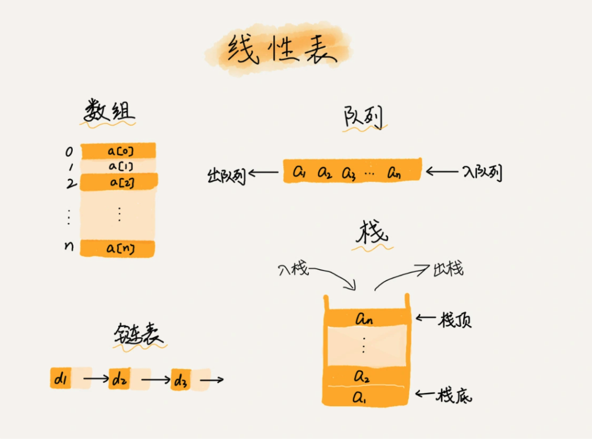
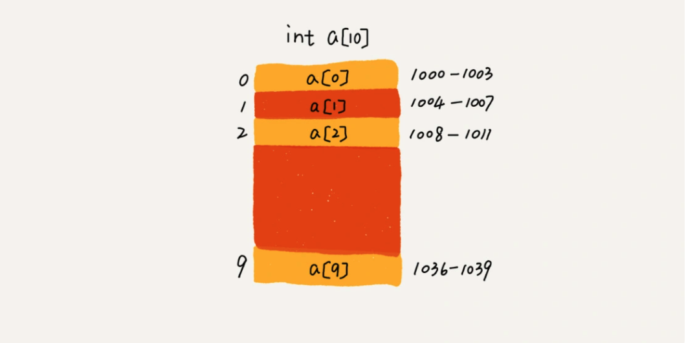

# 问题列表

[关于复杂度分析的工具有哪些？](#complexity)

## 数组

[为什么很多编程语言中数组都从0开始编号？](#array_index)

[数组和链表的区别？](#array_list)

[一维数组是如何实现根据下标随机访问数组元素的呢？二维数组的寻址方式又是什么？](#array_random)


## 链表

[如何实现 LRU 缓存淘汰算法?](#lru)

[手写常见五个链表操作之【单链表反转】。](#reverse linked list)

[手写常见五个链表操作之【链表中环的检测】](#ring_linked_list)

[手写常见五个链表操作之【两个有序的链表合并】](#_linked_list)

[手写常见五个链表操作之【两个有序的链表合并】](#_linked_list)

[手写常见五个链表操作之【求链表的中间结点】](#_linked_list)


# 解答列表

## 数组

<span id="array_index">为什么很多编程语言中数组都从0开始编号？</span>

> 从0开始编号的内存地址公式：a[k]_address = base_address + k * type_size
>
> 从1开始编号的内存地址公式：a[k]_address = base_address + (k-1)*type_size 
>
> 如果从 1 开始编号，每次随机访问数组元素都多了一次减法运算，对于 CPU 来说，就是多了一次减法指令。这对于极致的效率优化并不是最佳方式。

从数组存储的内存模型上来看，下标最确切的定义应该是偏移（offset）。如果用 a 来表示数组的首地址，a[0]就是偏移为 0 的位置，也就是首地址，a[k]就表示偏移 k 个 type_size 的位置，所以计算 a[k]的内存地址只需要用这个公式：

```go
a[k]_address = base_address + k * type_size
```

如果数组从 1 开始计数，那我们计算数组元素 a[k]的内存地址就会变为：

```go
a[k]_address = base_address + k * type_size
```

对比两个公式，我们不难发现，从 1 开始编号，每次随机访问数组元素都多了一次减法运算，对于 CPU 来说，就是多了一次减法指令。

数组作为非常基础的数据结构，通过下标随机访问数组元素又是其非常基础的编程操作，效率的优化就要尽可能做到极致。所以为了减少一次减法操作，数组选择了从 0 开始编号，而不是从 1 开始。

<span id="array_list">数组和链表的区别？</span>

> 链表适合插入、删除，时间复杂度 O(1)；
>
> 数组适合查找，数组支持随机访问，根据下标随机访问的时间复杂度为 O(1)，排好序的数组，用二分查找，时间复杂度也是 O(logn)。

专业的解释：数组（`Array`）是一种线性表数据结构。它用一组连续的内存空间，来存储一组具有相同类型的数据。



数组用一块连续的内存空间，来存储相同类型的一组数据，最大的特点就是支持随机访问，但插入、删除操作也因此变得比较低效，平均情况时间复杂度为 O(n)。


<span id="array_random">一维数组是如何实现根据下标随机访问数组元素的呢？二维数组的寻址方式又是什么？</span>

> 通过寻址公式，计算内存地址，然后通过地址来访问内存中的元素。
>
> a[i]_address = base_address + i * data_type_size

假设用一个长度为 10 的 int 类型的数组 `int[] a = new int[10]`来举例。如下图所示，计算机会给数组 a[10]，分配了一块连续内存空间 1000～1039，其中，内存块的首地址为 base_address = 1000。



计算机会给每个内存单元分配一个地址，计算机通过地址来访问内存中的数据。当计算机需要随机访问数组中的某个元素时，它会首先通过下面的寻址公式，计算出该元素存储的内存地址：

```go
a[i]_address = base_address + i * data_type_size
```

其中 data_type_size 表示数组中每个元素的大小。我们举的这个例子里，数组中存储的是 int 类型数据，所以 data_type_size 就为 4 个字节。

二维数组内存寻址：对于 `m * n` 的数组，`a[i][j](i < m,j < n)`的地址为：

```go
address = base_address + ( i * n + j) * type_size
```


## 链表

<span id="lru">如何实现 LRU 缓存淘汰算法?</span>

常见的策略有三种：先进先出策略 FIFO(First In，First Out)、最少使用策略 LFU(Least Frequently Used)、最近最少使用策略 LRU(Least Recently Used)。

实现思路：通过维护一个有序单链表，越靠近链表尾部的结点是越早之前访问的。当有一个新的数据被访问时，我们从链表头开始顺序遍历链表。


* 如果此数据之前已经被缓存在链表中了，我们遍历得到这个数据对应的结点，并将其从原来的位置删除，然后再插入到链表的头部。
* 如果此数据没有在缓存链表中，又可以分为两种情况:
  ① 如果此时缓存未满，则将此结点直接插入到链表的头部;
  ②  如果此时缓存已满，则链表尾结点删除，将新的数据结点插入链表的头部。