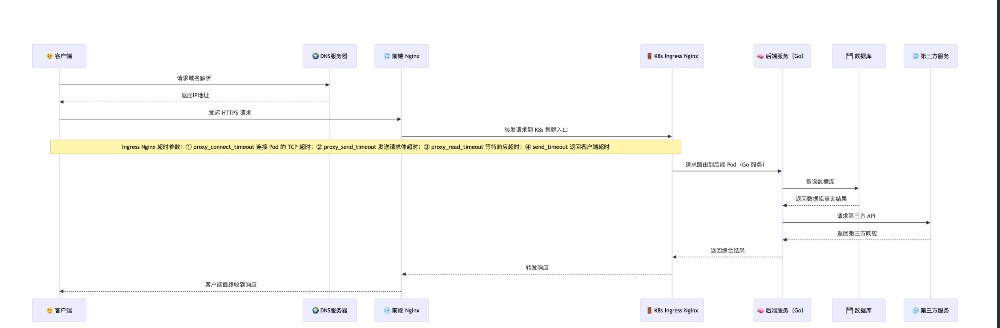
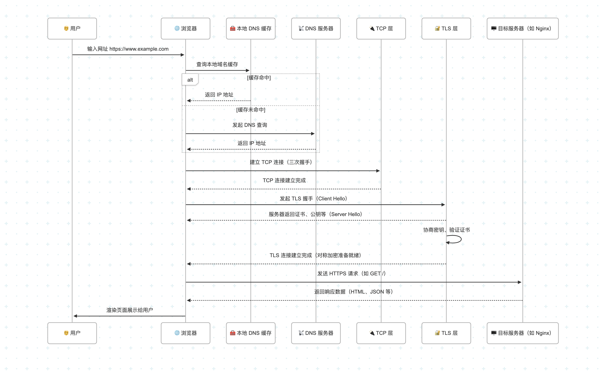
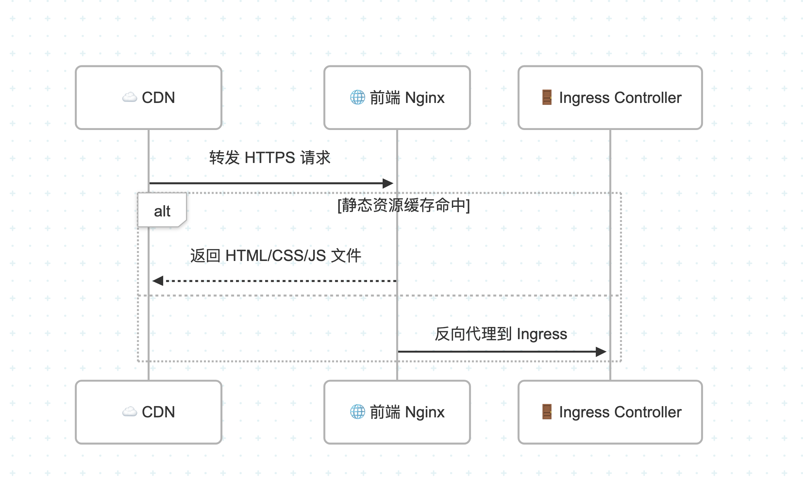
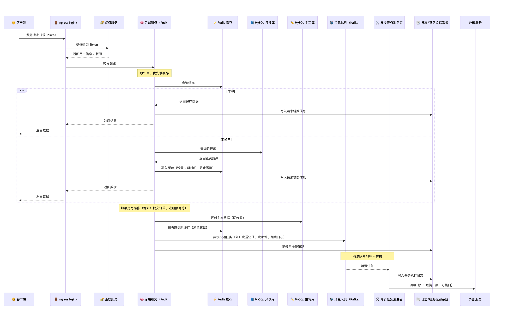
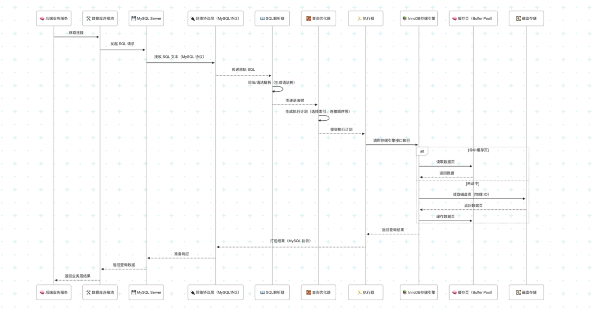
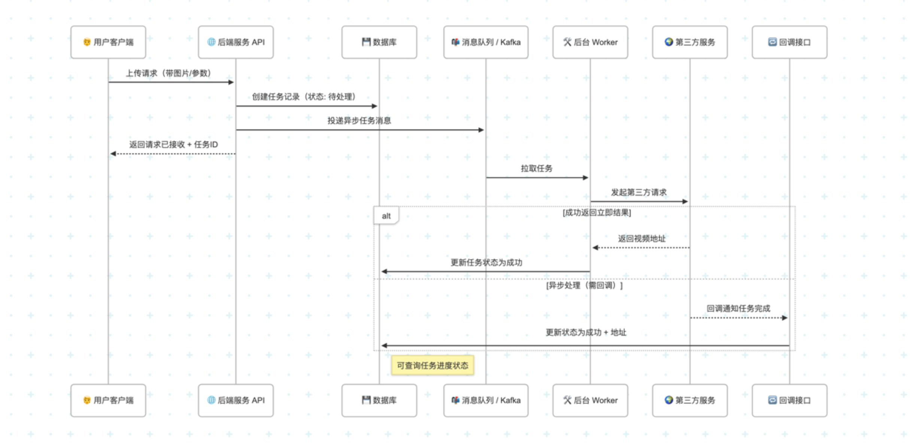


时序图在线网址：https://mermaid.live


# 完整 http 请求流程



时序图：

```
sequenceDiagram
    participant User as 🧑 客户端
    participant DNS as 🌍 DNS服务器
    participant FrontNginx as 🌐 前端 Nginx
    participant Ingress as 🚪 K8s Ingress Nginx
    participant Backend as 🧠 后端服务（Go）
    participant DB as 💾 数据库
    participant 3rd as 🌐 第三方服务

    User->>DNS: 请求域名解析
    DNS-->>User: 返回IP地址

    User->>FrontNginx: 发起 HTTPS 请求
    FrontNginx->>Ingress: 转发请求到 K8s 集群入口

    %% 合并为一行注释，避免换行错误
    Note over User,Ingress: Ingress Nginx 超时参数：① proxy_connect_timeout 连接 Pod 的 TCP 超时；② proxy_send_timeout 发送请求体超时；③ proxy_read_timeout 等待响应超时；④ send_timeout 返回客户端超时

    Ingress->>Backend: 请求路由到后端 Pod（Go 服务）
    Backend->>DB: 查询数据库
    DB-->>Backend: 返回数据库查询结果

    Backend->>3rd: 请求第三方 API
    3rd-->>Backend: 返回第三方响应

    Backend-->>Ingress: 返回综合结果
    Ingress-->>FrontNginx: 转发响应
    FrontNginx-->>User: 客户端最终收到响应

```

## 1.1 客户端请求发起全过程


完整时序图：

```
sequenceDiagram
    participant User as 🧑 用户
    participant Browser as 🌐 浏览器
    participant DNSCache as 🧰 本地 DNS 缓存
    participant DNS as 📡 DNS 服务器
    participant TCP as 🔌 TCP 层
    participant TLS as 🔐 TLS 层
    participant Server as 🖥️ 目标服务器（如 Nginx）

    User->>Browser: 输入网址 https://www.example.com
    Browser->>DNSCache: 查询本地域名缓存
    alt 缓存命中
        DNSCache-->>Browser: 返回 IP 地址
    else 缓存未命中
        Browser->>DNS: 发起 DNS 查询
        DNS-->>Browser: 返回 IP 地址
    end

    Browser->>TCP: 建立 TCP 连接（三次握手）
    TCP-->>Browser: TCP 连接建立完成

    Browser->>TLS: 发起 TLS 握手（Client Hello）
    TLS-->>Browser: 服务器返回证书、公钥等（Server Hello）
    TLS->>TLS: 协商密钥、验证证书
    TLS-->>Browser: TLS 连接建立完成（对称加密准备就绪）

    Browser->>Server: 发送 HTTPS 请求（如 GET /）
    Server-->>Browser: 返回响应数据（HTML、JSON 等）

    Browser->>User: 渲染页面展示给用户
```

## 1.2 DNS 域名解析流程



时序图：

```
sequenceDiagram
    participant Client as 🧑 客户端浏览器/系统
    participant LocalDNS as 🧰 本地 DNS 缓存
    participant DNSResolver as 📡 递归 DNS 服务器（ISP 或企业）
    participant Root as 🌐 根 DNS 服务器
    participant TLD as 🏛 顶级域名服务器（.com）
    participant Authoritative as 🧭 权威 DNS（example.com）

    Client->>LocalDNS: 查询 www.example.com
    alt 缓存命中
        LocalDNS-->>Client: 返回 IP 地址（缓存结果）
    else 缓存未命中
        LocalDNS->>DNSResolver: 转发 DNS 查询请求

        DNSResolver->>Root: 请求 www.example.com
        Root-->>DNSResolver: 返回 .com TLD 服务器地址

        DNSResolver->>TLD: 请求 www.example.com
        TLD-->>DNSResolver: 返回 example.com 权威服务器地址

        DNSResolver->>Authoritative: 请求 www.example.com
        Authoritative-->>DNSResolver: 返回 www.example.com 的 IP

        DNSResolver-->>LocalDNS: 返回查询结果（并缓存）
        LocalDNS-->>Client: 返回 IP 地址
    end
```

## 1.3 CDN 命中 + 回源 + 缓存更新流程


时序图：

```
sequenceDiagram
    participant Client as 🧑 客户端浏览器 / App
    participant CDN as 🌍 CDN 边缘节点
    participant Origin as 🏢 源站（如 OSS/Nginx/后端服务）
    participant DB as 💾 数据库 / 文件存储（如 OSS）
    
    Client->>CDN: 请求资源（如 /videos/123.mp4）
    alt CDN 命中缓存
        CDN-->>Client: 直接返回缓存内容
    else CDN 未命中
        CDN->>Origin: 发起回源请求
        Origin->>DB: 读取文件 / 查询数据库
        DB-->>Origin: 返回资源内容
        Origin-->>CDN: 返回资源 & 设置缓存规则
        CDN-->>Client: 返回资源内容
    end

    Note over CDN: 后续请求将直接命中缓存（有效期内）

    alt 缓存过期 / 配置刷新
        CDN->>Origin: 重新发起回源请求
        Origin-->>CDN: 更新内容
        CDN-->>Client: 返回新资源
    end
```

## 1.4 前端 Nginx 接收请求并转发



时序图：

```
sequenceDiagram
    participant CDN as ☁️ CDN
    participant FrontNginx as 🌐 前端 Nginx
    participant Ingress as 🚪 Ingress Controller

    CDN->>FrontNginx: 转发 HTTPS 请求
    alt 静态资源缓存命中
        FrontNginx-->>CDN: 返回 HTML/CSS/JS 文件
    else
        FrontNginx->>Ingress: 反向代理到 Ingress
    end
```


## 1.5 Ingress Controller 转发请求


时序图：

```
sequenceDiagram
    participant FrontNginx as 🌐 前端 Nginx
    participant Ingress as 🚪 Ingress Nginx
    participant Pod as 🧠 后端服务（Pod）

    FrontNginx->>Ingress: 转发请求
    Note right of Ingress: 
        proxy_connect_timeout、proxy_send_timeout、proxy_read_timeout、send_timeout
    Ingress->>Pod: 根据路由规则转发请求
    Pod-->>Ingress: 返回响应
    Ingress-->>FrontNginx: 返回响应
```

## 1.6 高并发场景下的处理流程



时序图：

```
sequenceDiagram
    participant Client as 🧑 客户端
    participant Ingress as 🚪 Ingress Nginx
    participant Service as 🧠 后端服务（Pod）
    participant Redis as ⚡ Redis 缓存
    participant DB as 💾 MySQL 数据库
    participant MQ as 📬 消息队列（Kafka）

    Client->>Ingress: 发送请求
    Ingress->>Service: 转发请求
    Service->>Redis: 查询缓存
    alt 缓存命中
        Redis-->>Service: 返回数据
        Service-->>Ingress: 响应结果
        Ingress-->>Client: 返回数据
    else 缓存未命中
        Service->>DB: 查询数据库
        DB-->>Service: 返回结果
        Service->>Redis: 缓存写入（设置过期）
        Service-->>Ingress: 返回数据
        Ingress-->>Client: 返回数据
    end

    Note over Service, MQ: 如果为写操作或耗时任务
    Service->>MQ: 投递异步消息

```


## 1.7 访问 MySQL 的详细流程



时序图：

```
sequenceDiagram
    participant Service as 🧠 后端业务服务
    participant DBPool as 🛠 数据库连接池
    participant MySQL as 💾 MySQL Server
    participant Protocol as 🔌 网络协议层（MySQL协议）
    participant Parser as 📖 SQL解析器
    participant Optimizer as 🧮 查询优化器
    participant Executor as 🏃 执行器
    participant InnoDB as 📚 InnoDB存储引擎
    participant BufferPool as 🧠 缓存页（Buffer Pool）
    participant Disk as 💽 磁盘存储

    Service->>DBPool: 获取连接
    DBPool->>MySQL: 发起 SQL 请求

    MySQL->>Protocol: 接收 SQL 文本（MySQL 协议）
    Protocol-->>Parser: 传递原始 SQL

    Parser->>Parser: 词法/语法解析（生成语法树）
    Parser-->>Optimizer: 传递语法树

    Optimizer->>Optimizer: 生成执行计划（选择索引、连接顺序等）
    Optimizer-->>Executor: 提交执行计划

    Executor->>InnoDB: 调用存储引擎接口执行

    alt 命中缓存页
        InnoDB->>BufferPool: 读取数据页
        BufferPool-->>InnoDB: 返回数据
    else 未命中
        InnoDB->>Disk: 读取磁盘页（物理 IO）
        Disk-->>InnoDB: 返回数据页
        InnoDB->>BufferPool: 缓存数据页
    end

    InnoDB-->>Executor: 返回查询结果
    Executor-->>Protocol: 打包结果（MySQL 协议）
    Protocol-->>MySQL: 准备响应
    MySQL-->>DBPool: 返回查询数据
    DBPool-->>Service: 返回业务层结果
```


## 1.8 第三方同步请求 + 异步调用 + 回调



时序图：

```
sequenceDiagram
    participant Client as 🧑 用户客户端
    participant API as 🌐 后端服务 API
    participant DB as 💾 数据库
    participant MQ as 📬 消息队列 / Kafka
    participant Worker as 🛠 后台 Worker
    participant Third as 🌍 第三方服务
    participant Callback as 🔁 回调接口

    Client->>API: 上传请求（带图片/参数）
    API->>DB: 创建任务记录（状态: 待处理）
    API->>MQ: 投递异步任务消息
    API-->>Client: 返回请求已接收 + 任务ID

    MQ->>Worker: 拉取任务
    Worker->>Third: 发起第三方请求
    alt 成功返回立即结果
        Third-->>Worker: 返回视频地址
        Worker->>DB: 更新任务状态为成功
    else 异步处理（需回调）
        Third-->>Callback: 回调通知任务完成
        Callback->>DB: 更新状态为成功 + 地址
    end

    Note right of DB: 可查询任务进度状态
```