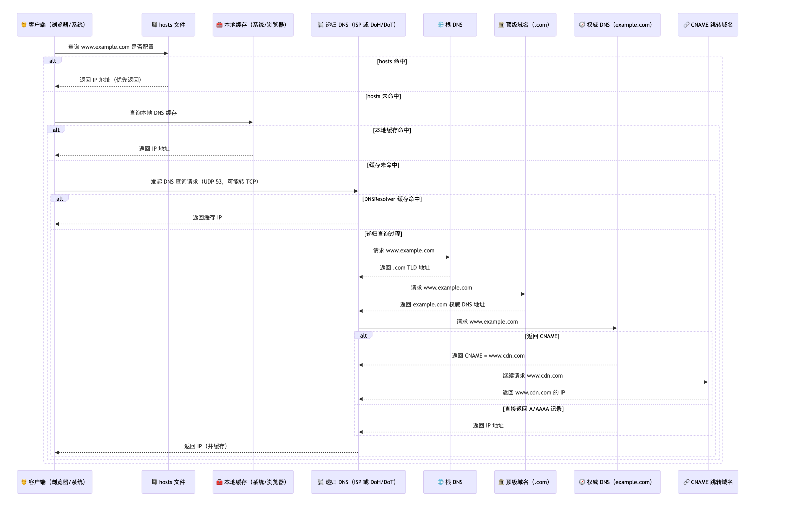
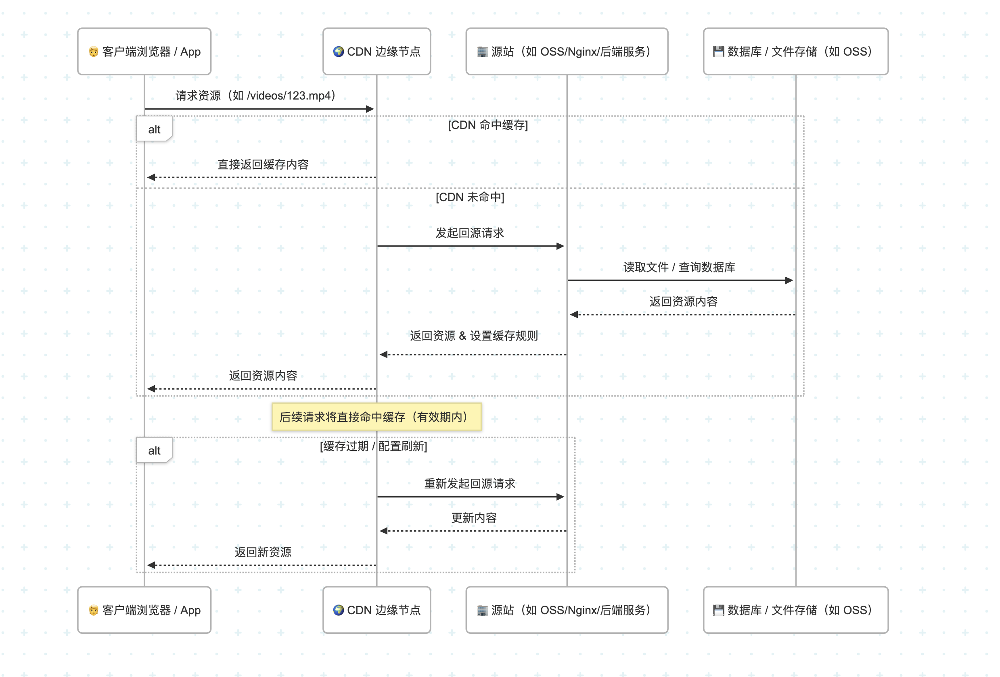
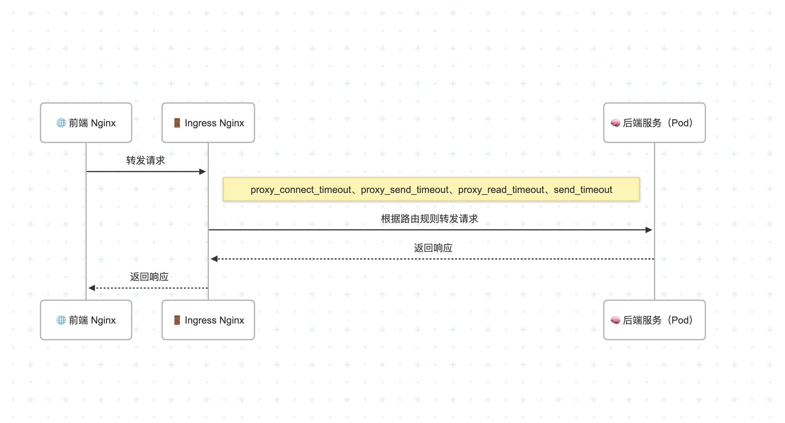
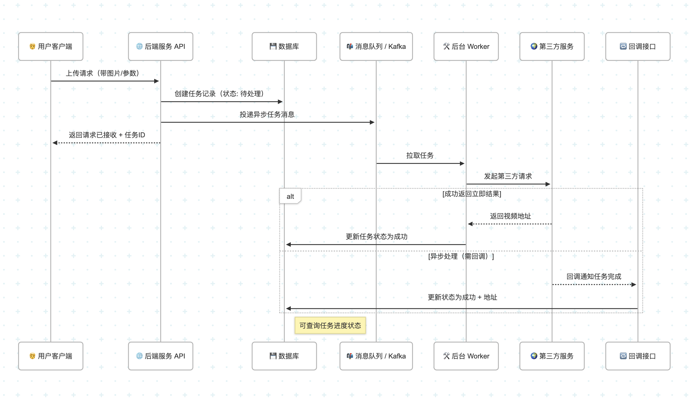

时序图在线网址：https://mermaid.live

# 负载均衡SLB L4和L7


四层负载均衡（L4）:

* 基于TCP/UDP协议进行转发。

* 工作在 传输层（OSI 第4层）。

* 不解析 HTTP 请求内容，仅基于 IP+端口进行转发。

* 快速高效，适合高吞吐、低延迟场景（如 RPC、gRPC、数据库代理等）。

七层负载均衡（L7）:

* 基于 HTTP/HTTPS 协议 进行转发。

* 工作在 应用层（OSI 第7层）。

* 能解析 HTTP 头、URI、方法（GET/POST）、Cookie 等，实现精准路由（如路径匹配、Header判断等）。

* 支持 WAF、安全策略、流量灰度、A/B测试等。

使用场景对比：

| 项目    | 四层转发（L4）     | 七层转发（L7）                |
| ----- | ------------ | ----------------------- |
| 工作层级  | 传输层（TCP/UDP） | 应用层（HTTP/HTTPS）         |
| 传输协议  | TCP/UDP      | HTTP/HTTPS              |
| 性能    | 高            | 相对低（需内容解析）              |
| 路由能力  | 基于IP+端口      | 可基于路径、Header等           |
| 支持的功能 | 连接分发，透明代理    | URI路由、Cookie路由、灰度发布、WAF |
| 常见场景  | 数据库、RPC服务    | Web服务、微服务API网关          |


# TCP 三次握手 四次挥手


时序图：

```
sequenceDiagram
    participant Client as 🧑 Client（主动方）
    participant Server as 🖥️ Server（被动方）

    %% === 建立连接：三次握手 ===
    Note over Client,Server: 🔐 TCP 三次握手 - 建立连接

    Client->>Server: SYN (seq=x)
    Note right of Client: SYN_SENT 状态

    Server->>Client: SYN+ACK (seq=y, ack=x+1)
    Note right of Server: SYN_RECEIVED 状态

    Client->>Server: ACK (ack=y+1)
    Note right of Client: ESTABLISHED 状态
    Note right of Server: ESTABLISHED 状态

    %% === 连接释放：四次挥手 ===
    Note over Client,Server: 🔚 TCP 四次挥手 - 断开连接

    Client->>Server: FIN (seq=u)
    Note right of Client: FIN_WAIT_1 状态

    Server->>Client: ACK (ack=u+1)
    Note right of Server: CLOSE_WAIT 状态
    Note right of Client: FIN_WAIT_2 状态

    Server-->>Server: 应用层处理完业务，准备关闭连接...

    Server->>Client: FIN (seq=v)
    Note right of Server: LAST_ACK 状态

    Client->>Server: ACK (ack=v+1)
    Note right of Client: TIME_WAIT 状态（等待 2MSL）

    Note right of Client: 最终进入 CLOSED 状态
    Note right of Server: CLOSED 状态
```


讲解：

```
TCP 三次握手和四次挥手，是 TCP 协议中的重要步骤，是建立可靠连接和断开连接的必要步骤。

TCP 三次握手，目的是在客户端与服务端之间建立可靠连接，确保双方都具备收发能力。

TCP 四次挥手，目的是在双方都确认数据传输完成之后，优雅地释放连接。

对于三次握手的每步解析：

1、客户端发送 SYN：客户端发送 SYN 报文，seq=x，状态变为 SYN_SENT。

2、服务端响应 SYN+ACK：服务端收到客户端 SYN，返回 SYN+ACK，seq=y，ack=x+1，状态变为 SYN_RECEIVED。

3、客户端确认 ACK：客户端收到服务端 SYN+ACK，发送 ACK 报文，ack=y+1，状态变为 ESTABLISHED。

三次握手确保了客户端和服务端都能“发”和“收”数据，防止“已失效连接的错误建立”。

为什么三次握手而不是两次或者四次？

假设是两次握手，服务端无法确认客户端是否已收到数据，从而无法确认连接是否正常。

问题1：无法确认客户端能否接收数据

服务端发了 SYN+ACK，以为连接建立好了，就开始发送数据。但客户端如果此时宕机了，或者网络异常，

根本收不到 SYN+ACK 的数据，连接就会半开（服务端以为连接建立，客户端并不知道）。


问题2：可能出现“伪连接”或“死连接”

1、客户端发送了 SYN，但由于网络延迟或缓存，这个包在网络中“滞留”了；

2、客户端后来超时没有响应，关闭了这次连接；

3、这时候滞留的 SYN 到达了服务端；

4、服务端发送 SYN+ACK 并进入 SYN_RECEIVED 状态，等待客户端 ACK；

5、客户端此时并不打算建立连接，但服务端仍然认为连接正在建立中，占用了资源。

三次握手中的最后一个 ACK 就是为了确认这个连接是“新的、真实的”连接，而不是“旧的、过期的 SYN 包”引发的伪连接。

类比理解：三次握手就像打电话前的确认

1、你打电话（拨号） → 第一次

2、对方接起电话并说“喂？” → 第二次

3、你说“喂，我能听见你” → 第三次

如果你不说第三次，对方不知道你是否能听见，可能白说了一堆话（就像服务端发了数据却没人接收）。

为什么不是四次？

是因为三次刚好能确保双向通信（我能发、你能收，我也能收、你也能发），确认连接的请求是有效的、最新的。

如果用四次，其实只会多一次确认，意义不大，反而浪费资源。


对于四次挥手的每步解析：

1、客户端发送 FIN：客户端发送 FIN 报文，seq=u，状态变为 FIN_WAIT_1，表示无数据要发了，请求关闭，

2、服务端确认 ACK：服务端收到客户端 FIN，发送 ACK，ack=u+1，服务端状态变为 CLOSE_WAIT。

3、服务端发送 FIN：应用层确认业务完成，准备关闭连接，发送 FIN 报文，seq=v，状态变为 LAST_ACK。

4、客户端确认 ACK：客户端收到服务端 FIN，发送 ACK，ack=v+1，客户端状态变为 TIME_WAIT（等待 2 倍 MSL，防止丢包），最终变为 CLOSED。

为什么需要四次挥手？

因为 TCP 是全双工通信协议，关闭连接必须确保客户端和服务端都完成数据传输和确认。因此每一端都需单独发送 FIN 和 ACK。

TIME_WAIT 状态的作用是什么？

确保最后的 ACK 能被服务端接收（防止 ACK 丢失导致对方重发 FIN）；

防止“旧连接残留数据”污染后续连接；持续时间为 2×MSL（Maximum Segment Lifetime，报文最大生存时间）。

```

术语：

* SYN:  Synchronize Sequence，表示“开始建立连接”，用于初始化连接。

* SYS_SENT（主动关闭方）：表示客户端已经发送了 SYN 请求，等待服务器确认（SYN+ACK）。

* SYN_RECEIVED（被动关闭方）：表示服务端已经收到客户端的 SYN 请求，等待客户端确认（ACK）。

* FIN：Finish，表示“我已经没有数据要发了”，请求断开连接。

* ACK：Acknowledgment，表示“我已收到数据”，用于确认数据传输。

* FIN_WAIT_1（主动关闭方）：表示客户端已经发送了 FIN 请求，等待服务器确认（ACK）这个请求。

* FIN_WAIT_2（被动关闭方）：表示客户端已经收到了服务端的 ACK，但还在等待服务端也发送 FIN，即对方业务未完全关闭。

* LAST_ACK（被动关闭方）：表示服务端已经发出了自己的 FIN，但还在等待客户端的 ACK。

* TIME_WAIT（主动关闭方）：表示客户端已经发出 ACK，但要等待一段时间（通常 2×MSL）后，才能完全关闭连接。


三次握手：

| 第几次          | 作用             | 解决什么问题             |
| ------------ | -------------- | ------------------ |
| 第一次（SYN）     | 客户端请求建立连接      | 告诉服务端我准备好了         |
| 第二次（SYN+ACK） | 服务端响应并表明也准备好了  | 告诉客户端“我能收你数据并能发”   |
| 第三次（ACK）     | 客户端确认收到了服务端的响应 | 确认服务端能“收发”数据、连接没过期 |


四次挥手状态：

| 状态           | 常见问题         | 应对方案                |
| ------------ | ------------ | ------------------- |
| `TIME_WAIT`  | 高并发下端口被占满    | 短连接、端口复用、优化内核参数（慎用） |
| `FIN_WAIT_2` | 卡住连接未释放      | 检查服务端是否未正常发送 FIN    |
| `LAST_ACK`   | 持续不释放        | 确认服务端是否正确关闭连接       |
| `CLOSE_WAIT` | 服务端未调用 close | 检查应用逻辑是否“忘记”释放资源    |


三次握手四次挥手的对比：

| 阶段   | 步数 | 报文类型                  | 状态变化                 | 目的     |
| ---- | -- | --------------------- | -------------------- | ------ |
| 三次握手 | 3  | SYN → SYN+ACK → ACK   | CLOSED → ESTABLISHED | 建立可靠连接 |
| 四次挥手 | 4  | FIN → ACK → FIN → ACK | ESTABLISHED → CLOSED | 优雅断开连接 |


# 完整 http 请求流程


时序图：

```
sequenceDiagram
    participant User as 🧑 客户端
    participant DNS as 🌍 DNS服务器
    participant FrontNginx as 🌐 前端 Nginx
    participant Ingress as 🚪 K8s Ingress Nginx
    participant Backend as 🧠 后端服务（Go）
    participant DB as 💾 数据库
    participant 3rd as 🌐 第三方服务

    User->>DNS: 请求域名解析
    DNS-->>User: 返回IP地址

    User->>FrontNginx: 发起 HTTPS 请求
    FrontNginx->>Ingress: 转发请求到 K8s 集群入口

    %% 合并为一行注释，避免换行错误
    Note over User,Ingress: Ingress Nginx 超时参数：① proxy_connect_timeout 连接 Pod 的 TCP 超时；② proxy_send_timeout 发送请求体超时；③ proxy_read_timeout 等待响应超时；④ send_timeout 返回客户端超时

    Ingress->>Backend: 请求路由到后端 Pod（Go 服务）
    Backend->>DB: 查询数据库
    DB-->>Backend: 返回数据库查询结果

    Backend->>3rd: 请求第三方 API
    3rd-->>Backend: 返回第三方响应

    Backend-->>Ingress: 返回综合结果
    Ingress-->>FrontNginx: 转发响应
    FrontNginx-->>User: 客户端最终收到响应

```

## 1.1 客户端请求发起全过程


完整时序图：

```
sequenceDiagram
    participant User as 🧑 用户
    participant Browser as 🌐 浏览器
    participant DNSCache as 🧰 本地 DNS 缓存
    participant DNS as 📡 DNS 服务器
    participant TCP as 🔌 TCP 层
    participant TLS as 🔐 TLS 层
    participant Server as 🖥️ 目标服务器（如 Nginx）

    User->>Browser: 输入网址 https://www.example.com
    Browser->>DNSCache: 查询本地域名缓存
    alt 缓存命中
        DNSCache-->>Browser: 返回 IP 地址
    else 缓存未命中
        Browser->>DNS: 发起 DNS 查询
        DNS-->>Browser: 返回 IP 地址
    end

    Browser->>TCP: 建立 TCP 连接（三次握手）
    TCP-->>Browser: TCP 连接建立完成

    Browser->>TLS: 发起 TLS 握手（Client Hello）
    TLS-->>Browser: 服务器返回证书、公钥等（Server Hello）
    TLS->>TLS: 协商密钥、验证证书
    TLS-->>Browser: TLS 连接建立完成（对称加密准备就绪）

    Browser->>Server: 发送 HTTPS 请求（如 GET /）
    Server-->>Browser: 返回响应数据（HTML、JSON 等）

    Browser->>User: 渲染页面展示给用户
```

## 1.2 DNS 域名解析流程



时序图：

```
sequenceDiagram
    participant Client as 🧑 客户端（浏览器/系统）
    participant Hosts as 📓 hosts 文件
    participant LocalCache as 🧰 本地缓存（系统/浏览器）
    participant DNSResolver as 📡 递归 DNS（ISP 或 DoH/DoT）
    participant Root as 🌐 根 DNS
    participant TLD as 🏛 顶级域名（.com）
    participant Authoritative as 🧭 权威 DNS（example.com）
    participant CNAME as 🔗 CNAME 跳转域名

    Client->>Hosts: 查询 www.example.com 是否配置
    alt hosts 命中
        Hosts-->>Client: 返回 IP 地址（优先返回）
    else hosts 未命中
        Client->>LocalCache: 查询本地 DNS 缓存
        alt 本地缓存命中
            LocalCache-->>Client: 返回 IP 地址
        else 缓存未命中
            Client->>DNSResolver: 发起 DNS 查询请求（UDP 53，可能转 TCP）

            alt DNSResolver 缓存命中
                DNSResolver-->>Client: 返回缓存 IP
            else 递归查询过程
                DNSResolver->>Root: 请求 www.example.com
                Root-->>DNSResolver: 返回 .com TLD 地址

                DNSResolver->>TLD: 请求 www.example.com
                TLD-->>DNSResolver: 返回 example.com 权威 DNS 地址

                DNSResolver->>Authoritative: 请求 www.example.com
                alt 返回 CNAME
                    Authoritative-->>DNSResolver: 返回 CNAME = www.cdn.com
                    DNSResolver->>CNAME: 继续请求 www.cdn.com
                    CNAME-->>DNSResolver: 返回 www.cdn.com 的 IP
                else 直接返回 A/AAAA 记录
                    Authoritative-->>DNSResolver: 返回 IP 地址
                end

                DNSResolver-->>Client: 返回 IP（并缓存）

            end
        end
    end
```

讲解：

```
DNS 的全称是，Domain Name System，中文名是域名系统。

DNS 的作用是把域名（如 www.example.com）转换成对应的 IP 地址（93.184.216.34）。

为什么要进行 DNS 查询？当你在浏览器输入 www.example.com 时，计算机并不直接理解这个“域名”。

它需要把这个域名翻译成对应的 IP 地址（比如 93.184.216.34）才能进行网络通信。

这个翻译工作就是 DNS（域名系统） 的职责。

整个 DNS 查询的过程：

1. 通过浏览器输入 www.example.com，浏览器会先检查本地的 hosts 文件，看看是否配置了 www.example.com 的 IP 地址。

如果 www.example.com 在 hosts 里有配置，那么系统会直接返回对应 IP，完全不会发起 DNS 查询。

2. 如果 hosts 文件没有配置对应域名的 IP，则会查询本地 DNS 缓存，本地查询的过程包含多个缓存层级，分别包含应用层缓存（如浏览器）：Chrome、火狐 等浏览器本身就会缓存解析过的域名。

，还有就是操作系统缓存，系统（如 Windows/macOS）维护一个 DNS 缓存，常通过 ipconfig /displaydns 查看。

3. 当 hosts 文件和本地 DNS 缓存 都未命中时，则会发起递归 DNS 查询。但递归 DNS 服务器，比如运营商（电信/移动）、公有 DNS（Google、Cloudflare） 也有 本地缓存机制。

如果递归服务器之前查过 www.example.com，就可以直接从它的缓存返回结果，这会省去 根DNS、顶级域名服务器、权威 DNS服务器的所有步骤。

4. 如果递归服务器未命中，则会从根服务器开始查询，根服务器是互联网 DNS 系统的起点，相当于一个超大的导航员，由 ICANN 组织协调，全球13组根服务器。

如果根服务器没有找到，则会从 TLD 顶级域名服务器（Top-Level Domain）开始查询，如果不存在，TLD又会去找权威 DNS 服务器，权威 DNS（Authoritative）它是真正掌管 example.com 的 DNS 服务，比如由网站运营者或云服务商提供。

这里需要注意的是，不同类型的查询可能走不同路径，如果实际 DNS 查询中涉及 CNAME 别名，会先查出真实域名，再继续解析，其中 A 记录常见查询的是 IPv4 地址，AAAA 记录则是查询 IPv6 地址。

5. 经过上面一系列 DNS 查询操作，递归服务器把 IP 拿到手，先缓存一份以备下次查询，再返回给本地 DNS 缓存（系统），最终返回给客户端程序（浏览器），浏览器就可以用这个 IP 去连接网站。


为了更好的理解递归 DNS (Recursive Resolver)、根 DNS (Root Server)、

顶级域名服务器(TLD Server)、权威 DNS (Authoritative Server)，

可以做一个通俗易懂+类比讲解：

当你上网输入一个网址时（比如 www.example.com），为了找到它对应的 IP 地址，

DNS 系统会从“能帮你打听的中介（递归 DNS）”，一路问到“真正掌管这个网址的人（权威 DNS）”，

而中间还要经过“国家级地址簿（根 DNS）”和“后缀专管局（顶级域名服务器）”。


总结一句话：

浏览器不认识域名，得靠 DNS 把 www.example.com 转换成 IP 地址。

这个过程像打电话找人，先问自己有没有号码，没有就一路问：根 → 顶级域名 .com → 权威DNS example.com → 最终拿到 IP！

```

四类 DNS 角色对比讲解

| 名称                                   | 定义                                       | 类比                      | 举例                                        |
|--------------------------------------|------------------------------------------|-------------------------|-------------------------------------------|
| **递归 DNS**<br>(Recursive Resolver)   | 你电脑请求的第一站，会帮你一路打听、递归查询直到拿到结果             | 🔍 贴心“中介”或“外卖骑手”        | 你家宽带运营商的 DNS，或 Cloudflare 的 `1.1.1.1`     |
| **根 DNS**<br>(Root Server)           | DNS 系统的顶级入口点，告诉你“去哪个后缀管辖区查”              | 🌐 国家总档案馆               | 全球有 13 组，常返回 `.com` `.org` 等负责单位          |
| **顶级域名服务器**<br>(TLD Server)          | 每个域名后缀的“管辖局”，告诉你 `example.com` 属于哪个权威服务器 | 🏛 ".com 管理局"、".cn 管理局" | `.com`、`.cn`、`.org` 对应的 TLD 服务器           |
| **权威 DNS**<br>(Authoritative Server) | 实际掌管某个域名记录的服务器，**它说了算**                  | 🧭 “房主本人”               | example.com 设置的 DNS，如阿里云 DNS、Cloudflare 等 |


优化后的文案：

```
DNS 的全称是 Domain Name System，中文名为“域名系统”。

它的作用是将我们输入的网址（如 [www.example.com）转换成计算机可以识别的](http://www.example.com）转换成计算机可以识别的) IP 地址（如 93.184.216.34），从而建立网络连接。

为什么需要 DNS 查询？
当你在浏览器中输入一个网址时，计算机并不直接认识这些“人类友好”的域名。它必须先把域名翻译成数字型 IP 地址，才能找到并连接对应的网站。这项“翻译工作”就是 DNS 系统的职责。

DNS 查询的完整流程如下：

首先，浏览器会查看系统的 hosts 文件，是否手动配置了 [www.example.com](http://www.example.com) 的 IP 地址。
如果有，系统会直接返回该 IP，不会发起任何 DNS 查询。
如果没有，继续下一步。

系统会检查本地的 DNS 缓存，包括浏览器缓存（如 Chrome、Firefox 会保存最近访问的域名）以及操作系统缓存（Windows/macOS 等系统级缓存）。
如果缓存命中，直接使用；如果未命中，就进入网络查询流程。

接下来，系统会将请求发给递归 DNS 服务器（Recursive Resolver），它通常由网络运营商（如电信、移动）或公共 DNS 服务（如 Google 的 8.8.8.8，Cloudflare 的 1.1.1.1）提供。
递归 DNS 本身也可能缓存了查询结果。如果命中缓存，就直接返回 IP 地址；否则继续向上游服务器发起递归解析。

首先，递归 DNS 会访问根 DNS 服务器（Root Server），这些是互联网 DNS 系统的起点，由 ICANN 协调管理，全球共有 13 组。
根服务器不会直接提供 IP 地址，而是告诉你 `.com` 顶级域名的服务器地址。

然后，递归 DNS 访问 `.com` 的顶级域名服务器（TLD Server），它负责管理 `.com` 后缀下的所有域名。
TLD 会告诉递归服务器：`example.com` 的权威 DNS 服务器地址。

接着，递归 DNS 访问 `example.com` 的权威 DNS 服务器（Authoritative Server），它掌握着 `www.example.com` 的最终解析记录。
服务器会返回该域名的 IP 地址。A 记录表示 IPv4 地址，AAAA 记录表示 IPv6 地址。
如果该域名是一个 CNAME（别名记录），则会先返回真实域名，再继续进行解析，直到拿到最终的 IP。

拿到 IP 地址后，递归 DNS 会将该结果缓存起来以提升后续查询效率，并将 IP 返回给本地操作系统，操作系统再传给浏览器，浏览器就可以用这个 IP 去连接网站了。

为了便于理解，可以将 DNS 查询过程比作“打电话找人”的过程：

浏览器就像你本人，想找“张三”（域名），但你不知道他电话号码（IP）。
你先翻自己的手机通讯录（hosts、本地缓存），没找到；
于是找中介（递归 DNS）帮忙，中介一路打听：
先问国家档案馆（根 DNS） → 找哪个部门管 `.com`；
再找 `.com` 管理处（TLD） → 他们说“张三”归 example.com 管；
再找张三的房东（权威 DNS） → 他告诉你电话号码是多少。

一句话总结：

浏览器不认识域名，必须借助 DNS 查询系统，从本地查起，一路打听到底，最终获取 IP 地址。
这个过程就像是从“自己→中介→国家导航→专管局→房东本人”，层层追踪，直到找到目标网站的“家门号”。
```
补充知识点：

| 阶段                   | 说明                                 |
| -------------------- | ---------------------------------- |
| **本地 DNS 缓存**        | 操作系统或浏览器缓存，若命中可快速返回                |
| **递归 DNS（Resolver）** | 通常由 ISP、公司或你设置的公共 DNS（如 8.8.8.8）提供 |
| **根 DNS**            | 顶级 DNS 根服务器，共 13 个镜像服务器组           |
| **TLD 服务器**          | 负责 `.com`、`.net`、`.cn` 等顶级域名       |
| **权威 DNS**           | 最终由域名拥有者（如 example.com）设定 IP 记录    |


## 1.3 CDN 命中 + 回源 + 缓存更新流程



时序图：

```
sequenceDiagram
    participant Client as 🧑 客户端浏览器 / App
    participant CDN as 🌍 CDN 边缘节点
    participant Origin as 🏢 源站（如 OSS/Nginx/后端服务）
    participant DB as 💾 数据库 / 文件存储（如 OSS）
    
    Client->>CDN: 请求资源（如 /videos/123.mp4）
    alt CDN 命中缓存
        CDN-->>Client: 直接返回缓存内容
    else CDN 未命中
        CDN->>Origin: 发起回源请求
        Origin->>DB: 读取文件 / 查询数据库
        DB-->>Origin: 返回资源内容
        Origin-->>CDN: 返回资源 & 设置缓存规则
        CDN-->>Client: 返回资源内容
    end

    Note over CDN: 后续请求将直接命中缓存（有效期内）

    alt 缓存过期 / 配置刷新
        CDN->>Origin: 重新发起回源请求
        Origin-->>CDN: 更新内容
        CDN-->>Client: 返回新资源
    end
```

## 1.4 前端 Nginx 接收请求并转发


时序图：

```
sequenceDiagram
    participant CDN as ☁️ CDN
    participant FrontNginx as 🌐 前端 Nginx
    participant Ingress as 🚪 Ingress Controller

    CDN->>FrontNginx: 转发 HTTPS 请求
    alt 静态资源缓存命中
        FrontNginx-->>CDN: 返回 HTML/CSS/JS 文件
    else
        FrontNginx->>Ingress: 反向代理到 Ingress
    end
```

## 1.5 Ingress Controller 转发请求



时序图：

```
sequenceDiagram
    participant FrontNginx as 🌐 前端 Nginx
    participant Ingress as 🚪 Ingress Nginx
    participant Pod as 🧠 后端服务（Pod）

    FrontNginx->>Ingress: 转发请求
    Note right of Ingress: 
        proxy_connect_timeout、proxy_send_timeout、proxy_read_timeout、send_timeout
    Ingress->>Pod: 根据路由规则转发请求
    Pod-->>Ingress: 返回响应
    Ingress-->>FrontNginx: 返回响应
```

## 1.6 高并发场景下的处理流程


时序图：

```
sequenceDiagram
    participant Client as 🧑 客户端
    participant Ingress as 🚪 Ingress Nginx
    participant Auth as 🔐 鉴权服务
    participant Service as 🧠 后端服务（Pod）
    participant Redis as ⚡ Redis 缓存
    participant DBRead as 📘 MySQL 只读库
    participant DBWrite as ✏️ MySQL 主写库
    participant MQ as 📬 消息队列（Kafka）
    participant Consumer as 🛠️ 异步任务消费者
    participant Logger as 📑 日志/链路追踪系统

    Client->>Ingress: 发起请求（带 Token）
    Ingress->>Auth: 鉴权验证 Token
    Auth-->>Ingress: 返回用户信息 / 权限
    Ingress->>Service: 转发请求

    Note over Service: QPS 高，优先读缓存

    Service->>Redis: 查询缓存
    alt 命中
        Redis-->>Service: 返回缓存数据
        Service->>Logger: 写入请求链路信息
        Service-->>Ingress: 响应结果
        Ingress-->>Client: 返回数据
    else 未命中
        Service->>DBRead: 查询只读库
        DBRead-->>Service: 返回查询结果
        Service->>Redis: 写入缓存（设置过期时间，防止雪崩）
        Service->>Logger: 写入请求链路信息
        Service-->>Ingress: 返回数据
        Ingress-->>Client: 返回数据
    end

    Note over Service: 如果是写操作（例如：提交订单、注册账号等）

    Service->>DBWrite: 更新主库数据（同步写）
    Service->>Redis: 删除或更新缓存（避免脏读）
    Service->>MQ: 异步投递任务（如：发送短信、发邮件、埋点日志）
    Service->>Logger: 记录写操作链路

    Note over MQ, Consumer: 消息队列削峰 + 解耦

    MQ-->>Consumer: 消费任务
    Consumer->>Logger: 写入任务执行日志
    Consumer->>外部服务: 调用（如：短信、第三方接口）
```

讲解：
```
1、用户通过浏览器/APP 发送请求，请求被 Ingress Nginx 接收，负责将外部请求路由到内部服务。

2、Ingress Nginx 将请求首先交由鉴权服务处理（如 JWT token 验证），确保用户有权限访问对应资源，防止未登录、越权访问。

3、请求通过鉴权，Ingress 将其路由到具体后端服务 Pod，例如订单服务、用户服务、内容服务等。

4、后端服务先查 Redis 缓存（Redis QPS 极高（百万级），比查数据库快几个数量级），看是否有该数据，如果缓存命中，直接从 Redis 拿到结果，迅速返回。

如果缓存未命中，说明是首次请求，或缓存已过期，继续访问数据库兜底。

5、读操作查询只读库（从库），数据库架构采用读写分离，主库处理写请求，从库处理读请求（通过主从复制同步数据），从而提升吞吐量，减轻主库压力。服务拿到数据库结果后，还要进行缓存回写。

6、Service 到 Logger，记录链路信息，每次请求（无论成功失败），都写入日志系统，便于故障排查。

7、如果是写请求，同步主库 + 清缓存 + 异步任务。首先写入主数据库，比如用户注册、下订单、发评论等写操作，

然后为保证一致性，写完数据库后，要清理或更新缓存，否则客户端可能读取到“脏数据”（缓存比数据库旧）。

8、部分操作不适合实时处理（如发短信、统计埋点），采用 消息队列异步处理，将任务信息发送到 Kafka 等 MQ 系统，后台服务异步消费任务，提高主流程性能。

记录此次写操作全过程，便于追踪、审计、异常预警。

9、异步消费处理，任务消费者是独立部署的 Worker 服务，可以接收 MQ 中的消息，执行慢操作：比如发短信、调用三方 API、埋点统计、进行数据分析、日志采集。

记录处理日志，便于追踪异步任务执行状态、错误回溯。
```

## 1.7 访问 MySQL 的详细流程


时序图：

```
sequenceDiagram
    participant Service as 🧠 后端业务服务
    participant DBPool as 🛠 数据库连接池
    participant MySQL as 💾 MySQL Server
    participant Protocol as 🔌 网络协议层（MySQL协议）
    participant Parser as 📖 SQL解析器
    participant Optimizer as 🧮 查询优化器
    participant Executor as 🏃 执行器
    participant InnoDB as 📚 InnoDB存储引擎
    participant BufferPool as 🧠 缓存页（Buffer Pool）
    participant Disk as 💽 磁盘存储

    Service->>DBPool: 获取连接
    DBPool->>MySQL: 发起 SQL 请求

    MySQL->>Protocol: 接收 SQL 文本（MySQL 协议）
    Protocol-->>Parser: 传递原始 SQL

    Parser->>Parser: 词法/语法解析（生成语法树）
    Parser-->>Optimizer: 传递语法树

    Optimizer->>Optimizer: 生成执行计划（选择索引、连接顺序等）
    Optimizer-->>Executor: 提交执行计划

    Executor->>InnoDB: 调用存储引擎接口执行

    alt 命中缓存页
        InnoDB->>BufferPool: 读取数据页
        BufferPool-->>InnoDB: 返回数据
    else 未命中
        InnoDB->>Disk: 读取磁盘页（物理 IO）
        Disk-->>InnoDB: 返回数据页
        InnoDB->>BufferPool: 缓存数据页
    end

    InnoDB-->>Executor: 返回查询结果
    Executor-->>Protocol: 打包结果（MySQL 协议）
    Protocol-->>MySQL: 准备响应
    MySQL-->>DBPool: 返回查询数据
    DBPool-->>Service: 返回业务层结果
```

## 1.8 第三方同步请求 + 异步调用 + 回调



时序图：

```
sequenceDiagram
    participant Client as 🧑 用户客户端
    participant API as 🌐 后端服务 API
    participant DB as 💾 数据库
    participant MQ as 📬 消息队列 / Kafka
    participant Worker as 🛠 后台 Worker
    participant Third as 🌍 第三方服务
    participant Callback as 🔁 回调接口

    Client->>API: 上传请求（带图片/参数）
    API->>DB: 创建任务记录（状态: 待处理）
    API->>MQ: 投递异步任务消息
    API-->>Client: 返回请求已接收 + 任务ID

    MQ->>Worker: 拉取任务
    Worker->>Third: 发起第三方请求
    alt 成功返回立即结果
        Third-->>Worker: 返回视频地址
        Worker->>DB: 更新任务状态为成功
    else 异步处理（需回调）
        Third-->>Callback: 回调通知任务完成
        Callback->>DB: 更新状态为成功 + 地址
    end

    Note right of DB: 可查询任务进度状态
```