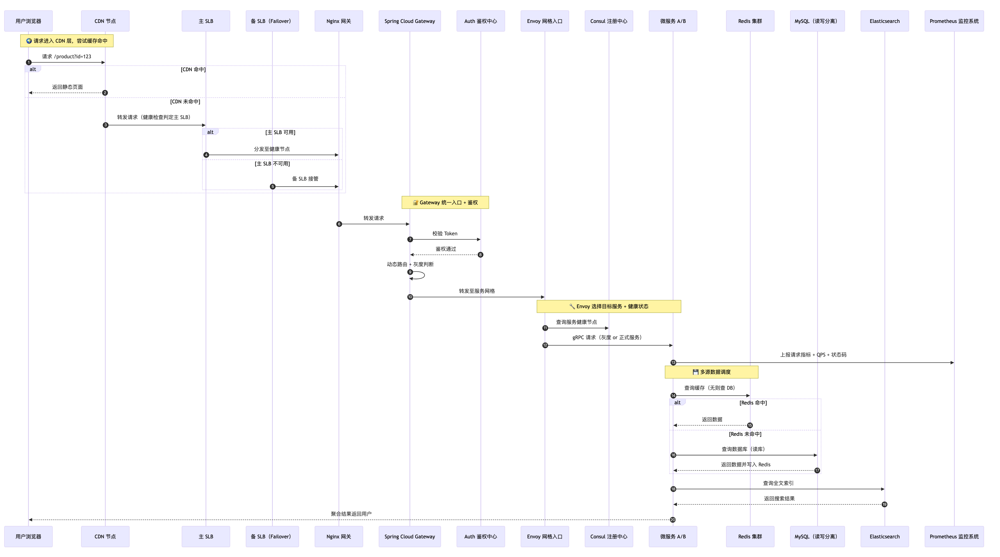

# 论系统负载均衡设计方法

## 题目

```
请围绕“论系统负载均衡设计方法”论题，依次从以下三个方面进行论述：

1、介绍静态负载均衡策略，动态负载均衡策略的定义

2、基于场景的负载均衡的定义及实现负载均衡的常用方法

3、项目中你是如何进行负载均衡的设计的。

```

## 时序图

关键策略：

* 入口层通过 CDN+SLB 缓解压力；

* SLB 备份: 避免主负载均衡器故障时全链路中断；

* 服务网关层引入 Gateway 实现动态路由与灰度发布；

* Auth: 在网关中统一身份认证，支持 JWT/OAuth2，可保护后端服务；

* Consul + Envoy: 提供动态服务发现与故障剔除；

* 微服务治理用 Envoy + gRPC + Consul 构建服务网格；

* 数据层实现读写分离与集群分担压力。

* Redis 与 ES: 缓解 DB 压力，提升查询体验与性能。

* Prometheus: 实现实时链路追踪与健康指标监控，支持自动化运维策略；





完整时序图：

```
sequenceDiagram
    autonumber
    participant User as 用户浏览器
    participant CDN as CDN 节点
    participant SLB as 主 SLB
    participant SLB2 as 备 SLB（Failover）
    participant Nginx as Nginx 网关
    participant Gateway as Spring Cloud Gateway
    participant Auth as Auth 鉴权中心
    participant Envoy as Envoy 网格入口
    participant Consul as Consul 注册中心
    participant Backend as 微服务 A/B
    participant Redis as Redis 集群
    participant DB as MySQL（读写分离）
    participant ES as Elasticsearch
    participant Prom as Prometheus 监控系统

    %% --- 入口层 ---
    Note over User, CDN: 🌍 请求进入 CDN 层，尝试缓存命中
    User->>CDN: 请求 /product?id=123
    alt CDN 命中
        CDN-->>User: 返回静态页面
    else CDN 未命中
        CDN->>SLB: 转发请求（健康检查判定主 SLB）
        alt 主 SLB 可用
            SLB->>Nginx: 分发至健康节点
        else 主 SLB 不可用
            SLB2->>Nginx: 备 SLB 接管
        end
    end

    %% --- 鉴权与网关层 ---
    Note over Gateway, Auth: 🔐 Gateway 统一入口 + 鉴权
    Nginx->>Gateway: 转发请求
    Gateway->>Auth: 校验 Token
    Auth-->>Gateway: 鉴权通过
    Gateway->>Gateway: 动态路由 + 灰度判断
    Gateway->>Envoy: 转发至服务网格

    %% --- 服务治理与监控 ---
    Note over Envoy, Backend: 🔧 Envoy 选择目标服务 + 健康状态
    Envoy->>Consul: 查询服务健康节点
    Envoy->>Backend: gRPC 请求（灰度 or 正式服务）
    Backend->>Prom: 上报请求指标 + QPS + 状态码

    %% --- 数据层调度 ---
    Note over Backend, Redis: 💾 多源数据调度
    Backend->>Redis: 查询缓存（无则查 DB）
    alt Redis 命中
        Redis-->>Backend: 返回数据
    else Redis 未命中
        Backend->>DB: 查询数据库（读库）
        DB-->>Backend: 返回数据并写入 Redis
    end
    Backend->>ES: 查询全文索引
    ES-->>Backend: 返回搜索结果

    %% --- 响应 ---
    Backend-->>User: 聚合结果返回用户
```

## 一、摘要

随着互联网业务规模的持续增长，系统所面临的请求并发量不断攀升，服务稳定性和高可用性成为企业技术架构的重要核心。

负载均衡作为分布式系统的基础设计之一，其目的是将客户端请求合理分发到多个后端服务器，从而提升系统吞吐量、稳定性与容错能力。

本文将从静态与动态负载均衡策略的定义入手，深入探讨基于不同业务场景下的负载均衡实现方法，并结合实际项目中的设计实践，

全面分析现代系统中负载均衡的设计思路与落地方式。

## 二、静态与动态负载均衡策略的定义

### 1.1 静态负载均衡策略

静态负载均衡是指在系统部署之初就预先设定好负载的分发规则，不会随着后端节点运行状态的变化而动态调整。

常见的静态策略包括：

* 轮询（Round Robin）：请求按照顺序逐个分发到服务器列表中的节点上，适用于节点性能相对均衡的场景。

* 加权轮询（Weighted Round Robin）：在轮询基础上，根据不同服务器的性能设置权重，高性能节点接收更多请求。

* 源地址哈希（Source IP Hash）：基于客户端 IP 计算哈希值后映射到具体服务器，用于实现会话粘性（Session Stickiness）。

* 最小连接数（Least Connections）：将新请求分发给当前活跃连接数最少的服务器，适用于请求处理时长不均的系统。

静态策略的优点在于简单、易于实现和维护，但缺乏自适应能力，面对服务性能波动、节点异常时处理能力有限。

### 1.2 动态负载均衡策略

动态负载均衡指根据系统运行状态（如节点负载、CPU 使用率、响应时间等）实时调整请求分发策略。相比静态策略，它具备以下特征：

* 实时感知系统状态：根据监控数据动态调整流量分发，提升资源利用效率。

* 自适应扩缩容能力：结合服务注册与发现机制，可以自动添加或移除节点。

* 智能调度：结合算法，如基于机器学习的预测调度，提升性能和容错性。

常见的动态策略包括：

* 基于健康检查的分发调整：将健康状态不佳的节点从请求路径中移除。

* 响应时间优先（Latency-Based Routing）：将请求分发至响应时间最短的节点。

* 自动权重调整：根据节点处理能力或资源占用动态调整权重。

动态策略对系统的可用性与弹性提升显著，但也带来监控系统、服务治理组件等更多依赖，系统复杂性提高。

## 三、基于场景的负载均衡及其实现方法

不同业务场景对于负载均衡的要求存在较大差异。下面结合实际系统场景，分析常用的负载均衡实现方式。

### 2.1 Web 服务高并发场景

场景描述： 

电商大促期间，网站访问量暴增，对前端 Web 服务的访问能力要求极高。

实现方法：

* 使用七层负载均衡（HTTP/HTTPS），如 Nginx、HAProxy 处理请求。

* 配置轮询+健康检查机制，当节点挂掉时自动摘除。

* 部署多个区域的边缘节点，通过 CDN 或 DNS 进行地域智能调度。

特点：

* 请求量大，延迟敏感；

* 需要快速容灾与热备切换。

### 2.2 微服务架构下的服务调用

场景描述：

微服务系统中，服务与服务之间大量调用，调用频率高。

实现方法：

* 引入 服务注册中心（如 Nacos、Consul） + 客户端负载均衡（如 Ribbon）。

* 结合服务健康状态，客户端可选择最佳节点发起请求。

* 支持连接池、重试机制、熔断降级等服务治理功能。

特点：

* 内部通信为主；

* 通信链路短，强调吞吐量与容错。

### 2.3 数据处理或计算密集型场景

场景描述：

AI 模型训练平台或数据处理系统，任务执行周期长、资源占用高。

实现方法：

* 使用 任务队列+Worker模型（如 RabbitMQ + 多Worker）。

* 后端 Worker 处理任务，根据资源状况进行调度。

* 实现任务权重调度，将大任务分配至高性能节点。

特点：

* 请求不是实时响应型；

* 关注节点负载均衡和长时间运行的资源调度。

#### 2.4 多租户系统中的租户隔离

场景描述：

SaaS 系统需要服务多个客户（租户），确保彼此请求互不干扰。

实现方法：

* 采用基于租户ID的哈希分发策略；

* 按租户进行流量切分，或分区部署服务；

* 结合限流、熔断、隔离舱等手段保护系统稳定。

特点：

* 业务隔离强；

* 重视稳定性与服务质量保证。

## 四、项目中负载均衡设计实践

以下是我在参与某大型内容分发平台架构升级项目中，主导负载均衡设计的实践经验。

### 3.1 项目背景
该平台服务于全国数千万用户，日请求量超过10亿次。平台包括内容推荐、搜索、用户画像、内容分发等模块，对系统吞吐量与可用性要求极高。

原系统存在以下问题：

* 单点瓶颈，负载不均；

* 节点宕机时恢复不及时；

* 缺乏实时流量调度能力。

### 3.2 架构重构目标

* 实现自动化、智能化的请求调度；

* 消除单点问题；

* 支持灰度发布、动态扩容。

### 3.3 设计方案

#### 1）前端入口层

* 采用 SLB（阿里云负载均衡）+ CDN 提供入口级别的流量调度与加速。

* 用户请求首先经过 CDN 缓存；

* CDN 命中失败时进入 SLB，根据健康检查状态分发至不同的 Nginx 节点；

* Nginx 反向代理后进入后端服务集群。

#### 2）服务网关与动态路由

* 引入 Spring Cloud Gateway 作为统一网关：

* 支持路由规则热更新；

* 集成服务注册中心，实现动态节点发现；

* 支持基于 Header、URI 的流量灰度发布。

#### 3）服务治理与客户端负载均衡

后端微服务间通信使用 gRPC + Consul + Envoy 构建服务网格，具体策略：

* Envoy 实现 L4/L7 层的流量分发；

* 利用 Consul 健康检查调整目标节点池；

* 支持基于请求类型的流量分级调度。

#### 4）数据层分布调度

* MySQL 实现读写分离，读库使用 ProxySQL 实现权重路由；

* Elasticsearch 集群请求使用协调节点分担压力；

* Redis 使用分片集群，客户端路由由中间件封装。

### 3.4 效果评估

* 系统吞吐量提升 60%，高峰期间无单点故障；

* 请求延迟稳定在 80ms 内；

* 节点可动态上下线，支持弹性扩缩容；

* 灰度能力支撑了后续多个版本平滑上线。

## 五、结语

在现代分布式系统中，负载均衡不仅仅是一种流量分发手段，更是一种系统治理能力的体现。

从最初的静态轮询到如今基于 AI 的智能调度，负载均衡策略正持续进化。

设计良好的负载均衡体系，需要综合考虑业务场景、系统规模、运维能力、故障容忍与性能需求。

作为架构师，应始终以“弹性、高可用、自愈”为目标，通过合理的设计与持续优化，为系统提供坚实的运行保障。