
# gRPC 调用流程图
> 从客户端请求到服务端处理再到响应返回的完整过程。


## 方式一：普通 gRPC	调用流程

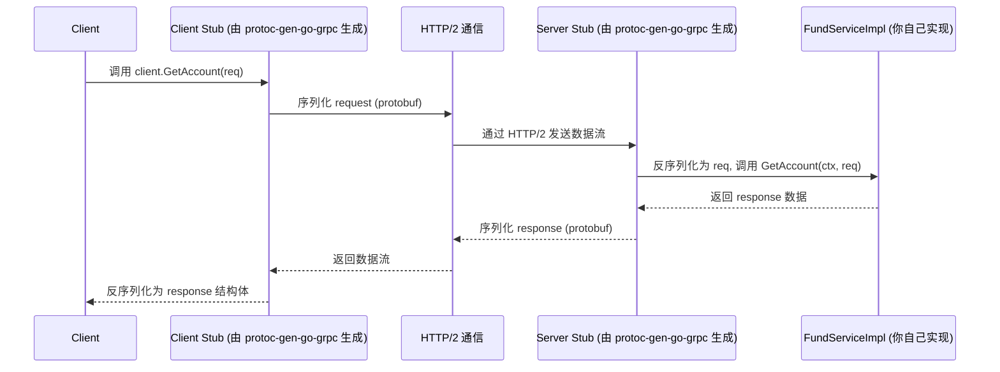

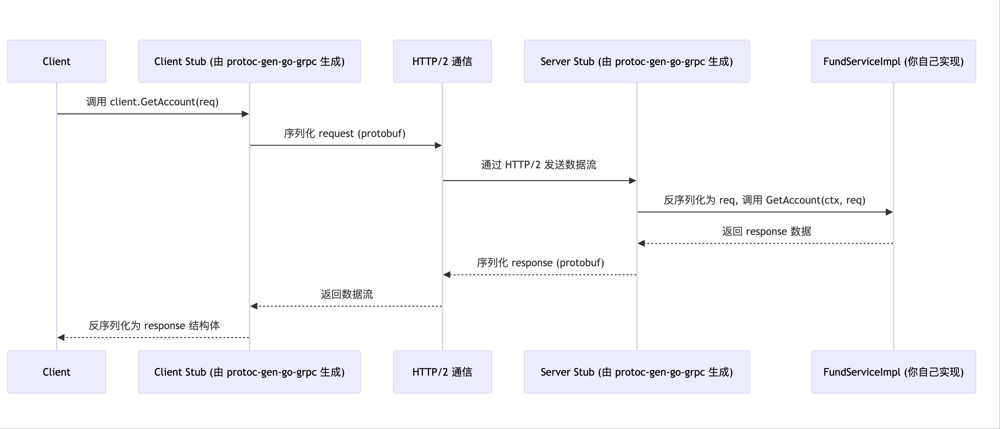


## 方式二：grpc-gateway	调用

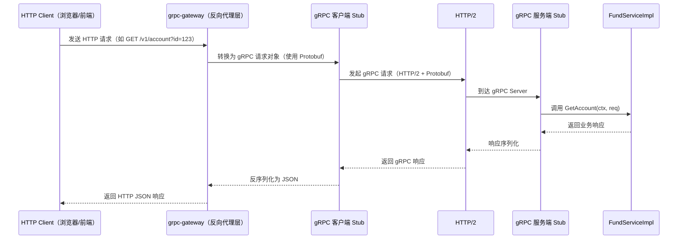

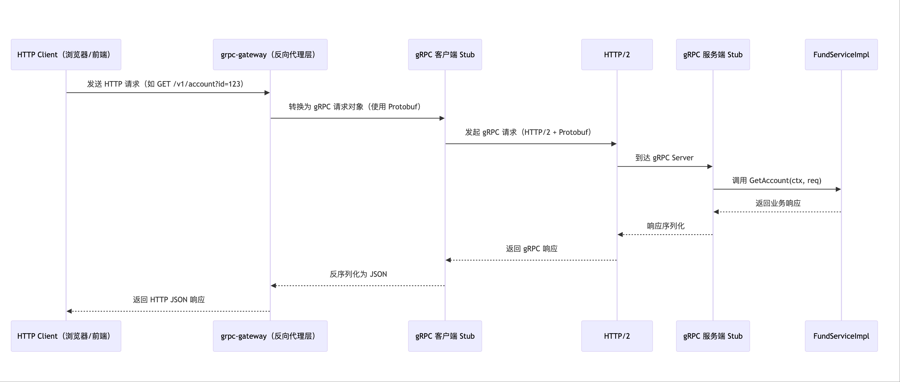

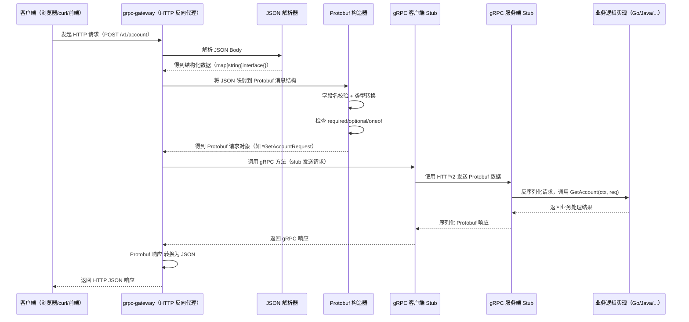


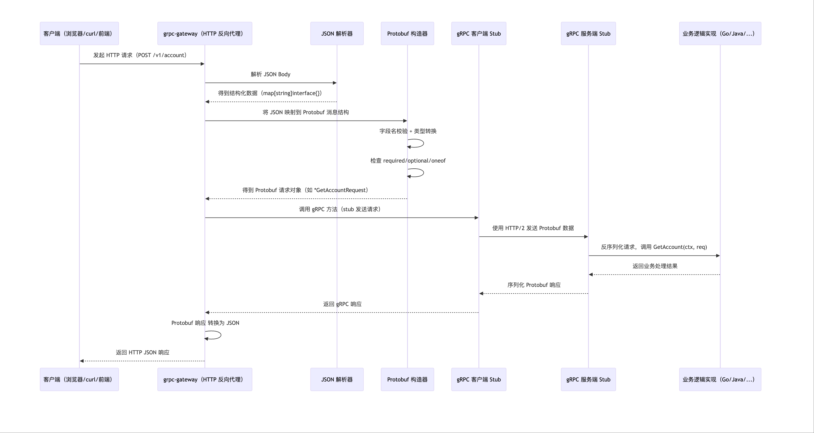

说明：
* grpc-gateway 充当“HTTP → gRPC 的中间层”
* 前端无需了解 gRPC，只通过 RESTful API 调用
* 适用于服务既提供给 Web App，也用于微服务间高效通信的场景


## 方式三：双向流

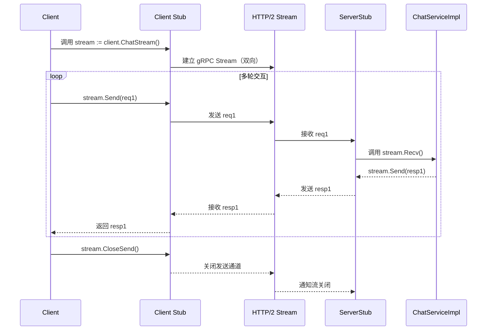

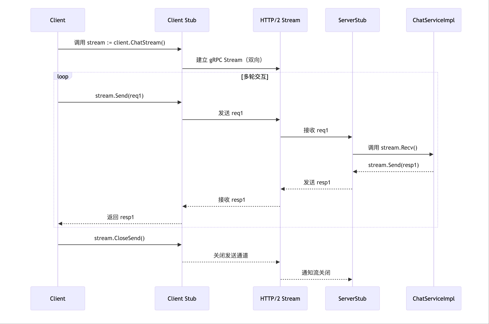

应用场景：
* 聊天系统
* 实时语音识别（客户端不断上传音频，服务端实时返回文本）
* 股票行情推送

总结对比：

| 类型           | 客户端          | 服务端         | 特点                           |
| ------------ | ------------ | ----------- | ---------------------------- |
| 普通 gRPC      | 单请求单响应       | 单请求单响应      | 类似 REST 但用 Protobuf 和 HTTP/2 |
| grpc-gateway | HTTP JSON 请求 | 自动转 gRPC 调用 | 前端友好，可双协议共存                  |
| 双向流          | 多请求多响应       | 持续收发数据流     | 实时、复杂交互                      |


## 方式四：Lua grpcaller 动态调用

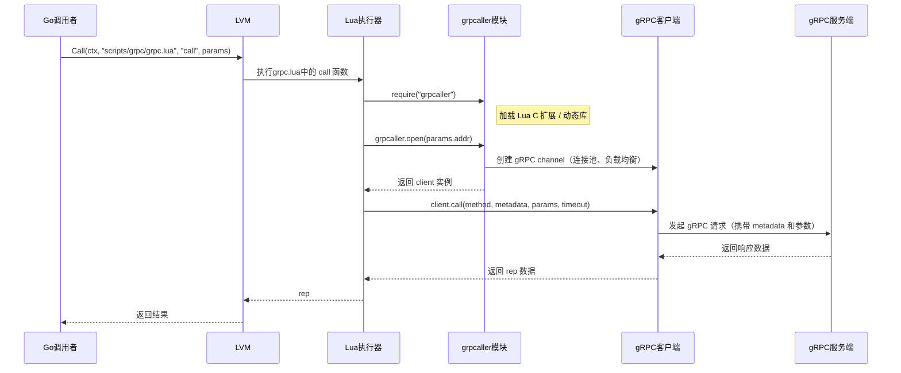

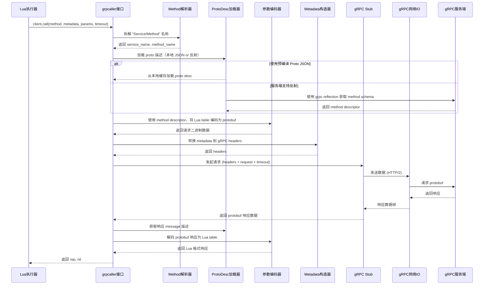

调用代码：
```go
func (this *Lvm) GrpcCall(ctx context.Context, addr string, method string, params map[string]interface{}, timeout int) (interface{}, error) {
	m := map[string]interface{}{
		"addr":   addr,
		"method": method,
		"metadata": map[string]interface{}{
			"trace_id":   global.GetTraceId(ctx),
			"user_id":    xxxx,
			"User-Agent": "mkt-xxx",
		},
		"params":  params,
		"timeout": timeout,
	}
	reply, err := this.Call(ctx, "scripts/grpc/grpc.lua", "call", m)
	if err != nil {
		return nil, err
	}
	if reply.Code != 0 {
		return nil, fmt.Errorf("[%d][%s]%s", reply.Code, reply.Msg, reply.Reason)
	}
	return reply.Data, nil
}
````

```lua
local grpcaller = require("grpcaller")

function call(params)
    local client,err = grpcaller.open(params.addr)
    if(err~=nil) then
        return nil,err
    end
    local rep,err = client.call(params.method,params.metadata,params.params,params.timeout)
    if(err~=nil) then
        return nil,err
    end
    return rep,nil
end
```

Go 通过 Lua 执行器调用 gRPC:

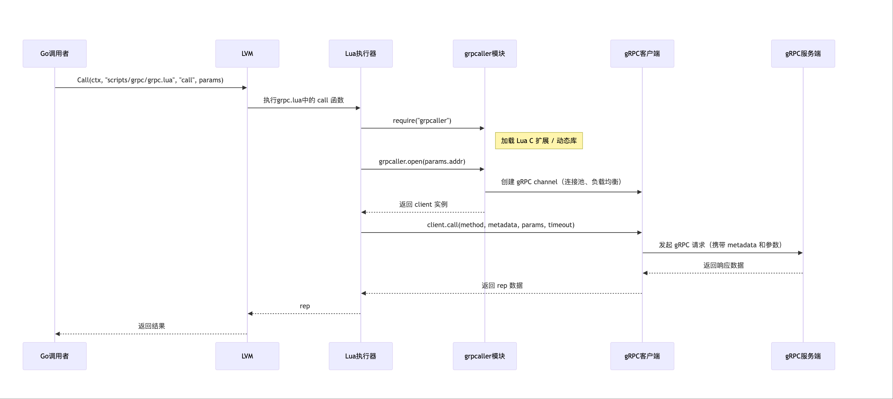

Lua 执行器通过 grpcaller 调用 gPRC:

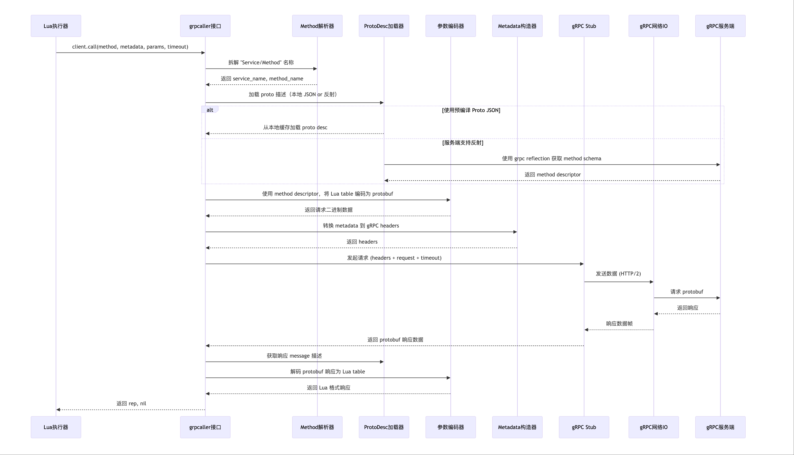

概览对比表：四种调用方式的核心区别

| 特性 / 模式             | Lua 脚本动态调用       | Go 强类型调用            | gRPC-Gateway（REST 转 gRPC） | gRPC 双向流            |
| ------------------- | ---------------- | ------------------- | ------------------------- | ------------------- |
| **语言支持**            | Lua（通过 grpcaller 封装） | Go（静态语言）            | 前端 HTTP（任意语言）             | 主要 Go、Java、Python 等 |
| **类型安全**            | ❌ 弱类型（动态传 map）   | ✅ 强类型（编译时检查）        | ❌ 弱类型（JSON → Protobuf）    | ✅ 强类型               |
| **是否依赖 proto 编译**   | ⚠️ 可选，用反射或 ProtoDesc | ✅ 必须预编译 .proto      | ✅ 必须预编译 .proto + 注解       | ✅ 必须预编译             |
| **是否用 Protobuf 协议** | ✅ 是              | ✅ 是                 | ✅ 后端是                     | ✅ 是                 |
| **使用协议**            | HTTP/2 + Protobuf | HTTP/2 + Protobuf   | HTTP/1.1 or HTTP/2 + JSON | HTTP/2 + Protobuf   |
| **接口调用方式**          | 反射式、方法名 + 参数 map 调用 | Stub 接口直接调用         | REST API（POST/GET）        | 数据流持续读写             |
| **接入方便性**           | ✅ 灵活嵌入脚本、动态性强    | ⚠️ 需要 proto 编译、静态绑定 | ✅ 对前端极友好                  | ❌ 不适合浏览器            |
| **适用场景**            | 动态中转、脚本调度、热更     | 内部服务强约束通信           | 对外提供 REST API             | 流式传输，如聊天/实时日志       |
| **性能**              | 中等               | 高性能                 | 中等（JSON 序列化开销）            | 高（流式可复用连接）          |
| **错误处理能力**          | 手动处理错误码、反射结果     | gRPC Code + Typed Error | HTTP Code + JSON 错误信息     | gRPC Code，错误流通知     |
| **连接复用/连接池支持**      | 视 `grpcaller` 实现而定 | ✅ 支持连接复用            | 网关内部转发连接                  | ✅ 支持长连接             |


# gRPC 使用

## 工具安装
```
.PHONY: init
# init env
init:
	go install google.golang.org/protobuf/cmd/protoc-gen-go@latest
	go install google.golang.org/grpc/cmd/protoc-gen-go-grpc@latest
	go install github.com/grpc-ecosystem/grpc-gateway/v2/protoc-gen-grpc-gateway@latest
	go install github.com/go-kratos/kratos/cmd/protoc-gen-go-http/v2@latest
	go install github.com/go-kratos/kratos/cmd/kratos/v2@latest
	go install github.com/google/gnostic/cmd/protoc-gen-openapi@latest
	go install github.com/envoyproxy/protoc-gen-validate@latest
```

## 编译命令
```
 protoc \
  -I . \
  -I ./third_party \
  --go_out . --go_opt paths=source_relative \
  --go-grpc_out . --go-grpc_opt paths=source_relative \
  --grpc-gateway_out . --grpc-gateway_opt paths=source_relative \
  ./api/fund/fund.proto
```