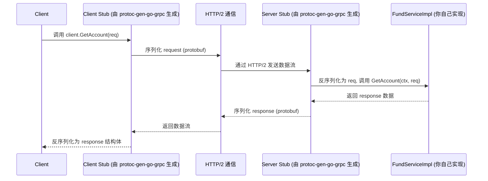
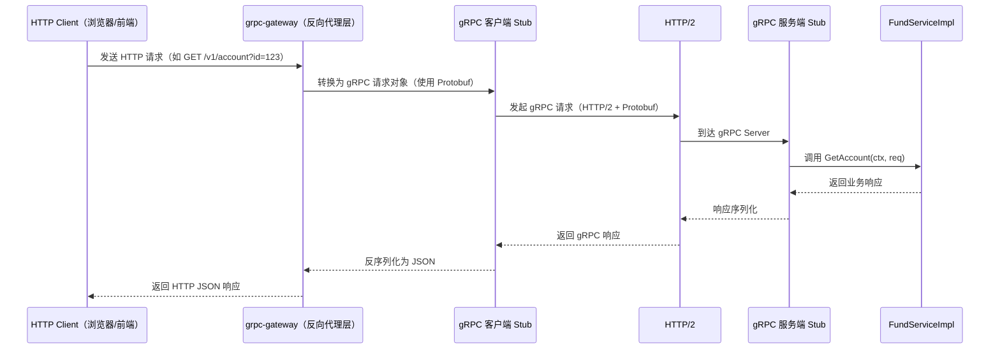
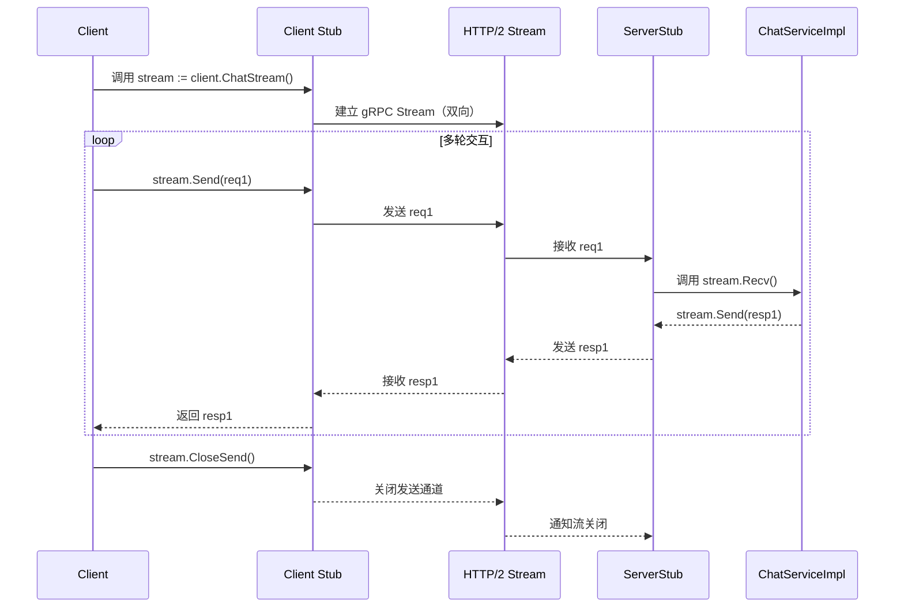


# gRPC 调用流程图
> 从客户端请求到服务端处理再到响应返回的完整过程。
## 普通 gRPC	调用流程




## grpc-gateway	




说明：
* grpc-gateway 充当“HTTP → gRPC 的中间层”
* 前端无需了解 gRPC，只通过 RESTful API 调用
* 适用于服务既提供给 Web App，也用于微服务间高效通信的场景


## 双向流




应用场景：
* 聊天系统
* 实时语音识别（客户端不断上传音频，服务端实时返回文本）
* 股票行情推送

总结对比：

| 类型           | 客户端          | 服务端         | 特点                           |
| ------------ | ------------ | ----------- | ---------------------------- |
| 普通 gRPC      | 单请求单响应       | 单请求单响应      | 类似 REST 但用 Protobuf 和 HTTP/2 |
| grpc-gateway | HTTP JSON 请求 | 自动转 gRPC 调用 | 前端友好，可双协议共存                  |
| 双向流          | 多请求多响应       | 持续收发数据流     | 实时、复杂交互                      |

# gRPC 使用

## 工具安装
```
.PHONY: init
# init env
init:
	go install google.golang.org/protobuf/cmd/protoc-gen-go@latest
	go install google.golang.org/grpc/cmd/protoc-gen-go-grpc@latest
	go install github.com/grpc-ecosystem/grpc-gateway/v2/protoc-gen-grpc-gateway@latest
	go install github.com/go-kratos/kratos/cmd/protoc-gen-go-http/v2@latest
	go install github.com/go-kratos/kratos/cmd/kratos/v2@latest
	go install github.com/google/gnostic/cmd/protoc-gen-openapi@latest
	go install github.com/envoyproxy/protoc-gen-validate@latest
```

## 编译命令
```
 protoc \
  -I . \
  -I ./third_party \
  --go_out . --go_opt paths=source_relative \
  --go-grpc_out . --go-grpc_opt paths=source_relative \
  --grpc-gateway_out . --grpc-gateway_opt paths=source_relative \
  ./api/fund/fund.proto
```
