# 问题列表

1、一条SQL查询语句是如何执行的？如果查询不存在的字段，是在哪个阶段报的错？

2、每天一千万订单，要求用户查自己的订单，商家查自己家的订单，怎么设计订单表？

3、MySQL的事务隔离级别是什么?

4、MySQL有哪几种锁机制，每种锁都做了些什么？

5、为什么MySQL的索引要使用B+树，而不是其它树？比如B树？

6、什么是数据库设计的三大范式？范式设计和反范式设计的优缺点？

7、MySQL中 MyISAM 与 InnoDB 的区别，至少5点？

8、MySQL中 VARCHAR 与 CHAR 的区别以及 VARCHAR(50) 中的50代表的涵义？int(20)中20的涵义？

9、 InnoDB 的事务与日志的实现方式？

10、MySQL数据库 CPU 飙升到500%的话怎么处理？

11、Explain 执行计划包含的字段及说明？

12、什么是索引？MySQL 索引都有哪些类型？索引的优缺点是什么？

13、MySQL 优化的方式具体都有哪些？至少10种。

14、什么是最左前缀原则？什么是最左匹配原则？

15、内连接INNER JOIN，左连接LEFT JOIN，右连接RIGHT JOIN，全连接FULL OUTER JOIN等SQL JOINS的文氏图解？

16、MySQL InnoDB的索引结构（画图说明） ？

17、B+ tree在索引 where id = 100 的索引过程？

18、为什么MongoDB索引用B树，而MySQLB+树?

19、为SQL建立索引 where a = 1 and b > 10 and c =1 。

20、手写SQL 用户表 包含 id name password score 。

21、进行MySQL慢查询优化的基本步骤是什么？

22、建立索引的原则有哪些？至少五点。

23、给如下慢SQL建立索引进行查询速度优化。

24、MySQL是否支持JSON类型？

25、B+ tree在索引 where id = 50 的索引过程 ？

26、请解释下`select * from t where id>7` 是否会走索引？为什么？`select * from t where id<7`是否也会走索引。

27、请说明下字段bcd联合索引的结构，画图说明。

28、什么是聚族索引，什么是非聚族索引？

29、什么是回表？什么是覆盖索引？什么是索引下推？什么是最左前缀匹配？

30、什么是局部性原理？什么是磁盘预读？

31、MySQL的索引一般有几层？创建的索引字段是长了好还是短了好？

32、我们在创建表的时候使用代理主键还是自然主键？主键设置好了之后，要不要自增？在分布式应用场景中，自增id还适用么？

33、什么是事务？事务的ACID特性是什么？

34、什么是脏读、不可重复读和幻读？

35、为什么MySQL用B+树做索引而不用B树?

36、请介绍下 B+ Tree 结构？当如下高度为三层树的节点撑满后能放多少索引？

37、为什么建议 InnoDB 表必须建主键，并且推荐使用整型的自增主键？

38、为什么非主键索引结构叶子节点存储的是主键值（一致性和节省存储空间）？

39、联合索引的底层存储结构长什么样子（画图说明）？

40、联合索引字段A、B、C，查询A、C、B会走索引吗？为什么？

41、慢SQL查询如何优化？

42、可重复读是怎么实现的？

43、做过分库分表吗？基于什么进行拆分，拆分后出现了什么问题，怎么解决的？

44、为什么建议主键ID是递增的，和B+tree有什么关联？为什么不建议使用UUID。

45、二叉树、AVL树、B-树、B+树的特点和缺点？

46、针对如下表结构创建的索引，哪个SQL的执行效率高？

48、[写一条SQL要求去除一个学生的最高分和最低分，然后算出平均分。](#48)


# 问题解答

## SQL查询的执行过程

1、 一条SQL查询语句是如何执行的？如果查询不存在的字段，是在哪个阶段报的错？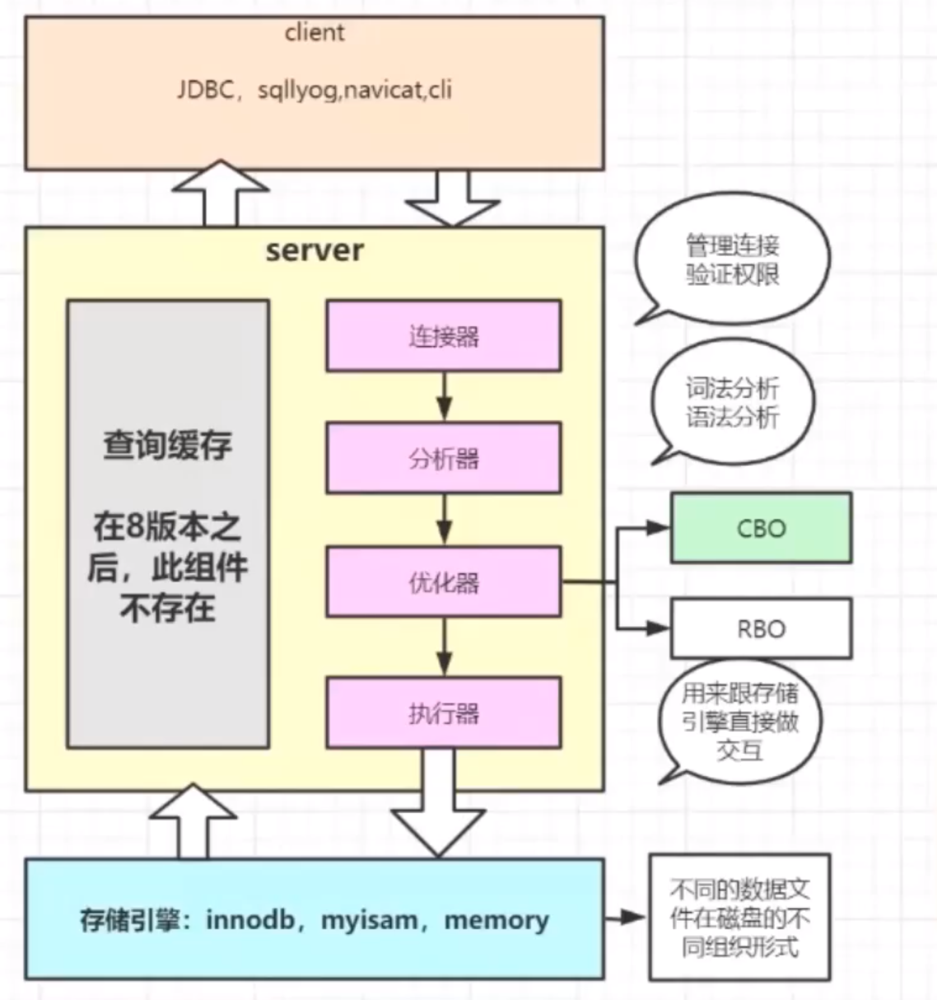

[基础架构：一条SQL查询语句是如何执行的？](https://time.geekbang.org/column/article/115537)


SQL执行流程：

① 第一步，首先会通过连接器先连接到数据库上。连接器负责跟客户端建立连接、获取权限、维持和管理连接。

② 第二步，会到查询缓存中查询之前是否有缓存结果，命中则直接返回结果。

③  第三步，对 SQL 语句做解析，分析器先会做“词法分析”，接着做语法分析，根据语法规则判断这个 SQL 语句是否满足 MySQL 语法。

④ 第四步，接着优化器对 SQL 语句做优化分析，多索引时决定使用哪个索引，多表关联时决定表的连接顺序，最终确定执行计划方案。

⑤ 第五步，执行器执行阶段，先判断查询或更新权限的验证，如果有权限打开表调用引擎提供的接口进行执行，获取结果。

不存在字段的判断阶段：

Oracle 会在分析阶段判断语句是否正确，表是否存在，列是否存在等。

MySQL 在进行解析器处理时会生成一棵对应的解析树，预处理器进一步检查解析树的合法。比如：数据表和数据列是否存在，别名是否有歧义等。如果通过则生成新的解析树，再提交给优化器。

## 日千万订单表的设计

2、每天一千万订单，要求用户查自己的订单，商家查自己家的订单，怎么设计订单表？

分库分表。数据库分表可以解决单表海量数据的查询性能问题，分库可以解决单台数据库的并发访问压力问题。

分库分表主要是为了用户端下单和查询使用，按user_id的查询频率最高，其次是order_id。所以我们选择user_id做为sharding column，按user_id做hash，将相同用户的订单数据存储到同一个数据库的同一张表中。这样用户在网页或者App上查询订单时只需要路由到一张表就可以获取用户的所有订单了，这样就保证了查询性能。

另外我们在订单ID（order_id）里掺杂了用户ID（user_id）信息。简单来说，order_id的设计思路就是，将order_id分为前后两部分，前面的部分是user_id，后面的部分是具体的订单编号，两部分组合在一起就构成了order_id。这样我们很容易从order_id解析出user_id。通过order_id查询订单时，先从order_id中解析出user_id，然后就可以根据user_id路由到具体的库表了。

另外，数据库分成16个，每个库分16张表还有一个好处。16是2的N次幂，所以hash值对16取模的结果与hash值和16按位“与运算”的结果是一样的。我们知道位运算基于二进制，跨过各种编译和转化直接到最底层的机器语言，效率自然远高于取模运算。

查询直接查数据库，会不会有性能问题？是的。所以我们在上层加了Redis，Redis做了分片集群，用于存储活跃用户最近50条订单。这样一来，只有少部分在Redis查不到订单的用户请求才会到数据库查询订单，这样就减小了数据库查询压力，而且每个分库还有两个从库，查询操作只走从库，进一步分摊了每个分库的压力。

## MySQL的事务隔离级别

3、MySQL的事务隔离级别是什么？分别会有什么问题？

[【MySQL 知识】四种事务隔离级别](https://wwxiong.com/?p=219)

[事务隔离：为什么你改了我还看不见？](https://time.geekbang.org/column/article/68963)

* 读未提（`READ_UNCOMMITTED`）：一个事务还没提交时，它做的变更就能被别的事务看到。最低的事务隔离级别，任何情况都无法保证。
* 读已提交（`READ_COMMITTED`）：保证一个事物提交后才能被另外一个事务读取，另外一个事务不能读取该事物未提交的数据。可避免脏读的发生，但是可能会造成不可重复读。
* 可重复读（`REPEATABLE_READ`）：多次读取同一范围的数据会返回第一次查询的快照，即使其他事务对该数据做了更新修改。事务在执行期间看到的数据前后必须是一致的。但如果这个事务在读取某个范围内的记录时，其他事务又在该范围内插入了新的记录，当之前的事务再次读取该范围的记录时，会产生幻行，这就是幻读。
* 串行化（`SERIALIZABLE`）：写会加写锁，读会加读锁。当出现读写锁冲突的时候，后访问的事务必须等前一个事务执行完成，才能继续执行。这是最高的事务隔离级别，也是最可靠的级别，但是花费的代价也是最高的。该事物隔离级别可以做到事务 100% 隔离，可避免脏读、不可重复读、幻读的发生。


|    事务隔离级别    |       英文       | 脏读 | 不可重复读 | 幻读 |
| :----------------: | :--------------: | :--: | :--------: | :--: |
|      读未提交      | READ_UNCOMMITTED |  √   |     √      |  √   |
| 读已提交（Oracle） |  READ_COMMITTED  |  x   |     √      |  √   |
| 可重复读（MySQL）  | REPEATABLE_READ  |  x   |     x      |  √   |
| 序列化读（串行化） |   SERIALIZABLE   |  x   |     x      |  x   |

> MySQL默认事务隔离级别是可重复读（REPEATABLE_READ）；Oracle 默认事务隔离级别是读已提交（READ_COMMITTED）。

从上面可以看出，隔离级别越高，越能保证数据的完整性和一致性，但是对并发性能的影响也越大。

## MySQL有哪几种锁机制

4、MySQL有哪几种锁机制，每种锁都做了些什么？

根据加锁的范围，MySQL 里面的锁大致可以分成全局锁、表级锁和行锁、页级锁。

* 全局锁就是对整个数据库实例加锁，全局加锁会让整个库处于只读状态，此后其他线程的语句都会被阻塞：数据更新语句（数据的增删改）、数据定义语句（包括建表、修改表结构等）和更新类事务的提交语句。全局锁的典型使用场景是，做全库逻辑备份。MySQL 加全局读锁的方法，命令是` Flush tables with read lock (FTWRL)`。
* 表级锁是对整张表进行加锁，这种锁的方式粒度大，优点是开销小，加锁快；缺点是发生锁冲突的概率最高，并发度最低，MYISAM只支持表锁。
* 行级锁是对当前操作的行进行加锁，是MySQL中锁定粒度最细的一种锁，优点是锁定粒度最小，发生锁冲突的概率最低，并发度也最高；缺点是开销大，加锁慢；会出现死锁。
* 页级锁是MySQL中**锁定粒度介于行级锁和表级锁中间的一种锁**，特点是开销和加锁时间界于表锁和行锁之间；锁定粒度界于表锁和行锁之间，并发度一般，会出现死锁。

## MySQL的索引使用B+树的原因

5、为什么MySQL的索引要使用B+树，而不是其它树？比如B树？

[MySQL 高频面试题 - 为什么 B+ 树比 B 树更适合应用于数据库索引？](https://leetcode-cn.com/circle/discuss/F7bKlM/)

[面试官问你B树和B+树，就把这篇文章丢给他](https://segmentfault.com/a/1190000020416577)](https://segmentfault.com/a/1190000020416577)

- 单一节点存储的元素更多，使得查询的IO次数更少，所以也就使得它更适合做为数据库MySQL的底层数据结构了。
- 所有的查询都要查找到叶子节点，查询性能是稳定的，而B树，每个节点都可以查找到数据，所以不稳定。
- 所有的叶子节点形成了一个有序链表，更加便于查找。

## 数据库设计的三大范式

6、什么是数据库设计的三大范式？范式设计和反范式设计的优缺点？

[【MySQL】范式设计和反范式设计](https://wwxiong.com/?p=48)

设计关系型数据库需要遵守设计规范格式(Normal Format)。 

* 第一范式，是指字段具有不可拆分的原子性；

* 第二范式在满足第一范式的基础上，消除部分依赖，要求必须有主键并且非主键字段完全依赖主键（不能存在部分依赖）；判断是否依赖于主键的一部分，说明第二规则的主键是由2个或者2个以上的字段构成的。

* 第三范式在第二范式的基础上，消除传递依赖，要求非主键字段不能相互依赖。理解2NF和3NF的关键点在于，2NF-某字段依赖于主键的一部分，3NF-某字段依赖于某个非主键字段。

关于范式设计和反范式设计的选择，需要根据实际业务场景进行选择，完全的范式化和反范式化设计都是实验室里才会出现的。简单来讲，符合实际业务场景的设计便是好设计。

范式设计的优点：范式化的设计避免了大量的数据冗余，使得更新速度更快，同时也节省了存储空间，保持了数据的一致性（不必在超过两个以上的地方更改同一个值）。

范式化设计的缺点通常是需要关联许多表，这会导致在复杂查询的时候需要多次关联，降低查询效率。

在反范式的设计模式中，可以允许适当的数据冗余，用这个冗余可以缩短取数据的时间。反范式其本质上就是用空间来换取时间，把数据冗余在多个表中，当查询时就可以减少或者是避免表之间的关联。

优点：因为数据冗余，减少了表的连接甚至不连接，可以更好的利用索引筛选和排序，从而提高查询操作的性能。缺点：因为数据冗余，在更新操作或者删除操作时容易造成表中的信息不一致的问题。

| 设计       | 优点                                     | 缺点                                         |
| ---------- | ---------------------------------------- | -------------------------------------------- |
| 范式设计   | 数据没有冗余，更新操作容易，数据一致性高 | 关联表查询太多，查询性能下降                 |
| 反范式设计 | 数据大量冗余，查询性能较快               | 更新性能下降，磁盘空间消耗较大，数据一致性低 |

## MyISAM 与 InnoDB 的区别

7、MySQL中 MyISAM 与 InnoDB 的区别，至少5点？

- InnoDB 支持事务，而 MyISAM 不支持事务。
- InnoDB 支持表级锁和行级锁，而 MyISAM 只支持表级锁。
- InnoDB 支持外键，而 MyISAM 不支持。
- InnoDB 不支持全文索引（5.6版本之后支持），而 MyISAM 一直支持。
- InnoDB 的主键索引是聚簇索引，InnoDB 的二级索引（辅助索引、普通索引）为非聚簇索引， MyISAM的主键索引和二级索引都是非聚簇索引。 
- InnoDB 的索引的叶子节点直接存放数据和索引，而 MyISAM只存放地址。
- InnoDB 支持奔溃后的安全修复，MyISAM 崩溃后无法修复。注：InnoDB 引擎层自身的 redo log（重做日志）有 crash-safe 的能力，而 MySQL 自带的引擎是 MyISAM，Server 层 的 binlog （归档日志）只能用于归档。
- InnoDB 不能通过直接拷贝表文件的方法拷贝表到另外一台机器， MyISAM 支持。
- InnoDB 表支持多种行格式， MyISAM 不支持。
- InnoDB 是索引组织表， MyISAM 是堆表。

## MySQL中 VARCHAR 与 CHAR 的区别

8、MySQL中 VARCHAR 与 CHAR 的区别以及 VARCHAR(50) 中的50代表的涵义？int(20)中20的涵义？

```php
CHAR(M):M × w bytes, 0 <= M <= 255, where w is the number of bytes required for the maximum-length character in the character set
  
VARCHAR(M)：L + 1 bytes if column values require 0 – 255 bytes, L + 2 bytes if values may require more than 255 bytes  
```

1、char（n）和varchar（n）中括号中n代表字符的个数，并不代表字节个数，所以当使用了中文的时候(UTF8)意味着可以插入m个中文，但是实际会占用m*3个字节。

2、同时char和varchar最大的区别就在于char不管实际value都会占用n个字符的空间，而varchar只会占用实际字符应该占用的空间+1，并且实际空间+1<=n。

3、超过char和varchar的n设置后，字符串会被截断。

4、char的上限为255字节，varchar的上限65535字节，text的上限为65535。

5、char在存储的时候会截断尾部的空格，varchar和text不会。

6、varchar会使用1-3个字节来存储长度，text不会。

下图可以非常明显的看到结果：

| **Value**  | CHAR(4) | **Storage Required** | VARCHAR(4) | **Storage Required** |
| ---------- | ------- | -------------------- | ---------- | -------------------- |
| ''         | '  '    | 4 bytes              | ''         | 1 byte               |
| 'ab'       | 'ab '   | 4 bytes              | 'ab'       | 3 bytes              |
| 'abcd'     | 'abcd'  | 4 bytes              | 'abcd'     | 5 bytes              |
| 'abcdefgh' | 'abcd'  | 4 bytes              | 'abcd'     | 5 bytes              |

 

VARCHAR 类型用于存储可变长的字符串，无论是什么字节字符集，都存储变长数据和变长字段长度列表。

CHAR 类型是定长的，CHAR 适合存储很短的字符串，或者所有值都接近同一个长度，比如存储密码的MD5值。大家都在说varchar存储可变长度的字符串、char用来存储不可变长度的字符串。其实当使用的字符集编码不同时，char能存储的字节数是会变化的！

 VARCHAR(50) 中的50代表最多存放50个字符。使用 VARCHAR(50) 和 VARCHAR(200) 存储 'hello' 的空间开销是一样的，但是使用长的列 VARCHAR(200) 会消耗更多的内存，因为MySQL 通常会分配固定大小的内存来保存内部值，尤其是使用内存临时表进行排序或操作时会非常糟糕，在利用磁盘临时表进行排序时也非常糟糕，所以最好的策略是只分配真正需要的空间。

int(20)是指显示字符的宽度，并不影响内部存储和计算，内部实际存储还是4个字节，只是当int字段类型设置为无符号且填充零（UNSIGNED ZEROFILL）时，当数值位数未达到设置的显示宽度时，会在数值前面补充零直到满足设定的显示宽度。

## InnoDB 的事务与日志的实现方式

9、 InnoDB 的事务与日志的实现方式？

MySQL 有两个重要的日志模块：物理日志 redo log（重做日志）和 逻辑日志 binlog（归档日志）。

MySQL 里经常说到的 WAL 技术，WAL 的全称是 Write-Ahead Logging，它的关键点就是先写日志，再写磁盘，也就是先写粉板，等不忙的时候再写账本。

当有一条记录需要更新的时候，InnoDB 引擎就会先把记录写到 redo log（粉板）里面，并更新内存，这个时候更新就算完成了。同时，InnoDB 引擎会在适当的时候，将这个操作记录更新到磁盘里面，而这个更新往往是在系统比较空闲的时候做，这就像打烊以后掌柜做的事。

redo log（重做日志）和 binlog（归档日志）的区别：;;l.

* redo log 是 InnoDB 引擎特有的；binlog 是 MySQL 的 Server 层实现的，所有引擎都可以使用。
* redo log 是物理日志，记录的是“在某个数据页上做了什么修改”；binlog 是逻辑日志，记录的是这个语句的原始逻辑，比如“给 ID=2 这一行的 c 字段加 1 ”。
* redo log 是循环写的，空间固定会用完；binlog 是可以追加写入的。“追加写”是指 binlog 文件写到一定大小后会切换到下一个，并不会覆盖以前的日志。


将 redo log 的写入拆成了两个步骤：prepare 和 commit，redo log 和 binlog 都可以用于表示事务的提交状态，而两阶段提交就是让这两个状态保持逻辑上的一致。

## 数据库 CPU 飙升的解决方案

10、MySQL 数据库 CPU 飙升到500%的话怎么处理？

* ① 使用 top 命令查看是否是 mysqld 占用导致的，如果不是找出占用高的进程进行相关处理。
* ②  如果是 mysqld 占用导致的，进入 MySQL 使用 show processlist 显示用户正在运行的线程，看看里面跑的 session 情况，是不是有消耗资源的 sql 在运行。
* ③ 找出消耗高的 sql，看看执行计划是否准确， index 是否缺失，或者实在是数据量太大造成。
* ④ 可以的话 kill 掉这些线程(同时观察 cpu 使用率是否下降)，进行相应的调整(比如说加索引、改 sql、改内存参数)之后，再重新跑这些 SQL。


## Explain 执行计划的说明


11、Explain 执行计划包含的字段及说明？

[【MySQL高级】索引优化分析（二）](https://wwxiong.com/?p=92)

| 字段          | 说明               |
| ------------- | ------------------ |
| id            | 表的加载和读取顺序 |
| select_type   | 数据的访问类型     |
| table         | 所加载的表         |
| type          | 数据的查询类型     |
| possible_keys | 可能使用的索引     |
| key           | 实际使用的索引     |
| key_len       | 索引的字节数       |
| ref           | 索引引用的列       |
| rows          | 读取的行数         |
| extra         | 其他额外的信息     |

`id`：SELECT查询的序列号，包含一组数字，表示查询中执行SELECT子句或操作表的顺序。

① id相同，执行顺序由上至下。	

② id不同，如果是子查询，id的序号会递增，id值越大优先级越高，越先被执行。

③ id相同不同，同时存在。id如果相同，可以认为是一组，从上往下顺序执行，在所有组中，id值越大，优先级越高，越先执行。	


`select_type`：查询类型主要用于区别普通查询、联合查询、子查询等复杂查询，分类和说明如下所示：

| id   | 类型         | 说明                                                         |
| ---- | ------------ | ------------------------------------------------------------ |
| 1    | SIMPLE       | 查询中不包含子查询或者UNION                                  |
| 2    | PRIMARY      | 查询中若包含任何复杂的子部分，最外层查询则被标记为PRIMARY    |
| 3    | SUBQUERY     | 在SELECT或WHERE列表中包含了子查询，该子查询被标记为SUBQUERY  |
| 4    | DERIVED      | 在FROM列表中包含的子查询被标记为：DERIVED（衍生）            |
| 5    | UNION        | 若第二个SELECT出现在UNION之后，则被标记为UNION；若UNION包含在 FROM子句的子查询中，外层SELECT将被标记为：DERIVED |
| 6    | UNION RESULT | 从UNION表获取结果的SELECT被标记为：UNION RESULT              |

`table`：主要用于显示这一行的数据是关于哪张表。

`type`：显示查询使用了何种类型，总共七种类型，从最好到最差，具体类型及说明如下所示：		

| 类型   | 说明                                                         |
| ------ | ------------------------------------------------------------ |
| system | 表只有一行记录（等于MySQL自带的系统表），这是const类型的特例，平时不会出现，可以忽略。 |
| const  | 表示通过索引一次就找到了，const用于primary key或者unique索引。 |
| eq_ref | 唯一性索引扫描，对于每个索引键，表中只有一条记录与之匹配，常见于主键或唯一索引。 |
| ref    | 非唯一性索引扫描，返回匹配某个单独值得所有行。               |
| range  | 只检索给定范围的行，使用一个索引来选择行，属于范围扫描索引，一般出现在where语句中使用between,<,>,in等查询。 |
| index  | Full Index Scan，只遍历索引树。                              |
| all    | Full Table Scan，将遍历全表以找到匹配的行。                  |

> 从最好到最差依次是`system>const>eq_ref>ref>range>index>all`。一般来说，要保证查询至少达到range级别，最好能达到ref。

`possible_keys`：指出MySQL能使用哪个索引在表中找到行，查询涉及到的字段上若存在索引，则该索引将被列出，但不一定被查询使用。

`key`：显示MySQL在查询中实际使用的索引，若没有使用索引，显示为NULL。	


`key_len`：表示索引中使用的字节数，可通过该列计算查询中使用的索引的长度。在不损失精确性的情况下，长度越短越好。`key_len`显示的值为索引字段的最大可能长度，并非实际使用长度，即`key_len`是根据表定义计算而得，不是通过表内检索出的。

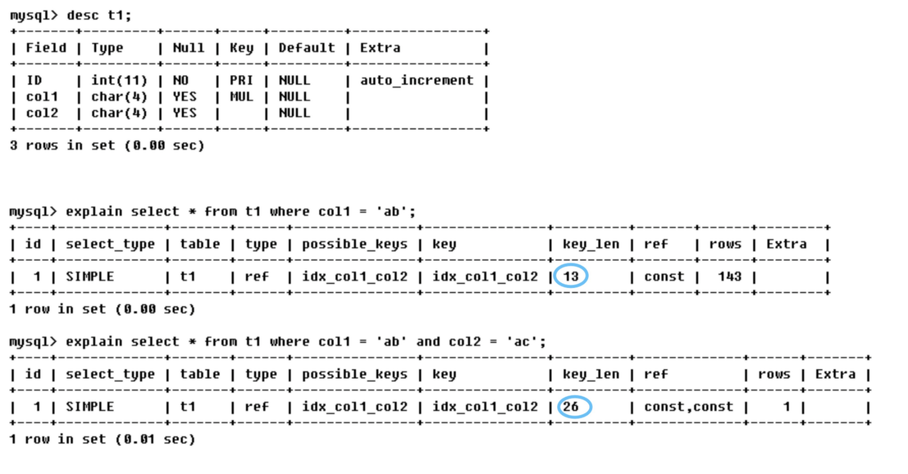

`ref`：该字段显示索引的哪一列被使用了，有可能为一个常量。简单来讲，就是指哪些列或常量被用于查找索引列上的值。	


`rows`：根据表统计信息及索引选用情况，大致估算出最终找到所需记录需要读取的行数。


`Extra`：包含不适合在其他列中显示但十分重要的额外信息，主要包含以下内容：

| 类型              | 说明               |
| ----------------- | ------------------ |
| Using filesort    | 文件排序           |
| Using temporary   | 临时表排序         |
| Using index       | 覆盖索引           |
| Using where       | 使用条件过滤       |
| Using join buffer | 使用连接缓存       |
| impossible where  | where子句值为false |

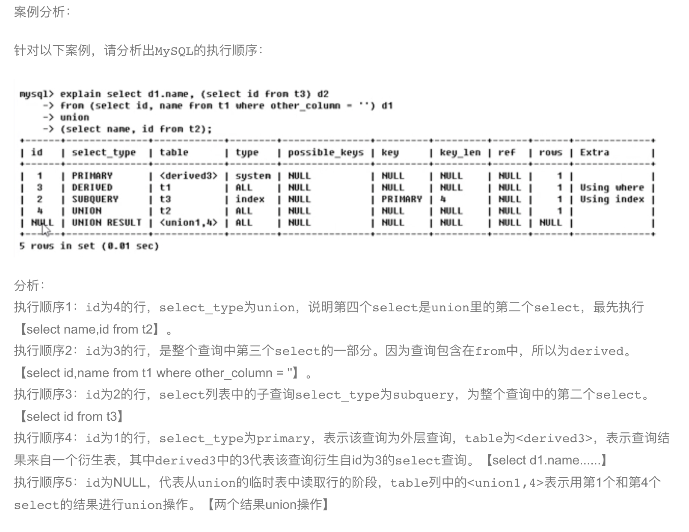

## 索引概念、类型和优缺点

12、什么是索引？MySQL 索引都有哪些类型？索引的优缺点是什么？

[【MySQL高级】索引优化分析（一）](https://wwxiong.com/?p=93)

**MySQL官方对索引的定义为：索引（Index）是存储引擎用于快速找到记录的一种排好序的数据结构。**本质是一种排好序的快速查找结构，目的是提高查询效率，索引的实现通常使用B树及其变种B+树。

数据库索引是一种能够改善表操作速度的数据结构。索引可以通过一个或多个列来创建，它可以提高随机查询的速度，并在检索记录时实现高效排序。

索引的本质：一种数据结构。
索引的目的：提高查询效率。
索引解决：① where条件后面的字段拼装查询效率。②order by 后面的字段排序如何查询快。
简而言之，可以将索引理解为：排好序的快速查找结构。

MySQL 索引类型分类：

* 普通索引（INDEX 单列索引）（辅助索引、二级索引）
* 唯一索引 （UNIQUE）
* 主键索引 （PRIMARY KEY）
* 复合索引
* 全文索引 （FULLTEXT）

索引的优势：

* 索引大大减少了服务器需要扫描的数据量，加快数据的检索速度，可以提高系统的性能。
* 索引可以帮助服务器避免排序和临时表，通过索引列对数据进行排序，降低数据排序的成本，降低了CPU的消耗。
* 索引可以将随机IO变为顺序IO，类似图书馆书目索引，提高数据检索的效率，降低数据库的IO成本。
* 创建唯一性索引，可以保证数据库表中每一行数据的唯一性。
* 使用分组和排序子句进行数据检索时，同样可以显著减少查询中分组和排序的时间。

索引的劣势：

* 占用空间：实际上，索引也是一张表，该表保留了主键与索引字段，并指向实体表的记录，所以索引列也是需要占用空间的。
* 降低更新表的速度：虽然索引大大提高了查询速度，但是也会降低更新表的速度，如对表进行INSERT、UPDATE和DELETE时，都会调整因为更新所带来的键值变化后的索引信息。
* 索引优化需要花费大量的时间：索引只是提高效率的一个因素，如果表的数据量较大，就需要花时间研究去建立最优的索引，也要进行SQL优化查询。因为各种业务不同，对于所建的索引也是不同的，也需要根据实际业务去寻找最优的方式。

## MySQL 优化的方式

13、MySQL 优化的方式具体都有哪些？至少10种。

[MySQL 优化](https://wwxiong.com/?p=90)

优化总结口诀：

>全值匹配我最爱，最左前缀要遵守；
>带头大哥不能死，中间兄弟不能断；
>索引列上少计算，范围之后全失效；
>LIKE百分写最右，覆盖索引不写星；
>不等空值还有or，索引失效要少用；
>VAR引号不可丢，SQL高级也不难。

结论：
① 全值匹配最佳，所建立的索引字段与查询条件中的字段一一对应（个数和顺序一致）是最佳的。
② 如果索引为多列，要遵守最左前缀法则。查询从索引的最左前列开始并且不能跳过索引中的列。
③ 不在索引列上做任何操作（计算、函数、（自动或手动）类型转换），会导致索引失效而转向全表扫描。
④ 存储引擎不能使用索引中范围条件右边的列。范围条件包括：`<、>、<=、>=、between`。范围列可以用到索引，但是范围列后面的列无法用到索引。
⑤ 尽量使用覆盖索引（只访问索引的查询（索引列和查询列一致）），避免select*。
⑥ MySQL在使用不等于（!=或者<>）的时候无法使用索引，会导致全表扫描。
⑦ is null，is not null 也无法使用索引。
⑧ like以通配符开头（%abc...）MySQL索引会失效变成全表扫描。对于like'%查询字符串%'时，使用覆盖索引来进行查询可以解决索引失效的问题。
⑨ 字符串不加单引号索引失效。隐式类型转换的时候会导致索引失效。
⑩ 少用or，用它来连接时索引会失效。如果是单列索引，or会使用索引；如果是组合索引，全部列都是索引，那么会使用全部列所对应的索引，如果部分列是组合索引，那么不会走索引。


## 最左前缀原则

14、什么是最左前缀原则？什么是最左匹配原则？

最左前缀原则：在MySQL建立联合索引时会遵守最左前缀匹配原则，即最左优先，在检索数据时从联合索引的最左边开始匹配。如果有一个 2 列的索引 (a, b)，则已经对 (a)、(a, b) 上建立了索引；如果有一个 3 列索引 (a, b, c)，则已经对 (a)、(a, b)、(a, b, c) 上建立了索引；

>MySQL can create composite indexes (that is, indexes on multiple columns).An index may consist of up to 16 columns. For certain data types，you can index a prefix of the column (see Section 8.3.5, “Column Indexes”).

最左匹配原则：非常重要的原则，mysql会一直向右匹配直到遇到范围查询(`>、<、between、like`)就停止匹配，比如`a = 1 and b = 2 and c > 3 and d = 4` 如果建立(a,b,c,d)顺序的索引，d是用不到索引的，如果建立(a,b,d,c)的索引则都可以用到，a,b,d的顺序可以任意调整。

最左匹配特性：当b+树的数据项是复合的数据结构，比如(name,age,sex)的时候，b+数是按照从左到右的顺序来建立搜索树的，比如当(张三,20,F)这样的数据来检索的时候，b+树会优先比较name来确定下一步的所搜方向，如果name相同再依次比较age和sex，最后得到检索的数据；但当(20,F)这样的没有name的数据来的时候，b+树就不知道下一步该查哪个节点，因为建立搜索树的时候name就是第一个比较因子，必须要先根据name来搜索才能知道下一步去哪里查询。比如当(张三,F)这样的数据来检索时，b+树可以用name来指定搜索方向，但下一个字段age的缺失，所以只能把名字等于张三的数据都找到，然后再匹配性别是F的数据了， 这个是非常重要的性质，即索引的最左匹配特性。

## 七种 SQL JOIN 方式

15、内连接INNER JOIN，左连接LEFT JOIN，右连接RIGHT JOIN，全连接FULL OUTER JOIN等SQL JOINS的文氏图解？

[【MySQL高级】七种 SQL JOINS 文氏图解](https://wwxiong.com/?p=94)

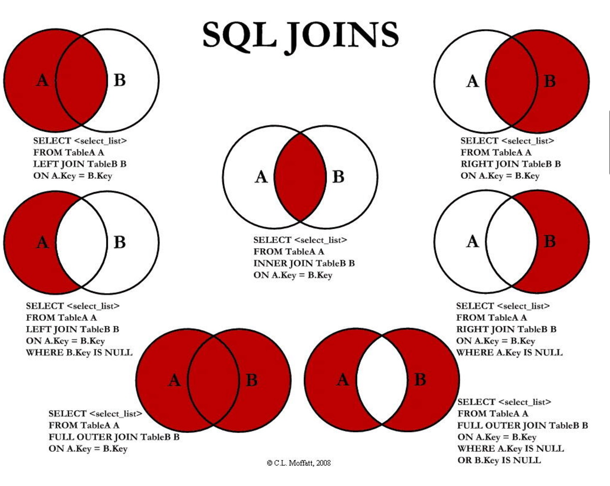

## InnoDB的索引结构

16、MySQL InnoDB的索引结构（画图说明） ？

MySQL中Innodb的索引结构采取B+树。如下为简化版的B+树：

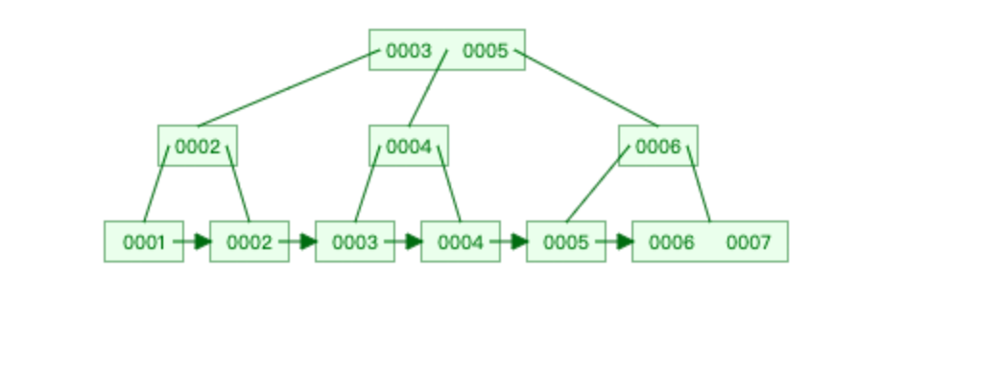


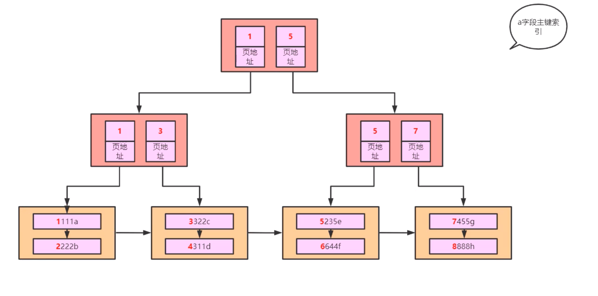

B+树的五个特点：

* 不管是根节点还是叶子节点，都是排好顺序的，左边叶子节点比根节点数据小，右边叶子节点比跟节点数据大。叶子节点也是排好序的，从左往右按照主键的顺序排列的。
* B+树的一个节点中可能会有多个元素（多个数据项），按页存储的。
* 所有叶子节点增加了一个链指针。
* 非叶子节点上面的数据都冗余了一份叶子节点上的数据，只冗余部分主键数据。
* 数据只出现在叶子节点。叶子节点存的才是真正表中的所有数据。黄色叶子节点代表数据页，浅红色非叶子节点代表索引页。

## B+树索引的查找过程

17、如下B+树，查找数据项29的索引过程是如何进行的？发生几次IO？


> 说明：浅蓝色：磁盘块。深蓝色：数据项。深黄色：指针。
>
> 如磁盘块1包含数据项17和35，包含指针P1、P2、P3。P1表示小于17的磁盘块，P2表示在17和35之间的磁盘块，P3表示大于35的磁盘块。
>
> 真实的数据存在于叶子节点即3、5、9、10、13、15、28、29、36、60、75、79、90、99。非叶子节点只不存储真实的数据，只存储指引搜索方向的数据项，如17、35并不真实存在于数据表中。

如果要查找数据项29，那么首先会把磁盘块1由磁盘加载到内存，此时发生一次IO，在内存中用二分查找确定29在17和35之间，锁定磁盘块1的P2指针，内存时间因为非常短（相比磁盘的IO）可以忽略不计。

通过磁盘块1的P2指针的磁盘地址把磁盘块3由磁盘加载到内存，发生第二次IO，29在26和30之间，锁定磁盘块3的P2指针。

通过指针加载磁盘块8到内存，发生第三次IO，同时内存中做二分查找找到29，结束查询，总计三次IO。

真实的情况是，3层的b+树可以表示上百万的数据，如果上百万的数据查找只需要三次IO，性能提高将是巨大的，如果没有索引，每个数据项都要发生一次IO，那么总共需要百万次的IO，显然成本非常非常高。

## MongoDB用B树，MySQL用B+树

18、为什么MongoDB索引用B树，而MySQLB+树?

B树的简化版：


B树的特点：

* 树内的每个节点都存储数据。
* 叶子节点之间无指针相邻。

B+树的简化版：


B+树的特点：

* 数据只出现在叶子节点。
* 所有叶子节点增加了一个链指针。

针对上面的B+树和B树的特点：

* B树的树内存储数据，因此查询单条数据的时候，B树的查询效率不固定，最好的情况是O(1)。我们可以认为在做单一数据查询的时候，使用B树平均性能更好。但是，由于B树中各节点之间没有指针相邻，因此B树不适合做一些数据遍历操作。

* B+树的数据只出现在叶子节点上，因此在查询单条数据的时候，查询速度非常稳定。因此，在做单一数据的查询上，其平均性能并不如B树。但是，B+树的叶子节点上有指针进行相连，因此在做数据遍历的时候，只需要对叶子节点进行遍历即可，这个特性使得B+树非常适合做范围查询。

结论：MySQL中数据遍历操作比较多，所以用B+树作为索引结构。而Mongodb是做单一查询比较多，数据遍历操作比较少，所以用B树作为索引结构。

B树不管叶子节点还是非叶子节点，都会保存数据，这样导致在非叶子节点中能保存的指针数量变少，指针少的情况下要保存大量数据，只能增加树的高度，导致IO操作变多，查询性能变低。

## 创建联合索引及原则

19、为SQL建立索引 where a = 1 and b > 10 and c =1 。

```php
CREATE INDEX index_a_c_b ON table_name (a,c,b);
```

创建一个联合索引，因为是最左前缀匹配，b字段要放在最后。

**最左前缀匹配原则**，非常重要的原则，mysql会一直向右匹配直到遇到范围查询(>、<、between、like)就停止匹配，比如a = 1 and b = 2 and c > 3 and d = 4 如果建立(a,b,c,d)顺序的索引，d是用不到索引的，如果建立(a,b,d,c)的索引则都可以用到，a,b,d的顺序可以任意调整。

## 手写SQL建表

20、手写SQL 用户表 包含 id name password score 。

```php
CREATE TABLE IF NOT EXISTS `xx_user`(
`id` INT UNSIGNED AUTO_INCREMENT KEY COMMENT '用户编号',
`username` VARCHAR(20) NOT NULL UNIQUE COMMENT '用户名',
`password` CHAR(32) NOT NULL COMMENT '密码',
`score` TINYINT UNSIGNED NOT NULL  COMMENT '分数'
)ENGINE=INNODB DEFAULT CHARSET=UTF8;
```

## 慢查询优化的基本步骤

21、进行MySQL慢查询优化的基本步骤是什么？
[MySQL索引原理及慢查询优化](https://tech.meituan.com/2014/06/30/mysql-index.html)

0.先运行看看是否真的很慢，注意设置SQL_NO_CACHE

1.where条件单表查，锁定最小返回记录表。这句话的意思是把查询语句的where都应用到表中返回的记录数最小的表开始查起，单表每个字段分别查询，看哪个字段的区分度最高

2.explain查看执行计划，是否与1预期一致（从锁定记录较少的表开始查询）

3.order by limit 形式的sql语句让排序的表优先查

4.了解业务方使用场景

5.加索引时参照建索引的几大原则

6.观察结果，不符合预期继续从0分析


## 建立索引的原则

22、建立索引的原则有哪些？至少五点。

* 最左前缀匹配原则。`mysql`会一直向右匹配直到遇到范围查询`(>、<、between、like)`就停止匹配，比如a = `1 and b = 2 and c > 3 and d = 4` 如果建立(a,b,c,d)顺序的索引，d是用不到索引的，如果建立(a,b,d,c)的索引则都可以用到，a,b,d的顺序可以任意调整。
* 尽量的扩展索引，不要新建索引。比如表中已经有a的索引，现在要加(a,b)的索引，那么只需要修改原来的索引即可。
* 尽量选择区分度高（列的离散性高，重复性低）的列作为索引。区分度越高我们扫描的记录数越少，唯一键的区分度是1，而一些状态、性别字段可能在大数据面前区分度就是0。一般区分度在80%以上的时候就可以建立索引，区分度可以使用`count(distinct(列名))/count(*)`来计算。
* =和in可以乱序。比如`a = 1 and b = 2 and c = 3` 建立(a,b,c)索引可以任意顺序，mysql的查询优化器会帮你优化成索引可以识别的形式。
* 索引列不能参与计算，保持列干净。比如`from_unixtime(create_time) = ’2014-05-29’`就不能使用到索引，原因很简单，b+树中存的都是数据表中的字段值，但进行检索时，需要把所有元素都应用函数才能比较，显然成本太大。所以语句应该写成`create_time = unix_timestamp(’2014-05-29’)`。
* 当需要连接表的时候，尽量不要超过三张表，因为需要join的字段，数据类型必须一致。
* 单索引字段数不允许超过五个（组合索引）组合索引的键越短越好。
* 创建索引并不是越多越好，过早优化，在不了解业务系统的情况优化也不完全正确。


## 创建联合索引的案例

23、给如下慢SQL建立索引进行查询速度优化。

```sql
select
   count(*) 
from
   task 
where
   status=2 
   and operator_id=20839 
   and operate_time>1371169729 
   and operate_time<1371174603 
   and type=2;
```

根据最左匹配原则，正确的索引创建方式为创建联合索引：

```sql
CREATE INDEX index_status_type_id_time ON task (status,type,operator_id,operate_time);
```

## MySQL是否支持JSON类型

24、MySQL是否支持JSON类型？

**MySQL从5.7版本之后开始支持JSON数据类型，相比于JSON格式的字符串类型有如下优势：**

- 存储在JSON列中的JSON文档的会被自动验证。无效的文档会产生错误；
- 最佳存储格式。存储在JSON列中的JSON文档会被转换为允许快速读取文档元素的内部格式。
- 存储在JSON列中的任何JSON文档的大小都受系统变量`max_allowed_packet`的值的限制，可以使用`JSON_STORAGE_SIZE()`函数获得存储JSON文档所需的空间。

```sql
mysql> INSERT INTO t_json VALUES(JSON_ARRAY('json_array'));
Query OK, 1 row affected (0.19 sec)

mysql> INSERT INTO t_json VALUES(JSON_OBJECT('key','hello'));
Query OK, 1 row affected (0.09 sec)

mysql> INSERT INTO t_json VALUES(JSON_MERGE_PRESERVE(JSON_OBJECT('key','hello'),JSON_ARRAY(1,2)));
Query OK, 1 row affected (0.14 sec)

mysql> SELECT * FROM t_json;
+--------------------------------------+
| jdoc                                 |
+--------------------------------------+
| [1, 2]                               |
| {"key1": "value1", "key2": "value2"} |
| "HELLO"                              |
| ["json_array"]                       |
| {"key": "hello"}                     |
| [{"key": "hello"}, 1, 2]             |
+--------------------------------------+
6 rows in set (0.00 sec)
```

## B+ tree 索引过程（画图说明）

25、B+ tree在索引 where id = 50 的索引过程 ？

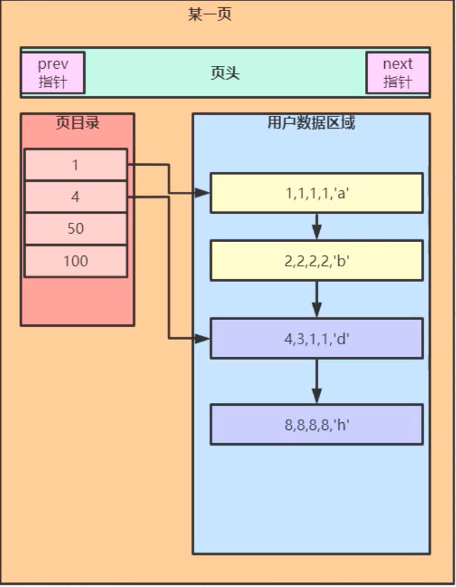

① 利用二分查找法先定位到页目录为50的指针。

② 根据指针去磁盘中取出所需要查找的数据项。


## 主键索引的判断

26、请解释下`select * from t where id>7` 是否会走索引？为什么？`select * from t where id<7`是否也会走索引。

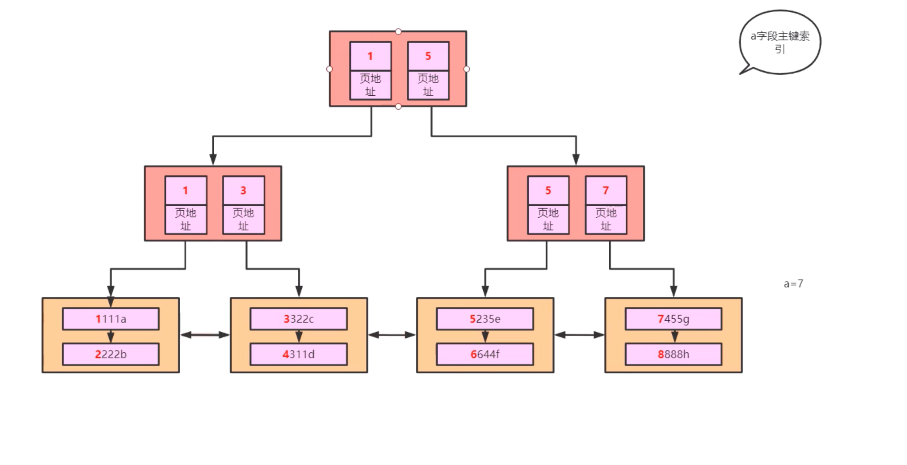

大于7会走索引，因为会先找到id等于7的索引页指针，该指针对应的数据项一定都是大于7的。

小于7也会走索引，同样的道理，先找到id等于7的索引页指针，因为MySQL的叶子节点指针是双向指针，所以会选择从磁盘中取出等于7前面的所有数据。


## 联合索引结构说明

27、请说明下字段bcd联合索引的结构，画图说明。

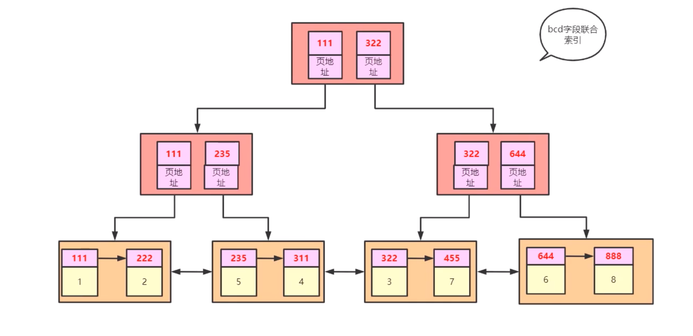

说明：

① 联合索引的结构中只冗余了所需的联合索引字段。

② 联合索引的结构中除了会有联合索引的冗余，还需要对应主键索引的冗余。

③ 利用主键去主键索引上面找表的过程我们称为回表。


问：如上图建立联合索引，`select * from t1 where b>1`是否会走索引？

答：不会走索引，因为select * 会多走七次回表查询，效率比走全表扫描低，所以MySQL会选择放弃走索引，而直接全表扫描。

问：如上图建立联合索引，`select b from t1 where b>1`是否会走索引？

答：会走索引。覆盖索引，不需要回表。

问：如上图建立联合索引，`select b,c,d from t1 where b>1`是否会走索引？

答：会走索引。覆盖索引，不需要回表。

问：如上图建立联合索引，`select b,c,d,a from t1 where b>1`是否会走索引？

答：会走索引。覆盖索引，不需要回表。a本身就是一个主键值，所以不需要回表就可以找到。


问：如上图建立联合索引，`select * from t1 where b>6`是否会走索引？

答：会走索引。原理同上。

## 聚簇索引和非聚簇索引

28、什么是聚族索引，什么是非聚族索引？

**聚簇索引：**将数据存储与索引放到了一块，索引结构的叶子节点保存了行数据。

**非聚簇索引：**将数据与索引分开存储，索引结构的叶子节点指向了数据对应的位置。

>  区别：数据跟索引是否聚集存储的。

存储引擎：不同的数据文件在磁盘的不同组织形式。

`InnoDB` 引擎 包括`.frm`和`.ibd`。`MyISAM`包括`.frm`、`.myd`、`.myi`。

如下图所示，`MyISAM`索引文件和数据文件是分离的（非聚簇索引）。


​                                              ` MyISAM`索引文件和数据文件是分离的（非聚簇索引）


## 回表、覆盖索引、索引下推、最左前缀匹配

29、什么是回表？什么是覆盖索引？什么是索引下推？什么是最左前缀匹配？

回表就是先通过数据库索引扫描出数据所在的行，再通过行主键id取出索引中未提供的数据，即基于非主键索引的查询需要多扫描一棵索引树。

覆盖索引（covering index ，或称为索引覆盖）即从非主键索引中就能查到的记录，而不需要查询主键索引中的记录，避免了回表的产生减少了树的搜索次数，显著提升性能。

索引条件下推优化（Index Condition Pushdown (ICP) ）是MySQL5.6添加的，用于优化数据查询。 不使用索引条件下推优化时存储引擎通过索引检索到数据，然后返回给MySQL服务器，服务器然后判断数据是否符合条件。 当使用索引条件下推优化时，如果存在某些被索引的列的判断条件时，MySQL服务器将这一部分判断条件传递给存储引擎，然后由存储引擎通过判断索引是否符合MySQL服务器传递的条件，只有当索引符合条件时才会将数据检索出来返回给MySQL服务器。索引条件下推优化可以减少存储引擎查询基础表的次数，也可以减少MySQL服务器从存储引擎接收数据的次数。 

最左前缀匹配：在MySQL建立联合索引时会遵守最左前缀匹配原则，即最左优先，在检索数据时从联合索引的最左边开始匹配。

## 局部性原理和磁盘预读

30、什么是局部性原理？什么是磁盘预读？

* 局部性原理： 数据和程序都有聚集成群的倾向，分为空间局部性和时间局部性。
* 磁盘预读：内存和磁盘在进行交互的时候，要保证每次读取需要一个逻辑单位，而这个逻辑单位叫做页，一般都是4K或者8k，在进行读取的时候一般都是4k的整数倍，InnoDB规定每次读取16kb的数据。

## MySQL的索引层数

31、MySQL的索引一般有几层？创建的索引字段是长了好还是短了好？

一般情况下，3到4层就足以支撑千万级别的表查询。


## 代理主键和自然主键

32、我们在创建表的时候使用代理主键还是自然主键？主键设置好了之后，要不要自增？在分布式应用场景中，自增id还适用么？


## 事务的ACID特性

33、什么是事务？事务的ACID特性是什么？

> 根据维基百科的定义，数据库事务（简称：事务）是数据库管理系统DBMS（Database Management System）执行过程中的一个逻辑单位，由一个有限的数据库操作序列构成。         

简单来讲，事务是用户定义的一系列有限的数据库操作，这些操作可以视为一个完整的逻辑处理工作单元，要么全部执行，要么全部不执行，是不可分割的工作单元。

例如，在关系数据库中，一个事务可以是一条SQL语句、一组SQL语句或整个程序。事务和程序是两个概念。一般地讲，一个程序中包含多个事务。事务的开始与结束可以由用户显式控制。如果用户没有显式地定义事务，则由DBMS按缺省规定自动划分事务。

数据库事务的使用：

```sql
BEGIN TRANSACTION – 开始事务，事务开始保存点
ROLLBACK TRANSACTION – 回滚事务，由于出现错误，回滚数据到事务开始之前
COMMIT TRANSACTION – 提交事务，保存数据到数据库中
```

 数据库事务的目的：

* 为数据库操作提供了一个从失败中恢复到正常状态的方法，同时提供了数据库即使在异常状态下仍能保持一致性的方法。
* 当多个应用程序在并发访问数据库时，可以在这些应用程序之间提供一个隔离方法，以防止彼此的操作互相干扰或者返回不准确的结果。必须保证事务之间独立运行，互不影响。

事务的基本要素（ACID）：

并非任意对数据库的操作序列都是数据库事务。为了保证数据库的正确性与一致性，数据库事务必须具有以下四个特性（`ACID`）：

* 原子性（`Atomicity`）：事务的原子性保证事务中包含的一组更新操作是原子的，不可分割的，不可分割是事务最小的工作单位，所包含的操作被视为一个整体，执行过程中遵循`要么全部执行，要不都不执行`，不存在一半执行，一半未执行的情况。
* 一致性（`Consistency`）：事务必须满足数据库的完整性约束，且事务执行完毕后会将数据库由一个一致性的状态变为另一个一致性的状态。事务的一致性与原子性是密不可分的，如银行转账的例子 A账户向B账户转1000元钱，首先A账户减去1000元钱，然后B账户增加1000元钱，这两动作是一个整体，失去任何一个操作数据的一致性状态都会遭到破坏，所以这两个动作是一个整体，要么全部操作，要么都不执行，可见事务的一致性与原子性息息相关。
* 隔离性（`Isolation`）：事务的隔离性要求事务之间是彼此独立的、隔离的。即多个事务并发执行时，一个事务的执行不应影响其他事务的执行。具体到操作是指一个事务的操作必须在一个事务`commit`之后才可以进行操作。多事务并发执行时，相当于将并发事务变成串行事务，顺序执行，如同串行调度般的执行事务。这里事务通过锁机制来保证它的可串行化。
* 持久性（`Durability`）：事务的持久性，是指一个事务一旦提交，它对数据库的改变将是永久性的，数据一旦写进了物理磁盘，其他操作将不会对它产生任何影响。即已被提交的事务对数据库的修改应该永久保存在数据库中。

## 脏读、不可重复读和幻读

34、什么是脏读、不可重复读和幻读？

不同的事务隔离级别状态下，会对数据库的数据产生以下几种影响：

* 脏读：事务 A 读取了事务 B 更新的数据，然后 B 回滚操作，那么 A 读取到的数据是脏数据。

* 不可重复读：事务 A 多次读取同一数据，事务 B 在事务 A 多次读取的过程中，对数据作了更新并提交，导致事务 A 多次读取同一数据时，结果不一致。

* 幻读：系统管理员 A 将数据库中所有学生的成绩从具体分数改为 ABCDE 等级，但是系统管理员 B 就在这个时候插入了一条具体分数的记录，当系统管理员 A 改结束后发现还有一条记录没有改过来，就好像发生了幻觉一样。

  

## MySQL 索引选择B+树而不选用B树

35、数据库的索引结构说一下，为什么MySQL用B+树做索引而不用B树?

B树的特点：

- 树内的每个节点都存储数据。这会导致一页存储的索引少，如果存储相同级别的数据量，就导致树的高度大。
- 叶子节点之间无指针相邻。不能支持范围查询。
- 节点中的数据索引从左向右递增。


B+树的特点：

- 数据只出现在叶子节点，非叶子节点不存储data，只存储索引（冗余）。非叶子节点存储的索引更多，如果存储相同级别的数据量，AA树的高度小。

- 所有叶子节点增加了一个双向指针，以更好的支持范围查询。

- 节点内部以及节点和节点之间从左到右都是依次递增的排序。

  

① B树的非叶子节点会存储数据，这会增加节点的大小，导致能存储的索引较少，树的高度增加，导致磁盘IO次数就会增大。相反的，B+树的数据只会出现在叶子节点上，也就是说非叶子节点不会存储数据，节点小，能存储的索引多，树的高度小，导致磁盘IO次数相对也小很多。

② B树的叶子节点之间没有双向指针，不能较好地支持范围查询；B+树在非叶子节点之间增加了双向指针，这会使得范围查询效率较高。


##  高度为3的 B+ Tree存放的索引数

36、请介绍下 B+ Tree 结构？当如下高度为三层树的节点撑满后能放多少索引？

B+Tree（B-Tree 变种）：

* 非叶子节点不存储data，只存储索引（冗余），可以放很多的节点。
* 叶子节点包含所有索引字段。
* 叶子节点之间用指针连接，提高区间访问的性能。
* 节点内部以及节点和节点之间从左到右都是依次递增的排序。

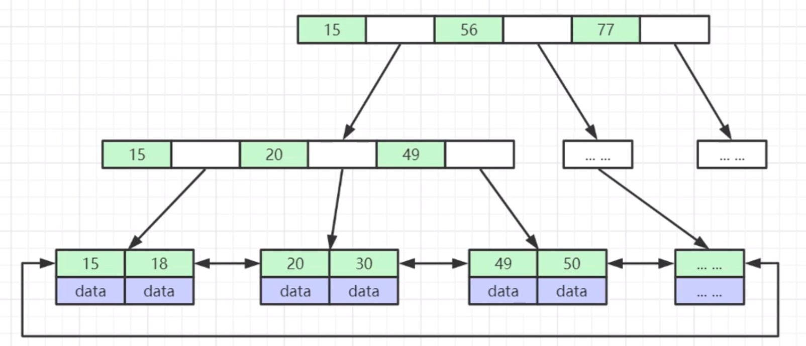


假设在 InnoDB中，一个索引节点存放的最小单位为一页（16KB），假设主键索引的数据类型为bigint，占用8个字节。一页节点（16KB）中bigint一个索引占8个字节，相邻指针地址占用6个字节，16*1024/(8+6) = 1170 个索引。

叶子节点，假设一个索引和数据占用1KB，一个叶子节点可以占用16个索引，三层高度的数可以索引1170 * 1170 * 16 =21902400 ，将近两千万的数据量。


37、为什么建议 InnoDB 表必须建主键，并且推荐使用整型的自增主键？

目的是为了更好的组织索引结构，如果没有设置主键索引会导致非主键索引无法挂载数据。

如果设置了主键，那么`InnoDB`会选择主键作为聚集索引。如果没有显式定义主键，则`InnoDB`会选择第一个不包含有`NULL`值的唯一索引作为主键索引；如果也没有这样的唯一索引，则`InnoDB`会选择内置6字节长的`ROWID`作为隐含的聚集索引(`ROWID`随着行记录的写入而主键递增)。如果不使用主键无形会增加数据库的计算成本。

使用整型是因为整型数值作为索引的比较效率比字符串（UUID）高。

如果表使用自增主键那么每次插入新的记录，记录就会顺序添加到当前索引节点的**后续位置**，主键的顺序按照数据记录的插入顺序排列，自动有序。当一页写满，就会自动开辟一个新的页。

如果使用非自增主键（如果身份证号或学号等），由于每次插入主键的值近似于随机，因此每次新记录都要被插到现有索引页的中间某个位置，此时MySQL不得不为了将新记录插到合适位置而移动数据，甚至目标页面可能已经被回写到磁盘上而从缓存中清掉，此时又要从磁盘上读回来，这增加了很多开销，同时频繁的移动、分页操作造成了大量的碎片，得到了不够紧凑的索引结构，后续不得不通过`OPTIMIZE TABLE`来重建表并优化填充页面。


## 一致性和节省存储空间

38、为什么非主键索引在InnoDB存储引擎下存储的是主键值？

① 节省存储空间。如果在每个非主键索引的叶子节点下存储非主键值，随着索引的增加，会占用大量的额存储空间。

② 一致性。如果每次在更新数据值的时候，都需要更新大量叶子节点值，除了效率低下还可能导致数据不一致。


39、联合索引的底层存储结构长什么样子（画图说明）？

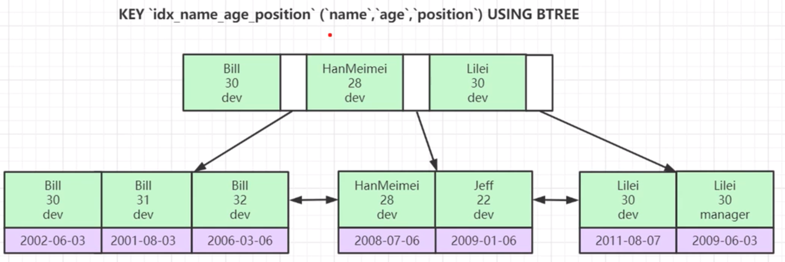

联合索引中跳过一个索引后，后面的数据是无序的，所以会走全表扫描，不走索引。


## 联合索引走索引的情况

40、联合索引字段A、B、C，查询A、C、B会走索引吗？为什么？

分以下情况而定：

① AND 连接的等值查询，A、C、B会走索引，因为语句在查询前会被优化器自动优化为A、B、C的顺序。

② AND 连接的范围查询，如果范围查询只出现在A 处，则只会使用A索引，如果范围查询只出现在B处，会使用A和B索引，如果范围查询只出现在C处，则A、B、C的索引都会使用。

③ OR 连接的等值查询，如果表中只有A、B、C字段，则会走索引，如果表中除了A、B、C字段外，还有别的字段，则索失效，走全表扫描。


## 慢SQL查询优化

41、慢SQL查询如何优化？


## 可重复读的实现

42、可重复读是怎么实现的？


## 分库分表

43、做过分库分表吗？基于什么进行拆分，拆分后出现了什么问题，怎么解决的？


## 主键递增 不推荐使用UUID

44、为什么建议主键ID是递增的，和B+tree有什么关联？为什么不建议使用UUID。

① 因为B+tree的叶子节点的数据区从左到右是顺序递增的，插入数据时候只需要追加即可。如果不是递增的，在插入时需要判断并挪动后面的数据，增加磁盘IO的成本，效率不高。

② 建立索引结构是关键字+指针，而关键字是根据其数据的类型进行存储，使用 UUID 需要使用VARCHAR类型的数据做索引，占用空间大，IO吞吐能力变弱，加载的数据变少；使用整型类型INT做索引，占用空间小。另一个原因，使用UUID会产生插入挪动操作，比追加插入效率一定是低很多的。


## 二叉树、AVL、B-树、B+树

45、二叉树、AVL树、B-树、B+树的特点和缺点？


二叉搜索树的数据结构特点：

① 一个父节点最多分裂出来两个子节点。

② 子节点的特点是左小右大。


缺点：

① 极端情况下会形成单边树。纵向发展，树的高度太高。

② 树的高度太高，导致IO次数太多。

③  节点里只有一个关键字，每次IO操作获取目标数据太少。（类比，搬家大卡车拉一卷纸）

AVL Trees (`Balanced binary search trees`)的数据结构特点：

① 

② 

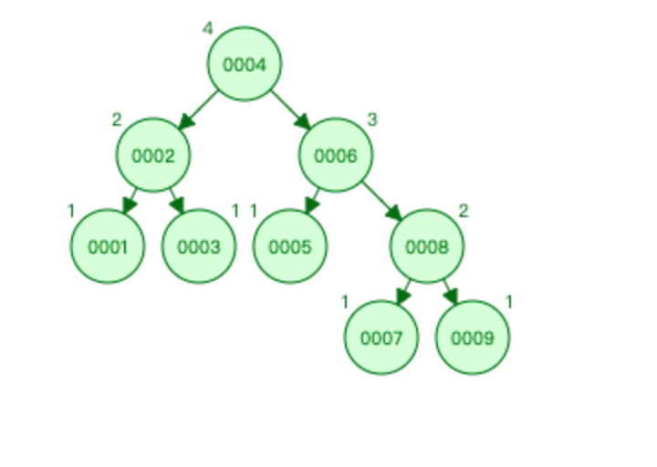


缺点：

① 本质还是二叉树，树的高度太高，导致IO次数太多。

② 节点里只有一个关键字，每次IO操作获取目标数据太少。（类比，搬家大卡车拉一卷纸）


B-树（多路搜索树、多叉平衡查找树）的特点：

① 每个节点的关键字，由1变到N。

② 关键字个数=degree -1


B+树的特点：

① 关键字个数与degree为1比1。

② 只有叶子节点有数据区。

③ 数据区间划分，1，28，66的索引数据划分，左闭右开[1，28）、[28，66)、[66，正无穷)。


B+树相对于B-树的优点：

① 基于索引的扫表操作更快。直接扫描B+树的叶子节点，而不需要像B-树一样还要去扫非叶子节点。

② 基于索引的排序更加优秀。B+树的叶子节点从左到右依次递增，取出来直接用，不需要排序。

③ IO吞吐能力更强。B+树非叶子节点只有关键字和指针，没有数据区，取出一页的数据量较大。

## 回表和覆盖索引

46、针对如下表结构创建的索引，哪个SQL的执行效率高？

基本信息：`user`表，使用`InnoDB`引擎。

表索引结构：主键索-`id`；唯一索引-`userNum`；联合索引-`name`,`phoneName`。

```sql
① select * from user where userNum = ?
② select name,userNum fromm user where userNum = ?
③ select name,userNum from user where name = ?
④ select id,userNum from user where name = ?
```

 第④个SQL执行的效率高，只需要一次索引树查找即可返回所需数据；①②③ 都需要回表，执行两次索引树查找。


## MVCC多版本并发控制

47、请简单介绍下你所理解的MVCC机制？


48、<span id="48">写一条SQL要求去除一个学生的最高分和最低分，然后算出平均分。</span>

```sql
SELECT (SUM(SCORE)-MAX(SCORE)-MIN(SCORE))/(COUNT(*)-2) AS avgScore FROM t 
HAVING COUNT(*)>2;
```


49、[MySQL 中 datetime 和 timestamp 的区别与选择](https://segmentfault.com/a/1190000017393602)

① 占用空间，datetime 占用8个字节，timestamp 占用4个字节。

② 表示范围，datetime 表示'1000-01-01 00:00:00.000000' to '9999-12-31 23:59:59.999999'，timestamp 表示 '1970-01-01 00:00:01.000000' to '2038-01-19 03:14:07.999999'。

③ `timestamp` 只占 4 个字节，而且是以`utc`的格式储存， 它会自动检索当前时区并进行转换。`datetime`以 8 个字节储存，不会进行时区的检索。也就是说，对于`timestamp`来说，如果储存时的时区和检索时的时区不一样，那么拿出来的数据也不一样。对于`datetime`来说，存什么拿到的就是什么。

④ 如果存进去的是`NULL`，`timestamp`会自动储存当前时间，而 `datetime`会储存 `NULL`。

