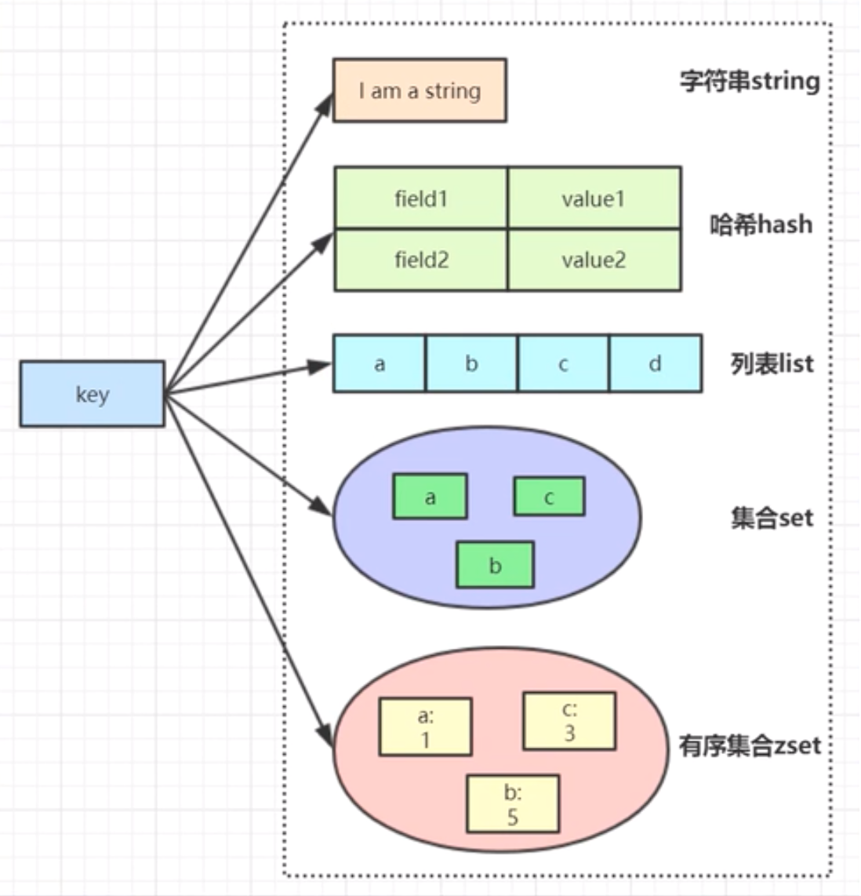
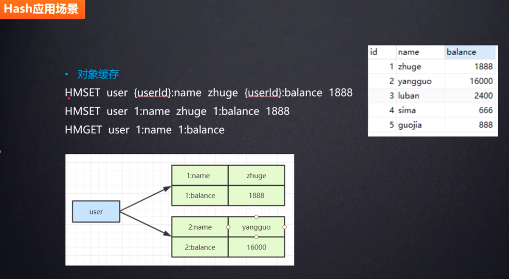
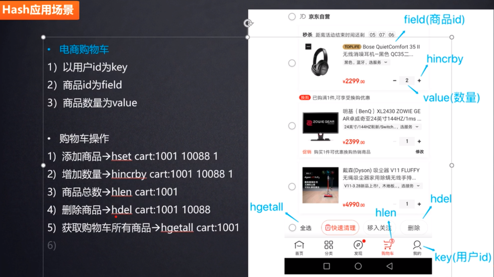
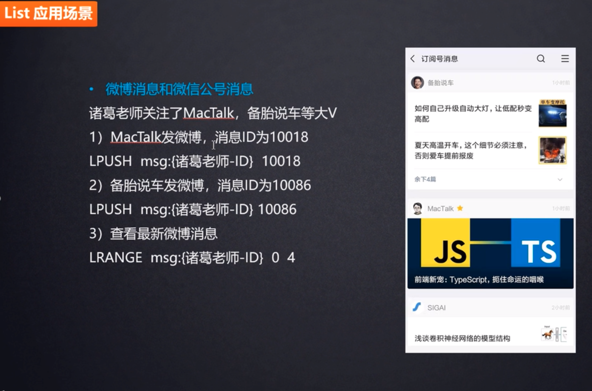
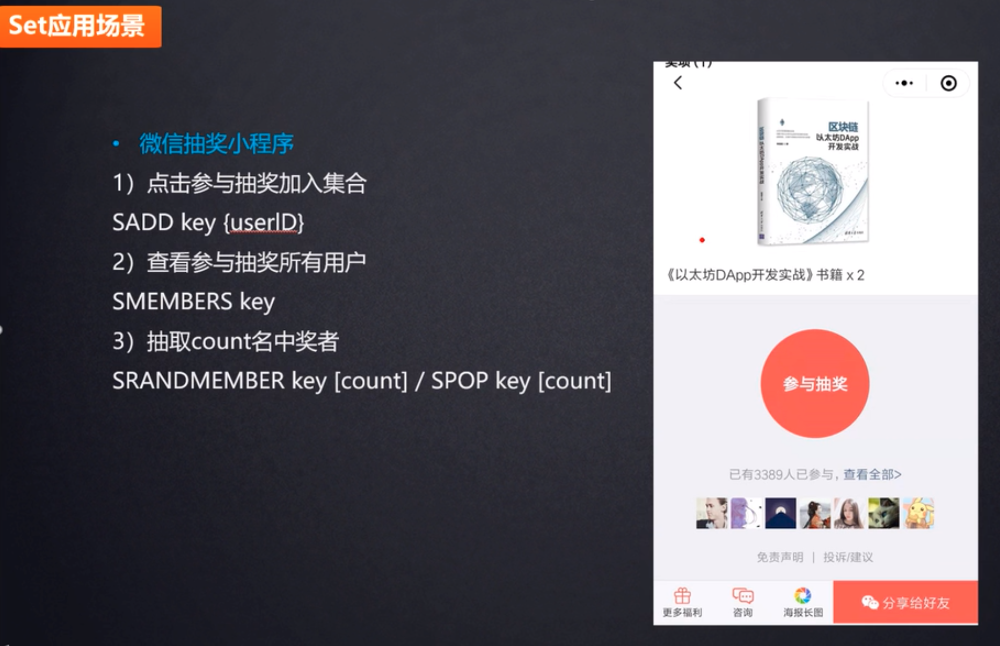
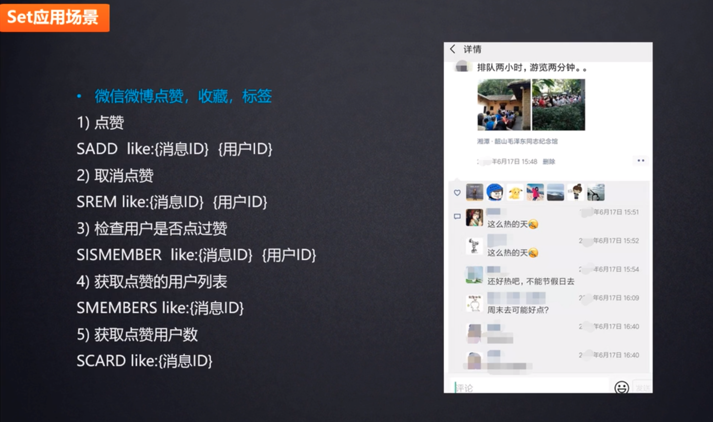
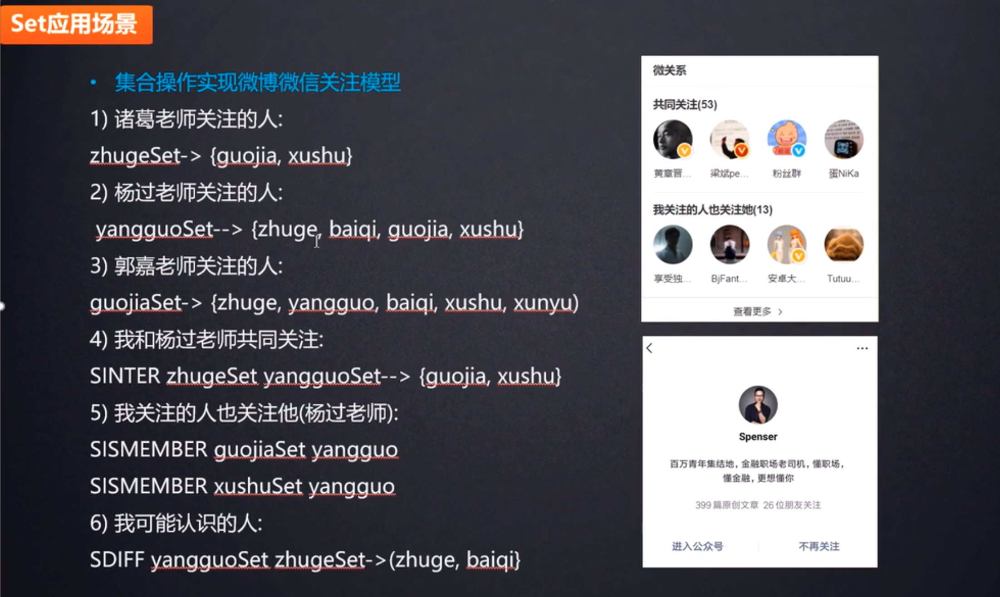

# 问题列表

1、[Redis 缓存设计和使用原则有哪些？](#01)

2、[Redis 的数据类型你都用了哪几种。 在什么样的场景下用到什么类型？](#02)

3、[ Redis 的过期失效是怎么失效的，怎么释放内存的？](#03)

4、[ Redis  “雪崩效应” 产生原因和解决方案？](#04)

5、[ 当redis做缓存时，如何确定缓存更新策略（当DB数据更新时）？](#05)

6、[ 一致性哈希的含义和应用场景及缺点？](#06)

7、[  当redis做db时如何保证数据落地（redis突然挂了）？](#07)

8、[ Redis主从结构了解么？](#08)

9、[ Redis 集群配置你觉得难点在那？](#09)

10、[ Redis数据一致性的底层原理？](#10)

11、[ Redis 和 Memcached 的区别?](#11)

12、[ Redis 的持久化的方式有几种，各自的优缺点是什么，区别是什么？](#12)

13、[Redis 是否支持事务（部分支持）？Redis 事务是否具备原子性（不保证原子性）？](#13)

14、[ MySQL 事务的三阶段和 Redis 事务的三阶段分别是什么？有什么区别？](#14)

15、[什么是悲观锁、乐观锁？什么场景下使用悲观锁、什么场景下使用乐观锁？请简单介绍下乐观锁的版本号机制？](#15)

16、[什么是 Redis 的事务？Redis 的3阶段3特性是指什么？](#16)

17、[什么是 Redis 的发布订阅？](#17)

18、[请谈一下你对 Redis 主从复制的理解？](#18)

19、[什么是 Redis 的哨兵模式？](#19)

20、[Redis 的复制原理是什么？](#20)

21、[什么是 Redis 的 `Watch` 监控？](#21)

# 解答列表

## Redis 缓存设计和使用原则

1、<span id="01">Redis 缓存设计和使用原则有哪些？</span>

* ① 只应将热数据放在缓存中。
* ② 所有缓存信息都应设置过期时间， 缓存过期时间应当分散以避免集中过期。
* ③ 缓存key应具备可读性，应避免不同业务出现同名缓存key。
* ④ 可对key进行适当的缩写以节省内存空间。
* ⑤ 一个key对应的数据不应过大，对于string类型，一个key对应的value大小应控制在10K以内，1K左右更优；
  对于hash类型，不应超过5000行。
* ⑥ 读的顺序是先缓存，后数据库；写的顺序是先数据库，后缓存。
* ⑦ 避免缓存穿透，数据库中未查询到的数据，可在Redis中设置特殊标识，以避免因缓存中无数据而导致每次请求均达到数据库。
* ⑧ 可以进行适当的缓存预热，对于上线后可能会有大量读请求的应用，在上线之前可预先将数据写入缓存中。
* ⑨ 读的顺序是先缓存，后数据库；写的顺序是先数据库，后缓存。
* ⑩ 数据一致性问题，数据源发生变更时可能导致缓存中数据与数据源中数据不一致，应根据实际业务需求来选择适当的缓存更新策略。主动更新：在数据源发生变更时同步更新缓存数据或将缓存数据过期。一致性高，维护成本较高。被动删除：根据缓存设置的过期时间有Redis负责数据的过期删除。一致性较低，维护成本较低。

## Redis 的数据类型和应用场景

2、<span id="02">Redis 的数据类型你都用了哪几种。 在什么样的场景下用到什么类型？</span>

Redis 常用的5种基本类型和3种特殊类型。

5种基本类型：String（字符串）、List（列表）、Hash（字典）、Set（集合）、Sorted Set（有序集合）。

3种特殊类型：Hyperloglog（基数）、地理位置（Geospatia）和位图 （Bitmaps）。




应用场景：

① 缓存应用。String（字符串）---短信验证码；Hash（字典）---商品信息，新闻信息。

② 排行榜应用---Sorted Set（有序集合）。很多网站都有排行榜应用的，如京东的月度销量榜单、商品按时间的上新排行榜、sina 微博热门话题等。Redis 提供的有序集合数据类构能实现各种复杂的排行榜应用。

③ 社交网络应用---Set（集合）。点赞、踩、关注/被关注、共同好友等是社交网站的基本功能，社交网站的访问量通常来说比较大，而且传统的关系数据库类型不适合存储这种类型的数据，Redis提供的哈希、集合等数据结构能很方便的的实现这些功能。

④ 最新列表和数据应用---List（列表）。Redis列表结构，LPUSH可以在列表头部插入一个内容ID作为关键字，LTRIM可用来限制列表的数量，这样列表永远为N个ID，无需查询最新的列表，直接根据ID去到对应的内容页即可。因为list是有序的，比较适合存储一些有序且数据相对固定的数据。如省市区表、字典表等。

⑤ 消息队列应用---消息队列是大型网站必用中间件，如ActiveMQ、RabbitMQ、Kafka等流行的消息队列中间件，主要用于业务解耦、流量削峰及异步处理实时性低的业务。Redis提供了发布/订阅及阻塞队列功能，能实现一个简单的消息队列系统。另外，这个不能和专业的消息中间件相比。


## Redis 和 Memcached 的区别

11、<span id="11">Redis 和 Memcached 的区别? （数据类型、持久化、单线程和多线程）</span>

* ① Redis支持更多的复杂的数据类型和操作。Redis 不仅仅支持简单的`key-value`类型的数据，同时还提供`list`，`set`，`zset`，`hash`等数据结构的存储。 Memcached 只支持`key-value`这样简单的结构。

* ② Redis支持数据的备份，即master-slave(主—从)模式的数据备份。 
* ③ Redis支持数据的持久化，可以将内存中的数据保持在磁盘中，重启的时候可以再次加载进行使用。 Memcache不支持数据持久存储 。
* ④ 内存使用率方面，对于key-value这样简单的数据储存，memcache的内存使用率更高。如果采用hash结构，Redis 的内存使用率会更高。
* ⑤ Redis 是单线程，多路复用方式提高处理效率。Memcached 是多线程的，通过CPU线程切换来提高处理效率。
* ⑥ Redis 支持原生的集群模式，而 Memcached 是不支持原生集群模式的。
* ⑦ Redis 单个value的最大限制是1GB， memcached只能保存1MB的数据。

关于什么时候选择使用Redis，什么时候选择使用Memcached，可以参考 Redis 作者的原文：

```php
You should not care too much about performances. Redis is faster per core with small values, but memcached is able to use multiple cores with a single executable and TCP port without help from the client. Also memcached is faster with big values in the order of 100k. Redis recently improved a lot about big values (unstable branch) but still memcached is faster in this use case. The point here is: nor one or the other will likely going to be your bottleneck for the query-per-second they can deliver.

You should care about memory usage. For simple key-value pairs memcached is more memory efficient. If you use Redis hashes, Redis is more memory efficient. Depends on the use case.

You should care about persistence and replication, two features only available in Redis. Even if your goal is to build a cache it helps that after an upgrade or a reboot your data are still there.

You should care about the kind of operations you need. In Redis there are a lot of complex operations, even just considering the caching use case, you often can do a lot more in a single operation, without requiring data to be processed client side (a lot of I/O is sometimes needed). This operations are often as fast as plain GET and SET. So if you don’t need just GEt/SET but more complex things Redis can help a lot (think at timeline caching).
```

##Redis 持久化的方式 RDB 和 AOF

12、<span id="12">Redis 的持久化的方式有几种，各自的优缺点是什么，区别是什么？</span>

[Redis 持久化](https://segmentfault.com/a/1190000002906345)

> Redis 有两种持久化的方式：快照（RDB文件）和追加式文件（AOF文件）。

- RDB持久化方式会在一个特定的间隔保存那个时间点的一个数据快照。
- AOF持久化方式则会记录每一个服务器收到的写操作。在服务启动时，这些记录的操作会逐条执行从而重建出原来的数据。写操作命令记录的格式跟Redis协议一致，以追加的方式进行保存。
- Redis的持久化是可以禁用的，就是说你可以让数据的生命周期只存在于服务器的运行时间里。
- 两种方式的持久化是可以同时存在的，但是当Redis重启时，AOF文件会被优先用于重建数据。

RDB 的工作原理：

> Redis调用fork()，产生一个子进程。子进程把数据写到一个临时的RDB文件。当子进程写完新的RDB文件后，把旧的RDB文件替换掉。

RDB 的优点：

> RDB文件是一个很简洁的单文件，它保存了某个时间点的Redis数据，很适合用于做备份。你可以设定一个时间点对RDB文件进行归档，这样就能在需要的时候很轻易的把数据恢复到不同的版本。
>
> 基于上面所描述的特性，RDB很适合用于灾备。单文件很方便就能传输到远程的服务器上。
>
> RDB的性能很好，需要进行持久化时，主进程会fork一个子进程出来，然后把持久化的工作交给子进程，自己不会有相关的I/O操作。
>
> 比起AOF，在数据量比较大的情况下，RDB的启动速度更快。

RDB 的缺点：

> RDB容易造成数据的丢失。假设每5分钟保存一次快照，如果Redis因为某些原因不能正常工作，那么从上次产生快照到Redis出现问题这段时间的数据就会丢失了。
>
> RDB使用`fork()`产生子进程进行数据的持久化，如果数据比较大的话可能就会花费点时间，造成Redis停止服务几毫秒。如果数据量很大且CPU性能不是很好的时候，停止服务的时间甚至会到1秒。

AOF 的工作原理：

> 快照并不是很可靠。如果你的电脑突然宕机了，或者电源断了，又或者不小心杀掉了进程，那么最新的数据就会丢失。而AOF文件则提供了一种更为可靠的持久化方式。每当Redis接受到会修改数据集的命令时，就会把命令追加到AOF文件里，当你重启Redis时，AOF里的命令会被重新执行一次，重建数据。

AOF 的优点：

> 比RDB可靠。你可以制定不同的fsync策略：不进行fsync、每秒fsync一次和每次查询进行fsync。默认是每秒fsync一次。这意味着你最多丢失一秒钟的数据。
>
> AOF日志文件是一个纯追加的文件。就算是遇到突然停电的情况，也不会出现日志的定位或者损坏问题。甚至如果因为某些原因（例如磁盘满了）命令只写了一半到日志文件里，我们也可以用`redis-check-aof`这个工具很简单的进行修复。
>
> 当AOF文件太大时，Redis会自动在后台进行重写。重写很安全，因为重写是在一个新的文件上进行，同时Redis会继续往旧的文件追加数据。新文件上会写入能重建当前数据集的最小操作命令的集合。当新文件重写完，Redis会把新旧文件进行切换，然后开始把数据写到新文件上。
>
> AOF把操作命令以简单易懂的格式一条接一条的保存在文件里，很容易导出来用于恢复数据。例如我们不小心用`FLUSHALL`命令把所有数据刷掉了，只要文件没有被重写，我们可以把服务停掉，把最后那条命令删掉，然后重启服务，这样就能把被刷掉的数据恢复回来。

AOF 的缺点：

> 在相同的数据集下，AOF文件的大小一般会比RDB文件大。
>
> 在某些fsync策略下，AOF的速度会比RDB慢。通常fsync设置为每秒一次就能获得比较高的性能，而在禁止fsync的情况下速度可以达到RDB的水平。
>
> 在过去曾经发现一些很罕见的BUG导致使用AOF重建的数据跟原数据不一致的问题。

## Redis 部分支持事务、不保证原子性

13、<span id="13">Redis 是否支持事务（部分支持）？Redis 事务是否具备原子性（不保证原子性）？</span>

> Redis 部分支持事务 ，不支持事务回滚，Redis 事务不保证原子性。

**事务是为解决数据安全操作提出的**，我们使用 Redis 事务的时候，可能会遇上以下两种错误：

- 事务在执行 `EXEC` 之前，入队的命令可能会出错。比如说，命令可能会产生语法错误（参数数量错误，参数名错误等等），或者其他更严重的错误，比如内存不足（如果服务器使用 `maxmemory` 设置了最大内存限制的话）。
- 命令可能在 `EXEC` 调用之后失败。举个例子，事务中的命令可能处理了错误类型的键，比如将列表命令用在了字符串键上面，诸如此类。

Redis 针对如上两种错误采用了不同的处理策略，对于发生在 `EXEC` 执行之前的错误，服务器会对命令入队失败的情况进行记录，并在客户端调用 `EXEC` 命令时，拒绝执行并自动放弃这个事务（Redis 2.6.5 之前的做法是检查命令入队所得的返回值：如果命令入队时返回 QUEUED ，那么入队成功；否则，就是入队失败）

对于那些在 `EXEC` 命令执行之后所产生的错误， 并没有对它们进行特别处理： 即使事务中有某个/某些命令在执行时产生了错误， 事务中的其他命令仍然会继续执行。

 `Redis` 事务使用中有四种情况：

① 一帆风顺，正常执行`EXEC`。

② 放弃事务，`DISCARD`。

③ 全体连坐（部分支持事务），入队命令产生的语法错误，在客户端调用 `EXEC` 命令时，拒绝执行并自动放弃这个事务。

④ 冤头债主（不支持事务回滚），在 `EXEC` 命令执行之后所产生的错误，事务中的其他命令仍然会继续执行。

## MySQL 事务和 Redis 事务的区别

14、 <span id="14">MySQL 事务的三阶段和 Redis 事务的三阶段分别是什么？有什么区别？</span>

MySQL事务的三阶段： `begin`、`commit `、 `rollback`。

`begin` 指示事务的开始，`commit` 指示事务的提交，`rollback` 指示事务的回滚。

```my
begin();
try {
    command1();
    command2();
    ....
    commit();
} catch(Exception e) {
    rollback();
}
```

Redis 事务的三阶段：`multi`、`queued`、`exec（discard）`。

`multi` 指示开启事务、`queued`指示命令入队（业务操作）、`exec（discard）`指示执行事务（取消事务）。

```mysql
> multi
OK
> incr star
QUEUED
> incr star
QUEUED
> exec
(integer) 1
(integer) 2
```

一个完整的事务过程，所有的指令在 exec 之前不执行，而是缓存在服务器的一个事务队列中，服务器一旦收到 exec 指令，才开执行整个事务队列，执行完毕后一次性返回所有指令的运行结果。

Redis 事务可以一次执行多个命令，本质是一组命令的集合。一个事务中的所有命令都会序列化，按顺序地串行化执行而不会被其它命令插入，不许加塞。

**区别**：

MySQL 和 Redis 的定位不一样，一个是关系型数据库，一个是 NoSQL。

MySQL 的 SQL 查询是可以相当复杂的，而且 MySQL 没有事务队列这种说法，SQL 真正开始执行才会进行分析和检查，MySQL 不可能提前知道下一条 SQL 是否正确。所以支持事务回滚是非常有必要的。

但是，Redis 使用了事务队列来预先将执行命令存储起来，并且会对其进行格式检查的，提前就知道命令是否可执行了。所以如果只要有一个命令是错误的，那么这个事务是不能执行的。

> Redis 作者认为基本只会出现在开发环境的编程错误其实在生产环境基本是不可能出现的（例如对 String 类型的数据库键执行 LPUSH 操作），所以他觉得没必要为了这事务回滚机制而改变 Redis 追求简单高效的设计主旨。

## 悲观锁和乐观锁

15、<span id="15">什么是悲观锁、乐观锁？什么场景下使用悲观锁、什么场景下使用乐观锁？请简单介绍下乐观锁的版本号机制？</span>

悲观锁(`Pessimistic Lock`)：悲观锁在操作数据时比较悲观，认为别人会同时修改数据，因此操作数据时直接把数据锁住，直到操作完成后才会释放锁；上锁期间其他人不能修改数据。传统的关系型数据库里边就用到了很多这种锁机制，比如行锁，表锁等，读锁，写锁等，都是在做操作之前先上锁。

 乐观锁(`Optimistic Lock`)：乐观锁在操作数据时非常乐观，认为别人不会同时修改数据。因此乐观锁不会上锁，但是在更新的时候会判断一下在此期间别人有没有去更新这个数据，可以使用版本号等机制。乐观锁适用于多读的应用类型，这样可以提高吞吐量，

> 乐观锁策略：提交版本必须大于记录当前版本才能执行更新。

悲观锁的实现方式是加锁，加锁既可以是对代码块加锁（如Java的`synchronized`关键字），也可以是对数据加锁（如MySQL中的排它锁）。

乐观锁的实现方式主要有两种：CAS 机制和版本号机制。

乐观锁版本号机制的基本思路：

> 在数据中增加一个字段 version，表示该数据的版本号，每当数据被修改，版本号加1。当某个线程查询数据时，将该数据的版本号一起查出来；当该线程更新数据时，判断当前版本号与之前读取的版本号，提交版本必须大于记录当前版本才能执行更新。s

## Redis 事务3阶段3特性

16、<span id="16">什么是 Redis 的事务？Redis 的3阶段3特性是指什么？</span>

`Redis` 事务：

> 可以一次执行多个命令，本质是一组命令的集合。一个事务中的所有命令都会序列化，按顺序地串行化执行而不会被其它命令插入，不许加塞 。

`Redis` 3 阶段：

* 开启事务：以MULTI开始一个事务。
* 命令入队：将多个命令入队到事务中，接到这些命令并不会立即执行，而是放到等待执行的事务队列里面。
* 执行事务（取消事务）：由EXEC命令触发执行事务（DISCARD 取消事务）。

`Redis` 3 特性：

* 单独的隔离操作：事务中的所有命令都会序列化、按顺序地执行。事务在执行的过程中，不会被其他客户端发送来的命令请求所打断。
* 没有隔离级别的概念：队列中的命令没有提交之前都不会实际的被执行，因为事务提交前任何指令都不会被实际执行，也就不存在事务内的查询要看到事务里的更新，在事务外查询不能看到这个让人万分头痛的问题。
* 不保证原子性：`Redis` 同一个事务中如果有一条命令执行失败，其后的命令仍然会被执行，没有回滚。


## Redis 发布订阅

17、<span id="17">什么是 Redis 的发布订阅？</span>


## Redis 主从复制

18、<span id="18">请谈一下你对 Redis 主从复制的理解？</span>

主从复制原理：主机数据更新后根据一定的配置和策略，自动同步到备机的`Master/Slaver`机制，`Master`以写为主，`Slave`以读为主。

主从复制作用：① 读写分离 ② 容灾恢复。

配置方法：

* 配从（库）不配主（库）。
* 修改配置文件。先拷贝多个`redis. conf`文件并分别命名；开启 `daemonize yes`；分别修改端口号；`Pid`文件名字；`Log`文件名字；`Dump rdb`文件的名字。
* 使用命名配置从库（或者直接配置`redis. conf`文件更佳）。`SLAVEOF 主库的IP 主库的端口号 `。每次与master 断开之后，都需要重新连接，除非你配置进redis.conf文件。
* 使用`info replication`查看主从复制相关信息。


使用基本特点：

① 一主二仆。一个`Master`两个`Slave`。

② 薪火相传。上一个`Slave`可以是下一个`Slave`的`Master`，`Slave`同样可以接收其他`Slaves`的连接和同步请求，那么该`Slave`作为了链条中下一个的`Master`，可以有效减轻`Master`的写压力。中途变更转向会清除之前的数据，重新建立拷贝最新的数据。

③ 反客为主。使用命令`SLAVEOF no one`，使当前数据库停止与其他数据库的同步，转成主数据库。


注：

* 配置从库后数据一定是先全量备份，然后才是增量备份。
* 从机只能读，不能写。主机既可以读也可以写。
* 主机宕机后，非手动连接`SLAVEOF no one`和哨兵模式下，从机原地等待。
* 主机宕机恢复后，从机自动恢复连接。
* 从机一台宕机后，其它从机不受影响，再次恢复后默认是master，不在是slave，除非手动指定或者配置文件配置。

## Redis 哨兵模式

19、<span id="19">什么是 Redis 的哨兵模式？</span>

Redis 的哨兵模式是为了解决传统的手动反客为主的自动版。它能够通过后台监控主机是否故障，如果故障了根据投票数自动将从库转换为主库。

使用步骤：

* 在相关 Redis 的启动配置目录下新建`sentinel.conf `文件，名字绝不能错。
*  在`sentinel.conf `文件中配置类似以下信息 `sentinel monitor 被监控数据库名字 127.0.0.1 6379 1`。最后一个数字1，表示主机挂掉后 salve 投票看让谁接替成为主机，得票数多少后成为主机。
* 启动哨兵模式。`redis-sentinel /xxx/sentinel.conf `。上述 xxx 目录依照各自的实际情况配置，可能目录不同。
* 原有的 master 挂了，哨兵模式会投票新选，重新主从继续开工，使用`info replication`查看。
* 如果之前的 master 重启回来，不会导致双 master 冲突，因为之前的 master 会变成 slave，而不在是 master，会让位于之前投票选择的 master。

> 一组 sentinel 能同时监控多个 master。

## Redis 复制原理

20、<span id = "20">Redis 的复制原理是什么？</span>

具体原理如下：

* slave 启动成功连接到 master 后会发送一个 sync 命令。`SLAVEOF 主库的IP 主库的端口号 `
* master 接到命令启动后台的存盘进程，同时收集所有接收到的用于修改数据集命令，在后台进程执行完毕之后，master 将传送整个数据文件到 slave，以完成一次完全同步。
* slave 服务在接收到数据库文件数据后，将其存盘并加载到内存中（全量复制）。
* master 继续将新的所有收集到的修改命令依次传给 slave，完成同步（增量复制）。
* 但是只要是重新连接 master，一次完全同步（全量复制)将被自动执行。

复制的缺点：

> 由于所有的写操作都是先在 master 上操作，然后同步更新到 slave 上，所以从 master 同步到 slave机器有一定的延迟，当系统很繁忙的时候，延迟问题会更加严重，slave 机器数量的增加也会使这个问题更加严重。

## Redis  Watch 监控

21、<span id="21">什么是 Redis 的 `Watch` 监控？</span>

 Redis 的 `watch` 命令，类似乐观锁，事务提交时，如果 `Key` 的值已被别的客户端改变，比如某个 `list` 已被别的客户端`push/pop`过了，整个事务队列都不会被执行。

通过  `watch` 命令在事务执行之前监控了多个 `keys`，倘若在 `watch` 之后有任何 Key 的值发生了变化，EXEC命令执行的事务都将被放弃，同时返回`Nullmulti-bulk`应答以通知调用者事务执行失败。

相对应的，`unwatch`命令，一旦执行了`exec`之前加的监控锁都会被取消掉了。


## Redis 集群 水平扩容

22、容量不够，Redis 如何进行扩容？


23、并发写操作，Redis 如何进行分摊？


24、使用 Redis 的优势，有哪些应用场景？

Redis 优势：

* 支持丰富的数据类型。5种基本类型：String（字符串）、List（列表）、Hash（字典）、Set（集合）、Sorted Set（有序集合）。3种特殊类型：Hyperloglog（基数）、地理位置（Geospatia）和位图 （Bitmaps）。
* 支持数据的持久化。可以将内存中的数据保存在磁盘中，重启的时候可以再次加载进行使用。Redis 有两种持久化的方式：快照（RDB文件）和追加式文件（AOF文件）。
* 支持主从复制。
* 支持原生的集群模式。
* 速度快，完全基于内存操作，使用C语言实现，网络层使用epoll解决高并发问题，单线程模型避免了不必要的上下文切换及竞争条件。

应用场景：

① 缓存数据库。

② 电商购物车。

② 排行榜。

③ 计数器应用。

④ 社交网络。

⑤ 消息队列。


Hash的应用场景-电商购物车：






List 的应用场景-消息列表（少量粉丝，超级大V不适用）：




Set 的应用场景-微信抽奖小程序：



Set 的应用场景-微信微博点赞，收藏，标签：



