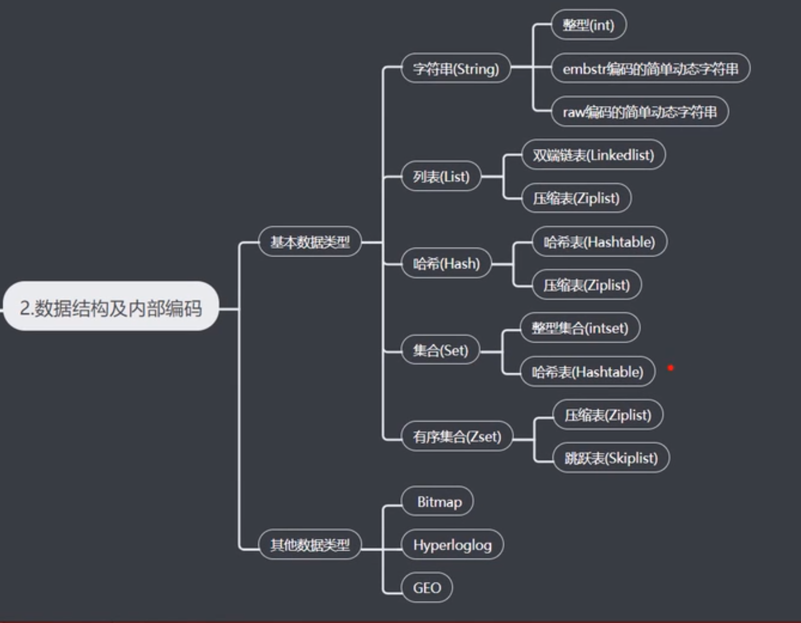
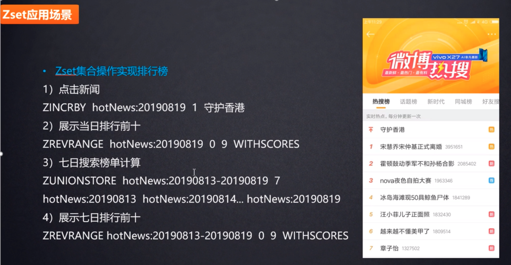
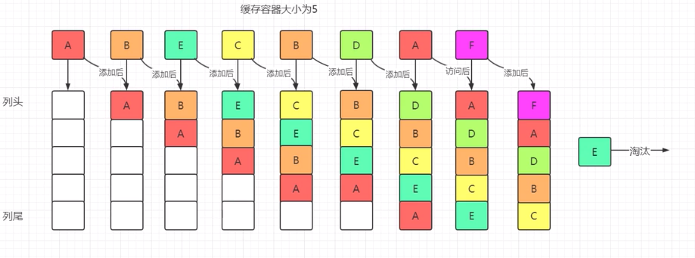
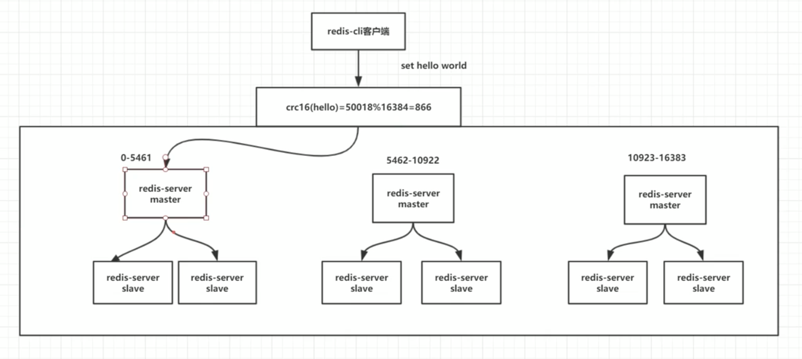
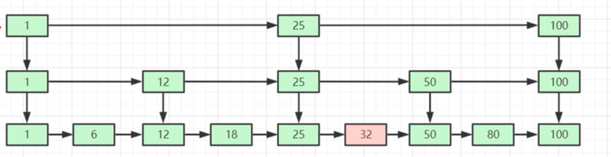

# 问题列表

01、[ Redis  缓存设计和使用原则有哪些？](#01)

02、[ Redis  的数据类型你都用了哪几种。 Redis  有什么优势？ 在什么样的场景下用到什么类型？](#02)

03、[ Redis  的过期失效是怎么失效的（ Redis  的过期策略）？](#03)

04、[ 当内存不够用时， Redis  是如何处理的（怎么释放内存的）？](#04)

05、[ 当 Redis 做缓存时，如何确定缓存更新策略（当DB数据更新时）？](#05)

06、[ 一致性哈希的含义和应用场景及缺点？](#06)

07、[  当 Redis 做db时如何保证数据落地（ Redis 突然挂了）？](#07)

08、[Redis 常见性能问题和解决方案？](#08)

09、[  Redis  集群配置你觉得难点在那？](#09)

10、[  Redis 数据一致性的底层原理？](#10)

11、[  Redis  和 Memcached 的区别?](#11)

12、[  Redis  的持久化的方式有几种，各自的优缺点是什么，区别是什么？](#12)

13、[ Redis  是否支持事务（部分支持）？ Redis  事务是否具备原子性（不保证原子性）？](#13)

14、[ MySQL 事务的三阶段和  Redis  事务的三阶段分别是什么？有什么区别？](#14)

15、[什么是悲观锁、乐观锁？什么场景下使用悲观锁、什么场景下使用乐观锁？请简单介绍下乐观锁的版本号机制？](#15)

16、[什么是  Redis  的事务？ Redis  的3阶段3特性是指什么？](#16)

17、[什么是  Redis  的发布订阅？](#17)

18、[ Redis 主从复制了解么？请谈一下你对  Redis  主从复制的理解？](#18)

19、[什么是  Redis  的哨兵模式？](#19)

20、[ Redis  的复制原理是什么？](#20)

21、[什么是  Redis  的 `Watch` 监控？](#21)

22、容量不够， Redis  如何进行扩容？

23、并发写操作， Redis  如何进行分摊？

24、[  Redis   “雪崩效应” 产生原因和解决方案？](#24)

25、[什么是 Redis 的缓存穿透？如何解决缓存穿透的问题？](#25)

26、[什么是 Redis 的缓存击穿？出现的原因是什么？解决方案有哪些？](#26)

27、[什么是跳表？数组、链表和跳表之间的区别是什么？](#27)

28、 [Redis 的有序集合和列表的区别？](#28)

29、[集合命令的实现方法？](#29)

30、[有序集合命令的实现方法？](#30)


# 解答列表

##  Redis  缓存设计和使用原则

01、<span id="01"> Redis  缓存设计和使用原则有哪些？</span>

* ① 只应将热数据放在缓存中。
* ② 所有缓存信息都应设置过期时间， 缓存过期时间应当分散以避免集中过期。
* ③ 缓存key应具备可读性，应避免不同业务出现同名缓存key。
* ④ 可对key进行适当的缩写以节省内存空间。
* ⑤ 一个key对应的数据不应过大，对于string类型，一个key对应的value大小应控制在10K以内，1K左右更优；
  对于hash类型，不应超过5000行。
* ⑥ 读的顺序是先缓存，后数据库；写的顺序是先数据库，后缓存。
* ⑦ 避免缓存穿透，数据库中未查询到的数据，可在 Redis 中设置特殊标识，以避免因缓存中无数据而导致每次请求均达到数据库。
* ⑧ 可以进行适当的缓存预热，对于上线后可能会有大量读请求的应用，在上线之前可预先将数据写入缓存中。
* ⑨ 读的顺序是先缓存，后数据库；写的顺序是先数据库，后缓存。
* ⑩ 数据一致性问题，数据源发生变更时可能导致缓存中数据与数据源中数据不一致，应根据实际业务需求来选择适当的缓存更新策略。主动更新：在数据源发生变更时同步更新缓存数据或将缓存数据过期。一致性高，维护成本较高。被动删除：根据缓存设置的过期时间有 Redis 负责数据的过期删除。一致性较低，维护成本较低。

##  Redis  的数据类型和应用场景

02、<span id="02"> Redis  的数据类型你都用了哪几种。  Redis  有什么优势？在什么样的场景下用到什么类型？</span>



 Redis  常用的5种基本类型和3种特殊类型。

5种基本类型：String（字符串）、List（列表）、Hash（字典）、Set（集合）、Sorted Set（有序集合）。

3种特殊类型：Hyperloglog（基数）、地理位置（Geospatia）和位图 （Bitmaps）。


 Redis  优势：

* 支持丰富的数据类型。5种基本类型：String（字符串）、List（列表）、Hash（字典）、Set（集合）、Sorted Set（有序集合）。3种特殊类型：Hyperloglog（基数）、地理位置（Geospatia）和位图 （Bitmaps）。
* 支持数据的持久化。可以将内存中的数据保存在磁盘中，重启的时候可以再次加载进行使用。 Redis  有两种持久化的方式：快照（RDB文件）和追加式文件（AOF文件）。
* 支持主从复制。
* 支持原生的集群模式。
* 速度快，完全基于内存操作，使用C语言实现，网络层使用epoll解决高并发问题，单线程模型避免了不必要的上下文切换及竞争条件，采用了非阻塞I/O多路复用机制。

应用场景：

① 缓存应用。String（字符串）---短信验证码；Hash（字典）---商品信息，新闻信息。

② `Hash`的应用场景-电商购物车。

③ 排行榜---Sorted Set（有序集合）。很多网站都有排行榜应用的，如京东的月度销量榜单、商品按时间的上新排行榜、sina 微博热门话题等。 Redis  提供的有序集合数据类构能实现各种复杂的排行榜应用。`Zset(sorted_set)`的应用场景-微博热搜榜。`Zset(sorted_set)`可以实现有序性操作，从而实现排行榜功能。

④ 热点数据存储---List（列表）。`List` 的应用场景-消息列表（少量粉丝，超级大V不适用）、最新文章列表、最新评论。使用List存储，ltrim 取出热点数据，删除老数据。 Redis 列表结构，LPUSH可以在列表头部插入一个内容ID作为关键字，LTRIM可用来限制列表的数量，这样列表永远为N个ID，无需查询最新的列表，直接根据ID去到对应的内容页即可。因为list是有序的，比较适合存储一些有序且数据相对固定的数据。如省市区表、字典表等。

⑤ 社交网络应用---Set（集合）。`Set` 的应用场景-微信微博点赞，收藏，标签、微信抽奖小程序、共同好友。Set 通过求交集可以实现共同好友功能、Set 求差集可以实现可能的好友，文章推荐等功能。

⑥ 消息队列。使用`sorted_set`，使用当前时间戳+需要延迟的时长做score，消息内容作为元素，调用zadd来生产消息，消费者使用`zrangbyscore` 来获取当前时间之前的数据做轮询处理，消费完再删除任务 `rem key member`。消息队列是大型网站必用中间件，如ActiveMQ、RabbitMQ、Kafka等流行的消息队列中间件，主要用于业务解耦、流量削峰及异步处理实时性低的业务。 Redis 提供了发布/订阅及阻塞队列功能，能实现一个简单的消息队列系统。另外，这个不能和专业的消息中间件相比。

⑦ 网站访问统计。

⑧ 分布式锁实现。

Hash的应用场景-电商购物车：


List 的应用场景-消息列表（少量粉丝，超级大V不适用）：


Set 的应用场景-微信抽奖小程序：


Set 的应用场景-微信微博点赞，收藏，标签：


Zset（sorted-set） 的应用场景-微博热搜榜：



##  Redis  过期策略

03、<span id="03">  Redis  的过期失效是怎么失效的（ Redis  的过期策略）？</span>

 Redis  的过期策略主要是两个：惰性删除和定期删除。

* 惰性删除。当访问键值时，再检查当前的键值是否过期，如果过期则执行删除并返回null给客户端，如果没有过期则正常返回值信息给客户端你。特点：对内存非常的不友好，对CPU非常友好。
* 定期删除。定期去循环所有设置了过期时间的key，如果有过期的直接删除。默认配置中1s中调用10次，即100ms调用一次这个方法。

定期删除的原理：

① ` Redis .conf`配置中定义了`serverCron`任务的执行周期，默认为10，代表每秒执行10次，即每100ms执行一次。

② 每次过期key清理的时间不超过CPU时间的25%，比如hz默认为10，则一次清理的最大时间为25ms。

③ 清理时依次遍历所有的db。

④ 从db中随机取出20个key，判断是否过期，如果过期则清除。

⑤ 若有5个以上的key过期，则重复步骤④，否则遍历下一个db。

⑥ 在清理的过程中，如果达到了25%CPU时间，退出清理过程。

##  Redis  淘汰策略

04、<span id="04"> 当内存不够用时， Redis  是如何处理的（怎么释放内存的）？</span>

当  Redis  的内存超过最大允许的内存后， Redis  会触发内存淘汰策略，删除一些不常用的数据，以保证  Redis  服务的正常运行。

 Redis  的内存淘汰策略有以下8种。

```shell
# volatile-lru -> Evict using approximated LRU among the keys with an expire set.
# allkeys-lru -> Evict any key using approximated LRU.
# volatile-random -> Remove a random key among the ones with an expire set.
# allkeys-random -> Remove a random key, any key.
# volatile-ttl -> Remove the key with the nearest expire time (minor TTL)
# noeviction -> Don't evict anything, just return an error on write operations.
-- 4.0版本之后增加的两种
# volatile-lfu -> Evict using approximated LFU among the keys with an expire set.
# allkeys-lfu -> Evict any key using approximated LFU.
```

这8种机制主要是什么意思呢？下面是分别针对上面的机制做一个说明。

```shell
volatile-lru：淘汰所有设置过期时间的键值中最久未使用的键值。
allkeys-lru：淘汰整个键值中最久未使用的键值。
volatile-random：随机淘汰设置了过期时间的任意键值。
allkeys-random：随机淘汰任意键值。
volatile-ttl：优先淘汰更短时间的键值。
noeviction：不淘汰任何数据，当内存不足时，执行缓存新增操作会报错，它是  Redis  默认的内存淘汰机制。
-- 4.0版本之后增加的两种
volatile-lfu：淘汰所有设置过期时间的键值中最少使用的键值。
allkeys-lfu：淘汰整个键值中最少使用的键值。
```

**LRU（The Least Recently Used，最近最少使用） 算法**：

机制：如果一个数据在最近一段时间没有被访问到，那么可以认为在将来它被访问的可能性也很小。因此，当内存不足时，最久没有被访问的数据最先被淘汰。

> 原理：LRU 算法通常通过链表来实现，添加元素的时候，直接插入表头，访问元素时，先判断元素是否在链表中存在，如果存在就把该元素移动到表头，所以链表的元素排列顺序就是元素被最近访问的顺序。当内存达到设置的阈值时，队尾的元素由于被访问的时间线较远，会被优先踢出。



**LFU （ The Least Frequently Used，最不经常使用）算法**：

如果一个数据在最近一段时间很少被访问到，那么可以认为在将来它被访问的可能性也很小，因此，当空间满时，最小访问频率的数据优先被淘汰。

##  Redis 缓存更新策略

05、<span id="05">当 Redis 做缓存时，如何确定缓存更新策略（当DB数据更新时）？</span>

使用最多的缓存策略（产生脏数据的概率太低）：先更新数据库，再删缓存。

* 先删缓存，再更新数据库（缓存中的数据变脏数据）。假设有两个并发操作，一个操作更新、另一个操作查询，更新操作删除缓存后还没来得及更新数据库，此时另一个用户发起了查询操作，它因没有命中缓存进而从数据库读，此时第一个操作还没到更新数据库的阶段，读取到的是老数据，接着写到缓存中，导致缓存中数据变成脏数据，并且会一直脏下去直到缓存过期或发起新的更新操作。
* 先更新数据库，再更新缓存。两个并发更新操作，分别出现一前一后写数据库、一后一前写缓存，由于要更新数据库和缓存两块数据，所以它的写性能就比较低。
* Read/Write Through 缓存代理。当有数据更新的时候，如果没有命中缓存，直接更新数据库，然后返回。如果命中了缓存，则更新缓存，然后再由Cache自己更新数据库（这是一个同步操作）。
* Write Back 写回。在更新数据的时候，只更新缓存，不更新数据库，而我们的缓存会异步地批量更新数据库。带来的问题是，数据不是强一致性的，而且可能会丢失。


## Redis 持久化

07、<span id="07">当 Redis 做db时如何保证数据落地（ Redis 突然挂了）?</span></span>

> Redis  有两种持久化的方式：快照（RDB文件）和追加式文件（AOF文件）。

RDB 持久化方式能够在指定的时间间隔对数据进行快照存储。

AOF 持久化方式记录每次对服务器写的操作，当服务器重启的时候会重新执行这些命令来恢复原始的数据，AOF 以 Redis 协议追加保存每次写的操作到文件末尾。Redis 还能对AOF文件进行后台重写，使得AOF文件的体积不至于过大。

如果你非常关心你的数据， 但仍然可以承受数分钟以内的数据丢失，那么你可以只使用RDB持久化。

> 最好的方案是：同时开启这两种持久化方式， 在这种情况下,，当redis重启的时候会优先载入AOF文件来恢复原始的数据，因为在通常情况下AOF文件保存的数据集要比RDB文件保存的数据集要完整。

## Redis 性能问题

08、<span id = "08">Redis 常见性能问题和解决方案？</span>

*  master 最好不要做任何持久化工作，如 RDB 内存快照和 AOF 日志文件。

* 如果数据比较重要，某个 slave 开启 AOF 备份数据，策略设置为每秒同步一次。

* 为了主从复制的速度和连接的稳定性，master和 slave最好在同一个局域网内。

* 尽量避免在压力很大的主库上增加从库。

* 主从复制不要用图状结构，用单向链表结构更为稳定，即：`Master <- Slave1 <- Slave2 <- Slave3…`这样的结构方便解决单点故障问题，实现 Slave 对 Master 的替换。如果 Master 挂了，可以立刻启用 Slave1 做Master，其他不变。

## Redis 集群

09、<span id="09">Redis  集群配置你觉得难点在那？</span>

Redis 集群的演变过程：

> ① 单机版，核心技术是持久化。持久化的主要作用是数据备份，将数据保存在硬盘上，保证数据不会丢失。
>
> ② 主从复制。复制是高可用Redis的基础，哨兵模式和集群模式都是建立在主从复制的基础上的。复制主要实现了读写分离合数据异地容灾备份及简单的故障恢复，缺陷是故障恢复无法自动化，写操作无法实现负载均衡，存储能力受到单机的限制。
>
> ③ 哨兵模式。哨兵在复制的基础上实现了自动化的故障恢复，缺陷是故障恢复无法自动化，写操作无法实现负载均衡，存储能力受到单机的限制。
>
> ④ 集群模式。通过集群，Redis 解决了写操作无法负载均衡，存储能力不在受到单击的限制，实现了较为完善的高可用方案。

集群模式：




##  Redis  和 Memcached 的区别

11、<span id="11"> Redis  和 Memcached 的区别? （数据类型、持久化、单线程和多线程）</span>

* ①  Redis 支持更多的复杂的数据类型和操作。 Redis  不仅仅支持简单的`key-value`类型的数据，同时还提供`list`，`set`，`zset`，`hash`等数据结构的存储。 Memcached 只支持`key-value`这样简单的结构。

* ②  Redis 支持数据的备份，即master-slave(主—从)模式的数据备份。 
* ③  Redis 支持数据的持久化，可以将内存中的数据保持在磁盘中，重启的时候可以再次加载进行使用。 Memcache不支持数据持久存储 。
* ④ 内存使用率方面，对于key-value这样简单的数据储存，memcache的内存使用率更高。如果采用hash结构， Redis  的内存使用率会更高。
* ⑤  Redis  是单线程，多路复用方式提高处理效率。Memcached 是多线程的，通过CPU线程切换来提高处理效率。
* ⑥  Redis  支持原生的集群模式，而 Memcached 是不支持原生集群模式的。
* ⑦  Redis  单个value的最大限制是1GB， memcached只能保存1MB的数据。

关于什么时候选择使用 Redis ，什么时候选择使用Memcached，可以参考  Redis  作者的原文：

```php
You should not care too much about performances.  Redis  is faster per core with small values, but memcached is able to use multiple cores with a single executable and TCP port without help from the client. Also memcached is faster with big values in the order of 100k.  Redis  recently improved a lot about big values (unstable branch) but still memcached is faster in this use case. The point here is: nor one or the other will likely going to be your bottleneck for the query-per-second they can deliver.

You should care about memory usage. For simple key-value pairs memcached is more memory efficient. If you use  Redis  hashes,  Redis  is more memory efficient. Depends on the use case.

You should care about persistence and replication, two features only available in  Redis . Even if your goal is to build a cache it helps that after an upgrade or a reboot your data are still there.

You should care about the kind of operations you need. In  Redis  there are a lot of complex operations, even just considering the caching use case, you often can do a lot more in a single operation, without requiring data to be processed client side (a lot of I/O is sometimes needed). This operations are often as fast as plain GET and SET. So if you don’t need just GEt/SET but more complex things  Redis  can help a lot (think at timeline caching).
```

## Redis  持久化的方式 RDB 和 AOF

12、<span id="12"> Redis  的持久化的方式有几种，各自的优缺点是什么，区别是什么？</span>

[ Redis  持久化](https://segmentfault.com/a/1190000002906345)

>  Redis  有两种持久化的方式：快照（RDB文件）和追加式文件（AOF文件）。

- RDB持久化方式会在一个特定的间隔保存那个时间点的一个数据快照。
- AOF持久化方式则会记录每一个服务器收到的写操作。在服务启动时，这些记录的操作会逐条执行从而重建出原来的数据。写操作命令记录的格式跟 Redis 协议一致，以追加的方式进行保存。
-  Redis 的持久化是可以禁用的，就是说你可以让数据的生命周期只存在于服务器的运行时间里。
- 两种方式的持久化是可以同时存在的，但是当 Redis 重启时，AOF文件会被优先用于重建数据。

RDB 的工作原理：

>  Redis 调用fork()，产生一个子进程。子进程把数据写到一个临时的RDB文件。当子进程写完新的RDB文件后，把旧的RDB文件替换掉。

RDB 的优点：

> RDB文件是一个很简洁的单文件，它保存了某个时间点的 Redis 数据，很适合用于做备份。你可以设定一个时间点对RDB文件进行归档，这样就能在需要的时候很轻易的把数据恢复到不同的版本。
>
> 基于上面所描述的特性，RDB很适合用于灾备。单文件很方便就能传输到远程的服务器上。
>
> RDB的性能很好，需要进行持久化时，主进程会fork一个子进程出来，然后把持久化的工作交给子进程，自己不会有相关的I/O操作。
>
> 比起AOF，在数据量比较大的情况下，RDB的启动速度更快。

RDB 的缺点：

> RDB容易造成数据的丢失。假设每5分钟保存一次快照，如果 Redis 因为某些原因不能正常工作，那么从上次产生快照到 Redis 出现问题这段时间的数据就会丢失了。
>
> RDB使用`fork()`产生子进程进行数据的持久化，如果数据比较大的话可能就会花费点时间，造成 Redis 停止服务几毫秒。如果数据量很大且CPU性能不是很好的时候，停止服务的时间甚至会到1秒。

AOF 的工作原理：

> 快照并不是很可靠。如果你的电脑突然宕机了，或者电源断了，又或者不小心杀掉了进程，那么最新的数据就会丢失。而AOF文件则提供了一种更为可靠的持久化方式。每当 Redis 接受到会修改数据集的命令时，就会把命令追加到AOF文件里，当你重启 Redis 时，AOF里的命令会被重新执行一次，重建数据。

AOF 的优点：

> 比RDB可靠。你可以制定不同的fsync策略：不进行fsync、每秒fsync一次和每次查询进行fsync。默认是每秒fsync一次。这意味着你最多丢失一秒钟的数据。
>
> AOF日志文件是一个纯追加的文件。就算是遇到突然停电的情况，也不会出现日志的定位或者损坏问题。甚至如果因为某些原因（例如磁盘满了）命令只写了一半到日志文件里，我们也可以用` Redis -check-aof`这个工具很简单的进行修复。
>
> 当AOF文件太大时， Redis 会自动在后台进行重写。重写很安全，因为重写是在一个新的文件上进行，同时 Redis 会继续往旧的文件追加数据。新文件上会写入能重建当前数据集的最小操作命令的集合。当新文件重写完， Redis 会把新旧文件进行切换，然后开始把数据写到新文件上。
>
> AOF把操作命令以简单易懂的格式一条接一条的保存在文件里，很容易导出来用于恢复数据。例如我们不小心用`FLUSHALL`命令把所有数据刷掉了，只要文件没有被重写，我们可以把服务停掉，把最后那条命令删掉，然后重启服务，这样就能把被刷掉的数据恢复回来。

AOF 的缺点：

> 在相同的数据集下，AOF文件的大小一般会比RDB文件大。
>
> 在某些fsync策略下，AOF的速度会比RDB慢。通常fsync设置为每秒一次就能获得比较高的性能，而在禁止fsync的情况下速度可以达到RDB的水平。
>
> 在过去曾经发现一些很罕见的BUG导致使用AOF重建的数据跟原数据不一致的问题。

##  Redis  部分支持事务、不保证原子性

13、<span id="13"> Redis  是否支持事务（部分支持）？ Redis  事务是否具备原子性（不保证原子性）？</span>

>  Redis  部分支持事务 ，不支持事务回滚， Redis  事务不保证原子性。

**事务是为解决数据安全操作提出的**，我们使用  Redis  事务的时候，可能会遇上以下两种错误：

- 事务在执行 `EXEC` 之前，入队的命令可能会出错。比如说，命令可能会产生语法错误（参数数量错误，参数名错误等等），或者其他更严重的错误，比如内存不足（如果服务器使用 `maxmemory` 设置了最大内存限制的话）。
- 命令可能在 `EXEC` 调用之后失败。举个例子，事务中的命令可能处理了错误类型的键，比如将列表命令用在了字符串键上面，诸如此类。

 Redis  针对如上两种错误采用了不同的处理策略，对于发生在 `EXEC` 执行之前的错误，服务器会对命令入队失败的情况进行记录，并在客户端调用 `EXEC` 命令时，拒绝执行并自动放弃这个事务（ Redis  2.6.5 之前的做法是检查命令入队所得的返回值：如果命令入队时返回 QUEUED ，那么入队成功；否则，就是入队失败）

对于那些在 `EXEC` 命令执行之后所产生的错误， 并没有对它们进行特别处理： 即使事务中有某个/某些命令在执行时产生了错误， 事务中的其他命令仍然会继续执行。

 ` Redis ` 事务使用中有四种情况：

① 一帆风顺，正常执行`EXEC`。

② 放弃事务，`DISCARD`。

③ 全体连坐（部分支持事务），入队命令产生的语法错误，在客户端调用 `EXEC` 命令时，拒绝执行并自动放弃这个事务。

④ 冤头债主（不支持事务回滚），在 `EXEC` 命令执行之后所产生的错误，事务中的其他命令仍然会继续执行。

## MySQL 事务和  Redis  事务的区别

14、 <span id="14">MySQL 事务的三阶段和  Redis  事务的三阶段分别是什么？有什么区别？</span>

MySQL事务的三阶段： `begin`、`commit `、 `rollback`。

`begin` 指示事务的开始，`commit` 指示事务的提交，`rollback` 指示事务的回滚。

```my
begin();
try {
    command1();
    command2();
    ....
    commit();
} catch(Exception e) {
    rollback();
}
```

 Redis  事务的三阶段：`multi`、`queued`、`exec（discard）`。

`multi` 指示开启事务、`queued`指示命令入队（业务操作）、`exec（discard）`指示执行事务（取消事务）。

```mysql
> multi
OK
> incr star
QUEUED
> incr star
QUEUED
> exec
(integer) 1
(integer) 2
```

一个完整的事务过程，所有的指令在 exec 之前不执行，而是缓存在服务器的一个事务队列中，服务器一旦收到 exec 指令，才开执行整个事务队列，执行完毕后一次性返回所有指令的运行结果。

 Redis  事务可以一次执行多个命令，本质是一组命令的集合。一个事务中的所有命令都会序列化，按顺序地串行化执行而不会被其它命令插入，不许加塞。

**区别**：

MySQL 和  Redis  的定位不一样，一个是关系型数据库，一个是 NoSQL。

MySQL 的 SQL 查询是可以相当复杂的，而且 MySQL 没有事务队列这种说法，SQL 真正开始执行才会进行分析和检查，MySQL 不可能提前知道下一条 SQL 是否正确。所以支持事务回滚是非常有必要的。

但是， Redis  使用了事务队列来预先将执行命令存储起来，并且会对其进行格式检查的，提前就知道命令是否可执行了。所以如果只要有一个命令是错误的，那么这个事务是不能执行的。

>  Redis  作者认为基本只会出现在开发环境的编程错误其实在生产环境基本是不可能出现的（例如对 String 类型的数据库键执行 LPUSH 操作），所以他觉得没必要为了这事务回滚机制而改变  Redis  追求简单高效的设计主旨。

## 悲观锁和乐观锁

15、<span id="15">什么是悲观锁、乐观锁？什么场景下使用悲观锁、什么场景下使用乐观锁？请简单介绍下乐观锁的版本号机制？</span>

悲观锁(`Pessimistic Lock`)：悲观锁在操作数据时比较悲观，认为别人会同时修改数据，因此操作数据时直接把数据锁住，直到操作完成后才会释放锁；上锁期间其他人不能修改数据。传统的关系型数据库里边就用到了很多这种锁机制，比如行锁，表锁等，读锁，写锁等，都是在做操作之前先上锁。

 乐观锁(`Optimistic Lock`)：乐观锁在操作数据时非常乐观，认为别人不会同时修改数据。因此乐观锁不会上锁，但是在更新的时候会判断一下在此期间别人有没有去更新这个数据，可以使用版本号等机制。乐观锁适用于多读的应用类型，这样可以提高吞吐量，

> 乐观锁策略：提交版本必须大于记录当前版本才能执行更新。

悲观锁的实现方式是加锁，加锁既可以是对代码块加锁（如Java的`synchronized`关键字），也可以是对数据加锁（如MySQL中的排它锁）。

乐观锁的实现方式主要有两种：CAS 机制和版本号机制。

乐观锁版本号机制的基本思路：

> 在数据中增加一个字段 version，表示该数据的版本号，每当数据被修改，版本号加1。当某个线程查询数据时，将该数据的版本号一起查出来；当该线程更新数据时，判断当前版本号与之前读取的版本号，提交版本必须大于记录当前版本才能执行更新。s

##  Redis  事务3阶段3特性

16、<span id="16">什么是  Redis  的事务？ Redis  的3阶段3特性是指什么？</span>

` Redis ` 事务：

> 可以一次执行多个命令，本质是一组命令的集合。一个事务中的所有命令都会序列化，按顺序地串行化执行而不会被其它命令插入，不许加塞 。

` Redis ` 3 阶段：

* 开启事务：以MULTI开始一个事务。
* 命令入队：将多个命令入队到事务中，接到这些命令并不会立即执行，而是放到等待执行的事务队列里面。
* 执行事务（取消事务）：由EXEC命令触发执行事务（DISCARD 取消事务）。

` Redis ` 3 特性：

* 单独的隔离操作：事务中的所有命令都会序列化、按顺序地执行。事务在执行的过程中，不会被其他客户端发送来的命令请求所打断。
* 没有隔离级别的概念：队列中的命令没有提交之前都不会实际的被执行，因为事务提交前任何指令都不会被实际执行，也就不存在事务内的查询要看到事务里的更新，在事务外查询不能看到这个让人万分头痛的问题。
* 不保证原子性：` Redis ` 同一个事务中如果有一条命令执行失败，其后的命令仍然会被执行，没有回滚。


##  Redis  发布订阅

17、<span id="17">什么是  Redis  的发布订阅？</span>


##  Redis  主从复制

18、<span id="18"> Redis 主从复制了解么？请谈一下你对  Redis  主从复制的理解？</span>

主从复制原理：

> 主机数据更新后根据一定的配置和策略，自动同步到备机的`Master/Slaver`机制，`Master`以写为主，`Slave`以读为主。

主从复制作用：① 读写分离 ② 容灾恢复。

配置方法：

* 配从（库）不配主（库）。
* 修改配置文件。先拷贝多个` Redis . conf`文件并分别命名；开启 `daemonize yes`；分别修改端口号；`Pid`文件名字；`Log`文件名字；`Dump rdb`文件的名字。
* 使用命名配置从库（或者直接配置` Redis . conf`文件更佳）。`SLAVEOF 主库的IP 主库的端口号 `。每次与master 断开之后，都需要重新连接，除非你配置进 Redis .conf文件。
* 使用`info replication`查看主从复制相关信息。

使用基本特点：

① 一主二仆。一个`Master`两个`Slave`。

② 薪火相传。上一个`Slave`可以是下一个`Slave`的`Master`，`Slave`同样可以接收其他`Slaves`的连接和同步请求，那么该`Slave`作为了链条中下一个的`Master`，可以有效减轻`Master`的写压力。中途变更转向会清除之前的数据，重新建立拷贝最新的数据。

③ 反客为主。使用命令`SLAVEOF no one`，使当前数据库停止与其他数据库的同步，转成主数据库。

注：

* 配置从库后数据一定是先全量备份，然后才是增量备份。
* 从机只能读，不能写。主机既可以读也可以写。
* 主机宕机后，非手动连接`SLAVEOF no one`和哨兵模式下，从机原地等待。
* 主机宕机恢复后，从机自动恢复连接。
* 从机一台宕机后，其它从机不受影响，再次恢复后默认是master，不在是slave，除非手动指定或者配置文件配置。

##  Redis  哨兵模式

19、<span id="19">什么是  Redis  的哨兵模式？</span>

 Redis  的哨兵模式是为了解决传统的手动反客为主的自动版。它能够通过后台监控主机是否故障，如果故障了根据投票数自动将从库转换为主库。

使用步骤：

* 在相关  Redis  的启动配置目录下新建`sentinel.conf `文件，名字绝不能错。
*  在`sentinel.conf `文件中配置类似以下信息 `sentinel monitor 被监控数据库名字 127.0.0.1 6379 1`。最后一个数字1，表示主机挂掉后 salve 投票看让谁接替成为主机，得票数多少后成为主机。
* 启动哨兵模式。` Redis -sentinel /xxx/sentinel.conf `。上述 xxx 目录依照各自的实际情况配置，可能目录不同。
* 原有的 master 挂了，哨兵模式会投票新选，重新主从继续开工，使用`info replication`查看。
* 如果之前的 master 重启回来，不会导致双 master 冲突，因为之前的 master 会变成 slave，而不在是 master，会让位于之前投票选择的 master。

> 一组 sentinel 能同时监控多个 master。

##  Redis  复制原理

20、<span id = "20"> Redis  的复制原理是什么？</span>

具体原理如下：

* slave 启动成功连接到 master 后会发送一个 sync 命令。`SLAVEOF 主库的IP 主库的端口号 `
* master 接到命令启动后台的存盘进程，同时收集所有接收到的用于修改数据集命令，在后台进程执行完毕之后，master 将传送整个数据文件到 slave，以完成一次完全同步。
* slave 服务在接收到数据库文件数据后，将其存盘并加载到内存中（全量复制）。
* master 继续将新的所有收集到的修改命令依次传给 slave，完成同步（增量复制）。
* 但是只要是重新连接 master，一次完全同步（全量复制)将被自动执行。

复制的缺点：

> 由于所有的写操作都是先在 master 上操作，然后同步更新到 slave 上，所以从 master 同步到 slave机器有一定的延迟，当系统很繁忙的时候，延迟问题会更加严重，slave 机器数量的增加也会使这个问题更加严重。

##  Redis   Watch 监控

21、<span id="21">什么是  Redis  的 `Watch` 监控？</span>

  Redis  的 `watch` 命令，类似乐观锁，事务提交时，如果 `Key` 的值已被别的客户端改变，比如某个 `list` 已被别的客户端`push/pop`过了，整个事务队列都不会被执行。

通过  `watch` 命令在事务执行之前监控了多个 `keys`，倘若在 `watch` 之后有任何 Key 的值发生了变化，EXEC命令执行的事务都将被放弃，同时返回`Nullmulti-bulk`应答以通知调用者事务执行失败。

相对应的，`unwatch`命令，一旦执行了`exec`之前加的监控锁都会被取消掉了。


##  Redis  集群 水平扩容

22、容量不够， Redis  如何进行扩容？


23、并发写操作， Redis  如何进行分摊？


## Redis 缓存雪崩

24、 <span id="24"> Redis 雪崩效应产生原因和解决方案？</span>

> 如果缓存在某一个时刻出现大规模的key失效，那么就会导致大量的请求打在了数据库上面，导致数据库压力巨大，如果在高并发的情况下，可能瞬间就会导致数据库宕机。这时候如果运维马上又重启数据库，马上又会有新的流量把数据库打死。这就是缓存雪崩。

造成缓存雪崩的关键在于同一时间的大规模的key失效，为什么会出现这个问题，主要有两种可能：第一种是Redis宕机，第二种可能就是采用了相同的过期时间

解决方案：

* 事前：

① 均匀过期：设置不同的过期时间，让缓存失效的时间尽量均匀，避免相同的过期时间导致缓存雪崩，造成大量数据库的访问。

② 分级缓存：第一级缓存失效的基础上，访问二级缓存，每一级缓存的失效时间都不同。

③ 热点数据缓存永远不过期。永不过期实际包含两层意思：物理不过期，针对热点key不设置过期时间；逻辑过期，把过期时间存在key对应的value里，如果发现要过期了，通过一个后台的异步线程进行缓存的构建。

④ 保证Redis缓存的高可用，防止Redis宕机导致缓存雪崩的问题。可以使用 主从+ 哨兵，Redis集群来避免 Redis 全盘崩溃的情况。

* 事中：

① 互斥锁：在缓存失效后，通过互斥锁或者队列来控制读数据写缓存的线程数量，比如某个key只允许一个线程查询数据和写缓存，其他线程等待。这种方式会阻塞其他的线程，此时系统的吞吐量会下降

② 使用熔断机制，限流降级。当流量达到一定的阈值，直接返回“系统拥挤”之类的提示，防止过多的请求打在数据库上将数据库击垮，至少能保证一部分用户是可以正常使用，其他用户多刷新几次也能得到结果。

* 事后：开启Redis持久化机制，尽快恢复缓存数据，一旦重启，就能从磁盘上自动加载数据恢复内存中的数据。

## Redis 缓存穿透

25、<span id="25">什么是 Redis 的缓存穿透？如何解决缓存穿透的问题？</span>

**什么是缓存穿透：**

> 缓存穿透是指用户请求的数据在缓存中不存在即没有命中，同时在数据库中也不存在，导致用户每次请求该数据都要去数据库中查询一遍。如果有恶意攻击者不断请求系统中不存在的数据，会导致短时间大量请求落在数据库上，造成数据库压力过大，甚至导致数据库承受不住而宕机崩溃。比如查询某个ID为9999999999的用户数据，因为缓存中没有，所以每次都一定会去查一遍数据库。

**问题分析：**

缓存穿透的关键在于在Redis中查不到key值，它和缓存击穿的根本区别在于传进来的key在Redis中是不存在的。假如有黑客传进大量的不存在的key，那么大量的请求打在数据库上是很致命的问题，所以在日常开发中要对参数做好校验，一些非法的参数，不可能存在的key就直接返回错误提示

**解决方案：**

* 缓存空对象（不推荐使用）。原理：当查询某个值不存在的时候，设置缓存值为缓存空对象，下一次请求的时候判断是否为缓存空对象，如果是的话直接从缓存层返回，不再走数据库查询。缺点：可以解决一个key多次访问的问题，但是不能解决多个key访问的问题，换个key又可以进行，这会导致缓存中存在大量的空对象数据，占用 Redis 的内存。
* 布隆过滤器（推荐）。布隆过滤器的原理是将所有可能存在的数据哈希到一个足够大的 bitmap 中，一个一定不存在的数据会被这个 bitmap 拦截掉，从而避免了对底层存储系统的查询压力。

## Redis 缓存击穿

26、<span id="26">什么是 Redis 的缓存击穿？出现的原因是什么？解决方案有哪些？</span>

什么是缓存击穿：

> 缓存击穿跟缓存雪崩有点类似，缓存雪崩是大规模的key失效，而缓存击穿是某个热点的key失效，大并发集中对其进行请求，就会造成大量请求读缓存没读到数据，从而导致高并发访问数据库，引起数据库压力剧增。这种现象就叫做缓存击穿。

问题分析：

关键在于某个热点的key失效了，导致大并发集中打在数据库上。所以要从两个方面解决，第一是否可以考虑热点key不设置过期时间，第二是否可以考虑降低打在数据库上的请求数量。

解决方案：

* 在缓存失效后，通过互斥锁或者队列来控制读数据写缓存的线程数量，比如某个key只允许一个线程查询数据和写缓存，其他线程等待。这种方式会阻塞其他的线程，此时系统的吞吐量会下降。

* 热点数据缓存永远不过期。永不过期实际包含两层意思：物理不过期，针对热点key不设置过期时间。逻辑过期，把过期时间存在key对应的value里，如果发现要过期了，通过一个后台的异步线程进行缓存的构建。

## 跳表及链表区别

27、<span id="27">什么是跳表？数组、链表和跳表之间的区别是什么？</span>



跳表：将有序的链表改造为支持"折半查找"算法（通过建立索引层，用空间换时间），可以进行快速的插入、删除、查找操作。

数组：根据序号随机查找很快，但是删除和查找很慢，需要挪动很多的元素。

链表：插入与删除很快，只需要修改相邻元素的指针，但是查找很慢，需要从第一个元素逐个遍历查找。

单纯的链表是无法做折半查找的，为了解决链表查找慢的问题，通过构建索引层，引入折半查找更快定位元素，这就是跳表的结构。实质还是链表，只是多了一些索引层，以提高查找速度。

Zset 为有序的，自动去重的集合数据类型，Zset 底层的数据结构为字典（dict）+ 跳表（skiplist）, 当数据比较少时，用ziplist存储结构。

```shell
zset-max-ziplist-entries 128 // 元素个数超过128，将用 skiplist 编码
zset-max-ziplist-value 64 // 单个元素大小超过 64 byte ，将用 skiplist 编码
```


28、<span id="28"> Redis 的有序集合和列表的区别？</span>


## 集合命令的实现方法

29、<span id="29">集合命令的实现方法？</span>

| 命令        | intset 编码的实现方法                                        | hashtable 编码的实现方法                                     |
| ----------- | ------------------------------------------------------------ | ------------------------------------------------------------ |
| SADD        | 调用 intsetAdd 函数，将所有新元素添加到整数集合里面          | 调用 dictAdd，以新元素为键，NULL 为值，将键值对添加到字典里面 |
| SCARD       | 调用 intsetLen 函数，返回整数集合所包含的元素数量，这个数量就是集合对象所包含的元素数量 | 调用 dictSize 函数，返回字典所包含的键值对数量，这个数量就是集合对象所包含的元素数量 |
| SISMEMBER   | 调用 intsetFind 函数，在整数集合中查找给定的元素，如果找到了元素存在于集合，没找到则说明元素不存在集合 | 调用 dictFind 函数，在字典的键中查找给定的元素，如果找到了说明元素存在于集合，没找到则说明元素不存在于集合 |
| SMEMBERS    | 遍历整个整数集合，调用 inisetGet 函数返回集合元素            | 遍历整个字典，使用 dictGetKey 函数返回字典的键作为集合元素   |
| SRANDMEMBER | 调用 intsetRandom 函数，从整数集合中随机返回一个元素         | 调用 dictGetRandomKey 函数，从字典中随机返回一个字典键       |
| SPOP        | 调用 intsetRandom 函数，从整数集合中随机取出一个元素，再将这个随机元素返回给客户端之后，调用 intsetRemove 函数，将随机元素从整数集合中删除掉 | 调用 dictGetRandomKey 函数，从字典中随机取出一个字典键，在将这个随机字典键的值返回给客户端之后，调用 dictDelete 函数，从字典中删除随机字典键所对应的键值对 |
| SREM        | 调用 intsetRemove 函数，从整数集合中删除所有给定的元素       | 调用 dictDelete 函数，从字典中删除所有键为给定元素的键值对   |

## 有序集合命令的实现方法

30、<span id="30">有序集合命令的实现方法？</span>

| 命令      | ziplist 编码的实现方法                                       | zset 编码的实现方法                                          |
| --------- | ------------------------------------------------------------ | ------------------------------------------------------------ |
| ZADD      | 调用 ziplistInsert 函数，将成员和分值作为两个节点分别插入到压缩列表 | 先调用 zslInsert 函数，将新元素添加到跳跃表，然后调用 dictAdd 函数，将新元素关联到字典 |
| ZCARD     | 调用 ziplistLen 函数，获得压缩列表包含节点的数量，将这个数量除以2得出集合元素的数量 | 访问跳跃表数据结构的 length 属性，直接访问集合元素的数量     |
| ZCOUND    | 遍历压缩列表，统计分值在给定范围内的节点的数量               | 遍历跳跃表，统计分值在给定范围内的节点的数量                 |
| ZRANGE    | 从表头向表尾遍历压缩列表，返回给定索引范围内的所有元素       | 从表头向表尾遍历跳跃表，返回给定索引范围内的所有元素         |
| ZREVRANGE | 表尾向表头遍历压缩列表，返回给定索引范围内的所有元素         | 从表尾向表头遍历跳跃表，返回给定索引范围的所有元素           |
| ZRANK     | 从表头向表尾遍历压缩列表，查找给定的成员，沿途记录经过节点的数量，当找到给定成员之后，沿途节点的数量就是该成员所对应元素的排名 | 从表头向表尾遍历跳跃表，查找给定的成员，沿途记录经过节点的数量，当找到给定成员之后，沿途节点的数量就是该成员所对应元素的排名 |
| ZREVRANK  | 从表尾向表头遍历压缩列表，查找给定的成员，沿途记录经过节点的数量，当找到给定成员之后，沿途节点的数量就是该成员所对应元素的排名 | 从表尾向表头遍历跳跃表，查找给定的成员，沿途纪录经过节点的数量，当找到给定成员之后，沿途节点的数量就是该成员所对应元素的排名 |
| ZREM      | 遍历压缩列表，删除所有包含给定成员的节点，以及被删除成员节点旁边的分值节点 | 遍历跳跃表，删除所有包含了给定成员的跳跃表节点。并在字典中解除被删除元素的成员和分值关联 |
| ZSCORE    | 遍历压缩列表，查找包含了给定成员的节点，然后取出成员节点旁边的分值节点保存的元素分值 | 直接从字典中取出给定成员的分值                               |


### 

