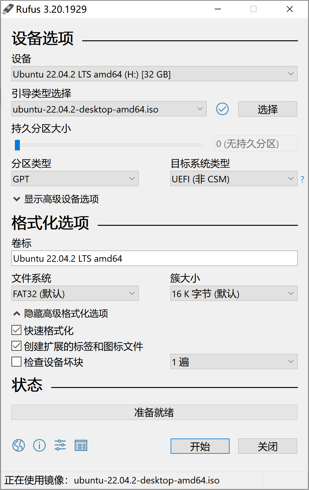

# 列表

* [查看服务器系统及硬件信息。](#lsb_cpu_free)
* [常用命令。](#common_command)
* [ Centos 静态IP设置。](#centos_static_ip)
* [ Ubuntu 静态IP设置。](#ubuntu_static_ip)
* [ Docker-compose 中两个桥接网络导致 Telnet 不通。](#bridge_gateway)
* [ 解决 CentOS8 查看网络管理服务配置，并设置开机自启。](#network_scripts_centos8)
* [ 解决 CentOS7 查看网络管理服务配置，并设置开机自启。](#network_scripts_centos7)

# 命令汇总
```
apt install openssh-server
apt install lrzsz
```


# top -c 命令

`top -c` 命令是一个在Linux和Unix系统上用于查看系统性能和进程信息的命令。
它以交互式的方式显示实时的系统资源使用情况，包括CPU、内存、交换空间等，并列出正在运行的进程列表。

下面是有关 `top -c` 命令的详细解释：

* `top` 命令：`top` 是一个终端命令行工具，用于监视系统的实时性能。 它以交互式方式在终端窗口中显示信息，并提供了不同的选项和命令来过滤、排序和查看进程列表。
* `-c` 选项：`-c` 选项用于在进程列表中显示完整的命令行参数。如果不使用 `-c` 选项，`top` 将只显示进程的名称，而不显示进程的完整命令行。

当运行 `top -c` 命令时，它会显示一个实时的终端界面，其中包括以下信息：
* 第一行：系统概览，包括系统的负载平均值、运行时间、登录用户数等。
* 第二行：CPU 使用情况，包括用户空间、系统空间和空闲 CPU 的百分比。
* 第三行：内存使用情况，包括总内存、已用内存、空闲内存、缓冲和缓存内存的使用情况。
* 第四行：交换空间使用情况，包括总交换空间、已用交换空间和剩余交换空间的使用情况。
* 进程列表：下面是一个列出正在运行的进程的列表。

每个进程都有相关的信息，包括进程ID、用户、CPU使用率、内存使用量、进程状态、启动时间以及命令行参数（如果使用了 `-c` 选项）。

你可以使用交互式命令来对进程列表进行排序、过滤、结束进程等操作。一些常用的交互式命令包括：

- 使用 `k` 键来结束选定的进程。
- 使用 `P` 键按CPU使用率排序进程。
- 使用 `M` 键按内存使用率排序进程。
- 使用 `q` 键退出 `top` 命令。

`top -c` 命令可以找出资源占用较高的进程，以及进行性能分析和故障排除。

示例：
```
PID   USER  PR  NI  VIRT    RES    SHR  S   %CPU %MEM     TIME+       COMMAND
26884 root  20  0  725964  20300   7040 R   4.7  0.1   140:10.19 /usr/lib/systemd/systemd-journald
```
1. `PID`: 进程ID，是一个唯一的数字标识符，用于在系统中标识进程。
2. `USER`: 进程所属的用户，这里是`root`，表示该进程由系统管理员或超级用户启动。
3. `PR`: 进程的调度优先级（Priority）。这里的值是20，它表示该进程的静态优先级，较低的值表示较高的优先级。
4. `NI`: 进程的Nice值，Nice值是一个影响进程调度的参数，用于调整进程的优先级。这里的值是0，表示没有特殊的优先级调整。
5. `VIRT`: 进程的虚拟内存使用量（Virtual Memory），单位通常是KB。这个进程占用了725,964 KB的虚拟内存。
6. `RES`: 进程的物理内存使用量（Resident Set Size），单位通常是KB。这个进程占用了20,300 KB的物理内存。
7. `SHR`: 进程的共享内存使用量（Shared Memory），单位通常是KB。这个进程占用了7,040 KB的共享内存。
8. `S`: 进程的状态。这里是`R`，表示进程正在运行。
9. `%CPU`: 进程的CPU使用率，以百分比表示。这个进程的CPU使用率为4.7%。
10. `%MEM`: 进程的内存使用率，以百分比表示。这个进程的内存使用率为0.1%。
11. `TIME+`: 进程的累计CPU时间，表示该进程已经运行了140小时、10分钟和19秒。
12. `COMMAND`: 进程命令。

top 命令中的进程状态（S列）通常可以包括以下值：

* R: 运行（Running） - 进程正在运行，占用CPU时间。
* S: 睡眠（Sleeping） - 进程正在等待事件或条件，不占用CPU时间。
* D: 不可中断睡眠（Uninterruptible Sleep） - 进程正在等待不可中断的资源，通常在I/O操作中出现。
* Z: 僵尸（Zombie） - 进程已经终止，但其父进程还没有清理其资源。僵尸进程通常需要被父进程回收。
* T: 停止（Stopped） - 进程被暂停，通常由用户发送SIGSTOP信号来暂停进程。
* t: 跟踪（Tracing stop） - 进程正在被跟踪，通常由调试器使用。
* X: 死亡（Dead） - 进程已经终止，但其状态尚未清理。


# 解除53端口占用
[彻底解决 Linux 系统下 systemd-resolve 占用 53 端口的问题](https://www.otakusay.com/866.html)

53端口是 DNS（Domain Name System）服务的默认端口。
DNS是互联网上的一项关键服务，它负责将人类可读的域名（例如 `www.example.com`）映射到与之对应的IP地址（例如 192.0.2.1）。
通过DNS，用户可以使用便于记忆的域名来访问网站，而无需记住复杂的IP地址。

当计算机或设备需要解析域名以确定其对应的IP地址时，它会发送DNS查询请求到53端口。DNS服务器接收这些请求并返回相应的IP地址信息。

因此，53端口是DNS通信的默认端口，用于传输DNS请求和响应。在上述情景中，释放53端口是为了确保其他程序或服务可以正常使用它，而不受 systemd-resolved 服务的占用。

具体步骤：
* 查看端口占用情况，看看 53 端口是不是被 `systemd-resolved` 占用了。`sudo netstat -nultp`
* 修改 `/etc/systemd/resolved.conf` ，添加配置：`DNSStubListener=no`。
* 软连接配置：`ln -sf /run/systemd/resolve/resolv.conf /etc/resolv.conf`。
* 重新启动`systemd-resloved`服务：`systemctl restart systemd-resolved.service`（可解除53端口占用，且不影响服务器DNS解析服务）

# 替换5.8内核

* 查看系统中所有安装相关的软件包。`sudo dpkg --get-selections | grep linux-image`。
* 清除对应版本的软件包。`apt remove --purge linux-image-unsigned-5.15.x-88-generic`。
* 查看内核信息。`uname -r`或者`uname -a`。

```
sudo apt update
sudo apt install linux-image-5.8.0-63-generic linux-headers-5.8.0-63-generic linux-hwe-5.8-headers-5.8.0-63 linux-modules-5.8.0-63-generic linux-modules-extra-5.8.0-63-generic

### 安装好新内核后需要修改grub引导配置文件，设置等待时间，手动指向5.8内核后，启动系统，再autoremove旧的内核，后续即可自动进入5.8内核
sudo vim /etc/default/grub

### 修改下面两个参数，保存后退出
GRUB_TIMEOUT_STYLE=
GRUB_TIMEOUT=2

# 执行下述命令后重启系统，开机过程在grub界面暂停，此时手动在高级选项里选择5.8内核，回车进入，即可引导进入5.8内核
sudo update-grub
reboot

# 开机后，使用 uname -a命令检查，若为5.8证明切换成功，执行 sudo apt autoremove卸载旧的内核，后续开机便会自动进入5.8内核
sudo apt autoremove

#此时也可将grub的配置改为默认配置，后执行 sudo update-grub，可再次隐藏grub界面，提升安全性
```

若更换内核后无法进入系统，提示内核签名不通过。对内核进行签名或者禁用安全启动
```
# 选择之前版本内核进入系统，禁用安全启动
apt install mokutil
mokutil --disable-validation
reboot
# 重启后选择 Change Secure Boot State 禁用
```

关于 `/etc/default/grub`文件详解：
```
# If you change this file, run 'update-grub' afterwards to update
# /boot/grub/grub.cfg.
# For full documentation of the options in this file, see:
#   info -f grub -n 'Simple configuration'

GRUB_DEFAULT=0
GRUB_TIMEOUT_STYLE=hidden
GRUB_TIMEOUT=0
GRUB_DISTRIBUTOR=`lsb_release -i -s 2> /dev/null || echo Debian`
GRUB_CMDLINE_LINUX_DEFAULT="quiet splash"
GRUB_CMDLINE_LINUX=""

# Uncomment to enable BadRAM filtering, modify to suit your needs
# This works with Linux (no patch required) and with any kernel that obtains
# the memory map information from GRUB (GNU Mach, kernel of FreeBSD ...)
#GRUB_BADRAM="0x01234567,0xfefefefe,0x89abcdef,0xefefefef"

# Uncomment to disable graphical terminal (grub-pc only)
#GRUB_TERMINAL=console

# The resolution used on graphical terminal
# note that you can use only modes which your graphic card supports via VBE
# you can see them in real GRUB with the command `vbeinfo'
#GRUB_GFXMODE=640x480

# Uncomment if you don't want GRUB to pass "root=UUID=xxx" parameter to Linux
#GRUB_DISABLE_LINUX_UUID=true

# Uncomment to disable generation of recovery mode menu entries
#GRUB_DISABLE_RECOVERY="true"

# Uncomment to get a beep at grub start
#GRUB_INIT_TUNE="480 440 1"
```

`/etc/default/grub` 是一个文本文件，通常位于Linux系统中，特别是基于Debian的发行版（如Ubuntu）中。
它包含有关GRUB（GRand Unified Bootloader）引导加载程序的配置选项。
GRUB是用于多重引导系统的引导加载程序，它允许您选择要引导的操作系统或内核镜像。

* `GRUB_DEFAULT`: 指定默认启动的菜单项索引。可以是一个数字（表示菜单项的位置，从0开始），也可以是菜单项的标签。默认情况下，通常设置为0，表示默认启动第一个菜单项。

* `GRUB_TIMEOUT`: 指定GRUB菜单的显示时间（以秒为单位）。如果没有进行选择，GRUB将在超时后自动启动默认菜单项。

* `GRUB_TIMEOUT_STYLE`: 指定如何显示超时的倒计时。可以设置为 "menu"（显示倒计时和菜单）或 "hidden"（隐藏倒计时，但按下 Shift 键将显示菜单）。

* `GRUB_CMDLINE_LINUX`: 指定Linux内核引导参数。您可以在这里添加内核参数，例如设置根文件系统、调整内核参数等。这是一个非常重要的选项，特别是在需要自定义内核启动参数时。

* `GRUB_HIDDEN_TIMEOUT`: 如果 GRUB_TIMEOUT_STYLE 设置为 "hidden"，则可以通过此选项指定在按下 Shift 键之前的等待时间。

* `GRUB_HIDDEN_TIMEOUT_QUIET`: 如果 GRUB_TIMEOUT_STYLE 设置为 "hidden"，此选项可控制是否在隐藏模式下显示启动信息。

* `GRUB_DISABLE_OS_PROBER`: 如果设置为 "true"，将禁用OS探测，不会自动检测其他操作系统的安装。

* `GRUB_SAVEDEFAULT`: 如果设置为 "true"，GRUB将记住上一次选择的菜单项，并使其成为默认菜单项。

* 其他选项：还有其他一些选项，用于配置GRUB的外观、语言和其他行为。

一旦对 `/etc/default/grub` 文件进行了更改，通常需要运行 `sudo update-grub` 命令来生成新的`GRUB`配置文件，以使更改生效。
这将在 `/boot/grub/grub.cfg` 中生成新的配置，`GRUB`会使用该文件来显示菜单和引导操作系统。


# FQA

## 配置ssh 服务
```
apt install ssh-server 
sudo systemctl start ssh
systemctl enable ssh
sudo systemctl status ssh
```

## 配置国内清华镜像源

将系统的APT软件包管理器的源列表配置为清华大学TUNA镜像站的Ubuntu软件包仓库，包括主要、更新、后备和安全性仓库。
之后，它立即运行apt update以确保软件包信息是最新的。这对于加速软件包管理器的操作，特别是在中国境内访问Ubuntu软件包时非常有用。

运行以下命令：
```
bash -c "cat << EOF > /etc/apt/sources.list && apt update
deb https://mirrors.tuna.tsinghua.edu.cn/ubuntu/ focal main restricted universe multiverse
deb https://mirrors.tuna.tsinghua.edu.cn/ubuntu/ focal-updates main restricted universe multiverse
deb https://mirrors.tuna.tsinghua.edu.cn/ubuntu/ focal-backports main restricted universe multiverse
deb https://mirrors.tuna.tsinghua.edu.cn/ubuntu/ focal-security main restricted universe multiverse
EOF"
```

详细解释：
```
bash -c: 这部分启动一个新的Bash shell，并通过-c选项告诉Bash执行后面的命令。在这里，后面的命令是一个包含多个行的字符串。

"cat << EOF > /etc/apt/sources.list && apt update ... EOF": 这是一个文本块，使用Here文档语法（<< EOF和EOF之间的文本会被传递给cat命令）。
这个文本块包含多个行，每行以deb开头，然后是一个Ubuntu软件包仓库的URL，以及该仓库的组件（main、restricted、universe、multiverse）。

deb https://mirrors.tuna.tsinghua.edu.cn/ubuntu/ focal main restricted universe multiverse: 
这是一个Ubuntu软件包仓库的源，其中https://mirrors.tuna.tsinghua.edu.cn/ubuntu/是仓库的URL，focal是Ubuntu 20.04 LTS版本的代号，
而后面的main restricted universe multiverse是软件包仓库的组件，分别包含主要软件、受限软件、宇宙软件和多元软件。
类似的行还有三个，分别对应Ubuntu的更新、后备和安全性软件包仓库。

> /etc/apt/sources.list: >符号将Here文档的内容重定向到文件/etc/apt/sources.list中，这个文件是APT包管理器用来获取软件包信息的配置文件。
通过这个命令，已有的源列表将被替换为新的内容。

&& apt update: &&表示在前一个命令成功执行后，才会执行后面的命令。
在这里，一旦源列表被更新后，立即执行apt update命令，这个命令会下载最新的软件包信息，以便系统可以安装或更新软件包。
```


## supervisor.sock no such file
报错内容：
```
supervisorctl status
unix:///var/run/supervisor/supervisor.sock no such file
```
解决办法：
```
sudo systemctl start supervisord
```

##  invalid PID number
报错内容：
```
/usr/sbin/nginx -s reload
nginx: [error] invalid PID number "" in "/var/run/nginx.pid"
```
解决办法：
```
/usr/sbin/nginx -c /etc/nginx/nginx.conf
```

# Centos 中 Nginx 和 Supervisor 开机自启动
1、安装 Nginx 和 Supervisor： 如果尚未安装 Nginx 和 Supervisor，可以使用以下命令安装它们：

```
sudo yum install nginx
sudo yum install supervisor
```
配置 Nginx 自启动：Nginx 在安装时通常会自动创建一个 systemd 服务单元。你只需要启用它，让它在开机时自动启动。

```
sudo systemctl enable nginx
```

配置 Supervisor 自启动： Supervisor 需要手动配置才能在开机时自动启动。以下是配置步骤：

2、创建 Supervisor 配置文件（如果尚未创建）：
```
sudo nano /etc/supervisord.conf
```

2.1 在配置文件中添加你想要管理的进程的配置。例如，如果你想要管理一个名为 "myapp" 的进程，可以添加类似以下的内容：
```
[program:myapp]
command=/path/to/your/app
autostart=true
autorestart=true
stderr_logfile=/var/log/myapp.err.log
stdout_logfile=/var/log/myapp.out.log
```
请将 /path/to/your/app 替换为你的应用程序的实际路径。

2.2 启用 Supervisor 自启动： 创建一个 Supervisor systemd 服务单元文件：
```
sudo nano /etc/systemd/system/supervisord.service
```

在文件中添加以下内容：
```
[Unit]
Description=Supervisor daemon
[Service]
ExecStart=/usr/bin/supervisord -c /etc/supervisord.conf
ExecStop=/usr/bin/supervisorctl shutdown
ExecReload=/usr/bin/supervisorctl reload
KillMode=process
Restart=on-failure
RestartSec=5s
[Install]
WantedBy=multi-user.target
```
保存文件后，启用 Supervisor 自启动：
```
sudo systemctl enable supervisord
```
重启系统并验证：

在完成上述步骤后，你可以重启系统并验证 Nginx 和 Supervisor 是否在启动后自动运行。
```
sudo reboot
```
在系统重启后，使用以下命令验证 Nginx 和 Supervisor 是否正在运行：
```
sudo systemctl status nginx
sudo systemctl status supervisord
```
确保根据你的实际配置和路径进行相应的替换。

Nginx 和 Supervisor 应该会在开机时自动启动并管理你的应用程序。


# 安装常用工具
```
yum install tree nmap dos2unix lrzsz nc lsof wget tcpdump htop iftop iotop sysstat nethogs -y
```
相关介绍：
```
tree：tree以树形结构显示文件和目录
nmap：nmap扫描端口的工具
dos2unix 转换脚本格式的工具
lrzsz 包含上传（rz）下载（sz）文件工具
nc 文件传输、端口检查
lsof 反查端口进程，以及服务开发文件工具
wget 下载软件包工具
tcpdump 抓包、监听等重要排错工具
htop 系统进程相关信息查看工具
iftop 查看主机网卡带宽工具
iotop 
sysstat 含有sar，iostat等重要系统性能查看工具
nethogs 显示进程的网络流量
```
# 安装 Ubuntu 22.04 系统

## 前置条件
安装 Ubuntu 22.04 LTS 的前置条件
* 2GHz 双核处理器
* 4GB 内存
* 25GB 磁盘空间用于存储（最小安装，则更少）
* USB 接口
* 至少 4GB 的 U 盘。

安装重要步骤：

① 下载 Ubuntu 22.04 LTS 安装介质。

[Ubuntu 22.04.2 LTS (Jammy Jellyfish)](https://releases.ubuntu.com/22.04/)

② 制作 Ubuntu 22.04 LTS 引导 U 盘。

[rufus-for-mac](https://www.uubyte.com/rufus-for-mac.html)

[rufus-for-windows](https://rufus.ie/zh/)



注意制作引导盘时候，分区类型选择 GPT类型，目标系统类型选择 UEFI(非CSM)。

③ 进入计算机的BIOS（基本输入/输出系统）或UEFI（统一固件接口）设置。

在计算机启动过程中，通常会在屏幕上显示一个提示，指示按下特定的按键以进入BIOS或UEFI设置。

在不同的计算机品牌和型号中，可能会使用不同的按键。常见的按键包括：F2、F12、Delete、Esc等。

# 免密切换到 root 用户的设置

编辑sudoers文件要用visudo，不要直接编辑，有语法错误会提示。

visudo 是一个用于编辑和管理 /etc/sudoers 文件的命令行工具。/etc/sudoers 文件包含了关于系统上哪些用户或用户组具有特权执行特定命令的配置信息。

通过运行 visudo 命令，您可以以安全的方式编辑 /etc/sudoers 文件，以便添加、修改或删除授权用户的 sudo 访问权限。

运行 visudo 命令后，将会使用默认文本编辑器（通常是 Vi 或 Vim）打开 /etc/sudoers 文件。注意，sudo 权限将被要求以修改该文件。

* 使用 `root` 用户登录。修改 `/etc/sudoers` 文件的写权限。
```
chmod u+w /etc/sudoers
```
* 使用 `root` 权限编辑 `sudoers` 文件。
```
sudo visudo
```
* 修改为
```
your_name ALL=(ALL:ALL) NOPASSWD:ALL
```
* 记得取消 `/etc/sudoers` 文件的写权限。
```
chmod u-w /etc/sudoers
```

登录完不要着急退出root账户，重新开一个tab登录验证，万一语法错误登不上去，原来的root用户还可以修正。
如果确实退出了， 也不小心把文件语法输入错误了，需要重装系统。如果有重要文件，需要虚拟机关了，把盘从虚拟化上卸下来，然后挂到宿主机上，
从上边找到 sudo 文件，修改好后，再装回虚拟机上。

# Ubuntu 清除 history
```
history -c
```

# Ubuntu 系统信息

## 概览信息

系统信息包含：Ubuntu 服务器发行版本、CPU 型号、CPU 核数、硬盘大小和内存大小。

Ubuntu 或者 Centos :
```
uname -m | awk -F"\t" '{print "系统架构: "$0}';\
lsb_release -d 2>/dev/null | awk -F"\t" '{print "Ubuntu 发行版本: " $2}';\
cat /etc/redhat-release 2>/dev/null | awk -F'"' '{print "CentOS 发行版本: " $0}';\
LANG=C lscpu | awk '/^Vendor ID/ {print "发型厂商:" $3}';\
LANG=C cat /proc/cpuinfo | grep "model name" | uniq | awk -F":" '{print "CPU型号:"$2}';\
LANG=C lscpu | awk '/^CPU\(s\)/ {print "CPU(s):" $2}';\
LANG=C cat /proc/cpuinfo | grep "cpu cores" | uniq | awk -F":" '{print "cpu cores:"$2}';\
LANG=C lsblk -o NAME,SIZE -n -d | awk '!/^loop/ {disk = $1; size = $2; total += size; print "硬盘", disk, "大小: ", size, size/1024 " TB"}; END {print "总硬盘数量: ", NR, "总硬盘大小: ", total, "G", total/1024 " TB"}';\
LANG=C free -h | awk '/Mem:/{printf "内存大小: %s\n", $2}'
```


示例结果：
Ubuntu 22.04
```
系统架构: x86_64
发行版本: Ubuntu 22.04.2 LTS
发型厂商:GenuineIntel
CPU型号: Intel(R) Xeon(R) CPU E5-2630 v2 @ 2.60GHz
CPU(s):8
cpu cores: 4
硬盘 sda 大小: 700G 0.683594 TB
硬盘 sdb 大小: 500G 0.488281 TB
总硬盘数量: 2 总硬盘大小: 1200 1.17188 TB
内存大小: 15Gi
```

CentOS 7.4 

```
系统架构: x86_64
发行版本: CentOS Linux release 7.4.1708 (Core)
发型厂商: GenuineIntel
CPU型号: Intel(R) Xeon(R) CPU E5-2630 v4 @ 2.20GHz
CPU(s): 4
cpu cores: 1
硬盘 sda 大小: 500G 0.488281 TB
总硬盘数量: 1 总硬盘大小: 500 0.488281 TB
内存大小: 7.6G
```

为什么不是显示为 8G 呢？
这是因为计算机中的内存容量通常是以二进制方式进行计算，其中 1GB 等于 2^30 字节（1,073,741,824 字节），而不是十进制的 1,000,000,000 字节。
所以，当系统中有 8GB（8,000,000,000 字节）的内存时，它在以二进制方式表示时会略小于 8GB。在该例中，7.6GB 是以二进制方式表示的约数值。

这是一个常见的差异，不仅适用于内存，还适用于其他存储单位（如硬盘容量）。
因此，将 7.6G 视为接近 8GB 的数值是正常的。

## 发行版本

查看 Ubuntu 版本信息，包括发行版本、发行代号和描述信息：

```
root@xxx:~# lsb_release -a
No LSB modules are available.
Distributor ID:	Ubuntu
Description:	Ubuntu 22.04.1 LTS
Release:	22.04
Codename:	jammy
```

## 硬盘信息

```
root@xxx:~# sudo parted -l
Model: ATA ST1000LM048-2E71 (scsi)
Disk /dev/sda: 1000GB
Sector size (logical/physical): 512B/4096B
Partition Table: msdos
Disk Flags:
Number  Start   End     Size    Type     File system  Flags
1      1049kB  256MB   255MB   primary  fat32        boot, esp
2      256MB   1000GB  1000GB  primary  ext4
```

这是一个在`Ubuntu`系统中使用的命令，下面是每个组成部分的详细解释：

* parted: 这是一个 Linux 分区工具，可用于对硬盘进行分区、格式化、重命名等操作。
*  -l : 这是 parted 命令的选项之一，用于显示当前系统上的所有硬盘和分区的详细信息。

结果说明：
* `Model`: `ATA ST10xxxxx-2E71 (scsi)`: 此行显示了硬盘的型号和接口类型。
* `Disk /dev/sda: 1000GB`此行显示了硬盘的设备文件名和总容量，这里的硬盘是`/dev/sda`，总容量是1000GB。
* `Sector size (logical/physical): 512B/4096B:` 此行显示了硬盘扇区的逻辑和物理大小，这里的逻辑大小是512B，物理大小是4096B。
* `Partition Table: msdos: `此行显示了硬盘分区表的类型，这里使用的是传统的`msdos`分区表。
* `Disk Flags:`此行显示了硬盘的标志，这里没有设置任何标志。

Disk Flags 分区信息：
```
Number: 分区的编号。
Start: 分区在硬盘上的起始位置。
End: 分区在硬盘上的结束位置。
Size: 分区的大小。
Type: 分区的类型，这里的类型分别为primary（主分区）和extended（扩展分区）。
File system: 分区的文件系统类型，这里分别为fat32和ext4。
Flags: 分区的标志，这里分别为boot（引导分区）和esp（EFI系统分区）。
```

## CPU 核数和 CPU 信息

```
root@xxx:~# cat /proc/cpuinfo
processor	: 0
vendor_id	: GenuineIntel
cpu family	: 6
model		: 42
model name	: Intel(R) Core(TM) i5-2x00 CPU @ 3.x0GHz
stepping	: 7
microcode	: 0x2f
cpu MHz		: 3288.426
cache size	: 6144 KB
physical id	: 0
siblings	: 4
core id		: 0
cpu cores	: 4
apicid		: 0
initial apicid	: 0
fpu		: yes
fpu_exception	: yes
cpuid level	: 13
wp		: yes
flags		: fpu vme 
bugs		: cpu_meltdown
bogomips	: 6185.79
clflush size	: 64
cache_alignment	: 64
address sizes	: 3x bits physical, 4x bits virtual
power management:
```
下面是每个参数的详细解释：

* processor：处理器的编号，表示当前信息所描述的是第几个处理器。

* vendor_id：处理器的制造商标识，这里是 "GenuineIntel"，表示是英特尔公司的处理器。

* cpu family：处理器系列的代号，这里是 6，表示是第六代处理器。

* model：处理器型号，这里是 42。

* model name：处理器的完整型号名称，这里是 "Intel(R) Core(TM) i5-2x00 CPU @ 3.x0GHz"，表示是一款型号为 Core i5-2x00，主频为 3.x0GHz 的英特尔处理器。

* stepping：处理器的步进信息，表示在制造过程中的版本或修订号。

* microcode：微码版本，用于修复或改进处理器的操作。

* cpu MHz：处理器的实际工作频率，这里是 3288.426 MHz。

* cache size：处理器的缓存大小，这里是 6144 KB。

* physical id：物理标识符，用于区分不同物理处理器。

* siblings：与当前处理器连接到相同物理处理器的处理器数量。

* core id：核心标识符，用于区分同一物理处理器上的不同核心。

* cpu cores：物理处理器上的核心数，这里是 4，表示有 4 个物理核心。

* apicid：高级可编程中断控制器 (APIC) 的标识符。

* initial apicid：初始 APIC 标识符。

* fpu：浮点数单元 (FPU) 是否可用。

* fpu_exception：FPU 异常是否支持。

* cpuid level：处理器的 CPUID 级别。

* wp：写保护 (Write Protect) 是否启用。

* flags：处理器的特性标志位，表示处理器支持的功能和指令集。

* bugs：处理器存在的错误或缺陷，这里是 "cpu_meltdown"，表示处理器受到了 Meltdown 漏洞的影响。

* bogomips：处理器的 BogoMIPS 值，这是一个用于表示处理器性能的指标。

* clflush size：缓存行刷新的大小，以字节为单位。

* cache_alignment：缓存对齐的大小，以字节为单位。

* address sizes：地址位数，分别表示物理地址位数和虚拟地址位数。

* power management：处理器的电源管理功能。


## 硬盘使用（G）
以G为单位，显示硬盘的使用情况：

```
root@codriver-desktop:~# df -Th
Filesystem     Type     Size  Used Avail Use% Mounted on
tmpfs          tmpfs    785M  2.8M  782M   1% /run
/dev/sda2      ext4     912G   33G  837G   4% /
tmpfs          tmpfs    3.9G     0  3.9G   0% /dev/shm
tmpfs          tmpfs    5.0M  4.0K  5.0M   1% /run/lock
/dev/sda1      vfat     240M  5.3M  235M   3% /boot/efi
tmpfs          tmpfs    785M   76K  785M   1% /run/user/127
tmpfs          tmpfs    785M   60K  785M   1% /run/user/0
overlay        overlay  916G   33G  837G   4% /
```
## 内存使用（G）
以G为单位，显示内存的使用情况：

```
root@codriver-desktop:~# free -h
total        used        free      shared  buff/cache   available
7.7Gi       1.9Gi       352Mi       9.0Mi       5.4Gi       5.4Gi
```

# 64-bit PC (AMD64)和 32位的 x86 架构
当前系统的机器硬件名称：
```
uname -m
arch
```
检查输出结果：运行上述命令后，将在终端中看到一个字符串。常见的输出结果可能是：

* 如果输出结果为 "x86_64"，则表示您的系统是基于 AMD64（也称为x86-64）架构。这是目前大多数桌面和服务器计算机所使用的64位架构。
* 如果输出结果为 "i386" 或 "i686"，则表示您的系统是32位的 x86 架构，而不是 AMD64 架构。

命名为"AMD64"是因为AMD（Advanced Micro Devices）是首家推出64位指令集扩展的处理器制造商。
在过去，32位的x86架构（也称为IA-32）是主流，用于大多数个人计算机。
然而，随着计算需求的增加和技术的发展，需要一种更强大、更高效的处理器架构来支持更大的内存容量和更复杂的计算任务。

为了推进64位计算，AMD开发了一套64位的指令集扩展，将其称为"AMD64"。
AMD64架构在2000年首次发布，并在随后的几年里得到广泛的采用和支持。
这种架构不仅能够处理大量的内存和复杂的计算任务，还能提供更好的性能和兼容性。

尽管"AMD64"命名中包含了AMD的名称，但实际上，这种64位架构是通用的，不仅适用于AMD处理器，也适用于其他支持该架构的厂商的处理器，如Intel的x86-64架构。

由于AMD首先引入并推广了这种64位架构，因此它被广泛地称为"AMD64"。这个名字已经成为了一种通用的术语，用于描述基于该架构的64位系统和软件。

# Ubuntu18.04 升级到 Ubuntu 22.04
* 运行以下命令，确保系统已更新到最新版本：
```
sudo apt update
sudo apt upgrade
```
运行 `sudo apt update` 更新软件包列表，它会连接到软件包源（如官方Ubuntu存储库或其他第三方存储库），检查可用的更新，并将更新信息下载到本地系统。

运行`sudo apt upgrade`将检查系统中已安装的软件包，并将其与最新的可用版本进行比较。 
如果有新的软件包版本可用，它将提示进行更新，并在确认后执行更新操作。
这将系统保持最新，并修复可能存在的安全漏洞或错误。

* 安装升级工具：
```
sudo apt install update-manager-core
```

* 打开升级配置文件，确保它设置为升级到新版本：
```
sudo nano /etc/update-manager/release-upgrades
```
在打开的文件中，确保Prompt值设置为"normal"或"lts"。

* 运行升级命令，开始升级到 Ubuntu 22.04：
```
sudo do-release-upgrade -r 22.04
```


## 升级过程中出现的问题

* 运行 `sudo apt upgrade` 报错的信息和解决办法：
```
xxx@xxx-S410:~$ sudo apt upgrade
E: 无法获得锁 /var/lib/dpkg/lock-frontend - open (11: 资源暂时不可用)
E: 无法获取 dpkg 前端锁 (/var/lib/dpkg/lock-frontend)，是否有其他进程正占用它？

xxx@xxx-S410:~$ sudo apt upgrade
E: 无法获得锁 /var/lib/dpkg/lock - open (11: 资源暂时不可用)
E: 无法锁定管理目录(/var/lib/dpkg/)，是否有其他进程正占用它？
xxxx@xxx-S410:~$ sudo rm /var/lib/dpkg/lock
lock           lock-frontend  
xxx@xxx-S410:~$ sudo rm /var/lib/dpkg/lock
xxx@xxx-S410:~$ sudo apt upgrade
```

<span id="network_scripts_centos8">解决 CentOS8 查看网络管理服务配置，并设置开机自启。</span>

问题场景：`ssh`登录远程服务器时出现 `connect to host 192.16x.1.x port 22: Host is down`。

先检查静态 IP 配置信息，确认 ONBOOT 为 yes：
```
TYPE=Ethernet
PROXY_METHOD=none
BROWSER_ONLY=no
BOOTPROTO=static
DEFROUTE=yes
IPV4_FAILURE_FATAL=no
IPV6INIT=yes
IPV6_AUTOCONF=yes
IPV6_DEFROUTE=yes
IPV6_FAILURE_FATAL=no
NAME=eno1
UUID=xxxxxxx
DEVICE=eno1
ONBOOT=yes
IPADDR=192.168.1.x
PREFIX=24
GATEWAY=192.168.1.1
```
设置网络服务的开机自启：
```
[root@localhost ~]# cat /etc/redhat-release
CentOS Linux release 8.4.2105
# 查看本机的网卡
[root@localhost ~]# ip addr
1: lo: <LOOPBACK,UP,LOWER_UP> mtu 65536 qdisc noqueue state UNKNOWN group default qlen 1000
    link/loopback 00:00:00:00:00:00 brd 00:00:00:00:00:00
    inet 127.0.0.1/8 scope host lo
       valid_lft forever preferred_lft forever
    inet6 ::1/128 scope host
       valid_lft forever preferred_lft forever
2: eno1: <BROADCAST,MULTICAST,UP,LOWER_UP> mtu 1500 qdisc fq_codel state UP group default qlen 1000
    link/ether 50:eb:f6:b7:12:44 brd ff:xxxf:xx:ff:ff:ff
    inet 192.xxx.1.3/24 brd 192.xxx.1.255 scope global noprefixroute eno1
       valid_lft forever preferred_lft forever
    inet6 fe80::52eb:f6ff:feb7:6244/64 scope link noprefixroute
       valid_lft forever preferred_lft forever
# 查看 eth0 的网卡信息
[root@localhost ~]# ifconfig eno1
eno1: flags=4163<UP,BROADCAST,RUNNING,MULTICAST>  mtu 1500
        inet 192.16x.1.x  netmask 255.255.255.0  broadcast 192.16x.1.255
        inet6 fe80::52eb:fzxxx:feb7:6244  prefixlen 64  scopeid 0x20<link>
        ether 50:eb:f6:b7:62:44  txqueuelen 1000  (Ethernet)
        RX packets 20002  bytes 17065598 (16.2 MiB)
        RX errors 0  dropped 0  overruns 0  frame 0
        TX packets 21763  bytes 16970379 (16.1 MiB)
        TX errors 0  dropped 0 overruns 0  carrier 0  collisions 0
        device interrupt 16  memory 0xa1200000-a1220000
[root@localhost ~]# ifconfig
br-8e439f7cc472: flags=4163<UP,BROADCAST,RUNNING,MULTICAST>  mtu 1500
        inet 172.16.1.1  netmask 255.255.255.0  broadcast 172.16.1.255
        inet6 fe80::42:90ff:feb1:3ce9  prefixlen 64  scopeid 0x20<link>
        ether 02:42:90:b1:3c:e9  txqueuelen 0  (Ethernet)
        RX packets 0  bytes 0 (0.0 B)
        RX errors 0  dropped 0  overruns 0  frame 0
        TX packets 67  bytes 6905 (6.7 KiB)
        TX errors 0  dropped 0 overruns 0  carrier 0  collisions 0
docker0: flags=4099<UP,BROADCAST,MULTICAST>  mtu 1500
        inet 172.17.0.1  netmask 255.255.0.0  broadcast 172.17.255.255
        ether 02:42:e3:af:83:b6  txqueuelen 0  (Ethernet)
        RX packets 0  bytes 0 (0.0 B)
        RX errors 0  dropped 0  overruns 0  frame 0
        TX packets 0  bytes 0 (0.0 B)
        TX errors 0  dropped 0 overruns 0  carrier 0  collisions 0
# 查看网络服务管理状态并开启开机自启动
[root@localhost ~]# systemctl list-unit-files --type service | grep NetworkManager
NetworkManager-dispatcher.service          disabled
NetworkManager-wait-online.service         disabled
NetworkManager.service                     disabled
[root@localhost ~]# systemctl status NetworkManager.service  
# 开机启用 NetworkManager 服务
[root@localhost ~]# chkconfig NetworkManager on
Note: Forwarding request to 'systemctl enable NetworkManager.service'.
Created symlink /etc/systemd/system/multi-user.target.wants/NetworkManager.service → /usr/lib/systemd/system/NetworkManager.service.
Created symlink /etc/systemd/system/dbus-org.freedesktop.nm-dispatcher.service → /usr/lib/systemd/system/NetworkManager-dispatcher.service.
Created symlink /etc/systemd/system/network-online.target.wants/NetworkManager-wait-online.service → /usr/lib/systemd/system/NetworkManager-wait-online.service.
[root@localhost ~]# systemctl start NetworkManager.service 
[root@localhost ~]# systemctl status NetworkManager.service
● NetworkManager.service - Network Manager
   Loaded: loaded (/usr/lib/systemd/system/NetworkManager.service; enabled; vendor preset: enabled)
   Active: active (running) since Tue 20xx-xx-15 15:43:09 CST; 34min ago
     Docs: man:NetworkManager(8)
 Main PID: 1238 (NetworkManager)
    Tasks: 3 (limit: 202653)
   Memory: 9.4M
   CGroup: /system.slice/NetworkManager.service
           └─1238 /usr/sbin/NetworkManager --no-daemon  
[root@localhost ~]# systemctl list-unit-files --type service | grep NetworkManager
NetworkManager-dispatcher.service          enabled
NetworkManager-wait-online.service         enabled
NetworkManager.service                     enabled
```

<span id="network_scripts_centos7">解决 CentOS7 查看网络管理服务配置，并设置开机自启。</span>

问题场景：`ssh`登录远程服务器时出现 `connect to host 192.16x.1.x port 22: Host is down`。
```
# 查看系统版本
[root@localhost ~]# cat /etc/redhat-release
CentOS Linux release 7.4.1708 (Core)
# 查看网络服务管理的自启动配置状态
[root@localhost ~]# systemctl --type service list-unit-files | grep NetworkManager
NetworkManager-dispatcher.service          disabled
NetworkManager-wait-online.service         disabled
NetworkManager.service                     disabled
# 查看网络管理服务状态
[root@localhost ~]# systemctl status NetworkManager.service
● NetworkManager.service - Network Manager
   Loaded: loaded (/usr/lib/systemd/system/NetworkManager.service; disabled; vendor preset: enabled)
   Active: inactive (dead)
     Docs: man:NetworkManager(8)
# 如果未启动，设置服务开机自启动
[root@localhost ~]# systemctl enable NetworkManager.service
Created symlink from /etc/systemd/system/dbus-org.freedesktop.NetworkManager.service to /usr/lib/systemd/system/NetworkManager.service.
Created symlink from /etc/systemd/system/multi-user.target.wants/NetworkManager.service to /usr/lib/systemd/system/NetworkManager.service.
Created symlink from /etc/systemd/system/dbus-org.freedesktop.nm-dispatcher.service to /usr/lib/systemd/system/NetworkManager-dispatcher.service.
# 再次查看网络管理的自启动配置状态
[root@localhost ~]# systemctl list-unit-files --type service | grep NetworkManager
dbus-org.freedesktop.NetworkManager.service   enabled
NetworkManager-dispatcher.service             enabled
NetworkManager-wait-online.service            disabled
NetworkManager.service                        enabled
```

<span id="bridge_gateway">Centos 静态IP设置。</span>
问题：telnet 内网下另一台服务中某个端口无法访问。
```
networks:
xxxx_net:
driver: bridge
enable_ipv6: false
ipam:
driver: default
config:
- subnet: 172.16.1.0/24
gateway: 172.16.1.1

[root@web-1 config]# ifconfig
br-783ac168832a: flags=4163<UP,BROADCAST,RUNNING,MULTICAST>  mtu 1500
        inet 172.16.1.1  netmask 255.255.255.0  broadcast 172.16.1.255
        inet6 fe80::42:98ff:fe80:1648  prefixlen 64  scopeid 0x20<link>
        ether 02:42:98:80:16:48  txqueuelen 0  (Ethernet)
        RX packets 274992  bytes 209994168 (200.2 MiB)
        RX errors 0  dropped 0  overruns 0  frame 0
        TX packets 440790  bytes 358828865 (342.2 MiB)
        TX errors 0  dropped 0 overruns 0  carrier 0  collisions 0
br-xxxxxxxxxxx: flags=4163<UP,BROADCAST,RUNNING,MULTICAST>  mtu 1500
        inet 172.16.1.1  netmask 255.255.255.0  broadcast 172.16.1.255
        inet6 fe80::42:98ff:fe80:1648  prefixlen 64  scopeid 0x20<link>
        ether 02:42:98:80:16:48  txqueuelen 0  (Ethernet)
        RX packets 274992  bytes 209994168 (200.2 MiB)
        RX errors 0  dropped 0  overruns 0  frame 0
        TX packets 440790  bytes 358828865 (342.2 MiB)
        TX errors 0  dropped 0 overruns 0  carrier 0  collisions 0
```
解决办法：关闭多余的网卡，通过 ifconfig 查看到桥接 172.16.1.1 中有两个网络。
```
ifconfig br-xxxxxx down
```
注：`ifconfig eth0 up` 为启动网卡`eth0` ；`ifconfig eth0 down` 为关闭网卡 `eth0`。`ssh`登陆`linux`服务器操作要小心，关闭了就不能开启了，除非你有多网卡。


<span id="centos_static_ip">Centos 静态IP设置。</span>

<span id="common_command">Linux 常用命令</span>

```
ps -ef | grep php-fpm
ps aux|grep nginx
netstat -tunpl | grep 3306 # 查看端口占用情况（redis-6379，mysql-3306）
tar -czvf file.tar.gz file # 以 gzip 压缩打包file文件夹并命名为file.tar.gz（显示打包详细过程）。
tar -xzvf file.tar.gz file # 解压file.tar.gz包并命名为file（显示解压详细过程）
tail -f xxx.log # 循环读取日志文件的内容
tail -n +20 notes.log # 显示最后20行的日志文件内容
lsof -i :3306 # 列出谁在使用这个端口

```

```shell
[root@iZ2z ~]# ps -ef | grep php-fpm
root      9458     1  0 Mar05 ?        00:00:53 php-fpm: master process (/usr/local/php7/etc/php-fpm.conf)
www      18260  9458  0 Mar31 ?        00:04:21 php-fpm: pool www
www      18263  9458  0 Mar31 ?        00:04:23 php-fpm: pool www
www      18270  9458  0 Mar31 ?        00:03:54 php-fpm: pool www
root     19420 19396  0 13:12 pts/1    00:00:00 grep php-fpm
```


```shell
[root@iZ2 ~]# ps aux|grep nginx
root      9453  0.0  0.3  54880  6092 ?        Ss   Mar05   0:00 nginx: master process nginx -c /usr/local/nginx/conf/nginx.conf
www       9578  0.0  1.8  87860 36132 ?        S    Mar05   5:51 nginx: worker process
root     19422  0.0  0.0 103296   784 pts/1    S+   13:13   0:00 grep nginx
```


```shell
[root@iZ2z ~]# netstat -tunpl | grep 3306
tcp        0      0 0.0.0.0:3306                0.0.0.0:*                   LISTEN      1340/mysqld
```


```shell
[root@iZ2z ~]# lsof -i
COMMAND     PID      USER   FD   TYPE  DEVICE SIZE/OFF NODE NAME
memcached  1019 memcached   26u  IPv4    8983      0t0  TCP *:memcache (LISTEN)
memcached  1019 memcached   27u  IPv4    8992      0t0  UDP *:memcache
[root@iZ2z ~]# lsof -i :3306
COMMAND  PID  USER   FD   TYPE DEVICE SIZE/OFF NODE NAME
mysqld  1340 mysql   13u  IPv4   9791      0t0  TCP *:mysql (LISTEN)
```


2、

```shell
sed 's/7000/7001/g' redis7000/redis.conf > redis7001/redis.conf
```


