# 大纲列表

1、[PHP如何解决网站大流量和高并发的问题？](#01)

2、[PHP底层的运行机制与原理？PHP动态语言执行过程是如何进行的?`Opcodes`中间码是在哪一步生成的？](#02)

3、[什么是CGI、FastCGI、PHP-CGI、PHP-FPM?](#03)

4、[PHP的四层体系架构是什么？](#04)

5、[PHP变量的底层数据结构？PHP中有八种数据类型，为何联合体zval-> `value`中只有五种？](#05)

6、[PHP7和PHP5的区别，具体多了哪些新特性？](#06)

7、[什么是进程？什么是线程？什么是协程？进程与线程的区别是什么？](#07)

8、[秒杀系统的设计？](#08)

9、[请简单讲一下你对面向对象三大特征理解的程度（重点是多态）？](#09)

11、[`php.ini`里面具体都包含了哪些选项模块？至少五个。](#11)

12、[php-fpm 相关命令，终止、重启、平滑重启、查看进程数等。](#12)

13、[PHP-FPM 与 Nginx 通信的两种机制方式？区别是什么？](#13)

14、[unset 引用类型的底层原理？](#14)

15、[PHP垃圾回收机制的原理？](#15)

16、[Nginx 和PHP之间的交互过程？](#16)

17、[浏览器输入url回车之后的整体过程。 ](#17)

18、[PHP 动态语言，有什么很明显的问题？和 JAVA 相比有什么不同？](#18)

19、[php 和 go语言有什么差别？](#19)

20、[什么是PHP的`copy on write`写时复制？](#20)

21、[什么是结构体的强制分裂，下面的代码结果是什么？](#21)

22、[数组 KEY 和 VALUE 的限制条件。](#22)

23、[关于 static 静态延迟绑定，执行如下代码，输出结果是什么？](#23)

24、[静态变量 static 和 gloabl 全局变量。-面试题重点](#24)

25、[PHP 如何实现 hashmap?](#25)

26、[常用的字符串函数？](#26)

27、[常用的PHP 数组函数?](#27)

28、[常用的魔术方法?](#28)

29、[正则表达式相关？](#29)

30、[PHP执行系统命令函数?](#30)

31、[商品库存的解决方案？](#31)

32、[如何防止用户重复下单？](#32)

33、[请尽可能多的写出 PHP 优化执行效率的方法？](#33)

34、[NSQ 消息队列的原理？](#34)

35、[谈谈你对控制反转（IoC）和依赖注入（DI）的理解。](#35)

36、[什么是PHP的反射机制，具体应用场景是什么？](#36)

37、[常用的设计模式？](#37)

38、[常用的算法？](#38)

39、[final、abstract、interface 、static 关键字分别代表什么？](#39)


合并两个有序数组。 给定两个有序整数数组 nums1 和 nums2，将 nums2 合并到 nums1 中，使得 num1 成为一个有序数组。

# 解答列表

## 高并发大流量的解决方案

1、<span id="01">PHP如何解决网站大流量和高并发的问题？</span>

* 流量优化：例如使用`NGINX`方式配置防盗链；合理使用`CDN`加速。
* 前端优化：一是页面级别的优化，减少HTTP的请求（合理设置 HTTP缓存，启用浏览器缓存和静态资源过期时间缓存， CSS、 Javascript、Image 资源合并与压缩，使用异步请求）；二是代码级别的优化（Javascript中的DOM 操作优化、CSS选择符优化、图片优化以及 HTML结构优化）；
* 服务端优化：动态语言静态化、图片服务器与`WEB`服务器分离、并发处理、消息队列处理(NSQ消息队列)、服务端代码优化。
* 缓存层优化：数据库缓存（`Memcached`、`Redis`、`MongoDB`）
* MySQL优化：分库分表、分区操作、读写分离、SQL调优。
* 数据库架构优化：
* 服务器优化：负载均衡（Nginx的反向代理）、浏览器静态缓存（`Nginx`静态资源缓存配置策略）。
* 架构层面优化：从架构上来说，采用前后端分离的分层架构，前端负责站点展现层（异步获取数据，响应速度提升），后端负责站点数据层（通过内网一次性返数据，性能大幅度提升）。

##  底层运行机制和执行过程

2、<span id="02">PHP底层的运行机制与原理？PHP动态语言执行过程是如何进行的。`Opcodes`中间码是在哪一步生成的？</span>

[【PHP 核心】PHP底层运行机制和原理](https://wwxiong.com/?p=107)


PHP动态语言执行过程如下所示：

- 扫描(`Scanning`) : 先进行语法分析和词法分析，将`PHP`代码转换为语言片段(`Tokens`)。
- 解析(`Parsing`) : 词法分析后, 将语言片段`Tokens`转换成简单而有意义的表达式。
- 编译(`Complication`) : 将表达式编译成中间码(`Opcodes`)。
- 执行(`Execution`) : 顺次执行`Opcodes`，每次一条，从而实现`PHP`脚本的功能。
- 输出(`Output Buffer`): 将要输出的内容输出到缓冲区。

> `Parsing`首先会丢弃`Tokens Array`中的多余的空格，然后将剩余的`Tokens`转换成一个一个的简单的表达式。

示例：PHP执行的时候有如下过程，`Scanning`->`Complication`->`Execution`->`Parsing`,其含义分别为：

A、将`PHP`代码转换为语言片段（`Tokens`）、将`Tokens`转换成简单而有意义的表达式、将表达式编译成`Opcodes`、顺序执行`Opcodes`。

B、将`PHP`代码转换为语言片段（`Tokens`）、将`Tokens`转换成简单而有意义的表达式、顺序执行`Opcodes`、将表达式编译成`Opcodes`。

C、将`PHP`代码转换为语言片段（`Tokens`）、将表达式编译成`Opcodes`、顺序执行`Opcodes`、将`Tokens`转换成简单而有意义的表达式。

D、将`PHP`代码转换为语言片段（`Tokens`）、将表达式编译成`Opcodes`、将`Tokens`转换成简单而有意义的表达式、顺序执行`Opcodes`。


答案C。

## CGI、FastCGI、PHP-CGI、PHP-FPM

3、<span id="03">什么是CGI、FastCGI、PHP-CGI、PHP-FPM? `FastCGI`与`CGI`区别是什么？`PHP-CGI`与`PHP-FPM`区别是什么？</span>

[【PHP核心】PHP的运行模式](https://wwxiong.com/?p=105)

* `CGI`通用网关接口（`Common Gateway Interface`）：是 Web Server 与 Web Application 之间数据交换的一种协议。

* `FastCGI`：同 CGI，是一种通信协议，但比 CGI 在效率上做了一些优化。FastCGI像是一个常驻(long-live)型的CGI。

* `PHP-CGI`：是 PHP （`Web Application`）对 Web Server 提供的 CGI 协议的接口程序。

* `PHP-FPM（PHP-FASTCGI PROCESS Manager）`：是 PHP（`Web Application`）对 Web Server 提供的 FastCGI 协议的接口程序，额外还提供了相对智能一些任务管理。

  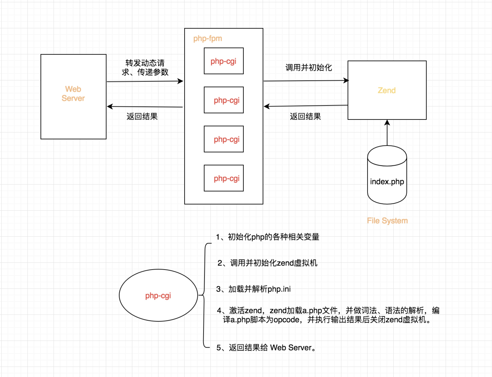


总结：

> CGI是一个协议， PHP-CGI实现了这个协议。
> FastCGI是一个协议， PHP-FPM实现了这个协议。
> FastCGI是用来提高CGI程序性能的。
> PHP-CGI是用来解释PHP脚本的程序。

`FastCGI`与`CGI`区别：

* 对于CGI来说，每一个Web请求PHP都必须重新解析php.ini、重新载入全部扩展，并重新初始化全部数据结构。而使用FastCGI，所有这些都只在进程启动时发生一次。一个额外的好处是，持续数据库连接(`Persistent database connection`)可以工作。
* 由于FastCGI是多进程，所以比CGI多线程消耗更多的服务器内存，php-cgi解释器每进程消耗7至25兆内存，将这个数字乘以50或100就是很大的内存数。


`PHP-CGI`与`PHP-FPM`区别：

* `PHP-CGI`是PHP实现的自带的FastCGI管理器，但是性能太差。php-cgi变更php.ini配置后，需重启php-cgi才能让新的php-ini生效，不可以平滑重启。直接杀死php-cgi进程，php就不能运行了。
* `PHP-FPM`通过管理PHP-CGI进程来实现PHP平滑重启，使用FastCGI，所有这些都只在进程启动时发生一次，相对于`PHP-CGI`解决了CGI并发重复Fork的问题。


## 四层体系架构

4、<span id="04">PHP的四层体系架构是什么？</span>

PHP的四层体系架构如下图所示：

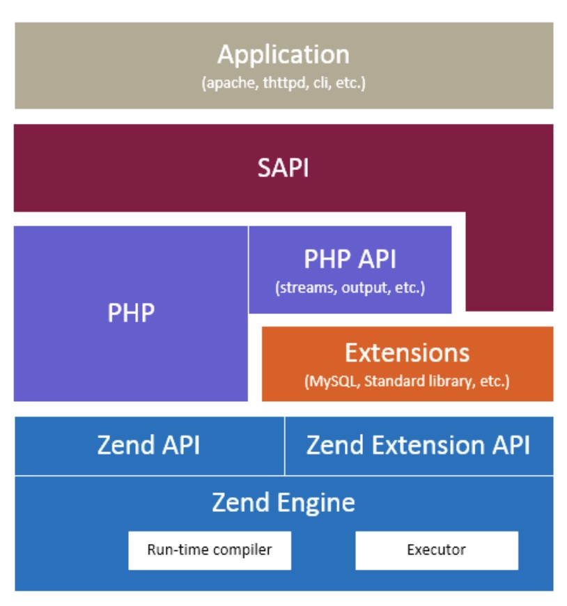

从图上可以看出，PHP从上到下是一个四层体系：

- `Application`：这就是我们平时编写的PHP程序，通过不同的SAPI方式得到各种各样的应用模式，如通过Web Server实现Web应用、在命令行下以脚本方式运行等等。
- `SAPI`：SAPI全称是Server Application Programming Interface，也就是服务端应用编程接口，SAPI通过一系列钩子函数，使得PHP可以和外围交互数据，这是PHP非常优雅和成功的一个设计，通过SAPI成功的将PHP本身和上层应用解耦隔离，PHP可以不再考虑如何针对不同应用进行兼容，而应用本身也可以针对自己的特点实现不同的处理方式。
- `Extensions`：围绕着Zend引擎，extensions通过组件式的方式提供各种基础服务，我们常见的各种内置函数（如array系列）、标准库等都是通过extension来实现，用户也可以根据需要实现自己的extension以达到功能扩展、性能优化等目的（如贴吧正在使用的PHP中间层、富文本解析就是extension的典型应用）。
- `Zend引擎`：Zend整体用纯C实现，是PHP的内核部分，它将PHP代码翻译（词法、语法解析等一系列编译过程）为可执行opcode处理，并实现相应的处理方法，实现了基本的数据结构（如hashtable、oo）、内存分配及管理、提供了相应的api方法供外部调用，是一切的核心，所有的外围功能均围绕Zend实现。

## 变量的底层数据结构zval

5、<span id="05">PHP变量的底层数据结构？PHP中有八种数据类型，为何联合体zval-> `value`中只有五种？</span>

Zval结构体主要由四部分组成：

* type：指定了变量所述的类型（整数、字符串、数组等）。

* refcount__gc：引用计数内存中使用次数，为0删除该变量。

* is_ref__gc：区分是否是引用变量，是引用为1，否则为0

* value：核心部分，存储了变量的实际数据。

  > Zvalue是用来保存一个变量的实际数据。因为要存储多种类型，所以zvalue是一个union，也由此实现了弱类型。

```php
struct _zval_struct {
	union {
		long lval; 
		double dval;
		struct {
			char *val;
			int len;
		} str;
		HashTable *ht;
		zend_object_value obj;
	} value;					//变量value值
	zend_uint refcount__gc;   //引用计数内存中使用次数，为0删除该变量
	zend_uchar type;		   //变量类型
	zend_uchar is_ref__gc;    //区分是否是引用变量，是引用为1，否则为0
};
```

```php
zval.value.lval => 整型、布尔型、资源
zval.value.dval => 浮点型
zval.value.str  => 字符串
zval.value.*ht  => 数组
zval.value.obj  => 对象
```

PHP的八种数据类型：

* [Boolean 布尔类型](https://www.php.net/manual/zh/language.types.boolean.php)-标量类型
* [Integer 整型](https://www.php.net/manual/zh/language.types.integer.php)
* [Float 浮点型](https://www.php.net/manual/zh/language.types.float.php)
* [String 字符串](https://www.php.net/manual/zh/language.types.string.php)
* [Array 数组](https://www.php.net/manual/zh/language.types.array.php)-复合类型
* [Object 对象](https://www.php.net/manual/zh/language.types.object.php)-复合类型
* [Resource 资源类型](https://www.php.net/manual/zh/language.types.resource.php)-特殊类型（type：IS_RESOURCE）
* [NULL](https://www.php.net/manual/zh/language.types.null.php)-特殊类型（type：IS_NULL）

布尔型和资源是怎么对应到`zval.value`的lval上的呢？还有，NULL呢？

布尔型：就像我们会将true和false映射成0和1进行数据库存储一样，php也是这么做的。所以php发现zval的type值是布尔型时，会将布尔型转成0或1存储在zval.value的lval中。

资源：资源对于php来说属于一个比较特殊的变量，而php会将每个资源对应的资源标识存储在zval.value的lval中。常见的资源有：文件句柄、数据库句柄等。

NULL：对于NULL来说，就更好理解了，因为本身通过zval的type值即可区分，所以并没有将NULL值存储在zval的value中。


## PHP7与PHP5的区别

6、<span id="06">PHP7和PHP5的区别，具体多了哪些新特性？</span>


## 进程、线程、协程及其区别

7、<span id="08">什么是进程？什么是线程？什么是协程？进程与线程的区别是什么？</span>

① 什么是进程？

进程（`Process`）是具有一定独立功能的程序、它是系统进行资源分配和调度的一个独立单位，重点在系统调度和单独的单位，也就是说进程是可以独立运行的一段程序。

② 什么是线程？

线程（`Thread`）进程的一个实体，有时也被称为轻量级的进程（`Light Weight Process`，`LWP`），是`CPU`调度和分派的基本单位，是程序执行流的最小单元，它是比进程更小的能独立运行的基本单位。线程自己基本上不拥有系统资源，在运行时，只是暂用一些计数器、寄存器和栈。

> 注：进程是资源分配的最小单位，线程是资源调度的最小单位。

③ 什么是协程？

协程（`Coroutines`），是一种基于线程之上，但又比线程更加轻量级的存在，这种由程序员自己写程序来管理的轻量级线程叫做『用户空间线程』，具有对内核来说不可见的特性。

因为是自主开辟的异步任务，所以很多人也更喜欢叫它们纤程（`Fiber`），或者绿色线程（`GreenThread`）。正如一个进程可以拥有多个线程一样，一个线程也可以拥有多个协程。


④ 进程与线程的区别？

- 进程是资源（`CPU`、内存等）分配的最小单位，线程是程序执行的最小单位（资源调度的最小单位）。
- 进程有自己的独立地址空间，每启动一个进程，系统就会为它分配地址空间，建立数据表来维护代码段、堆栈段和数据段，这种操作非常昂贵。线程是共享进程中的数据的，使用相同的地址空间，因此`CPU`切换一个线程的花费远比进程要小很多，同时创建一个线程的开销也比进程要小很多。
- 线程之间的通信更方便，同一进程下的线程共享全局变量、静态变量等数据，而进程之间的通信需要以进程间通信的方式 `IPC`（`Inter-Process Communication`）进行。不过如何处理好同步与互斥是编写多线程程序的难点。
- 多进程程序更健壮，多线程程序只要有一个线程死掉，整个进程也死掉了，而一个进程死掉并不会对另外一个进程造成影响，因为进程有自己独立的地址空间。

⑤ 线程和协程的区别？

| 比较项   |                             线程                             |                             协程                             |
| -------- | :----------------------------------------------------------: | :----------------------------------------------------------: |
| 占用资源 |                   初始单位为1MB,固定不可变                   |                初始一般为 2KB，可随需要而增大                |
| 调度所属 |                       由 OS 的内核完成                       |                          由用户完成                          |
| 切换开销 | 涉及模式切换(从用户态切换到内核态)、16个寄存器、PC、SP...等寄存器的刷新等 |            只有三个寄存器的值修改 - PC / SP / DX.            |
| 性能问题 |        资源占用太高，频繁创建销毁会带来严重的性能问题        |              资源占用小,不会带来严重的性能问题               |
| 数据同步 |            需要用锁等机制确保数据的一直性和可见性            | 不需要多线程的锁机制，因为只有一个线程，也不存在同时写变量冲突，在协程中控制共享资源不加锁，只需要判断状态就好了，所以执行效率比多线程高很多。 |

⑥ 进程与线程的类比：进程=火车，线程=车厢

- 一个进程可以包含多个线程（一辆火车包含多节车厢）
- 线程依赖于进程，它是进程中一个完整的执行路径 （车厢依赖火车，单纯的车厢无法运行）
- 进程间的通信通过`IPC`(`Inter-Process Communication`）进行,比如管道(`pipe`)、信号量(`semophore`)、消息队列(`messagequeue`) 、 套接字(`socket`)等 （一辆火车上的乘客换到另外一辆火车，需要在站点进行换乘）
- 线程间的通信通过共享内存（`Shared Memory`）、消息队列等方式进行 （同一辆火车，A车厢换到B车厢很容易）
- 创建一个进程的开销比创建一个线程开销要消耗更多的计算机资源 （采用多列火车相比多个车厢更耗资源）
- 进程间不会相互影响，但是一个线程挂掉将导致整个进程挂掉（火车之间相互不影响，一个车厢断裂会影响火车运行）
- 一个线程使用共享内存时，其他线程必须等它结束，才能使用这一块内存 。多个线程同时对同一公共资源（比如全局变量）进行读写需要使用互斥锁（车厢中使用洗手间，需要上锁）
- 一个进程使用的内存地址可以限定使用量--信号量（火车上的餐厅最多同时容纳一定乘客数量，需要等有人出来才能进去）


## 秒杀系统的设计

8、<span id="08">秒杀系统的设计？如何防止用户重复下单？</span>


## 面向对象三大特征

9、<span id="09">请简单讲一下你对面向对象三大特征理解的程度（重点是多态）？</span>

面向对象的三大特征，封装、继承和多态。

* 封装将类的某些信息隐藏在类内部，不允许外部程序直接访问；通过封装的方法来控制成员变量的操作，提高了代码的安全性，把代码用方法进行封装，提高了代码的复用性。
* 继承可以使得子类具有父类的属性和方法，还可以在子类中重新定义，以及追加属性和方法；继承让**类与类之间产生关系**，提高了代码的复用性和可维护性。
* 多态是指同一个对象在不同时刻下表现出不同的形态，可以理解为相同的事物，调用其相同的方法，参数也相同时，但表现的行为却不同；多态的好处是**消除了类与类之间的耦合关系**，提高了程序的扩展性、灵活性和简化性。

多态类比：

```java
我们可以说猫是猫：猫 cat = new 猫();
我们也可以说猫是动物：动物 animal = new 猫();
这里猫在不同的时刻表现出来了不同的形态，这就是多态。
```

多态的前提：

- 有继承/实现关系
- 有方法重写
- 有父类引用指向子类对象

多态中成员的访问特点：

> 成员变量：编译看父类（左边），运行看父类（左边）。
>
> 成员方法：编译看父类（左边），运行看子类（右边）。

多态中成员变量和成员方法的访问是不一样的。成员变量编译和运行都看父类，而成员方法编译看父类，运行看子类。**原因是因为成员方法有重写，成员变量没有重写。**

多态的好处：

> 提高程序的扩展性。多态的好处是消除了类之间的耦合关系，使程序更容易扩展。定义方法时候，使用父类型作为参数，在使用的时候，使用具体的子类型参与操作。

多态的弊端：（可使用多态的向下转型解决该弊端）

> 不能使用子类的特有成员，只能访问共有的成员。


10、


## PHP.INI选项模块包含内容

11、<span id="11">`php.ini`里面具体都包含了哪些选项模块？至少五个。</span>

① Language Options，语言选项。

② Resource Limits，资源限制。

③ Error handling and logging，错误处理和日志。

④ Data Handling，数据处理。

⑤ Paths and Directories，路径和目录。

⑥ File Uploads，文件上传。

⑦  Dynamic Extensions，动态扩展。

⑧ Module Settings，模块加载设置。


## php-fpm相关命令

12、<span id="12">php-fpm 相关命令，终止、重启、平滑重启、查看进程数等。</span>

① 平滑重启php-fpm主进程-`kill -USR2 [pid]`。 -USR2 平滑重载所有worker进程并重新载入配置和二进制模块。

② 查看php-fpm主进程-`ps aux |grep php-fpm`。

③ 查看php-fpm的进程个数-`ps aux | grep -c php-fpm`。

④ 强制关闭php-fpm（不推荐）-`pkill php-fpm `。

⑤ 关闭php-fpm主进程-`kill -INT [pid]`。

在修改`php.ini`后，需要重启`php-cgi`才能生效，但是`php-cgi`不能平滑重启，杀掉`php-cgi`进程后，应用程序就无法工作了。使用`php-fpm`可以实现平滑重启，其处理机制是新的子进程用新的配置，已经存在的子进程处理完手上的活就可以歇着了，从而达到平滑过度的效果。


## PHP-FPM与Nginx的通信机制

13、<span id="13">PHP-FPM 与 Nginx 通信的两种机制方式？区别是什么？</span>

一种是`TCP/IP socket`机制（默认机制），一种是`Unix socket `机制。

① `TCP/IP socket`机制:

` nginx.conf`配置:

```php
location ~ \.php$ {
    root           html;
    fastcgi_pass   127.0.0.1:9000;
    fastcgi_index  index.php;
    fastcgi_param  SCRIPT_FILENAME    $document_root$fastcgi_script_name;
    include        fastcgi_params;
}
```

`php-fpm.conf`配置：

```php
listen = 9000
```

② `Unix socket `机制：

` nginx.conf`配置:

```php
#fastcgi_pass   127.0.0.1:9000;
fastcgi_pass   unix:/var/run/php-fpm.socket;
```

`php-fpm.conf`配置：

```php
listen = /var/run/php-fpm.socket
```

两种方式的区别：

* `Unix socket`和`Tcp/Ip socket`都是进程间的一种通信机制，`Unix socket`允许运行在同一台计算机上的的进程之间进行双向数据交换。而Tc`p/Ip socket`允许运行在不同计算机上的进程间通过网络通信。
* `UNIX socket`知道进程在同一个系统上执行，所以它们可以避免一些检查和操作（如路由），这使得`Unix socket`进程间的通信比`Tcp/Ip socket`更快更轻。因此，如果你让进程在同一个主机上通信，使用`Unix socket`更好。


## unset引用类型的底层原理

14、<span id="14">unset 引用类型的底层原理？</span>

```php
$a = 1;
$b = &$a;
unset($a);
echo $b;
```

变量容器zval，zval包括`type`、`value`、`is_ref_gc`、`refcount_gc`。

第一次声明变量a的时候，生成一个变量容器zval结构体，其中`type=int,value=1,is_ref_gc=0,ref_count_gc=1`。

第二次引用赋值b,不会新生成一个变量容器zval的结构体，而是引用上面的同一个结构体，其值修改为`type=int,value=1,is_ref_gc=1,ref_count_gc=2`。

当时候unset函数时，会删除变量a的名字，并且将结构体中的值修改为`type=int,value=1,is_ref_gc=1,ref_count_gc=1`。

此时b的值仍然是1，直到`ref_count_gc=0`时，进行垃圾回收。


##  PHP垃圾回收机制的原理

15、<span id="15">PHP垃圾回收机制的原理？</span>

`php5.3`版本之前的垃圾回收机制：

>  当变量容器的`ref_count`引用计数次数清0时，表示该变量容器就会被销毁，实现了内存回收。

循环引用引发的内存泄露问题：

`php5.3`版本之前的垃圾回收机制存在一个漏洞，即当数组或对象内部子元素引用其父元素，而此时如果发生了删除其父元素的情况，此变量容器并不会被删除，因为其子元素还在指向该变量容器，但是由于所有作用域内都没有指向该变量容器的符号，所以无法被清除，因此会发生内存泄漏，直到该脚本执行结束

示例：

```php
$a = array( 'one' );
$a[] = &$a;
xdebug_debug_zval( 'a' );
```


```php
unset($a);
xdebug_debug_zval('a');
```


删除变量a后，refcount 仍然为1，尽管不再有某个作用域中的任何符号指向这个结构（变量容器），由于数组元素1仍然指向数组本身，所以这个容器不能被清除。因为没有任何符号指向它，用户没有办法清除这个结构，结果就会导致内存泄露。

`php5.3`版本之后新的垃圾回收机制：

* 采用新的算法，引用计数系统中的同步周期回收算法来清除，具体规则是① 如果引用计数减少到零，所在变量容器将被直接清除；② 如果一个zval 的引用计数减少后还大于0，那么它会进入垃圾周期，在一个垃圾周期中，通过检查引用计数是否减1，并且检查哪些变量容器的引用次数是零，来发现哪部分是垃圾。
* 同时使用根缓冲区机制，当php发现有存在循环引用的zval时，就会把其投入到根缓冲区，当根缓冲区达到配置文件中的指定数量后，就会进行垃圾回收，以此解决循环引用导致的内存泄漏问题（php5.3开始引入该机制）


## Nginx 和PHP之间的交互过程

16、<span id="16">Nginx 和PHP之间的交互过程？</span>

```php
server 
    listen       80; #监听80端口，接收http请求
    server_name  www.example.com; #一般存放网址，表示配置的哪个项目
    root /home/wwwroot/zensmall/public/; # 存放代码的根目录地址或代码启动入口
    index index.php index.html; #网站默认首页
	
    #当请求网站的url进行location的前缀匹配且最长匹配字符串是该配置项时，按顺序检查文件是否存在，并返回第一个找到的文件
    location / {
    	  #try_files，按顺序检查文件是否存在，返回第一个找到的文件
    	  #$uri代表不带请求参数的当前地址
          #$query_string代表请求携带的参数
    	  try_files   $uri $uri/ /index.php?$query_string; #按顺序检查$uri文件，$uri地址是否存在，如果存在，返回第一个找到的文件；如果都不存在，发起访问/index.php?$query_string的内部请求，该请求会重新匹配到下面的location请求
    }
    
	 #当请求网站的php文件的时候，反向代理到php-fpm去处理
    location ~ \.php$ {
    	  include       fastcgi_params; #引入fastcgi的配置文件
    	  fastcgi_pass   127.0.0.1:9000; #设置php fastcgi进程监听的IP地址和端口
    	  fastcgi_index  index.php; #设置首页文件
    	  fastcgi_param  SCRIPT_FILENAME  $document_root$fastcgi_script_name; #设置脚本文件请求的路径
    }
}
```

每次nginx监听到80端口的url请求，会对url进行location匹配。如果匹配到/规则时，会进行内部请求重定向，发起/index.php?$query_string的内部请求，而对应的location配置规则会将请求发送给监听9000端口的php-fpm的worker进程。

用户请求流程：

> 用户访问域名->域名进行DNS解析->请求到对应IP服务器和端口->nginx监听到对应端口的请求->nginx对url进行location匹配->执行匹配location下的规则->nginx转发请求给php->php-fpm的worker进程监听到nginx请求->worker进程执行请求->worker进程返回执行结果给nginx->nginx返回结果给用户。

## 一次用户完整的请求

17、<span id="17"> 浏览器输入url回车之后的整体过程。 </span>
归纳总结口诀：DNS域名解析->TCP三次握手->HTTP请求->TCP四次挥手->浏览器页面渲染

> DNS进行域名解析，获取IP找到服务器； 
> TCP三次握手建立连接，等待数据请求和传输； 
> 客户端发起HTTP请求，服务器响应HTTP请求； 
> TCP四次挥手断开连接，客户端解析数据渲染页面。

## PHP 动态语言的弱点

18、 <span id="18">PHP 动态语言，有什么很明显的问题？和 Java 相比有什么不同？</span>
心念一转，万念皆转；心路一通，万路皆通。

> ① PHP对多线程的支持不是很好。PHP采用的是多进程单线程模式，JAVA采用多线程。 
>
> ② 弱类型动态语言，PHP语法不太严谨，变量不需要定义就可以使用。 
>
> ③ PHP的解释运行机制。PHP靠解释器解释而非编译器解析。 
>
> ④ 动态语言，性能比较差，不适合做密集运算，如果同样的 PHP 程序使用 C/C++ 来写，PHP 版本要比它差一百倍。使用C/C++、JAVA、Golang等静态编译语言作为PHP的补充，动静结合。
>
> ⑤ Java安全性较好。编译成字节码的过程中就可进行提前检查错误，而不是像PHP在运行的过程中检查。

## PHP和Go语言的区别

19、<span id="19"> php 和 go语言有什么差别？ </span>
[PHP与Golang在开发中的比较](http://baijiahao.baidu.com/s?id=1602485572019570364&wfr=spider&for=pc) 
归纳：从性能，效率，安全，扩展方面考虑。

> 性能方面，Go的性能极其快，与 Java 或 C++相当，Go 一般比 Python 要快 30 倍。 
> 效率方面，多线程技术提高了Go的效率，PHP需要编写几乎五倍的代码才能生成与Go应用程序相同的功能。 
> 安全方面，Go内置的错误检查机制，对编译进行分析，使上线的代码更安全。 
> 扩展方面，PHP不能有效地支持独立的可互换模块，Go的可扩展性更高。

① Go的性能极其快，与 Java 或 C++相当，Go 一般比 Python 要快 30 倍。

> Golang和PHP的表现速度差异很大。Kairos报告说，当客户从PHP构建转移到Golang时，其客户报告API事务速度提高了8倍。发生这种情况是因为Golang比PHP更有效地处理数据处理。此外，由于编译方面的原因，即使是糟糕的Golang代码也会优于良好的PHP代码，从而提高性能。更重要的是，最终用户可以获得快速执行的应用程序。 

② 快速的开发时间。 
PHP需要编写几乎五倍的代码才能生成与Golang应用程序相同的功能。想象一下，为应用程序部署而节省的时间。通过让企业应用程序及时运行，企业可以节省宝贵的时间。 
③ 多线程技术提高了Golang的效率，企业成本低。 
由于多线程技术提高了Golang的效率，减少了部署规模，减少了内存占用量，并且整体运行的Docker容器减少了，所以团队可以将Kubernetes集群中的主机数量减少50％以上。Go部署需要的容器数量惊人地少于处理比PHP API高得多的负载。鉴于这些因素，Golang降低了企业的间接成本。

④ Golang内置的错误检查机制，对编译进行分析，使上线的代码更安全。 
⑤ PHP不能有效地支持独立的可互换模块，Golang的可扩展性更高。

## 写时复制

20、<span id="20">什么是PHP的`copy on write`写时复制？</span>

```php
<?php
$var = "wangxiong";
$var_dup = $var;
$var = 1;
```

PHP 在修改一个变量以前，会首先查看这个变量的 refcount，如果 refcount 大于1，PHP 就会执行一个分离的例程， 对于上面的代码，当执行到第三行的时候，PHP 发现 var 指向的 zval 的 refcount 大于1，那么 PHP 就会复制一个新的 zval 出来，将原 zval 的 refcount 减 1，并修改值，使得var 和 $var_dup 分离(Separation)。这个机制就是所谓的 copy on write(写时复制)。注：is_ref = 0。

```php
$a = 3;
$b = $a;
$b = 5；
echo $a,$b;
```

```php
$arr = [0,1,2,3];
foreach($arr as $v) {
}
var_dump(current($arr)); // boolean false

$arr = [0,1,2,3];
foreach($arr as $k=>$v) {
  $arr[$k]=$v;
}
var_dump(current($arr)); // int(1)
```

## 结构体的强制分裂

21、<span id="21">什么是结构体的强制分裂，下面的代码结果是什么？</span>

```php
$a = 3;
$b = $a;
$c = &$a;
$c = 5;
echo $a,$b,$c;
```

```php
$a = 3;
/**
a{
value:3
type:IS_LONG
is_ref_gc:0
refcount_gc:1
}
**/
$b = $a;
/**
// a,b共用一个结构体
a,b{
value:3
type:IS_LONG
is_ref_gc:0
refcount_gc:2
}
**/
$c = &$a;
/**
// 如果is_ref_gc 从0到1的时候，并且refcount_gc大于2，将会强制分裂。
a,c{
value:3
type:IS_LONG
is_ref_gc:1
refcount_gc:2
}

b{
value:3
type:IS_LONG
is_ref_gc:0
refcount_gc1
}
**/
$c = 5;
/**
a,c{
value:5
type:IS_LONG
is_ref_gc:1
refcount_gc:2
}
**/
echo $a,$b,$c;
```

通过上面的分析，a的值是5，b的值是3，c的值是5。

```php
$arr = [0,1,2,3];
$x = &$arr[1];
$tmp = $arr;
$arr[1] = 999;
echo $tmp[1];//999
```

## 数组KEY的限制条件

22、<span id="22">数组 KEY 和 VALUE 的限制条件。</span>

```php
$arr = [
  1 => 'a',
  "1" => 'b',
  1.5 => 'c',
  true => 'd'
]
var_dump($arr);  
```

```php
[1 => 'd']
```

* key 可以是 integer 或者是 string。
* value 可以是任意类型。

key 会有如下类型的强制转换：

* 包含有合法整型值的字符串会被强制转换成整型。
* 浮点数和布尔值也会被转换为整型。
* 键名 null 实际会被存储为 “”。
* 数组和对象不能被用为键名。
* 相同键名，之前会被覆盖。

```php
$arr = [1,2,3,4,5]
foreach($arr as $k => $v){
  unset($arr[$k]);
}  
$arr[]=6;
print_r($arr);
// [5 => 6]
```

unset删除后，并不会重置数组的索引。

## 静态延迟绑定

23、<span id="23">关于 static 静态延迟绑定，执行如下代码，输出结果是什么？</span>

 ```php
<?php
class Car
{
  protected static function getModel(){
    echo "This is a car model \n";
  }
  public static function model(){
    self::getModel();
    static::getModel();
  }
}

Class Taxi extends Car
{
  protected static function getModel(){
    echo "This is a Taxi model \n";
  }
}

Taxi::model();
 ```

输出结果如下：

```
This is a car model
This is a Taxi model
```

知识点：

- `self` 可以用于访问类的静态属性、静态方法和常量，但 `self` 指向的是当前定义所在的类，这是 `self` 的限制。
- `static` 也可以用于访问类的静态属性、静态方法和常量，`static` 指向的是实际调用时的类，也就是说，`static`关键字允许函数能够在运行时动态绑定类中的方法。

关于延迟静态绑定的解析，试分析以下代码的执行结果：

```php
<?php
class A {
    public static function foo () {
        static:: who ();
    }

    public static function who () {
        echo __CLASS__ . "\n" ;
    }
}

class B extends A {
    public static function test () {
        A :: foo ();
        parent :: foo ();
        self :: foo ();
        static::foo();
        forward_static_call(['A', 'foo']);
        echo '<br>';
    }

    public static function who () {
        echo __CLASS__ . "\n" ;
    }
}

class C extends B {
    public static function who () {
        echo __CLASS__ . "\n" ;
    }

    public static function test2() {
        self::test();
    }
}

class D extends C {
    public static function who () {
        echo __CLASS__ . "\n" ;
    }
}

B::foo();
B::test();

C::foo();
C::test();

D::foo();
D::test2();
```

运行结果如下：

```
B A B B B B 
C A C C C C 
D A D D D D
```

知识点： 
① `self` 和 `__CLASS__`，都是对当前类的静态引用，取决于定义当前方法所在的类。也就是说，`self` 写在哪个类里面， 它引用的就是谁。 
② `$this` 指向的是实际调用时的对象，也就是说，实际运行过程中，谁调用了类的属性或方法，`$this` 指向的就是哪个对象。但 `$this` 不能访问类的静态属性和常量，且 $this 不能存在于静态方法中。 
③ `static`关键字除了可以声明类的静态成员（属性和方法）外，还有一个非常重要的作用就是延迟静态绑定。 
④ `self` 可以用于访问类的静态属性、静态方法和常量，但 `self` 指向的是当前定义所在的类，这是`self`的限制。 
⑤ `static` 可以用于静态或非静态方法中，也可以访问类的静态属性、静态方法、常量和非静态方法，但不能访问非静态属性。 
⑥ 静态调用时，`static` 指向的是实际调用时的类；非静态调用时，`static` 指向的是实际调用时的对象所属的类。


## static 和 global 关键字

24、<span id="24">静态变量 static 和 gloabl 全局变量。</span>

① 以下代码的打印结果是多少？

```php
<?php
$count = 5;

function get_count() {
    static $count;
    return $count++;
}

echo $count."\n";
++$count;
echo get_count()."\n";
echo get_count()."\n";
```

输出结果如下：

```
5

1
```

> 递增／递减运算符不影响布尔值。递减 **`null`** 值也没有效果，但是递增 **`null`** 的结果是 `1`。

② 以下程序的输出结果是多少？

```php
<?php
function &myFunc() {
    static $b = 10;
    return $b;
}

echo myFunc()."\n";
$a = &myFunc();
$a = 100;

echo myFunc()."\n";
```

输出结果如下：

```php
10
100
```

③ 以下程序的输出结果是多少？

```php
<?php
$var1 = 5;
$var2 = 10;

function foo(&$my_var) {
    Global $var1;
    $var1 +=2;
    $var2 = 4;
    $my_var += 3;
    return $var2;
}

$my_var = 5;
echo foo($my_var)."\n";
echo $var1."\n";
echo $var2."\n";

$bar = 'foo';
$my_var = 10;
echo $bar($my_var);
```

输出结果如下：

```php
4
7
10
4
```


## PHP 如何实现 hashmap

25、<span id="25">PHP 如何实现 hashmap?</span>


## PHP 常用字符串

26、<span id="26">PHP字符串相关</span>

①、如何将1234567890转换成1,234,567,890 每3位用逗号隔开的形式？

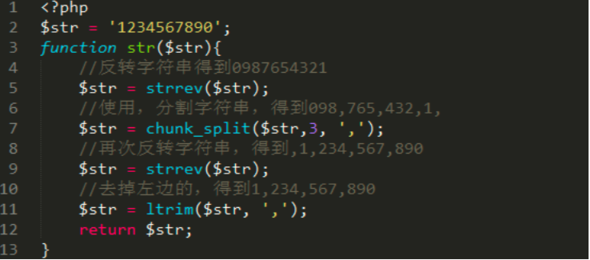

```php
ltrim(strrev(chunk_split(strrev(1234567890), 3, ',')),',')
```

chunk_split — 将字符串分割成小块。

```php
chunk_split ( string $body , int $chunklen = 76 , string $end = "\r\n" ) : string
```

注：strrev函数不能解决中文字符翻转问题。

②、如何实现字符串翻转？

思路：使用正则和数组实现。


```java
function strUtf8() {
  return join("",array_reverse(preg_split("//u",$str)))
}
```

preg_split — 通过一个正则表达式分隔字符串。

```php
preg_split ( string $pattern , string $subject , int $limit = -1 , int $flags = 0 ) : array
```

join — 别名 implode()。

```php
implode ( string $glue , array $pieces ) : string
```


### 字符串截取

* [substr(string，start，length)](https://secure.php.net/manual/zh/function.substr.php) - 返回提取的子字符串， 失败时返回 FALSE。

* [mb_substr(str，start，length，encoding)](https://secure.php.net/manual/zh/function.mb-substr.php) - 获取部分字符串,根据 start 和 length 参数返回 str 中指定的部分，按照字符数执行。

* [mb_strcut(str，start，length，encoding)](https://secure.php.net/manual/zh/function.mb-strcut.php) - 和 mb_substr() 类似，都是从字符串中提取子字符串，但是按字节数来执行，而不是字符个数。

### 字符串替换

* [ str_replace(search，replace，subject，count)](https://secure.php.net/manual/zh/function.str-replace.php) - 子字符串替换，在subject中搜索search并替换为replace，返回替换后的数组或者字符串。

字符串替换：

```php
str_replace('wang','lens','wangxiong')  // lensxiong
```

* [substr_replace(string，replacement，start，length)](https://secure.php.net/manual/zh/function.substr-replace.php) - 字符串截取并替换，返回替换后的数组或者字符串。

隐藏7位手机号码：

```php
substr_replace(157110***5, '*******', 3, 7)  // 157*******5
```

### 字符串查找

* [strstr(haystack，needle，before_needle)](https://secure.php.net/manual/zh/function.strstr.php) -查找字符串的首次出现，返回字符串的一部分或者 FALSE（如果未发现 needle）

返回@前面的字符串：

```php
strstr('lensxiong@gmail.com', '@', true) // lensxiong
```

* [strpos(haystack，needle，offset)](https://secure.php.net/manual/zh/function.strpos.php)  - 查找字符串首次出现的位置，返回 needle 存在于 haystack 字符串起始的位置(独立于 offset)，查找字符串首次出现的位置。字符串位置是从0开始，而不是从1开始的。

```php
strpos('abcdef abcdef', 'b', 2) // $pos = 8, 不是 1
```

```php
$str='aAbB';
echo strpos($str,"A"); // 1
// 忽视位置偏移量之前的字符进行查找
$newstring = 'abcdef abcdef';
$pos = strpos($newstring, 'a', 1); // $pos = 7, 不是 0
```

*  [strrpos(haystack，needle，offset)](https://secure.php.net/manual/zh/function.strrpos.php) - 计算指定字符串在目标字符串中最后一次出现的位置

最后一次出现的位置，忽视位置偏移量之前的字符进行查找：

```php
strrpos('abcdef abcdef', 'b', 9)  // false
```

### 字符串处理

* strtolower() ：函数把字符串转换为小写。
* [lcfirst()](https://www.w3school.com.cn/php/func_string_lcfirst.asp) - 把字符串中的首字符转换为小写。
* [strtoupper()](https://www.w3school.com.cn/php/func_string_strtoupper.asp) - 把字符串转换为大写。
* [ucfirst()](https://www.w3school.com.cn/php/func_string_ucfirst.asp) - 把字符串中的首字符转换为大写。
* [ucwords()](https://www.w3school.com.cn/php/func_string_ucwords.asp) - 把字符串中每个单词的首字符转换为大写。
* trim()：去除字符串首尾处的空白字符(或其他字符)。
* strlen():返回字符串的长度。

```php
echo strlen("Hello world!");//12
```


* substr()：截取字符串

```php
echo substr("Hello world!",6);//world!
```

* str_replace():字符串替换函数

```php
echo str_replace("world","Xiong","Hello world!");//Hello Xiong!
```

* strstr()：检索字符串函数

```php
echo strstr("Hello world!",111);//o world!
```

* str_repeat():字符串重复函数

```php
echo str_repeat(".",13);//.............
```

* strrpos() :查找字符串在另一个字符串中最后一次出现的位置。

```php
echo strpos("Hello world!","wo");//6
```

*  strrchr():查找字符串在另一个字符串中最后一次出现的位置，并返回从该位置到字符串结尾的所有字符。

```php
echo strrchr("Hello world!",111);//orld!
```

* substr() 函数返回字符串的一部分。

```php
echo substr("Hello world!",6,5);//world
```

* strcasecmp():比较两个字符串。(大小写不敏感)

```php
echo strcasecmp("Hello world!","HELLO WORLD!");//0
echo strcasecmp("c","b");//1 echo strcasecmp("a","b");//-1
```

* strcmp() 比较两个字符串。

```php
echo strcmp("a","A");//1 echo strcmp("He","H");//1 echo strcmp("a","b");//-1
```

* strstr()：搜索一个字符串在另一个字符串中的第一次出现。

```php
echo strstr("Hello world!",111);//o world!
```

* substr_count():计算子串在字符串中出现的次数。

```php
echo substr_count("Hello world. The world is nice","world");//2
echo substr_count("Hello world. The world is nice","l");//4
```

## PHP 常用数组

27、<span id="27"> 常用的PHP 数组函数?写出几个常用的数组函数（10-15个左右）。</span>

### 常用数组函数

* array_diff — 计算数组的差集。
* array_column — 返回数组中指定的一列。
* array_flip — 交换数组中的键和值。
* array_chunk — 将一个数组分割成多个数组。
* array_reverse — 返回单元顺序相反的数组。
* array_slice — 从数组中取出一段。
* array_merge — 合并一个或多个数组。
* array_rand — 从数组中随机取出一个或多个随机键。
* array_unshift — 在数组开头插入一个或多个单元。
* array_unique — 移除数组中重复的值。
* in_array — 检查数组中是否存在某个值。
* array_values — 返回数组中所有的值。
* array_pop — 弹出数组最后一个单元（出栈）。
* array_push — 将一个或多个单元压入数组的末尾（入栈）。
* array_shift — 将数组开头的单元移出数组。
* array_intersect — 计算数组的交集。
* array_map — 为数组的每个元素应用回调函数。

① array_diff — 计算数组的差集。

```
对比 array 和其他一个或者多个数组，返回在 array 中但是不在其他 array 里的值。
array_diff ( array $array , array ...$arrays ) : array
```

```php
<?php
$array1 = array("a" => "green", "red", "blue", "red");
$array2 = array("b" => "green", "yellow", "red");
$result = array_diff($array1, $array2);

print_r($result);
?>
  
Array
(
    [1] => blue
)  
```

② array_column — 返回数组中指定的一列。

```php
array_column() 返回input数组中键值为column_key的列， 如果指定了可选参数index_key，那么input数组中的这一列的值将作为返回数组中对应值的键。
array_column ( array $input , mixed $column_key , mixed $index_key = null ) : array
```

```php
<?php
// Array representing a possible record set returned from a database
$records = array(
    array(
        'id' => 2135,
        'first_name' => 'John',
        'last_name' => 'Doe',
    ),
    array(
        'id' => 3245,
        'first_name' => 'Sally',
        'last_name' => 'Smith',
    ),
    array(
        'id' => 5342,
        'first_name' => 'Jane',
        'last_name' => 'Jones',
    ),
    array(
        'id' => 5623,
        'first_name' => 'Peter',
        'last_name' => 'Doe',
    )
);
 
$first_names = array_column($records, 'first_name');
print_r($first_names);
?>

Array
(
    [0] => John
    [1] => Sally
    [2] => Jane
    [3] => Peter
)  
```

③ array_flip — 交换数组中的键和值。

```php
array_flip() 返回一个反转后的 array，例如 array 中的键名变成了值，而 array 中的值成了键名。
array_flip ( array $array ) : array
```

```php
<?php
$input = array("oranges", "apples", "pears");
$flipped = array_flip($input);

print_r($flipped);
?>

Array
(
    [oranges] => 0
    [apples] => 1
    [pears] => 2
) 
```

④ array_chunk — 将一个数组分割成多个数组。

```php
array_chunk — 将一个数组分割成多个数组，其中每个数组的单元数目由 size 决定。最后一个数组的单元数目可能会少于 size 个。preserve_keys 设为 true，可以使 PHP 保留输入数组中原来的键名。如果你指定了 false，那每个结果数组将用从零开始的新数字索引。默认值是 false。
array_chunk ( array $array , int $size , bool $preserve_keys = false ) : array
```

```php
<?php
$input_array = array('a', 'b', 'c', 'd', 'e');
print_r(array_chunk($input_array, 2));
print_r(array_chunk($input_array, 2, true));
?>
Array
(
    [0] => Array
        (
            [0] => a
            [1] => b
        )

    [1] => Array
        (
            [0] => c
            [1] => d
        )

    [2] => Array
        (
            [0] => e
        )

)
Array
(
    [0] => Array
        (
            [0] => a
            [1] => b
        )

    [1] => Array
        (
            [2] => c
            [3] => d
        )

    [2] => Array
        (
            [4] => e
        )

)
```

⑤ array_reverse — 返回单元顺序相反的数组。

```php
array_reverse() 接受数组 array 作为输入并返回一个单元为相反顺序的新数组。preserve_keys 如果设置为 true 会保留数字的键。 非数字的键则不受这个设置的影响，总是会被保留。
array_reverse ( array $array , bool $preserve_keys = false ) : array
```

```php
<?php
$input  = array("php", 4.0, array("green", "red"));
$reversed = array_reverse($input);
$preserved = array_reverse($input, true);

print_r($reversed);
print_r($preserved);
?>
Array
(
    [0] => Array
        (
            [0] => green
            [1] => red
        )

    [1] => 4
    [2] => php
)
Array
(
    [2] => Array
        (
            [0] => green
            [1] => red
        )

    [1] => 4
    [0] => php
)  
```

⑥ array_slice — 从数组中取出一段。

```php
array_slice() 返回根据 offset 和 length 参数所指定的 array 数组中的一段序列。如果给出了 length 并且为负，则序列将终止在距离数组末端这么远的地方。
array_slice ( array $array , int $offset , int $length = null , bool $preserve_keys = false ) : array 
```

```php
<?php
$input = array("a", "b", "c", "d", "e");

$output = array_slice($input, 2);      // returns "c", "d", and "e"
$output = array_slice($input, -2, 1);  // returns "d"
$output = array_slice($input, 0, 3);   // returns "a", "b", and "c"

// note the differences in the array keys
print_r(array_slice($input, 2, -1));
print_r(array_slice($input, 2, -1, true));
?>

Array
(
    [0] => c
    [1] => d
)
Array
(
    [2] => c
    [3] => d
)  
```

⑦ array_merge — 合并一个或多个数组。

```php
array_merge — 合并一个或多个数组。
array_merge ( array $... = ? ) : array
```

```php
<?php
$array1 = array("color" => "red", 2, 4);
$array2 = array("a", "b", "color" => "green", "shape" => "trapezoid", 4);
$result = array_merge($array1, $array2);
print_r($result);
?>
  
Array
(
    [color] => green
    [0] => 2
    [1] => 4
    [2] => a
    [3] => b
    [shape] => trapezoid
    [4] => 4
)  
```

⑧ array_rand — 从数组中随机取出一个或多个随机键。

```php
从数组中取出一个或多个随机的单元，并返回随机条目对应的键（一个或多个）。 
array_rand ( array $array , int $num = 1 ) : int|string|array
```

⑨ array_unshift — 在数组开头插入一个或多个单元。

```php
array_unshift ( array &$array , mixed ...$values ) : int
array_unshift() 将传入的单元插入到 array 数组的开头。注意单元是作为整体被插入的，因此传入单元将保持同样的顺序。所有的数值键名将修改为从零开始重新计数，所有的文字键名保持不变。
```

```php
<?php
$queue = array("orange", "banana");
array_unshift($queue, "apple", "raspberry");
print_r($queue);
?>
  
Array
(
    [0] => apple
    [1] => raspberry
    [2] => orange
    [3] => banana
)
  
```

⑩ array_unique — 移除数组中重复的值。

```
array_unique() 接受 array 作为输入并返回没有重复值的新数组。
array_unique ( array $array , int $sort_flags = SORT_STRING ) : array
注意键名保留不变。array_unique() 先将值作为字符串排序，然后对每个值只保留第一个遇到的键名，接着忽略所有后面的键名。这并不意味着在未排序的 array 中同一个值的第一个出现的键名会被保留。
```

```php
<?php
$input = array("a" => "green", "red", "b" => "green", "blue", "red");
$result = array_unique($input);
print_r($result);
?>
  
Array
(
    [a] => green
    [0] => red
    [1] => blue
)  
```

⑪ in_array — 检查数组中是否存在某个值。

```php
在（haystack）中搜索（ needle），如果没有设置 strict 则使用宽松的比较。
in_array ( mixed $needle , array $haystack , bool $strict = false ) : bool
```

```php
<?php
$a = array('1.10', 12.4, 1.13);

if (in_array('12.4', $a, true)) {
    echo "'12.4' found with strict check\n"; // 不输出
}

if (in_array(1.13, $a, true)) {
    echo "1.13 found with strict check\n"; // 输出
}
```


⑫ array_values — 返回数组中所有的值。

```php
array_values() 返回 input 数组中所有的值并给其建立数字索引。
array_values ( array $array ) : array
```

```php
<?php
$array = array("size" => "XL", "color" => "gold");
print_r(array_values($array));
?>
  
Array
(
    [0] => XL
    [1] => gold
)  
```


⑬ array_pop — 弹出数组最后一个单元（出栈）。

```php
array_pop ( array &$array ) : mixed
array_pop() 弹出并返回 array 数组的最后一个单元，并将数组 array 的长度减一。
```

```php
<?php
$stack = array("orange", "banana", "apple", "raspberry");
$fruit = array_pop($stack);
print_r($stack);
?>

Array
(
    [0] => orange
    [1] => banana
    [2] => apple
)
```

⑭ array_push — 将一个或多个单元压入数组的末尾（入栈）。

```php
array_push ( array &$array , mixed $value1 , mixed $... = ? ) : int
array_push() 将 array 当成一个栈，并将传入的变量压入 array 的末尾。array 的长度将根据入栈变量的数目增加。
```

```php
<?php
$stack = array("orange", "banana");
array_push($stack, "apple", "raspberry");
print_r($stack);
?>
Array
(
    [0] => orange
    [1] => banana
    [2] => apple
    [3] => raspberry
)  
```

⑮ array_shift — 将数组开头的单元移出数组。

```php
array_shift ( array &$array ) : mixed
array_shift() 将 array 的第一个单元移出并作为结果返回，将 array 的长度减一并将所有其它单元向前移动一位。所有的数字键名将改为从零开始计数，文字键名将不变。
```

```php
<?php
$stack = array("orange", "banana", "apple", "raspberry");
$fruit = array_shift($stack);
print_r($stack);
?>
  
Array
(
    [0] => banana
    [1] => apple
    [2] => raspberry
)  
```

⑯ array_intersect — 计算数组的交集。

```php
array_intersect ( array $array1 , array $array2 , array $... = ? ) : array
array_intersect() 返回一个数组，该数组包含了所有在 array1 中也同时出现在所有其它参数数组中的值。注意键名保留不变。
```

```php
<?php
$array1 = array("a" => "green", "red", "blue");
$array2 = array("b" => "green", "yellow", "red");
$result = array_intersect($array1, $array2);
print_r($result);
?>

Array
(
    [a] => green
    [0] => red
)
```

⑰ array_map — 为数组的每个元素应用回调函数。

```php
array_map ( callable $callback , array $array , array ...$arrays ) : array
array_map()：返回数组，是为 array 每个元素应用 callback函数之后的数组。 array_map() 返回一个 array，数组内容为 array1 的元素按索引顺序为参数调用 callback 后的结果（有更多数组时，还会传入 arrays 的元素）。 callback 函数形参的数量必须匹配 array_map() 实参中数组的数量。
```

```php
<?php
function cube($n)
{
    return ($n * $n * $n);
}

$a = [1, 2, 3, 4, 5];
$b = array_map('cube', $a);
print_r($b);
?>

Array
(
    [0] => 1
    [1] => 8
    [2] => 27
    [3] => 64
    [4] => 125
)  
```

⑱

⑲

### 数组排序函数

写出几个常用的数组排序函数？

* asort — 对数组进行排序并保持索引关系。

* arsort() - 对数组进行逆向排序并保持索引关系。

* ksort — 对数组按照键名排序。

* krsort — 对数组按照键名逆向排序。

* sort — 对数组排序。

* rsort — 对数组逆向排序。


① asort — 对数组按照值进行正向排序并保持索引关系。

```php
asort ( array &$array , int $sort_flags = SORT_REGULAR ) : bool
本函数对数组进行排序，数组的索引保持和单元的关联。主要用于对那些单元顺序很重要的结合数组进行排序。  
```

```php
<?php
$fruits = array("d" => "lemon", "a" => "orange", "b" => "banana", "c" => "apple");
asort($fruits);
foreach ($fruits as $key => $val) {
    echo "$key = $val\n";
}
?>

c = apple
b = banana
d = lemon
a = orange  
```

② arsort() - 对数组按照值进行逆向排序并保持索引关系。

```php
arsort ( array &$array , int $sort_flags = SORT_REGULAR ) : bool
本函数对数组进行排序，数组的索引保持和单元的关联。  
```

```php
<?php
$fruits = array("d" => "lemon", "a" => "orange", "b" => "banana", "c" => "apple");
arsort($fruits);
foreach ($fruits as $key => $val) {
    echo "$key = $val\n";
}
?>
  
a = orange
d = lemon
b = banana
c = apple  
```

③ ksort — 对数组按照键名进行正向排序。

```php
ksort ( array &$array , int $sort_flags = SORT_REGULAR ) : bool
对数组按照键名排序，保留键名到数据的关联。本函数主要用于关联数组。  
```

```php
<?php
$fruits = array("d"=>"lemon", "a"=>"orange", "b"=>"banana", "c"=>"apple");
ksort($fruits);
foreach ($fruits as $key => $val) {
    echo "$key = $val\n";
}
?>

a = orange
b = banana
c = apple
d = lemon  
```

④ krsort — 对数组按照键名进行逆向排序。

```php
krsort ( array &$array , int $sort_flags = SORT_REGULAR ) : bool
对数组按照键名逆向排序，保留键名到数据的关联。主要用于结合数组。  
```

```php
<?php
$fruits = array("d"=>"lemon", "a"=>"orange", "b"=>"banana", "c"=>"apple");
krsort($fruits);
foreach ($fruits as $key => $val) {
    echo "$key = $val\n";
}
?>
  
d = lemon
c = apple
b = banana
a = orange  
```

⑤ rsort — 对数组进行逆向排序。  

```php
rsort ( array &$array , int $sort_flags = SORT_REGULAR ) : bool
本函数对数组进行逆向排序（最高到最低）。  
```

```php
<?php
$fruits = array("lemon", "orange", "banana", "apple");
rsort($fruits);
foreach ($fruits as $key => $val) {
    echo "$key = $val\n";
}
?>

0 = orange
1 = lemon
2 = banana
3 = apple
```

⑥ sort — 对数组进行正向排序。

```php
sort ( array &$array , int $sort_flags = SORT_REGULAR ) : bool
本函数对数组进行排序。 当本函数结束时数组单元将被从最低到最高重新安排。
可选的第二个参数 sort_flags 可以用以下值改变排序的行为,排序类型标记：
SORT_REGULAR - 正常比较单元 详细描述参见 比较运算符 章节
SORT_NUMERIC - 单元被作为数字来比较
SORT_STRING - 单元被作为字符串来比较
SORT_LOCALE_STRING - 根据当前的区域（locale）设置来把单元当作字符串比较，可以用 setlocale() 来改变。
SORT_NATURAL - 和 natsort() 类似对每个单元以“自然的顺序”对字符串进行排序。
SORT_FLAG_CASE - 能够与 SORT_STRING 或 SORT_NATURAL 合并（OR 位运算），不区分大小写排序字符串。  
```

```php
<?php

$fruits = array("lemon", "orange", "banana", "apple");
sort($fruits);
foreach ($fruits as $key => $val) {
    echo "fruits[" . $key . "] = " . $val . "\n";
}
?>
fruits[0] = apple
fruits[1] = banana
fruits[2] = lemon
fruits[3] = orange   
```


## 魔术方法

28、<span id="28">常用的魔术方法？</span>

* `__construct`：构造函数，创建一个对象时先调用此方法。举例：`new`一个对象时的初始化工作。
* `__destruct`：析构函数，某个对象的引用被删除或者对象被销毁的时候会调用此方法。
* `__call`：【方法重载】 ，在对象中调用一个不可访问方法时，会调用此方法。
* `__callStatic`：【方法重载】在静态上下文中调用一个不可访问方法时，会调用此方法。该方法是唯一一个静态的魔术方法。
* `__set`：【属性重载】给不可访问的属性赋值，会调用此方法。举例：批量设置私有属性（封装性）；允许在一定范围内添加属性。
* `__get` ：【属性重载】读取不可访问属性的值时，会调用此方法。
* `__isset`：【属性重载】当对不可访问属性调用 isset() 或 empty() 时，会调用此方法。
* `__unset`：【属性重载】当对不可访问属性调用 unset() 时，会调用此方法。
* ` __sleep()`：【序列化】serialize() 序列化的时候会检查该方法是否存在，存在则返回一个被序列化的变量名称数组。
* `__wakeup()`：【反序列化】unserialize() 反序列化时候，定义反序列化后调用的方法，预先准备对象需要的资源。举例：用在反序列化操作中，例如重新建立数据库连接，或执行其它初始化操作。
* `__toString()`：将对象当作字符串使用时被自动调用（类型转换时，对象to 字符串）。举例：` echo $obj`，返回一个字符串。
* `__invoke()`：当将对象当作函数调用时会被自动调用。举例：

```
app->add(new APICheckMiddleWare($container));
```

* `__clone() `：对象复制的时候，会调用此方法。举例：对新克隆的对象中修改属性的值。

* `__autoload()`：实例化对象时，如果该类不存在，则方法被调用。

  


## 正则表达式

29、<span id="29">PHP的正则表达式</span>。

> 正则表达式的作用：分割、匹配、查找、替换字符串。

① 过滤网页上所有的JS脚本：

[【PHP】用正则表达式过滤js代码](https://blog.csdn.net/JecksonChenJinHua/article/details/20494855)

```php
/<script[^>]*?>.*?<\/script>/si  
```

② email 过滤

```php
^[a-zA-Z0-9_-]+@[a-zA-Z0-9_-]+(\.[a-zA-Z0-9_-]+)+$
```

③ 手机号码

```php
/^(13|14|15|17|18)[0-9]{9}$/
```


#### 元字符

| 元 字符 | 描述                                                         |
| :------ | :----------------------------------------------------------- |
| $       | 匹配输入字符串的结尾位置。如果设置了 RegExp 对象的 Multiline 属性，则 $ 也匹配 '\n' 或 '\r'。要匹配 $ 字符本身，请使用 \$。 |
| ( )     | 标记一个子表达式的开始和结束位置。子表达式可以获取供以后使用。要匹配这些字符，请使用 \( 和 \)。 |
| *       | 匹配前面的子表达式零次或多次。要匹配 * 字符，请使用 \\*。    |
| +       | 匹配前面的子表达式一次或多次。要匹配 + 字符，请使用 \\\+。   |
| .       | 匹配除换行符 \n 之外的任何单字符。要匹配 . ，请使用 \\\. 。  |
| [       | 标记一个中括号表达式的开始。要匹配 [，请使用\\ \[。          |
| ?       | 匹配前面的子表达式零次或一次，或指明一个非贪婪限定符。要匹配 ? 字符，请使用 \\?。 |
| \       | 将下一个字符标记为或特殊字符、或原义字符、或向后引用、或八进制转义符。例如， 'n' 匹配字符 'n'。'\n' 匹配换行符。序列 '\\' 匹配 "\"，而 '\(' 则匹配 "("。 |
| ^       | 匹配输入字符串的开始位置，除非在方括号表达式中使用，当该符号在方括号表达式中使用时，表示不接受该方括号表达式中的字符集合。要匹配 ^ 字符本身，请使用 \^。 |
| {       | 标记限定符表达式的开始。要匹配 {，请使用\ \{。               |
| \|      | 指明两项之间的一个选择。要匹配 \|，请使用\ \|。              |
| x(?=y)  | 匹配'x'仅仅当'x'后面跟着'y'.这种叫做先行断言。               |
| []      | 匹配一个集合。                                               |
| [^]     | 除了集合中的字符。                                           |
| [-]     | 0-9代表0到9之间的数字，A-Z代表A-Z之间的数字。                |

#### 限定符

| 字符  | 描述                                                         |
| :---- | :----------------------------------------------------------- |
| *     | 匹配前面的子表达式零次或多次。例如，zo* 能匹配 "z" 以及 "zoo"。* 等价于{0,}。 |
| +     | 匹配前面的子表达式一次或多次。例如，'zo+' 能匹配 "zo" 以及 "zoo"，但不能匹配 "z"。+ 等价于 {1,}。 |
| ?     | 匹配前面的子表达式零次或一次。例如，"do(es)?" 可以匹配 "do" 、 "does" 中的 "does" 、 "doxy" 中的 "do" 。? 等价于 {0,1}。 |
| {n}   | n 是一个非负整数。匹配确定的 n 次。例如，'o{2}' 不能匹配 "Bob" 中的 'o'，但是能匹配 "food" 中的两个 o。 |
| {n,}  | n 是一个非负整数。至少匹配n 次。例如，'o{2,}' 不能匹配 "Bob" 中的 'o'，但能匹配 "foooood" 中的所有 o。'o{1,}' 等价于 'o+'。'o{0,}' 则等价于 'o*'。 |
| {n,m} | m 和 n 均为非负整数，其中n <= m。最少匹配 n 次且最多匹配 m 次。例如，"o{1,3}" 将匹配 "fooooood" 中的前三个 o。'o{0,1}' 等价于 'o?'。请注意在逗号和两个数之间不能有空格。 |

#### 通用原子

| 通用原子 | 描述                                                         |
| -------- | ------------------------------------------------------------ |
| \d       | 匹配一个数字。等价于[0-9]。                                  |
| \D       | 匹配一个非数字字符。等价于[\^ 0-9]。                         |
| \w       | 匹配一个单字字符（字母、数字或者下划线）。等价于 [A-Za-z0-9_]。 |
| \W       | 匹配一个非单字字符。等价于 [\^A-Za-z0-9_]。                  |
| \s       | 匹配一个空白字符，包括空格、制表符、换页符和换行符。         |
| \S       | 匹配一个非空白字符。                                         |

#### 模式修正符

正则表达式中常用的模式修正符有i、g、m、s、U、x、a、D、e 等。

| 修正符 | 描述                                                         |
| ------ | ------------------------------------------------------------ |
| i      | 不区分(ignore)大小写。                                       |
| g      | 全局(global)匹配。                                           |
| m      | 多(more)行匹配。                                             |
| s      | 特殊字符圆点 . 中包含换行符。                                |
| U      | 只匹配最近的一个字符串；不重复匹配。                         |
| x      | 将模式中的空白忽略。                                         |
| A      | 强制从目标字符串开头匹配。                                   |
| D      | 如果使用$限制结尾字符，则不允许结尾有换行。                  |
| e      | 配合函数preg_replace()使用，可以把匹配来的字符串当作正则表达式执行。 |
| u      | 能够正确处理大于\uFFFF的Unicode字符，也就是说，会正确处理四个字节的UTF-16编码。 |

#### 后向引用

使用小括号指定一个子表达式后，匹配这个子表达式的文本(也就是此分组捕获的内容)可以在表达式或其它程序中作进一步的处理。默认情况下，每个分组会自动拥有一个组号，规则是：从左向右，以分组的左括号为标志，第一个出现的分组的组号为 1，第二个为 2，以此类推。

```php
$str = '</b>wangxiong</b>';
$res = preg_replace('/<b>(.*)<\/b>/','\\1',$str);
var_dump($res); // wangxiong
```


## PHP 系统函数

30、<span id="30">PHP执行系统命令函数?</span>

```php
system()
passthru()
exec()
shell_exec()
popen()
proc_open()
pcntl_exec()
```


31、商品库存的解决方案？

方案一（不推荐）：数据库操作商品库存采用乐观锁防止超卖。缺点：数据库压力太大，会被拖垮。

```php
update sku_stock set stock = stock - num , version = version + 1 where sku_code = '' and stock - num > 0 and version = #{version};
```

方案二（不推荐）：利用Redis单线程，强制串行处理。缺点：并发不高，处理慢，效率低，用户体验差。优点：减轻了数据库压力。

```java
/**
     * 缺点并发不高,同时只能一个用户抢占操作,用户体验不好！
     *
     * @param orderSkuAo
     */
    public boolean subtractStock(OrderSkuAo orderSkuAo) {
        String lockKey = "shop-product-stock-subtract" + orderSkuAo.getOrderCode();
        if(redis.get(lockKey)){
            return false;
        }
        try {
            lock.lock(lockKey, 1L, 10L);
            //处理逻辑
        }catch (Exception e){
            LogUtil.error("e=",e);
        }finally {
            lock.unLock(lockKey);
        }
        return true;
    }

```

方案三（推荐）：redis + mq + mysql 保证库存安全，满足高并发处理。

① 提前将商品库存放入缓存 ,如果缓存不存在，视为没有该商品，直接返回false。

② 从缓存中进行检查库存是否充足，库存不足，直接返回。

③  Redis 计数器原子操作，通过incrby 减缓存中的库存。如果库存不足，返回扣减失败。

④ 通过消息队列进行处理生成订单信息，和支付信息，并规定支付时间在半个小时以内，如果未完成支付，则将缓存中的库存还原增加，订单状态超时。

⑤ 如果完成订单支付，则才真正扣减数据库中的库存。

同一个商品，需保持数据库中库存 = 缓存中的库存数量+待支付订单中的商品数量。

```php
     /**
     * 扣库存操作,秒杀的处理方案
     * @param orderCode
     * @param skuCode
     * @param num
     * @return
     */
    public boolean subtractStock(String orderCode,String skuCode, Integer num) {
        String key = "shop-product-stock" + skuCode;
        Object value = redis.get(key);
        if (value == null) {
            //前提 提前将商品库存放入缓存 ,如果缓存不存在，视为没有该商品
            return false;
        }
        //先检查 库存是否充足
        Integer stock = (Integer) value;
        if (stock < num) {
            LogUtil.info("库存不足");
            return false;
        } 
       //不可在这里直接操作数据库减库存，否则导致数据不安全
       //因为此时可能有其他线程已经将redis的key修改了
        //redis 减少库存，然后才能操作数据库
        Long newStock = redis.increment(key, -num.longValue());
        //库存充足
        if (newStock >= 0) {
            LogUtil.info("成功抢购");
            //TODO 真正扣库存操作 可用MQ 进行 redis 和 mysql 的数据同步，减少响应时间
        } else {
            //库存不足，需要增加刚刚减去的库存
            redis.increment(key, num.longValue());
            LogUtil.info("库存不足,并发");
            return false;
        }
        return true;
    }
```


## 防止重复下单

32、<span id="32">如何防止用户重复下单？</span>

* 前端拦截，点击后按钮置灰。
* 后端：一个用户多设备可以下单的模式

```java
//key , 等待获取锁的时间 ，锁的时间
redis.lock("shop-oms-submit" + token + deviceType, 1L, 10L);
```

* 防止恶意用户，恶意攻击 ： 一分钟调用下单超过50次 ，加入临时黑名单 ，10分钟后才可继续操作，一小时允许一次跨时段弱校验。使用reids的list结构，过期时间一小时。

```java
/**
     * @param token
     * @return true 可下单
     */
    public boolean judgeUserToken(String token) {
        //获取用户下单次数 1分钟50次
        String blackUser = "shop-oms-submit-black-" + token;
        if (redis.get(blackUser) != null) {
            return false;
        }
        String keyCount = "shop-oms-submit-count-" + token;
        Long nowSecond = LocalDateTime.now().toEpochSecond(ZoneOffset.of("+8"));
        //每一小时清一次key 过期时间1小时
        Long count = redis.rpush(keyCount, String.valueOf(nowSecond), 60 * 60);
        if (count < 50) {
            return true;
        }
        //获取第50次的时间
        List<String> secondString = redis.lrange(keyCount, count - 50, count - 49);
        Long oldSecond = Long.valueOf(secondString.get(0));
        //now > oldSecond + 60 用户可下单
        boolean result = nowSecond.compareTo(oldSecond + 60) > 0;
        if (!result) {
            //触发限制，加入黑名单，过期时间10分钟
            redis.set(blackUser, String.valueOf(nowSecond), 10 * 60);
        }
        return result;
    }
```


## PHP 优化执行效率

33、<span id="33">请尽可能多的写出 PHP 优化执行效率的方法？</span>

> 概述：① 从PHP语言级别考虑，尽量使用PHP内置函数；合理使用内存，不定义不需要使用的变量，注销不用的变量和大数组释放内存；尽量少使用正则表达式和魔术方法；能在循环外做运算的，尽量提到循环外面；尽量使用带引号的字符串做键值，尽量使用单引号而不要使用双引号。
>
> ② 从耗时操作角度考虑，比较耗时的操作尽量采用异步消息队列操作处理，比如邮件发送、转账支付等。
>
> ③ 热点数据尽量使用缓存，长期不会更改的大量数据也尽量用缓存。
>
> ④  数据量比较大，批量操作数据入库。不要使用遍历插入大量数据。
>
> ⑤ 如果是SQL执行时间较长，需要对SQL进行调优，创建索引、遵守最左前缀原则等。

① 尽量使用PHP内置的函数、变量、常量。PHP 代码需要编译解释为底层语言，这一过程每次请求都会处理一遍，开销大。
② 合理使用内存。注销那些不用的变量尤其是大数组，以便释放内存。

③ 尽量少使用正则表达式，正则表达式的回溯开销比较大。尽量使用函数来完成。

④ 能在循环外做运算的，尽量提到循环外面。

```php
$str = "hello world";
for ($i=0; $i < strlen($str); $i++) {
    # code...
}

// 其中strlen()方法会在每次循环时计算一次

// 进行优化
$str = "hello world";
$strlen = strlen($str);
for ($i=0; $i < $strlen; $i++) {
    # code...
}
```

⑤ 尽量使用带引号的字符串做键值。PHP 会将没有引号的键值当做常量，产生查找常量的开销。

```php
define('key', 'imooc');

$array = array(
    'key' => 'hello world!',
    'imooc' => 'http://www.imooc.com/'
);
echo $array["key"] . '\n'; // 输出 hello world
echo $array[key] . '\n'; // 输出 http://www.imooc.com/
```

⑥ 用单引号代替双引号来包含字符串，这样做会更快一些。因为PHP会在双引号包围的字符串中搜寻变量， 单引号则不会。注意：只有echo能这么做，它是一种可以把多个字符串当作参数的”函数”(译注：PHP手册中说echo是语言结构，不是真正的函数，故 把函数加上了双引号)。

⑦ 减少PHP魔术方法的使用。

⑧ 数据量比较大，批量操作数据入库。

⑨ 耗时操作考虑异步处理。

⑩ 恰当使用非关系型缓存，在适当的业务场景，恰当地使用缓存，是可以大大提高接口性能的。这里的缓存包括：Redis，JVM本地缓存，memcached，或者Map等。

⑪ 进行SQL优化、创建索引、遵守最左原则。


## NSQ 消息队列

34、<span id = "34">NSQ 消息队列的原理？</span>

NSQ is composed of 3 daemons:

- **[nsqd](https://nsq.io/components/nsqd.html)** is the daemon that receives, queues, and delivers messages to clients.
- **[nsqlookupd](https://nsq.io/components/nsqlookupd.html)** is the daemon that manages topology information and provides an eventually consistent discovery service.
- **[nsqadmin](https://nsq.io/components/nsqadmin.html)** is a web UI to introspect the cluster in realtime (and perform various administrative tasks).


## 控制反转和依赖注入

35、<span id="35">谈谈你对控制反转（IoC）和依赖注入（DI）的理解。</span>

> 概述：不需要在A中直接new B，而是通过 Ioc 容器将 B 给我，这就叫控制反转。
>
> 控制反转：将组建间的依赖关系从程序内部提到外部来管理。控制反转是站在 A 的立场来看的，它是拿 B 的。
>
> 依赖注入：组建间的依赖通过外部以参数或者其他形式注入就是依赖注入。依赖注入是站在 Ioc 的立来看的，它是来传送 B的。

**控制反转IoC(Inversion of Control)是说创建对象的控制权进行转移，以前创建对象的主动权和创建时机是由自己把控的，而现在这种权力转移到第三方**，比如转移交给了IoC容器，它就是一个专门用来创建对象的工厂，你要什么对象，它就给你什么对象，有了 IoC容器，依赖关系就变了，原先的依赖关系就没了，它们都依赖IoC容器了，通过IoC容器来建立它们之间的关系。

* 谁控制谁，控制什么：谁控制谁？当然是IoC 容器控制了对象；控制什么？那就是主要控制了外部资源获取（不只是对象包括比如文件等）。
* 为何是反转，哪些方面反转了：反转则是由容器来帮忙创建及注入依赖对象；为何是反转？**因为由容器帮我们查找及注入依赖对象，对象只是被动的接受依赖对象，所以是反转；哪些方面反转了？依赖对象的获取被反转了。**

**DI—Dependency Injection，即“依赖注入”**：**组件之间依赖关系**由容器在运行期决定，即**由容器动态的将某个依赖关系注入到组件之中**。**依赖注入的目的并非为软件系统带来更多功能，而是为了提升组件重用的频率，并为系统搭建一个灵活、可扩展的平台。**通过依赖注入机制，我们只需要通过简单的配置，而无需任何代码就可指定目标需要的资源，完成自身的业务逻辑，而不需要关心具体的资源来自何处，由谁实现。

​       ● 谁依赖于谁：当然是**应用程序依赖于IoC容器**；

　　● 为什么需要依赖：**应用程序需要IoC容器来提供对象需要的外部资源**；

　　● 谁注入谁：很明显是**IoC容器注入应用程序某个对象，应用程序依赖的对象**；

　　● 注入了什么：就是**注入某个对象所需要的外部资源（包括对象、资源、常量数据）**

依赖注入的优点：更好的管理了类与类之间的关系、降低了编码的复杂性。

传统的框架，通过autoload()方法去指定目录寻找文件、然后include和require，来管理类与类之间的关系。

laravel 框架通过namespace 和use 的使用，实现自动加载，再加上反射，实现了依赖注入来管理类和类之间的关系。


## PHP 的反射机制

36、<span id="36">什么是PHP的反射机制，具体应用场景是什么？</span>

反射机制：在PHP运行时，扩展分析程序，导出或者提出关于类、方法、属性、参数等的详细信息，包括注释。这种动态获取信息以及动态调用方法的功能称为反射。

```php
<?php
class A
{
    //我是构造函数的注释
    public function __construct(B $b)
    {
        $this->b = $b;
    }
    //我是getB的注释
    public function getB()
    {
        $this->b->bMethod();
    }
}
class B
{
    public function __construct(C $c,D $d)
    {
        $this->c = $c;
        $this->d = $d;
    }
    public  function bMethod()
    {
        echo "我是B中的方法bMethod()";
    }
}

class C{
    public function __construct(){

    }
    public function cMethod(){
        echo "我是C中的方法cMethod()";
    }

}

class D{
    public function __construct(){

    }
    public function dMethod(){
        echo "我是D中的方法dMethod()";
    }
}

class Ioc
{
    protected $instances = [];
    public function __construct()
    {
    }
    public function getInstance($abstract){
        //获取类的反射信息,也就是类的所有信息
        $reflector = new ReflectionClass($abstract);
        //  echo $reflector->getDocComment();  获取类的注释信息

        //获取反射类的构造函数信息
        $constructor = $reflector->getConstructor();
        //获取反射类的构造函数的参数
        $dependencies = $constructor->getParameters();

        if(!$dependencies){
            return new $abstract();
        }
        foreach ($dependencies as $dependency) {

            if(!is_null($dependency->getClass())){
                $p[] = $this->make($dependency->getClass()->name);
                //这里$p[0]是C的实例化对象,$p[1]是D的实例化对象
            }
        }
        //创建一个类的新实例,给出的参数将传递到类的构造函数
        return $reflector->newInstanceArgs($p);
    }

    public function make($abstract)
    {
        return $this->getInstance($abstract);
    }
}

$ioc = new Ioc();
$a = $ioc->make('A');
$a->getB();
```

## 设计模式

37、<span id="37">常用的设计模式？</span>

设计模式：工厂模式、单例模式、观察者模式、策略模式、适配器模式、注册树模式。

### 单例模式

定义：单例模式，单个实例的设计模式，用于保证类有且只有一个对象的设计模式。

场景：MySQLDB，用于操作数据服务器的工具类，仅仅需要一个对象就可以完成所有的功能。使用一个对象不仅可以减少对象的占用的空间，增加PHP的处理效率。

目的：从根本上，保证类能且仅能实例化一个对象。

实现：三私一公（两个静态方法）。私有的构造方法、私有的静态属性、私有的克隆方法、公有的静态方法。

① 增加构造方法，并将其私有化。

② 私有的静态属性保存实例化好的对象。

③ 增加一个公共的静态方法，用于在类外静态调用该方法，进入到类内，去执行实例化调用构造方法。

④ 防止对象被克隆而生成新对象。

```php
private function __construct() {}
private static $instance;//私有的静态属性保存实例化好的对象
public static function getInstance() {
//先判断对象是否被保存
if(!isset(self::$instance)){
//还没有保存，实例化并返回
self::$instance = new self;
}
return self::$instance;
}
private function __clone() {}
```

```php
// 第二步 封锁new操作
class sigle{
    protected static $ins = null;
    // 方法前加final，则方法不能被覆盖，在类前加final，则不能被继承
    final protected function __contruct(){
    }
    public static function getIns(){
        if(self::$ins === null){
            self::$ins = new self();
        }
        return self::$ins;
    }
    // 防止被克隆
    final protected function __clone(){}
}

$s1 = sigle::getIns();
// $s2 = clone $s1;
$s2 = sigle::getIns();
if($s1 === $s2){
    echo '同一个对象';
}else{
    echo '不是同一个对象';
}
```


### 简单工厂模式

```php
// 共同接口
interface db{
    function conn();
}

// 服务器端开发（不知道将会被谁调用）
class dbsqlite implements db{
    public function conn(){
        echo '连接上了sqlite';
    }
}

class dbmysql implements db{
    public function conn(){
        echo '连接上了mysql';
    }
}


class Factory{
    public static function creatDB($type){
        if($type == 'mysql'){
            return new dbmysql();
        }elseif($type == 'sqlite'){
            return new dbsqlite();
        }else{
            throw new Exception("Error DB type", 1);
        }
    }
}
// 客户端调用时，不知道工厂类中实例化的几种类，只需要传递$type参数就可以
$db = Factory::creatDB('mysql');
$db->conn();
```

在面向对象的设计法则中，重要的开闭原则：对于修改是封闭的，对于扩展是开放的。简单工厂违反了开闭原则。

### 工厂模式

场景：换DB了怎么办？MySQL 、Sqlite、Oracle。

```php
// 共同接口
interface db{
    function conn();
}

interface Factory{
    function createDB();
}

// 服务器端开发（不知道将会被谁调用）
class dbsqlite implements db{
    public function conn(){
        echo '连接上了sqlite';
    }
}

class dbmysql implements db{
    public function conn(){
        echo '连接上了mysql';
    }
}

class mysqlFactory implements Factory{
    public function createDB(){
        return new dbmysql();
    }
}

class sqliteFactory implements Factory{
    public function createDB(){
        return new dbsqlite();
    }
}


// =====服务器端添加了Oracle类
// 前面的代码不用修改
class dboracle implements db{
    public function conn(){
        echo '连接上了oracle';
    }
}

class oracleFactory implements Factory{
    public function createDB(){
        return new dboracle();
    }
}

// =====客户端开始====
$fact = new mysqlFactory();
$db = $fact->createDB();
$db->conn();

$fact = new sqliteFactory();
$db = $fact->createDB();
$db->conn();

$fact = new oracleFactory();
$db = $fact->createDB();
$db->conn();

// 在面向对象设计法则中，重要的开闭原则--对于修改是封闭的，对于扩展是开放的
```

### 观察者模式

```php
class User implements SplSubject{
    public $lognum;
    public $hobby;

    protected $observers = null;

    public function __construct($hobby){
        $this->lognum = rand(1,10);
        $this->hobby  = $hobby;
        $this->observers = new SplObjectStorage();
    }

    public function login(){
        $this->notify();
    }

    public function attach(SplObserver $observer){
        $this->observers->attach($observer);
    }

    public function detach(SplObserver $observer){
        $this->observers->detach($observer);
    }

    public function notify(){
        $this->observers->rewind();
        while ($this->observers->valid()) {
            $observer = $this->observers->current();
            $observer->update($this);
            $this->observers->next();
        }
    }
}


class security implements SplObserver{
    public function update(SplSubject $subject){
        if($subject->lognum<3){
            echo '这是第'.$subject->lognum.'次安全登录';
        }else{
            echo '这是第'.$subject->lognum.'次登录,异常';
        }
    }
}

class ad implements SplObserver{
    public function update(SplSubject $subject){
        if($subject->hobby == 'sports'){
            echo '篮球';
        }else{
            echo '好好学习';
        }
    }
}

// 实施观察
$user = new User('sports');
$user->attach(new security());
$user->attach(new ad());
$user->login();
```


### 装饰者模式

```php
// 装饰器模式做文章修饰功能
class baseArt{
    protected $content;
    protected $art = null;

    public function __construct($content){
        $this->content = $content;
    }

    public function decorator(){
        return $this->content;
    }
}

// 编辑文章摘要
class editorArt extends baseArt{
    public function __construct(baseArt $art){
        $this->art = $art;
        $this->decorator();
    }

    public function decorator(){
        //return $this->art->content .= '小编摘要';
        return $this->content = $this->art->decorator() . '小编摘要';
    }
}

// SEO添加内容
class SEOart extends baseArt{
    public function __construct(baseArt $art){
        $this->art = $art;
        $this->decorator();
    }
    public function decorator(){
        return $this->content = $this->art->decorator() . 'SEO关键词';
    }
}

// 无论是哪个先编辑，顺序都可以进行交换
$x = new SEOart(new editorArt(new baseArt('天天向上')));
$y = new editorArt(new SEOart(new baseArt('天天向上')));
echo $x->decorator();
echo '<br>';
echo $y->decorator();
```

## 算法相关

38、<span id="38">常用的算法？</span>

①（算法）约瑟夫环问题：一群猴子排成一圈，按1,2,…,n依次编号。然后从第1只开始数，数到第m只,把它踢出圈，从它后面再开始数， 再数到第m只，在把它踢出去…，如此不停的进行下去， 直到最后只剩下一只猴子为止，那只猴子就叫做大王。要求编程模拟此过程，输入m、n, 输出最后那个大王的编号。

思路：每个猴子出列后，剩下的猴子又组成了另一个子问题。只是他们的编号变化了。第一个出列的猴子肯定是a[1]=m(mod)n(m/n的余数)，他除去后剩下的猴子是a[1]+1,a[1]+2,…,n,1,2,…a[1]-2,a[1]-1，对应的新编号是1,2,3…n-1。设此时某个猴子的新编号是i，他原来的编号就是(i+a[1])%n。于是，这便形成了一个递归问题。假如知道了这个子问题(n-1个猴子)的解是x，那么原问题(n个猴子)的解便是：(x+m%n)%n=(x+m)%n。问题的起始条件：如果n=1,那么结果就是1。

```php
function monkeyKing($n,$m) {  
    $r=0;  
    for($i=2; $i<=$n; $i++) {
        $r=($r+$m)%$i;  
    }
    return $r+1;  
}  
echo monkeyKing(10,3)."是猴王";
```


② leetcode 41| 缺失的第一个正数。

给定一个未排序的整数数组，找出其中没有出现的最小的正整数。例如[1,2,3,5] 输出4。

说明：你的算法的时间复杂度应为O(n)，并且只能使用常数级别的空间。

思路：它需要找出第一个数组中没有的最小正整数，所以我们通过数组的索引来标识相应的正整数，比如索引0表示正整数1，以此类推，索引i表示正整数i+1，我们只需要遍历一次数组，将满足下列条件的元素交换到对应索引处，1.大于等于1，小于等于数组长度length，2.元素的值不等于当前索引值i+1，需要注意的是，每次交换之后，交换过来的值也要进行上述判断，否则继续遍历后面的元素，相当于遗漏了交换过来的这个元素。经过上面一次遍历之后，所有满足条件（1.大于等于1，小于等于数组长度length，2.元素的值不等于当前索引值i+1。）的元素全部都在对应的索引处了，即元素值等于索引值+1。再通过一次遍历，找出第一个不符合元素值等于索引值i+1的元素，返回结果i+1即为我们需要的寻找的正整数。

PHP版本：

```java

```

Java版本：

```java
int firstMissingPositive(int* nums,int length) {
    for (int i = 0; i < length; i++) {  //从数组的第一个元素开始逐一判断
        int item = nums[i];  //记录当前元素
        if (item >= 1 && item <= length && item != nums[item - 1]) {  //若1<=item<=nums.length，且item不等于i+1，就将item与它对应的i索引处的值进行交换
            swap(nums, i, item - 1);  //调用交换方法
            i--; //进行交换之后，需要对交换过来的数再次进行上述判断，即i--与循环i++抵消一次
        }
    }
    int i = 0;
    for (i = 0; i < length; i++) {  //再次遍历数组
        if (nums[i] != i + 1){ //若当前数组元素的值不等于i+1，则直接返回i+1结果
            return i + 1;
        }
    }
    return i + 1;  //当上述循环结束，程序仍然没有返回结果，则返回i+1，即nums.length+1
}

int swap(int* nums, int i, int j) {  //交换两个数
    nums[i] ^= nums[j];   //通过异或运算进行交换
    nums[j] ^= nums[i];
    nums[i] ^= nums[j];
    return 0;
}

int main (){ //此处为一个测试例子
    int nums[] = { 7, 8, 9, 11, 12 };
    printf("%d\n", firstMissingPositive(nums,5));
```

##final、abstract、interface 、static 

39、<span id="39">final、abstract、interface 、static 关键字分别代表什么？</span>

### final  终极类和方法

> 采用final来修饰的类，不能被继承，仅仅可以实例化对象，意义在于限制。 
> 采用final关键字修饰的方法，导致类被继承时该方法不能被重写。目的是使所有的子类具有功能一致的某个操作方法。 
> 注意，final类与final方法不会同时出现在一个类中（目前不是一个语法要求）

```
final class Book{ }
final public function getPrice(){}
```

### abstract 抽象类和方法

> 当需要限定一个类不能被实例化对象时，可以将该类声明成抽象类。 
> 抽象方法要求，仅仅存在方法的声明与参数列表部分，不能存在方法的实现部分。此时该方法如果需要使用，则需要子类来重写该方法。 
> 抽象方法的作用是用于限定：子类中必须存在，但是实现是可以不同的方法。 
> 一个抽象类，可以不包含抽象方法。 
> 一个抽象方法，必须存在于抽象类中。（只要抽象类中才可以包含抽象方法） 
> 如果继承抽象类的子类，不是抽象类，则必须要将所继承的所有抽象方法全都实现，重写父类的抽象方法，否则，将子类也声明成抽象类。

```php
abstract class Goods{ 
abstract public function getName(); 
} 
```

### interface 接口声明和实现

[对象接口](https://secure.php.net/manual/zh/language.oop5.interfaces.php)

> 接口技术，用于限制一个对象（类）应该具备那些公共（公共的方法）操作的一种结构。例如：USB标准，就是一套接口技术。 
> 使用关键字interface声明，声明的方法，没有方法体部分，也称之为抽象方法。 
> 使用关键字implements实现接口。 
> 如果某个类，实现了某个接口，需要将接口中所定义的所有接口方法，全部实现才可以。

USB设备接口：

```
interface I_USB {  
    public function connect();       
    public function sendData($data);      
    public function getData();   
    }
```

实现USB设备接口：

```
class Mp3 implements I_USB{       
  public function  connect(){}        
  public function  sendData($data){}      
  public function  getData(){}
  }
```

 接口与抽象类的区别：

> 接口中仅仅存在抽象方法，抽象类可以存在抽象方法，也可以存在非抽象方法。 
> 接口中实现类需要将所有的抽象方法都实现，抽象类在继承时需要实现所有的抽象方法。 
> 接口仅仅支持公共方法，只是为了限制外部操作而已，与内部实现没有关系。 
> 接口的作用只是限制其实现类的外部操作。抽象类的作用一是为子类提供基础操作（普通成员），二是限制子类的实现过程。 
> 一个类只能单继承抽象类，但是一个类可以多实现接口。 
> 外部操作，用接口决定，而内部实现可以由抽象来决定。

问：接口是否是类？

> 不是类，接口只是限定类的结构。

问：PHP是否支持多继承？如何实现多继承？

> 不支持多继承，更不能实现多继承。（实现与继承不是一码事）

### static 静态方法和属性 
static的作用：

> 声明静态局部变量。 
> 声明静态成员。 
> 静态延迟绑定。

类内代替类的关键字：

> self::，当前定义类 
> static::，当前调用类 
> parent::，父类

问：self永远代表所在类么？

> 是。类在被定义时（编译），就确定类中的self关键字的值。（将某个self关键字绑定到了某个类上）

## PHP的对象传值与引用传值

40、<span id="40">PHP的对象传值与引用传值是怎样的，有什么区别？</span>

思路：

* 变量赋值为拷贝赋值，修改原值不受影响。
* 对象赋值另一个变量，是将对象的对象标识符拷贝一份，两个对象公用一份数据，其中一个修改，全部被修改。
* 引用传值会直接指向对象标识符，修改其中一个值，所有值均被改变。

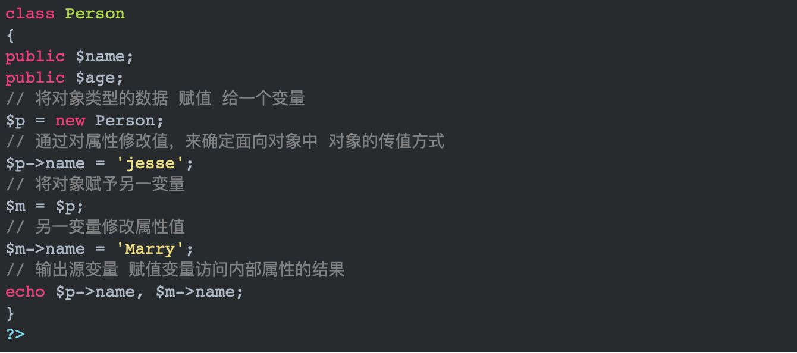

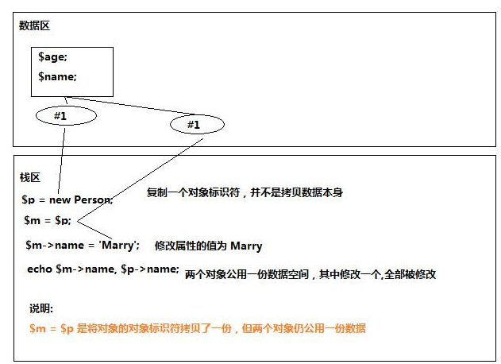


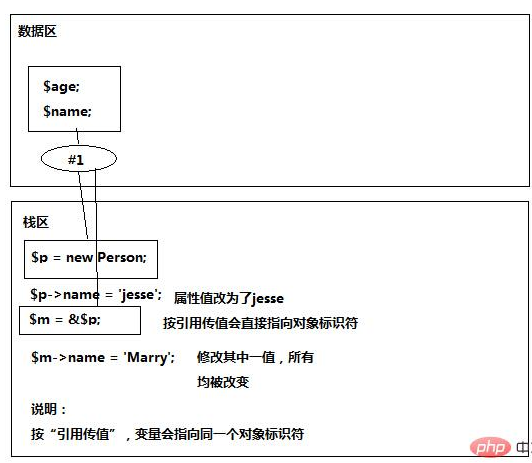

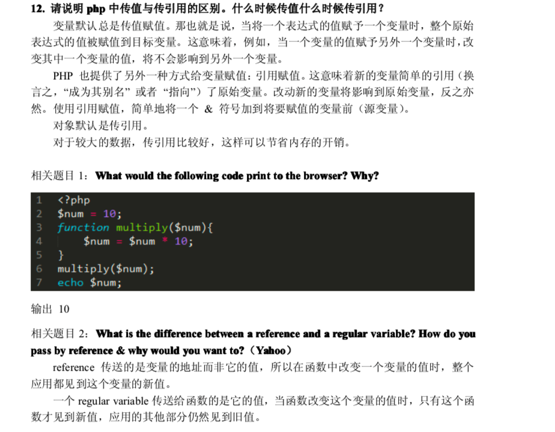

## 网站访问慢的解决方案

41、<span id="41">如何解决PHP网站访问慢的问题？</span>

* 1、流量层面：一是检查自己服务器上的资源（图片、视频、音乐、软件等）是否做了防盗链（nginx配置方式防盗链）；二是CDN加速的使用是否合理。
* 2、前端层面：一是通过减少组件的请求次数来减少HTTP请求（使用图片地图、`css`精灵、图片密集型网站可使用图片懒加载，合并压缩`css`样式表和`js`脚本）；二是对数据文件进行压缩（`JavaScript` 代码的压缩、`CSS `代码的压缩、`HTML` 代码的压缩，`GZIP` 压缩，图片大小处理）；
* 3、服务端层面：一是使用动态语言静态化（使用`smarty`模板引擎的缓存机制生成静态`html`缓存文件），减少逻辑处理压力，降低数据库服务器查询压力；二是对服务端代码进行优化（冗余处理，业务逻辑优化），可以使用消息队列来处理某些业务。
* 4、缓存层面：使用数据库缓存，`Memcached`、`Redis`、`MongoDB`等。
* 5、MySQL数据库层面：数据库表结构、慢SQL调优、建立索引、分库分表、分区操作、读写分离。
* 6、数据库架构：
* 7、服务器层面：负载均衡（Nginx的反向代理）、浏览器静态缓存（Nginx静态资源缓存配置策略）。
* 8、架构层面：从架构上来说，采用前后端分离的分层架构，前端负责站点展现层（异步获取数据，响应速度提升），后端负责站点数据层（通过内网一次性返数据，性能大幅度提升）。


42、<span id ="42">如何防止 SQL 注入？</span>


8、请写出一段PHP代码，确保多个进程同时写入同一个文件成功。（腾讯）

9、PHP 超全局变量$_SERVER。

```PHP
$_SERVER["SERVER_ADDR"] // 服务器端IP
$_SERVER["REMOTE_ADDR"] // 客户端IP
$_SERVER["SCRIPT_FILENAME"] // 当前脚本执行路径
$_SERVER["QUERY_STRING"]  // 服务器请求时？后面的参数
$_SERVER["SCRIPT_NAME"]  // 当前脚本的路径
$_SERVER["HTTP_REFERER"] // 链接到当前页面的前一页地址
```

10、isset和empty的区别？

isset — 检测变量是否已设置并且非 **`null`**。

empty — 检查一个变量是否为空。

当`var`存在，并且是一个非空非零的值时返回 **`false`** 否则返回 **`true`**.

以下的东西被认为是空的：

- `""` (空字符串)

- `0` (作为整数的0)

- `0.0` (作为浮点数的0)

- `"0"` (作为字符串的0)

- **`null`**

- **`false`**

- `array()` (一个空数组)

- `$var;` (一个声明了，但是没有值的变量)

  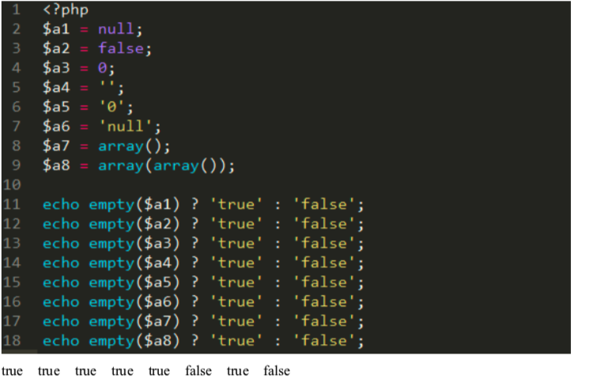


11、

sort — 对数组排序，索引会由0到n-1重新编号。

asort — 对数组值进行正向排序并保持键的索引关系。

ksort — 对数组按照键名排序，适用于对索引键排序的关联数组。

arsort — 对数组值进行逆向排序并保持键的索引关系。

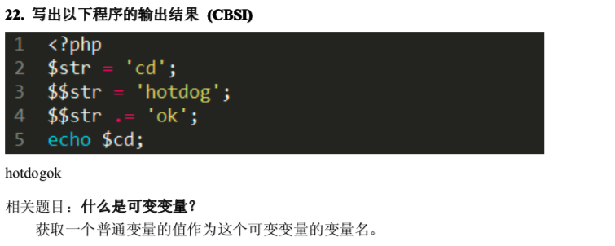

12、

count — 计算数组中的单元数目，或对象中的属性个数，通常是一个array，如果参数既不是数组，也不是实现 `Countable` 接口的对象，将返回 `1`。 有个例外：如果 `array_or_countable` 是 **`null`** 则结果是 `0`。

```php
echo count("abc"); // 1
echo count(null); // 0
echo count(false); // 1
echo count(strlen("https://wwxiong.com")); // 1
```

13、写个函数用来对二维数组排序。

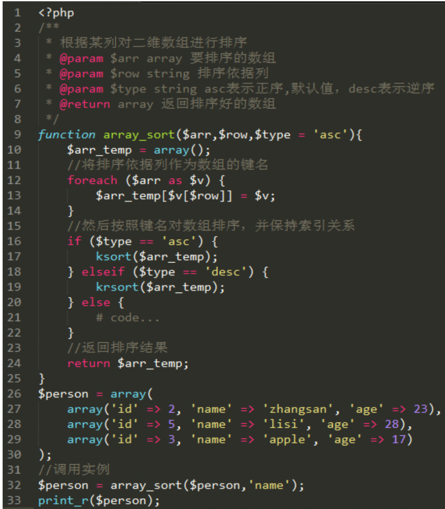

14、写五个不同的函数，来获取一个全路径文件的扩展名，允许封装PHP中已有的函数。

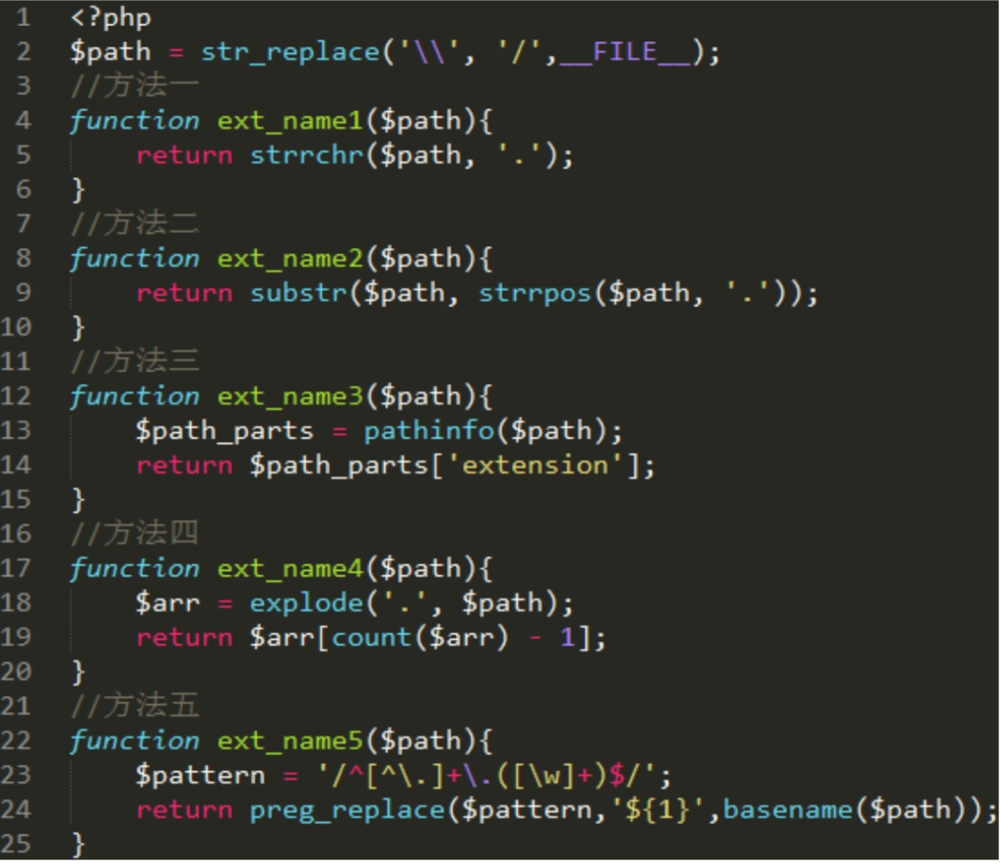

```php
str_replace — 子字符串替换
str_replace ( mixed $search , mixed $replace , mixed $subject , int &$count = ? ) : mixed
  
strrchr — 查找指定字符在字符串中的最后一次出现。该函数返回 haystack 字符串中的一部分，这部分以 needle 的最后出现位置开始，直到 haystack 末尾。
strrchr ( string $haystack , mixed $needle ) : string  

strstr — 查找字符串的首次出现，返回 haystack 字符串从 needle 第一次出现的位置开始到 haystack 结尾的字符串。
strstr ( string $haystack , mixed $needle , bool $before_needle = false ) : string
  
strrpos — 计算指定字符串在目标字符串中最后一次出现的位置,返回字符串 haystack 中 needle 最后一次出现的数字位置。
strrpos ( string $haystack , string $needle , int $offset = 0 ) : int
  
substr — 返回字符串的子串。返回字符串 string 由 start 和 length 参数指定的子字符串。
substr ( string $string , int $start , int $length = ? ) : string
  
pathinfo — 返回文件路径的信息，返回一个关联数组包含有 path 的信息。返回关联数组还是字符串取决于 options。
pathinfo ( string $path , int $options = PATHINFO_DIRNAME | PATHINFO_BASENAME | PATHINFO_EXTENSION | PATHINFO_FILENAME ) : mixed
  
basename — 返回路径中的文件名部分,给出一个包含有指向一个文件的全路径的字符串，本函数返回基本的文件名。
basename ( string $path , string $suffix = ? ) : string
```

```php
<?php
$foo = "0123456789a123456789b123456789c";
var_dump(strrpos($foo, '7', -5));  // 从尾部第 5 个位置开始查找 // 结果: int(17)
var_dump(strrpos($foo, '7', 20));  // 从第 20 个位置开始查找 // 结果: int(27)
var_dump(strrpos($foo, '7', 28));  // 结果: bool(false)
?>
```

```php
<?php
$path_parts = pathinfo('/www/htdocs/inc/lib.inc.php');
echo $path_parts['dirname'], "\n"; // /www/htdocs/inc
echo $path_parts['basename'], "\n"; // lib.inc.php
echo $path_parts['extension'], "\n"; // php
echo $path_parts['filename'], "\n"; // lib.inc
?>
```

```php
<?php
$email  = 'name@example.com';
$domain = strstr($email, '@');
echo $domain; // 打印 @example.com

$user = strstr($email, '@', true); // 从 PHP 5.3.0 起
echo $user; // 打印 name
?>
```

15、

```php
strcasecmp — 二进制安全比较字符串（不区分大小写）,如果 str1 小于 str2 返回 < 0； 如果 str1 大于 str2 返回 > 0；如果两者相等，返回 0。
strcasecmp ( string $str1 , string $str2 ) : int
  
strcmp — 二进制安全字符串比较，注意该比较区分大小写。
strcmp ( string $str1 , string $str2 ) : int

in_array — 检查数组中是否存在某个值，在（haystack）中搜索（ needle），如果没有设置 strict 则使用宽松的比较。
in_array ( mixed $needle , array $haystack , bool $strict = false ) : bool
```


16、

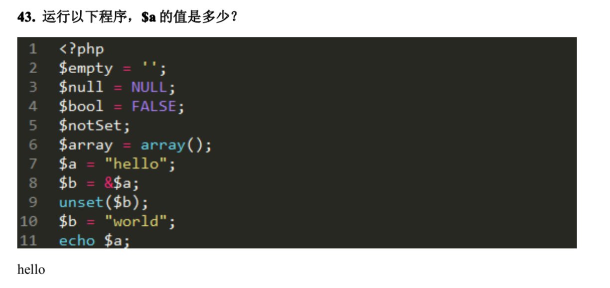

17、

```php
array_map — Applies the callback to the elements of the given arrays
```

```php
<?php
function cube($n){
    return ($n * $n * $n);
}

$a = [1, 2, 3, 4, 5];
$b = array_map('cube', $a);
print_r($b);
?>
  
```

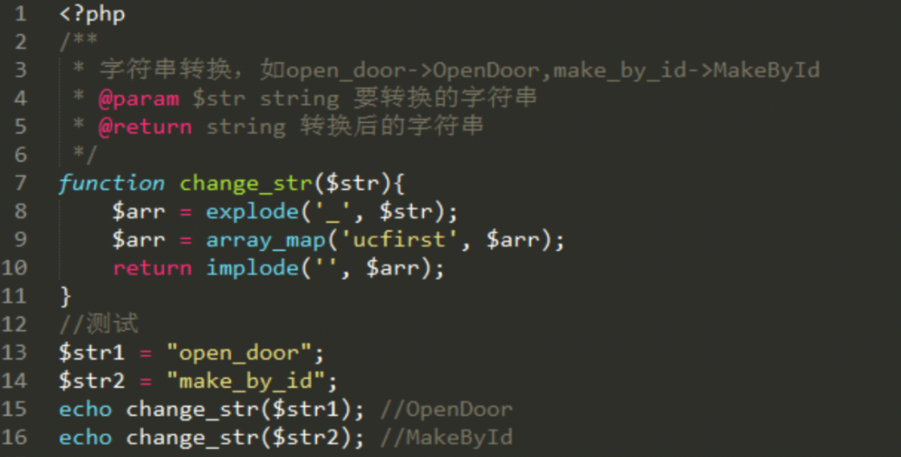


18、数组处理。

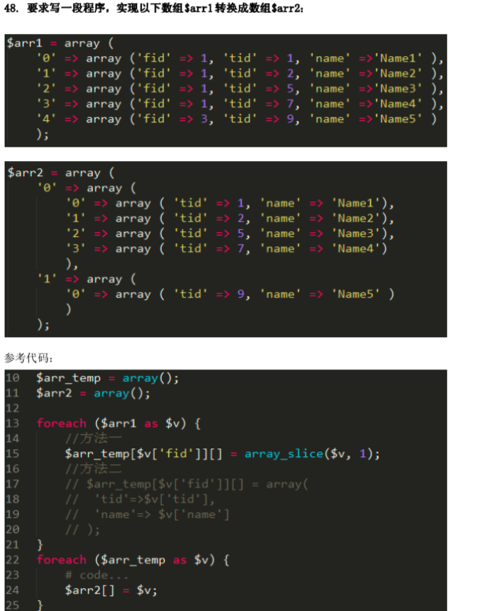


```java
array_slice — 从数组中取出一段，array_slice() 返回根据 offset 和 length 参数所指定的 array 数组中的一段序列。
array_slice ( array $array , int $offset , int $length = null , bool $preserve_keys = false ) : array
```

19、max — Find highest value。

```php
max ( mixed $value , mixed ...$values ) : mixed
```

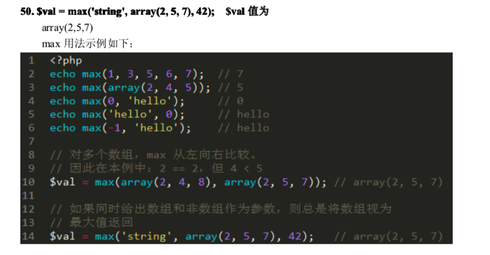

20、PHP的比较运算符。


```php
0 == false: bool(true)
0 === false: bool(false)

0 == null: bool(true)
0 === null: bool(false)

false == null: bool(true)
false === null: bool(false)

"0" == false: bool(true)
"0" === false: bool(false)

"0" == null: bool(false)
"0" === null: bool(false)

"" == false: bool(true)
"" === false: bool(false)

"" == null: bool(true)
"" == null: bool(false)
```


21、unset — 释放给定的变量。

如果在函数中 unset() 一个通过引用传递的变量，则只是局部变量被销毁，而在调用环境中的变量将保持调用 unset() 之前一样的值。

```php
<?php
function foo(&$bar) {
    unset($bar);
    $bar = "blah";
}

$bar = 'something';
echo "$bar\n"; // something

foo($bar);
echo "$bar\n"; // something
?>
```


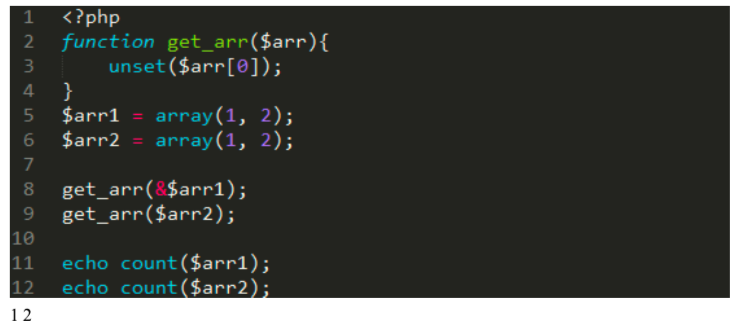

22、局部变量和全局变量。

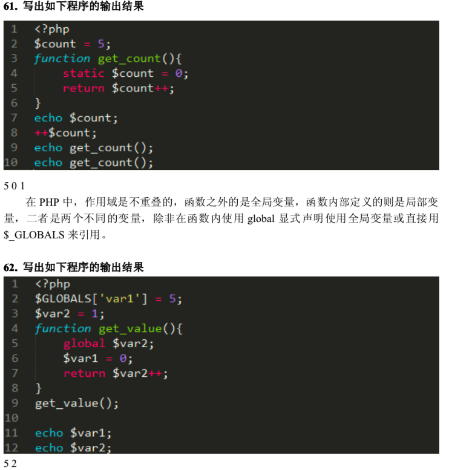

23、


24、常用的字符串函数。

```php
strstr — 查找字符串的首次出现，返回 haystack 字符串从 needle 第一次出现的位置开始到 haystack 结尾的字符串。before_needle 若为 true，strstr() 将返回 needle 在 haystack 中的位置之前的部分。
strstr ( string $haystack , mixed $needle , bool $before_needle = false ) : string  
```

```php
<?php
$email  = 'name@example.com';
$domain = strstr($email, '@');
echo $domain; // 打印 @example.com

$user = strstr($email, '@', true); // 从 PHP 5.3.0 起
echo $user; // 打印 name
?>
```


25、PHP全局环境变量。

```php
$GLOBALS — 引用全局作用域中可用的全部变量
$_SERVER — 服务器和执行环境信息
$_GET — HTTP GET 变量
$_POST — HTTP POST 变量
$_FILES — HTTP 文件上传变量
$_REQUEST — HTTP Request 变量
$_SESSION — Session 变量
$_ENV — 环境变量
$_COOKIE — HTTP Cookies
```


# Redis 

* `Redis Setnx`（`SET if Not eXists`） 命令在指定的 key 不存在时，为 key 设置指定的值。如果不存在设置成功返回1，如果存在不覆盖，设置失败返回0。


#   Git 

## 命令大全

```java
git fetch // 从远程获取最新版本到本地，不会merge（合并）
git pull // 从远程获取最新版本并 merge（合并）到本地，等同于 git fetch + git merge
git checkout -- <file>... // 撤销本地文件的所有修改 （清理工作区文件）discard changes in working directory
git reset HEAD <file>  // 撤销上一次向暂存区添加的某个指定文件，不影响工作区中的该文件 unstage(暂存区到工作区)
git reset --hard // 同时撤销暂存区和工作区的修改，恢复到上一次提交的状态 等同于 git reset --hard HEAD
git reset  // 撤销上一次向暂存区添加的所有文件
git clean -f // 批量删除branch中新加的文件(untracked files)
  
```

## 错误解决

问题1:

> ➜  mall git:(master) git pull  
> error: You have not concluded your merge (MERGE_HEAD exists).
> hint: Please, commit your changes before merging.
> fatal: Exiting because of unfinished merge.

解决：你还没有完成合并。有可能是之前 `pull `过代码，自动合并失败，有两种解决方法。

解决方法一：如果需要保留本地的更改，中止合并->重新合并->重新拉取。

```java
$:git merge --abort
$:git reset --merge
$:git pull
```

解决方法二：舍弃本地代码，远程版本覆盖本地版本（慎用）。

```java
$:git fetch --all
$:git reset --hard origin/master
$:git fetch
```

问题2：

> [root@hexin-c11-168 h5-web]# git pull
> remote: Enumerating objects: 131, done.
> remote: Counting objects: 100% (131/131), done.
> remote: Compressing objects: 100% (95/95), done.
> fatal: Unable to create temporary file '/export/data/tomcat/mall/h5-web/.git/objects/pack/tmp_pack_XXXXXX': No space left on device
> fatal: index-pack failed

解决：`No space left on device`，磁盘空间满了，清除无用的大文件数据。

问题3：

> ➜  sudo git clone git@github.com:xxx/TechDoc.git
> Password:
> Cloning into 'TechDoc'...
> git@github.com: Permission denied (publickey).
> fatal: Could not read from remote repository.
>
> Please make sure you have the correct access rights
> and the repository exists.

解决：

> ➜  ssh-agent -s
> SSH_AUTH_SOCK=/var/folders/t0/gpltt0xd32gbs9wr5bgd8w0000gn/T//ssh-Sp0knrn8EXwq/agent.4949; export SSH_AUTH_SOCK;
> SSH_AGENT_PID=4950; export SSH_AGENT_PID;
> echo Agent pid 4950;
> ➜  ssh-add ~/.ssh/id_rsa
> Identity added: /Users/wangxiong/.ssh/id_rsa ()


#  Docker 

## 常用命令

```dockerfile
# 列出本机所有容器，包括终止运行的容器
docker ps -a
# 进入容器终端并且的保留为容器终端的输入形式
docker exec -it cda2919d4813 /bin/bash
# 列出镜像列表
docker images
# 获取新的镜像
docker pull ubuntu:13.10
# 删除镜像文件
docker image rm [imageName]
# 使用镜像运行容器
docker run -t -i ubuntu:13.10 /bin/bash
# 删除容器
docker rm 76f1912f92ac
```


# LINUX 

* `netstat -tunlp`  用于显示 `tcp`，`udp` 的端口和进程等相关情况。
* `lsof（list open files） -i`  用于列出当前系统打开文件的工具。
* `ps（Process Status） -aux | grep xxx` 查看系统的进程状态。
* `cat /etc/redhat-release && cat /etc/lsb-release` 查看系统及其版本信息。
* `service iptables status` 查看`Centos 6.x`版本 `iptables`防火墙状态。
* `firewall-cmd --state` 查看`Centos 7.x`版本 `firewall`防火墙状态。
* `kill -signal pid`：`kill -9` 发送`SIGKILL`信号给进程，告诉进程，你被终结了，请立刻退出。


## SCP

```
scp /Users/hexindai/workspace/hexin-ashes/hexin-search-api/target/hexin-search-api.war root@172.20.10.xx:/export/data/tomcatRoot/javasearch.hexindai.com/
```


## top

作用：显示当前系统正在执行的进程的相关信息，包括进程`ID`、内存占用率、`CPU`占用率等。
英文：The top program provides a dynamic real-time view of a running system.
参数：

| 参数       | 说明             |
| ---------- | ---------------- |
| -b         | 批处理           |
| -c         | 显示完整的治命令 |
| -I         | 忽略失效过程     |
| -s         | 保密模式         |
| -S         | 累积模式         |
| -i<时间>   | 设置间隔时间     |
| -u<用户名> | 指定用户名       |
| -p<进程号> | 指定进程         |
| -n<次数>   | 循环显示的次数   |

实例1：显示当前进程信息。

```linux
[root@iZrj9hb9k9jtcpp85t8ryeZ ~]# top
top - 16:55:44 up 70 days, 22:39, 2 users, load average: 0.29, 0.10, 0.07
Tasks: 83 total, 1 running, 82 sleeping, 0 stopped, 0 zombie
%Cpu(s): 0.3 us, 0.3 sy, 0.0 ni, 99.3 id, 0.0 wa, 0.0 hi, 0.0 si, 0.0 st
KiB Mem : 1016164 total, 142848 free, 216332 used, 656984 buff/cache
KiB Swap: 1048572 total, 881460 free, 167112 used. 594816 avail Mem
PID USER PR NI VIRT RES SHR S %CPU %MEM TIME+ COMMAND
4343 root 20 0 424948 14220 3016 S 0.3 1.4 72:41.60 docker-containe
10620 root 20 0 132656 11972 9068 S 0.3 1.2 90:20.35 AliYunDun
24045 root 20 0 154600 5524 4212 S 0.3 0.5 0:00.02 sshd
1 root 20 0 199092 2804 1480 S 0.0 0.3 13:01.77 systemd
```

第一行：系统运行信息，同`uptime`命令的执行结果，详细说明如下：

| 参数                           | 说明                                               |
| ------------------------------ | -------------------------------------------------- |
| 16:55:44                       | 当前系统时间                                       |
| up 70 days, 22:39              | 当前系统已经运行的时间为70天22小时39分钟（未重启） |
| 2 users                        | 当前有两个用户登录系统                             |
| load average: 0.29, 0.10, 0.07 | 1分钟、5分钟、15分钟的负载情况为0.29,0.10,0.07     |

> 注：`load average`数据是每隔5秒钟检查一次活跃的进程数，然后按特定算法计算出的数值。如果这个数除以逻辑`CPU`的数量，结果高于5的时候就表明系统在超负荷运转了。

第二行：`Tasks` — 任务（进程），具体信息说明如下：

| 参数        | 说明               |
| ----------- | ------------------ |
| 83 total    | 系统总进程数量83个 |
| 1 running   | 处于运行状态1个    |
| 82 sleeping | 处于睡眠状态82个   |
| 0 stopped   | 处于停止状态0个    |
| 0 zombie    | 处于僵尸状态0个    |

第三行：`cpu`状态信息，具体属性说明如下：

| 参数    | 说明                                     |
| ------- | ---------------------------------------- |
| 0.3 us  | 用户空间占比，0.3%                       |
| 0.3 sy  | 内核空间占比，0.3%                       |
| 0.0 ni  | 改变过优先级的进程CPU占比，0.0%          |
| 99.3 id | 空闲CPU占比，99.3%                       |
| 0.0 wa  | IO等待CPU占比，0.00%                     |
| 0.0 hi  | 硬中断（Hardware IRQ）占比，0.00%        |
| 0.0 si  | 软中断（Software Interrupts）占比，0.00% |
| 0.0 st  | 占比，0.00%                              |

第四行：内存状态统计，具体信息如下：

| 参数              | 说明                      |
| ----------------- | ------------------------- |
| 1016164 total     | 物理总内存量（1G）        |
| 142848 free       | 空闲内存量（0.13G）       |
| 216332 used       | 使用中的内存总量（0.25G） |
| 656984 buff/cache | 缓存的内存量（0.62G）     |

第五行：`swap`交换分区信息，具体信息说明如下：

| 参数          | 说明                      |
| ------------- | ------------------------- |
| 1048572 total | 交换区总量（1G）          |
| 881460 free   | 空闲的交换区总量（0.80G） |
| 167112 used   | 使用的交换区总量（0.20G） |

第六行：空行

第七行：各进程（任务）的状态监控，项目列信息说明如下：

| 列名称   | 说明                                                         |
| -------- | ------------------------------------------------------------ |
| PID      | 进程id                                                       |
| USER     | 进程所有者                                                   |
| PR       | 进程优先级                                                   |
| NI(NICE) | 负值表示高优先级，正值表示低优先级。                         |
| VIRT     | 进程使用的虚拟内存总量，单位kb。VIRT=SWAP+RES                |
| RES      | 进程使用的、未被换出的物理内存大小，单位kb。RES=CODE+DATA    |
| SHR      | 共享内存大小，单位kb。                                       |
| S        | 进程状态。D=不可中断的睡眠状态 R=运行 S=睡眠 T=跟踪/停止 Z=僵尸进程 |
| %CPU     | 上次更新到现在的CPU时间占用百分比。                          |
| %MEM     | 进程使用的物理内存百分比。                                   |
| TIME     | 进程使用的CPU时间总计，单位1/100秒。                         |
| COMMAND  | 进程名称（命令名/命令行）。                                  |

## netstat

作用：用来打印`Linux`中网络系统的状态信息，获取整个`Linux`系统的网络情况。

英文：`network statistics`, Print network connections, routing tables, interface statistics, masquerade connections, and multicast memberships.

选项：

| 选项 | 说明       | 作用                                       |
| ---- | ---------- | ------------------------------------------ |
| -a   | --all      | 显示所有连线中的Socket。                   |
| -t   | --tcp      | 显示TCP传输协议的连线状况。                |
| -u   | --udp      | 显示UDP传输协议的连线状况。                |
| -n   | --numeric  | 直接使用ip地址，而不通过域名服务器。       |
| -p   | --programs | 显示正在使用Socket的程序识别码和程序名称。 |
| -l   | -listening | 显示监控中的服务器的Socket。               |
| -e   | --extend   | 显示网络其他相关信息。                     |

实例1：禁用反向域名解析,只列出 TCP 或 UDP 协议的连接。

```linux
[root@wx /]# netstat -antu
Proto Recv-Q Send-Q Local Address Foreign Address State
tcp 0 0 0.0.0.0:80 0.0.0.0:* LISTEN
udp 0 0 0.0.0.0:68 0.0.0.0:*
```

实例2：只列出监听中的`nginx`连接，要求获取进程名(-p)、进程号(-p)以及用户 ID(-e)。

```linux
[root@wx /]# netstat -lnept | grep nginx
tcp 0 0 0.0.0.0:80 0.0.0.0:* LISTEN 0 30270 13332/nginx: master
```

实例3：查看端口占用情况（redis-6379，mysql-3306）

```linux
[root@wx /]# netstat -tunpl | grep 3306
tcp6 0 0 :::3306 :::* LISTEN 22311/mysqld
```

实例4：

```powershell
[root@wangxiong domains]# netstat -tunlp
Active Internet connections (only servers)
Proto Recv-Q Send-Q Local Address           Foreign Address         State       PID/Program name    
tcp        0      0 127.0.0.1:9000          0.0.0.0:*               LISTEN      31377/php-fpm: mast 
```

实例5：

```shell
[root@hexin-c11-168 domains]# netstat -tunlp | grep java
tcp6       0      0 :::8085                 :::*                    LISTEN      22301/java          
tcp6       0      0 :::8086                 :::*                    LISTEN      22289/java          
tcp6       0      0 :::8992                 :::*                    LISTEN      4433/java
```

## lsof

`lsof(list open files)`是一个列出当前系统打开文件的工具。

`lsof `查看端口占用语法格式：

```shell
lsof -i:端口号
```

使用`-i:port`来显示与指定端口相关的网络信息：
```powershell
[root@wangxiong ~]# lsof -i:8088
COMMAND   PID  USER   FD   TYPE    DEVICE SIZE/OFF NODE NAME
nginx   30357 admin   25u  IPv4 198359762      0t0  TCP *:radan-http (LISTEN)
nginx   30358 admin   25u  IPv4 198359762      0t0  TCP *:radan-http (LISTEN)
```

通过在`-i`后提供对应的协议来仅仅显示`TCP`或者`UDP`连接信息：

```php
[root@wangxiong ~]# lsof -iTCP
COMMAND     PID  USER   FD   TYPE    DEVICE SIZE/OFF NODE NAME
systemd       1  root   49u  IPv4     22610      0t0  TCP *:sunrpc (LISTEN)
systemd       1  root   54u  IPv6     22612      0t0  TCP *:sunrpc (LISTEN)
```

## ps

作用：显示当前系统中进程的快照。也就是说，该命令能捕获系统在某一事件的进程状态。
英文：`processes snapshot`,report a snapshot of the current processes.

选项：

| 选项 | 说明                   | 作用                         |
| ---- | ---------------------- | ---------------------------- |
| a    | all                    | 显示所有进程                 |
| -a   | -all                   | 显示同一终端下的所有进程     |
| -A   | Identical to -e.       | 显示所有进程                 |
| -e   | Identical to -A.       | Select all processes.        |
| f    | Do full-format listing | 显示程序之间的关系           |
| u    | userlist               | 指定用户的所有进程           |
| -au  |                        | 显示本用户的详细信息         |
| -aux |                        | 显示所有包含其他使用者的行程 |

实例1：使用`cpu`和内存升序排序来过滤进程，并通过管道显示前10个结果。

```linux
[root@wx /]# ps -aux --sort -pcpu,-pmem | head -n 10
USER PID %CPU %MEM VSZ RSS TTY STAT START TIME COMMAND
root 10620 0.2 1.1 132656 11968 ? Ssl 9月12 89:52 /usr/local/aegis/aegis_client/aegis_10_51/AliYunDun
root 25 0.1 0.0 0 0 ? S 7月24 147:03 [kswapd0]
```

实例2：使用`PS`实时监控进程状态（动态显示，每秒刷新一次）

```linux
[root@wx /]# watch -n 1 'ps -aux --sort -pcpu,-pmem | head -n 10'
```

实例3：查找特定进程的信息

```linux
[root@wx /]# ps -ef | grep nginx
[root@wx /]# ps -aux|grep nginx
```

## tar

先来弄清两个基础概念：打包和压缩。
打包：是指将一大堆文件或目录变成一个总的文件。
压缩：则是将一个大的文件通过一些压缩算法变成一个小文件。

`tar`命令可以为`linux`的文件和目录创建档案。利用`tar`，可以为某一特定文件创建档案（备份文件），也可以在档案中改变文件，或者向档案中加入新的文件。

语法：

```
tar(选项)(参数)
```

选项：

| 选项 | 说明                   | 作用                       |
| ---- | ---------------------- | -------------------------- |
| -x   | --extract(提取)或--get | 从备份文件中还原文件。     |
| -z   | --gzip或--ungzip       | 通过gzip指令处理备份文件。 |
| -v   | --verbose(详细)        | 显示指令执行过程。         |
| -f   | --file                 | 指定备份文件。             |
| -c   | --create               | 建立新的备份文件。         |
| -t   | --list                 | 列出备份文件的内容。       |

应用1：以 `gzip` 压缩打包`file`文件夹并命名为`file.tar.gz`（显示打包详细过程）。

```linux
[root@wx wdata] tar -czvf file.tar.gz file
```

应用2：解压`file.tar.gz`包并命名为`file`（显示解压详细过程）

```linux
[root@wx wdata] tar -xzvf file.tar.gz file
```

应用3：显示`file.tar.gz`包中的内容。

```linux
[root@wx wdata] tar -tzvf file.tar.gz
```


## find

实例1：查找超过10MB的所有`.mp3`文件，并使用一个命令删除它们 。

```linux
[root@wx /]# find / -type f -name "*.mp3" -size +10M -exec rm {} \;
```


实例2：查找当前目录下所有目录名为`CVS`的子目录的命令。

```linux
[root@wx /]# find ./CVS -maxdepth 1 -type d -print
```


## df

作用：用于显示磁盘空间使用情况。
英文：`disk free`,report file system disk space usage.

| 选项 | 说明             | 作用                 |
| ---- | ---------------- | -------------------- |
| -T   | --print-type     | 显示文件系统的形式。 |
| -h   | --human-readable | 使用人类可读的格式。 |

```linux
[root@wx server]# df -Th
文件系统 类型 容量 已用 可用 已用% 挂载点
/dev/vda1 ext4 40G 7.4G 30G 20% /
devtmpfs devtmpfs 487M 0 487M 0% /dev
tmpfs tmpfs 497M 0 497M 0% /dev/shm
tmpfs tmpfs 497M 644K 496M 1% /run
```

## du

作用：用于显示目录或文件的大小。
英文：`disk usage`,estimate file space usage.

| 选项 | 说明             | 作用                                |
| ---- | ---------------- | ----------------------------------- |
| -s   | --summarize      | 仅显示总计。                        |
| -h   | --human-readable | 以K，M，G为单位，提高信息的可读性。 |

```linux
[root@wx server]# du -sh ./*
108K    ./package.xml
165M    ./php7
8.5M    ./redis-4.0.11
1.7M    ./redis-4.0.11.tar.gz
8.9M    ./xdebug-2.6.1
```

## 系统版本

命令1：

```shell
[root@wangxiong ~]# cat /etc/redhat-release && cat /etc/lsb-release
CentOS Linux release 7.6.1810 (Core) 
cat: /etc/lsb-release: No such file or directory
```

> 如果能确定系统是Redhat或Centos：使用cat  /etc/redhat-release 这个文件。
>
> 如果能确定系统是Ubuntu : 使用/etc/lsb-release 这个文件。

命令2：

```powershell
[root@wangxiong ~]# yum -help && apt-get -help
Usage: yum [options] COMMAND
-bash: apt-get: command not found
```

> 出现 yum 的就是 Centos ；出现 apt-get 的就是 Ubuntu。
>

命令3：

```powershell
[root@wangxiong ~]# cat /etc/issue
\S
Kernel \r on an \m
```

> 出现 Ubuntu 字样为 Ubuntu，没有则是 Centos。
>

## 防火墙

`Centos 6.x`版本 `iptables`：

```powershell
// 查看防火墙，iptables: Firewall is not running. 说明防火墙没有开启。
[root@centos6 ~]# service iptables status  
// 开启防火墙
[root@centos6 ~]# service iptables start
// 关闭防火墙
[root@centos6 ~]# service iptables stop
```

`Centos 7.x`版本 `firewalld`：

> `CentOS7` 默认使用`firewalld`防火墙。如果想换回`iptables`防火墙，可关闭`firewalld`并安装`iptables`。

```powershell
// 查看firewall（关闭后显示not running，开启后显示running）
[root@centos7 ~]# firewall-cmd --state 
// 关闭firewall
[root@centos7 ~]# systemctl stop firewalld.service
// 开启firewalld
[root@centos7 ~]# systemctl start firewalld.service
// 禁止firewall开机启动
[root@centos7 ~]# systemctl disable firewalld.service
// 设置firewall开机启动
[root@wangxiong ~]# systemctl enable iptables.service
// 重启firewall使配置生效
[root@wangxiong ~]# systemctl restart iptables.service
```


# SHELL

* `nohup`：不挂断运行。

* `&`：在后台运行。

* `#!/bin/bash`：定义使用`bash`解释器来解释脚本。

* `#!/bin/sh`：定义使用`sh`解释器来解释脚本。

* `grep -v grep`：去除包含`grep`的进程行。

  ```shell
  [root@wangxiong mall] # grep --help
  -v, --invert-match        select non-matching lines
  [root@wangxiong mall]# ps aux | grep 8080
  root      1363  0.1  0.8 958080 145456 ?       Ssl  Sep15  74:33 minio server /data
  root     17798  0.0  0.0 110272   904 pts/0    S+   15:20   0:00 grep --color=auto 8080
  [root@wangxiong mall]# ps aux | grep  8080 | grep -v grep
  root      1363  0.1  0.8 958080 145456 ?       Ssl  Sep15  74:33 minio server /data
  ```

* `[ -n "$a" ] `： 判断参数是否赋值。

```shell
# 判断a这个参数是否赋值，因为没赋值，所以返回flase
if [ -n "$a" ] 
then
    echo true
else
    echo false
fi
```


```shell
#!/bin/bash

# Profile
profile=dev

# jar 包路径
jarPath=/export/data/tomcatRoot/mall

cd ${jarPath}

# PORTAL
portalPackage=portal-1.0-SNAPSHOT

portalPid=`ps aux | grep ${portalPackage} | grep -v grep | awk '{print $2}'`
if [ -n "$portalPid" ]; then
        kill -9 $portalPid;
fi

nohup java -jar -Dspring.profiles.active=${profile} ${jarPath}/mall-${portalPackage}.jar >> portal.out 2>&1 &
```


# NGINX

## 反向代理

配置 `nginx` 反向代理：

```nginx
server {
     listen          8088;
     location / {
         root  /export/admin/dist/;
         index index.html;
     }
 }

server{
    listen 80;
    server_name wwxiong.com;

    charset utf-8;

    location / {
        proxy_pass         http://127.0.0.1:8088;
        proxy_set_header   Host             $host;
        proxy_set_header   X-Real-IP        $remote_addr;
        proxy_set_header   X-Forwarded-For  $proxy_add_x_forwarded_for;
        proxy_http_version 1.1;
        proxy_set_header Connection "upgrade";
                proxy_set_header Upgrade $http_upgrade;
                proxy_read_timeout 120s;
    }

    location = /favicon.ico {
        log_not_found off;
        access_log off;
    }
}
```

# 设计模式

## 工厂模式

## 单例模式

## 观察者模式

## 策略模式

## 适配器模式

## 注册树模式


# PHP

`PHP`版本切换：

```java

# 使用brew安装php多版本
brew install php56
brew install php70
# 安装切换工具
brew install php-version
source $(brew --prefix php-version)/php-version.sh 
# 查看当前安装的所有版本
php-version
# 切换版本
php-version 5.6.5  
```

## PHP的运行原理

请简述`CGI`、`FastCGI` 和`PHP-FPM`的区别。

> CGI 是通用网关协议，FastCGI 则是一种常驻进程的 CGI 模式程序，而 PHP-FPM 更像是管理器，用于管理FastCGI 进程。

`CGI`：通用网关接口（`Common Gateway Interface`），是`Web` 服务器和请求处理程序之间传输数据的一种标准或协议，只要遵循这个标准就可以用任何动态语言实现处理程序。`CGI`可以用任何一种语言编写，只要这种语言具有标准输入、输出和环境变量。如`php`、`perl`、`tcl`等。

`FastCGI`：`FastCGI` 是一个常驻(`long-live`)型的`CGI`，需要单独启动，启动`FastCGI`后，会生成一个`FastCGI`主进程和多个子进程（子进程其实就是`CGI`解释器进程），它可以一直执行着，只要激活后，不会每次都要花费时间去`fork`一次(这是`CGI`最为人诟病的`fork-and-execute`模式)。

`PHP-FPM`：`PHP FastCGI Process Manager`是 `PHP` 针对 `FastCGI` 协议的具体实现，它会通过用户配置来管理一批`FastCGI`进程。提供了更好的`PHP`进程管理方式，可以有效控制内存和进程、可以平滑重载`PHP`配置等。`PHP-FPM`更像是管理器，而真正衔接`Nginx`与`PHP`的则是`FastCGI`进程。


请简述针对一千万个中国居民身份证去重的方案？


## PHP 基础

### 运算符

#### 错误运算符


#### 运算符优先级

| 结合方向 | 运算符                                                       | 附加信息                                                     |
| :------- | :----------------------------------------------------------- | :----------------------------------------------------------- |
| 无       | clone new                                                    | [clone](https://www.php.net/manual/zh/language.oop5.cloning.php) 和 [new](https://www.php.net/manual/zh/language.oop5.basic.php#language.oop5.basic.new) |
| 右       | `**`                                                         | [算术运算符](https://www.php.net/manual/zh/language.operators.arithmetic.php) |
| 右       | `++` `--` `~` `(int)` `(float)` `(string)` `(array)` `(object)` `(bool)` `@` | [类型](https://www.php.net/manual/zh/language.types.php)、[递增／递减](https://www.php.net/manual/zh/language.operators.increment.php)、[错误控制](https://www.php.net/manual/zh/language.operators.errorcontrol.php) |
| 无       | `instanceof`                                                 | [类型](https://www.php.net/manual/zh/language.types.php)     |
| 右       | `!`                                                          | [逻辑运算符](https://www.php.net/manual/zh/language.operators.logical.php) |
| 左       | `*` `/` `%`                                                  | [算术运算符](https://www.php.net/manual/zh/language.operators.arithmetic.php) |
| 左       | `+` `-` `.`                                                  | [算术运算符](https://www.php.net/manual/zh/language.operators.arithmetic.php) 和 [字符串运算符](https://www.php.net/manual/zh/language.operators.string.php) |
| 左       | `<<` `>>`                                                    | [位运算符](https://www.php.net/manual/zh/language.operators.bitwise.php) |
| 无       | `<` `<=` `>` `>=`                                            | [比较运算符](https://www.php.net/manual/zh/language.operators.comparison.php) |
| 无       | `==` `!=` `===` `!==` `<>` `<=>`                             | [比较运算符](https://www.php.net/manual/zh/language.operators.comparison.php) |
| 左       | `&`                                                          | [位运算符](https://www.php.net/manual/zh/language.operators.bitwise.php) 和 [引用](https://www.php.net/manual/zh/language.references.php) |
| 左       | `^`                                                          | [位运算符](https://www.php.net/manual/zh/language.operators.bitwise.php) |
| 左       | `|`                                                          | [位运算符](https://www.php.net/manual/zh/language.operators.bitwise.php) |
| 左       | `&&`                                                         | [逻辑运算符](https://www.php.net/manual/zh/language.operators.logical.php) |
| 左       | `||`                                                         | [逻辑运算符](https://www.php.net/manual/zh/language.operators.logical.php) |
| 右       | `??`                                                         | [null 合并运算符](https://www.php.net/manual/zh/language.operators.comparison.php#language.operators.comparison.coalesce) |
| 左       | `? :`                                                        | [三元运算符](https://www.php.net/manual/zh/language.operators.comparison.php#language.operators.comparison.ternary) |
| 右       | `=` `+=` `-=` `*=` `**=` `/=` `.=` `%=` `&=` `|=` `^=` `<<=` `>>=` | [赋值运算符](https://www.php.net/manual/zh/language.operators.assignment.php) |
| 右       | `yield from`                                                 | [yield from](https://www.php.net/manual/zh/language.generators.syntax.php#control-structures.yield.from) |
| 右       | `yield`                                                      | [yield](https://www.php.net/manual/zh/language.generators.syntax.php#control-structures.yield) |
| 左       | `and`                                                        | [逻辑运算符](https://www.php.net/manual/zh/language.operators.logical.php) |
| 左       | `xor`                                                        | [逻辑运算符](https://www.php.net/manual/zh/language.operators.logical.php) |
| 左       | `or`                                                         | [逻辑运算符](https://www.php.net/manual/zh/language.operators.logical.php) |

基本运算符的优先级：

> 递增/递减（`++`、`--`） >  `!`（逻辑运算符）> `*` `/` `%` `+` `-` (算术运算符) > `<` `<=` `>` `>=` `==` `!=` `===` `!==` `<>` `<=>`(比较运算符) > `&` （引用运算符） > `^` `|`(位运算符) > `&&` `||`（逻辑运算符） >  `? :`（三目运算符）> `=` `+=` `-=` `*=` `**=` `/=` `.=` `%=` `&=` `|=` `^=` `<<=` `>>=` （赋值运算符） > `and` > `xor` > `or`。


经典示例（必须掌握）：

`<` `<=` `>` `>=` `==` `!=` `===` `!==` `<>` `<=>`(比较运算符)  >  `&&` `||`（逻辑运算符） > `=` `+=` `-=` `*=` `**=` `/=` `.=` `%=` `&=` `|=` `^=` `<<=` `>>=` （赋值运算符）。

```php
$a = 0;
$b = 0;
if($a = 3 > 0 || $b = 3 > 0)
{
    $a++;
    $b++;
    echo $a."\n"; // 1
    echo $b."\n"; // 1
}
```

示例1：

* [算术运算符](https://www.php.net/manual/zh/language.operators.arithmetic.php)的结合方向从左向右，优先级顺序（`*` `/` `%` `+` `-` ）。
* [三元运算符](https://www.php.net/manual/zh/language.operators.comparison.php#language.operators.comparison.ternary)的结合方向从左向右。
* [赋值运算符](https://www.php.net/manual/zh/language.operators.assignment.php)的结合方向从右向左，优先级顺序（`=` `+=` `-=` `*=` `**=` `/=` `.=` `%=` `&=` `|=` `^=` `<<=` `>>=`）

```php
$a = 3 * 3 % 5; // (3 * 3) % 5 = 4
echo $a;
$a = true ? 0 : true ? 1 : 2; // (true ? 0 : true) ? 1 : 2 = 2
echo $a;

$a = 1;
$b = 2;
$a = $b += 3; // $a = ($b += 3) -> $a = 5, $b = 5
echo $a;
```

示例2：

* 递增递减（`++`、`--`）的优先级高于算术运算符（`*` `/` `%` `+` `-`）高于赋值运算符（`=` `+=` `-=` `*=` `**=` `/=` `.=`）。

```php
$a = 1;
echo $a + $a++; // 3

$i = 1;
$array[$i] = $i++;
echo $i; // 2
```

示例3：

* **`+`、`-` 、`.` 具有相同的优先级**，结合方向从左向右。

```php
$x = 4;
// Warning: A non-numeric value encountered -1, or so I hope
echo "x minus one equals " . $x-1 . ", or so I hope\n";  
// -1, or so I hope
echo (("x minus one equals " . $x) - 1) . ", or so I hope\n"; 
// x minus one equals 3, or so I hope
echo "x minus one equals " . ($x-1) . ", or so I hope\n"; 
```

示例4：

* [逻辑运算符](https://www.php.net/manual/zh/language.operators.logical.php)的结合顺序除了`!`是从右向左，其他都是从左到右，优先级顺序依次是（`!`、`&&`、`||`、`and`、`xor`、`or`）。
* [赋值运算符](https://www.php.net/manual/zh/language.operators.assignment.php)`=`的优先级高于`and`的，`and`的优先级最低。

```php
$bool = true && false;
var_dump($bool); // bool(false)

$bool = true and false;
var_dump($bool); // bool(true)
```

示例5：

* [比较运算符](https://www.php.net/manual/zh/language.operators.comparison.php)(`<` `<=` `>` `>=` `==` `!=` `===` `!==` `<>` `<=>` )的优先级高于[逻辑运算符](https://www.php.net/manual/zh/language.operators.logical.php)（`&&`、`||`、`and`、`xor`、`or`）高于[赋值运算符](https://www.php.net/manual/zh/language.operators.assignment.php)（`=` `+=` `-=` `*=` `**=` `/=` `.=` `%=` `&=` `|=` `^=` `<<=` `>>=`）的优先级。

```php
if($a=5&&$a==5){
    echo '5';
} else {
    echo 'not 5'; // Notice: Undefined variable: a  not 5
}
```

#### 递增递减运算符

* 递增/递减不影响布尔值。

```php
$a = false;
$b = true;
$c = true;
$a++;
--$b;
++$c;
var_dump($a); // bool(false)
var_dump($b); // bool(true)
var_dump($c); // bool(true)

echo $a; // 空，无任何输出
echo $b; // 1
echo $c; // 1
```

* 递增`NULL`值为1，递减`NULL`值没有效果。

```php
$a = NULL;
++ $a;
$b = NULL;
--$b;
var_dump($a); // int(1)
var_dump($b); // NULL
```


#### 逻辑运算符

| 例子      | 名称            | 结果                                                      |
| :-------- | :-------------- | :-------------------------------------------------------- |
| `$a and $b` | And（逻辑与）   | **`TRUE`**，如果 `$a` 和 `$b` 都为 **`TRUE`**。               |
| `$a or $b`  | Or（逻辑或）    | **`TRUE`**，如果 `$a` 或 `$b` 任一为 **`TRUE`**。             |
| `$a xor $b` | Xor（逻辑异或） | **`TRUE`**，如果 `$a` 或 `$b` 任一为 **`TRUE`**，但不同时是。 |
| `! $a `     | Not（逻辑非）   | **`TRUE`**，如果 `$a` 不为 **`TRUE`**。                     |
| `$a && $b ` | And（逻辑与）   | **`TRUE`**，如果 `$a` 和 `$b` 都为 **`TRUE`**。               |
| `$a || $b`  | Or（逻辑或）    | **`TRUE`**，如果 `$a` 或 `$b` 任一为 **`TRUE`**。             |

示例1：逻辑运算符的优先级顺序。

```php 
// foo() 根本没机会被调用，被运算符“短路”了
$a = (false && foo());
$b = (true || foo());
$c = (false and foo());
$d = (true or foo());

// || 的优先级高于 or
$e = false || true;
$f = false or true;
var_dump($e); // bool(true)
var_dump($f); // bool(false)

// && 的优先级高于 and
$g = true && false;
$h = true and false;
var_dump($g);  // bool(false)
var_dump($h); // bool(true)
```

示例2：逻辑运算符的结果总是返回布尔值。

```php
$a = 0 || 'wangxiong';
var_dump($a); // bool(true)
echo $a; // 1

$a = true or 'wangxiong';
var_dump($a); // bool(true)
echo $a; // 1

$a = false and 'wangxiong';
var_dump($a); // bool(false)
echo $a; // 无输出

$a = 'wangxiong' && true;
var_dump($a); // bool(true)
echo $a; // 1
```


#### 比较运输符

| 例子      | 名称           | 结果                                                         |
| :-------- | :------------- | :----------------------------------------------------------- |
| `$a == $b`  | 等于           | **`TRUE`**，如果类型转换后 `$a` 等于 `$b`。                      |
| `$a === $b` | 全等           | **`TRUE`**，如果 `$a` 等于 `$b`，并且它们的类型也相同。          |
| `$a != $b`  | 不等           | **`TRUE`**，如果类型转换后 `$a` 不等于 `$b`。                    |
| `$a <> $b`  | 不等           | **`TRUE`**，如果类型转换后 `$a` 不等于 `$b`。                    |
| `$a !== $b` | 不全等         | **`TRUE`**，如果 `$a` 不等于 `$b`，或者它们的类型不同。          |
| `$a < $b`   | 小与           | **`TRUE`**，如果 `$a` 严格小于 `$b`。                            |
| `$a > $b`  | 小于等于       | **`TRUE`**，如果 `$a` 小于或者等于 `$b`。                        |
| `$a >= $b`  | 大于等于       | **`TRUE`**，如果 `$a` 大于或者等于 `$b`。                        |
| `$a <=> $b` | 结合比较运算符 | 当`$a`小于、等于、大于`than $b`时 分别返回一个小于、等于、大于0的[integer](https://www.php.net/manual/zh/language.types.integer.php) 值。 PHP7开始提供。 |

示例1：

```php
var_dump(0 == "a"); // 0 == 0 -> true
var_dump(1 == "wangxiong"); // 1 == 0 -> false
var_dump("1" == "00001"); // 1 == 1 -> true
var_dump("1" == "10"); // 1 == 10 -> false
var_dump("10" == "1e1"); // 10 == 10 -> true
var_dump(100 == "1e2"); // 100 == 100 -> true
```

示例2：结合比较运算符。

```php
// Integers
echo 1 <=> 1; // 0
echo 1 <=> 2; // -1
echo 2 <=> 1; // 1
 
// Floats
echo 1.5 <=> 1.5; // 0
echo 1.5 <=> 2.5; // -1
echo 2.5 <=> 1.5; // 1
 
// Strings
echo "a" <=> "a"; // 0
echo "a" <=> "b"; // -1
echo "b" <=> "a"; // 1
 
echo "a" <=> "aa"; // -1
echo "zz" <=> "aa"; // 1
 
// Arrays
echo [] <=> []; // 0
echo [1, 2, 3] <=> [1, 2, 3]; // 0
echo [1, 2, 3] <=> []; // 1
echo [1, 2, 3] <=> [1, 2, 1]; // 1
echo [1, 2, 3] <=> [1, 2, 4]; // -1
 
// Objects
$a = (object) ["a" => "b"]; 
$b = (object) ["a" => "b"]; 
echo $a <=> $b; // 0
 
$a = (object) ["a" => "b"]; 
$b = (object) ["a" => "c"]; 
echo $a <=> $b; // -1
 
$a = (object) ["a" => "c"]; 
$b = (object) ["a" => "b"]; 
echo $a <=> $b; // 1
 
// only values are compared
$a = (object) ["a" => "b"]; 
$b = (object) ["b" => "b"];
echo $a <=> $b; // 1
```

示例3：`==`和`===`的区别，除了比较值的相等，还比较类型是否相等。

```php
var_dump(1 == "1");     // bool(true)
var_dump(1 === "1");    // bool(false)
```

示例4：检查变量是否为空。

```php
var_dump(empty("")); // bool(true)
var_dump(empty(0)); // bool(true)
var_dump(empty(0.0)); // bool(true)
var_dump(empty("0")); // bool(true)
var_dump(empty(NULL)); // bool(true)
var_dump(empty(FALSE)); // bool(true)
var_dump(empty(array())); // bool(true)
var_dump(empty($var)); // bool(true)
```

示例5：等值判断的情况。

```php
var_dump('' == false); // bool(true)
var_dump('0' == 0); // bool(true)
var_dump(0.0 == 0); // bool(true)
var_dump(NULL  == 0); // bool(true)
var_dump(NULL  == FALSE); // bool(true)
var_dump([]  == FALSE); // bool(true)
```


### 面向对象


### 引用变量

概念：用不同的名字访问同一个变量内容，使用&表示。

未使用&（引用变量）：

```php
$a = range(0,1000);
var_dump(memory_get_usage()); // int(420312)
$b = $a;
var_dump(memory_get_usage()); // int(420315)
$a = range(0,1000);
var_dump(memory_get_usage()); // int(457232)
```

> 通过上面的示例显示，在未使用&（引用变量）时，内存在第一次和第二次并没有太大的差异，第三次则会产生较大差异。

> memory_get_usage — memory_get_usage ([ bool $real_usage = false ] ) : int 返回分配给 PHP 的内存量，单位是字节（byte）。

使用 &（引用变量）:

```php
$a = range(0,1000);
var_dump(memory_get_usage()); // int(393416)
$b = &$a;
var_dump(memory_get_usage()); // int(393448)
$a = range(0,1000);
var_dump(memory_get_usage()); // int(393448)
```

> 在使用引用传值时，`$a`被赋值时在内存中占据A内存空间，`$b=&$a` 时`$b`指向同一内存空间，当`$a`发生改变时`$b`所占据的内存空间会跟随`$a`变化，所以我们可以看到实际内存的使用并没有太大的变化。

引用的取消（不会销毁空间）：

```php
$a=1;
$b=&$a;
unset($b);
echo $a; // 1
echo $b; // Notice: Undefined variable: b 
```

> `$a`被赋值 `$b=&$a`之后`$a与$b`直行同一内存空间，当`unset($b)`时取消了`$b`对`$a`的引用，使`$b`不在指向`$a`的内存空间。

对象本身就是引用传递：

```php
class Person
{
    public $name="zhangsan";
}
$p1 =new Person;
xdebug_debug_zval('p1');
$p2 =$p1;
xdebug_debug_zval('p1');
$p2->name="lisi";
xdebug_debug_zval('p1');
```


> 对象被实例后经引用传递之后`$p1`、 `$p2`指向的始终是同一内存空间。

经典案例：

如下所示，当程序运行时，每一次循环结束后变量`$data`的值是什么？程序执行完成后，变量`$data`的值是什么？

```php
<?php
$data = ['a', 'b', 'c'];
foreach($data as $key => $val)
{
 $val = &$data[$key];
 var_dump($data); // ['a','b','c'] ['b','b','c'] ['b','c','c']
}
var_dump($data); // ['b','c','c']
```

### 魔术方法

* `__construct`：构造函数，创建一个对象时先调用此方法。举例：`new`一个对象时的初始化工作。
* `__destruct`：析构函数，某个对象的引用被删除或者对象被销毁的时候会调用此方法。
* `__call`：【方法重载】 ，在对象中调用一个不可访问方法时，会调用此方法。
* `__callStatic`：【方法重载】在静态上下文中调用一个不可访问方法时，会调用此方法。该方法是唯一一个静态的魔术方法。
* `__set`：【属性重载】给不可访问的属性赋值，会调用此方法。举例：批量设置私有属性（封装性）；允许在一定范围内添加属性。
* `__get` ：【属性重载】读取不可访问属性的值时，会调用此方法。
* `__isset`：【属性重载】当对不可访问属性调用 isset() 或 empty() 时，会调用此方法。
* `__unset`：【属性重载】当对不可访问属性调用 unset() 时，会调用此方法。
* ` __sleep()`：【序列化】serialize() 序列化的时候会检查该方法是否存在，存在则返回一个被序列化的变量名称数组。
*  `__wakeup()`：【反序列化】unserialize() 反序列化时候，定义反序列化后调用的方法，预先准备对象需要的资源。举例：用在反序列化操作中，例如重新建立数据库连接，或执行其它初始化操作。
* `__toString()`：将对象当作字符串使用时被自动调用（类型转换时，对象to 字符串）。举例：` echo $obj`，返回一个字符串。
* `__invoke()`：当将对象当作函数调用时会被自动调用。举例：

```
app->add(new APICheckMiddleWare($container));
```

* `__clone() `：对象复制的时候，会调用此方法。举例：对新克隆的对象中修改属性的值。

### 正则表达式

> 正则表达式的作用：分割、匹配、查找、替换字符串。

#### 元字符

| 元 字符 | 描述                                                         |
| :------ | :----------------------------------------------------------- |
| $       | 匹配输入字符串的结尾位置。如果设置了 RegExp 对象的 Multiline 属性，则 $ 也匹配 '\n' 或 '\r'。要匹配 $ 字符本身，请使用 \$。 |
| ( )     | 标记一个子表达式的开始和结束位置。子表达式可以获取供以后使用。要匹配这些字符，请使用 \( 和 \)。 |
| *       | 匹配前面的子表达式零次或多次。要匹配 * 字符，请使用 \\*。    |
| +       | 匹配前面的子表达式一次或多次。要匹配 + 字符，请使用 \\\+。   |
| .       | 匹配除换行符 \n 之外的任何单字符。要匹配 . ，请使用 \\\. 。  |
| [       | 标记一个中括号表达式的开始。要匹配 [，请使用\\ \[。          |
| ?       | 匹配前面的子表达式零次或一次，或指明一个非贪婪限定符。要匹配 ? 字符，请使用 \\?。 |
| \       | 将下一个字符标记为或特殊字符、或原义字符、或向后引用、或八进制转义符。例如， 'n' 匹配字符 'n'。'\n' 匹配换行符。序列 '\\' 匹配 "\"，而 '\(' 则匹配 "("。 |
| ^       | 匹配输入字符串的开始位置，除非在方括号表达式中使用，当该符号在方括号表达式中使用时，表示不接受该方括号表达式中的字符集合。要匹配 ^ 字符本身，请使用 \^。 |
| {       | 标记限定符表达式的开始。要匹配 {，请使用\ \{。               |
| \|      | 指明两项之间的一个选择。要匹配 \|，请使用\ \|。              |
| x(?=y)  | 匹配'x'仅仅当'x'后面跟着'y'.这种叫做先行断言。               |
| []      | 匹配一个集合。                                               |
| [^]     | 除了集合中的字符。                                           |
| [-]     | 0-9代表0到9之间的数字，A-Z代表A-Z之间的数字。                |

#### 限定符

| 字符  | 描述                                                         |
| :---- | :----------------------------------------------------------- |
| *     | 匹配前面的子表达式零次或多次。例如，zo* 能匹配 "z" 以及 "zoo"。* 等价于{0,}。 |
| +     | 匹配前面的子表达式一次或多次。例如，'zo+' 能匹配 "zo" 以及 "zoo"，但不能匹配 "z"。+ 等价于 {1,}。 |
| ?     | 匹配前面的子表达式零次或一次。例如，"do(es)?" 可以匹配 "do" 、 "does" 中的 "does" 、 "doxy" 中的 "do" 。? 等价于 {0,1}。 |
| {n}   | n 是一个非负整数。匹配确定的 n 次。例如，'o{2}' 不能匹配 "Bob" 中的 'o'，但是能匹配 "food" 中的两个 o。 |
| {n,}  | n 是一个非负整数。至少匹配n 次。例如，'o{2,}' 不能匹配 "Bob" 中的 'o'，但能匹配 "foooood" 中的所有 o。'o{1,}' 等价于 'o+'。'o{0,}' 则等价于 'o*'。 |
| {n,m} | m 和 n 均为非负整数，其中n <= m。最少匹配 n 次且最多匹配 m 次。例如，"o{1,3}" 将匹配 "fooooood" 中的前三个 o。'o{0,1}' 等价于 'o?'。请注意在逗号和两个数之间不能有空格。 |

#### 通用原子

| 通用原子 | 描述                                                         |
| -------- | ------------------------------------------------------------ |
| \d       | 匹配一个数字。等价于[0-9]。                                  |
| \D       | 匹配一个非数字字符。等价于[\^ 0-9]。                         |
| \w       | 匹配一个单字字符（字母、数字或者下划线）。等价于 [A-Za-z0-9_]。 |
| \W       | 匹配一个非单字字符。等价于 [\^A-Za-z0-9_]。                  |
| \s       | 匹配一个空白字符，包括空格、制表符、换页符和换行符。         |
| \S       | 匹配一个非空白字符。                                         |

#### 模式修正符

正则表达式中常用的模式修正符有i、g、m、s、U、x、a、D、e 等。

| 修正符 | 描述                                                         |
| ------ | ------------------------------------------------------------ |
| i      | 不区分(ignore)大小写。                                       |
| g      | 全局(global)匹配。                                           |
| m      | 多(more)行匹配。                                             |
| s      | 特殊字符圆点 . 中包含换行符。                                |
| U      | 只匹配最近的一个字符串；不重复匹配。                         |
| x      | 将模式中的空白忽略。                                         |
| A      | 强制从目标字符串开头匹配。                                   |
| D      | 如果使用$限制结尾字符，则不允许结尾有换行。                  |
| e      | 配合函数preg_replace()使用，可以把匹配来的字符串当作正则表达式执行。 |
| u      | 能够正确处理大于\uFFFF的Unicode字符，也就是说，会正确处理四个字节的UTF-16编码。 |

#### 后向引用

使用小括号指定一个子表达式后，匹配这个子表达式的文本(也就是此分组捕获的内容)可以在表达式或其它程序中作进一步的处理。默认情况下，每个分组会自动拥有一个组号，规则是：从左向右，以分组的左括号为标志，第一个出现的分组的组号为 1，第二个为 2，以此类推。


```php
$str = '</b>wangxiong</b>';
$res = preg_replace('/<b>(.*)<\/b>/','\\1',$str);
var_dump($res); // wangxiong
```


#### 贪婪模式


#### PCRE函数

* preg_match()

* prge_match_all()

* prge_relpace()

* prge_split()

  

#### 中文匹配

`UTF-8`汉字编码范围是`0x4e00-0x9fa5`，在`ANSI(gb2312)`环境下，`0xb0-0xf7,0xa1-0xfe`。

`UTF-8`要使用u模式修正符使模式字符串被当成`UTF-8`，在`ANSI(GB2312)`环境下，要使用`chr`将`ASCII`码转换为字符。

```php
$str = '王雄';
$pattern = '/[\x{4e00}-\x{9fa5}]/u';
$match ='';
preg_match($pattern,$str,$match);
var_dump($match); // string(3) "王"
```

```php
$str = '王雄';
$pattern = '/['.chr(0xb0).'-'.chr(0xf7).']['.chr(0xa1).'-'.chr(0xfe).']/';
$match ='';
preg_match($pattern,$str,$match);
```


#### Email邮箱

首来看几个合法邮箱的例子：

- `1234@qq.com`（纯数字）
- `wang@126.com`（纯字母）
- `wang123@126.com`（数字、字母混合）
- `wang123@vip.163.com`（多级域名）
- `wang_email@outlook.com`（含下划线 `_`）
- `wang.email@gmail.com`（含英语句号 `.`）

根据对以上邮箱的观察，可将邮箱分为两部分（“@”左边和右边部分）来进行分析：

1. 左边部分可以有数字、字母、下划线（`_`）和英语句号（`.`），因此可以表示成：`[A-Za-z0-9]+([_\.][A-Za-z0-9]+)*`
2. 右边部分是域名，按照域名的规则，可以有数字、字母、短横线（`-`）和英语句号（`.`），另外顶级域名一般为 **2 ~ 6** 个英文字母（比如“cn”、“com”、“site”、“group”、“online”），故可表示为：`([A-Za-z0-9\-]+\.)+[A-Za-z]{2,6}`
3. 英语句号（`.`）是正则表达式的元字符，因此要进行转义（`\.`）。

邮箱正则表达式1：

```
/^[A-Za-z0-9]+([_\.][A-Za-z0-9]+)*@([A-Za-z0-9\-]+\.)+[A-Za-z]{2,6}$/
```

邮箱正则表达式2：

```
/^\w+([_\.]\w+)*@(\w+\.)+\w{2,6}$/
```

> 说明：`\w`匹配字母、数字、下划线，等价于`[A-Za-z0-9_]`；`+`匹配前面的表达式一次或者多次；`*`匹配前面的子表达式零次或多次；


#### 手机号码

手机号码正则：

```
/^1[3-9]\d{9}$
```


请写出一个正则表达式，取出页面中所有`img`标签中的`src`的值。

```php
$str = '';
$pattern = '//i';
$match = '';
preg_match($pattern, $str, $match);
var_dump($match[1]); // string(13) "wangxiong.png"
```


### 函数相关

* 变量的作用域和静态变量。

* 函数的参数及参数的引用传递。

* 函数的返回值及引用返回。

* 外部文件的导入。

* 系统内置函数。

  

变量的作用域和静态变量：

静态变量仅在局部函数域中存在，但当程序执行离开此作用域时，其值不会消失。

static关键字，仅初始化一次，初始化时需要赋值，每次执行函数该值都会保留，static 修饰的变量是局部的，仅在函数内部有效，可以记录函数的调用次数，从而在某些条件下终止递归。


```php
$count = 5;
function getCount()
{
    static $count;
    return $count++;
}
echo $count; // 5
++$count;
echo getCount();// 什么都不会输出（echo NULL）
echo getCount(); // 1
```


函数参数的值传递：

```php
$a = 1;
function myFun($a)
{
    $a = 2;
}
myFun($a);
echo $a; // 1
```

函数参数的引用传递：

```php
$a = 1;
function myFun(&$a)
{
    $a = 2;
}
myFun($a);
echo $a; // 2
```


### 文件及目录

#### 文件读写

* fopen() 函数用来打开一个文件，打开时需指定打开模式。

```php
fopen ( string $filename , string $mode [, bool $use_include_path = false [, resource $context ]] ) : resource
```

| `mode` | 说明                                                         |
| :----- | :----------------------------------------------------------- |
| `'r'`  | 只读方式打开，将文件指针指向文件头。                         |
| `'r+'` | 读写方式打开，将文件指针指向文件头。                         |
| `'w'`  | 写入方式打开，将文件指针指向文件头并将文件大小截为零。如果文件不存在则尝试创建之。 |
| `'w+'` | 读写方式打开，将文件指针指向文件头并将文件大小截为零。如果文件不存在则尝试创建之。 |
| `'a'`  | 写入方式打开，将文件指针指向文件末尾。如果文件不存在则尝试创建之。 |
| `'a+'` | 读写方式打开，将文件指针指向文件末尾。如果文件不存在则尝试创建之。 |
| `'x'`  | 创建并以写入方式打开，将文件指针指向文件头。如果文件已存在，则 **fopen()** 调用失败并返回 **`FALSE`**，并生成一条 **`E_WARNING`** 级别的错误信息。如果文件不存在则尝试创建之。这和给 底层的 `open(2)` 系统调用指定 `O_EXCL|O_CREAT` 标记是等价的。 |
| `'x+'` | 创建并以读写方式打开，其他的行为和 `'x'` 一样。              |

* fwrite ( resource `$handle` , string `$string` [, int `$length` ] ) : int 把 string 的内容写入文件指针 handle 处。
* fread ( resource `$handle` , int `$length` ) : string 从文件指针 `handle` 读取最多 `length` 个字节。
* fgets ( resource $handle [, int $length ] ) : string 从文件指针中读取一行。
* fgetc ( resource $handle ) : string 从文件句柄中获取一个字符。
* fclose ( resource `$handle` ) : bool  关闭一个已打开的文件指针。
* file_get_contents — 将整个文件读入一个字符串。

```php
file_get_contents ( string $filename [, bool $use_include_path = false [, resource $context [, int $offset = -1 [, int $maxlen ]]]] ) : string
```

* file_put_contents — 将一个字符串写入文件。

```php
file_put_contents ( string $filename , mixed $data [, int $flags = 0 [, resource $context ]] ) : int
```


#### 目录操作

* basename — 返回路径中的文件名部分。

```php
basename ( string $path [, string $suffix ] ) : string
```

* dirname — 返回路径中的目录部分。

```php 
dirname ( string $path ) : string
```

* pathinfo — 返回文件路径的信息。

```php
pathinfo ( string $path [, int $options = PATHINFO_DIRNAME | PATHINFO_BASENAME | PATHINFO_EXTENSION | PATHINFO_FILENAME ] ) : mixed
```

* opendir — 打开目录句柄。

```php 
opendir ( string $path [, resource $context ] ) : resource
```

* readdir — 从目录句柄中读取条目。

```php
readdir ([ resource $dir_handle ] ) : string
```

* rewinddir — 倒回目录句柄。

```php
rewinddir ( resource $dir_handle ) : void
```

* rmdir — 删除目录。

```php
rmdir ( string $dirname [, resource $context ] ) : bool
```

* mkdir — 新建目录。

```php
mkdir ( string $pathname [, int $mode = 0777 [, bool $recursive = FALSE [, resource $context ]]] ) : bool
```

目录遍历程序示例：

```php

```


#### 文件操作


### 字符串

#### 字符串截取

* [substr(string，start，length)](https://secure.php.net/manual/zh/function.substr.php) - 返回提取的子字符串， 失败时返回 FALSE。

* [mb_substr(str，start，length，encoding)](https://secure.php.net/manual/zh/function.mb-substr.php) - 获取部分字符串,根据 start 和 length 参数返回 str 中指定的部分，按照字符数执行。

* [mb_strcut(str，start，length，encoding)](https://secure.php.net/manual/zh/function.mb-strcut.php) - 和 mb_substr() 类似，都是从字符串中提取子字符串，但是按字节数来执行，而不是字符个数。

#### 字符串替换

* [ str_replace(search，replace，subject，count)](https://secure.php.net/manual/zh/function.str-replace.php) - 子字符串替换，在subject中搜索search并替换为replace，返回替换后的数组或者字符串。

字符串替换：

```php
str_replace('wang','lens','wangxiong')  // lensxiong
```

* [substr_replace(string，replacement，start，length)](https://secure.php.net/manual/zh/function.substr-replace.php) - 字符串截取并替换，返回替换后的数组或者字符串。

隐藏7位手机号码：

```php
substr_replace(157110***5, '*******', 3, 7)  // 157*******5
```

#### 字符串查找

* [strstr(haystack，needle，before_needle)](https://secure.php.net/manual/zh/function.strstr.php) -查找字符串的首次出现，返回字符串的一部分或者 FALSE（如果未发现 needle）

返回@前面的字符串：

```php
strstr('lensxiong@gmail.com', '@', true) // lensxiong
```

* [strpos(haystack，needle，offset)](https://secure.php.net/manual/zh/function.strpos.php)  - 查找字符串首次出现的位置，返回 needle 存在于 haystack 字符串起始的位置(独立于 offset)，查找字符串首次出现的位置。字符串位置是从0开始，而不是从1开始的。

```php
strpos('abcdef abcdef', 'b', 2) // $pos = 8, 不是 1
```

```php
$str='aAbB';
echo strpos($str,"A"); // 1
// 忽视位置偏移量之前的字符进行查找
$newstring = 'abcdef abcdef';
$pos = strpos($newstring, 'a', 1); // $pos = 7, 不是 0
```

*  [strrpos(haystack，needle，offset)](https://secure.php.net/manual/zh/function.strrpos.php) - 计算指定字符串在目标字符串中最后一次出现的位置

最后一次出现的位置，忽视位置偏移量之前的字符进行查找：

```php
strrpos('abcdef abcdef', 'b', 9)  // false
```

#### 字符串处理

* strtolower() ：函数把字符串转换为小写。
* [lcfirst()](https://www.w3school.com.cn/php/func_string_lcfirst.asp) - 把字符串中的首字符转换为小写。
* [strtoupper()](https://www.w3school.com.cn/php/func_string_strtoupper.asp) - 把字符串转换为大写。
* [ucfirst()](https://www.w3school.com.cn/php/func_string_ucfirst.asp) - 把字符串中的首字符转换为大写。
* [ucwords()](https://www.w3school.com.cn/php/func_string_ucwords.asp) - 把字符串中每个单词的首字符转换为大写。
* trim()：去除字符串首尾处的空白字符(或其他字符)。
* strlen():返回字符串的长度。

```php
echo strlen("Hello world!");//12
```


* substr()：截取字符串

```php
echo substr("Hello world!",6);//world!
```
* str_replace():字符串替换函数

```php
echo str_replace("world","Xiong","Hello world!");//Hello Xiong!
```
* strstr()：检索字符串函数

```php
echo strstr("Hello world!",111);//o world!
```
* str_repeat():字符串重复函数

```php
echo str_repeat(".",13);//.............
```
* strrpos() :查找字符串在另一个字符串中最后一次出现的位置。

```php
echo strpos("Hello world!","wo");//6
```
*  strrchr():查找字符串在另一个字符串中最后一次出现的位置，并返回从该位置到字符串结尾的所有字符。

```php
echo strrchr("Hello world!",111);//orld!
```
* substr() 函数返回字符串的一部分。

```php
echo substr("Hello world!",6,5);//world
```
* strcasecmp():比较两个字符串。(大小写不敏感)

```php
echo strcasecmp("Hello world!","HELLO WORLD!");//0
echo strcasecmp("c","b");//1 echo strcasecmp("a","b");//-1
```
* strcmp() 比较两个字符串。

```php
echo strcmp("a","A");//1 echo strcmp("He","H");//1 echo strcmp("a","b");//-1
```
* strstr()：搜索一个字符串在另一个字符串中的第一次出现。

```php
echo strstr("Hello world!",111);//o world!
```
* substr_count():计算子串在字符串中出现的次数。

```php
echo substr_count("Hello world. The world is nice","world");//2
echo substr_count("Hello world. The world is nice","l");//4
```


## PHP数组

* `implode` — 将一个一维数组的值转化为字符串。等同于`join ()`，别名 `implode()`。
* `explode` — 使用一个字符串分割另一个字符串。


## 手写代码

###  获取后缀名

字符串截取2种，数组分割3种，路径函数2种。

方法一（字符串截取）：字符串查找和截取

```php
$file = 'wang.xiong.png';
$pos = strrchr($file,'.'); //.png
echo substr($pos,1); // png
```

> strrchr — strrchr ( string `$haystack` , [mixed](https://www.php.net/manual/zh/language.pseudo-types.php#language.types.mixed) `$needle` ) : string 查找指定字符在字符串中的最后一次出现，该函数返回字符串的一部分。如果 `needle` 未被找到，返回 **`FALSE`**。
>
> substr — substr ( string `$string` , int `$start` [, int `$length` ] ) : string 返回字符串的子串，如果没有提供 `length`，返回的子字符串将从 `start` 位置开始直到字符串结尾。

方法二（字符串截取）：字符串查找和截取

```php
$file = 'wang.xiong.png';
$pos =  strrpos($file, '.'); // 10
echo substr($file, $pos+1); // png
```

> strrpos — strrpos ( string `$haystack` , string `$needle` [, int `$offset` = 0 ] ) : int 计算指定字符串在目标字符串中最后一次出现的位置，返回字符串 `haystack` 中 `needle` 最后一次出现的数字位置。

方法三（数组分割）：直接获取下标

```php
$file = 'wang.xiong.png';
$arr = explode('.', $file); 
echo $arr[count($arr)-1]; // png
```

方法四（数组分割）：`end`方法

```php
$file = 'wang.xiong.png';
$arr = explode('.', $file);
echo end($arr);  // png
```

> end — end ( array `&$array` ) : [mixed](https://www.php.net/manual/zh/language.pseudo-types.php#language.types.mixed) 将数组的内部指针指向最后一个单元，返回最后一个元素的值，或者如果是空数组则返回 **`FALSE`**。

方法五（数组分割）：`strrev `方法两次反转

```php
$file = 'wang.xiong.png';
$rev = strrev($file); // gnp.gnoix.gnaw
echo strrev(explode('.', $rev)[0]);
```

> strrev — strrev ( string `$string` ) : string 反转字符串，返回 `string` 反转后的字符串。

方法六（路径函数）：

```php
$file = 'wang.xiong.png';
echo pathinfo($file)['extension']; // echo pathinfo($file,PATHINFO_EXTENSION);
```

```php
array(4) {
  ["dirname"]=>
  string(1) "."
  ["basename"]=>
  string(14) "wang.xiong.png"
  ["extension"]=>
  string(3) "png"
  ["filename"]=>
  string(10) "wang.xiong"
}
```

> pathinfo — pathinfo ( string `$path` [, int `$options` = PATHINFO_DIRNAME | PATHINFO_BASENAME | PATHINFO_EXTENSION | PATHINFO_FILENAME ] ) : [mixed](https://www.php.net/manual/zh/language.pseudo-types.php#language.types.mixed)  返回文件路径的信息。

### 字符串反序

编写一段用最小代价实现将字符串完全反序。例如：将 “1234567890” 转换成 “0987654321”。 （用你最熟悉的语言编写并标注简单注释, 不要使用函数）。

```php
<?php
$s = '1234567890';
$o = '';
$i = 0;
while(isset($s[$i]) && $s[$i] != null) {
    $o = $s[$i++].$o;
}
echo $o;
```


### 递归求阶乘

请用递归实现一个阶乘求值算法。例如： F(n): n=5;F(n)=5!=54321=120。

```php
<?php
function factorial($n)
{
    if ($n == 0) {
        return 1;
    } else {
        return $n * factorial($n - 1);
    }
}
```


### 蛇形驼峰转换

```php
// 蛇形命名转换为小驼峰命名
function SnakeToLowerCamel($value)
{
    $value = ucwords(str_replace(['_', '-'], ' ', $value));
    $value = str_replace(' ', '', $value);
    return lcfirst($value);
}
// 蛇形命名转换为大驼峰命名
function SnakeToUpperCamel($value)
{
    $value = ucwords(str_replace(['_', '-'], ' ', $value));
    $value = str_replace(' ', '', $value);
    return $value;
}
// 驼峰命名转换为蛇形命名
function CamelToSnake($value)
{
    // 以 UTF-8 模式删除空字符
    $value = preg_replace('/\s+/u', '', $value);
    // “?=”为正向预查，在任何开始匹配圆括号内的正则表达式模式的位置来匹配搜索字符串
    // 这里的正则表达式匹配所有大写字符的前一个字符
    // preg_replace的第二个参数replacement 中可以包含后向引用 \\n 或 $n。每个这样的引用将被匹配到的第 n 个捕获子组捕获到的文本替换。 n 可以是0-99，\\0 和 $0 代表完整的模式匹配文本。捕获子组的序号计数方式为：代表捕获子组的左括号从左到右， 从1开始数。
    $value = strtolower(preg_replace('/(.)(?=[A-Z])/u', "$1_", $value));
    return $value;
}
```


推荐方式：

```php
 /**
     * 下划线转驼峰
     * @param $str
     * @return string|string[]|null
     * @author wangxiong
     */
    public static function underlineToHump($str)
    {
        $str = preg_replace_callback('/([-_]+([a-z]{1}))/i', function ($matches) {
            return strtoupper($matches[2]);
        }, $str);
        return $str;
    }

    /**
     * 驼峰转下划线
     * @param $str
     * @return string|string[]|null
     * @author wangxiong
     */
    public static function humpToUnderline($str)
    {
        $str = preg_replace_callback('/([A-Z]{1})/', function ($matches) {
            return '_' . strtolower($matches[0]);
        }, $str);
        return $str;
    }
```


> 说明：① preg_replace_callback — 执行一个正则表达式搜索并且使用一个回调进行替换。 
> ② 通常: `$matches[0]`是完成的匹配，`$matches[1]`是第一个捕获子组的匹配，以此类推。 
> ③ 正则表达式：`[]`标记一个中括号表达式的开始与结束；`+`匹配前面的子表达式一次或多次；`{}`标记限定符的开始和结束；`/i`忽略大小写


### 交换两个变量的值

要求：不使用第三个变量实现。

方法一：

使用 `list` 方法，将数组中的值赋给一组变量。

```php
$a = 'wang';
$b = 'xiong';
list($b,$a)=array($a,$b);
echo $a, ' ', $b; // xiong wang
```

方法二：

使用`str_replace` — 子字符串替换：

```php
str_replace ( mixed $search , mixed $replace , mixed $subject [, int &$count ] ) : mixed
```

```php
$a = 'wang';
$b = 'xiong';
$a.=$b;
$b=str_replace($b,"",$a);
$a=str_replace($b,"",$a);
echo $a, ' ', $b; // xiong wang
```


## 超全局变量

### $_SERVER

| 名称                 | 描述                                                         | 示例                                                         |
| -------------------- | ------------------------------------------------------------ | ------------------------------------------------------------ |
| SERVER_NAME          | 当前运行脚本所在的服务器的主机名。如果脚本运行于虚拟主机中，该名称是由那个虚拟主机所设置的值决定。 | www.wwxiong.com                                              |
| SERVER_PORT          | 服务器所使用的端口号。                                       | 65420                                                        |
| SERVER_ADDR          | 服务器的 IP 地址。                                           | 127.0.0.1                                                    |
| REMOTE_ADDR          | 客户端的 IP 地址。                                           | 127.0.0.1                                                    |
| SERVER_SOFTWARE      | 服务器软件配置信息。                                         | nginx/1.15.12                                                |
| GATEWAY_INTERFACE    | 服务器使用的 CGI 规范的版本。                                | CGI/1.1                                                      |
| HTTP_REFERER         | 引导用户代理到当前页的前一页的地址。                         | xxx.com/admin/privilege.php?act=login                        |
| HTTP_ACCEPT_ENCODING | 当前请求头中 Accept-Encoding: 项的内容，如果存在的话。       | gzip, deflate, br                                            |
| HTTP_USER_AGENT      | 当前请求头中 User-Agent: 项的内容。                          | Mozilla/5.0 (Macintosh; Intel Mac OS X 10_14_6) AppleWebKit/537.36 (KHTML, like Gecko) Chrome/85.0.4183.121 Safari/537.36 |
| HTTPS                | 是否HTTPS协议访问。                                          | On 代表 HTTPS， off 代表 HTTP                                |
| SCRIPT_FILENAME      | 当前执行脚本的绝对路径。                                     | /admin/admin/index.php                                       |
| REQUEST_METHOD       | 访问页面使用的请求方法；例如，“GET”, “HEAD”，“POST”，“PUT”。 | GET                                                          |

## include 和 require 的区别

* `require` 在一开始就加载，如果碰到错误，会给出致命错误，脚本将停止。
* `incluce` 只在用到时加载，如果碰到错误，会给出提示警告，脚本会继续。

* **`_once`** 后缀表示已加载的不加载，避免多次包含同一文件。

> 根本区别在于引用文件的重要性，底层库、很重要的文件、没有它不能继续执行，就用require；如果是其他不重要的代码就使用 incluced。

## echo、print和print_r()的区别

- [echo](https://www.php.net/manual/zh/function.echo.php) - 是一个语言结构，输出一个或多个字符串，不会换行。和 `print` 最主要的两个不同之处， 一是`echo` 接受参数列表，可以输出多个值，而`print`只有一个值；二是`echo` 没有返回值，`print`有返回值并且总是1。

- [print](https://www.php.net/manual/zh/function.print.php) - 是一个语言结构（带返回值1），用于输出字符串，`print` 实际上不是函数（而是语言结构），所以可以不用圆括号包围参数列表。和 `echo` 最主要的区别， `print` 仅支持一个参数，并总是返回 1。

- [print_r()](https://www.php.net/manual/zh/function.print-r) -是一个函数， 以易于理解的格式打印变量。`print`不能输出数组和对象，`print_r`可以输出`string`、`int`、`float`、`array`、`object`等，输出`array`时会用结构表示，默认`print_r`输出成功时返回`true`。

- [printf()](https://www.php.net/manual/zh/function.printf.php) - 输出格式化字符串。

  

`echo` 示例：

```php
<?php
echo "Sum: ", 1 + 2 ."\n";
echo "Hello ", isset($name) ? $name : "John Doe", "!"; // Sum: 3 Hello John Doe!
```

`print` 示例：

```php
<?php
$bar = ["name" => "wang xiong"];
$return  = print "this is {$bar['name']} !"."\n";
print($return); // this is wang xiong ! 1
```

`print_r `示例：

```php
<?php
print [1,2,3]; // Notice: Array to string conversion
print_r([1,2,3]); // Array ( [0] => 1 [1] => 2 [2] => 3 )
```

`printf` 示例：

```php
<?php
$num = 2.12;
printf("%.1f",$num); // 2.1
printf("%d", "17,999"); // 17
```

## session 和cookie 的区别

* 1、机制不同，`Cookie` 是客户端保持状态的方案（`HTTP`协议无状态的一种补充）；而 `Session` 是服务端保持状态的方案。
* 2、安全性，可以分析存放在本地的 `COOKIE` 并进行`COOKIE`欺骗 ，`Session` 保存在服务端比较安全。
* 3、性能不同，由于一定时间内 `Session` 是保存在服务器上的，当访问增多时，会较大地占用服务器的性能。考虑到减轻服务器性能方面，应当适时使用`Cookie`。
* 4、大小不同，单个`Cookie`保存的数据不能超过4K，很多浏览器都限制一个站点最多保存20个`Cookie`。
* 5、`Session` 的运行依赖`Session ID`，而 `Session ID` 是存在 `Cookie` 中的，也就是说，如果浏览器禁用了 `Cookie`，`Session` 也会失效（但是可以通过其它方式实现，比如在 `url` 中传递 `Session ID`）。


##  日期格式

打印出前六个月的时间格式例如 2018-3-22 22:21:21。

```php
$date = date("Y-n-d H:i:s", strtotime("-6 month"));
```

```php
date("Y-m-d",time());       //显示格式如 2018-12-01
date("Y.m.d",time());       //显示格式如 2018.12.01
date("M d Y",time());       //显示格式如 Dec 01 2018
date("Y-m-d H:i",time());   //显示格式如 2018-12-01 12:01
```


# 高并发大流量解决方案

## 基础术语

* `PV`：`Page View`，页面浏览量或点击量，用户每一次对网站中的每个网页访问均被记录一次。用户对同一页面的多次访问，访问量累计。
* `UV`：`Unique Visitor`，独立访客。访问网站的一台电脑客户端为一个访客。同一天内相同的客户端只被计算一次。
* `IP`：`Internet Protocol`，指独立`IP`数。同一天内相同`IP`地址只被计算一次。
* `高并发`：是指可以让软件系统在一段时间内能够处理大量的请求。比如每秒钟可以完成10万个请求。通常如果一个系统的日`PV`在千万以上，就有可能是一个高并发的系统。
* `QPS`：`Queries Per Second`意思是每秒响应请求数，是一台服务器每秒能够相应的查询次数，是对一个特定的查询服务器在规定时间内所处理流量多少的衡量标准。峰值每秒请求数（`QPS`）=（总 `PV` 数 * 80%）/（6小时秒数 * 20%），80%的访问量集中在20%的时间。
* `TPS`：`Transactions Per Second`意思是每秒事务数。每秒钟系统能够处理事务或交易的数量，它是衡量系统处理能力的重要指标。
* `吞吐量`：单位时间内处理的请求数量（通常由`QPS`与并发数决定）。
* `吞吐率`：单位时间内网络上传输的数据量，也可以指单位时间内处理客户请求数量。它是衡量网络性能的重要指标。通常情况下，吞吐率 “字节数/秒” 来衡量。
* `网络带宽`：网络带宽是指在单位时间（一般指的是1秒钟）内能传输的数据量。网络和高速公路类似，带宽越大，就类似高速公路的车道越多，其通行能力越强。计算带宽大小需要关注两个指标，峰值流量和页面的平均大小。日网站带宽 = PV / 统计时间（秒）* 平均页面大小（单位KB）* 8 。
* `并发连接数`：系统同时处理的请求数。不同于`QPS`是每秒的`HTTP`请求数量。

## 优化概览

高并发大流量解决方案的优化思路：

* 流量优化：例如防盗链；合理使用`CDN`加速。
* 前端优化：一是页面级优化，减少HTTP的请求（合理设置 HTTP缓存，启用浏览器缓存和静态资源过期时间缓存， CSS、 Javascript、Image 资源合并与压缩，使用异步请求）；二是代码级别的优化（Javascript中的DOM 操作优化、CSS选择符优化、图片优化以及 HTML结构优化）；
* 服务端优化：动态语言静态化、并发处理、消息队列处理、服务端代码优化。
* 缓存层优化：数据库缓存（`Memcached`、`Redis`、`MongoDB`）
* MySQL优化：分库分表、分区操作、读写分离、SQL调优。
* 数据库架构优化：
* 服务器优化：负载均衡（Nginx的反向代理）、浏览器静态缓存（`Nginx`静态资源缓存配置策略）、图片服务器与`WEB`服务器分离。
* 架构层面优化：从架构上来说，采用前后端分离的分层架构，前端负责站点展现层（异步获取数据，响应速度提升），后端负责站点数据层（通过内网一次性返数据，性能大幅度提升）。

## 流量优化

### 防盗链

[OSS实现网站的防盗链？](https://developer.aliyun.com/article/57931)

盗链：在自己的页面上展示一些并不在自己服务器上的资源（图片、视频、音乐、软件等）。通过获得他人服务器上的资源地址，绕过别人的资源进行展示页面。

方法一：**nginx配置方式防盗链**

```nginx
location ~* ^.*\.(gif|jpg|png|swf|flv|rar|zip|doc|pdf|gz|bz2|jpeg|bmp|xls)$
{
         valid_referers none blocked server_names  *.wwxiong.com  ~\.google\. ~\.baidu\. ;
         if ($invalid_referer) {
              return 403;
              # rewrite ^/ http://xxx/xxx/404.jpg;
          }
}
```

原理：该指令会根据`Referer Header`头的内容分配一个值为0或1给全局变量`$invalid_referer`，默认值为`none`。如果`Referer Header`头不符合`valid_referers`指令设置的有效`Referer`，将被设置为1。

> `none`：表示无`Referer`值的情况。
> `blocked`：表示`Referer`值被防火墙进行伪装。
> `server_names`：表示一个或多个主机名称。

## 前端优化

### 减少 HTTP 请求

>  性能黄金法则：只有10%-20%的最终用户响应时间花在接收所请求的 HTML 文档上。剩下的80%0-90%时间花在了为 HTML 文档所引用的所有组件（图片、脚本、样式表、Flash 等）进行的 HTTP 请求上。

解决办法：改善响应时间的最简单途径就是减少组件的数量，并由此减少 `HTTP` 请求的数量。

* 使用图片地图，图片地图允许你在一个图片上关联多个 `URL`，目标`URL`的选择取决于用户单击了图片上的哪个位置。
* 使用`CSS Sprites`（`css`精灵），它允许你将一个页面涉及到的所有零星图片都包含到一张大图中去，这样一来，当访问该页面时，载入的图片就不会像以前那样一幅一幅地慢慢显示出来了。
* 图片优化，使用`Base64`编码减少页面请求数（采用`Base64`的编码方式将图片直接嵌入到网页中，而不是从外部载入）；图片密集型网站可使用图片懒加载。
* 合并压缩`css`样式表和`js`脚本，目的是为了减少 `HTTP` 请求的数量。

### 浏览器静态缓存

对一个网站而言，`CSS`、`JavaScript`、图片等这些静态资源文件更新的频率都比较低，而这些文件又几乎是每次`Http`请求都需要的，如果将这些文件缓存在浏览器中，可以极好的改善性能。

缓存可以说是性能优化中简单高效的一种优化方式了。一个优秀的缓存策略可以缩短网页请求资源的距离，减少延迟，并且由于缓存文件可以重复利用，还可以减少带宽，降低网络负荷。

对于一个数据请求来说，可以分为发起网络请求、后端处理、浏览器响应三个步骤。浏览器缓存可以帮助我们在第一和第三步骤中优化性能。比如说直接使用缓存而不发起请求，或者发起了请求但后端存储的数据和前端一致，那么就没有必要再将数据回传回来，这样就减少了响应数据。

`Nginx`静态资源缓存配置策略：

```nginx
server {
    listen       80 default_server;
    server_name  www.wwxiong.com;
    root         /app/xxx/html/mobile/;

    location ~ .*\.(?:jpg|jpeg|gif|png|ico|cur|gz|svg|svgz|mp4|ogg|ogv|webm)$
    {
        expires      7d;
    }

    location ~ .*\.(?:js|css)$
    {
        expires      7d;
    }

    location ~ .*\.(?:htm|html)$
    {
        add_header Cache-Control "private, no-store, no-cache, must-revalidate, proxy-revalidate";
    }
}  
```

### 数据文件压缩

* `JavaScript` 代码的压缩：去掉多余的空格和回车、替换长变量名、简化代码写法，`script`标签放在底部，不要放在`head`标签。

* `CSS `代码的压缩：避免使用`CSS`表达式，`CSS`语义合并，删除无效的字符、代码、注释，代码语义的缩减和优化。

* `HTML` 代码的压缩：删除无用的字符，空格、换行符、制表符等；删除多余的`html`注释。

* `GZIP` 压缩：开启`gzip`目的是缩短浏览器和服务器之间传送数据的时间，减少带宽的占用，同时提升网站速度。


`Nginx`实现`gzip`压缩配置：

```nginx
server{
        listen 80;
        server_name wwxiong.com;

        gzip on;
        gzip_buffers 32 4k;
        gzip_comp_level 6;
        gzip_min_length 200;
        gzip_types application/javascript application/x-javascript text/javascript text/xml text/css;
        gzip_vary off;
}
```


### 使用 CDN 加速


#### 什么是 CDN?

`CDN`的全称是`Content Delivery Network`，即内容分发网络。它是构建在现有网络基础之上的智能虚拟网络，依靠部署在各地的边缘服务器，通过中心平台的负载均衡、内容分发、调度等功能模块，使用户就近获取所需内容，降低网络拥塞，提高用户访问响应速度和命中率。

#### CDN 的优势

* 加速网站的访问。
* 实现跨运营商、跨地域的全网覆盖。

互联不互通、区域ISP地域局限、出口带宽受限制等种种因素都造成了网站的区域性无法访问。CDN加速可以覆盖全球的线路，通过和运营商合作，部署IDC资源，在全国骨干节点商，合理部署CDN边缘分发存储节点，充分利用带宽资源，平衡源站流量。


#### CDN 工作原理

当用户访问已经使用了`CDN`服务的网站时，网站会利用全球负载均衡技术，将用户的访问指向到距离用户最近的正常工作的缓存服务器上，直接响应用户的请求。

其解析过程与传统解析方式的最大区别就在于网站的授权域名服务器不是以传统的轮询方式来响应本地`DNS`的解析请求，而是充分考虑用户发起请求的地点和当时网络的情况，来决定把用户的请求定向到离用户最近同时负载相对较轻的节点缓存服务器上。

通过用户定位算法和服务器健康检测算法综合后的数据，可以将用户的请求就近定向到分布在网络“边缘”的缓存服务器上，保证用户的访问能得到更及时可靠的响应。由于大量的用户访问都由分布在网络边缘的`CDN`节点缓存服务器直接响应了，这就不仅提高了用户的访问质量，同时有效地降低了源服务器的负载压力。

> `CDN`是只对网站的某一个具体的域名加速。如果同一个网站有多个域名，则访客访问加入`CDN`的域名获得加速效果，访问未加入`CDN`的域名，或者直接访问`IP`地址，则无法获得`CDN`效果。

#### CDN 应用场景

适用场景：

* 网站与应用加速。网站或者应用中大量静态资源的加速分发，如各类型图片、`html`、`css`、`js`文件等，可以通过`CDN`缓存到边缘节点上，当用户访问即可就近获取。
* 视频、大文件下载分发加速。`CDN`可以针对各类文件、在线点播视频提供下载、分发加速，比如`mp4`、`flv`视频文件或者单个文件大小在20M以上的安装包等文件。
* 直播加速。`CDN`借助负载均衡系统将将主播端采集的音视频数据推送到接近用户的数千个边缘节点，当观众端发起请求，就可以就近取得资源，减少网络抖动风险，增加直播链路稳定性和流畅性。
* 移动应用加速。`CDN`可以为移动`APP`更新文件（`apk`文件）分发，移动`APP`内图片、页面、短视频、`UGC`等内容的优化提供加速分发效果。


不适用场景：

* 适度的用户性，不适用有针对性、特定性、服务用户数较少的群体。

* 极端本地化用户群，不适用给定地理区域和本地化的用户群。

  

## 服务端优化


### 动态语言静态化

对实时性要求不高的页面，将现有的`php`等动态语言的逻辑代码生成静态`html`文件，用户访问动态脚本重定向到静态`html`文件的过程就叫动态语言静态化。


动态脚本通常会做逻辑计算和数据查询，访问量越大, 服务器压力越大；当访问量大时可能会造成`cpu`负载过高，数据库服务器压力过大，而使用静态化可以减小逻辑处理压力，降低数据库服务器查询压力。


静态化的实现方式：

* 方式一、使用模板引擎，可以使用`smarty`的缓存机制生成静态`html`缓存文件。

* 方式二、使用`ob`（输出缓冲取，`output buffering`）系列的函数。


### 并发处理

* PHP并发编程实践（PHP的Swoole扩展、消息队列、接口的并发请求）

  

## MySQL 优化

优化思路：

* 设计角度：存储引擎的选择、字段类型的选择、表设计（范式设计 `OR` 反范式设计）。
* 自身角度：索引、查询缓存、优化配置。
* 架构角度：主从复制、读写分离、负载均衡。


### 设计角度


####存储引擎的选择

* `InnoDB`支持事务，`MyISAM`不支持事务。`InnoDB`属于事务安全型存储引擎。
* `InnoDB`支持外键，`MyISAM`不支持外键。`InnoDB`支持外键约束、保证数据完整性。

* `InnoDB`支持表、行（默认）级锁，而`MyISAM`支持表级锁。`InnoDB`实现行级锁定，并发性处理较好。针对于并发性，`InnoDB`实现了`MVCC`，多版本并发控制。
* `InnoDB`按照主键顺序存储，`MyISAM`按照插入顺序存储。

* `InnoDB`是聚集索引，使用`B+Tree`作为索引结构，数据与索引使用同一个表空间文件来进行存储。`MyISAM`是非聚集索引，也是使用`B+Tree`作为索引结构，但是索引和数据文件是分离的，索引保存的是数据文件的指针，主键索引和辅助索引是独立的。

`InnoDB`的优缺点：

> **优点：**支持事务，支持外键，并发量较大，适合大量`update`。
>
> **缺点：**查询数据相对较快，不适合大量的`select`。

`MyISAM`的优缺点：

> **优点**：查询数据相对较快，适合大量的`select`，可以全文索引。
>
> **缺点：**不支持事务，不支持外键，并发量较小，不适合大量`update`。

#### 字段类型的选择

> 规则：能小不要大； 能定不要变；能数值不要字符串。

##### 数值类型

| 类型         | 大小                                     | 范围（有符号）                                               | 范围（无符号）                                               | 用途            |
| :----------- | :--------------------------------------- | :----------------------------------------------------------- | :----------------------------------------------------------- | :-------------- |
| TINYINT      | 1 byte                                   | (-128，127)                                                  | (0，255)                                                     | 小整数值        |
| SMALLINT     | 2 bytes                                  | (-32 768，32 767)                                            | (0，65 535)                                                  | 大整数值        |
| MEDIUMINT    | 3 bytes                                  | (-8 388 608，8 388 607)                                      | (0，16 777 215)                                              | 大整数值        |
| INT或INTEGER | 4 bytes                                  | (-2 147 483 648，2 147 483 647)                              | (0，4 294 967 295)                                           | 大整数值        |
| BIGINT       | 8 bytes                                  | (-9,223,372,036,854,775,808，9 223 372 036 854 775 807)      | (0，18 446 744 073 709 551 615)                              | 极大整数值      |
| FLOAT        | 4 bytes                                  | (-3.402 823 466 E+38，-1.175 494 351 E-38)，0，(1.175 494 351 E-38，3.402 823 466 351 E+38) | 0，(1.175 494 351 E-38，3.402 823 466 E+38)                  | 单精度 浮点数值 |
| DOUBLE       | 8 bytes                                  | (-1.797 693 134 862 315 7 E+308，-2.225 073 858 507 201 4 E-308)，0，(2.225 073 858 507 201 4 E-308，1.797 693 134 862 315 7 E+308) | 0，(2.225 073 858 507 201 4 E-308，1.797 693 134 862 315 7 E+308) | 双精度 浮点数值 |
| DECIMAL      | 对DECIMAL(M,D) ，如果M>D，为M+2否则为D+2 | 依赖于M和D的值                                               | 依赖于M和D的值                                               | 小数值          |


##### 日期和时间类型

| 类型      | 大小 ( bytes) | 范围                                                         | 格式                | 用途                     |
| :-------- | :------------ | :----------------------------------------------------------- | :------------------ | :----------------------- |
| DATE      | 3             | 1000-01-01/9999-12-31                                        | YYYY-MM-DD          | 日期值                   |
| TIME      | 3             | '-838:59:59'/'838:59:59'                                     | HH:MM:SS            | 时间值或持续时间         |
| YEAR      | 1             | 1901/2155                                                    | YYYY                | 年份值                   |
| DATETIME  | 8             | 1000-01-01 00:00:00/9999-12-31 23:59:59                      | YYYY-MM-DD HH:MM:SS | 混合日期和时间值         |
| TIMESTAMP | 4             | 1970-01-01 00:00:00/2038结束时间是第 **2147483647** 秒，北京时间 **2038-1-19 11:14:07**，格林尼治时间 2038年1月19日 凌晨 03:14:07 | YYYYMMDD HHMMSS     | 混合日期和时间值，时间戳 |

##### 字符串类型

| 类型       | 大小                  | 用途                            |
| :--------- | :-------------------- | :------------------------------ |
| CHAR       | 0-255 bytes           | 定长字符串                      |
| VARCHAR    | 0-65535 bytes         | 变长字符串                      |
| TINYBLOB   | 0-255 bytes           | 不超过 255 个字符的二进制字符串 |
| TINYTEXT   | 0-255 bytes           | 短文本字符串                    |
| BLOB       | 0-65 535 bytes        | 二进制形式的长文本数据          |
| TEXT       | 0-65 535 bytes        | 长文本数据                      |
| MEDIUMBLOB | 0-16 777 215 bytes    | 二进制形式的中等长度文本数据    |
| MEDIUMTEXT | 0-16 777 215 bytes    | 中等长度文本数据                |
| LONGBLOB   | 0-4 294 967 295 bytes | 二进制形式的极大文本数据        |
| LONGTEXT   | 0-4 294 967 295 bytes | 极大文本数据                    |

##### 使用细节

示例：

* `tinyint`（1 byte）、`smallint`（2 byte）、`mediumint`（3 byte）、`int`（4 byte）、`bigint`（8 byte）（既需要考虑空间问题、也需要考虑时间问题）。

* `char`（`md5`、手机号固定类型应使用）、`varchar `。

* `enum` 特定的固定的分类可以使用。

* `IP`地址的存储，可以使用整型存储，`int` `unsigned`。

* `decimal`用于存储精确数据，而`float`只能用于存储非精确数据，故精确数据最好使用`decimal`。

  

问：如何存`IP`地址。

>  通常，在保存`IPv4`地址时，一个`IPv4`最小需要7个字符，最大需要15个字符，所以，人们通常使用`VARCHAR(15)`来储存`IP`地址（`MySQL`在保存变长的字符串时，还需要额外的一个字节来保存此字符串的长度）。实际上`IP`是32位无符号整数，不是字符串，用小数点将地址分成四段的表示方法只是为了让人们阅读容易。如果使用无符号整数（`UNSIGNED INT`）来存储`IP`地址，只需要4个字节即可。`MySQL`提供了`INET_ATON()`函数和`INET_NTOA()`函数在这两种表示方法之间转换。


### 自身角度

 从`MySQL`自身的特性角度出发，主要可以从查询优化、索引优化、查询缓存、优化配置几个方面进行分析。


#### 查询优化

* limit
* 优化count()
* 优化关联查询
* 优化group by 和distinct


#### 索引优化

索引基本分类：

* 单列索引（普通索引`INDEX`、唯一索引`UNIQUE`、主键索引`PRIMARY`）
* 复合索引
* 全文索引（`FULLTEXT`）


* 复合索引的前缀原则

* like 查询%的问题

* 全表扫描优化

* or 条件索引使用情况

* 字符串类型索引失效的问题

  


### 架构角度


#### MySQL的读写分离

#### 分区以及分库分表


## 数据库架构优化

#### 主从复制

#### 读写分离

#### 双主热备

#### 负载均衡

* LVS 负载均衡

  

## Web 服务器的负载均衡


# NoSQL

## memcache 和 Redis 的区别


#  WEB 安全攻防实战


# 经典大全

## 自总结

### MySQL 事务及 ACID 特性 
归纳概括总结： 
事务（`Transaction`）是由一组`SQL`语句组成的逻辑处理单元；事务中可能包含一个或多个`SQL`语句，这些语句要么都执行，要么都不执行。事务具有`ACID`属性。

> Atomicity（原子性）:原子性是指事务包含的所有操作要么全部成功，要么全部失败回滚。事务是应用中不可再分的最小逻辑执行体。 
> Consistent（一致性）:在事务开始和完成时，数据都必须保持一致状态。 
> Isolation（隔离性）:事务的隔离性是指一个事务的执行不能被其他事务干扰，即一个事务内部的操作及使用的数据对并发的其他事务是隔离的，并发执行的各个事务之间不能互相干扰。 
> Durable（持久性）：持久性是指一个事务一旦被提交，它对数据库中数据的改变就是永久性的，接下来的其他操作和数据库故障不应该对其有任何影响。


### MySQL 三大范式 

总结口诀：

> 设计关系型数据库需要遵守设计规范格式(Normal Format)。 
> 第一范式，1NF，字段的原子性。 字段不可分。
> 第二范式，2NF，消除部分依赖（一张表只有一个目的，一条数据只做一件事情）。 必须有主键，非主键字段完全依赖主键（不能存在部分依赖）。
> 第三范式，3NF，消除传递依赖。非主键字段不能相互依赖。

NF1：字段的原子性就是指字段要达到不可拆分。

> 例如:顾客表(姓名、编号、地址、……)其中`地址`列还可以细分为国家、省、市、区等。 
> 班级表（班级名称，教室，课程时间）其中`课程时间`列还可以细分为开课时间和结课时间。

NF2：所谓的第二范式，首先要满足它是`1NF`，另外还需要包含两部分内容：一是表必须有一个主键；二是非主键字段必须完全依赖于主键，而不能只依赖于主键的一部分。

> 老师排课表（老师姓名、老师性别、班级名称、上课教室、开课时间、结课时间）这张表出现了老师信息和课程信息表，掺杂复杂的关系逻辑。如果老师信息表为主表，课程信息表为非主属性表，需要将非主信息表对主信息表的依赖消除。

NF3：所谓的第三范式，是在满足第一范式（字段的原子性）和第二范式（消除部分依赖）的基础上，再消除传递依赖，也就是非主键字段不能相互依赖。

> 注：理解`2NF`和`3NF`的关键点在于，`2NF`-某字段依赖于主键的一部分，`3NF`-某字段依赖于某个非主键字段。

> 数据不能存在传递关系，即每个属性都跟主键有直接关系而不是间接关系。像：a-->b-->c 属性之间含有这样的关系，是不符合第三范式的。 
> 老师排课表（老师姓名、老师性别、班级名称、上课教室、开课时间、结课时间）中，有些字段（老师性别）依赖某个字段（老师姓名），另外一些字段（上课教室、开课时间、结课时间）依赖于另一个字段（班级名称），存在传递依赖（于ID）的现象。需要把不同实体的数据拆分成不同的数据表（老师信息表、老师排课表、班级信息表）。

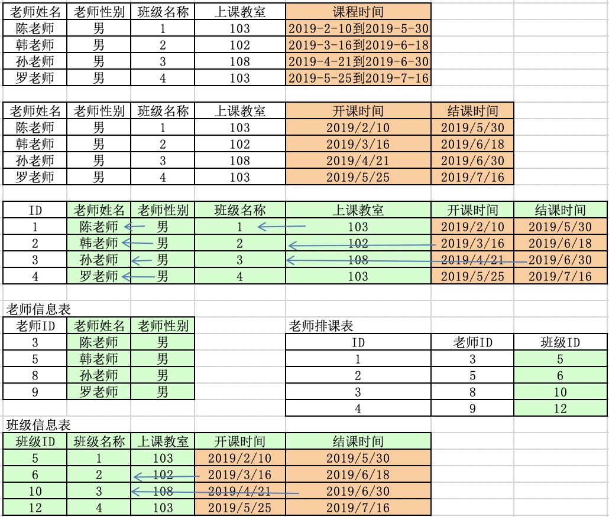


学习高级-电商平台（京东）

阿里P8架构师谈：分布式架构设计(文章合集）


# MySQL

```sql
// 前一天
WHERE state = 1 AND(TO_DAYS(NOW()) - TO_DAYS(add_time)) <= 1
// 当天
WHERE state = 1 AND IFNULL(UNIX_TIMESTAMP(add_time) , 0)  >= UNIX_TIMESTAMP(CAST(SYSDATE() AS DATE)) AND IFNULL(UNIX_TIMESTAMP(add_time) , 0) <  UNIX_TIMESTAMP(CAST(SYSDATE() AS DATE) + INTERVAL 1 DAY)

```

## MySQL 优化

【MySQL优化】join 使用优化

场景再现：生产环境中一个查询评论内容的`SQL`语句执行时间长达10秒以上，`DBA`找到该慢查询语句，未优化前的`SQL`语句内容如下:

```sql
EXPLAIN SELECT
	`xx_answer`.`content` AS `answer_content`
FROM
	`xx_comment`
LEFT JOIN `xx_order_info` ON `xx_order_info`.`order_id` = `xx_comment`.`order_id`
LEFT JOIN `xx_goods` ON `xx_goods`.`goods_id` = `xx_comment`.`id_value`
LEFT JOIN `xx_suppliers` ON `xx_suppliers`.`suppliers_id` = `xx_goods`.`suppliers_id`
LEFT JOIN `xx_comment` AS `xx_answer` ON `xx_comment`.`comment_id` = `xx_answer`.`parent_id`
WHERE
	`xx_comment`.`parent_id` = 0
AND `xx_comment`.`first_is` = 1
AND `xx_goods`.`suppliers_id` IN('3' , '4' , '9')
ORDER BY
	`xx_comment`.`comment_id` DESC
LIMIT 10 OFFSET 20
```

执行`EXPLAIN`后的结果如下：


会发现最后一个表连接时`Extra`中存在`Using join buffer (Block Nested Loop)`（使用连接缓存，块嵌套循环的算法）。

另一个奇怪的现象是在另一个库2相同的表中执行上面同样的`SQL`语句却非常快，而且库2中表的数据量比库1中表的数据要多。两个表都有相同的字段和索引结构，`parent_id`字段也都创建了普通索引：

```sql
 KEY `parent_id` (`parent_id`)
```

使用如下语句对`parent_id`去重进行分析：

```java
select distinct(parent_id) from xx_comment;
```

分析后发现，库2表中的有79条，而库1表中的有0条，初步推断在库2的表中因`parent_id`有79条，优化器在左连接时使用了索引，而没有选择使用`Using join buffer (Block Nested Loop)`。试着在`sql` 语句优化中尝试使用强制索引`FORCE INDEX(parent_id)`如下：

```sql
EXPLAIN SELECT
	`xx_answer`.`content` AS `answer_content`
FROM
	`xx_comment` FORCE INDEX(parent_id)
LEFT JOIN `xx_order_info` ON `xx_order_info`.`order_id` = `xx_comment`.`order_id`
LEFT JOIN `xx_goods` ON `xx_goods`.`goods_id` = `xx_comment`.`id_value`
LEFT JOIN `xx_suppliers` ON `xx_suppliers`.`suppliers_id` = `xx_goods`.`suppliers_id`
LEFT JOIN `xx_comment` AS `xx_answer` ON `xx_comment`.`comment_id` = `xx_answer`.`parent_id`
WHERE
	`xx_comment`.`parent_id` = 0
AND `xx_comment`.`first_is` = 1
AND `xx_goods`.`suppliers_id` IN('3' , '4' , '9')
ORDER BY
	`xx_comment`.`comment_id` DESC
LIMIT 10 OFFSET 20
```

再次执行计划后，如下图所示：


经过优化前和优化后的`Explain`对比可以发现如下现象：

* `xx_comment` 表中不在使用全表扫描`ALL`，而是使用了`ref`非唯一性索引扫描，这样不会再使用`Using temporary`临时表排序和`Using filesort`文件排序，大大提升查询的效率。

* `xx_answer`表中`Extra`中也已不存在`Using join buffer (Block Nested Loop)`，执行语句后发现速度的确非常快。

问题：为何使用强制索引`FORCE INDEX(parent_id)`后，优化器就不选择`Using join buffer (Block Nested Loop)`？

在`MySQL`官方文档中 `8.8.2 EXPLAIN Output Format[3] `提到：`MySQL`使用`Nested-Loop Loin`算法处理所有的关联查询。使用这种算法，意味着这种执行模式：

* 从第一个表中读取一行，然后在第二个表、第三个表...中找到匹配的行，以此类推；

* 处理完所有关联的表后，`MySQL`将输出选定的列，如果列不在当前关联的索引树中，那么会进行回表查找完整记录；
* 继续遍历，从表中取出下一行，重复以上步骤。

> **多表`join`：**不管多少个表`join`，都是用的` Nested-Loop Join`实现的。如果有第三个`join`的表，那么会把前两个表的`join`结果集作为循环基础数据，在执行一次`Nested-Loop Join`，到第三个表中匹配数据，更多多表同理。

` join`走索引（`Index Nested-Loop Join`）：索引嵌套循环`join`，驱动表越小，复杂度越低，越能提高搜索效率。

`join`不走索引（`Block Nested-Loop Join`）：没有使用索引时，`join`连接的过程中就会用到`join buffer`，本次使用到的是`Block Nested Loop Join`，同样的也遵循驱动表越小，复杂度越低，越能提高搜索效率。

`join`使用总结：

* `join`优化的目标是尽可能减少`join`中`Nested-Loop`的循环次数，所以需要让小表做驱动表；

* 关联字段尽量走索引，这样就可以用到`Index Nested-Loop Join`了；
* 如果有`order by`，请使用驱动表的字段作为`order by`，否则会使用 `using temporary`；

* 如果不可避免要用到`BNL`算法，为了减少被驱动表多次扫描导致的对`Buffer Pool`利用率的影响，那么可以尝试把 `join_buffer_size`调大；
* 为了进一步加快`BNL`算法的执行效率，我们可以给关联条件加上索引，转换为`BKA`算法；如果加索引成本较高，那么可以通过临时表添加索引来实现；
* 如果使用的是`MySQL 8.0.18`，可以尝试使用`hash join`，如果是较低版本，也可以自己在程序中实现一个`hash join`。


### 参考文章

[MySQL多表关联之Block Nested-Loop Join](http://blog.sina.com.cn/s/blog_a1e9c7910102x1bz.html)

[SQL运行内幕：从执行原理看调优的本质](https://zhuanlan.zhihu.com/p/151689830)i