# 问题列表

## GMP 设计模型

* [了解`go`中的协程与线程的之间的映射关系？什么是`m:n`两级线程模型？](#gmp01)
* [什么是GMP模型？与GM模型有什么区别？](#gmp02)
* [关于GMP模型的限制是什么？P和M何时会被创建？](#gmp03)
* [谈谈调度器的生命周期？](#gmp04)

## Goroutine

* [谈谈你对`goroutine`的理解?](#goroutine01)
* [什么是 M:N 两级线程模型？什么是`goroutine`调度器？](#goroutine02)
* [关于`goroutine`的调度策略，当执行代码`go func()`时都经历了哪些过程？](#go_func)

## Channel

* [`channel`的读写特性是什么？会发生`painc`的情况是有几种，分别是什么？下面的代码输出什么？](#channel_read)
* [是否了解`golang`的`CSP`并发模型的思想？](#csp)
* [什么是无缓冲的`channel`？什么是有缓冲的`channel`？它们之间有什么区别？](#chan02)
* [对已经关闭的`chan`进行读写会怎么样？为什么？](#chan03)
* [关于`goroutine`泄露，下面的代码有什么问题？](#chan04)

## GC 垃圾回收机制

* [`golang GC` 有了解吗？`GC ` 时会发生什么?](#gc01)
* [什么是标记清除法？它的整体流程有哪些？它最大的缺点是什么？](#gc02)
* [什么是三色标记法？标记过程中不使用STW将会发生什么事情？如何解决？](#gc03)
* [什么是强三色不变式？什么是弱三色不变式？它们为了解决什么问题？](#gc04)
* [什么是插入屏障？什么是删除屏障？他们的缺点是什么？](#gc05)
* [为什么要引入混合写屏障机制？具体原理是什么？列举几个场景验证该机制是否合理？](#gc06)

## 内存逃逸

* [了解`golang`的**内存逃逸**吗？什么情况下会发生**内存逃逸**？如何避免**内存逃逸**？](#escape)
* [什么是内存逃逸？如果变量从栈逃逸到堆，会怎样？](#escape01)
* [对于`new`出来的变量，是在堆空间开辟的还是栈空间？](#escape02)
* [什么情况下会发生内存逃逸，典型的场景有哪些？](#escape03)
* [如何避免内存逃逸？](#escape04)

## 并发编程

* [`go` 中除了加 `mutex` 锁以外还有哪些方式安全读写共享变量？](#shared_variable)
* [如何避免错误使用 `WaitGroup` 的情况？至少五点。](#wg01)
* [如何实现线程安全的`Map`类型？](#map01)
* [关于并发问题的解决方案，什么时候选择并发原语？什么时候选择`Channel`？](#conc03)

## 专题相关

### make && new

* [`golang` 中 `make` 与 `new` 有何区别？](#make_new)

### array && slice

* [`golang` 中 `array` 与 `slice` 有何区别？](#array_slice)

### slice 底层实现


### map 底层实现

* [`golang` 中 `map`的底层实现？](#map_01)
* [`golang` 中 `map`的初始化都发生了什么？](#map_02)
* [`golang` 中 `map`是如何进行查找的？](#map_03)
* [`golang` 中 `map`是如何进行扩容的？](#map_04)
* [`golang` 中 `map`是如何进行迁移的？](#map_05)

### defer 关键字

* [什么是`defer`？为什么需要`defer`？如何使用`defer`？ `defer`的执行顺序是什么？](#defer)

### 值引用 && 类型引用

* [Go 语言当中值传递和地址传递（引用传递）如何运用？有什么区别？举例说明？](#value_quote)

## GO 基础类

* [01、与其他语言相比，使用 Go 有什么好处?](#geek-base-01)
* [02、Golang 使用什么数据类型?](#geek_base_02)
* [03、Go 程序中的包是什么?](#geek_base_03)
* [04、Go支持什么形式的类型转换？将整数转换为浮点数。](#geek_base_04)
* [05、什么是 Goroutine？你如何停止它？](#geek_base_05)
* [06、如何在运行时检查变量类型？](#geek_base_06)
* [07、两个接口之间可以存在什么关系？Go中接口有什么特点？](#geek_base_07)
* [08、Go 当中同步锁有什么特点？作用是什么?](#geek_base_08)
* [09、Go 语言当中 Channel（通道）有什么特点，会 panic 的情况有几种？会  block 的情况有几种？需要注意什么？](#geek_base_09)
* [10、Go 语言当中 Channel 缓冲有什么特点？](#geek_base_10)
* [11、Go 语言中 cap 函数可以作用于那些内容？](#geek_base_11)
* [12、go convey是什么？一般用来做什么？](#geek_base_12)
* [13、Go 语言当中 new 和 make 有什么区别吗?](#geek_base_13)
* [14、Go 语言中 make 的作用是什么?](#geek_base_14)
* [15、Printf()、Sprintf()、FprintF() 都是格式化输出，有什么不同?](#geek_base_15)
* [16、array 和 slice 的区别是什么？](#array_slice)
* [17、Go 语言当中值传递和地址传递(引用传递)如何运用？有什么区别？举例说明？](#geek_base_17)
* [18、Go 语言是如何实现切片扩容的？扩容策略是什么？](#geek_base_18)
* [19、什么是`defer`？为什么需要`defer`？如何使用`defer`？ `defer`的执行顺序是什么？](#defer)
* [20、Golang Slice 的底层实现？](#geek_base_20)
* [21、Golang 扩容前后的 Slice 是否相同？它的扩容机制是什么？](#geek_base_21)


## 源码分析

* [Golang 源码系列一：Slice 实现原理分析。](#source_01)

## 应用场景

* [保存用户作品的浏览量方案设计?](#scene01)


* 了解`string`和`[]byte`转换原理吗？会发生内存拷⻉吗? 如何进行高效转换？
* [进程、线程、协程各自的优缺点？](#coroutine)
* 读写锁 `RWMutex` 和互斥锁 `Mutex` 。下面的代码有什么问题?
* [`defer`、`recover`和`panic`的问题？](#defer_recover)
* [用过 `fallthrough` 关键字吗？这个关键字的作用是什么？](#fallthrough)
* [`JSON` 标准库对 `nil slice` 和`non-nil`空 `slice` 的处理是一致的吗？](#nil_slice)
* [了解过选项模式吗？能否写一段代码实现一个函数选项模式？](#option_pattern)
* [是否可以获取常量的地址，什么是内存的四区？](#const)
* [关于函数的返回值类型，下面代码是否能够编译通过？为什么？](#string_nil)
* [关于结构体比较，下面代码是否可以编译通过？为什么？](#struct_compare)
* [关于函数返回值命名问题，下面代码是否可以编译通过？](#return_value)
* [关于`slice`的追加和拼接问题，分析下面两段代码。](#slice_append)
* [关于`map`的遍历赋值，下面的代码输出什么内容？](#map_for)
* [关于`map`的`value` 赋值，下面的代码输出什么内容？](#map_value)
* [值类型和引用类型的理解](#value_quote)
* [关于非空接口`iface`情况，以下代码打印出来什么内容，说出为什么？](#non_empty)
* [关于`interface`的赋值问题，以下代码能编译过去吗？为什么？](#interface)
* [关于`inteface{}`与`*interface{}`，ABCD中哪一行存在错误？](#interface02)
* [Go是否可以声明一个类？]()
* Go是否支持泛型？
* Go的相关命令？
* `defer`关键字的使用，写出下面代码的输出内容。
* `for_range` 循环复用，以下代码有什么问题，请说明原因？
* 下面的代码会输出什么，并说明原因？


# 问题解答

## GMP 设计模型

### 专有名词解释

内核线程（`Kernel-Level Thread ，KLT`） ：操作系统的主线程，属于物理线程。

轻量级进程（`Light Weight Process，LWP`）：是指我们通常意义上所讲的线程，由于每个轻量级进程都由一个内核线程支持，因此只有先支持内核线程，才能有轻量级进程。

### 线程模型

<span id="gmp01">了解`go`中的协程与线程的之间的映射关系？什么是`m:n`两级线程模型？</span>

> M:N 两级线程模型其实是用户态线程（`goroutine`）和操作系统线程之间的映射关系。
>
> 具体理解为，M个`goroutine`运行在N个操作系统线程之上，内核负责对这N个操作系统线程进行调度，而这N个系统线程又负责对这M个`goroutine`进行调度和运行。

* `1:1关系`：1个协程绑定1个线程，这种最容易实现，协程的调度都由CPU完成了。缺点：协程的创建、删除和切换的代价都由CPU完成，有点略显昂贵了。

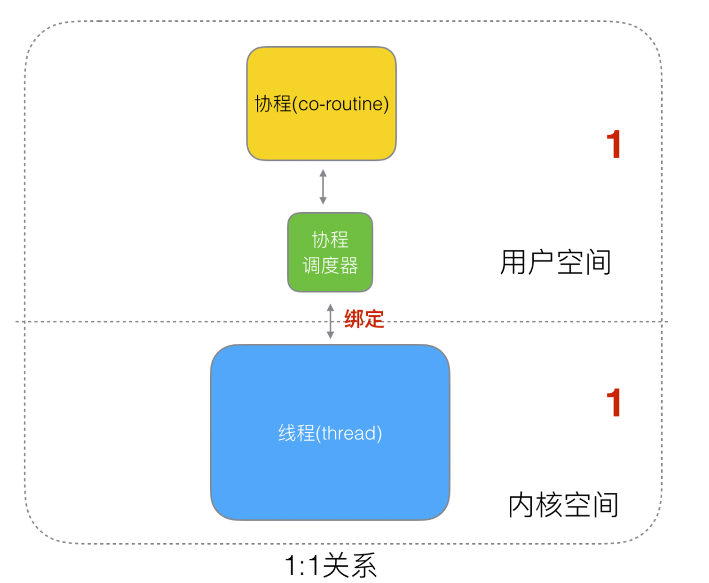

* `N:1 关系`：N个协程绑定1个线程，优点就是**协程在用户态线程即完成切换，不会陷入到内核态，这种切换非常的轻量快速**。但也有很大的缺点，1个进程的所有协程都绑定在1个线程上。缺点：某个程序用不了硬件的多核加速能力。一旦某协程阻塞，造成线程阻塞，本进程的其他协程都无法执行了，根本就没有并发的能力了。

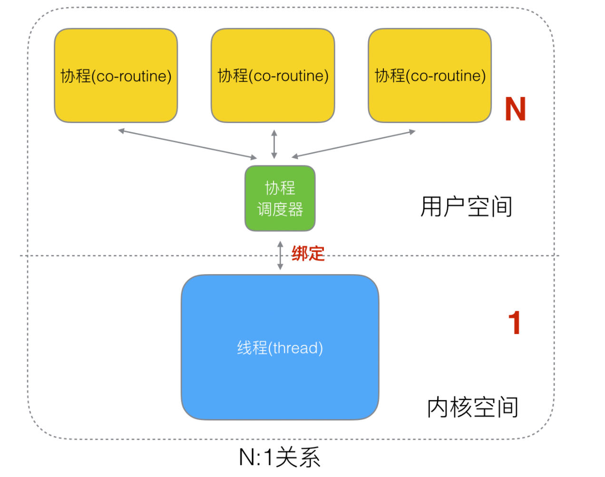

* `M:N关系`：M个协程绑定1个线程，是N:1和1:1类型的结合。

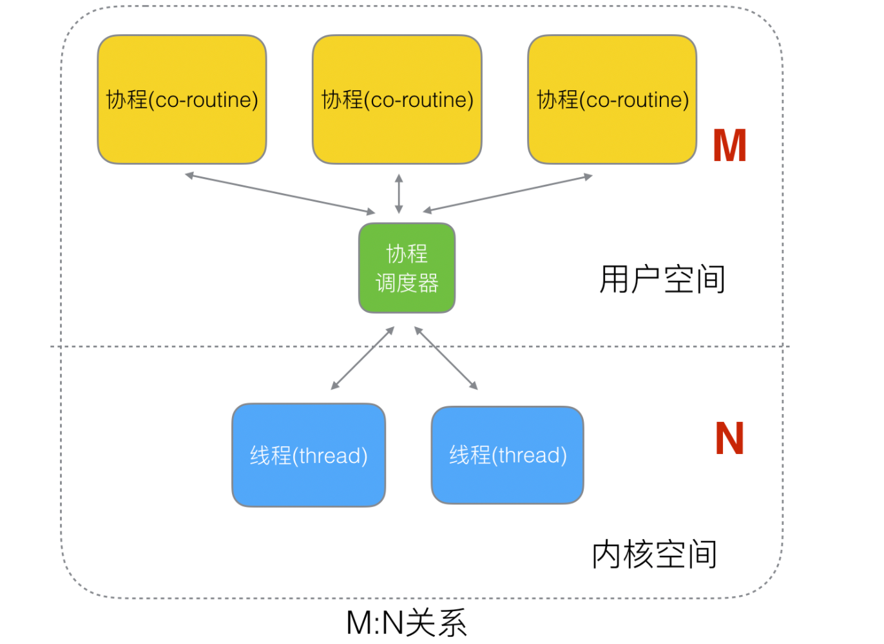

> 协程跟线程是有区别的，线程由CPU调度是抢占式的，**协程由用户态调度是协作式的**，一个协程让出CPU后，才执行下一个协程。

### `GM`  模型  VS `GMP` 模型

<span id="gmp02">什么是GMP模型？与GM模型有什么区别？</span>

`GM`的调度模型：M想要执行、放回G都必须访问全局G队列，并且M有多个，即多线程访问同一资源需要加锁进行保证互斥/同步，所以全局G队列是有互斥锁进行保护的。

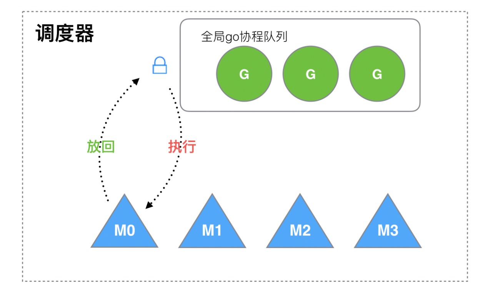

`GM` 调度模型的缺点：

* 创建、销毁、调度G都需要每个M获取锁，这就形成了激烈的锁竞争。
* M转移G会造成**延迟和额外的系统负载**。比如当G中包含创建新协程的时候，M创建了G’，为了继续执行G，需要把G’交给M’执行，也造成了**很差的局部性**，因为G’和G是相关的，最好放在M上执行，而不是其他M'。
* 系统调用(CPU在M之间的切换)导致频繁的线程阻塞和取消阻塞操作增加了系统开销。

> 在Go中，**线程是运行goroutine的实体，调度器的功能是把可运行的goroutine分配到工作线程上**。

Go 线程模型属于M:N模型，主要包含三个概念：内核线程(M)、协程的上下文环境（P）、协程(G)。

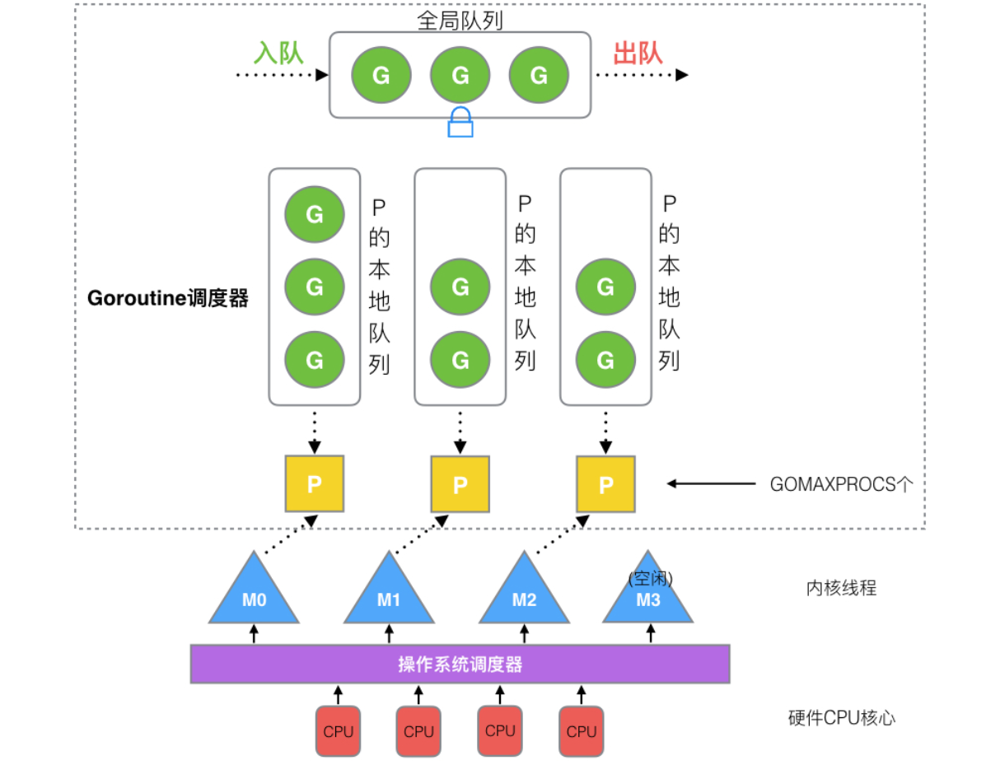

* G (`Goroutine`)。本质上属于轻量级的线程，是基于协程建立的用户态线程。它拥有自己的栈、指令指针和维护其他调度相关的信息。G分为P的本地队列和全局队列G，存放的是等待运行的G，存的数量有限，本地队列不超过256个。新建G'时，G'优先加入到P的本地队列，如果队列满了，则会把本地队列中一半的G移动到全局队列。

* M (`Machine`)，操作系统的主线程（物理线程）。它直接关联一个操作系统内核线程，用于执行 G。线程想运行任务就得获取P，从P的本地队列获取G，P队列为空时，M也会尝试从全局队列拿一批G放到P的本地队列，或从其他P的本地队列偷一半放到自己P的本地队列。M运行G，G执行之后，M会从P获取下一个G，不断重复下去。
* P (`Processor`)，协程的上下文环境。它包含了运行`goroutine`的资源，如果线程想运行`goroutine`，必须先获取P，P中还包含了可运行的G队列。P 是处理用户级代码逻辑的处理器，P 里面一般会存当前`goroutine`运行的上下文环境（函数指针，堆栈地址及地址边界），P 会对自己管理的`goroutine`队列做一些调度。所有的P都在程序启动时创建，并保存在数组中，最多有`GOMAXPROCS`(可配置)个。

>  主线程是一个物理线程，直接作用在 cpu 上的，是重量级的，非常耗费 cpu 资源。
>
> 而协程是从主线程开启的，是轻量级的线程，是逻辑态，对资源消耗相对小。

`GMP`调度模型 VS`GM`调度模型的优势：

* 每个 P 都有自己的本地队列，减少锁竞争。
* 线程复用：实现`hand-off`机制，将阻塞的 G 转移给其他空闲的 M 执行，提高资源的利用效率。
* 线程复用：实现 `Work-Stealing` 机制，减少空转时间。
* 总体的设计思路就是将 P 引入`runtime`，并在 P 上实现可窃取调度。

### GMP 模型的限制

<span id="gmp03">关于GMP模型的限制是什么？P和M何时会被创建？</span>

* G：除内存外无限制，每个 G 创建需要 2-4KB **连续**内存块。
* M：程序启动时，会设置M的最大数量，最多10000个，否则`panic`，`sched.maxmcount`=10000。一个M阻塞了，会唤醒一个M或者创建一个新的M。
* P：由程序启动时环境变量`$GOMAXPROCS`或者是由`runtime`的方法`GOMAXPROCS()`决定。这意味着在程序执行的任意时刻都只有`$GOMAXPROCS`个`goroutine`在同时运行。

M与P的数量没有绝对关系，一个M阻塞，P就会去创建或者切换另一个M，所以，即使P的默认数量是1，也有可能会创建很多个M出来。

```
func GOMAXPROCS(n int) int
```

`GOMAXPROCS`设置可同时执行的最大CPU数，并返回先前的设置。 若 n < 1，它就不会更改当前设置。本地机器的逻辑CPU数可通过 `NumCPU` 查询。本函数在调度程序优化后会去掉。

> #### P和M何时会被创建？

* P何时创建：在确定了P的最大数量n后，运行时系统会根据这个数量创建n个P。
* M何时创建：没有足够的M来关联P并运行其中的可运行的G。比如所有的M此时都阻塞住了，而P中还有很多就绪任务，就会去寻找空闲的M，而没有空闲的，就会去创建新的M。

### 调度器的生命周期

<span id="gmp04">谈谈调度器的生命周期？</span>

两个特殊的`M0`和`G0`:

* `M0`是启动程序后的编号为0的主线程，这个M对应的实例会在全局变量`runtime.m0`中，不需要在`heap`上分配，M0负责执行初始化操作和启动第一个G， 在之后M0就和其他的M一样了。

* `G0`是每次启动一个M都会第一个创建的`goroutine`，G0仅用于负责调度的G，G0不指向任何可执行的函数, 每个M都会有一个自己的G0。在调度或系统调用时会使用G0的栈空间，全局变量的G0是M0的G0。

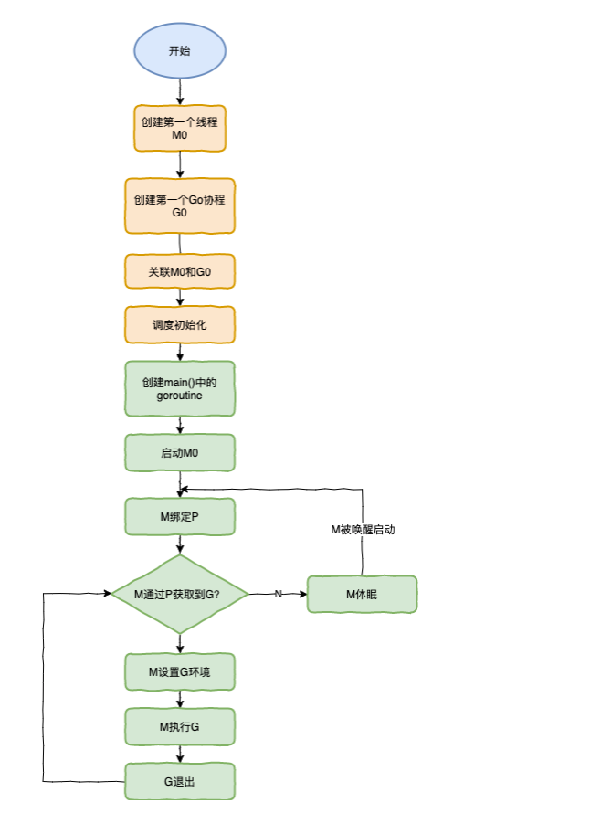


结合一段代码来对调度器进行分析：

```go
package main

import "fmt"

func main() {
    fmt.Println("Hello Process")
}
```

* `runtime`创建最初的线程`m0`和`goroutine` `g0`，并把两者关联。
* 调度器初始化：初始化`m0`、栈、垃圾回收，以及创建和初始化由`GOMAXPROCS`个P构成的P列表。
* 示例代码中的`main`函数是`main.main`，`runtime`中也有1个`main`函数——`runtime.main`，代码经过编译后，`runtime.main`会调用`main.main`，程序启动时会为`runtime.main`创建`goroutine`，称它为`main goroutine`，然后把`main goroutine`加入到P的本地队列。
* 启动m0，m0已经绑定了P，会从P的本地队列获取G，获取到`main goroutine`。
* G拥有栈，M根据G中的栈信息和调度信息设置运行环境。
* M运行G。
* G退出，再次回到M获取可运行的G，这样重复下去，直到`main.main`退出，`runtime.main`执行`Defer`和`Panic`处理，或调用`runtime.exit`退出程序。

调度器的生命周期几乎占满了一个Go程序的一生，`runtime.main`的`goroutine`执行之前都是为调度器做准备工作，`runtime.main`的`goroutine`运行，才是调度器的真正开始，直到`runtime.main`结束而结束。

##  Goroutine

### `goroutine `的理解

<span id="goroutine01">谈谈你对`goroutine `的理解？</span>

> `goroutine`是来自协程`coroutine`的概念，它属于**用户态的线程**，主要解决操作（内核）系统线程占用内存太大和创建、切换开销性能消耗较大的问题。用户态线程`goroutine`是一个非常轻量级的，其创建和切换都在用户代码中完成而无需进入操作系统内核，所以其开销要远远小于系统线程的创建和切换；另外一个优势在于`goroutine`只占2-4KB内存空间，可以在程序轻易的创建成千上万甚至上百万的`goroutine`出来并发的执行任务而不用太担心性能和内存等问题。其他程序如C/JAVA的多线程，往往是内核态的，比较重量级，几千个线程可能就会耗光`CPU`。

Go为了提供更容易使用的并发方法，使用了`goroutine`和`channel`。`goroutine`来自协程的概念，让一组可复用的函数运行在一组线程之上，即使有协程阻塞，该线程的其他协程也可以被`runtime`调度，转移到其他可运行的线程上（`hand off`机制）。

Go中，协程被称为`goroutine`，它非常轻量，一个`goroutine`只占几KB，并且这几KB就足够`goroutine`运行完，这就能在有限的内存空间内支持大量`goroutine`，支持了更多的并发。虽然一个`goroutine`的栈只占几KB，但实际是可伸缩的，如果需要更多内容，`runtime`会自动为`goroutine`分配。

`goroutine`特点：

- 占用内存更小（几KB）。
- 调度更灵活(`runtime`调度)。

`goroutine`是 Go 语言实现的轻量级的**用户态线程**，主要用来解决**操作系统线程**太重的问题，所谓的太重，主要表现在以下两个方面：

- 创建和切换太重：操作系统线程的创建和切换都需要进入内核，而进入内核所消耗的性能代价比较高，开销较大;
- 内存使用太重：一方面，为了尽量避免极端情况下操作系统线程栈的溢出，内核在创建操作系统线程时默认会为其分配一个较大的栈内存(虚拟地址空间，内核并不会一开始就分配这么多的物理内存)，然而在绝大多数情况下，系统线程远远用不了这么多内存，这导致了浪费；另一方面，栈内存空间一旦创建和初始化完成之后 其大小就不能再有变化，这决定了在某些特殊场景下系统线程栈还是有溢出的⻛险。

而相对的，**用户态线程**的`goroutine`则轻量得多：

* `goroutine`是用户态线程，其创建和切换都在用户代码中完成而无需进入操作系统内核，所以其开销要远远小于系统线程的创建和切换;
* `goroutine`启动时默认栈大小只有2k，这在多数情况下已经够用了，即使不够用，`goroutine`的栈也会自动扩大，同时，如果栈太大了过于浪费它还能自动收缩，这样既没有栈溢出的⻛险，也不会造成栈内存空间的大量浪费。 

正是因为`Go`语言中实现了如此轻量级的线程（逻辑态的），才使得我们在`Go`程序中，可以轻易的创建成千上万甚至上百万的`goroutine`出来并发的执行任务而不用太担心性能和内存等问题。其他程序如C/JAVA的多线程，往往是内核态的，比较重量级，几千个线程可能就会耗光CPU。

以下是 `Rob Pike` 在 [Google I/O 2012](https://www.youtube.com/watch?v=f6kdp27TYZs) 上对`goroutine`给出的描述：

> What is a goroutine? It’s an independently executing function, launched by a **go** statement.
> It has its own call stack, which grows and shrinks as required.
> It’s very cheap. It’s practical to have thousands, even hundreds of thousands of goroutines.
> It’s not a thread.
> There might be only one thread in a program with thousands of goroutines.
> Instead, goroutines are multiplexed dynamically onto threads as needed to keep all the goroutines running.
> But if you think of it as a very cheap thread, you won’t be far off.
>
> **― Rob Pike**

概括下来其实就一句话：

> goroutine 可以视为开销很小的线程（既不是物理线程也不是协程，但它拥有自己的调用栈，并且这个栈的大小是可伸缩的  ~~不是协程，它有自己的栈~~），很好用，需要并发的地方就用 go 起一个 func。

在 `Golang` 中，任何代码都是运行在 `goroutine`里，即便没有显式的 `go func()`，默认的 `main` 函数也是一个 `goroutine`。但 `goroutine` 不等于操作系统的线程，它与系统线程的对应关系，牵涉到` Golang` 运行时的调度器。

###  `goroutine` 调度器

<span id="goroutine02">什么是 M:N 两级线程模型？什么是`goroutine`调度器？</span>

> M:N 两级线程模型其实是用户态线程（`goroutine`）和操作系统线程之间的映射关系。
>
> 具体理解为，M个`goroutine`运行在N个操作系统线程之上，内核负责对这N个操作系统线程进行调度，而这N个系统线程又负责对这M个`goroutine`进行调度和运行。
>
> 所谓的`goroutine`调度器，其实可以理解为GMP模型中的P。它是指程序代码按照一定的算法在适当的时候挑选出合适的`goroutine`并放到`CPU`上去运行的过程，这些负责对`goroutine`进行调度的程序代码我们称之为`goroutine`调度器。

`goroutine`是建立在操作系统线程基础之上的用户态线程，它与操作系统线程之间实现了一个多对多(M:N)的两级线程模型。

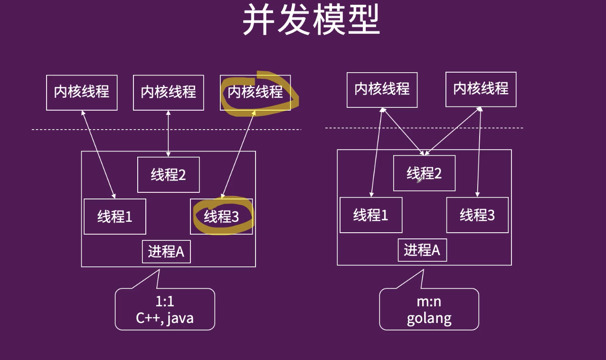

 这里的 M:N 是指M个`goroutine`运行在N个操作系统线程之上，内核负责对这N个操作系统线程进行调度，而这N个系统线程又负责对这M个`goroutine`进行调度和运行。

所谓的`goroutine`调度，是指程序代码按照一定的算法在适当的时候挑选出合适的`goroutine`并放到`CPU`上去运行的过，这些负责对`goroutine`进行调度的程序代码我们称之为`goroutine`调度器。

`goroutine`调度器需要解决三大核心问题：

* 调度时机：什么时候会发生调度？

* 调度策略：使用什么策略来挑选下一个进入运行的`goroutine`？

* 切换机制：如何把挑选出来的`goroutine`放到`CPU`上运行？

为了帮助我们从宏观上了解`goroutine`的两级调度模型，简化后`goroutine`调度器的工作流程伪代码：

```go
// 程序启动时的初始化代码
......
for i := 0; i < N; i++ { // 创建N个操作系统线程(工作线程)执行 schedule 函数
	create_os_thread(schedule) // 创建一个操作系统线程执行 schedule 函数 
}
// schedule 函数实现调度逻辑 
func schedule() {
	for { // 调度循环
		// 根据某种算法从M个 goroutine 中找出一个需要运行的 goroutine
		g := find_a_runnable_goroutine_from_M_goroutines()
		run_g(g) // CPU运行该 goroutine，直到需要调度其它 goroutine 才返回 
		save_status_of_g(g) // 保存 goroutine 的状态，主要是寄存器的值
	} 
}
```

程序运行起来之后创建了N个由内核调度的操作系统线程 （工作线程）去执行`shedule`函数。

`schedule `函数在一个调度循环中反复从M个`goroutine`中挑选出一个需要运行的`goroutine`并跳转到该

`goroutine`去运行，直到需要调度其它`goroutine`时才返回到`schedule`函数中。通过 `save_status_of_g`保存刚刚正在运行的 `goroutine` 的状态，然后再次去寻找下一个 `goroutine`。

### `goroutine` 的调度策略

<span id="go_func">关于`goroutine`的调度策略，当执行代码`go func()`时都经历了哪些过程？</span>

调度器的设计策略包含以下几个要点：

* **复用线程**（`work stealing`和`hand off`机制）：避免频繁的创建、销毁线程，而是通过对线程的复用。方式一、通过`work stealing`机制，当本线程无可运行的G时，尝试从其他线程绑定的P偷取G，而不是销毁线程。方式二 ，通过`hand off`机制， 当本线程因为G进行系统调用阻塞时，线程释放绑定的P，把P转移给其他空闲的线程执行。
* **利用并行**：`GOMAXPROCS`设置P的数量，最多有`GOMAXPROCS`个线程分布在多个CPU上同时运行。`GOMAXPROCS`也限制了并发的程度，比如`GOMAXPROCS = 核数/2`，则最多利用了一半的CPU核进行并行。
* **抢占**：在`coroutine`中要等待一个协程主动让出CPU才执行下一个协程，在Go中，一个`goroutine`最多占用`CPU` 10ms，防止其他`goroutine`被饿死，这就是`goroutine`不同于`coroutine`的一个地方。
* **全局G队列**：在新的调度器中依然有全局G队列，但功能已经被弱化了，当M执行`work stealing`从其他P偷不到G时，它可以从全局G队列获取G。

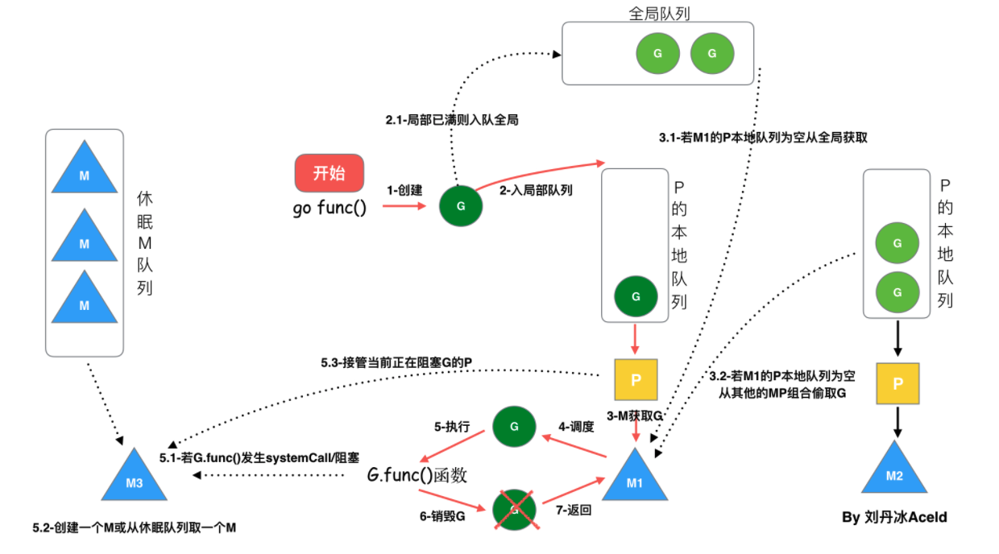

具体执行流程如下：

 1、通过 `go func()`来创建一个`goroutine`；

 2、有两个存储G的队列，一个是局部调度器P的本地队列、一个是全局G队列。新创建的G会先保存在P的本地队列中，如果P的本地队列已经满了就会保存在全局的队列中；

 3、G只能运行在M中，一个M必须持有一个P，M与P是1：1的关系。M会从P的本地队列弹出一个可执行状态的G来执行，如果P的本地队列为空；就会从全局队列中获取G来执行，如果全局队列中的G为空；就会想其他的MP组合偷取一个可执行的G来执行；

 4、一个M调度G执行的过程是一个循环机制；

 5、当M执行某一个G时候如果发生了`syscall`或其余阻塞操作，M会阻塞，如果当前有一些G在执行行，`runtime`会把这个线程M从P中摘除(`detach`)，然后再创建一个新的操作系统的线程(如果有空闲的线程可用就复用空闲线程)来服务于这个P；

 6、当M系统调用结束时候，这个G会尝试获取一个空闲的P执行，并放入到这个P的本地队列。如果获取不到P，那么这个线程M变成休眠状态， 加入到空闲线程中，然后这个G会被放入全局队列中。

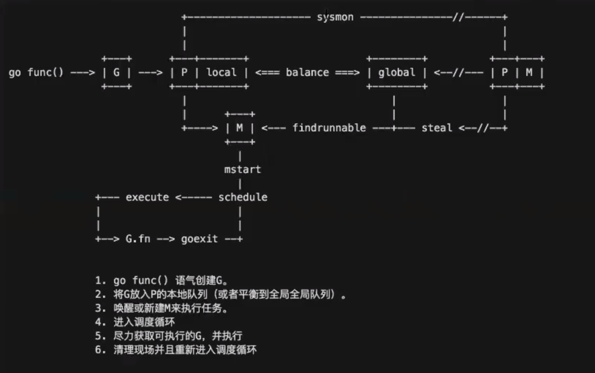

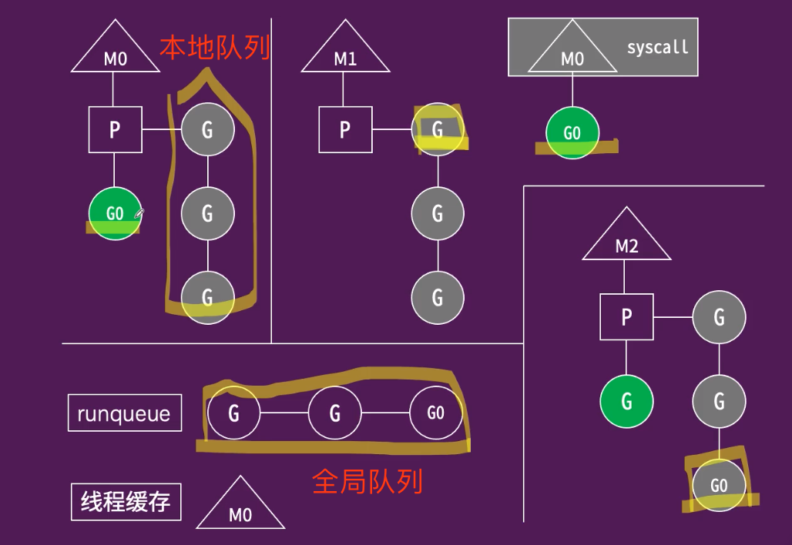

`schedule`函数分三步分别从各运行队列中寻找可运行的`goroutine`：

* ① 从本地运行队列中寻找`goroutine`。
* ② 从全局运行队列中寻找`goroutine`。
* ③ 从其它运行线程的队列中偷取`goroutine`。

**`schedule`函数源码分析（部分）**`runtime/proc.go`

```go
// One round of scheduler: find a runnable goroutine and execute it.
// Never returns.
func schedule() {
	_g_ := getg() // _g_ = m.g0
	......	
	var gp *g
	......
 
	if gp == nil {
		// Check the global runnable queue once in a while to ensure fairness.
		// Otherwise two goroutines can completely occupy the local runqueue
		// by constantly respawning each other.
    // 为保证调度的公平性，每个工作线程每经过61次调度就优先尝试从全局运行队列中找出一个 goroutine 来运行,
    // 这样才能保证位于全局运行队列中的 goroutine 得到调度的机会。
		if _g_.m.p.ptr().schedtick%61 == 0 && sched.runqsize > 0 {
      // 全局运行队列是所有工作线程都可以访问的，所以在访问它之前需要加锁。
			lock(&sched.lock)
      // ① 从全局运行队列中寻找 goroutine。
			gp = globrunqget(_g_.m.p.ptr(), 1)
			unlock(&sched.lock)
		}
	}
  
	if gp == nil {
    // ② 从工作线程本地运行队列中寻找 goroutine。
		gp, inheritTime = runqget(_g_.m.p.ptr())
		// We can see gp != nil here even if the M is spinning,
		// if checkTimers added a local goroutine via goready.
	}
  
	if gp == nil {
    // ③ 从其它工作线程的运行队列中偷取 goroutine。
		gp, inheritTime = findrunnable() // blocks until work is available
	}
  .....
  // 当前运行的是 runtime 的代码，函数调用栈使用的是 g0 的栈空间
  // 调用 execte 切换到 gp 的代码和栈空间去运行
	execute(gp, inheritTime)
}
```

#### ① 从本地运行的队列寻找

`runqget`函数源码分析，`runtime/proc.go`。

```go
type guintptr uintptr

type p struct {
	// Queue of runnable goroutines. Accessed without lock.
	runqhead uint32
	runqtail uint32
	runq     [256]guintptr
	// runnext, if non-nil, is a runnable G that was ready'd by
	// the current G and should be run next instead of what's in
	// runq if there's time remaining in the running G's time
	// slice. It will inherit the time left in the current time
	// slice. If a set of goroutines is locked in a
	// communicate-and-wait pattern, this schedules that set as a
	// unit and eliminates the (potentially large) scheduling
	// latency that otherwise arises from adding the ready'd
	// goroutines to the end of the run queue.
	runnext guintptr
}

// Get g from local runnable queue.
// If inheritTime is true, gp should inherit the remaining time in the
// current time slice. Otherwise, it should start a new time slice.
// Executed only by the owner P.
func runqget(_p_ *p) (gp *g, inheritTime bool) {
	// If there's a runnext, it's the next G to run.
  // 从 runnext 成员中获取 goroutine
	for {
    // 查看 runnext 成员是否为空，不为空则返回该 goroutine。
		next := _p_.runnext
		if next == 0 {
			break
		}
		if _p_.runnext.cas(next, 0) {
			return next.ptr(), true
		}
	}

  // 从循环队列中获取 goroutine
	for {
    // ① 原子读取，不管代码运行在哪种平台，保证在读取过程中不会有其它线程对该变量进行写入；
    // ② 位于 atomic.LoadAcq 之后的代码，对内存的读取和写入必须在 atomic.LoadAcq 读取完成后才能执行，
    // 编译器和 CPU 都不能打乱这个顺序。
		h := atomic.LoadAcq(&_p_.runqhead) // load-acquire, synchronize with other consumers
		t := _p_.runqtail
		if t == h {
			return nil, false
		}
		gp := _p_.runq[h%uint32(len(_p_.runq))].ptr()
    // ① 原子的执行比较并交换的操作；
    // ② 位于 atomic.CasRel 之前的代码，对内存的读取和写入必须在 atomic.CasRel 对内存的写入之前完成，
    // 编译器和 CPU 都不能打乱这个顺序。
		if atomic.CasRel(&_p_.runqhead, h, h+1) { // cas-release, commits consume
			return gp, false
		}
	}
}
```

#### ② 从全局运行队列寻找

`globrunqget`函数源码分析，`runtime/proc.go`。

```go
var (
  gomaxprocs int32
	sched      schedt
)

type schedt struct {
	// Global runnable queue.
	runq     gQueue
	runqsize int32
}

// Try get a batch of G's from the global runnable queue.
// Sched must be locked.
func globrunqget(_p_ *p, max int32) *g {
  // 全局运行队列为空。
	if sched.runqsize == 0 {
		return nil
	}

  // 计算全局运行队列中 goroutine 的数量。
  // 注意：应该从全局运行队列中拿走多少个 goroutine 时根据 p 的数量（gomaxprocs）做了负载均衡。
	n := sched.runqsize/gomaxprocs + 1
  // 计算n的方法可能导致n大于全局运行队列中的 goroutine 数量。
	if n > sched.runqsize {
		n = sched.runqsize
	}
  // 最多取函数参数 max 个 goroutine。
	if max > 0 && n > max {
		n = max
	}
  // 最多只能取本地队列容量的一半
	if n > int32(len(_p_.runq))/2 {
		n = int32(len(_p_.runq)) / 2
	}

  // 剩余全局队列个数计算
	sched.runqsize -= n

  // 先直接通过函数返回 一个 gp（pop 从全局运行队列的队列头取）
	gp := sched.runq.pop()
	n--
	for ; n > 0; n-- {
    // pop 从全局运行队列的队列头取
		gp1 := sched.runq.pop()
     // 其它的 goroutines 通过 runqput 放入本地运行队列
		runqput(_p_, gp1, false)
	}
	return gp
}
```

#### ③ 从其他线程运行的队列中偷取

`findrunnable`函数源码分析，`runtime/proc.go`。

```go
// Finds a runnable goroutine to execute.
// Tries to steal from other P's, get g from local or global queue, poll network.
func findrunnable() (gp *g, inheritTime bool) {
	_g_ := getg()
  ......
  // ① 先从本地运行的队列中获取 goroutine
  // local runq
	if gp, inheritTime := runqget(_p_); gp != nil {
		return gp, inheritTime
	}

  // ② 再从全局运行的队列中获取 goroutine
	// global runq
	if sched.runqsize != 0 {
		lock(&sched.lock)
		gp := globrunqget(_p_, 0)
		unlock(&sched.lock)
		if gp != nil {
			return gp, false
		}
	}
  ......
  for i := 0; i < 4; i++ {
		for enum := stealOrder.start(fastrand()); !enum.done(); enum.next() {
			......
      // ③ 从其他线程运行的队列中偷取 goroutine
			if gp := runqsteal(_p_, p2, stealRunNextG); gp != nil {
				return gp, false
			}
      ......
}
```

## Channel 

### `Channel` 的读写特性

<span id="channel_read">`channel`的读写特性是什么？会发生`painc`的情况是有几种，分别是什么？下面的代码输出什么？</span>

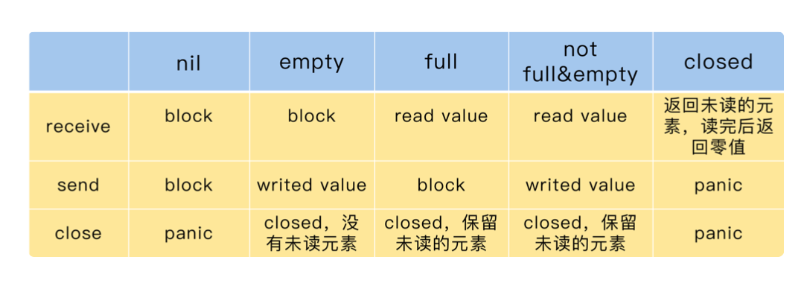

`channel`的读写特性（空读写阻塞，写关闭异常，读关闭空零）：

* 从一个 `nil channel` 接收数据，造成永远阻塞。
* 给一个 `nil channel` 发送数据，造成永远阻塞。
* 给一个`nil channel`关闭，引起`painc`。
* 从一个`empty channel`接收数据，会造成阻塞。
* 给一个`full channel`发送数据，会造成阻塞。
* 从一个`closed channel`接收数据，会返回未读的元素，如果缓冲区为空，则读完后返回零值。
* 给一个已经关闭的 `closed channel` 发送数据，引起 `panic`。
* 关闭一个已经关闭的`closed channel`，引起`painc`。
* 无缓冲的`channel`是同步的，而有缓冲的`channel`是非同步的。

**会 `panic` 的情况，总共有 3 种**:

* `close` 为 `nil` 的 `chan`;
* `send` 已经 `close` 的 `chan`; 
* `close` 已经 `close `的 `chan`。

**会`block`的情况，总共有 4 种：**

* 从一个 `nil channel` 接收数据，造成永远阻塞。
* 给一个 `nil channel` 发送数据，造成永远阻塞。
* 从一个`empty channel`接收数据，会造成阻塞。
* 给一个`full channel`发送数据，会造成阻塞。

执行下面的代码发生什么？

```go
package main

import (
    "fmt"
    "runtime"
    "time"
)

// 结果：一段时间后总是输出 #goroutines: 2
// 解析：因为 ch 未初始化，写和读都会阻塞，之后被第一个协程重新赋值，导致写的 ch 阻塞。
func main() {
    var ch chan int // nil
    // ch = make(chan int, 1)
    go func() {
        ch = make(chan int, 1)
        ch <- 1
    }()
    go func(ch chan int) {
        time.Sleep(time.Second)
        <-ch
    }(ch)
    // panic: close of nil channel
    // panic: send on closed channel
    //close(ch)
    c := time.Tick(1 * time.Second)
    for range c {
        fmt.Printf("#goroutines: %d\n", runtime.NumGoroutine())
    }
}
```

执行下面的代码发生什么？

```go
package main

import (
    "fmt"
    "time"
)

// panic: send on closed channel

func main() {
    ch := make(chan int, 1000)
    go func() {
        for i := 0; i < 10; i++ {
            ch <- i
        }
    }()
    go func() {
        for {
            a, ok := <-ch
            if !ok {
                fmt.Println("close")
                return
            }
            fmt.Println("a: ", a)
        }
    }()
    close(ch)
    fmt.Println("ok")
    time.Sleep(time.Second * 100)
}
```

解析：给一个已经关闭的 `channel` 发送数据，引起 `panic`。

### CSP 模型思想

<span id="csp">是否了解`golang`的`CSP`并发模型的思想?</span>

`CSP` 模型是上个世纪七十年代提出的，不同于传统的多线程通过共享内存来通信，`CSP` 讲究的是**以通信的方式来共享内存**。用于描述两个独立的并发实体通过共享的通讯 `channel `(管道)进行通信的并发模型。`CSP `中 `channel `是第一类对象，它不关注发送消息的实体，而关注与发送消息时使用的 `channel`。

`channel` 的经典思想：**不要通过共享内存来通信，而是通过通信来实现内存共享**。`JAVA/C++`等语言倡导共享内存来通信，而`Go`倡导以通信的方式来共享内存。

> Do not communicate by sharing memory; instead,share memory by communicating.

`channel` 是 `goroutine` 之间通信（读写）的通道。因为它的存在，显得 `Golang`（或者说`CSP`）与传统的共享内存型的并发模型截然不同，用 [Effective Go](http://golang.org/doc/effective_go.html) 里的话来说就是：

> *Do not communicate by sharing memory; instead, share memory by communicating.*

在 `Golang` 的并发模型中，我们并不关心是哪个 `goroutine`（匿名性）在用 `channel`，只关心 `channel` 的性质：

- 是只读还是只写？
- 传递的数据类型？
- 是否有缓冲区?

`CSP`与`Actor`之间的区别：

* `CSP` 解耦发送方和接收方，注重消息传递方式。
* `Actor Model`之间直接通讯，注重处理单元。


`go` 中 `channel` 是被单独创建并且可以在进程之间传递，它的通信模式类似于 `boss-worker` 模式的，一个实体通过将消息发送到 `channel` 中，然后又监听这个 `channel `的实体处理，两个实体之间是匿名的，这个就实现实体中间的解耦，其中 `channel `是同步的一个消息被发送到 `channel` 中，最终是一定要被另外的实体消费掉的，在实现原理上其实类似一个阻塞的消息队列。

`CSP(Communicating Sequential Process)` 描述这样一种并发模型：多个`Process` 使用一个 `Channel` 进行通信,  这个 `Channel `连结的 `Process` 通常是匿名的，消息传递通常是同步的（有别于 `Actor Model`）。

`CSP` 最早是由 [Tony Hoare](https://www.cs.ox.ac.uk/people/tony.hoare/) 在 1977 年提出一个理论模型，也是一本书的名字，有兴趣可以查阅电子版本：http://www.usingcsp.com/cspbook.pdf。

 `Golang` 只用到了 `CSP` 的很小一部分，即理论中的 `Process/Channel`（ `goroutine/channel`）：这两个并发之间没有从属关系， `Process` 可以订阅任意 `Channel`，`Channel `也并不关心是哪个` Process `在利用它进行通信；`Process` 围绕 `Channel `进行读写，形成一套有序阻塞和可预测的并发模型。

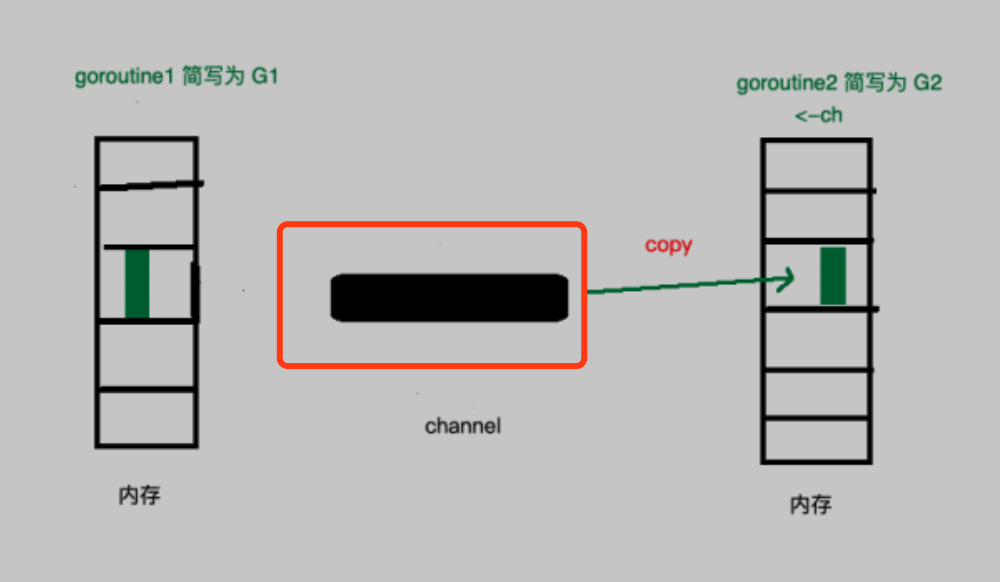

### 无缓冲的 `channel`(同步通道)

<span id="chan02">什么是无缓冲的`channel`？什么是有缓冲的`channel`？无缓冲`channel`的发送和接收是否同步？它们之间有什么区别？</span>

> **无缓冲的`channel`**：无缓冲的通道指的是通道大小为0，发送和接收方需要同时准备好，才可以完成发送和接收操作。（无缓冲的`channel`由于没有缓冲发送和接收需要同步。）
>
> **有缓冲的`channel`**：有缓冲的通道指的是有缓冲大小大于1，不需要发送方和接收方同时准备好，都可以进行发送和接收操作。（有缓冲`channel`不要求发送和接收操作同步。）
>
> **区别**：无缓冲的通道保证进行发送和接收的 `goroutine `会在同一时间进行数据交换；而有缓冲的通道只有在通道中没有要接收的值时，接收动作才会阻塞，只有在通道没有可用缓冲区容纳被发送的值时，发送动作才会阻塞。

无缓冲的通道指的是通道的大小为0，也就是说，这种类型的通道在接收前没有能力保存任何值，它要求发送 `goroutine` 和接收 `goroutine` 同时准备好，才可以完成发送和接收操作。

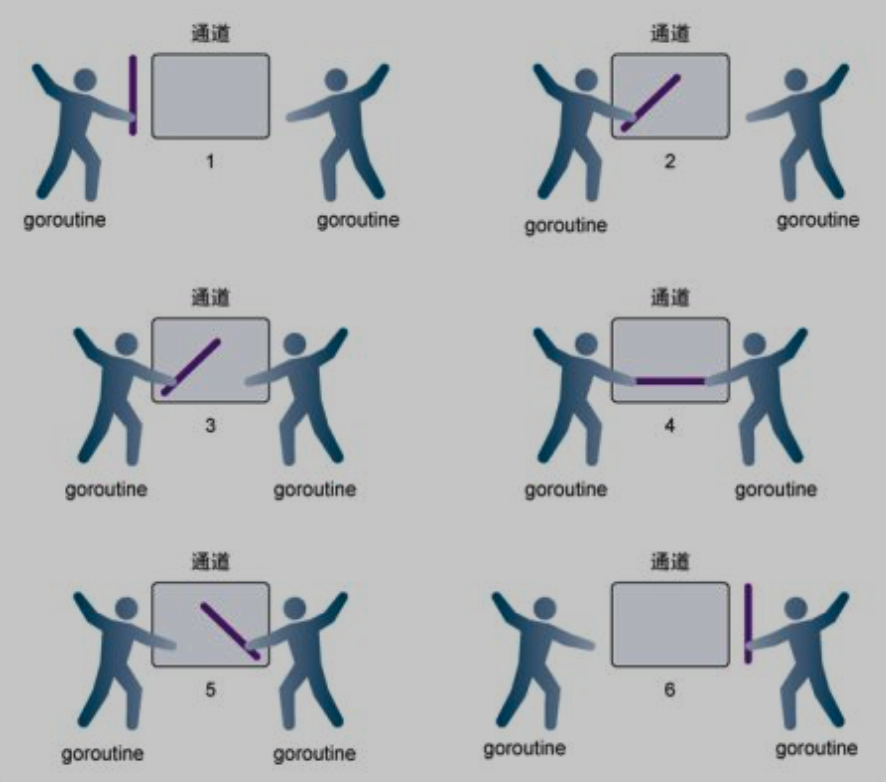

从上面无缓冲的通道定义来看，发送 `goroutine` 和接收 `gouroutine` 必须是同步的，同时准备后，如果没有同时准备好的话，先执行的操作就会阻塞等待，直到另一个相对应的操作准备好为止。这种无缓冲的通道我们也称之为同步通道。

① 不可以在同一个 `goroutine` 中既读又写，否则将会死锁。

示例：

```go
package main

import "fmt"

// 结果：fatal error: all goroutines are asleep - deadlock!

// 解析：不可以在同一个 goroutine 中既读又写，否则将会死锁。
func main() {
    ch := make(chan int)

    ch <- 2
    x := <-ch
    fmt.Println(x)
}
```

② 两个`goroutine`中使用无缓冲的`channel`，则读写互为阻塞，即双方代码的执行都会阻塞在` <-ch` 和 `ch <-` 处，直到双方读写完成在 `ch` 中的传递，各自继续向下执行，此处借用`CSP` 图例说明：

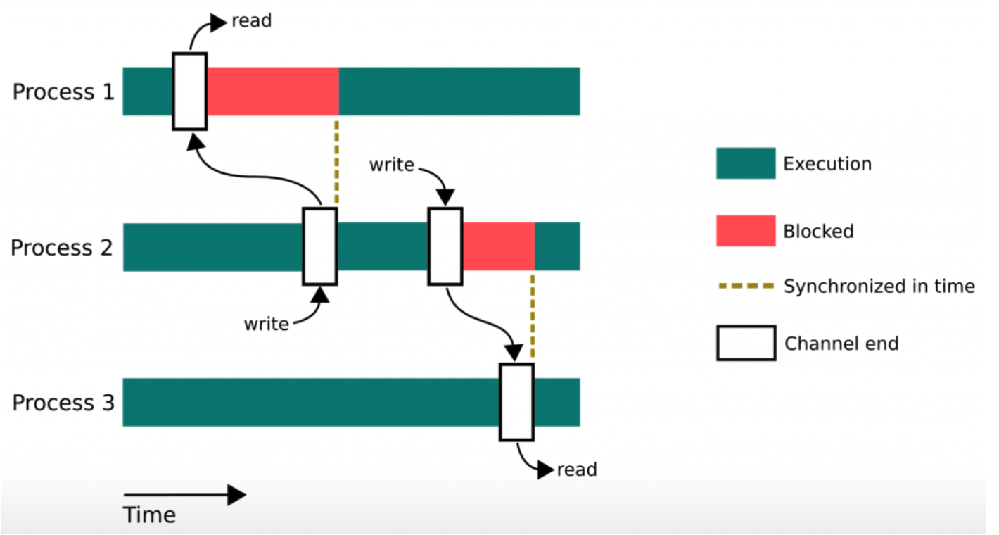

示例代码：

```go
// 结果：
// after write
// after read: 2

// 解析：两个 goroutine 中使用无缓冲的channel，则读写互为阻塞。
// 即双方代码的执行都会阻塞在 <-ch 和 ch <- 处，直到双方读写完成在 ch 中的传递，各自继续向下执行。
func main1() {
    ch := make(chan int)

    go func() {
        ch <- 2
        fmt.Println("after write")
    }()

    x := <-ch
    fmt.Println("after read:", x)
}
```

### 有缓冲的 `channel`

带缓冲的` channel`(`buffered channel`) 是一种在被接收前能存储一个或者多个值的通道。这种类型的通道并不强制要求 `goroutine `之间必须同时完成发送和接收。通道会阻塞发送和接收动作的条件也会不同。只有在通道中没有要接收的值时，接收动作才会阻塞。只有在通道没有可用缓冲区容纳被发送的值时，发送动作才会阻塞。

这导致有缓冲的通道和无缓冲的通道之间的一个很大的不同：**无缓冲的通道保证进行发送和接收的 `goroutine `会在同一时间进行数据交换；有缓冲的通道没有这种保证。**

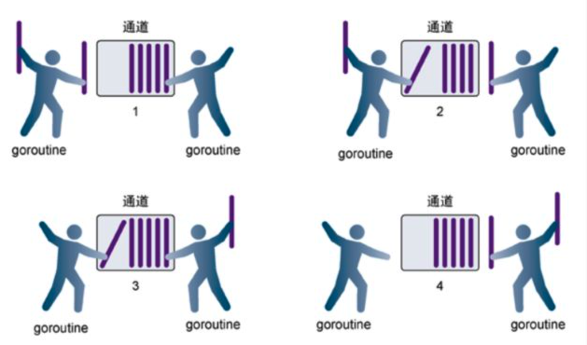

在 `make `时传递第二参 `capacity`，即为有缓冲的 `channel`：

```go
ch := make(chan int, 1)
```

这样的 `channel` 无论是否在同一 `goroutine` 中，均可读写而不致死锁，看看下面的代码输出什么内容：

```go
package main

import (
    "fmt"
)

func main() {
    ch := make(chan int, 1)
    for i := 0; i < 10; i++ {
        select {
        case x := <-ch:
            fmt.Println(x) // 0 2 4 6 8
        case ch <- i:
        }
    }
}
```

有无缓冲 `channel`的演示代码如下：

```go
// 无缓冲的 channel 由于没有缓冲发送和接收需要同步。
ch1 := make(chan int)
// 缓冲区为 3， 有缓冲 channel 不要求发送和接收操作同步。
ch2 := make(chan int, 3)
```

* 无缓冲的 `channel（unbuffered channel）`，其缓冲区大小则默认为 0。在功能上其接收者会阻塞等待并阻塞应用程序，直至收到通信和接收到数据。
* 有缓冲的 `channel（buffered channel）`，其缓存区大小是根据所设置的值来调整。在功能上，若缓冲区未满则不会阻塞，会源源不断的进行传输。当缓冲区满了后，发送者就会阻塞并等待。而当缓冲区为空时，接收者就会阻塞并等待，直至有新的数据。

### `close channel` 读写数据

<span id="chan03">对已经关闭的`chan`进行读写会怎么样？为什么？</span>

> 写已经关闭的 `chan` 会 `panic`。报错信息：`panic`:` send on closed channel`。
>
> 读已经关闭的 `chan` 能一直读到东⻄，但是读到的内容根据通道内关闭前是否有元素而不同。
> ① 如果 `chan` 关闭前，`buffer `内有元素还未读 , 会正确读到 `chan` 内的值，且返回的第二个 `bool `值(是否读成功)为 `true`。
> ② 如果 `chan` 关闭前，`buffer `内有元素已经被读完，`chan` 内无值，接下来所有接收的值都会非阻塞直接成功，返回 `channel` 元素的零值，第二个 `bool` 值一直为 `false`。

```go
package main

import "fmt"

func main() {
    fmt.Println("以下是数值的chan")
    ci := make(chan int, 3)
    ci <- 1
    close(ci)
    num, ok := <-ci
    fmt.Printf("第一次读chan的协程结束，num=%v， ok=%v\n", num, ok)
    num1, ok1 := <-ci
    fmt.Printf("第二次读chan的协程结束，num=%v， ok=%v\n", num1, ok1)
    num2, ok2 := <-ci
    fmt.Printf("第三次读chan的协程结束，num=%v， ok=%v\n", num2, ok2)
    fmt.Println()

    fmt.Println("以下是字符串chan")
    cs := make(chan string, 3)
    cs <- "aaa"
    close(cs)
    str, ok := <-cs
    fmt.Printf("第一次读chan的协程结束，str=%v， ok=%v\n", str, ok)
    str1, ok1 := <-cs
    fmt.Printf("第二次读chan的协程结束，str=%v， ok=%v\n", str1, ok1)
    str2, ok2 := <-cs
    fmt.Printf("第三次读chan的协程结束，str=%v， ok=%v\n", str2, ok2)
    fmt.Println()

    fmt.Println("以下是结构体chan")
    type MyStruct struct {
        Name string
    }
    cst := make(chan MyStruct, 3)
    cst <- MyStruct{Name: "ha"}
    close(cst)
    struct1, ok := <-cst
    fmt.Printf("第一次读chan的协程结束，struct=%v， ok=%v\n", struct1, ok)
    struct2, ok1 := <-cst
    fmt.Printf("第二次读chan的协程结束，struct=%v， ok=%v\n", struct2, ok1)
    struct3, ok2 := <-cst
    fmt.Printf("第三次读chan的协程结束，struct=%v， ok=%v\n", struct3, ok2)
}
```

运行结果：

```go
以下是数值的chan
第一次读chan的协程结束，num=1， ok=true
第二次读chan的协程结束，num=0， ok=false
第三次读chan的协程结束，num=0， ok=false

以下是字符串chan
第一次读chan的协程结束，str=aaa， ok=true
第二次读chan的协程结束，str=， ok=false
第三次读chan的协程结束，str=， ok=false

以下是结构体chan
第一次读chan的协程结束，struct={ha}， ok=true
第二次读chan的协程结束，struct={}， ok=false
第三次读chan的协程结束，struct={}， ok=false
```

### goroutine 泄露

<span id="chan04">关于`goroutine`泄露，下面的代码有什么问题？</span>

```go
package main

import (
    "fmt"
    "time"
)

// 知识点：关于 goroutine 泄漏，下面代码有什么问题？
// process 函数会启动一个 goroutine，去处理需要长时间处理的业务，处理完之后，会发送 true 到 chan 中，
// 目的是通知其它等待的 goroutine，可以继续处理了。主 goroutine 接收到任务处理完成的通知，或者超时后就返回了。这段代码有问题吗?
// 如果发生超时，process 函数就返回了，这就会导致 unbuffered 的 chan 从来就没有被读取。
// unbuffered chan 必须等 reader 和 writer 都准备好了才能交流，否则就会阻塞。
// 超时导致未读，结果就是子 goroutine 就阻塞在写永远结束不了，进而导致 goroutine 泄漏。
// 解决这个 Bug 的办法就是将 unbuffered chan 改成容量为 1 的 chan，这样写就不会被阻塞了。

func process(timeout time.Duration) bool {
    // ch := make(chan bool, 1)
    ch := make(chan bool)
    go func() {
        // 模拟处理耗时的业务
        // time.Sleep((timeout + time.Second))
        ch <- true // block
        fmt.Println("exit goroutine")
    }()
    select {
    case result := <-ch:
        return result
    case <-time.After(timeout):
        return false
    }
}

func main() {
    res := process(1 * time.Second)
    fmt.Println(res)
}
```


### 三种表现方式

`channel` 的关键字为 `chan`，数据流向的表现方式为 `<-`，代码解释方向是从左到右，据此就能明白通道的数据流转方向了。`channel `共有两种模式，分别是双向和单向；三种表现方式，分别是：

* 声明双向通道`chan T`（可读可写）， 示例：`var ch chan int`
* 声明发送通道`chan <- T`（只写），示例：`var ch chan<- int`
* 声明接收通道`<- chan T`（只读），示例：`var ch <-chan int` 

### `hchan` 源码分析

`channel`本质上是一个有锁的环形队列，外加发送方队列（`sendq`）、接收方队列（`recvq`），加上互斥锁 `mutex` 等结构。

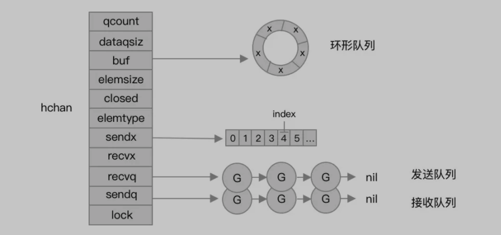

`hchan`结构体源码：`/src/runtime/chan.go` go版本：`1.15.11`

* 通过`buf `来保存`G`之间传输的数据。
* 通过两个队列`recvq`和`sendq`来保存发送和接收的 G。
* 通过`mutex`来保护数据安全。

```go
type hchan struct {
  // 队列中元素的总数
	qcount   uint           // total data in the queue
  // 循环队列的长度
	dataqsiz uint           // size of the circular queue
  // 指向长度为 dataqsiz 的底层数组，仅有当 channel 为缓冲型的才有意义
	buf      unsafe.Pointer // points to an array of dataqsiz elements 
  // 能够接受和发送的元素大小
	elemsize uint16 // chan中元素的大小
	closed   uint32 // 是否已close 1 表示已关闭 0 表示未关闭
	elemtype *_type // element type
  sendx    uint   // send index (ch <- xxx)
  recvx    uint   // receive index  (ch <- xxx)
	recvq    waitq  // list of recv waiters 
  // 发送者的 sudog 等待队列
	sendq    waitq  // list of send waiters 

	// lock protects all fields in hchan, as well as several
	// fields in sudogs blocked on this channel.
	//
	// Do not change another G's status while holding this lock
	// (in particular, do not ready a G), as this can deadlock
	// with stack shrinking.
	lock mutex // map不是线程安全的，但是channel是线程安全的，因为这里有互斥锁
}

type waitq struct {
	first *sudog
	last  *sudog
}

type sudog struct {
	g *g // 指向当前的 goroutine

	next *sudog // 指向下一个 g
	prev *sudog // 指向上一个 g
	elem unsafe.Pointer // data element (may point to stack) 数据元素，可能会指向堆栈
  ....
	c        *hchan // channel
}
```

### 实现源码分析

`channel` 的四大块操作分别是：创建`chan`、发送数据、接收数据、关闭`chan`。接下来从源码角度进行分析。

#### 创建`chan`

创建 `channel` 的演示代码：

```go
ch := make(chan int , 3) // 初始化环形队列 buf，初始化发送和接收的索引
// 通用创建方法
func makechan(t *chantype, size int) *hchan
// 类型为 int64 的进行特殊处理
func makechan64(t *chantype, size int64) *hchan
```

创建 `channel `的逻辑主要分为三大块：

- 当前 `channel` 不存在缓冲区，也就是元素大小为 0 的情况下，就会调用 `mallocgc` 方法分配一段连续的内存空间。
- 当前 `channel` 存储的类型存在指针引用，就会连同 `hchan` 和底层数组同时分配一段连续的内存空间。
- 通用情况，默认分配相匹配的连续内存空间。

需要注意到一块特殊点，那就是 `channel` 的创建都是调用的 `mallocgc` 方法，也就是 `channel` 都是创建在堆上的。因此 `channel` 是会被 `GC` 回收的，自然也不总是需要 `close` 方法来进行显示关闭了。

`makechan` 源码路径为：`src/runtime/chan.go`

```go
func makechan(t *chantype, size int) *hchan {
	elem := t.elem

	// compiler checks this but be safe.
	if elem.size >= 1<<16 {
		throw("makechan: invalid channel element type")
	}
	if hchanSize%maxAlign != 0 || elem.align > maxAlign {
		throw("makechan: bad alignment")
	}

	mem, overflow := math.MulUintptr(elem.size, uintptr(size))
	if overflow || mem > maxAlloc-hchanSize || size < 0 {
		panic(plainError("makechan: size out of range"))
	}

	var c *hchan
	switch {
	case mem == 0:
		// Queue or element size is zero.
		c = (*hchan)(mallocgc(hchanSize, nil, true))
		// Race detector uses this location for synchronization.
		c.buf = c.raceaddr()
	case elem.ptrdata == 0:
		// Elements do not contain pointers.
		// Allocate hchan and buf in one call.
		c = (*hchan)(mallocgc(hchanSize+mem, nil, true))
		c.buf = add(unsafe.Pointer(c), hchanSize)
	default:
		// Elements contain pointers.
		c = new(hchan)
		c.buf = mallocgc(mem, elem, true)
	}

	c.elemsize = uint16(elem.size)
	c.elemtype = elem
	c.dataqsiz = uint(size)
	lockInit(&c.lock, lockRankHchan)

	if debugChan {
		print("makechan: chan=", c, "; elemsize=", elem.size, "; dataqsiz=", size, "\n")
	}
	return c
}
```

`makechan` 方法的逻辑比较简单，就是创建 `hchan` 并分配合适的 `buf` 大小的堆上内存空间。

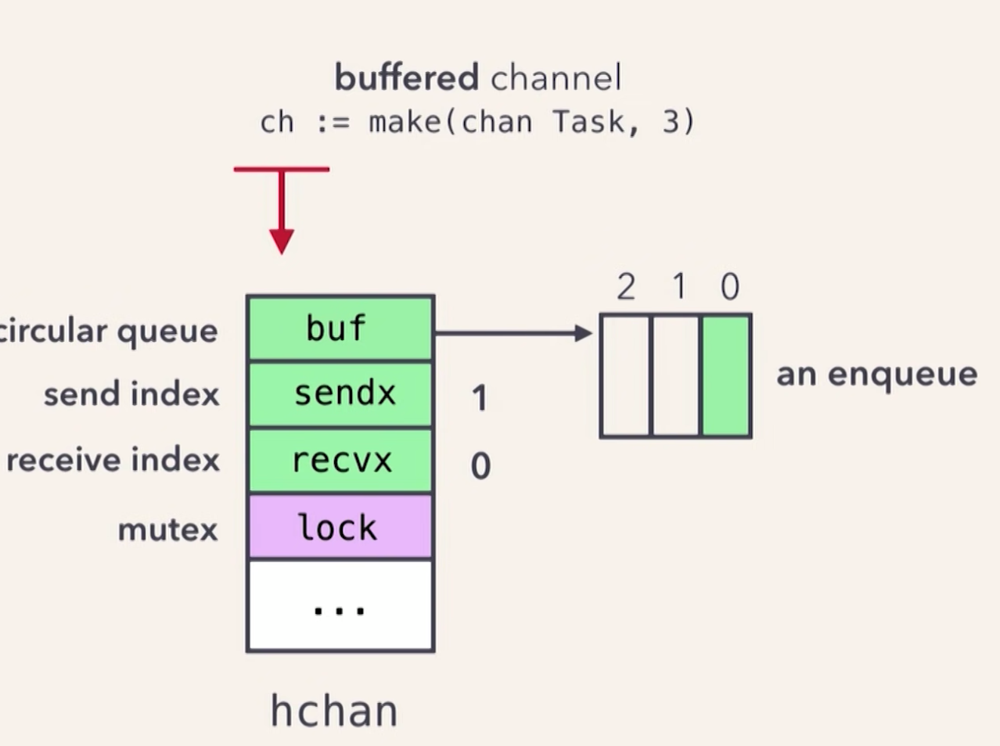

#### 发送数据

`channel` 发送数据的演示代码：

```go
go func() {
    ch <- "wangxiong"
}()
```

其在编译器翻译后对应 `runtime/chan.go/chansend1` 方法：

```go
// entry point for c <- x from compiled code
// go:nosplit
func chansend1(c *hchan, elem unsafe.Pointer) {
	chansend(c, elem, true, getcallerpc())
}
```

其作为编译后的入口方法，实则指向真正的实现逻辑，也就是 `chansend` 方法。 `chansend` 方法主要完成以下几个事情。

*  `chan` 发送前的前置判断和处理。
* 在进入发送数据的处理前，`channel `会进行上锁。
* 在正式开始发送前，加锁之后，会对 `channel `进行一次状态判断（是否关闭），未关闭直接发送。
* 非直接发送，判断 channel 缓冲区中是否还有空间，如果有进行缓冲发送，否则进入阻塞发送。

```go
// src/runtime/chan.go
func chansend(c *hchan, ep unsafe.Pointer, block bool, callerpc uintptr) bool {
  // ① chan 发送前的前置判断和处理。
	if c == nil {
		if !block {
			return false
		}
    // 若为 nil，在逻辑上来讲就是向 nil channel 发送数据。
    // 就会调用 gopark 方法使得当前 Goroutine 休眠，进而出现死锁崩溃，表象就是出现 panic 事件来快速失败。
		gopark(nil, nil, waitReasonChanSendNilChan, traceEvGoStop, 2)
		throw("unreachable")
	}
  ......
  // 对非阻塞的 channel 进行一个上限判断，看看是否快速失败。
  // 若非阻塞且未关闭，同时底层数据 dataqsiz 大小为 0（缓冲区无元素），则会返回失败。
  // 若是 qcount 与 dataqsiz 大小相同（缓冲区已满）时，则会返回失败。
	if !block && c.closed == 0 && full(c) {
		return false
	}
  ......
  // ② 在进入发送数据的处理前，channel 会进行上锁，保障并发安全
	lock(&c.lock)

	if c.closed != 0 {
		unlock(&c.lock)
		panic(plainError("send on closed channel"))
	}

  // ③ 有正在阻塞等待的接收方，则直接发送。
	if sg := c.recvq.dequeue(); sg != nil {
		// Found a waiting receiver. We pass the value we want to send
		// directly to the receiver, bypassing the channel buffer (if any).
		send(c, sg, ep, func() { unlock(&c.lock) }, 3)
		return true
	}

  // ④ 对缓冲区进行判定（qcount 和 dataqsiz 字段），以此识别缓冲区的剩余空间。
	if c.qcount < c.dataqsiz {
		// Space is available in the channel buffer. Enqueue the element to send.
    // 调用 chanbuf 方法，以此获得底层缓冲数据中位于 sendx 索引的元素指针值
		qp := chanbuf(c, c.sendx)
		if raceenabled {
			raceacquire(qp)
			racerelease(qp)
		}
    // 调用 typedmemmove 方法，将所需发送的数据拷贝到缓冲区中
		typedmemmove(c.elemtype, qp, ep)
    // 数据拷贝后，对 sendx 索引自行自增 1。
		c.sendx++
    // 若 sendx 与 dataqsiz 大小一致，则归 0（环形队列）。
		if c.sendx == c.dataqsiz {
			c.sendx = 0
		}
		c.qcount++ // 自增完成后，队列总数同时自增 1
		unlock(&c.lock) // 解锁互斥锁
		return true // 返回结果
	}
 // 未走进缓冲区处理的逻辑，判断当前是否阻塞 channel，若为非阻塞，将会解锁并直接返回失败。
	if !block {
		unlock(&c.lock)
		return false
	}

  // ⑤ 进入阻塞等待发送
  // 调用 getg 方法获取当前 goroutine 的指针，用于后续发送数据。
	gp := getg()
  // 调用 acquireSudog 方法获取 sudog 结构体，并设置当前 sudog 具体的待发送数据信息和状态。
	mysg := acquireSudog()
	......
  // 调用 c.sendq.enqueue 方法将刚刚所获取的 sudog 加入待发送的等待队列。
	c.sendq.enqueue(mysg)
  ......
  // 调用 gopark 方法挂起当前 goroutine（会记录执行位置），状态为 waitReasonChanSend，阻塞等待 channel。
	gopark(chanparkcommit, unsafe.Pointer(&c.lock), waitReasonChanSend, traceEvGoBlockSend, 2)
  // 调用 KeepAlive 方法保证待发送的数据值是活跃状态，也就是分配在堆上，避免被 GC 回收。
	KeepAlive(ep)

	// someone woke us up.
  // 从这里开始唤醒，并恢复阻塞的发送操作
	if mysg != gp.waiting {
		throw("G waiting list is corrupted")
	}
	gp.waiting = nil
	gp.activeStackChans = false
	......
	mysg.c = nil
	releaseSudog(mysg)
	return true
}
```

#### 接收数据

`channel` 接收数据的演示代码：

```go
msg := <-ch

msg, ok := <-ch
```

两种方法在编译器翻译后分别对应 `runtime.chanrecv1` 和 `runtime.chanrecv2` 两个入口方法，其再在内部再进一步调用 `runtime.chanrecv` 方法：

```go
// src/runtime/chan.go
// entry points for <- c from compiled code
//go:nosplit
func chanrecv1(c *hchan, elem unsafe.Pointer) {
	chanrecv(c, elem, true)
}

//go:nosplit
func chanrecv2(c *hchan, elem unsafe.Pointer) (received bool) {
	_, received = chanrecv(c, elem, true)
	return
}
```

 最终调用的是`chanrecv`方法：

```go
func chanrecv(c *hchan, ep unsafe.Pointer, block bool) (selected, received bool) {
	......
  // ① 若 channel 是非阻塞模式，则直接返回。
  // ② 若 channel 是 nil channel，且为阻塞接收则调用 gopark 方法挂起当前 goroutine。
	if c == nil {
		if !block {
			return
		}
		gopark(nil, nil, waitReasonChanReceiveNilChan, traceEvGoStop, 2)
		throw("unreachable")
	}

	// Fast path: check for failed non-blocking operation without acquiring the lock.
	if !block && empty(c) {
		// After observing that the channel is not ready for receiving, we observe whether the
		// channel is closed.
		//
		// Reordering of these checks could lead to incorrect behavior when racing with a close.
		// For example, if the channel was open and not empty, was closed, and then drained,
		// reordered reads could incorrectly indicate "open and empty". To prevent reordering,
		// we use atomic loads for both checks, and rely on emptying and closing to happen in
		// separate critical sections under the same lock.  This assumption fails when closing
		// an unbuffered channel with a blocked send, but that is an error condition anyway.
		if atomic.Load(&c.closed) == 0 {
			// Because a channel cannot be reopened, the later observation of the channel
			// being not closed implies that it was also not closed at the moment of the
			// first observation. We behave as if we observed the channel at that moment
			// and report that the receive cannot proceed.
			return
		}
		// The channel is irreversibly closed. Re-check whether the channel has any pending data
		// to receive, which could have arrived between the empty and closed checks above.
		// Sequential consistency is also required here, when racing with such a send.
		if empty(c) {
			// The channel is irreversibly closed and empty.
			if raceenabled {
				raceacquire(c.raceaddr())
			}
			if ep != nil {
				typedmemclr(c.elemtype, ep)
			}
			return true, false
		}
	}

	var t0 int64
	if blockprofilerate > 0 {
		t0 = cputicks()
	}

	lock(&c.lock)

	if c.closed != 0 && c.qcount == 0 {
		if raceenabled {
			raceacquire(c.raceaddr())
		}
		unlock(&c.lock)
		if ep != nil {
			typedmemclr(c.elemtype, ep)
		}
		return true, false
	}

  // channel 上有正在阻塞等待的发送方时，则直接进行接收
	if sg := c.sendq.dequeue(); sg != nil {
		recv(c, sg, ep, func() { unlock(&c.lock) }, 3)
		return true, true
	}

  // 当发现 channel 的缓冲区中有元素时，将会调用 chanbuf 方法，根据 recvx 的索引位置取出数据，找到要接收的元素进行处理。
	if c.qcount > 0 {
		// Receive directly from queue
		qp := chanbuf(c, c.recvx)
		if raceenabled {
			raceacquire(qp)
			racerelease(qp)
		}
    // 若所接收到的数据和所传入的变量均不为空，则会调用 typedmemmove 方法将缓冲区中的数据拷贝到所传入的变量中。
		if ep != nil {
			typedmemmove(c.elemtype, ep, qp)
		}
		typedmemclr(c.elemtype, qp)
		c.recvx++
		if c.recvx == c.dataqsiz {
			c.recvx = 0
		}
		c.qcount--
		unlock(&c.lock)
		return true, true
	}

	if !block {
		unlock(&c.lock)
		return false, false
	}

	// no sender available: block on this channel.
	gp := getg()
	mysg := acquireSudog()
	mysg.releasetime = 0
	if t0 != 0 {
		mysg.releasetime = -1
	}
	// No stack splits between assigning elem and enqueuing mysg
	// on gp.waiting where copystack can find it.
	mysg.elem = ep
	mysg.waitlink = nil
	gp.waiting = mysg
	mysg.g = gp
	mysg.isSelect = false
	mysg.c = c
	gp.param = nil
	c.recvq.enqueue(mysg)
	// Signal to anyone trying to shrink our stack that we're about
	// to park on a channel. The window between when this G's status
	// changes and when we set gp.activeStackChans is not safe for
	// stack shrinking.
	atomic.Store8(&gp.parkingOnChan, 1)
	gopark(chanparkcommit, unsafe.Pointer(&c.lock), waitReasonChanReceive, traceEvGoBlockRecv, 2)

	// someone woke us up
	if mysg != gp.waiting {
		throw("G waiting list is corrupted")
	}
	gp.waiting = nil
	gp.activeStackChans = false
	if mysg.releasetime > 0 {
		blockevent(mysg.releasetime-t0, 2)
	}
	closed := gp.param == nil
	gp.param = nil
	mysg.c = nil
	releaseSudog(mysg)
	return true, !closed
}
```

#### 关闭 `chan`

关闭 `channel` 主要是涉及到 `close` 关键字：

```go
close(ch)
```

其对应的编译器翻译方法为 `closechan` 方法：

```go
func closechan(c *hchan)
```

关闭`chan`源码解析：

```go
func closechan(c *hchan) {
  // 基本检查和关闭标志设置，保证 channel 不为 nil 和未关闭，保证边界。
	if c == nil {
		panic(plainError("close of nil channel"))
	}

	lock(&c.lock)
	if c.closed != 0 {
		unlock(&c.lock)
		panic(plainError("close of closed channel"))
	}
 
	if raceenabled {
		callerpc := getcallerpc()
		racewritepc(c.raceaddr(), callerpc, funcPC(closechan))
		racerelease(c.raceaddr())
	}

	c.closed = 1

	var glist gList

  // 将接受者的 sudog 等待队列（recvq）加入到待清除队列 glist 中。
	// release all readers
	for {
		sg := c.recvq.dequeue()
		if sg == nil {
			break
		}
		if sg.elem != nil {
			typedmemclr(c.elemtype, sg.elem)
			sg.elem = nil
		}
		if sg.releasetime != 0 {
			sg.releasetime = cputicks()
		}
		gp := sg.g
		gp.param = nil
		if raceenabled {
			raceacquireg(gp, c.raceaddr())
		}
		glist.push(gp)
	}

  // 将发送方也加入到到待清除队列 glist 中。
	// release all writers (they will panic)
	for {
		sg := c.sendq.dequeue()
		if sg == nil {
			break
		}
		sg.elem = nil
		if sg.releasetime != 0 {
			sg.releasetime = cputicks()
		}
		gp := sg.g
		gp.param = nil
		if raceenabled {
			raceacquireg(gp, c.raceaddr())
		}
		glist.push(gp)
	}
	unlock(&c.lock)

	// Ready all Gs now that we've dropped the channel lock.
	for !glist.empty() {
		gp := glist.pop()
		gp.schedlink = 0
		goready(gp, 3)
	}
}
```

### goroutine 和 channel 实现定时任务


### 控制协程的数量（协程池）


### 控制任务状态


## `GC` 垃圾回收机制

<span id="gc01">**`golang GC` 有了解吗？`GC ` 时会发生什么?**</span>

关于`GO`的GC发展里程碑如下：

* `GoV1.3`- 普通标记清除法，整体过程需要启动`STW`，效率极低。

* `GoV1.5`- 三色标记法， 堆空间启动写屏障，栈空间不启动，全部扫描之后，需要重新扫描一次栈(需要STW)，效率普通。

* `GoV1.8`-三色标记法+混合写屏障机制， 栈空间不启动，堆空间启动。整个过程几乎不需要`STW`，效率较高。


<span id="gc02">**什么是标记清除法？它的整体流程有哪些？它最大的缺点是什么？**</span>

### V1.3 标记清除 `(mark and sweep)`

`Go V1.3` 之前的标记清除(`mark and sweep`)主要有两个主要的步骤：

- 标记(Mark phase)
- 清除(Sweep phase)

标记清除的整体流程：

* 第一步，暂停程序业务逻辑， 找出不不可达的对象(5和6)，和可达对象（1-2-3和4-7）。

  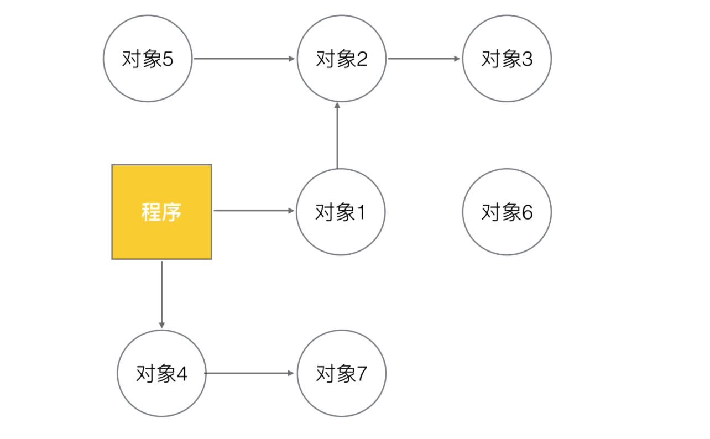

* 第⼆步，开始标记，程序找出它所有可达的对象（1-2-3和4-7），并做上标记。

  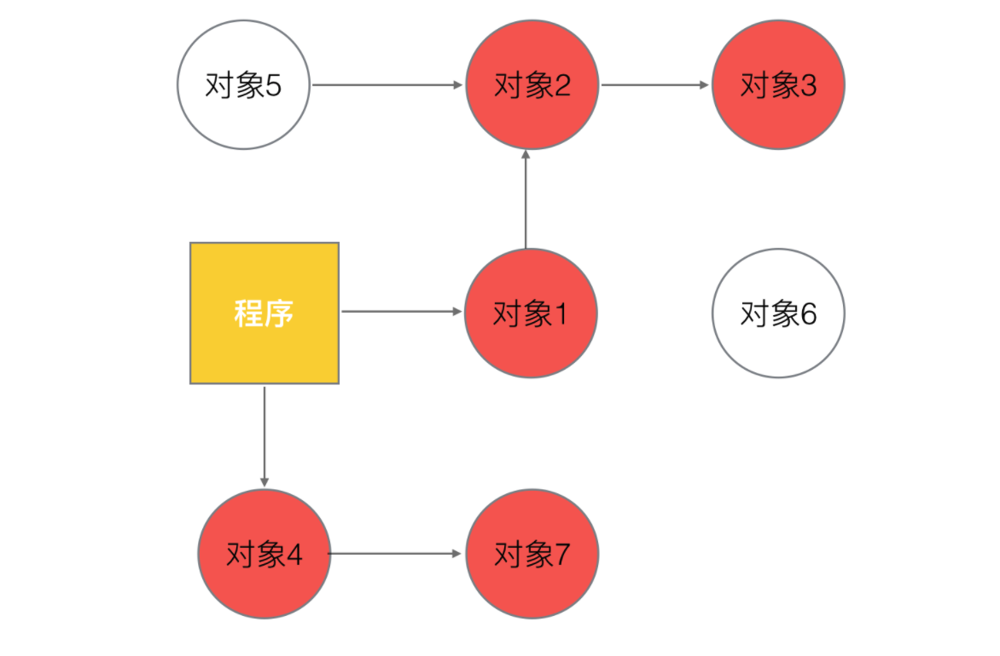

* 第三步，标记完了之后，然后开始清除未标记的对象（5和6）。

  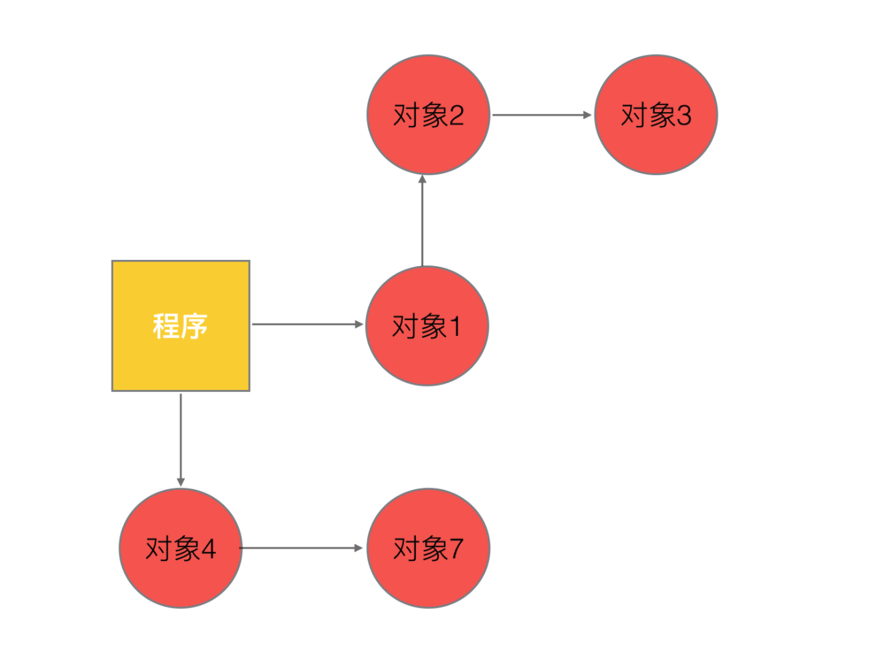

> 注：`mark and sweep`算法在执行的时候，需要程序暂停。即 `STW(stop the world)`，`STW`的过程中，`CPU`不执行用户代码，全部用于垃圾回收，这个过程的影响很大，所以`STW`也是一些回收机制最大的难题和希望优化的点。所以在执行第三步的这段时间，程序会暂定停止任何工作，卡在那等待回收执行完毕。

* 第四步，停⽌暂停，让程序继续跑。然后循环重复这个过程，直到`process`程序⽣生命周期结束。

`Go V1.3`版本之前就是按照以上来实施的, 在执行GC的基本流程就是首先启动`STW`暂停，然后执行标记，再执行数据回收，最后停止`STW`，如图所示。

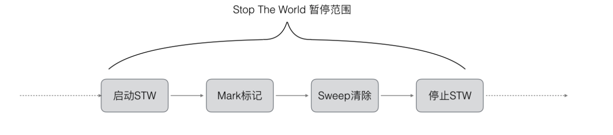

`Go V1.3` 做了简单的优化，将`STW`的步骤提前，减少`STW`暂停的时间范围。如下所示：

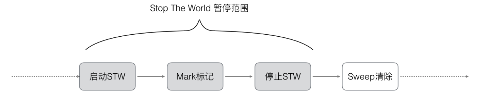

无论怎么优化，`Go V1.3`都面临这个一个重要问题，就是`mark-and-sweep` 算法会暂停整个程序 。

标记-清除(`mark and sweep`)的缺点：

- `STW`，`stop the world`；让程序暂停，程序出现卡顿 **(重要问题)**；
- 标记需要扫描整个`heap`；
- 清除数据会产生`heap`碎片。

`Go V1.3`都面临这个一个重要问题，就是`mark-and-sweep` 算法会暂停整个程序。`Go`是如何面对并这个问题的呢？接下来`Go V1.5`版本就用**三色并发标记法**来优化这个问题。


### V1.5 三⾊标记法

<span id="gc03">**什么是三色标记法？标记过程中不使用`STW`将会发生什么事情？如何解决？**</span>

> 三色标记法：通过三个阶段的标记来确定需要清除的对象。具体步骤，① 新创建的对象都标记为白色。② 遍历根节点遍象，将遍历到的对象从白色集合放到灰色集合。③ 遍历灰色集合，将灰色对象引用的白色放到灰色集合，同时灰色对象放入黑色集合。④ 重复第三步，直至灰色集合中无任何对象。⑤ 回收白色对象，也就是回收垃圾。
>
> 不使用`STW`：标记过程中不使用`STW`将会出现对象丢失现象。
>
> 解决方案：插入屏障（强三色不变式）和删除屏障（弱三色不变式）。

所谓三色标记法实际上就是通过三个阶段的标记来确定需要清除的对象都有哪些。

* 第一步 ，每次新创建的对象，默认的颜色都是标记为**白色**，如图所示。

  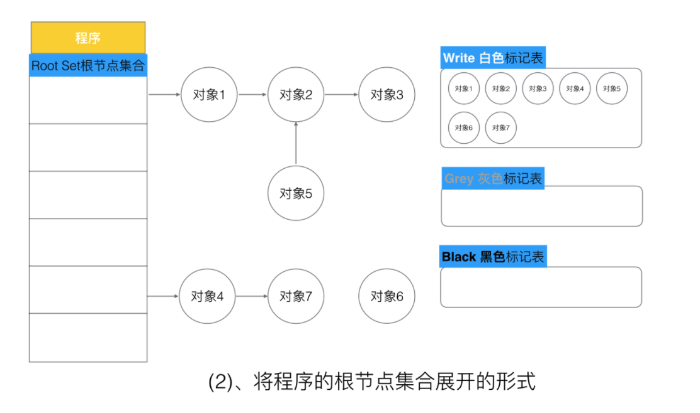

* 第二步，每次`GC`回收开始，会从根节点开始遍历所有对象，把遍历到的对象从白色集合放入**灰色**集合如图所示。

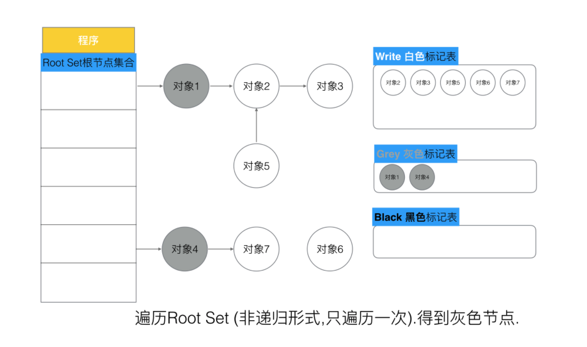

* 遍历灰色集合，将灰色对象引用的对象从白色集合放入灰色集合，之后将此灰色对象放入黑色集合，如图所示。

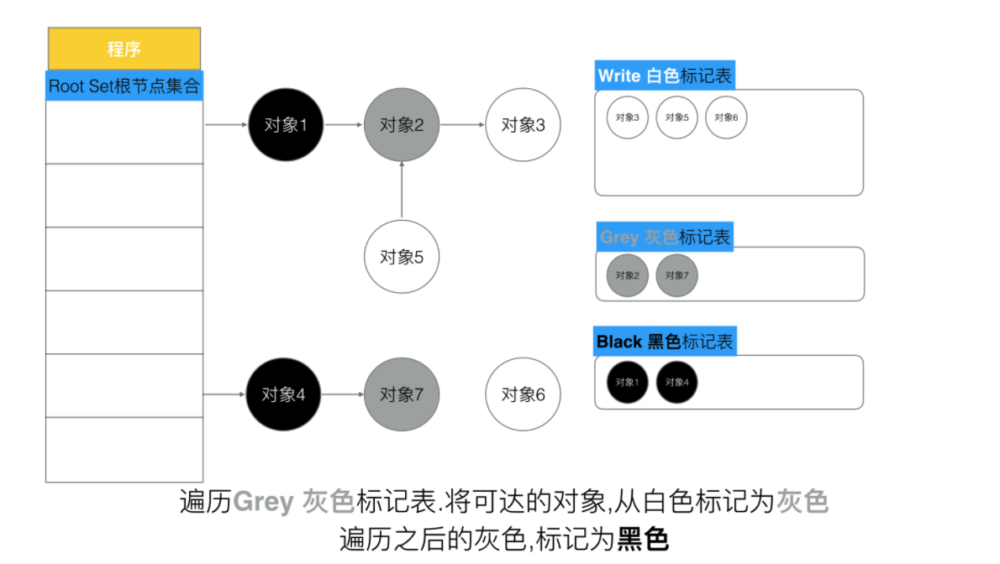

* **第四步**, 重复**第三步**, 直到灰色中无任何对象，如图所示。

  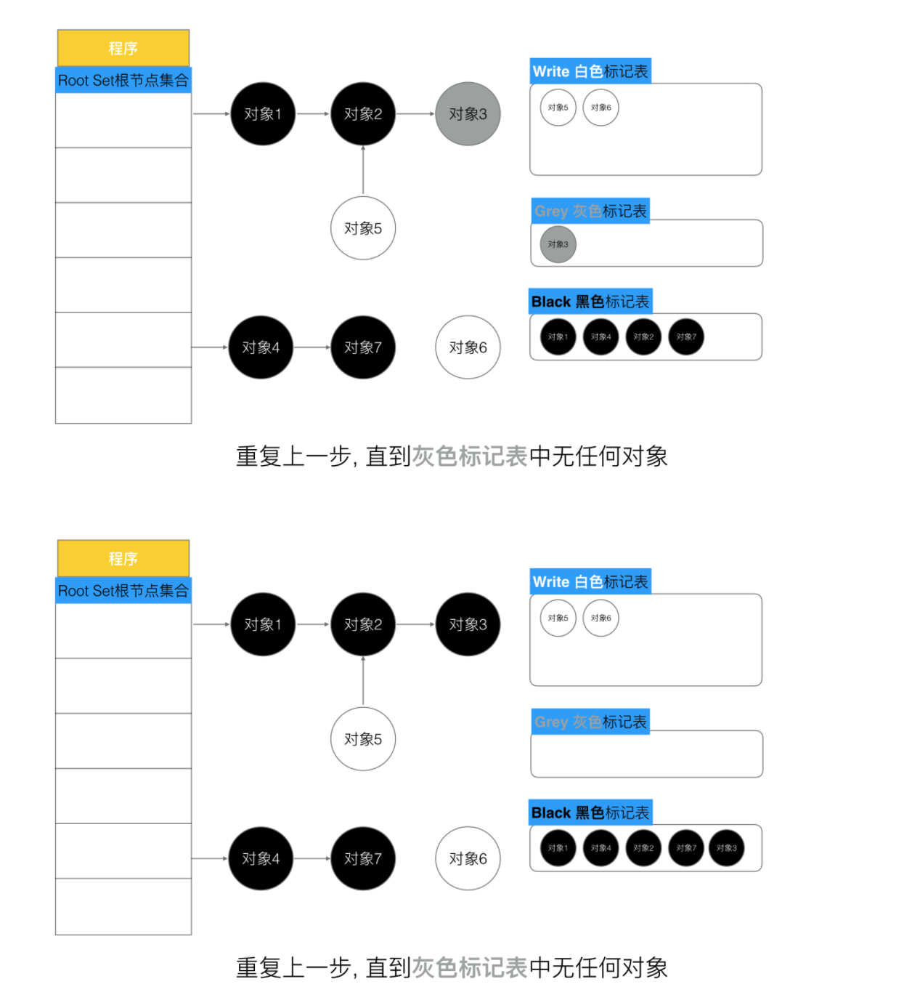

* **第五步**: 回收所有的白色标记表的对象，也就是回收垃圾，如图所示。

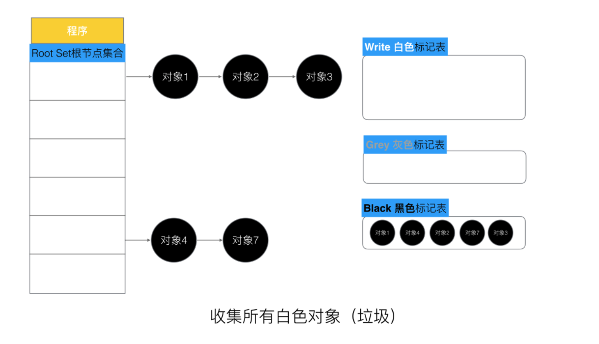

以上我们将全部的白色对象进行删除回收，剩下的就是全部依赖的黑色对象。

以上便是`三色并发标记法`，不难看出，我们上面已经清楚的体现`三色`的特性。但是这里面可能会有很多并发流程均会被扫描，执行并发流程的内存可能相互依赖，为了在`GC`过程中保证数据的安全，我们在开始三色标记之前就会加上`STW`，在扫描确定黑白对象之后再放开`STW`。但是很明显这样的`GC`扫描的性能实在是太低了。

如果三色标记法，标记过程不使用`STW`将会发生什么事情?

第一步，假设目前黑色的有对象1和对象4， 灰色的有对象2和对象7，其他的为白色对象，且对象2是通过指针p指向对象3的，如图所示。

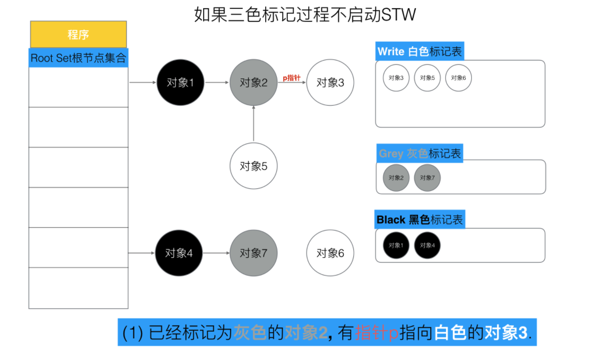

第二步，目前黑色的有对象1和对象4， 灰色的有对象2和对象7，其他的为白色对象，且对象2是通过指针p指向对象3的，如图所示。

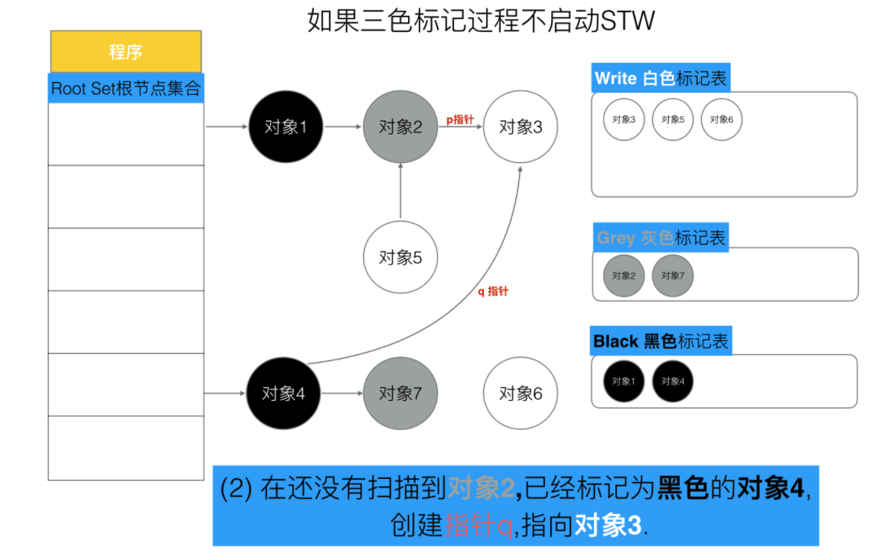

第三步，与此同时灰色的对象2将指针p移除，那么白色的对象3实则就是被挂在了已经扫描完成的黑色的对象4下，如图所示。

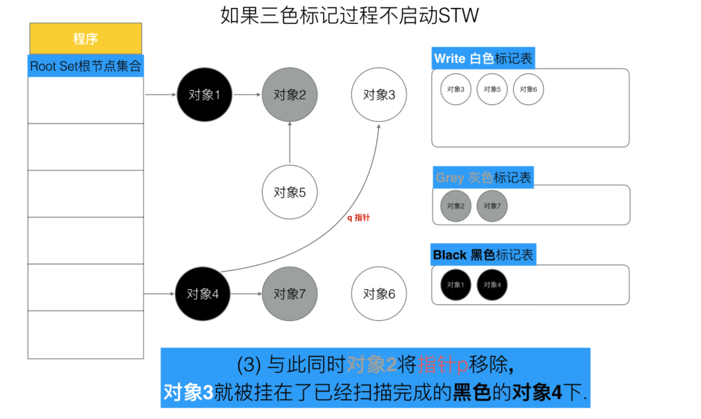

第四步，正常指向三色标记的算法逻辑，将所有灰色的对象标记为黑色，那么对象2和对象7就被标记成了黑色，如图所示。

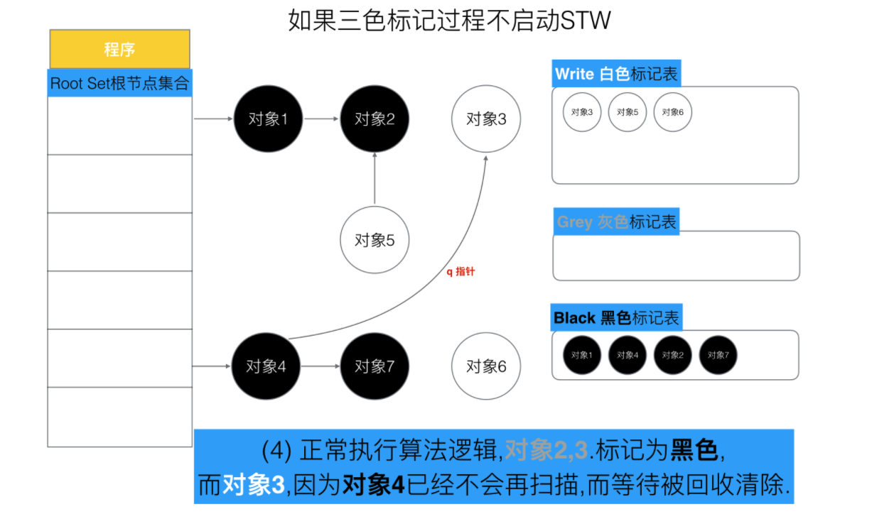

第五步，执行了三色标记的最后一步，将所有白色对象当做垃圾进行回收，如图所示。

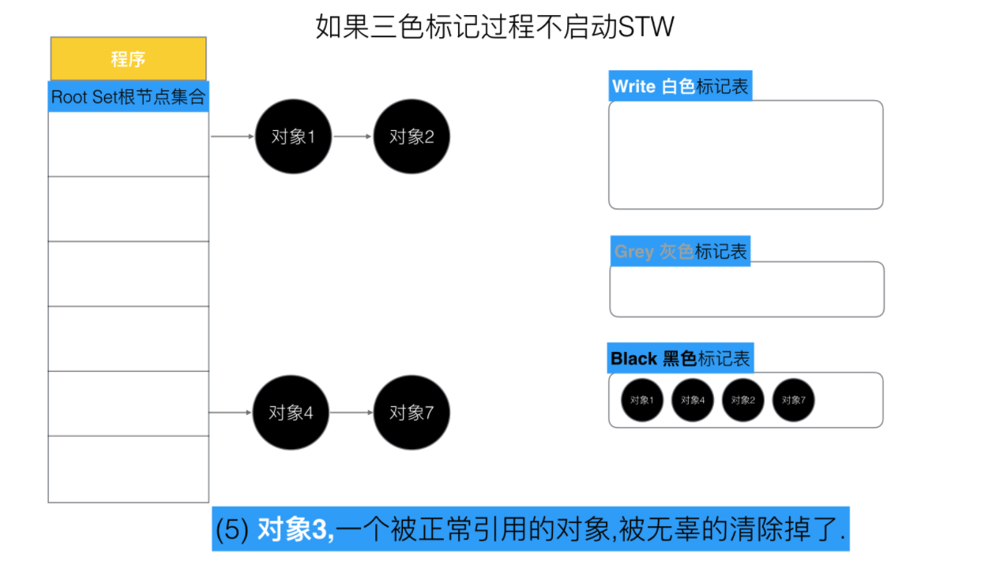

>  结果：本来是对象4合法引用的对象3，却被GC给“误杀”回收掉了。如果示例中的白色对象3还有很多下游对象的话，也会一并都清理掉。

在三色标记法中，出现对象丢失现象是不希望被发生的：

- 条件1： 一个白色对象被黑色对象引用**(白色被挂在黑色下)**；(强三色不变式可解决)
- 条件2： 灰色对象与它之间的可达关系的白色对象遭到破坏**(灰色同时丢了该白色)**。（弱三色不变式可解决）

如果当以上两个条件同时满足时，就会出现对象丢失现象！如果三色标记过程不启动`STW`，那么在`GC`扫描过程中，任意的对象均可能发生读写操作，如图所示，在还没有扫描到对象2的时候，已经标记为黑色的对象4，此时创建指针q，并且指向白色的对象3。

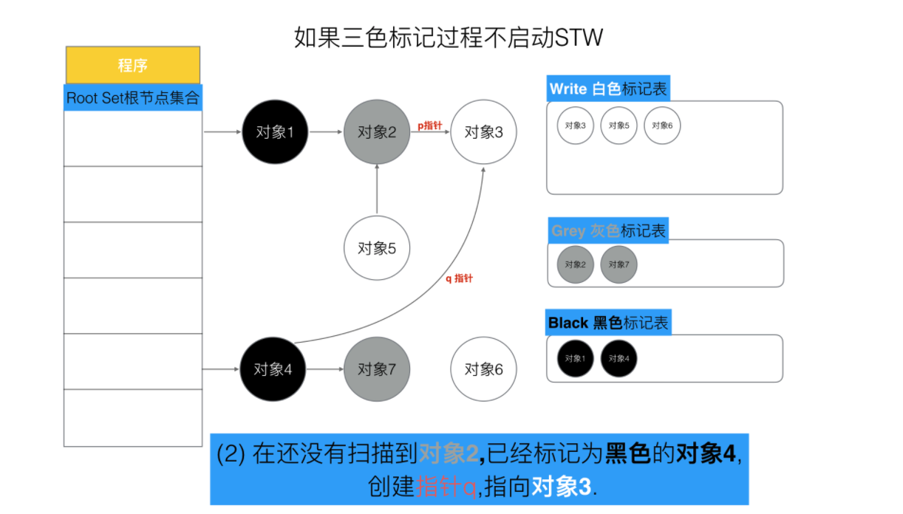

为了防止这种现象的发生，最简单的方式就是`STW`，直接禁止掉其他用户程序对对象引用关系的干扰，但是**`STW`的过程有明显的资源浪费，对所有的用户程序都有很大影响**。那么是否可以在保证对象不丢失的情况下合理的尽可能的提高GC效率，减少STW时间呢？答案是可以的，我们只要使用一种机制，尝试去破坏上面的两个必要条件就可以了。

#### 强三色不变式 vs 弱三色不变式

<span id="gc04">什么是强三色不变式？什么是弱三色不变式？它们为了解决什么问题？</span>

>  强三色不变式：强制性的不允许黑色对象引用白色对象。
>
> 弱三色不变式：黑色对象可以引用白色对象，但是白色对象存在其他灰色对象的引用，或者可达它的链路上游存在灰色对象。
>
> 强三色不变式是为了破坏三色标记法中不希望出现现象的条件1，一个白色对象被黑色对象引用**(白色被挂在黑色下)**，而被误杀的情况。
>
> 弱三色不变式是为了破坏三色标记法中不希望出现现象的条件2，灰色对象与它之间的可达关系的白色对象遭到破坏**(灰色同时丢了该白色)**。

强三色不变色实际上是强制性的不允许黑色对象引用白色对象，这样就不会出现有白色对象被误删的情况。

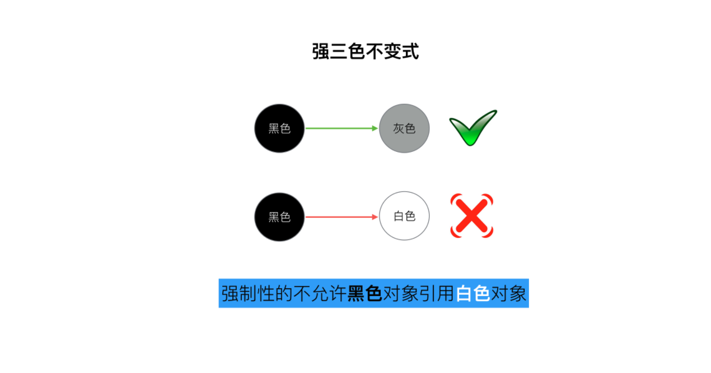弱三色不变式强调，黑色对象可以引用白色对象，但是这个白色对象必须存在其他灰色对象对它的引用，或者可达它的链路上游存在灰色对象。 这样实则是黑色对象引用白色对象，白色对象处于一个危险被删除的状态，但是上游灰色对象的引用，可以保护该白色对象，使其安全。

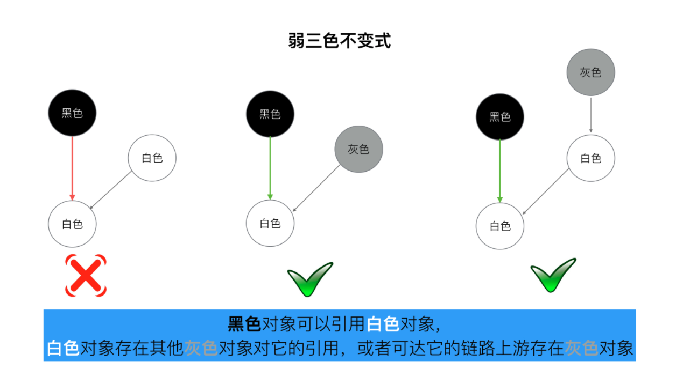

#### 插入屏障  vs 删除屏障

<span id="gc05">什么是插入屏障？什么是删除屏障？他们的缺点是什么？</span>

>* 插入屏障（**强三色不变式**）的原理：在A对象引用B对象的时候，B对象被标记为灰色。（将B挂在A下游，B必须被标记为灰色，不存在黑色对象引用白色对象的情况， 因为白色会强制变成灰色）。
>
>* 删除屏障（**弱三色不变式**）的原理：被删除的对象，如果自身为灰色或者白色，那么被标记为灰色。（被删除的对象，如果自身为灰色或者白色，那么被标记为灰色）。
>* **插入屏障的缺点**：栈空间使用了`STW`扫描暂停，性能不佳。由于是在堆空间使用的插入屏障，而在栈空间还得使用`STW`来暂停进行三色标记扫描，结束时需要STW来重新扫描栈，标记栈上引用的白色对象的存活，这还是会导致性能的影响。`STW`大约的时间在10~100ms间。
>* **删除屏障的缺点** ：这种方式的回收精度低。一个对象即使被删除了最后一个指向它的指针也依旧可以活过这一轮，在下一轮GC中被清理掉。

注：黑色对象的内存槽有两种位置，栈空间和堆空间。 栈空间的特点是容量小，但是要求相应速度快，因为函数调用弹出频繁使用，所以**插入屏障**机制在栈空间的对象操作中不使用，而仅仅使用在堆空间对象的操作中。但是如果栈不使用**插入屏障**机制，当全部三色标记扫描之后，栈上有可能依然存在白色对象被引用的情况， 所以要对栈重新进行三色标记扫描，但这次为了对象不丢失，要对本次标记扫描启动STW暂停，直到栈空间的三色标记结束。

> 插入屏障的整体流程（仅存堆空间）：

* ① 程序刚创建的对象标记为白色，将所有对象放入白色集合中。

  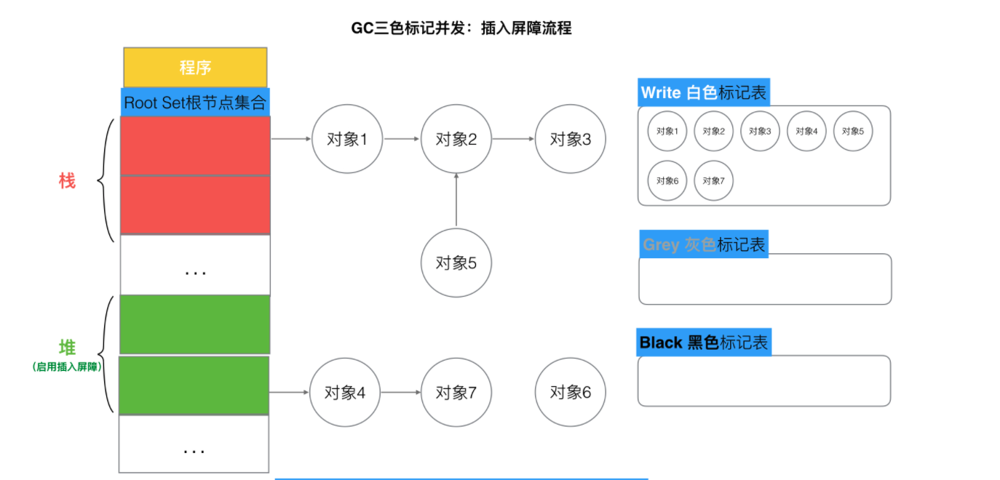

* ② 遍历根节点（非递归，只遍历一次），得到灰色对象。

  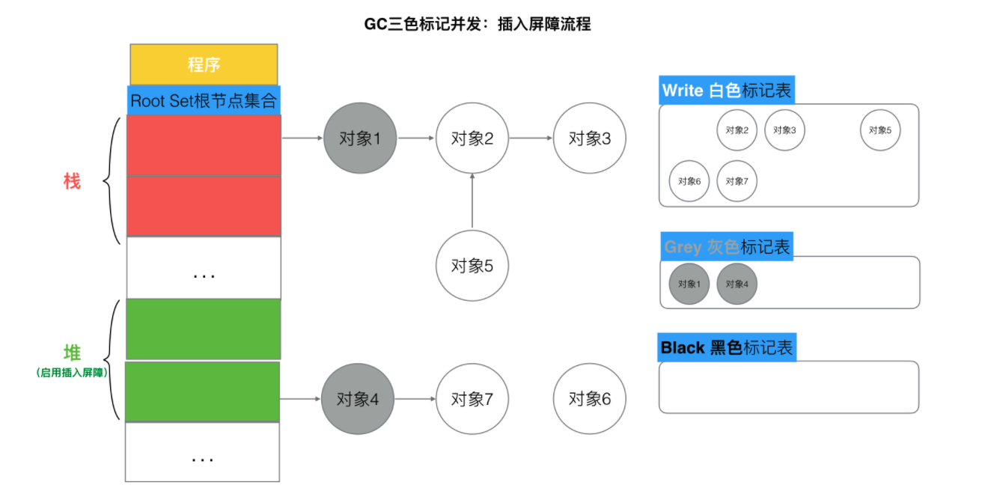

* ③ 遍历灰色标记表，将可达的对象，从白色标记为灰色，遍历之后的灰色标记为黑色。

  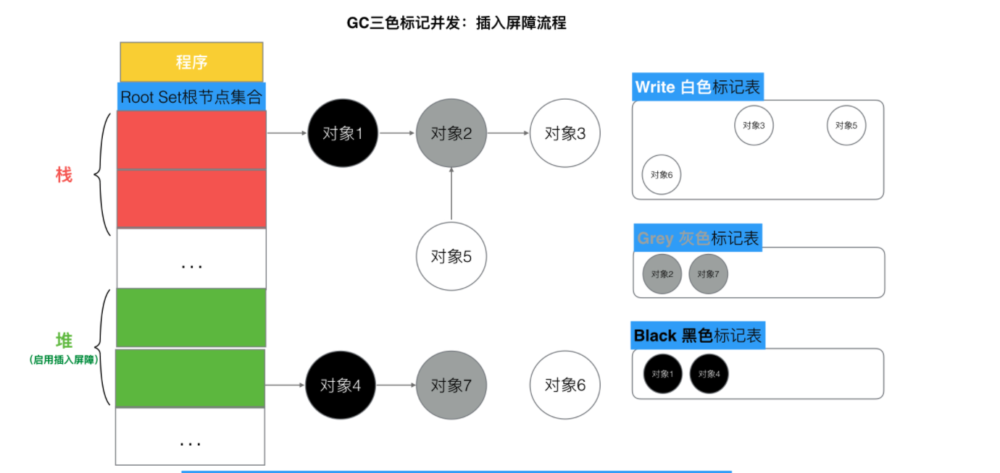

* ④ 由于并发特性，此刻外界向对象4添加对象8，对象1添加对象9。由于对象4位于堆空间，即将触发插入屏障，对象1在栈空间，不触发。

  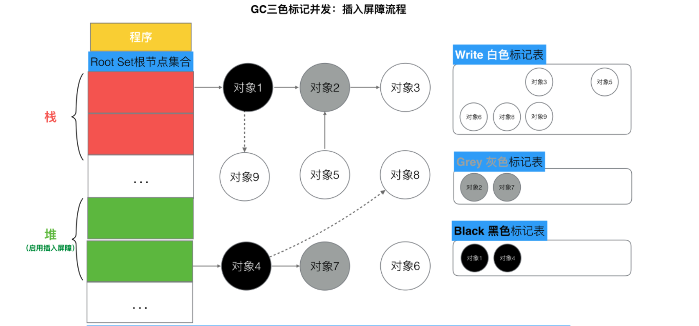

* ⑤ 由于插入写屏障，在堆空间黑色对象添加白色，会将白色改为灰色。对象8改为灰色，对象9依然为灰色。

  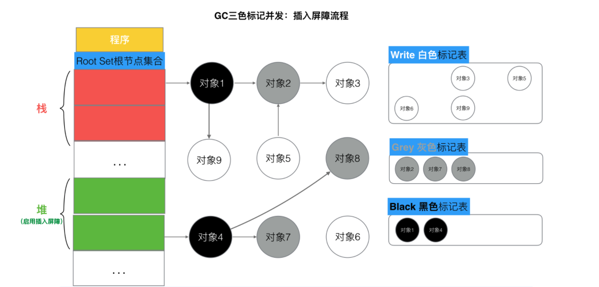

* ⑥ 继续循环上述流程进行三色标记，直至没有灰色节点。

   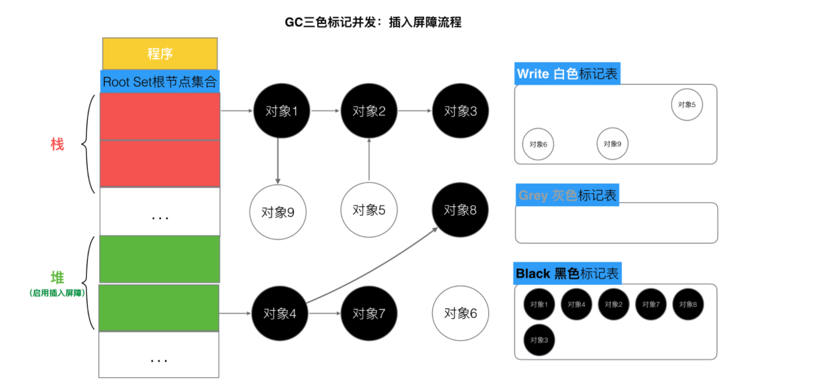

* ⑦ 在准备回收白色前，重新扫描一次栈空间，此时加STW暂停保护栈，防止外界干扰（有新的白色被黑色添加）。

  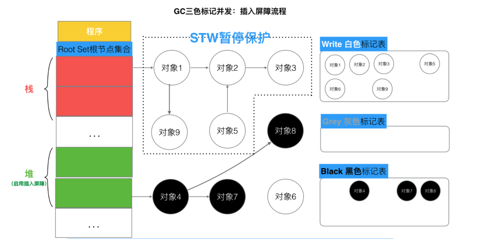

* ⑧ 在STW中，将栈中的对象进行三色标记，直至没有灰色对象为止。

  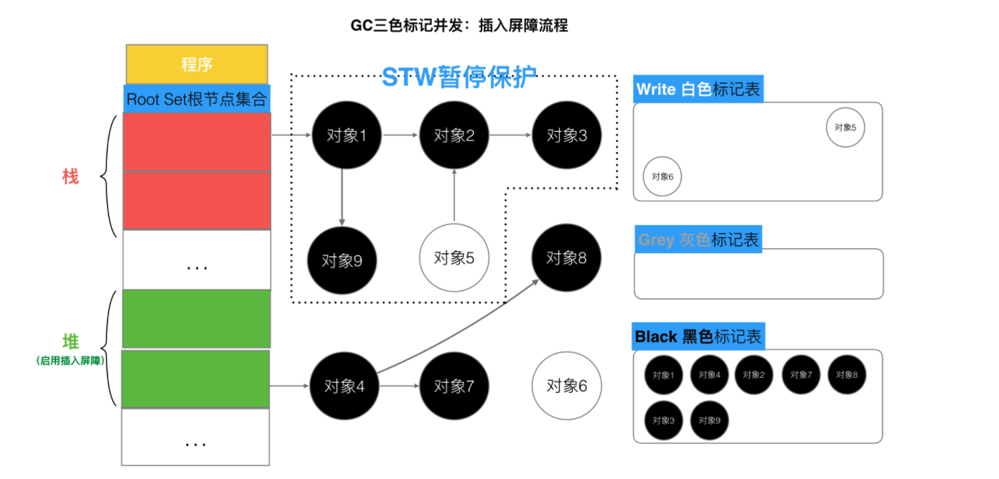

* ⑨ 停止STW，清除白色对象。

  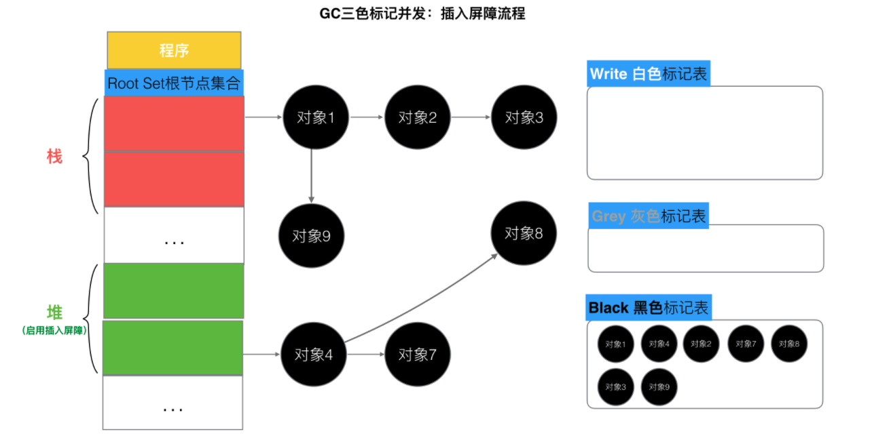

> 删除屏障的整体流程（不区分栈和堆空间）：

* ① 程序刚创建的对象标记为白色，将所有对象放入白色集合中。

  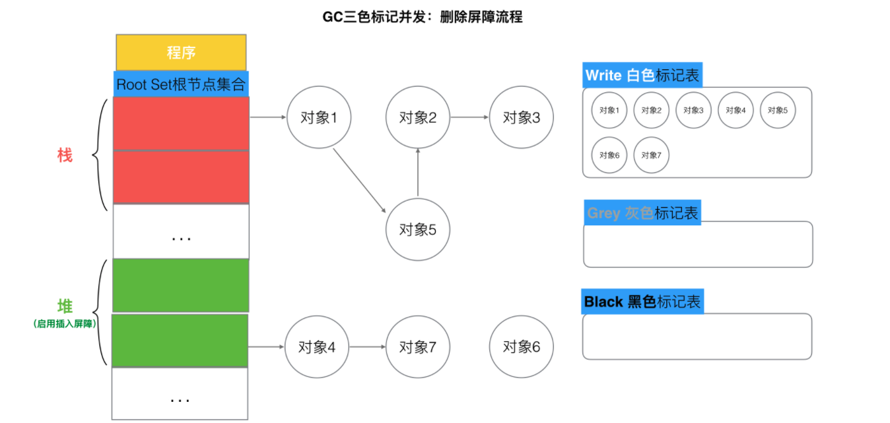 

* ② 遍历根节点（非递归，只遍历一次），得到灰色对象。

  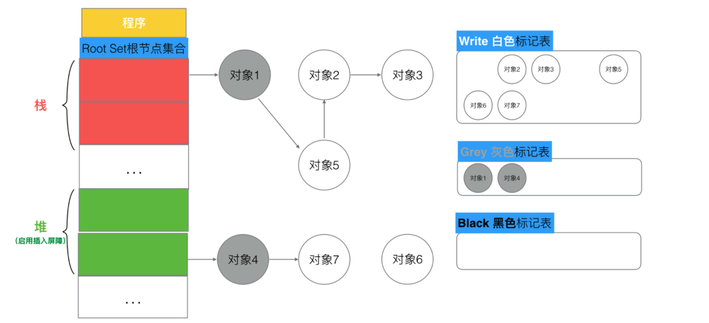

* ③ 灰色对象1删除对象5，如果不触发删除屏障，5-2-3路径与主路径断开，最后均会被清除。

  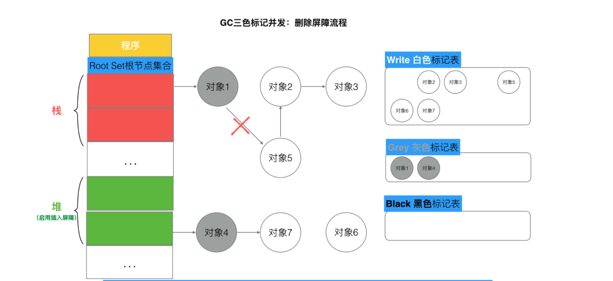

* ④ 触发删除屏障，被删除的对象5，自身被标记为灰色。

  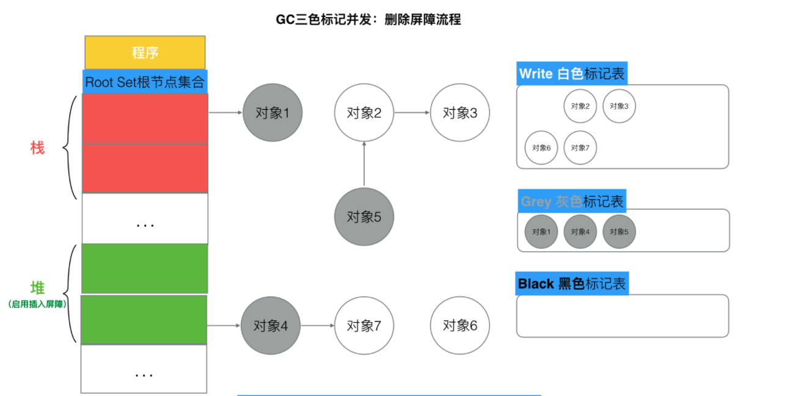

* ⑤ 遍历灰色标记表，将可达的对象白色标记为灰色，遍历之后的灰色标记为黑色。

  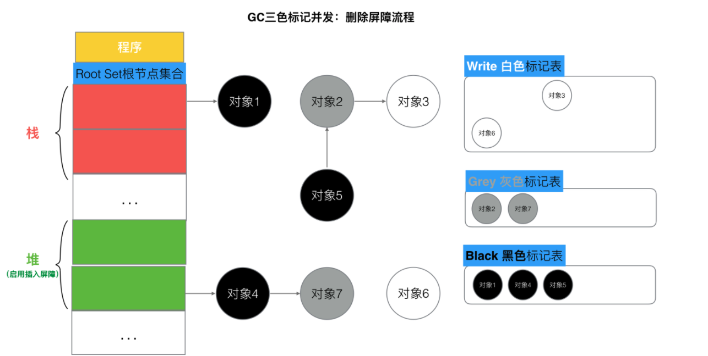

* ⑥ 继续循环上述流程进行三色标记，直至没有灰色节点。

  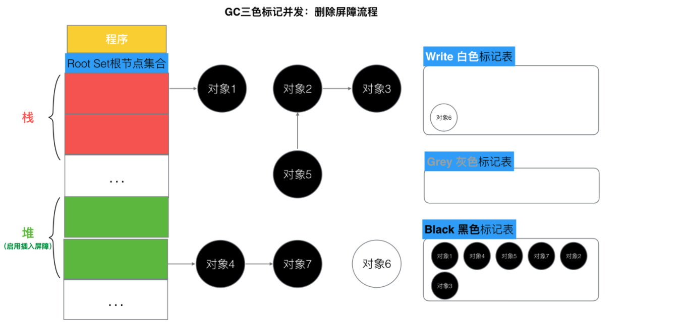

* ⑦ 清除白色对象。

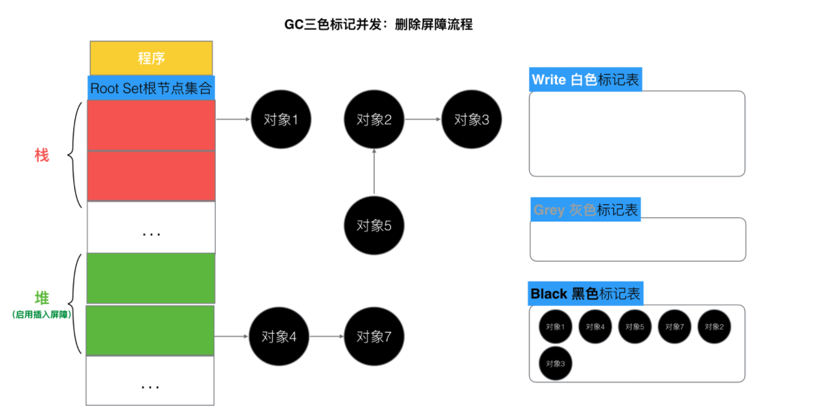

### V1.8 混合写屏障机制

<span id="gc06">为什么要引入混合写屏障机制？具体原理是什么？列举几个场景验证该机制是否合理？</span>

> - 引入混合写屏障机制是为了解决插入写屏障和删除写屏障的短板问题。
> - **插入写屏障**短板：结束时需要`STW`来重新扫描栈，标记栈上引用的白色对象的存活，性能不佳。
> - **删除写屏障**短板：回收精度低，`GC`开始时`STW`扫描堆栈来记录初始快照，这个过程会保护开始时刻的所有存活对象。
> - **具体操作**（两黑两灰）：① `GC`开始，优先扫描栈上的全部对象，将栈上可达对象标记为黑色。
> - ② `GC`期间，任何在栈上创建的新对象，均为黑色。
> - ③ 被删除的对象标记为灰色。
> - ④ 被添加的对象标记为灰色。
> - 场景一： **对象被一个堆对象删除引用，成为栈对象的下游**。
> - 场景二：**对象被一个栈对象删除引用，成为另一个栈对象的下游**。
> - 场景三：**对象被一个堆对象删除引用，成为另一个堆对象的下游**。
> - 场景四：**对象从一个栈对象删除引用，成为另一个堆对象的下游**。

注：混合写屏障机制的本质是**弱三色不变式**，为了保证栈的运行效率，屏障技术是不在栈上使用的。混合写屏障是`GC`的一种屏障机制，所以只是当程序执行`GC`的时候，才会触发这种机制。

* 场景一： **对象被一个堆对象删除引用，成为栈对象的下游**。堆区，对象4删除对象7时，触发删除写屏障，将对象7置为灰色，对象7此时为灰色，处于被保护的状态。栈区不启动任何写屏障，所以直接将对象7挂在对象1下面。

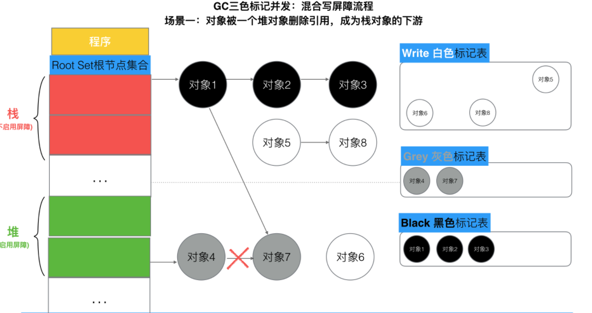


* 场景二：**对象被一个栈对象删除引用，成为另一个栈对象的下游**。新创建一个对象9，因为混合写屏障模式中，`GC`过程中任何新创建的对象均标记为黑色。栈中不启动任何写屏障，对象9直接添加下游引用对象3，对象2直接删除对象3的引用关系。

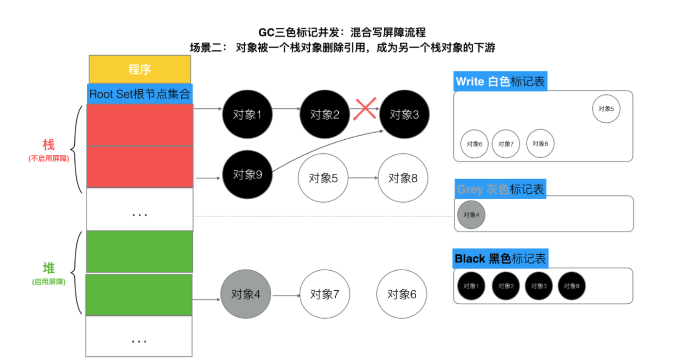

* 场景三：**对象被一个堆对象删除引用，成为另一个堆对象的下游**。堆对象10添加下游引用堆对象7，触发屏障机制，被添加的对象7标记为灰色，对象6被保护。堆对象4删除堆对象7，触发屏障机制，被删除的对象7标记为灰色。

  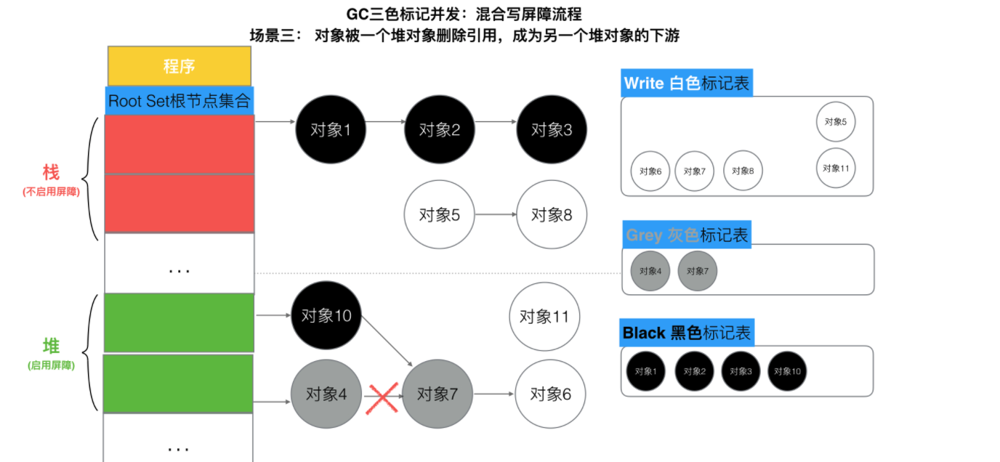

  

* 场景四：**对象从一个栈对象删除引用，成为另一个堆对象的下游**。栈对象1删除栈对象2的引用，栈空间不触发写屏障；堆对象4删除堆对象7的引用关系，转移至栈对象2，堆对象4在删除的时候触发屏障，标记堆对象7为灰色，保护堆对象7及其下游节点对象。

  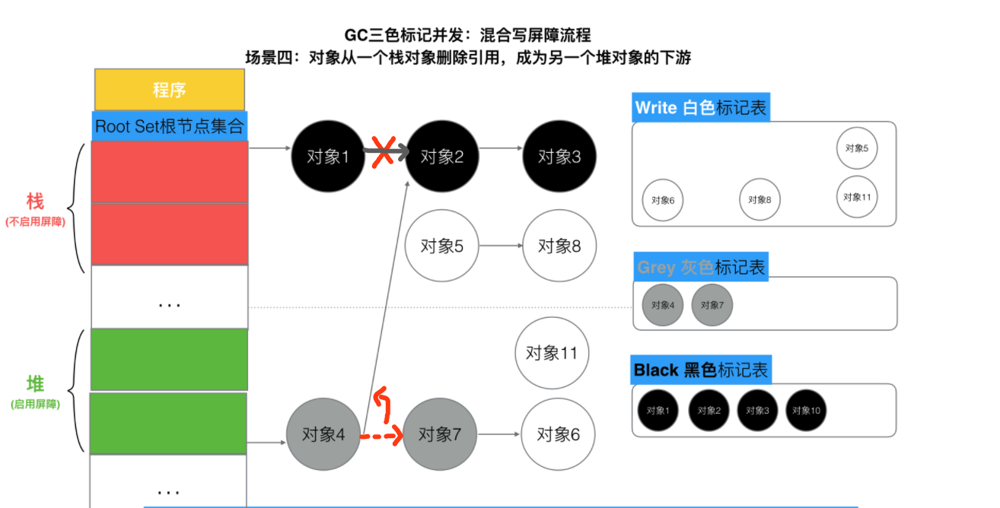

 `Golang`中的混合写屏障满足`弱三色不变式`，结合了删除写屏障和插入写屏障的优点，只需要在开始时并发扫描各个`goroutine`的栈，使其变黑并一直保持，这个过程不需要`STW`，而标记结束后，因为栈在扫描后始终是黑色的，也无需再进行`re-scan`操作了，避免了对栈`re-scan`的过程，极大的减少了`STW`的时间。

## 内存逃逸

<span id="escape">了解`golang`的**内存逃逸**吗？什么情况下会发生内存逃逸？如何避免内存逃逸？</span>

>本该分配到栈上的变量，跑到了堆上，这就导致了内存逃逸。栈上的变量随着函数的结束回收，不会有额外的性能开销，而堆上的空间，需要GC，会带来额外的性能开销。
>
>对一个引用类对象中的引用类成员进行赋值，可能出现逃逸现象。典型的场景如下：
>
>**场景一：方法内返回局部变量指针**。
>
>**场景二：向 channel 发送指针数据。**
>
>**场景三：在闭包中引用包外的值**。
>
>**场景四：在 slice 或 map 中存储指针。**
>
>**场景五：切片（扩容后）长度太大**。
>
>**场景六：在 `interface` 类型上调用方法。**
>
>如何避免内存逃逸：① 对于小型的数据，使用传值而不是传指针（减少外部引用，如指针），避免内存逃逸。② 避免使用长度不固定的`slice`切片，在编译期无法确定切片长度，只能将切片使用堆分配。③ 热点代码，谨慎使用`interface`接口类型。

### 什么是内存逃逸？

<span id="escape01">什么是内存逃逸？如果变量从栈逃逸到堆，会怎样？</span>

> 本该分配到栈上的变量，跑到了堆上，这就导致了内存逃逸。
>
> 栈是高地址到低地址，栈上的变量，函数结束后变量会跟着回收掉，不会有额外性能的开销。
>
> 变量从栈逃逸到堆上，如果要回收掉，需要进行 `gc`，那么` gc` 一定会带来额外的性能开销。 编程语言不断优化 `gc` 算法，主要目的都是为了减少 `gc `带来的额外性能开销，变量一旦逃逸会导致性能开销变大。

`go`语言编译器会自动决定把一个变量放在栈还是放在堆，编译器会做**逃逸分析(`escape analysis`)**，**当发现变量的作用域没有跑出函数范围，就可以在栈上，反之则必须分配在堆**。

关于外部函数使用了子函数的局部变量，理论来说，子函数的`fooVal` 的声明周期早就销毁了才对。但是如下代码发现子函数的局部变量跑到了堆上，发生了内存逃逸。

```go
package main

// 结果：go build -gcflags '-m -l' ./main.go
// moved to heap: fooVal3

// 0xc00002e758 0xc00002e738 0xc00002e730 0xc00008e000 0xc00002e728 0xc00002e720
// 0xc00002e758 0xc00002e738 0xc00002e730 0xc00008e000 0xc00002e728 0xc00002e720
// 0xc00002e758 0xc00002e738 0xc00002e730 0xc00008e000 0xc00002e728 0xc00002e720
// 0xc00002e758 0xc00002e738 0xc00002e730 0xc00008e000 0xc00002e728 0xc00002e720
// 0xc00002e758 0xc00002e738 0xc00002e730 0xc00008e000 0xc00002e728 0xc00002e720
// 13 0xc00008e000

func foo(argVal int) *int {

    var fooVal1 int = 11
    var fooVal2 int = 12
    var fooVal3 int = 13
    var fooVal4 int = 14
    var fooVal5 int = 15

    // 此处循环是防止go编译器将foo优化成inline(内联函数)
    // 如果是内联函数，main调用foo将是原地展开，所以fooVal1-5相当于main作用域的变量
    // 即使fooVal3发生逃逸，地址与其他也是连续的
    for i := 0; i < 5; i++ {
        println(&argVal, &fooVal1, &fooVal2, &fooVal3, &fooVal4, &fooVal5)
    }

    // 返回fooVal3给main函数
    return &fooVal3
}

func main() {
    mainVal := foo(666)

    println(*mainVal, mainVal)
}
```

 `fooVal3`是被`runtime.newobject()`在堆空间开辟的，而不是像其他几个是基于地址偏移的开辟的栈空间。

### `new` 的变量在栈还是堆?

<span id="escape02">对于`new`出来的变量，是在堆空间开辟的还是栈空间？</span>

> `golang`中一个函数内局部变量，不管是不是动态`new`出来的，它会被分配在堆还是栈，是由编译器做逃逸分析之后做出的决定。

对于`new`出来的变量，不一定是在`heap`中开辟的。将`fooVal1-5`全部用`new`的方式来开辟， 编译运行看结果：

```go
package main

// 结果：go build -gcflags '-m -l' ./main.go
// moved to heap: fooVal3

// 666 0xc00002e728 0xc00002e720 0xc000110000 0xc00002e738 0xc00002e730
// 666 0xc00002e728 0xc00002e720 0xc000110000 0xc00002e738 0xc00002e730
// 666 0xc00002e728 0xc00002e720 0xc000110000 0xc00002e738 0xc00002e730
// 666 0xc00002e728 0xc00002e720 0xc000110000 0xc00002e738 0xc00002e730
// 666 0xc00002e728 0xc00002e720 0xc000110000 0xc00002e738 0xc00002e730
// 0 0xc000110000

func foo(argVal int) *int {

    var fooVal1 *int = new(int)
    var fooVal2 *int = new(int)
    var fooVal3 *int = new(int)
    var fooVal4 *int = new(int)
    var fooVal5 *int = new(int)

    // 此处循环是防止go编译器将foo优化成inline(内联函数)
    // 如果是内联函数，main调用foo将是原地展开，所以fooVal1-5相当于main作用域的变量
    // 即使fooVal3发生逃逸，地址与其他也是连续的
    for i := 0; i < 5; i++ {
        println(argVal, fooVal1, fooVal2, fooVal3, fooVal4, fooVal5)
    }

    // 返回fooVal3给main函数
    return 
}

func main() {
    mainVal := foo(666)

    println(*mainVal, mainVal)
}
```

`fooVal3`的地址`0xc000110000`与其他的不是连续的，依然具备逃逸行为。`golang`中一个函数内局部变量，不管是不是动态`new`出来的，它会被分配在堆还是栈，是由编译器做逃逸分析之后做出的决定。

变量的存储位置确实会影响程序执行的效率，如果可能的话，`go`编译器会把在函数内创建的本地变量分配到该函数所在的栈帧上，但是如果编译器无法知道当前函数执行完毕后，其他地方是否还有对该变量的引用，编译器就会把该变量分配到堆上，以避免空指针异常，另外如果本地变量占用空间比较大，将他分配到堆上可能显得比分配到栈上更有意义。

### 逃逸的几种场景

<span id = "escape03">什么情况下会发生内存逃逸？典型的场景有哪些？</span>

> 对一个引用类对象中的引用类成员进行赋值，可能出现逃逸现象。可以理解为访问一个引用对象实际上底层就是通过一个指针来间接的访问了，但如果再访问里面的引用成员就会有第二次间接访问，这样操作这部分对象的话，极大可能会出现逃逸的现象。
>
> Go语言中的引用类型有func（函数类型），interface（接口类型），slice（切片类型），map（字典类型），channel（管道类型），*（指针类型）等。

以下为引起变量逃逸到堆上的典型场景：

- **场景一：方法内返回局部变量指针**。 局部变量原本应该在栈中分配，在栈中回收。但是由于返回时被外部引用，因此其生命周期大于栈，则溢出。
- **场景二：向 channel 发送指针数据。** 在编译时没有办法知道哪个 `goroutine` 会在 `channel` 上接收数据，所以编译器没法知道变量什么时候才会被释放。
- **场景三：在闭包中引用包外的值**。因为变量的生命周期可能会超过函数周期，因此只能放入堆中。
- **场景四：在 slice 或 map 中存储指针。** 一个典型的例子就是 `[]*string` 。这会导致切片的内容逃逸。尽管其后面的数组可能是在栈上分配的，但其引用的值一定是在堆上。
- **场景五：切片（扩容后）长度太大**。 `slice` 的背后数组被重新分配了，因为 `append` 时可能会超出其容量( `cap` )。 `slice` 初始化的地方在编译时是可以知道的，它最开始会在栈上分配。如果切片背后的存储要基于运行时的数据进行扩充，就会在堆上分配。
- **场景六：在 `interface` 类型上调用方法。** 在 `interface` 类型上调用方法都是动态调度的 —— 方法的真正实现只能在运行时知道。想像一个 `io.Reader` 类型的变量 r , 调用 `r.Read(b)` 会使得 r 的值和切片b 的背后存储都逃逸掉，所以会在堆上分配。

通过以下具体案例加深理解，接下来尝试下怎么通过 `go build -gcflags '-m -l'` 查看逃逸的情况。

#### 场景一：方法内返回局部变量指针

```go
package main

import "fmt"

type A struct {
    s string
}

// 发生内存逃逸的场景一： 方法内返回局部变量指针。
// 局部变量原本应该在栈中分配，在栈中回收。但是由于返回时被外部引用，因此其生命周期大于栈，则溢出。

// 结果： go build -gcflags '-m -l' ./main.go
// # command-line-arguments
// ./main.go:10:10: leaking param: s
// ./main.go:11:13: new(A) escapes to heap
// ./main.go:17:14: a.s + " world" does not escape
// ./main.go:18:12: b + "!" escapes to heap
// ./main.go:19:16: ... argument does not escape
// ./main.go:19:16: c escapes to heap

func foo(s string) *A {
    // new(A) escapes to heap
    a := new(A)
    a.s = s
    return a // 返回局部变量a
}
func main() {
    // new(A) escapes to heap
    a := foo("hello")
    // a.s + " world" does not escape
    // b 变量没有逃逸，因为它只在方法内存在，会在方法结束时被回收。
    b := a.s + " world"
    // b + "!" escapes to heap
    c := b + "!"
    // c escapes to heap
    // c 变量逃逸，通过fmt.Println(a ...interface{})打印的变量，都会发生逃逸
    fmt.Println(c) // hello world!
}
```

#### 场景二：向 `channel` 发送指针数据

```go
package main

// 逃逸发生场景二：向 channel 发送指针数据。
// 因为在编译时，不知道 channel 中的数据会被哪个 goroutine 接收，因此编译器没法知道变量什么时候才会被释放，因此只能放入堆中。

// 结果：go build -gcflags '-m -l' ./main.go
// # command-line-arguments
// ./main.go:12:5: moved to heap: y
func main() {
    ch := make(chan int, 1)
    x := 5
    ch <- x // x 不发生逃逸，因为只是复制的值
    ch1 := make(chan *int, 1)
    y := 5
    py := &y
    ch1 <- py // y 逃逸，因为 y 地址传入了 chan 中，编译时无法确定什么时候会被接收，所以也无法在函数返回后回收y
}
```

#### 场景三：在闭包中引用包外的值

```go
package main

// 场景三：局部变量在函数调用结束后还被其他地方（闭包中引用包外的值或者函数返回局部变量指针）使用。
// 因为变量的生命周期可能会超过函数周期，因此只能放入堆中。

// 结果：# command-line-arguments
// ./main.go:7:5: moved to heap: x
// ./main.go:8:12: func literal escapes to heap
func Foo() func() {
    x := 5 // x 发生逃逸，因为在 Foo 调用完成后，被闭包函数用到，还不能回收，只能放到堆上存放
    return func() {
        x += 1
    }
}
func main() {
    inner := Foo()
    inner()
}
```

#### 场景四：在 slice 或 map 中存储指针

```go
package main

// 逃逸发生场景四：在 slice 或 map 中存储指针。
// 比如 []*int，其后面的数组可能是在栈上分配的，但其引用的值还是在堆上。

// 结果： go build -gcflags '-m -l' ./main.go
// # command-line-arguments
// ./main.go:6:9: moved to heap: x

func main() {
    var x int
    x = 10
    var ls []*int
    ls = append(ls, &x) // x发生逃逸，ls存储的是指针，所以ls底层的数组虽然在栈存储，但x本身却是逃逸到堆上
}

```

####  场景五：切片（扩容后）长度太大

```go
package main

// 逃逸场景五：切片扩容后长度太大
// 解析：实际上当栈空间不足以存放当前对象时或无法判断当前切片长度时会将对象分配到堆中。
// 结果： go build -gcflags '-m -l' ./main.go
// # command-line-arguments
// ./main.go:8:14: make([]int, 10000, 10000) escapes to heap

func main() {
    Slice() // 这种情况会发生逃逸吗？
}

func Slice() {
    s := make([]int, 10000, 10000)

    for index, _ := range s {
        s[index] = index
    }
}
```

#### 场景六：在 `interface` 类型上调用方法

```go
package main

// 逃逸场景六：在 interface 类型上调用方法。
// 在 interface 类型上调用方法时会把 interface 变量使用堆分配， 因为方法的真正实现只能在运行时知道。

// 结果： go build -gcflags '-m -l' ./main.go
// # command-line-arguments
// ./main.go:15:7: foo1 literal escapes to heap
// <autogenerated>:1: leaking param: .this
// <autogenerated>:1: .this does not escape

type foo interface {
    fooFunc()
}
type foo1 struct{}

func (f1 foo1) fooFunc() {}
func main() {
    var f foo
    f = foo1{}
    f.fooFunc() // 调用方法时，f发生逃逸，因为方法是动态分配的
}
```

### 逃逸范例

范例一：`[]interface{}`数据类型，通过`[]`赋值必定会出现逃逸。

```go
package main

//  go build -gcflags '-m -l' ./main.go
//  #command-line-arguments
// ./main.go:4:26: []interface {} literal does not escape
// ./main.go:4:27: 100 does not escape
// ./main.go:4:32: 200 does not escape
// ./main.go:5:13: 100 escapes to heap
func main() {
    data := []interface{}{100, 200}
    data[0] = 100
}
```

范例二：`map[string]interface{}`类型尝试通过赋值，必定会出现逃逸。

```go
package main

// go build -gcflags '-m -l' ./main.go
// # command-line-arguments
// ./main.go:4:17: make(map[string]interface {}) does not escape
// ./main.go:5:17: 200 escapes to heap
func main() {
    data := make(map[string]interface{})
    data["key"] = 200
}
```

范例三：`map[interface{}]interface{}`类型尝试通过赋值，会导致`key`和`value`的赋值，出现逃逸。

```go
package main

//  go build -gcflags '-m -l' ./main.go
// # command-line-arguments
// ./main.go:4:17: make(map[interface {}]interface {}) does not escape
// ./main.go:5:9: 100 escapes to heap
// ./main.go:5:15: 200 escapes to heap
func main() {
    data := make(map[interface{}]interface{})
    data[100] = 200
}
```

范例四：`map[string][]string`数据类型，赋值会发生`[]string`发生逃逸。

```go
package main

// go build -gcflags '-m -l' ./main.go
// # command-line-arguments
// ./main.go:4:17: make(map[string][]string) does not escape
// ./main.go:5:27: []string literal escapes to heap
func main() {
    data := make(map[string][]string)
    data["key"] = []string{"value"}
}
```

范例五：`[]*int`数据类型，赋值的右值会发生逃逸现象。

```go
package main

//  go build -gcflags '-m -l' ./main.go
// # command-line-arguments
// ./main.go:4:5: moved to heap: a
// ./main.go:5:19: []*int literal does not escape
func main() {
    a := 10
    data := []*int{nil}
    data[0] = &a
}
```

范例六：`func(*int)`函数类型，进行函数赋值，会使传递的形参出现逃逸现象。

```go
package main

import "fmt"

//  go build -gcflags '-m -l' ./main.go
// # command-line-arguments
// ./main.go:5:10: a does not escape
// ./main.go:10:5: moved to heap: data
// ./main.go:13:16: ... argument does not escape
// ./main.go:13:16: data escapes to heap
func foo(a *int) {
    return
}

func main() {
    data := 10
    f := foo
    f(&data)
    fmt.Println(data)
}
```

范例七：`func([]string)`: 函数类型，进行`[]string{"value"}`赋值，会使传递的参数出现逃逸现象。

```go
package main

import "fmt"

// go build -gcflags '-m -l' ./main.go
// # command-line-arguments
// ./main.go:5:10: a does not escape
// ./main.go:10:18: []string literal escapes to heap
// ./main.go:12:16: ... argument does not escape
// ./main.go:12:16: s escapes to heap
func foo(a []string) {
    return
}

func main() {
    s := []string{"wx"}
    foo(s)
    fmt.Println(s)
}

```

范例八：`chan []string`数据类型，在当前`channel`中传输`[]string{"value"}`会发生逃逸现象。

```go
package main

// go build -gcflags '-m -l' ./main.go
// # command-line-arguments
// ./main.go:6:18: []string literal escapes to heap
// ./main.go:8:8: func literal escapes to heap
func main() {
    ch := make(chan []string)

    s := []string{"wx"}

    go func() {
        ch <- s
    }()
}
```

### 如何避免内存逃逸

<span id="escape04">如何避免内存逃逸？</span>

* 对于小型的数据，使用传值而不是传指针（减少外部引用，如指针），避免内存逃逸。
* 避免使用长度不固定的`slice`切片，在编译期无法确定切片长度，只能将切片使用堆分配。由于切片一般都是使用在函数传递的场景下，而且切片在 `append` 的时候可能会涉及到重新分配内存，如果切片在编译期间的大小不能够确认或者大小超出栈的限制，多数情况下都会分配到堆上。
* `interface`调用方法会发生内存逃逸，在热点代码片段，谨慎使用。`go` 中的接口类型的方法调用是动态调度，因此不能够在编译阶段确定，所有类型结构转换成接口的过程会涉及到内存逃逸的情况发生。如果对于性能要求比较高且访问频次比较高的函数调用，应该尽量避免使用接口类型。

## 并发编程

传统的线程模型，比如经常使用`Java`、`C++`、`Python`编程的时候，需要多个线程之间通过共享内存（比如在堆上创建的共享变量）来通信。这时候为保证线程安全，多线程共享的数据结构需要使用锁来保护，多线程访问共享数据结构时候需要竞争获取锁，只有获取到锁的线程才可以存取共享数据。

`go`鼓励使用通道在`goroutine`之间传递对共享数据的引用，而不是明确地使用锁来保护对共享数据的访问。这种方法确保在给定时间只有一个`goroutine`可以访问共享数据。这个理念被总结为：

> 不要通过共享内存来通信，而要通过通信来共享内存。

### 常见的并发问题

#### 数据竞争状态

当两个或者多个线程（`goroutine`）在没有任何同步措施的情况下同时读写同一个共享资源时候，这多个线程（`goroutine`）就处于数据竞争状态，数据竞争会导致程序的运行结果超出写代码的人的期望。下面我们来看个例子：

```go
package main

import (
    "fmt"
)

var a int

// goroutine1
func main() {

    // 1 goroutine2
    go func() {
        a = 1 // 1.1
    }()

    // 2 goroutine1
    if 0 == a { // 2.1
        fmt.Println(a) //2.2
    }
}
```

运行`main`函数后，启动的进程里面存在两个并发运行的线程，分别是开启的新`goroutine`(起名为`goroutine2`)和`main`函数所在的`goroutine`(起名为`goroutine1`)，前者试图修改共享变量a，后者试图读取共享变量a，也就是存在两个线程在没有任何同步的情况下对同一个共享变量进行读写访问，这就出现了数据竞争，由于数据竞争存在，导致上面程序可能会有下面三种输出：

- 输出0。由于运行时调度系统的随机性，会存在`goroutine1`的2.2代码比`goroutine2`的代码1.1先执行。
- 输出1。当存在`goroutine1`先执行代码2.1,然后`goroutine2`在执行代码1.1，最后`goroutine1`在执行代码2.2的时候，输出已被改写过的变量值1。
- 什么都不输出。当`goroutine2`执行先于`goroutine1`的2.1代码时候。

不要受单线程模型的影响认为代码1.1会先于代码2.1执行，当发现输出不符合预期时候，或许会在代码2.1前面让`goroutine1` 休眠一会确保`goroutine2`执行完毕1.1后在让`goroutine1`执行2.1，这看起来或许有效，但是这是非常低效，并且并不是所有情况下都可以解决的。

由于数据竞争的存在，上面一段很短的代码会有三种可能的输出，究其原因是`goroutine1`和`groutine2`的运行时序是不确定的，也就是没有对他们的操作做同步，以便让这些内存操作变为可以预知的顺序执行。

正确的做法可以使用信号量等同步措施，保证`goroutine2`执行完毕再让`goroutine1`执行代码2.1。

```go
package main

import (
    "fmt"
    "sync"
)

var a int
var wg sync.WaitGroup

// goroutine1
func main() {

    wg.Add(1)
    // 1 goroutine2
    go func() {
        a = 1 // 1.1
        defer wg.Done()
    }()

    wg.Wait()
    // 2 goroutine1
    if 0 == a { // 2.1
        fmt.Println(a) //2.2
    } else {
        fmt.Println(a)
    }
}
```

#### 操作的原子性

所谓原子性操作是指当执行一系列操作时候，这些操作那么全部被执行，那么全部不被执行，不存在只执行其中一部分的情况。

在设计计数器时候一般都是先读取当前值，然后+1，然后更新，这个过程是读-改-写的过程，如果不能保证这个过程是原子性，那么就会出现线程安全问题。如下代码是线程不安全的，因为不能保证a++是原子性操作：

```go
package main

import (
    "fmt"
    "sync"
)

var count int32
var wg sync.WaitGroup //信号量
const ThreadNum = 1000

// goroutine1
func main() {
    // 1.信号
    wg.Add(ThreadNum)

    // 2. goroutine
    for i := 0; i < ThreadNum; i++ {
        go func() {
            count++   // 2.1
            // atomic.AddInt32(&count, 1) // 2.1
            wg.Done() // 2.2
        }()
    }

    wg.Wait() // 3. 等待goroutine运行结束

    fmt.Println(count) // 4输出计数
}
```

上面程序的运行结果不是1000，而是每次运行这个数都在变化。究其原因是因为a++操作本身不是原子性的，其等价于`b := count; b = b+1; count = b;`是三步操作，所以可能导致导致计数不准确。

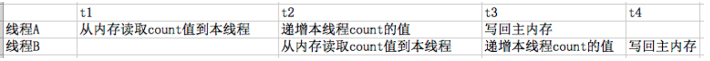

假如当前`count=0`那么t1时刻线程A读取了`count`值到变量`countA`,然后t2时刻递增`countA`值为1，同时线程B读取`count`的值0放到内存`countB`值为0（因为`countA`还没有写入主内存），t3时刻线程A才把`countA`为1的值写入主内存，至此线程A一次计数完毕，同时线程B递增`countB`值为1，t4时候线程B把`countB`值1写入内存，至此线程B一次计数完毕。明明是两次计数，最后结果是1而不是2。

可以利用`sync/atomic`包的一些原子性函数或者锁来保证`count++`的原子性：

```go
atomic.AddInt32(&count, 1) // 2.1
```

#### 内存访问同步

除了操作的原子性，多个`goroutine`同时执行时也并不是顺序执行的，而且可能是交叉访问执行的，如果能对内存变量的访问添加同步访问措施就可以避免多个`goroutine`同时交叉执行：

```go
package main

import (
    "fmt"
    "sync"
)

var count int32
var wg sync.WaitGroup // 信号量
var lock sync.Mutex   // 互斥锁
const ThreadNum = 1000

// goroutine1
func main() {
    // 1.信号
    wg.Add(ThreadNum)

    // 2.goroutine
    for i := 0; i < ThreadNum; i++ {
        go func() {
            lock.Lock()   // 2.1
            count++       // 2.2
            lock.Unlock() // 2.3
            wg.Done()     // 2.4
        }()
    }

    wg.Wait() // 3.等待goroutine运行结束

    fmt.Println(count) // 4.输出计数
}
```

- 如上代码创建了一个互斥锁`lock`，然后`goroutine`内在执行`count++`前先获取锁，执行完毕后在释放锁。
- 当1000个`goroutine`同时执行到代码2.1时候只有一个线程可以获取到锁，其他的线程被阻塞，直到获取到锁的`goroutine`释放了锁。也就是这1000个线程的并发行使用锁转换为了串行执行，也就是对共享内存变量的访问施加了同步措施。

### 基本并发原语

##### Mutex

<span id="conc01">目前` Mutex` 的 `state` 字段有几个意义，这几个意义分别是由哪些字段表示的？</span>

> 目前` Mutex` 的 `state` 字段

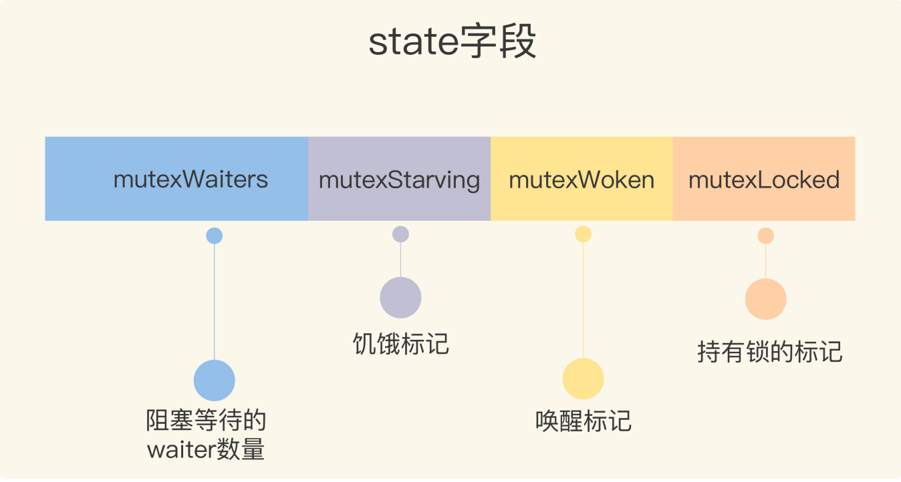

```go
type Mutex struct {
	state int32
	sema  uint32
}

// A Locker represents an object that can be locked and unlocked.
type Locker interface {
	Lock()
	Unlock()
}

const (
  // 持有锁的标记
	mutexLocked = 1 << iota // mutex is locked
  // 唤醒标记
	mutexWoken
  // 饥饿标记
	mutexStarving
  // 阻塞等待waiter数量
	mutexWaiterShift = iota
  // 饥饿模式的最大等待时间阈值 1ms
	starvationThresholdNs = 1e6
)
```


<span id="conc02">等待一个 `Mutex` 的 `goroutine` 数最大是多少？是否能满足现实的需求？</span>

>
>
>


##### Mutex 常见的错误场景


##### RWMutex

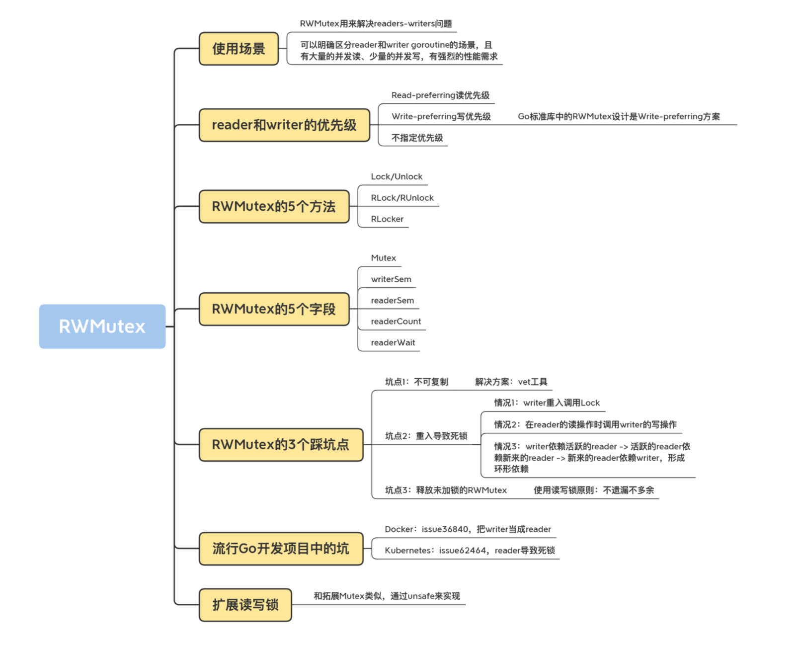

##### WaitGroup


<span id="wg01">如何避免错误使用 `WaitGroup` 的情况？至少五点。</span>

* 不重用 `WaitGroup`。新建一个 `WaitGroup` 不会带来多大的资源开销，重用反而更容易出错。

* 保证所有的 `Add` 方法调用都在 `Wait` 之前。
* 不传递负数给 `Add` 方法，只通过 `Done` 来给计数值减 1。
* 不做多余的 `Done` 方法调用，保证 `Add` 的计数值和 `Done` 方法调用的数量是一样的。 
* 不遗漏 `Done` 方法的调用，否则会导致 `Wait hang` 无法返回。


##### Cond

`WaitGroup` 和 `Cond` 的区别：`WaitGroup` 是主 `goroutine` 等待确定数量的子 `goroutine` 完成任务；而 `Cond` 是等待某个条件满足，这个条件的修改可以被任意多的 `goroutine` 更新，而且 `Cond` 的 `Wait` 不关心也不知道其他 `goroutine `的数量，只关心等待条件。而且 `Cond` 还有单个通知的机制，也就是 `Signal `方法。


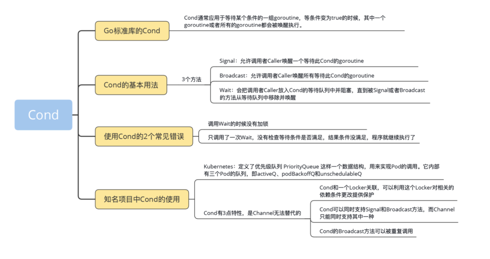

##### Once

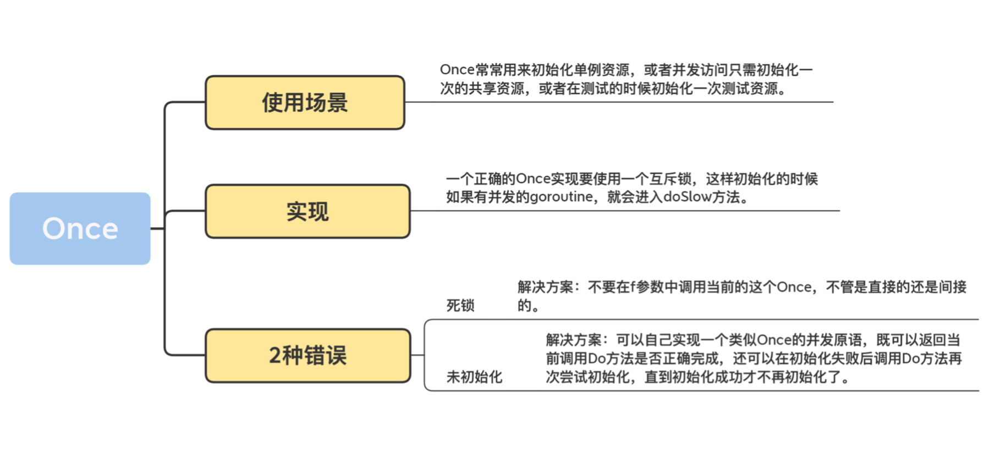

##### Map

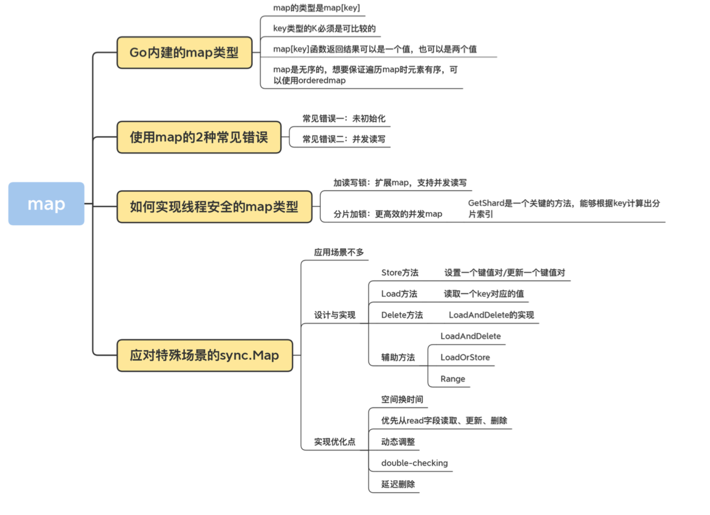

<span id="map01"> 如何实现线程安全的`map`类型？</span>

> 方案①：**加读写锁，扩展 map，支持并发读写**。并发性能要求不是那么高的场景，简单加锁方式更简单。
>
> 方案②：**分片加锁（更高效的并发`map`）**。追求更高的性能，显然是分片加锁更好，因为它可以降低锁的粒度，进而提高访问此 map 对象的 吞吐。
>
> 方案③：应对特殊场景的 **sync.Map**。

方式①：避免 `map` 并发读写 `panic` 的方式之一就是加锁，考虑到读写性能，可以使用读写锁提供性能。

```go
package main

import "sync"

// 问题：如何实现线程安全的 map 类型?

// 两种方案：
// 方案①：加读写锁，扩展 map，支持并发读写。
// 方案②：分片加锁（更高效的并发`map`）。

// 方案一解析：避免 map 并发读写 panic 的方式之一就是加锁，考虑到读写性能，可以使用读写锁提供性能。
// 对 map 对象的操作，无非就是增删改查和遍历等几种常见操作。
// 可以把这些操作分为读和写两类，其中，查询和遍历可以看做读操作，增加、修改和删除可以看做写操作。
// 通过读写锁对相应的操作进行保护。

// 读写锁的缺点。虽然使用读写锁可以提供线程安全的 map，但是在大量并发读写的情况下，锁的竞争会非
// 常激烈，毕竟锁是性能下降的万恶之源之一。因此，需要尽量减少锁的粒度和锁的持有时间。

type RWMap struct { // 一个读写锁保护的线程安全的map
    sync.RWMutex // 读写锁保护下面的map字段
    m            map[int]int
}

func (m *RWMap) Get(k int) (int, bool) { //从map中读取一个值
    m.RLock()
    defer m.RUnlock()
    v, existed := m.m[k] // 在锁的保护下从map中读取
    return v, existed
}

func (m *RWMap) Set(k int, v int) { // 设置一个键值对
    m.Lock() // 锁保护
    defer m.Unlock()
    m.m[k] = v
}

func (m *RWMap) Delete(k int) { //删除一个键
    m.Lock() // 锁保护
    defer m.Unlock()
    delete(m.m, k)
}

func (m *RWMap) Len() int { // map的长度
    m.RLock() // 锁保护
    defer m.RUnlock()
    return len(m.m)
}

func (m *RWMap) Each(f func(k, v int) bool) { // 遍历map
    m.RLock() //遍历期间一直持有读锁
    defer m.RUnlock()
    for k, v := range m.m {
        if !f(k, v) {
            return
        }
    }
}
```

方案②：**分片加锁，更高效的并发** `map`，减少锁的粒度常用的方法就是分片(`Shard`)，将一把锁分成几把锁，每个锁控制一个分片。

```go
package main

import (
    _ "hash/fnv"
    "sync"
)
// 问题：如何实现线程安全的 map 类型?

// 三种方案：
// 方案①：加读写锁，扩展 map，支持并发读写。
// 方案②：分片加锁（更高效的并发`map`）。
// 方案③：应对特殊场景的 sync.Map。

// 减少锁的粒度常用的方法就是分片(Shard)，将一把锁分成几把锁，每个锁控制一个分片。

var shardCount = 32

// 分成shardCount个分片的map
type ConcurrentMap []*ConcurrentMapShared

// 通过RWMutex保护的线程安全的分片，包含一个map
type ConcurrentMapShared struct {
    items        map[string]interface{}
    sync.RWMutex // Read Write mutex, guards access to internal map.
}

// 创建并发map
func New() ConcurrentMap {
    m := make(ConcurrentMap, shardCount)
    for i := 0; i < shardCount; i++ {
        m[i] = &ConcurrentMapShared{items: make(map[string]interface{})}
    }
    return m
}

// 根据key计算分片索引
func (m ConcurrentMap) GetShard(key string) *ConcurrentMapShared {
    return m[uint(fnv(key))%uint(shardCount)]
}

func (m ConcurrentMap) Set(key string, value interface{}) {
    // 根据key计算出对应的分片
    shard := m.GetShard(key)
    shard.Lock() //对这个分片加锁，执行业务操作
    shard.items[key] = value
    shard.Unlock()
}

func (m ConcurrentMap) Get(key string) (interface{}, bool) {
    // 根据key计算出对应的分片
    shard := m.GetShard(key)
    shard.RLock()
    // 从这个分片读取key的值
    val, ok := shard.items[key]
    shard.RUnlock()
    return val, ok
}
```

方案三：**应对特殊场景的** **sync.Map**，Go 官方线程安全 map 的标准实现。


##### Pool

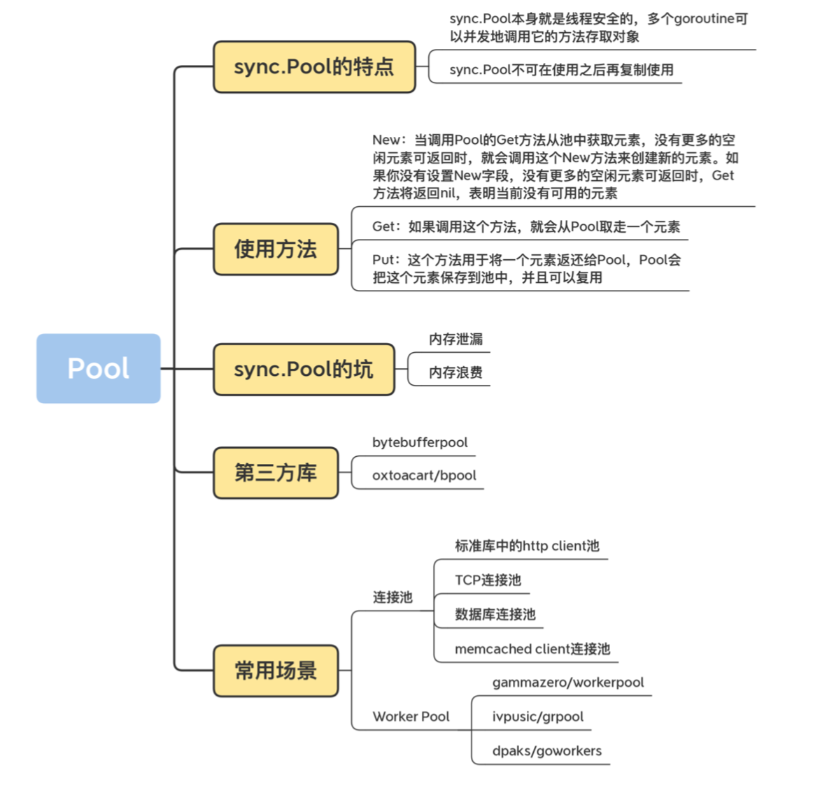

##### Context


##### Atomic


##### Channel

<span id="conc03">关于并发问题的解决方案，什么时候选择并发原语？什么时候选择`Channel`？</span>

* 共享资源的并发访问使用传统并发原语；
* 复杂的任务编排和消息传递使用 `Channel`；
* 消息通知使用 `Channel`，除非只想 `signal` 一个 `goroutine`，才使用 `Cond`；
* 简单等待所有任务的完成用 `WaitGroup`，也有 `Channel` 的推崇者用 `Channel`，都可 以；
*  需要和 `Select` 语句结合，使用 `Channel`；
*  需要和超时配合时，使用 `Channel` 和 `Context`。

### Happens Before 原则

> 在一个 `goroutine` 内部，程序的执行顺序和它们的代码指定的顺序是一样的，即使编译器 或者 `CPU` 重排了读写顺序，从行为上来看，也和代码指定的顺序一样。

如下代码变量b是一个全局变量，初始化为0值，下面开启了两个`goroutine`，假设`goroutine B`有机会输出值时候，那么它可能输出的值是多少？

```go
// 变量b初始化为0
var b int

// goroutine A
go func() {
  a := 1     // 1
  b := 2     // 2
  c := a + b // 3
}()

// goroutine B
go func() {
  if 2 == b { // 4
    fmt.Println(a) // 5
  }
}()
```

答案可能是1，也可能是0，输出1很好理解，输出0是什么原因呢？

这是因为编译器或者`CPU`可能会对`goroutine A`中的指令做重排序，可能先执行了代码2，然后在执行了代码1。假设当`goroutine A`执行代码2后，调度器调度了`goroutine B`执行代码4和5，此时a的值仍然为0，最后再执行了`goroutineA`的代码1，则`goroutine B`这时候会输出0。

### 安全读写共享变量

<span id="shared_variable">`go` 中除了加 `Mutex` 锁以外还有哪些方式安全读写共享变量？</span>

方式一：加 `RWMutex` ，保证同一时间只能有一个 `goroutine` 来访问变量。

```go
package main

import (
    "fmt"
    "sync"
    "time"
)

// 互斥锁，如果要访问一个资源，那么就必须要拿到这个资源的锁，只有拿到锁才有资格访问资源。
// 其他的 goroutine 想要访问，必须等到当前 goroutine 释放了锁，抢到锁之后再访问。
var mu sync.RWMutex

var balance int

func Deposit(amount int) {
    mu.Lock()
    // defer 来保证最终会释放锁（保证在对变量的访问结束之后，把锁释放掉，即使发生在异常情况，也需要释放）
    defer mu.Unlock()
    balance = balance + amount
}
func Balance() int {
    mu.Lock()
    // defer 来保证最终会释放锁（保证在对变量的访问结束之后，把锁释放掉，即使发生在异常情况，也需要释放）
    defer mu.Unlock()
    return balance
}

// 问题：向银行账户中存款问题。
// 解析：如果程序正确，那么最后的输出应该是 200000，但多次运行，结果可能是 198000、199000 或者其他的值。这个程序存在数据竞态。
// 这个问题的根本原因是 balance = balance + amount 这行代码在 CPU 上的执行操作不是原子的，有可能执行到一半的时候会被打断。

// 结果：200000
// 解决方案：保证同一时间只能有一个 goroutine 来访问变量。
// ① 互斥锁。sync.Mutex
// ② 读写互斥锁。sync.RWMutex
// ③ once。 &sync.Once{}

func main() {
    for i := 0; i < 1000; i++ {
        go func() {
            Deposit(100)
        }()

        go func() {
            Deposit(100)
        }()
    }
    // 休眠一秒，让上面的 goroutine 执行完成
    time.Sleep(1 * time.Second)
    fmt.Println(Balance())
}
```

方式二：`go` 中 `goroutine` 可以通过 `channel` 进行安全读写共享变量。

## 专题相关

### `make` && `new`

<span id="make_new">`golang`中`make`与`new`有何区别？</span>

>  二者都是内存的分配（堆上），但是`make`只用于`slice`、`map`以及`channel`的初始化（非零值）；而`new`用于任意类型的内存分配，并且内存置为零。
>
>  `make`返回的还是这三个引用类型本身；而`new`返回的是指向类型的指针。
>
>  `make` 内置函数仅用作分配内存空间并初始化 `slice`，`map` 和 `chan` 类型的对象。与 `new` 相同，第一个参数是类型，而不是值。与 `new` 不同，`make` 的返回类型与其参数的类型相同，而不是指向它的指针。

* `make` 仅用于初始化 `slice`，`map` 和 `chan`，`new` 可用于初始化任意类型。
* `make` 返回值是引用类型，`new` 返回值是指针类型。

内置函数 `make` 是必用的，因为 `slice`，`map` 和 `chan`，必须使用内置函数 `make` 初始化，才可以使用；而内置函数`new `并不常用，通常使用场景是需要显式返回指针。

`new` 的使用：对指针类型的变量直接赋值使用会报错，使用示例：

```go
package main

import (
 "fmt"
)

func main() {
   var i *int
   *i=10
   fmt.Println(*i)
}
```

运行结果：

```go
panic: runtime error: invalid memory address or nil pointer dereference
[signal SIGSEGV: segmentation violation code=0x1 addr=0x0 pc=0x4849df]
```

对于引用类型的变量，我们不光要声明它，还要为它分配内存空间，否则我们的值放在哪里去呢？

正确分配内存后的代码示例：

```go
func main() {
   var i *int
   i = new(int)
   *i = 10
   fmt.Println(*i)
}
```

`new`函数声明：

```go
// The new built-in function allocates memory. The first argument is a type,
// not a value, and the value returned is a pointer to a newly
// allocated zero value of that type.
func new(Type) *Type
```

它只接受一个参数，这个参数是一个类型，分配好内存后，返回一个指向该类型内存地址的指针。它同时把分配的内存置为零，也就是类型的零值。

示例：

```go
package main

import (
    "fmt"
    "sync"
)

type user struct {
    lock sync.Mutex
    name string
    age int
}

func main() {

    u := new(user) // 默认给u分配到内存全部为0

    u.lock.Lock()  // 可以直接使用，因为lock为0，是开锁状态
    u.name = "张三"
    u.lock.Unlock()

    fmt.Println(u)
}
```

 运行结果：

```go
&{{0 0} 张三 0}
```

示例中的`user`类型中的`lock`字段不用初始化，直接可以拿来用，不会有无效内存引用异常，因为它已经被零值了。`new`返回的永远是类型的指针，指向分配类型的内存地址。

下面的代码是关于切片指针的解引用的问题：

```go
package main

import "fmt"

// first argument to append must be slice; have *[]int
// 解析： 可以使用 list := make([]int,0) list类型为切片
// 或使用 *list = append(*list, 1) list类型为指针
func main() {

    // new 和 make 的区别： 
    // 二者都是内存的分配（堆上），但是make只用于slice、map以及channel的初始化（非零值）；
    // 而new用于类型的内存分配，并且内存置为零。
    // make返回的还是这三个引用类型本身；而new返回的是指向类型的指针
    // list := make([]int,0)
    list := new([]int)
    fmt.Println(list)  // &[]
    fmt.Println(*list) // []

    // *list = append(*list, 1)
    list = append(list, 1)

    fmt.Println(list)
}
```

`make` 内置函数仅用作分配内存空间并初始化 `slice`，`map` 和 `chan` 类型的对象。与 `new` 相同，第一个参数是类型，而不是值。与 `new` 不同，`make` 的返回类型与其参数的类型相同，而不是指向它的指针。

函数声明：

```go
// The make built-in function allocates and initializes an object of type
// slice, map, or chan (only). Like new, the first argument is a type, not a
// value. Unlike new, make's return type is the same as the type of its
// argument, not a pointer to it. The specification of the result depends on
// the type:
//	Slice: The size specifies the length. The capacity of the slice is
//	equal to its length. A second integer argument may be provided to
//	specify a different capacity; it must be no smaller than the
//	length. For example, make([]int, 0, 10) allocates an underlying array
//	of size 10 and returns a slice of length 0 and capacity 10 that is
//	backed by this underlying array.
//	Map: An empty map is allocated with enough space to hold the
//	specified number of elements. The size may be omitted, in which case
//	a small starting size is allocated.
//	Channel: The channel's buffer is initialized with the specified
//	buffer capacity. If zero, or the size is omitted, the channel is
//	unbuffered.
func make(t Type, size ...IntegerType) Type
```

像`map`、`slice`、`chan` 这些类型声明是不会分配内存的，初始化需要 `make `，分配内存后才能赋值和使用。

```go
// 使用内置函数 make 初始化 map，传入的参数是类型，map 没有容量限制，初始化时无需指定容量的大小。
m := make(map[T]T)

// 分配一个长度为 10 的底层数组，返回一个长度为 0，容量为 10 的切片。
// 使用内置函数 make 初始化 slice，第一个参数是类型，第二个参数是 slice 的长度，第三个参数是可选参数，它代表 slice 的容量，如果不传入第三个参数，slice 的容量与长度相同，但是如果传入第三个参数，它的值（容量）比如大于或等于传入的第二个参数（长度）。
s := make([]T, 0, 10)

// 给 channel 分配的内存空间大小（缓冲容量）为 10。
// channel 的缓冲区使用指定的值初始化缓冲容量。
// 如果为零或忽略大小(不传入第二个参数)，则 channel 为无缓冲的。
c := make(chan T, 10)
```

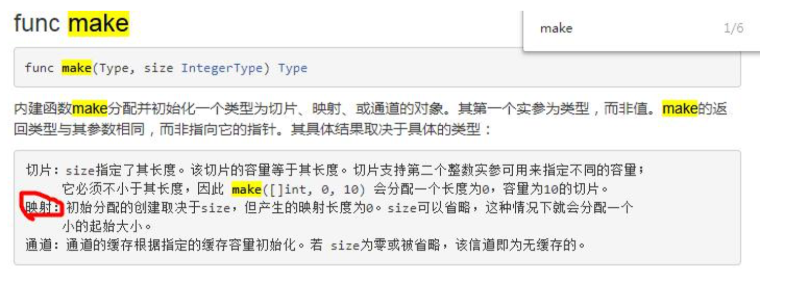

### array && slice

<span id="array_slice">问：`slice` 和`array`的区别是什么？</span>

* 数组的零值是元素类型的零值，切片的零值是 `nil`，`nil` 也是唯一可以和切片类型作比较的值；
* 数组的长度固定，不能动态变化，而切片是一个可以动态变化的数组。数组是多个相同类型数据的组合，一个数组一旦声明/定义了，其长度是固定的， 不能动态变化，否则会报越界；切片是一种可变长度的数组；
* 数组默认是值传递，而切片是数组的一个引用，因此切片是引用类型，在进行传递时，遵守引用传递的机制。

切片和数组的零值：

```go
package main

import (
    "fmt"
)

func main() {
    var arr = [2]int{}
    // invalid operation: arr == nil (mismatched types [2]int and nil)
    // if arr == nil {
    //     fmt.Println("arr nil")
    // }
    fmt.Println("arr=", arr) // arr = [0 0]
    var slice []int
    if slice == nil {
        fmt.Println("slice nil") // slice= []
    }
    fmt.Println("slice=", slice) // slice= []
}
```

`array` 细节，数组定义的基本语法:：

```go
var 数组名 [数组大小]数据类型 
var a [3]int
```

数组代码演示示例：

```go
package main
import (
	"fmt"
)

func main() {

	var intArr [3]int // int占8个字节
	// 当我们定义完数组后，其实数组的各个元素有默认值 0
	fmt.Println(intArr) // [0 0 0]
	intArr[0] = 10
	intArr[1] = 20
	intArr[2] = 30
	fmt.Println(intArr) // [10 20 30]
	// intArr的地址=0xc000016200 intArr[0] 地址0xc000016200 intArr[1] 地址0xc000016208 intArr[2] 地址0xc000016210
	fmt.Printf("intArr的地址=%p intArr[0] 地址%p intArr[1] 地址%p intArr[2] 地址%p\n", 
		&intArr, &intArr[0], &intArr[1], &intArr[2]) 
```

数组的底层结构示意图：

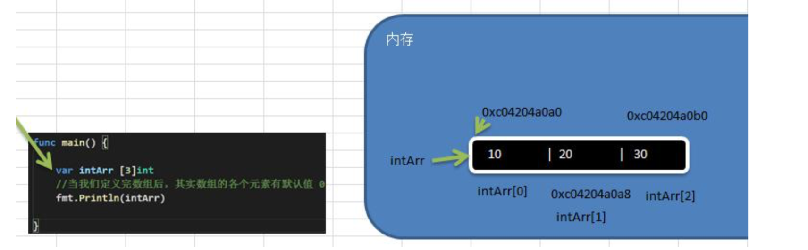

上图总结：

* 数组的地址可以通过数组名来获取 `&intArr`。
* 数组的第一个元素的地址，就是数组的首地址。
* 数组的各个元素的地址间隔是依据数组的类型决定，`int`占8个字节，比如 `int64 -> 8 int32->4...`。

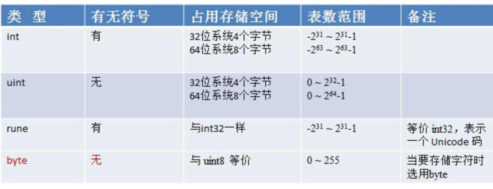

`Go`的数组属值类型，在默认情况下是值传递，因此会进行值拷贝。数组间不会相互影响：

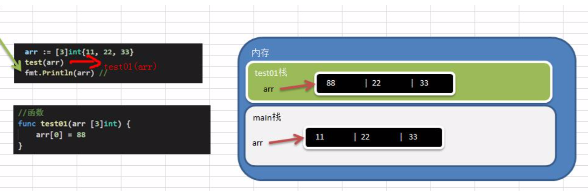

如想在其它函数中，去修改原来的数组，可以使用引用传递(指针方式)：

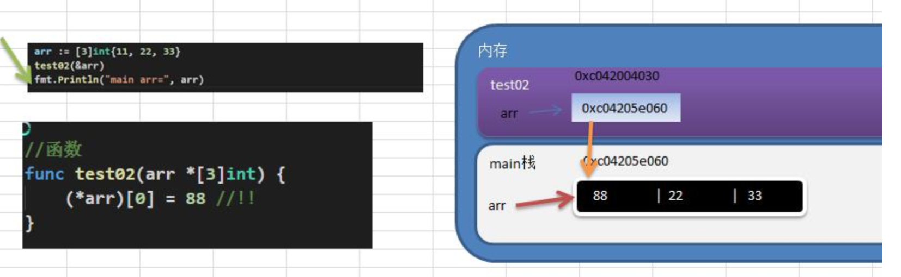

长度是数组类型的一部分，在传递函数参数时 需要考虑数组的长度：

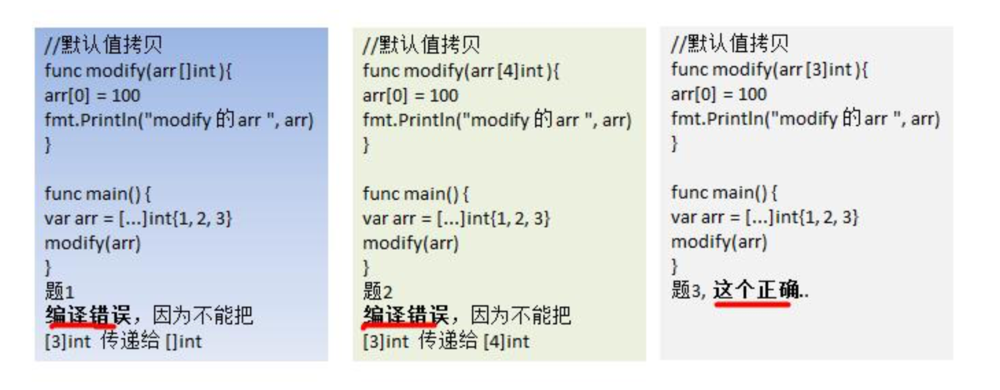

`slice` 细节，切片定义的基本语法:

```go
var 切片名 []类型 
var a [] int
```

切片示例代码演示：

```go
package main
import (
	"fmt"
)

func main() {

	// 演示切片的基本使用
	var intArr [5]int = [...]int{1, 22, 33, 66, 99}
	// 声明/定义一个切片
	// slice := intArr[1:3]
	// 1. slice 就是切片名。
	// 2. intArr[1:3] 表示 slice 引用到 intArr 这个数组。
	// 3. 引用intArr数组的起始下标为 1 , 最后的下标为3(但是不包含3)。
	// 4. 切片是数组的一个引用，因此切片是引用类型，在进行传递时，遵守引用传递的机制。
	slice := intArr[1:3] 
	fmt.Println("intArr=", intArr) // [1 22 33 66 99]
	fmt.Println("slice 的元素是 =", slice) //  22, 33
	fmt.Println("slice 的元素个数 =", len(slice)) // 2
	fmt.Println("slice 的容量 =", cap(slice)) // 切片的容量是可以动态变化  

	fmt.Printf("intArr[1]的地址=%p\n", &intArr[1]) // 0xc042060038
	// 0xc042060038 slice[0==22
	fmt.Printf("slice[0]的地址=%p slice[0==%v\n", &slice[0], slice[0])
	slice[1] = 34
	fmt.Println()
	fmt.Println("intArr=", intArr) // intArr= [1 22 34 66 99]
	fmt.Println("slice 的元素是 =", slice) //  slice 的元素是 = [22 34]
}
```

切片的底层结构示意图：

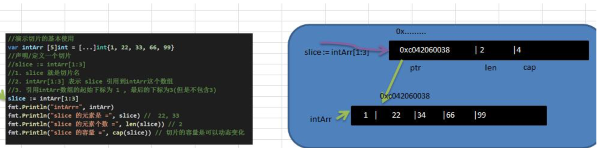

上图总结：

* `slice` 是数组的一个引用，因此切片是引用类型，在进行传递时，遵守引用传递的机制。
* `slice` 从底层来说，其实就是一个数据结构(`struct` 结构体)。

```go
type slice struct {
	array unsafe.Pointer
	len   int
	cap   int
}
```

基础使用：

① 方式一：定义一个切片，然后让切片去引用一个已经创建好的数组。

```go
var intArr [5]int = [...]int{1, 22, 33, 66, 99}
slice := intArr[1:3]
```

② 方式二：通过 `make `来创建切片。基本语法：

```
var 切片名 []type = make([]type, len, [cap])
// 参数说明: 
// type: 数据类型 
// len : 大小 
// cap : 指定切片容量，可选，如果分配了 cap，则要求 cap>=len.
```

案例演示图：

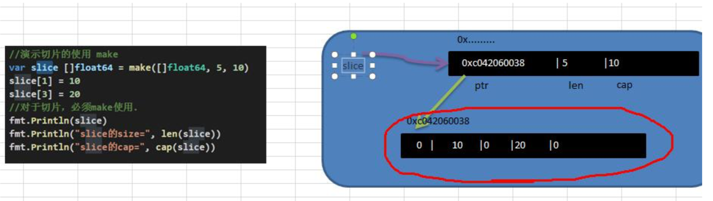

③ 方式三：定义一个切片，直接就指定具体数组，使用原理类似 make 的方式。

```go
var slice = []int {1, 2, 3, 4}
var strSlice = []string{"w","x","i","o","n","g"}
```

方式一和方式二的区别：方式一直接引用数组，这个数组事先是已经存在的；方式②是通过`make`来创建切片，而`make`也会在底层去创建一个数组。

注意事项：

① 切片初始化时 `var slice = arr[startIndex:endIndex]`，从 `arr` 数组下标为 `startIndex`，取到 下标为 `endIndex` 的元素(不含 `arr[endIndex]`)。

② 切片初始化时，仍然不能越界。范围在` [0-len(arr)] `之间，但是可以动态增长。

```go
var slice = arr[0:end] 等价于 var slice = arr[:end]
var slice = arr[start:len(arr)] 等价于 var slice = arr[start:]
var slice = arr[0:len(arr)] 等价于 var slice = arr[:]
```

③ `cap`是一个内置函数，用于统计切片的容量，即最大可以存放多少个元素。

④ 切片定义完后，还不能使用，因为本身是一个空的，需要让其引用到一个数组，或者 `mak`e 一个空间供切片来使用。

⑤ 切片可以继续切片。

```go
package main

import (
    "fmt"
)

func main() {

    // 使用常规的for循环遍历切片
    var arr [5]int = [...]int{10, 20, 30, 40, 50}
    // slice := arr[1:4] // 20, 30, 40
    slice := arr[1:4]
    for i := 0; i < len(slice); i++ {
        // slice[0]=20 slice[1]=30 slice[2]=40
        fmt.Printf("slice[%v]=%v ", i, slice[i])
    }

    fmt.Println()
    // 使用for--range 方式遍历切片
    for i, v := range slice {
        fmt.Printf("i=%v v=%v \n", i, v)
    }

    slice2 := slice[1:2] //  slice [ 20, 30, 40]    [30]
    slice2[0] = 100      // 因为arr , slice 和slice2 指向的数据空间是同一个，因此slice2[0]=100，其它的都变化

    fmt.Println("slice2=", slice2) // slice2= [100]
    fmt.Println("slice=", slice)   // slice= [20 100 40]
    fmt.Println("arr=", arr)       // arr = [10 20 100 40 50]
}  
```

⑥ 用 `append` 内置函数，可以对切片进行动态追加。

```go
package main

import (
    "fmt"
)

func main() {
    // 用 append 内置函数，可以对切片进行动态追加
    var slice3 []int = []int{100, 200, 300}
    // 通过append直接给slice3追加具体的元素
    slice3 = append(slice3, 400, 500, 600)
    fmt.Println("slice3", slice3) // 100, 200, 300,400, 500, 600

    // 通过 append 将切片slice3追加给slice3
    slice3 = append(slice3, slice3...) // 100, 200, 300,400, 500, 600 100, 200, 300,400, 500, 600
    fmt.Println("slice3", slice3)
}
```

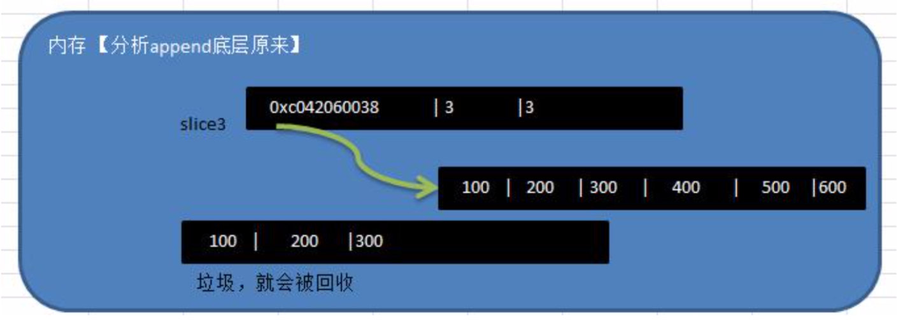

 `append `操作的本质就是对数组扩容：`go` 底层会创建一个新的数组 `newArr`(按照扩容后大小) 将 `slice` 原来包含的元素拷贝到新的数组 `newArr`，` slice` 重新引用到 `newArr`。

⑦ 切片的拷贝操作。下面代码中，`slice4` 和 `slice5` 的数据空间是独立，相互不影响，也就是说 `slice4[0]= 999`，`slice5[0]` 仍然是 1。

```go
package main

import (
    "fmt"
)

func main() {
    // 切片的拷贝操作
    // 切片使用copy内置函数完成拷贝
    fmt.Println()
    var slice4 []int = []int{1, 2, 3, 4, 5}
    var slice5 = make([]int, 10)
    // func copy(dst, src []Type) int
    copy(slice5, slice4)
    fmt.Println("slice4=", slice4) // 1, 2, 3, 4, 5
    fmt.Println("slice5=", slice5) // 1, 2, 3, 4, 5, 0 , 0 ,0,0,0
}
```

⑧ 切片是引用类型，所以在传递时，遵守引用传递机制。

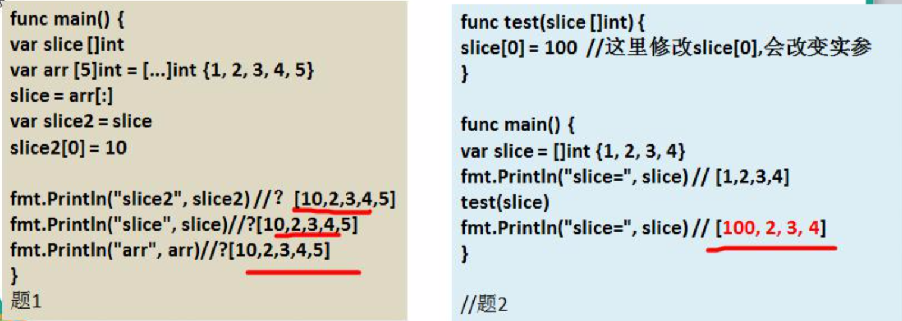

### 值类型 && 引用类型

<span id="value_quote">Go 语言当中值类型和地址传递（引用类型）如何运用？有什么区别？举例说明</span>。

> 值类型包括：基本数据类型 `int` 系列，`float` 系列，`bool`类型，`string`类型 、数组`array`和结构体 `struct`。
>
> 引用类型包括：`pointer`指针、`slice` 切片、`map`、管道 `chan`、`interface` 等都是引用类型。

* 值类型定义：变量直接存储值，内存通常在栈中分配。
* 引用类型定义：变量存储的是一个地址，这个地址对应的空间才真正存储数据(值)，内存通常在堆上分配，当没有任何变量引用这个地址时，该地址对应的数据空间就成为一个垃圾，由 GC 来回收。
* 如果希望函数内的变量能修改函数外的变量，可以传入变量的地址&，函数内以指针的方式操作变量，从效果上看类似引用。

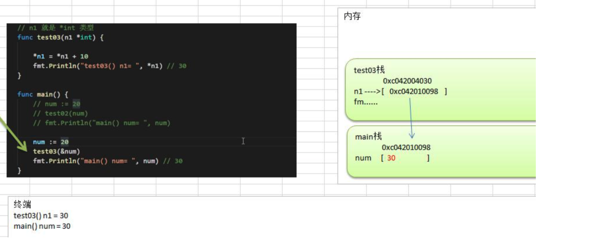

* 值传递只会把参数的值复制一份放进对应的函数，两个变量的地址不同， 不可相互修改。
* 地址传递（引用传递）会将变量本身传入对应的函数，在函数中可以对该变量进行值内容的修改。


### Slice 底层实现

<span id="source_slice_01">`golang` 中 `slice`的底层实现？它是如何进行扩容的？它是如何进行查找的？</span>


### Map 底层实现

<span id="map_01">`golang` 中 `map`的底层实现？</span>

* `map` 的底层如何实现：Go 语言采用的是哈希查找表，并且使用链表解决哈希冲突。通过 key 的哈希值将 key 散落到不同的桶中，每个桶中有 8 个 cell。哈希值的低位决定桶序号，高位标识同一个桶中的不同 key。
* 当向桶中添加了很多 key，造成元素过多，或者溢出桶太多，就会触发扩容。扩容分为等量扩容和 2 倍容量扩容。扩容后，原来一个 bucket 中的 key 一分为二，会被重新分配到两个桶中。扩容过程是渐进的，主要是防止一次扩容需要搬迁的 key 数量过多，引发性能问题。触发扩容的时机是增加了新元素，bucket 搬迁的时机则发生在赋值、删除期间，每次最多搬迁两个 bucket。

`Map`的底层实现是采用哈希查找表，并且使用链表来解决哈希冲突的。通过 `key` 的哈希值将 `key` 散落到不同的桶中，每个桶中有 8 个 `cell`。哈希值的低位决定桶序号，高位标识同一个桶中的不同 `key`。

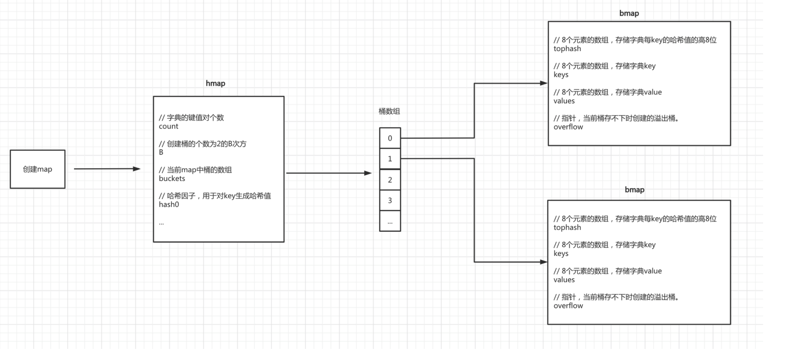

```go
type hmap struct {
	count     int    // 元素个数
	flags     uint8  // 用于处理并发时，是否正在写入
	B         uint8  // 创建桶的个数为2的B次方
	noverflow uint16 // 已使用的溢出桶的个数
	hash0     uint32 // 哈希因子，用于对key生成哈希值

	buckets    unsafe.Pointer // 当前map中桶的数组（扩容后指向新桶）
	oldbuckets unsafe.Pointer // 扩容后指向旧桶
	nevacuate  uintptr        // 接下来要迁移的旧桶编号
	extra *mapextra           // 扩展字段
}

type mapextra struct {
    overflow    *[]*bmap
    oldoverflow *[]*bmap
    nextOverflow *bmap
}

// A bucket for a Go map.
type bmap struct {
    tophash [bucketCnt]uint8        // len为8的数组
}

//底层定义的常量 
const (
    // Maximum number of key/value pairs a bucket can hold.
    bucketCntBits = 3
    bucketCnt     = 1 << bucketCntBits
）
  
type bmap struct {
  topbits  [8]uint8
  keys     [8]keytype
  values   [8]valuetype
  pad      uintptr
  overflow uintptr
}
```

<span id="map_02">`golang` 中 `map`的初始化都发生了什么？</span>

初始化一个`map`的过程分析：

```go
// 初始化一个可容纳10个元素的map
info = make(map[string]string,10)
```

- 第一步：创建一个`hmap`结构体对象。

- 第二步：生成一个哈希因子`hash0` 并赋值到`hmap`对象中（用于后续为`key`创建哈希值）。

- 第三步：根据`hint`=10，并根据算法规则来创建 B，当前B应该为1。

  ```go
  hint            B
  0~8				      0
  9~13            1
  14~26           2
  ...
  ```

- 第四步：根据B去创建去创建桶（`bmap`对象）并存放在`buckets`数组中，当前`bmap`的数量应为2.

  - 当B<4时，根据B创建桶的个数的规则为：$2^B$（标准桶）。
  - 当B>=4时，根据B创建桶的个数的规则为：$2^B$ + $2^{B-4}$（标准桶+溢出桶）。

  注意：每个`bmap`中可以存储8个键值对，当不够存储时需要使用溢出桶，并将当前`bmap`中的`overflow`字段指向溢出桶的位置。

  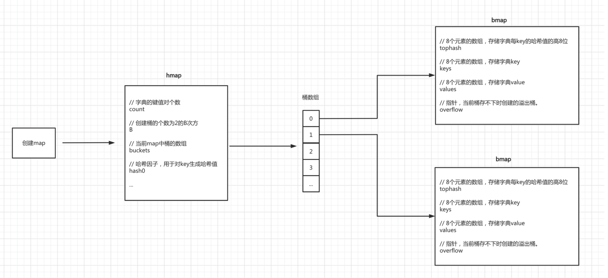

```go
func makemap(t *maptype, hint int, h *hmap) *hmap {
	mem, overflow := math.MulUintptr(uintptr(hint), t.bucket.size)
	if overflow || mem > maxAlloc {
		hint = 0
	}

	// initialize Hmap
	if h == nil {
		h = new(hmap)
	}
	h.hash0 = fastrand()

	// Find the size parameter B which will hold the requested # of elements.
	// For hint < 0 overLoadFactor returns false since hint < bucketCnt.
	B := uint8(0)
	for overLoadFactor(hint, B) {
		B++
	}
	h.B = B

	// allocate initial hash table
	// if B == 0, the buckets field is allocated lazily later (in mapassign)
	// If hint is large zeroing this memory could take a while.
	if h.B != 0 {
		var nextOverflow *bmap
		h.buckets, nextOverflow = makeBucketArray(t, h.B, nil)
		if nextOverflow != nil {
			h.extra = new(mapextra)
			h.extra.nextOverflow = nextOverflow
		}
	}

	return h
}
```

<span id="map_03">`golang` 中 `map`是如何进行查找的？</span>

在`map`中查找数据时，内部的执行流程为：

- 第一步：结合哈希因子和键 `name`生成哈希值。
- 第二步：获取哈希值的`后B位`，并根据后B为的值来决定将此键值对存放到那个桶中（`bmap`）。
- 第三步：确定桶之后，再根据`key`的哈希值计算出`tophash`（高8位），根据`tophash`和`key`去桶中查找数据。当前桶如果没找到，则根据overflow再去溢出桶中找，均未找到则表示key不存在。

<span id="map_04">`golang` 中 `map`是如何进行扩容的？</span>

在向`map`中添加数据时，当达到某个条件，则会引发字典扩容。

扩容条件：

- `map`中数据总个数 / 桶个数 > 6.5 ，引发翻倍扩容。
- 使用了太多的溢出桶时（溢出桶使用的太多会导致`map`处理速度降低）。
  - B <=15，已使用的溢出桶个数 >= $2^B$ 时，引发等量扩容。
  - B > 15，已使用的溢出桶个数 >= $2^{15}$ 时，引发等量扩容。

```
func hashGrow(t *maptype, h *hmap) {
	// If we've hit the load factor, get bigger.
	// Otherwise, there are too many overflow buckets,
	// so keep the same number of buckets and "grow" laterally.
	bigger := uint8(1)
	if !overLoadFactor(h.count+1, h.B) {
		bigger = 0
		h.flags |= sameSizeGrow
	}
	oldbuckets := h.buckets
	newbuckets, nextOverflow := makeBucketArray(t, h.B+bigger, nil)
	...
}
```

当扩容之后：

- 第一步：B会根据扩容后新桶的个数进行增加（翻倍扩容，新B=旧B+1，等量扩容，新B=旧B）。
- 第二步：`oldbuckets`指向原来的桶（旧桶）。
- 第三步：`buckets`指向新创建的桶（新桶中暂时还没有数据）。
- 第四步：`nevacuate`设置为0，表示如果数据迁移的话，应该从原桶（旧桶）中的第0个位置开始迁移。
- 第五步：`noverflow`设置为0，扩容后新桶中已使用的溢出桶为0。
- 第六步：`extra.oldoverflow`设置为原桶（旧桶）已使用的所有溢出桶。即：`h.extra.oldoverflow = h.extra.overflow`。
- 第七步：`extra.overflow`设置为nil，因为新桶中还未使用溢出桶。
- 第八步：`extra.nextOverflow`设置为新创建的桶中的第一个溢出桶的位置。

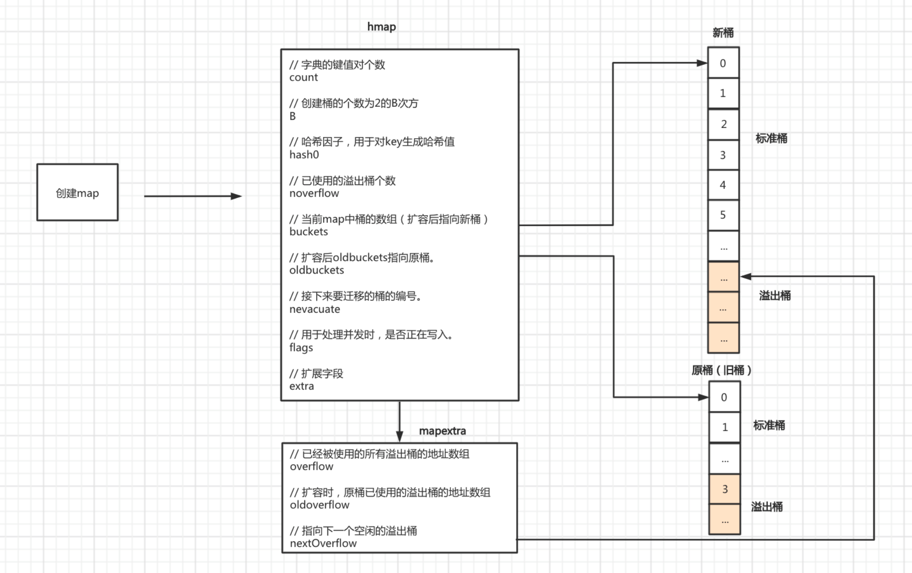


<span id="map_05">`golang` 中 `map`是如何进行迁移的？</span>


###  `defer`关键字

<span id="defer">什么是`defer`？为什么需要`defer`？如何使用`defer`？ `defer`的执行顺序是什么？</span>

* 什么是`defer`?

>`defer` 是 `Go` 语言的一种用于注册延迟调用的机制，使得函数或语句可以在当前函数执行完毕后执行。

* 为什么需要`defer`?

> `Go`语言提供的语法糖，减少资源泄露的发生。

* 如何使用`defer`?

> 在创建资源语句的附近，使用`defer`语句释放资源。

*  `defer`的执行顺序是什么？

> 出栈顺序（先进后出），它的执行顺序与声明顺序相反。

`defer` 的常用场景:

- `defer`语句经常被用于处理成对的操作，如打开、关闭、连接、断开连接、加锁、释放锁。
- 通过`defer`机制，不论函数逻辑多复杂，都能保证在任何执行路径下，资源被释放。
-  释放资源的`defer`应该直接跟在请求资源的语句后。

`defer`关键字的使用，写出下面代码的输出内容。

```go
package main

import (
    "fmt"
)

func main() {
    deferCall()
}
func deferCall() {
    defer func() { fmt.Println("打印前") }()
    defer func() { fmt.Println("打印中") }()
    defer func() { fmt.Println("打印后") }()
    panic("触发异常")
}
```

结果：

```
打印后
打印中
打印前
panic: 触发异常
```

解析：

`defer` 关键字的实现跟`go`关键字很类似，不同的是它调用的是 `runtime.deferproc` 而不 是 `runtime.newproc `。

 在 `defer` 出现的地方，插入了指令 `call runtime.deferproc` ，然后在函数返回之前的地 方，插入指令 `call runtime.deferreturn` 。

`goroutine`的控制结构中，有一张表记录 `defer` ，调用 `runtime.deferproc` 时会将需要 `defer`的表达式记录在表中，而在调用 `runtime.deferreturn` 的时候，则会依次从`defer`表 中出栈（先进后出）并执行。

 因此，题目最后输出顺序应该是 `defer` 定义顺序的倒序。 `panic` 错误并不能终止 `defer` 的执行。

拓展：

在函数中，开发者经常需要创建资源(比如：数据库连接、文件句柄、锁等) ，为了在函数执行完毕后，及时的释放资源，`Go` 的设计者提供 `defer `(延时机制)。

当 `go` 执行到一个 `defer` 时，不会立即执行 `defer` 后的语句，而是将 `defer` 后的语句压入到一个栈中，然后继续执行函数下一个语句。当函数执行完毕后，在从 `defer` 栈中，依次从栈顶（先入后出）取出语句执行。

在 `defer` 将语句放入到栈时，也会将相关的值拷贝同时入栈。**值拷贝示例**

```go
package main

import (
    "fmt"
)

func sum(n1 int, n2 int) int {

    // 当执行到defer时，暂时不执行，会将defer后面的语句压入到独立的栈(defer栈)
    // 当函数执行完毕后，再从defer栈，按照先入后出的方式出栈，执行
    defer fmt.Println("ok1 n1=", n1) // defer 3. ok1 n1 = 10
    defer fmt.Println("ok2 n2=", n2) // defer 2. ok2 n2= 20
    //增加一句话
    n1++                         // n1 = 11
    n2++                         // n2 = 21
    res := n1 + n2               // res = 32
    fmt.Println("ok3 res=", res) // 1. ok3 res= 32
    return res
}

func main() {
    res := sum(10, 20)
    fmt.Println("res=", res) // 4. res= 32
} 
```


案例二：`defer`关键字的使用，写出下面代码的输出内容。

```go
package main

import "fmt"

func calc(index string, a, b int) int {
    ret := a + b
    fmt.Println(index, a, b, ret)
    return ret
}
func main() {
    a := 1
    b := 2
    defer calc("1", a, calc("10", a, b))
    a = 0
    defer calc("2", a, calc("20", a, b))
    b = 1
}

```

结果：

```go
10 1 2 3
20 0 2 2
2 0 2 2
1 1 3 4
```

解析：`defer` 在定义的时候会计算好调用函数的参数，所以会优先输出 10 、 20 两个参 数。然后根据定义的顺序倒序执行。

<span id="geek_base_20">20、Golang Slice 的底层实现？</span>

`slice`的结构定义：`slice`中定义了三个变量，一个是指向底层数字的指针`array`，另外两个是切片的长度`len`和切片的容量`cap`。一个`slice`占24个`byte`。一个`int`占8个`byte`。

```go
type slice struct {
  array unsafe.Pointer // 指向底层数组的指针
  len   int // 切片的长度
  cap   int // 切片的容量
}
```

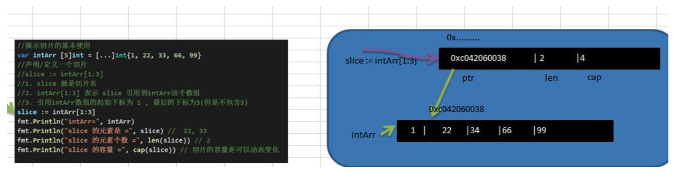

`slice`的初始化：`makeslice`函数的工作主要就是计算`slice`所需内存大小，然后调用`mallocgc`进行内存的分配。计算`slice`所需内存又是通过`MulUintptr`来实现的，`MulUintptr`主要就是用切片中元素大小和切片的容量相乘计算出所需占用的内存空间，如果内存溢出，或计算出的内存大小大于最大可分配内存，`MulUintptr`的`overflow`会返回`true`，`makeslice`就会报错。另外如果传入长度小于0或者长度小于容量，`makeslice`也会报错。

```go
func makeslice(et *_type, len, cap int) unsafe.Pointer {
	mem, overflow := math.MulUintptr(et.size, uintptr(cap))
	if overflow || mem > maxAlloc || len < 0 || len > cap {
		// NOTE: Produce a 'len out of range' error instead of a
		// 'cap out of range' error when someone does make([]T, bignumber).
		// 'cap out of range' is true too, but since the cap is only being
		// supplied implicitly, saying len is clearer.
		// See golang.org/issue/4085.
		mem, overflow := math.MulUintptr(et.size, uintptr(len))
		if overflow || mem > maxAlloc || len < 0 {
			panicmakeslicelen()
		}
		panicmakeslicecap()
	}

	return mallocgc(mem, et, true)
}

// MulUintptr returns a * b and whether the multiplication overflowed.
// On supported platforms this is an intrinsic lowered by the compiler.
func MulUintptr(a, b uintptr) (uintptr, bool) {
	if a|b < 1<<(4*sys.PtrSize) || a == 0 {
		return a * b, false
	}
	overflow := b > MaxUintptr/a
	return a * b, overflow
}
```

<span id="geek_base_21">21、Golang 扩容前后的 Slice 是否相同？它的扩容机制是什么？</span>

* 当`slice`容量足够时，我们往`slice`中`append`时，`slice`底层数组指向的内存地址不会发生改变。因此此种情况下的扩容前后是同一个`slice`。

```go
package main

import (
   "fmt"
   "unsafe"
)
// 运行结果：
// 0xc00009e000 1 10
// 0xc00009e000 2 10
func main() {
   slice := make([]int, 0, 10)
   slice = append(slice, 1)
   fmt.Println(unsafe.Pointer(&slice[0]), len(slice), cap(slice))
   slice = append(slice, 2)
   fmt.Println(unsafe.Pointer(&slice[0]), len(slice), cap(slice))
}
```

* 当`slice`容量不够时，会重新分配一块新的内存地址，把原来的值拷贝过来，然后再执行 `append() `操作。底层数组的指向指针会发生变化，这种情况丝毫不影响原数组，因此此种情况下的扩容前后不是同一个`slice`。

```go
func main() {
   slice := make([]int, 0)
   slice = append(slice, 1)
   fmt.Printf("%p %d %d\n", unsafe.Pointer(&slice[0]), len(slice), cap(slice))
   slice = append(slice, 2)
   fmt.Printf("%p %d %d\n", unsafe.Pointer(&slice[0]), len(slice), cap(slice))
}
// 0xc00009a008 1 1
// 0xc00009a030 2 2
```

* `cap`的扩容规则，从源码中我们可以简单的总结出`slice`容量的扩容规则：当原`slice`的`cap`小于`1024`时，新`slice`的`cap`变为原来的2倍；原`slice`的`cap`大于1024时，新`slice`变为原来的1.25倍。但这个规则不是完全正确的。

```go
func growslice(et *_type, old slice, cap int) slice {
	if raceenabled {
		callerpc := getcallerpc()
		racereadrangepc(old.array, uintptr(old.len*int(et.size)), callerpc, funcPC(growslice))
	}
	if msanenabled {
		msanread(old.array, uintptr(old.len*int(et.size)))
	}

	if cap < old.cap {
		panic(errorString("growslice: cap out of range"))
	}

	if et.size == 0 {
		// append should not create a slice with nil pointer but non-zero len.
		// We assume that append doesn't need to preserve old.array in this case.
		return slice{unsafe.Pointer(&zerobase), old.len, cap}
	}

	newcap := old.cap
	doublecap := newcap + newcap
	if cap > doublecap {
		newcap = cap
	} else {
		if old.len < 1024 {
			newcap = doublecap
		} else {
			// Check 0 < newcap to detect overflow
			// and prevent an infinite loop.
			for 0 < newcap && newcap < cap {
				newcap += newcap / 4
			}
			// Set newcap to the requested cap when
			// the newcap calculation overflowed.
			if newcap <= 0 {
				newcap = cap
			}
		}
  }
}  
```

* 实际上扩容规则中还涉及到了内存对齐的过程：因此从1->2->4->8->16...->1024，都是成倍增长，当cap大于1024后，再`append`元素，`cap`变为1280，变成了1024的1.25倍，也符合上面的规则；但是继续`append`，1280->1696，似乎不是1.25倍，而是1.325倍，源码中`roundupsize`是内存对齐的过程。

```go
switch {
	case et.size == 1:
		lenmem = uintptr(old.len)
		newlenmem = uintptr(cap)
		capmem = roundupsize(uintptr(newcap))
		overflow = uintptr(newcap) > maxAlloc
		newcap = int(capmem)
}

// Returns size of the memory block that mallocgc will allocate if you ask for the size.
func roundupsize(size uintptr) uintptr {
	if size < _MaxSmallSize {
		if size <= smallSizeMax-8 {
			return uintptr(class_to_size[size_to_class8[divRoundUp(size, smallSizeDiv)]])
		} else {
			return uintptr(class_to_size[size_to_class128[divRoundUp(size-smallSizeMax, largeSizeDiv)]])
		}
	}
	if size+_PageSize < size {
		return size
	}
	return alignUp(size, _PageSize)
}
```

`golang`中内存分配是根据对象大小来配不同的`mspan`，为了避免造成过多的内存碎片，`slice`在扩容中需要对扩容后的`cap`容量进行内存对齐的操作。


<span id="geek_base_21">21、什么是内存对齐？</span>


## GO基础类

<span id="geek_base_01">01、与其他语言相比，使用 Go 有什么好处?</span>

* 基于`CSP` 并发模型(`Communicating Sequential Processes` )的思想实现。`channel` 的经典思想：**不要通过共享内存来通信，而是通过通信来实现内存共享**。`JAVA/C++`等语言倡导共享内存来通信，而`Go`倡导以通信的方式来共享内存。
* `goroutine`属于用户态线程（轻量级），相对于`JAVA/C++`等语言的多线程（操作系统线程），它解决了操作（内核）系统线程占用内存太大、创建和切换开销性能消耗较大的问题。用户态线程`goroutine`是一个非常轻量级的，其创建和切换都在用户代码中完成而无需进入操作系统内核，所以其开销要远远小于系统线程的创建和切换；另外一个优势在于`goroutine`只占2-4KB内存空间，可以在程序轻易的创建成千上万甚至上百万的`goroutine`出来并发的执行任务而不用太担心性能和内存等问题。其他程序如`JAVA/C++`的多线程，往往是内核态的，比较重量级，几千个线程可能就会耗光`CPU`。
* 天然的并发优势。`goroutine`+`channel`，可实现高并发处理，高效利用多核。轻量级用户态线程+管道通信机制。
* Go 语言保证了既能到达静态编译语言的安全和性能，又达到了动态语言开发维护的高效率 ，使用一个表达式来形容 Go 语言：`Go = C + Python` , 说明 Go 语言既有 C 静态语言程序的运行速度，又能达到 Python 动态语言的快速开发。
* 设计理念和哲学。追求简单高效，少即是多的哲学，有且仅有一种方法把事情做好做对。 `Rob Pike`曾经说过，Go 语言实际上是复杂的，但只是让大家感觉很简单。它能长期保持简单性、稳定性和健壮性。我觉得这些特质比软件设计的其他目标更为重要。Go 开发团队的工作态度非常严谨，每个功能都经过了深思熟虑，力求最简单且最完整的解决方案，这样的团队纪律为他们赢得了巨大的优势。

<span id="geek_base_02">02、`golang` 都使用什么数据类型？</span>

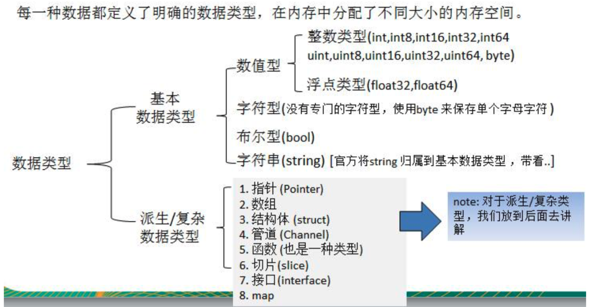			

<span id="geek_base_03">03、Go 程序中的包是什么?</span>

Go 程序中包的本质实际上就是创建不同的文件夹，来存放程序文件。go 的每一个文件都是属于一个包的，它是以包的形式来管理文件和项目目录结构的。包的主要作用：

* 区分相同名字的函数、变量等标识符 。
* 当程序文件很多时，可以很好的管理项目。
*  控制函数、变量等访问范围，即作用域。

 打包的基本语法：

```go
package 包名
```


􏰀 引包的基本语法：

```go
import "包的路径"
```

包使用的注意事项和细节：

* 在给一个文件打包时，该包对应一个文件夹，比如`utils` 文件夹对应的包名就是 `utils`， 文件的包名通常和文件所在的文件夹名一致，一般为小写字母。
* 当一个文件要使用其它包函数或变量时，需要先引入对应的包。
* 为了让其它包的文件，可以访问到本包的函数，则该函数名的首字母需要大写，类似其它语言 的 `public` ,这样才能跨包访问。
* 在访问其它包函数，变量时，其语法是：包名.函数名。
* 如果包名较长，Go 支持给包取别名， 注意细节:取别名后，原来的包名就不能使用了。
* 在同一包下，不能有相同的函数名(也不能有相同的全局变量名)，否则报重复定义。
* 如果你要编译成一个可执行程序文件，就需要将这个包声明为 main , 即 `package main` 。这个就是一个语法规范，如果你是写一个库 ，包名可以自定义。

<span id="geek_base_04">04、Go 支持什么形式的类型转换？将整数转换为浮点数。</span>

`Go` 和 `java / c` 不同，`Go` 在不同类型的变量之间赋值时需要显式转换。`Go`中数据类型不能自动转换。

基本语法：表达式 `T(v)` 将值 v 转换为类型 T。

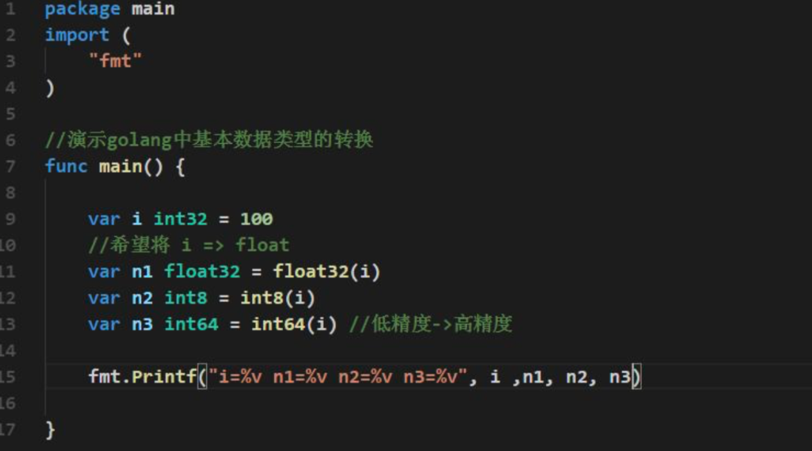

基本数据类型相互转换的注意事项：

* Go 中，数据类型的转换可以是从表示范围小-->表示范围大，也可以从范围大--->范围小。

* 被转换的是变量存储的数据(即值)，变量本身的数据类型并没有变化!

  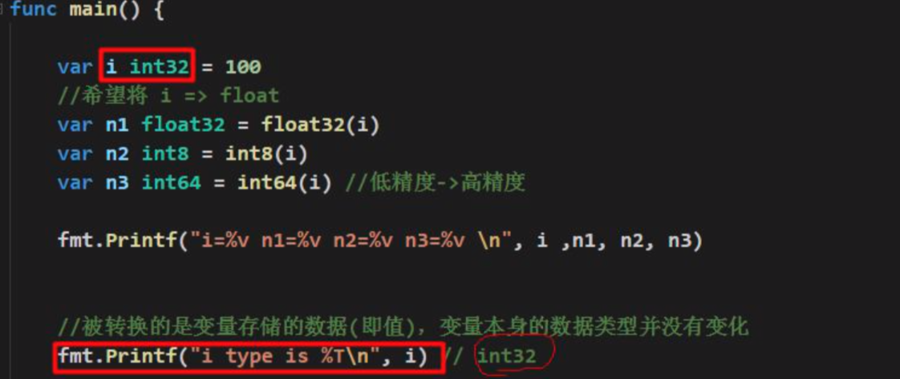

* 在转换中，比如将 int64 转成 int8 【-128---127】 ，编译时不会报错，只是转换的结果是按溢出处理，和我们希望的结果不一样， 因此在转换时，需要考虑范围。

  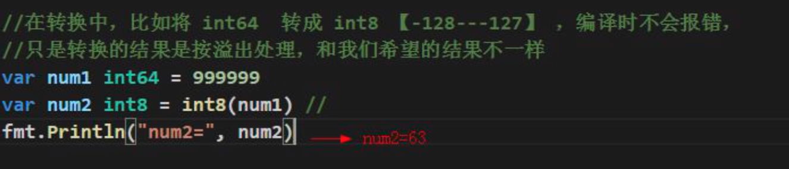

<span id="geek_base_05">什么是`goroutine`？你如何停止它？</span>

> `goroutine`是来自协程`coroutine`的概念，它属于**用户态的线程**，主要解决操作（内核）系统线程占用内存太大和创建、切换开销性能消耗较大的问题。用户态线程`goroutine`是一个非常轻量级的，其创建和切换都在用户代码中完成而无需进入操作系统内核，所以其开销要远远小于系统线程的创建和切换；另外一个优势在于`goroutine`只占2-4KB内存空间，可以在程序轻易的创建成千上万甚至上百万的`goroutine`出来并发的执行任务而不用太担心性能和内存等问题。其他程序如C/JAVA的多线程，往往是内核态的，比较重量级，几千个线程可能就会耗光`CPU`。

方案一：定期轮询 `channel`。向 `goroutine` 发送一个信号通道来停止它。

```go
func init()  {
    go watchTopicViewNum()
}

func watchTopicViewNum()  {
    var slice []topic_view_history.TopicViewHistory
    var ticker = time.NewTicker(time.Second * time.Duration(conf.App.TopicViewNumSyncEvery))
    for {
        select {
        case h := <- topicViewNumChan:
            slice = append(slice, h)
        case <-ticker.C:
            cp := make([]topic_view_history.TopicViewHistory, len(slice))
            copy(cp, slice)
            slice = slice[:0]
            go saveTopicHistory(cp)
        }
    }
}
```

```go
package main

import (
    "fmt"
    "time"
)
// 解析：
// 结果：
// 接收到的值:  Hello
// 接收到的值:  Hello
// 接收到的值:  Hello
// 结束
func main() {
    ch := make(chan string, 6)
    done := make(chan struct{})
    go func() {
        for {
            select {
            case ch <- "Hello":
            case <-done:
                close(ch)
                return
            }
            time.Sleep(1 * time.Second)
        }
    }()

    go func() {
        time.Sleep(3 * time.Second)
        done <- struct{}{}
    }()

    for i := range ch {
        fmt.Println("接收到的值: ", i)
    }

    fmt.Println("结束")
}
```

方案二：使用 `context`。

```go
package main

import (
    "context"
    "fmt"
    "time"
)

// Go语言context标准库的Context类型提供了一个Done()方法，该方法返回一个类型为<-chan struct{}的channel。
// 每次context收到取消事件后这个channel都会接收到一个struct{}类型的值。
// 所以在Go语言里监听取消事件就是等待接收<-ctx.Done()。

func main() {
    ch := make(chan struct{})
    ctx, cancel := context.WithCancel(context.Background())

    go func(ctx context.Context) {
        for {
            select {
            case <-ctx.Done():
                ch <- struct{}{}
                return
            default:
                fmt.Println("Hello...")
            }

            time.Sleep(500 * time.Millisecond)
        }
    }(ctx)

    go func() {
        time.Sleep(3 * time.Second)
        cancel()
    }()

    <-ch
    fmt.Println("结束")
}
```


<span id="geek_base_06">06、如何在运行时检查变量类型？</span>

`Type Switch`:`switch` 语句被用于 `type-switch` 来判断某个 `interface` 变量中实际指向的变量类型。

 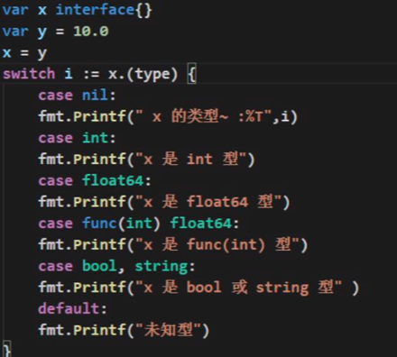


<span id="geek_base_07">07、两个接口之间可以存在什么关系？`Go`中接口有什么特点？</span>

> 如果两个接口有相同的方法列表，那么他们就是等价的，可以相互赋值。如果 接口 A 的方法列表是接口 B 的方法列表的自己，那么接口 B 可以赋值给接口 A。接口查询是否成功，要在运行期才能够确定。

接口特点：

* 接口里的所有方法都没有方法体，即接口的方法都是没有实现的方法。接口体现了程序设计的多态和高内聚低偶合的思想。

* `golang` 中的接口，不需要显式的实现。只要一个变量，含有接口类型中的所有方法，那么这个
  变量就实现这个接口。因此，`golang` 中没有 `implement` 这样的关键字。

* 接口本身不能创建实例，但是可以指向一个实现了该接口的自定义类型的变量（实例）。

  ```go
  package main
  import (
  	"fmt"
  )
  
  type AInterface interface {
  	Say()
  }
  
  
  type Stu struct {
  	Name string
  }
  
  func (stu Stu) Say() {
  	fmt.Println("Stu Say()")
  }
  
  
  func main() {
  	var stu Stu // 结构体变量，实现了 Say() 实现了 AInterface
   	var a AInterface = stu
  	a.Say()
  }
  ```

* 接口中所有的方法都没有方法，即都是没有实现的方法。

* 一个自定义类型需要将某个接口的所有方法都实现，我们说这个自定义类型实现 了该接口。

*  一个自定义类型只有实现了某个接口，才能将该自定义类型的实例（变量）赋给接口类型 

* 只要是自定义数据类型，就可以实现接口，不仅仅是结构体类型。

  ```go
  type integer int
  
  func (i integer) Say() {
  	fmt.Println("integer Say i =" ,i )
  }
  
  var i integer = 10
  var b AInterface = i
  b.Say() // integer Say i = 10
  ```

* 一个自定义类型可以实现多个接口。

  ```go
  type Monster struct {
  
  }
  func (m Monster) Hello() {
  	fmt.Println("Monster Hello()~~")
  }
  
  func (m Monster) Say() {
  	fmt.Println("Monster Say()~~")
  }
  
  func main() {
  	// Monster实现了AInterface 和 BInterface
  	var monster Monster
  	var a2 AInterface = monster
  	var b2 BInterface = monster
  	a2.Say()
  	b2.Hello()
  }
  ```

* golang 接口中不能有任何变量。

  ```go
  type AInterface interface {
  	Say()
  	Name string
  }
  ```

* 一个接口(比如 A 接口)可以继承多个别的接口(比如 B，C 接口)，这时如果要实现 A 接口，也必 须将 B，C 接口的方法也全部实现。

  ```go
  package main
  import (
  	"fmt"
  )
  
  type BInterface interface {
  	test01()
  }
  
  type CInterface interface {
  	test02()
  }
  
  type AInterface interface {
  	BInterface
  	CInterface
  	test03()
  }
  
  //如果需要实现AInterface,就需要将BInterface CInterface的方法都实现
  type Stu struct {
  }
  func (stu Stu) test01() {
  
  }
  func (stu Stu) test02() {
  	
  }
  func (stu Stu) test03() {
  	
  }
  
  type T  interface{
  
  }
  
  func main() {
  	var stu Stu
  	var a AInterface = stu
  	a.test01()
  
  	var t T = stu //ok
  	fmt.Println(t)
  	var t2 interface{}  = stu
  	var num1 float64 = 8.8
  	t2 = num1
  	t = num1
  	fmt.Println(t2, t)
  }
  ```

*  `interface` 类型默认是一个指针(引用类型)，如果没有对 `interface `初始化就使用，那么会输出 `nil`。

* 空接口` interface{} `没有任何方法，所以所有类型都实现了空接口，即我们可以把任何一个变量赋给空接口。

<span id="geek_base_08">08、`Go` 当中同步锁有什么特点？作用是什么？</span>

> 同步锁主要包括互斥锁 `Mutex`、读写锁 `RWMutex`，主要解决资源竞争的问题，保证读写共享资源的安全性（同步锁的作用是保证资源在使用时的独有性，不会因为并发而导致数据错乱， 保证系统的稳定性。）。
>
> 使用互斥锁 `Mutex`，限定临界区只能同时由一个线程持有，如果 `Mutex` 已经被一个 `goroutine` 获取了锁，其它等待中的 `goroutine` 只能一直等待。不管是读还是写，我们都通过 `Mutex` 来保证只有一个 `goroutine` 访问共享资源，这在某些情况下有点`浪费`。比如说，在写少读多的情况下，即使一段时间内没有写操作，大量并发的读访问也不得不在 `Mutex` 的保护下变成了串行访问，这个时候， 使用 `Mutex`，对性能的影响就比较大。
>
> 使用读写锁`RWMutex`，通过区分读写操作，将串行的读变成并行的读，提高读操作的性能。当写操作的 `goroutine` 持有锁的时候，它就是一个互斥锁 `Mutex`，其它的写操作和读操作的 `goroutine`，需要阻塞等待持有这个锁的 `goroutine` 释放锁。标准库中的 `RWMutex` 是一个 `reader/writer` 互斥 锁。`RWMutex `在某一时刻只能由任意数量的 `reader` 持有，或者是只被单个的 `writer` 持有。

注：在并发编程中，如果程序中的一部分会被并发访问或修改，那么，为了避免并发访问导致的意想不到的结果，这部分程序需要被保护起来，这部分被保护起来的程序，就叫做`临界区`。

同步原语（`Synchronization primitives`，并发原语）是解决并发问题的一个基础的数据结构。其中使用最广泛的同步原语有互斥锁 `Mutex`、读写锁 `RWMutex`、并发编排 `WaitGroup`、条件变量 `Cond`、管道`Channel` 等。同步原语的适用场景：

* 共享资源。并发地读写共享资源，会出现数据竞争(`data race`)的问题，所以需要 `Mutex`、`RWMutex` 这样的并发原语来保护。
* 任务编排。需要 `goroutine` 按照一定的规律执行，而 `goroutine` 之间有相互等待或者依 赖的顺序关系，我们常常使用 `WaitGroup` 或者 `Channel` 来实现。
* 消息传递。信息交流以及不同的 `goroutine` 之间的线程安全的数据交流，常常使用 `Channel` 来实现。

<span id="geek_base_09">09、`Go` 语言当中 `Channel`（通道）有什么特点，会 `panic` 的情况有几种？会 `block` 的情况有几种？需要注意什么？</span>


`channel`的读写特性（空读写阻塞，写关闭异常，读关闭空零）：

* 从一个 `nil channel` 接收数据，造成永远阻塞。
* 给一个 `nil channel` 发送数据，造成永远阻塞。
* 给一个`nil channel`关闭，引起`painc`。
* 从一个`empty channel`接收数据，会造成阻塞。
* 给一个`full channel`发送数据，会造成阻塞。
* 从一个`closed channel`接收数据，会返回未读的元素，如果缓冲区为空，则读完后返回零值。
* 给一个已经关闭的 `closed channel` 发送数据，引起 `panic`。
* 关闭一个已经关闭的`closed channel`，引起`painc`。
* 无缓冲的`channel`是同步的，而有缓冲的`channel`是非同步的。

**会 `panic` 的情况，总共有 3 种**:

* `close` 为 `nil` 的 `chan`;
* `send` 已经 `close` 的 `chan`; 
* `close` 已经 `close `的 `chan`。

**会`block`的情况，总共有 4 种：**

* 从一个 `nil channel` 接收数据，造成永远阻塞。
* 给一个 `nil channel` 发送数据，造成永远阻塞。
* 从一个`empty channel`接收数据，会造成阻塞。
* 给一个`full channel`发送数据，会造成阻塞。

<span id="geek_base_10">10、Go 语言当中 Channel 缓冲有什么特点？</span>

Go 语言当中 Channel 缓冲分为无缓冲通道和有缓冲通道；无缓冲的 Channel 是同步的，而有缓冲的 Channel 是非同步的。

> **无缓冲的`Channel`**：无缓冲的通道指的是通道大小为0，发送和接收方需要同时准备好，才可以完成发送和接收操作。（无缓冲的`Channel`由于没有缓冲发送和接收需要同步。）
>
> **有缓冲的`Channel`**：有缓冲的通道指的是有缓冲大小大于1，不需要发送方和接收方同时准备好，都可以进行发送和接收操作。（有缓冲`Channel`不要求发送和接收操作同步。）
>
> **区别**：无缓冲的通道保证进行发送和接收的 `Goroutine `会在同一时间进行数据交换；而有缓冲的通道只有在通道中没有要接收的值时，接收动作才会阻塞，只有在通道没有可用缓冲区容纳被发送的值时，发送动作才会阻塞。

无缓冲的通道指的是通道的大小为0，也就是说，这种类型的通道在接收前没有能力保存任何值，它要求发送 `Goroutine` 和接收 `Goroutine` 同时准备好，才可以完成发送和接收操作。

有缓冲的` Channel`(`buffered channel`) 是一种在被接收前能存储一个或者多个值的通道。这种类型的通道并不强制要求 `goroutine `之间必须同时完成发送和接收。通道会阻塞发送和接收动作的条件也会不同。只有在通道中没有要接收的值时，接收动作才会阻塞。只有在通道没有可用缓冲区容纳被发送的值时，发送动作才会阻塞。

<span id="geek_base_11">11、Go 语言中 cap函数可以作用于那些内容？</span>

Cap 函数是内置函数，主要应用于以下几种类型：

* Array（数组）：

* Slice（切片）：make 方式创建切片可以指定切片的大小和容量。cap 是一个内置函数，用于统计切片的容量，即最大可以存放多少个元素。`var 切片名 []type = make([]type, len, [cap])`。

  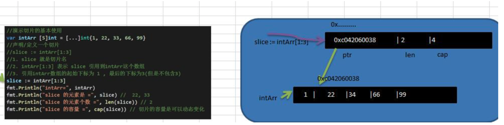

* Channel（通道）：

```go
// The make built-in function allocates and initializes an object of type
// slice, map, or chan (only). Like new, the first argument is a type, not a
// value. Unlike new, make's return type is the same as the type of its
// argument, not a pointer to it. The specification of the result depends on
// the type:
//	Slice: The size specifies the length. The capacity of the slice is
//	equal to its length. A second integer argument may be provided to
//	specify a different capacity; it must be no smaller than the
//	length. For example, make([]int, 0, 10) allocates an underlying array
//	of size 10 and returns a slice of length 0 and capacity 10 that is
//	backed by this underlying array.
//	Map: An empty map is allocated with enough space to hold the
//	specified number of elements. The size may be omitted, in which case
//	a small starting size is allocated.
//	Channel: The channel's buffer is initialized with the specified
//	buffer capacity. If zero, or the size is omitted, the channel is
//	unbuffered.
func make(t Type, size ...IntegerType) Type
```

<span id="geek_base_12"> 12、`go convey` 是什么？一般用来做什么？</span>

- `go convey` 是一个支持 `golang` 的单元测试框架。
- `go convey` 能够自动监控文件修改并启动测试，并可以将测试结果实时输出到 `Web` 界面。
- `go convey` 提供了丰富的断言简化测试用例的编写。

<span id="geek_base_13">13、Go 语言当中 new 和 make 有什么区别吗？</span>

> 二者都是内存的分配（堆上），`make`只用于`slice`、`map`以及`channel`的初始化（非零值）；而`new`用于任意类型的内存分配，并且内存置为零。与 `new` 相同，第一个参数是类型，而不是值。与 `new` 不同，`make` 的返回类型与其参数的类型相同，而不是指向它的指针。

`new`函数声明：初始化指向一个类型的指针。

```go
// The new built-in function allocates memory. The first argument is a type,
// not a value, and the value returned is a pointer to a newly
// allocated zero value of that type.
func new(Type) *Type
```

它只接受一个参数，这个参数是一个类型，分配好内存后，返回一个指向该类型内存地址的指针。它同时把分配的内存置为零，也就是类型的零值。

`make` 内置函数仅用作分配内存空间并初始化 `slice`，`map` 和 `chan` 类型的对象。与 `new` 相同，第一个参数是类型，而不是值。与 `new` 不同，`make` 的返回类型与其参数的类型相同，而不是指向它的指针。

函数声明：

```go
// The make built-in function allocates and initializes an object of type
// slice, map, or chan (only). Like new, the first argument is a type, not a
// value. Unlike new, make's return type is the same as the type of its
// argument, not a pointer to it. The specification of the result depends on
// the type:
//	Slice: The size specifies the length. The capacity of the slice is
//	equal to its length. A second integer argument may be provided to
//	specify a different capacity; it must be no smaller than the
//	length. For example, make([]int, 0, 10) allocates an underlying array
//	of size 10 and returns a slice of length 0 and capacity 10 that is
//	backed by this underlying array.
//	Map: An empty map is allocated with enough space to hold the
//	specified number of elements. The size may be omitted, in which case
//	a small starting size is allocated.
//	Channel: The channel's buffer is initialized with the specified
//	buffer capacity. If zero, or the size is omitted, the channel is
//	unbuffered.
func make(t Type, size ...IntegerType) Type
```

像`map`、`slice`、`chan` 这些类型声明是不会分配内存的，初始化需要 `make `，分配内存后才能赋值和使用。

<span id="geek_base_14">14、 Go 语言中 make 的作用是什么？ </span>

`make` 内置函数仅用作分配内存空间并初始化 `slice`，`map` 和 `chan` 类型的对象。与 `new` 相同，第一个参数是类型，而不是值。与 `new` 不同，`make` 的返回类型与其参数的类型相同，而不是指向它的指针。

函数声明：

```go
// The make built-in function allocates and initializes an object of type
// slice, map, or chan (only). Like new, the first argument is a type, not a
// value. Unlike new, make's return type is the same as the type of its
// argument, not a pointer to it. The specification of the result depends on
// the type:
//	Slice: The size specifies the length. The capacity of the slice is
//	equal to its length. A second integer argument may be provided to
//	specify a different capacity; it must be no smaller than the
//	length. For example, make([]int, 0, 10) allocates an underlying array
//	of size 10 and returns a slice of length 0 and capacity 10 that is
//	backed by this underlying array.
//	Map: An empty map is allocated with enough space to hold the
//	specified number of elements. The size may be omitted, in which case
//	a small starting size is allocated.
//	Channel: The channel's buffer is initialized with the specified
//	buffer capacity. If zero, or the size is omitted, the channel is
//	unbuffered.
func make(t Type, size ...IntegerType) Type
```

像`map`、`slice`、`chan` 这些类型声明是不会分配内存的，初始化需要 `make `，分配内存后才能赋值和使用。

```go
// 使用内置函数 make 初始化 map，传入的参数是类型，map 没有容量限制，初始化时无需指定容量的大小。
m := make(map[T]T)

// 分配一个长度为 10 的底层数组，返回一个长度为 0，容量为 10 的切片。
// 使用内置函数 make 初始化 slice，第一个参数是类型，第二个参数是 slice 的长度，第三个参数是可选参数，它代表 slice 的容量，如果不传入第三个参数，slice 的容量与长度相同，但是如果传入第三个参数，它的值（容量）比如大于或等于传入的第二个参数（长度）。
s := make([]T, 0, 10)

// 给 channel 分配的内存空间大小（缓冲容量）为 10。
// channel 的缓冲区使用指定的值初始化缓冲容量。
// 如果为零或忽略大小(不传入第二个参数)，则 channel 为无缓冲的。
c := make(chan T, 10)
```


<span id="geek_base_15">15、`Printf()`、`Sprintf()`、`Fprintf()`都是格式化输出，有什么不同？</span>

虽然这三个函数，都是格式化输出，但是输出的目标不一样。

- `Printf`：格式化并输出到标准输出。
- `Sprintf`：格式化并返回一个字符串，不直接输出。
- `Fprintf`：格式化并输出到指定的输出流（文件、标准输出等）。

```go
// Printf根据format参数生成格式化的字符串并写入标准输出。返回写入的字节数和遇到的任何错误。
func Printf(format string, a ...interface{}) (n int, err error)
// Sprintf根据format参数生成格式化的字符串并返回该字符串。
func Sprintf(format string, a ...interface{}) string
// Fprintf根据format参数生成格式化的字符串并写入w。返回写入的字节数和遇到的任何错误。
func Fprintf(w io.Writer, format string, a ...interface{}) (n int, err error)
```

使用示例：

```go
fmt.Printf("DeletedMsg NsqInfo Record topic: %s info: %s ", topic, string(b))
req, err := http.NewRequest("GET", fmt.Sprintf("http://%s/nodes", host), nil)
builder.WriteString(fmt.Sprintf(`{"index": {"_id": %d}`, s.ID))
```

<span id="geek_base_16">16、`golang` 中 `array` 与 `slice` 有何区别？</span>

* 数组的零值是元素类型的零值，切片的零值是 `nil`，`nil` 也是唯一可以和切片类型作比较的值；
* 数组的长度固定，不能动态变化，而切片是一个可以动态变化的数组。数组是多个相同类型数据的组合，一个数组一旦声明/定义了，其长度是固定的， 不能动态变化，否则会报越界；
* 数组默认是值传递，而切片是数组的一个引用，因此切片是引用类型，在进行传递时，遵守引用传递的机制

```go
// /usr/local/go/src/runtime/slice.go
type slice struct {
 array unsafe.Pointer
 len   int
 cap   int
}
```

<span id="geek_base_17">17、Go 语言当中值传递和地址传递（引用传）如何运用？有什么区别？举例说明。</span>

> 值类型包括：基本数据类型 `int` 系列，`float` 系列，`bool`类型，`string`类型 、数组`array`和结构体 `struct`。
>
> 引用类型包括：`pointer`指针、`slice` 切片、`map`、管道 `chan`、`interface` 等都是引用类型。

* 值类型定义：变量直接存储值，内存通常在栈中分配。
* 引用类型定义：变量存储的是一个地址，这个地址对应的空间才真正存储数据(值)，内存通常在堆上分配，当没有任何变量引用这个地址时，该地址对应的数据空间就成为一个垃圾，由 GC 来回收。
* 如果希望函数内的变量能修改函数外的变量，可以传入变量的地址&，函数内以指针的方式操作变量，从效果上看类似引用。


* 值传递只会把参数的值复制一份放进对应的函数，两个变量的地址不同， 不可相互修改。
* 地址传递（引用传递）会将变量本身传入对应的函数，在函数中可以对该变量进行值内容的修改。

<span id="geek_base_18">18、Go 语言是如何实现切片扩容的？扩容策略是什么？ </span>

用 `append` 内置函数，可以对切片进行动态追加。

```go
package main

import (
    "fmt"
)

func main() {
    // 用 append 内置函数，可以对切片进行动态追加
    var slice3 []int = []int{100, 200, 300}
    // 通过append直接给slice3追加具体的元素
    slice3 = append(slice3, 400, 500, 600)
    fmt.Println("slice3", slice3) // 100, 200, 300,400, 500, 600

    // 通过 append 将切片slice3追加给slice3
    slice3 = append(slice3, slice3...) // 100, 200, 300,400, 500, 600 100, 200, 300,400, 500, 600
    fmt.Println("slice3", slice3)
}
```


 `append `操作的本质就是对数组扩容：`go` 底层会创建一个新的数组 `newArr`(按照扩容后大小) 将 `slice` 原来包含的元素拷贝到新的数组 `newArr`，` slice` 重新引用到 `newArr`。

```go
func main() {
    arr := make([]int, 0)
    for i := 0; i < 2000; i++ {
		fmt.Println("len 为", len(arr), "cap 为", cap(arr))
    arr = append(arr, i)
    }
}
// 我们可以看下结果依次是 0,1,2,4,8,16,32,64,128,256,512,1024 但到了 1024 之后，就变成了 1280,1696,2304 每次都是扩容了四分之一左右
```

`Go` 中切片扩容的策略是这样的:

-   首先判断，如果新申请容量大于2倍的旧容量，最终容量就是新申请的容量。
-  否则判断，如果旧切片的长度小于1024，则最终容量就是旧容量的两倍。
- 否则判断，如果旧切片长度大于等于1024，则最终容量从旧容量开始循环，增加原来的 1/4,，直到最终容量大于等于新申请的容量。
- 如果最终容量计算值溢出，则最终容量就是新申请容量。

## 源码分析

### Slice

<span id="source_01">`Golang` 源码系列一：`Slice`实现原理分析。</span>

`slice`的底层结构：

```go
type slice struct {
	array unsafe.Pointer // 指向底层数组的指针
	len   int // 切片的长度
	cap   int // 切片的长度
}
type Pointer *ArbitraryType
type ArbitraryType int
```

`slice`占多少字节？：

```go
package main

import (
    "fmt"
    "unsafe"
)

// 运行结果：
// int:8
// int8:1
// int16:2
// int32:4
// int64:8
// slice:24

// 知识点：为什么slice会占24byte？
/*
type slice struct {
	array unsafe.Pointer // 指向底层数组的指针
	len   int // 切片的长度
	cap   int // 切片的长度
}

type Pointer *ArbitraryType
type ArbitraryType int
*/

func main() {
    var a int
    var b int8
    var c int16
    var d int32
    var e int64
    slice := make([]int, 0)
    slice = append(slice, 1)
    fmt.Printf("int:%d\nint8:%d\nint16:%d\nint32:%d\nint64:%d\n",
        unsafe.Sizeof(a),
        unsafe.Sizeof(b),
        unsafe.Sizeof(c),
        unsafe.Sizeof(d),
        unsafe.Sizeof(e))
    fmt.Printf("slice:%d", unsafe.Sizeof(slice))
}
```

`slice`初始化：

```go
package main

import "fmt"

// go tool compile -S main.go | grep CALL

// 0x0042 00066 (main.go:7)        CALL    runtime.makeslice(SB)
// 0x006d 00109 (main.go:8)        CALL    runtime.growslice(SB)
// 0x00a4 00164 (main.go:9)        CALL    runtime.convTslice(SB)
// 0x00c0 00192 (main.go:9)        CALL    runtime.convT64(SB)
// 0x00d8 00216 (main.go:9)        CALL    runtime.convT64(SB)

func main() {
    slice := make([]int, 0)
    slice = append(slice, 1)
    fmt.Println(slice, len(slice), cap(slice))
}
```

源码：

```go
func makeslice(et *_type, len, cap int) unsafe.Pointer {
	mem, overflow := math.MulUintptr(et.size, uintptr(cap))
	if overflow || mem > maxAlloc || len < 0 || len > cap {
		// NOTE: Produce a 'len out of range' error instead of a
		// 'cap out of range' error when someone does make([]T, bignumber).
		// 'cap out of range' is true too, but since the cap is only being
		// supplied implicitly, saying len is clearer.
		// See golang.org/issue/4085.
		mem, overflow := math.MulUintptr(et.size, uintptr(len))
		if overflow || mem > maxAlloc || len < 0 {
			panicmakeslicelen()
		}
		panicmakeslicecap()
	}

	return mallocgc(mem, et, true)
}

func MulUintptr(a, b uintptr) (uintptr, bool) {
	if a|b < 1<<(4*sys.PtrSize) || a == 0 {
		return a * b, false
	}
	overflow := b > MaxUintptr/a
	return a * b, overflow
}
```


## 应用场景

<span id="scene01">保存用户作品浏览量方案设计?</span>

```go
type TopicViewHistory struct {
    ID        int64 `gorm:"column:id" json:"id"`
    TopicID   int64 `gorm:"column:xxx_id" json:"xxxx_id"`
    StudentID int64 `gorm:"column:xxx_id" json:"xxxx_id"`
    Status    uint8 `gorm:"column:status" json:"status"`
    UpdatedAt int64 `gorm:"column:updated_at" json:"updated_at"`
    CreatedAt int64 `gorm:"column:created_at" json:"created_at"`
}
// [app]
// TopicViewNumChanSize = 1000
// TopicViewNumSyncEvery = 2

type app struct {
    TopicViewNumChanSize             int
    TopicViewNumSyncEvery            int
}

var topicViewNumChan = make(chan topic_view_history.TopicViewHistory, conf.App.TopicViewNumChanSize)

//  A Ticker holds a channel that delivers `ticks' of a clock
// at intervals.
// type Ticker struct {
// 	C <-chan Time // The channel on which the ticks are delivered.
//	r runtimeTimer
// }

func init()  {
    go watchTopicViewNum()
}

func watchTopicViewNum()  {
    var slice []topic_view_history.TopicViewHistory
    var ticker = time.NewTicker(time.Second * time.Duration(conf.App.TopicViewNumSyncEvery))
    for {
        select {
        case h := <- topicViewNumChan:
            slice = append(slice, h)
        case <-ticker.C:
            cp := make([]topic_view_history.TopicViewHistory, len(slice))
            copy(cp, slice)
            slice = slice[:0]
            go saveTopicHistory(cp)
        }
    }
}

func saveTopicHistory(slice []topic_view_history.TopicViewHistory)  {
    if len(slice) > 0 {
        if err := xxxx.SaveTopicViewHistory(slice); err != nil {
            lg.Debugf("SaveTopicViewHistory err %s", err.Error())
        } else {
            lg.Debugf("SaveTopicViewHistory total %d", len(slice))
        }
    }
}

func SaveTopicViewHistory(slice []topic_view_history.TopicViewHistory) error {
    return models.Conn.Table("xxx_xxx_view_history").Create(&slice).Error
}
```


## interface 接口

### `interface ` 的赋值问题

<span id="interface">关于`interface`的赋值问题，以下代码能编译过去吗？为什么？</span>

```go
package main

import (
    "fmt"
)

type People interface {
    Speak(string) string
}
type Student struct{}

func (stu *Student) Speak(think string) (talk string) {
    if think == "good" {
        talk = "You are a good boy"
    } else {
        talk = "hi"
    }
    return
}
func main() {
    // cannot use Student literal (type Student) as type People in assignment:
    // Student does not implement People (Speak method has pointer receiver)
    var peo People = Student{}
    // var peo People = &Student{}
    think := "good"
    fmt.Println(peo.Speak(think))
}
```

结果：不能，会出现以下错误:

```go
cannot use Student literal (type Student) as type People in assignment:
Student does not implement People (Speak method has pointer receiver)
```

发生多态的几个要素：

* 有`interface`接口，并且有接口定义的方法（`Speak`）。
* 有子类`Student{}`去重写`interface`的接口。

* 有父类`People{}`指针指向子类的具体对象。

那么，满足上述3个条件，就可以产生多态效果，就是，父类指针可以调用子类的具体方法。

所以上述代码报错的地方在`var peo People = Stduent{}`这条语句， `Student{}`已经重写了父类`People{}`中的`Speak(string) string`方法，那么只需要用父类指针指向子类对象即可。

所以应该改成`var peo People = &Student{}` 即可编译通过。（`People`为`interface`类型，就是指针类型）。

### `inteface{}`与`*interface{}`

<span id="interface02">关于`inteface{}`与`*interface{}`，ABCD中哪一行存在错误？</span>

```go
package main

type S struct {
}

func f(x interface{}) {
}

func g(x *interface{}) {
}

// cannot use s (type S) as type *interface {} in argument to g:
//	*interface {} is pointer to interface, not interface

// cannot use p (type *S) as type *interface {} in argument to g:
//	*interface {} is pointer to interface, not interface
func main() {
    s := S{}
    p := &s
    f(s) //A
    g(s) //B
    f(p) //C
    g(p) //D
}
```

解析：`interface`是所有`golang`类型的父类。函数中`func f(x interface{})`的`interface{}`可以支持传入`golang`的任何类型，包括指针，但是函数`func g(x *interface{})`只能接受`*interface{}`。


### `interface` 的内部结构

<span id="non_empty">关于非空接口`iface`情况，以下代码打印出来什么内容，说出为什么？</span>

```go
package main

import (
    "fmt"
)

type People interface {
    Show()
}

type Student struct{}

func (stu *Student) Show() {}

func live() People {
    var stu *Student // <nil>
    fmt.Println(stu)
    return stu
}
func main() {
    if live() == nil {
        fmt.Println("AAAAAAAAAAA")
    } else {
        fmt.Println("BBBBBBBBBBB")
    }
}
```

结果：打印`BBBBBBBBBBB`。

解析：这是一个关于`interface`内部结构的问题。

`interface`在使用的过程中，共有两种表现形式一种为**空接口(`empty interface`)**，定义如下：

```
var MyInterface interface{}
```

另一种为**非空接口(`non-empty interface`)**，定义如下：

```
type MyInterface interface {
		function()
}
```

这两种`interface`类型分别用两种`struct`表示，空接口为`eface`, 非空接口为`iface`.

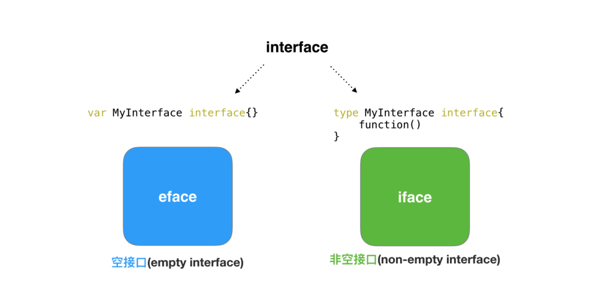

#### **空接口`eface`**

空接口`eface`结构，由两个属性构成，一个是类型信息`_type`，一个是数据信息。其数据结构声明如下：

```
type eface struct {      //空接口
    _type *_type         //类型信息
    data  unsafe.Pointer //指向数据的指针(go语言中特殊的指针类型unsafe.Pointer类似于c语言中的void*)
}
```

**_type属性**：是GO语言中所有类型的公共描述，Go语言几乎所有的数据结构都可以抽象成 `_type`，是所有类型的公共描述，**type负责决定data应该如何解释和操作，**type的结构代码如下:

```
type _type struct {
    size       uintptr  //类型大小
    ptrdata    uintptr  //前缀持有所有指针的内存大小
    hash       uint32   //数据hash值
    tflag      tflag
    align      uint8    //对齐
    fieldalign uint8    //嵌入结构体时的对齐
    kind       uint8    //kind 有些枚举值kind等于0是无效的
    alg        *typeAlg //函数指针数组，类型实现的所有方法
    gcdata    *byte
    str       nameOff
    ptrToThis typeOff
}
```

**data属性:** 表示指向具体的实例数据的指针，他是一个`unsafe.Pointer`类型，相当于一个C的万能指针`void*`。

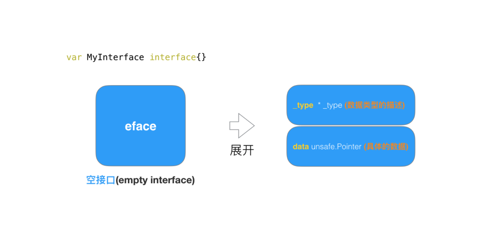

#### 非空接口iface

iface 表示 non-empty interface 的数据结构，非空接口初始化的过程就是初始化一个iface类型的结构，其中`data`的作用同`eface`的相同，这里不再多加描述。

```
type iface struct {
  tab  *itab
  data unsafe.Pointer
}
```

iface结构中最重要的是itab结构（结构如下），每一个 `itab` 都占 32 字节的空间。itab可以理解为`pair<interface type, concrete type>` 。itab里面包含了interface的一些关键信息，比如method的具体实现。

```
type itab struct {
  inter  *interfacetype   // 接口自身的元信息
  _type  *_type           // 具体类型的元信息
  link   *itab
  bad    int32
  hash   int32            // _type里也有一个同样的hash，此处多放一个是为了方便运行接口断言
  fun    [1]uintptr       // 函数指针，指向具体类型所实现的方法
}
```

其中值得注意的字段：

1. `interface type`包含了一些关于interface本身的信息，比如`package path`，包含的`method`。这里的interfacetype是定义interface的一种抽象表示。
2. `type`表示具体化的类型，与eface的 *type类型相同。*
3. `hash`字段其实是对`_type.hash`的拷贝，它会在`interface`的实例化时，用于快速判断目标类型和接口中的类型是否一致。另，Go的`interface`的`Duck-typing`机制也是依赖这个字段来实现。
4. `fun`字段其实是一个动态大小的数组，虽然声明时是固定大小为1，但在使用时会直接通过fun指针获取其中的数据，并且不会检查数组的边界，所以该数组中保存的元素数量是不确定的。

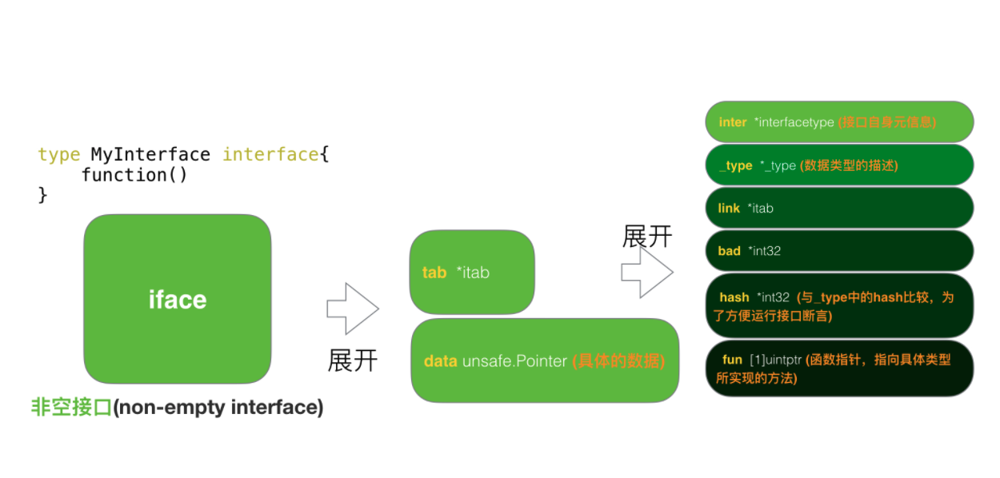

关于上述代码的，`People`拥有一个`Show`方法的，属于非空接口，`People`的内部定义应该是一个`iface`结构体。

```go
type People interface {
    Show()  
}  
```

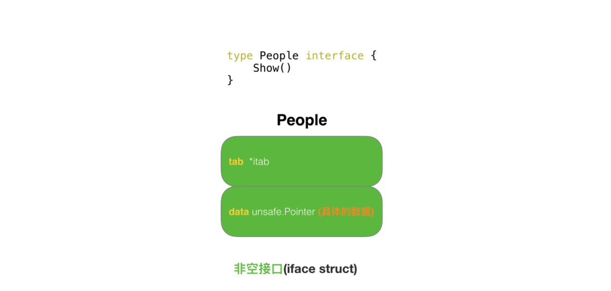

```
func live() People {
    var stu *Student
    return stu      
}     
```

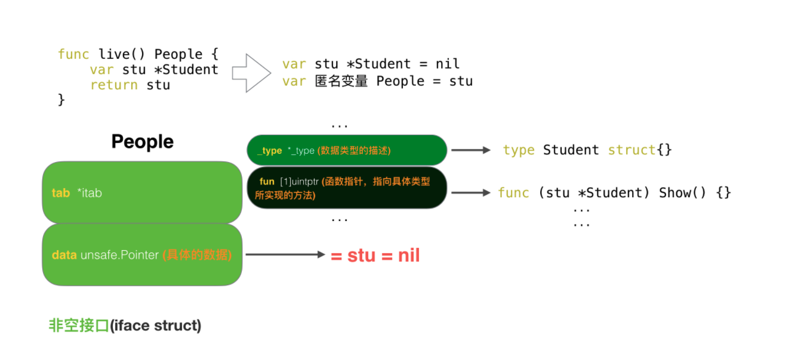

`stu`是一个指向`nil`的空指针，但是最后`return stu` 会触发`匿名变量 People = stu`值拷贝动作，所以最后`live()`放回给上层的是一个`People insterface{}`类型，也就是一个`iface struct{}`类型。 stu为nil，只是`iface`中的data 为nil而已。 但是`iface struct{}`本身并不为nil。

## 指针

* 基本数据类型，变量存的就是值，也叫值类型。

* 获取变量的地址，用&，比如:` var num int,` 获取 `num` 的地址：`&num`。

* 指针类型，指针变量存的是一个地址，这个地址指向的空间存的才是值。

* 获取指针类型所指向的值，使用：*。

  ```go
  var ptr *int // 使用*ptr 获取 ptr 指向的值
  ```

  代码示意：

  ```go
  package main
  
  import (
      "fmt"
  )
  
  func main() {
  
      // 基本数据类型在内存布局
      var i int = 10
      // i 的地址是什么,&i
      fmt.Println("i的地址=", &i)  // i的地址= 0xc04204e080
  
      // 下面的 var ptr *int = &i
      // 1. ptr 是一个指针变量
      // 2. ptr 的类型 *int
      // 3. ptr 本身的值&i
      var ptr *int = &i
      fmt.Printf("ptr=%v\n", ptr) // ptr=0xc04204e080
      fmt.Printf("ptr 的地址=%v\n", &ptr) // ptr=0xc04206c020
      fmt.Printf("ptr 指向的值=%v", *ptr) // ptr 指向的值=10
  
  }
  ```

  内存布局示意图：

  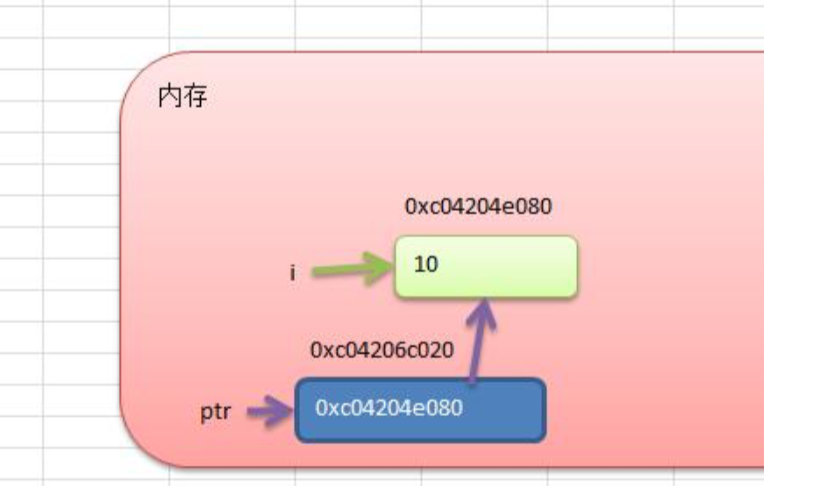

```go
package main

import (
    "fmt"
)


// 结果：
// i的地址= 0xc000096008
// ptr=0xc000096008
// ptr 的地址=0xc00008c020
// ptr 指向的值=10

func main() {

    // 基本数据类型在内存布局
    var i int = 10
    // i 的地址是什么,&i
    fmt.Println("i的地址=", &i)

    // 下面的 var ptr *int = &i
    // 1. ptr 是一个指针变量
    // 2. ptr 的类型 *int
    // 3. ptr 本身的值&i
    var ptr *int = &i
    fmt.Printf("ptr=%v\n", ptr)
    fmt.Printf("ptr 的地址=%v\n", &ptr)
    fmt.Printf("ptr 指向的值=%v", *ptr)

}
```

## `map` 相关

#### `map` 的 `value` 赋值

<span id="map_value">关于`map`的`value` 赋值，下面的代码输出什么内容？</span>

```go
package main

import "fmt"

type Student struct {
    Name string
}

var list map[string]Student

func main() {

    list = make(map[string]Student)
    fmt.Println(list)            // map[] 返回引用类型本身
    fmt.Println(list["student"]) // {}

    student := Student{"wangxiong"}

    list["student"] = student
    list["student"].Name = "wwxiong"

    fmt.Println(list["student"]) // {wangxiong}
}

```

结果：编译失败。

```go
cannot assign to struct field list["student"].Name in map
```

解析：`map[string]Student` 的`value`是一个`Student`结构值，所以当`list["student"] = student，`是一个值拷贝过程。而`list["student"]`则是一个值引用。那么值引用的特点是`只读`。所以对`list["student"].Name = "wwxiong"`的修改是不允许。

正确使用：

```go
package main

import "fmt"

type Student struct {
    Name string
}

var list map[string]*Student

func main() {

    list = make(map[string]*Student)

    student := Student{"wangxiong"}

    list["student"] = &student
    list["student"].Name = "wwxiong"

    fmt.Println(list["student"]) // &{wwxiong}
}
```

#### `map` 的遍历赋值

<span id="map_for">关于`map`的遍历赋值，下面的代码输出什么内容？</span>

```go
package main

import "fmt"

type student struct {
    Name string
    Age  int
}

func main() {
    // 定义map
    m := make(map[string]*student)

    // 定义student数组
    stus := []student{
        {Name: "zhou", Age: 24},
        {Name: "li", Age: 23},
        {Name: "wang", Age: 22},
    }

    // 将数组依次添加到map中
    for _, stu := range stus {
        fmt.Println(&stu)
        m[stu.Name] = &stu
    }

    // 打印map
    for k, v := range m {
        fmt.Println(k, "=>", v.Name)
    }
}
```

结果：

```go
// 结果：
// li => wang
// wang => wang
// zhou => wang
```

解析：`m`是一个`make`初始化后的`map`，属于引用类型。`stu`是结构体的一个拷贝副本，所以`m[stu.Name]`=`&stu`实际上一致指向同一个指针， 最终该指针的值为遍历的最后一个`struct`的值拷贝。

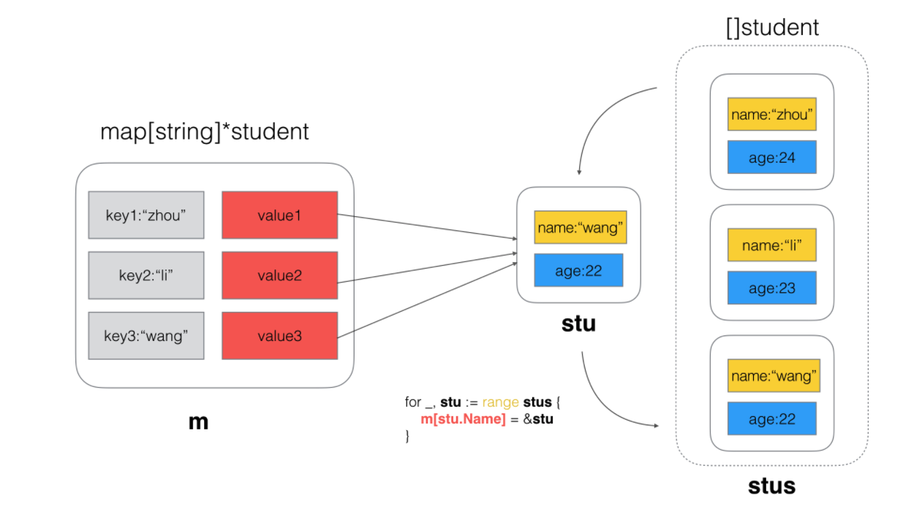

正确写法：

```go
package main

import "fmt"


type student struct {
    Name string
    Age  int
}

func main() {
    // 定义map
    m := make(map[string]*student)

    // 定义student数组
    stus := []student{
        {Name: "zhou", Age: 24},
        {Name: "li", Age: 23},
        {Name: "wang", Age: 22},
    }
    
    // 遍历结构体数组，依次赋值给map
    for i := 0; i < len(stus); i++  {
        m[stus[i].Name] = &stus[i]
    }


    // 打印map
    for k, v := range m {
        fmt.Println(k, "=>", v.Name)
    }
}
```

运行结果：

```go
zhou => zhou
li => li
wang => wang
```

解析：

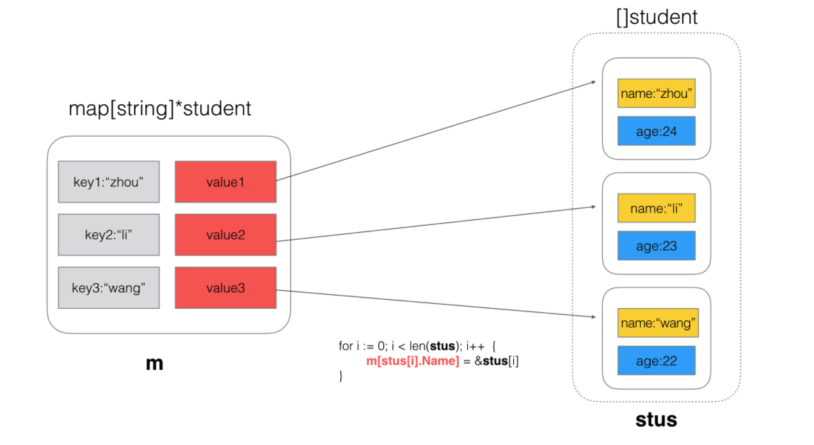

## `slice `追加和拼接

<span id="slice_append">关于`slice`的追加和拼接问题，分析下面两段代码。</span>

```go
package main

import (
    "fmt"
)

// 结果：[0 0 0 0 0 0 0 0 0 0 1 2 3]
// 解析：make 初始化均为0；
// append 操作的本质就是对数组扩容；
// go 底层会创建一个新的数组 newArr(按照扩容后大小) 将 slice原来包含的元素拷贝到新的数组 newArr， slice 重新引用到 newArr。
func main() {
    s := make([]int, 10)

    s = append(s, 1, 2, 3)

    fmt.Println(s)
}
```

 解析：`make` 初始化均为0；`make` 在初始化切片时指定了⻓度，所以追加数据时会从` len(s) `位置开始填充数据，append` 操作的本质就是对数组扩容。

```go
package main

import "fmt"

// 结果：cannot use s2 (type []int) as type int in append

// 解析：func append(slice []Type, elems ...Type) []Type
// The append built-in function appends elements to the end of a slice. If
// it has sufficient capacity, the destination is resliced to accommodate the
// new elements. If it does not, a new underlying array will be allocated.
// Append returns the updated slice. It is therefore necessary to store the
// result of append, often in the variable holding the slice itself:
//	slice = append(slice, elem1, elem2)
//	slice = append(slice, anotherSlice...)
// As a special case, it is legal to append a string to a byte slice, like this:
//	slice = append([]byte("hello "), "world"...)

func main() {
    s1 := []int{1, 2, 3}
    s2 := []int{4, 5}
    s1 = append(s1, s2)
    // s1 = append(s1, s2...)
    fmt.Println(s1)
}
```

结果：`cannot use s2 (type []int) as type int in append`。

解析：

```go
slice = append(slice, elem1, elem2)
slice = append(slice, anotherSlice...)
```

## 函数返回值命名

<span id="return_value">关于函数返回值命名问题，下面代码是否可以编译通过？</span>

```go
package main

import "fmt"

/*
   下面代码是否编译通过?
*/

// 结果：syntax error: mixed named and unnamed function parameters

// 解析：在函数有多个返回值时，只要有一个返回值有指定命名，其他的也必须有命名。
// 如果返回值有有多个返回值必须加上括号；
// 如果只有一个返回值并且有命名也需要加上括号；
// 此处函数第一个返回值有 sum 名称，第二个未命名，所以错误。

func myFunc(x, y int) (sum int, error) {
    return x + y, nil
}

func main() {
    num, _ := myFunc(1, 2)
    fmt.Println("num = ", num)
}

```

在函数有多个返回值时，只要有一个返回值有指定命名，其他的也必须有命名。 如果返回值有有多个返回值必须加上括号； 如果只有一个返回值并且有命名也需要加上括号； 此处函数第一个返回值有`sum`名称，第二个未命名，所以错误。

## `string `与 `nil` 类型

<span id="string_nil">关于函数的返回值类型，下面代码是否能够编译通过？为什么？</span>

```go
package main

import (
    "fmt"
)

func GetValue(m map[int]string, id int) (string, bool) {
	if _, exist := m[id]; exist {
		return "存在数据", true
	}
	return nil, false
}

func main()  {
	intmap:=map[int]string{
		1:"a",
		2:"bb",
		3:"ccc",
	}

	v,err:=GetValue(intmap,3)
	fmt.Println(v,err)
}
```

`nil` 可以用作 `interface`、`function`、`pointer`、`map`、`slice` 和 `channel` 的“空值”。但是如果不特别指定的话，Go 语言不能识别类型，所以会报错。通常编译的时候不会报错，但是运行的时候会报:`cannot use nil as type string in return argument`。

## 结构体比较

<span id="struct_compare">关于结构体比较，下面代码是否可以编译通过？为什么？</span>

```go
package main

import (
    "fmt"
    "reflect"
)

// 结果：invalid operation: sn1 == sn3 (mismatched types struct { age int; name string } and struct { name string; age int })
// invalid operation: sm1 == sm2 (struct containing map[string]string cannot be compared)

// 解析：结构体比较规则
// ① 只有相同类型的结构体才可以比较，结构体是否相同不但与属性类型个数有关，还与属性顺序相关。
// ② 结构体是相同的，但是结构体属性中有不可以比较的类型，如map,slice，则结构体不能用 == 比较，可以使用 reflect.DeepEqual 进行比较。
func main() {

    sn1 := struct {
        age  int
        name string
    }{age: 11, name: "qq"}

    sn2 := struct {
        age  int
        name string
    }{age: 11, name: "qq"}

    sn3 := struct {
        name string
        age  int
    }{age: 11, name: "qq"}

    if sn1 == sn2 {
        fmt.Println("sn1 == sn2")
    }

    // 结构体比较与属性的顺序有关
    if sn1 == sn3 {
        fmt.Println("sn1 == sn3")
    }

    sm1 := struct {
        age int
        m   map[string]string
    }{age: 11, m: map[string]string{"a": "1"}}

    sm2 := struct {
        age int
        m   map[string]string
    }{age: 11, m: map[string]string{"a": "1"}}

    // 结构体中的 map 需要使用 reflect.DeepEqual 进行比较
    if sm1 == sm2 {
        fmt.Println("sm1 == sm2")
    }

    if reflect.DeepEqual(sm1, sm2) {
        fmt.Println("sm1 == sm2")
    } else {
        fmt.Println("sm1 != sm2")
    }
}
```

解析：① 只有相同类型的结构体才可以比较，结构体是否相同不但与属性类型个数有关，还与属性顺序相关。

② 结构体是相同的，但是结构体属性中有不可以比较的类型，如`map`,`slice`，则结构体不能用 == 比较，可以使用`reflect.DeepEqual`进行比较。

##  常量地址 & 内存四区

<span id="const">下面的函数有什么问题，是否可以获取常量的地址？什么是内存的四区？</span>

```go
package main

const cl = 100
var bl = 123

func main() {
    println(&bl, bl)
    println(&cl, cl)
}
```

上面函数会报错，不能获取常量的地址，常量没有地址。常量是无法取出地址的，因为字面量符号并没有地址而言。常量不同于变量的在运行期分配内存，常量通常会被编译器在预处理阶段直接展开，作为指令数据使用。

```
cannot take the address of cl
```

内存四区说明如下：

* **栈区(`Stack`)**：空间较小，要求数据读写性能高，数据存放时间较短暂。由编译器自动分配和释放，存放函数的参数值、函数的调用流程方法地址、局部变量等(局部变量如果产生逃逸现象，可能会挂在在堆区)。
* **堆区(`Heap`)**：空间充裕，数据存放时间较久。一般由开发者分配及释放(但是`Golang`中会根据变量的逃逸现象来选择是否分配到栈上或堆上)，启动`Golang`的`GC`由`GC`清除机制自动回收。
* **全局区-静态全局变量区**：全局变量的开辟是在程序在main之前就已经放在内存中。而且对外完全可见。即作用域在全部代码中，任何同包代码均可随时使用，在变量会搞混淆，而且在局部函数中如果同名称变量使用:=赋值会出现编译错误。全局变量最终在进程退出时，由操作系统回收。
* **全局区-常量区**：常量区也归属于全局区，常量为存放数值字面值单位，即不可修改。或者说的有的常量是直接挂钩字面值的。

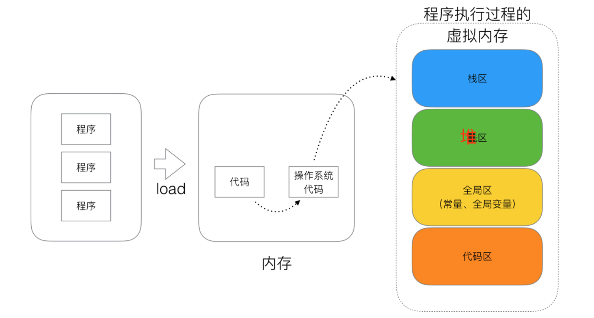


## `nil slice` 和 `non-nil` 空`slice`

<span id="nil_slice">`JSON` 标准库对 `nil slice` 和 `non-nil`空 `slice` 的处理是一致的吗？</span>

在对切片进行`json.Marshal`编码的时候，`nil`切片会被编码成`null`，而`non-nil`空切片会被编码成空数组`[]`。如下代码所示：

```go
type Person {
 Friends []string
}

func main() {
    var f1 []string // nil切片
    json1, _ := json.Marshal(Person{Friends: f1})
    fmt.Printf("%s\n", json1) // output：{"Friends": null}

    f2 := make([]string, 0) // non-nil空切片
    json2, _ := json.Marshal(Person{Friends: f2})
    fmt.Printf("%s\n", json2) // output: {"Friends": []}
}
```

`nil`切片和`non-nil`空切片的区别：`nil`切片除了长度和容量都是0之外，还有就是`ptr`指针不指向任何底层数组，这也是`nil`切片和`non-nil`空切片的本质区别。

空切片的定义：**如果切片的长度是0，那么称该切片是空切片**。

`nil`的定义：

> nil is a predeclared identifier representing the zero value for a pointer, channel, func, interface, map, or slice type.

翻译成中文的大致含义是：**`nil`是为`pointer`、`channel`、`func`、`interface`、`map`或`slice`类型预定义的标识符，代表这些类型的零值。**

`nil slice` 和`non-nil`空 `slice`代码示意：

```go
// 定义变量
var s []string
fmt.Printf("1:nil=%t, len=%d, cap=%d\n", s == nil, len(s), cap(s))

// 组合字面量方式
s = []string{}
fmt.Printf("2:nil=%t, len=%d, cap=%d\n", s == nil, len(s), cap(s))

// make方式
s = make([]string, 0)
fmt.Printf("3: nil=%t, len=%d, cap=%d\n", s == nil, len(s), cap(s))
```

运行上面的代码，将会有如下的输出：

```go
1: nil=true, len=0, cap=0
2: nil=false, len=0, cap=0
3: nil=false, len=0, cap=0
```


<span id="defer_recover">`defer`、`recover`和`panic`的问题？</span>

`goroutine`、`panic`、`recover`和`defer`这四者在本质上是**互相联动**的关系，**使用细节总结如下：**

- `panic`只能触发当前`goroutine` 的 `defer `调用。在`defer`调用中只要存在`recover` ，就能处理其抛出的`panic`事件。需要注意的是，其他`goroutine`中的`defer`对其不起作用，即不支持跨协程调用。
- 想要捕获或处理`panic`造成的恐慌事件，`recover`必须与`defer`配套使用，否则无效。
- 在Go语言中，是存在一些无法恢复的致命错误方法的，如`fatalthrow`方法和`fatalpanic`方法等，它们一般在并发写入`map`等处理时抛出，需要谨慎。

```go
package main

import "fmt"

// 结果：main func end
// recover: defer panic

func main() {
    go func() {
        defer func() {
            if e := recover(); e != nil {
                fmt.Printf("recover: %v", e)
            }
        }()
        panic("defer panic")
    }()

    fmt.Println("main func end")
}
```


## 常见协程泄露问题

* Cgo
* http body没有关闭，链接泄露。
* 每个请求新建 Transport
* Goroutine 死循环
* Channel 阻塞，好习惯，及时关闭生产者的channel。

## 进程、线程和协程

<span id="coroutine">问：进程、线程、协程各自的优缺点？</span>

> 进程是资源分配的最小单位，线程是资源调度的最小单位。

* 占用内存及创建及切换成本：进程 （内核级）> 线程（内核级） >> 协程（用户级）。
* 进程有自己的独立空间，多进程程序更健壮，多线程程序只要有一个线程死掉，整个进程也死掉了，而一个进程死掉并不会对另外一个进程造成影响。
* 创建和维护进程的开销非常昂贵，线程是共享进程中的数据的，使用相同的地址空间，因此`CPU`切换一个线程的花费远比进程要小很多。
* **线程是被内核所调度**，**协程的调度完全由用户控制**，用户态到内核态转换，开销比较多。协程的开销远小于线程的开销，线程的开销又远小于进程的开销。协程是内存占用最小，且创建开销最小。

#### 什么是进程？

进程（`Process`）是具有一定独立功能的程序、它是系统进行资源分配和调度的一个独立单位，重点在系统调度和单独的单位，也就是说进程是可以独立运行的一段程序。

#### 什么是线程？

线程（`Thread`）进程的一个实体，是`CPU`调度和分派的基本单位，它是比进程更小的能独立运行的基本单位，线程自己基本上不拥有系统资源，在运行时，只是暂用一些计数器、寄存器和栈。

> 注：进程是资源分配的最小单位，线程是资源调度的最小单位。

多进程的出现是为了解决 CPU 利用率的问题，而线程的出现是为了减少上下文切换时的开销。

#### 什么是协程？

协程 `Coroutines` 是一种比线程更加轻量级的微线程。类比一个进程可以拥有多个线程，一个线程也可以拥有多个协程，因此协程又称微线程和纤程。

`Coroutines` 具有以下特点：

- 用户空间避免了内核态和用户态的切换导致的成本。
- 可以由语言和框架层进行调度。
- 更小的栈空间允许创建大量的实例。

协程是用户视角的一种抽象，操作系统并没有这个概念，其主要思想是在用户态实现调度算法，用少量线程完成大量任务的调度。

多任务实现的三种模式：

* 多进程模式：启动多个进程，每个进程虽然只有一个线程，但多个进程可以一块执行多个任务。
* 多线程模式：启动一个进程，在一个进程内启动多个线程，这样多个线程也可以一块执行多个任务。
* 多进程+多线程模式：启动多个进程，每个进程再启动多个线程，这样同时执行的任务就更多了，当然这种模型更复杂，实际很少采用。

从单进程到多进程提高了 CPU 利用率；从进程到线程，降低了上下文切换的开销；从线程到协程，进一步降低了上下文切换的开销，使得高并发的服务可以使用简单的代码写出。

#### 进程与线程的区别

> 一个程序至少有一个进程，一个进程至少有一个线程。
>
> 一个进程可以创建销毁多个线程，同一个进程中的多个线程可以并发执行。

- 进程是资源（`CPU`、内存等）分配的最小单位，线程是程序执行的最小单位（资源调度的最小单位）。
- 进程有自己的独立地址空间，每启动一个进程，系统就会为它分配地址空间，建立数据表来维护代码段、堆栈段和数据段，这种操作非常昂贵。线程是共享进程中的数据的，使用相同的地址空间，因此`CPU`切换一个线程的花费远比进程要小很多，同时创建一个线程的开销也比进程要小很多。
- 线程之间的通信更方便，同一进程下的线程共享全局变量、静态变量等数据，而进程之间的通信需要以进程间通信的方式 `IPC`（`Inter-Process Communication`）进行。不过如何处理好同步与互斥是编写多线程程序的难点
- 多进程程序更健壮，多线程程序只要有一个线程死掉，整个进程也死掉了，而一个进程死掉并不会对另外一个进程造成影响，因为进程有自己独立的地址空间。

#### 进程 VS 线程

类比：进程=火车，线程=车厢

- 一个进程可以包含多个线程（一辆火车包含多节车厢）
- 线程依赖于进程，它是进程中一个完整的执行路径 （车厢依赖火车，单纯的车厢无法运行）
- 进程间的通信通过`IPC`(`Inter-Process Communication`）进行,比如管道(`pipe`)、信号量(`semophore`)、消息队列(`messagequeue`) 、 套接字(`socket`)等 （一辆火车上的乘客换到另外一辆火车，需要在站点进行换乘）
- 线程间的通信通过共享内存（`Shared Memory`）、消息队列等方式进行 （同一辆火车，A车厢换到B车厢很容易）
- 创建一个进程的开销比创建一个线程开销要消耗更多的计算机资源 （采用多列火车相比多个车厢更耗资源）
- 进程间不会相互影响，但是一个线程挂掉将导致整个进程挂掉（火车之间相互不影响，一个车厢断裂会影响火车运行）
- 一个线程使用共享内存时，其他线程必须等它结束，才能使用这一块内存 。多个线程同时对同一公共资源（比如全局变量）进行读写需要使用互斥锁（车厢中使用洗手间，需要上锁）
- 一个进程使用的内存地址可以限定使用量--信号量（火车上的餐厅最多同时容纳一定乘客数量，需要等有人出来才能进去）

#### 协程 VS 线程

|          | 协程                                                         | 线程                                                         |
| -------- | ------------------------------------------------------------ | ------------------------------------------------------------ |
| 切换成本 | 协程切换只需要保存三个寄存器，耗时约200纳秒。                | 线程切换需要保存几十个寄存器，耗时约1000纳秒。               |
| 调度方式 | 非抢占式，由 go runtime 主动交出控制权。                     | 在时间片用完后，由CPU中断任务强行将其调度走，此时需要保存很多信息。 |
| 创建销毁 | goroutine 因为是由 go runtime 进行管理的，创建和销毁都非常小，属于用户级的。 | 因为要和操作系统打交道，是属于内核级的，创建和销毁开销大，通常解决办法是通过线程池。 |

> 协程跟线程是有区别的，线程由CPU调度是抢占式的，**协程由用户态调度是协作式的**，一个协程让出CPU后，才执行下一个协程。

**线程是被内核所调度**，线程被调度切换到另一个线程上下文的时候，需要保存一个用户线程的状态到内存，恢复另一个线程状态到寄存器，然后更新调度器的数据结构，这几步操作设计用户态到内核态转换，开销比较多。

**协程的调度完全由用户控制**，协程拥有自己的寄存器上下文和栈，协程调度切换时，将寄存器上下文和栈保存到其他地方，在切回来的时候，恢复先前保存的寄存器上下文和栈，直接操作用户空间栈，完全没有内核切换的开销。

##  `string` 和 `[]byte` 的转换原理

了解`string`和`[]byte`转换原理吗？会发生内存拷⻉吗? 如何进行高效转换？

`string`底层是一个`byte`数组。两者之间的标准转换示例:

```go
func main() {
    str := "wwxiong"
    // string 转 []byte
    by := []byte(str)
    fmt.Println(by) // [119 119 120 105 111 110 103]
    // []byte 转 string
    str1 := string(by)
    fmt.Println(str1) // wwxiong
}
```

### **`byte `和`[]byte `类型**

`byte`的官方定义：

```go
// src/builtin/builtin.go
// byte is an alias for uint8 and is equivalent to uint8 in all ways. It is
// used, by convention, to distinguish byte values from 8-bit unsigned
// integer values.
type byte = uint8
```

> `byte`就是`uint8`的别名，它是用来区分**字节值**和**8位无符号整数值**。

注：`bit`是计算机中的最小存储单位。`byte`是计算机中基本存储单元。` 1byte = 8 bit`

如果我们保存的字符在 ASCII 表的，比如`[0-1, a-z,A-Z..]`直接可以保存到 `byte`。

如果我们保存的字符对应码值大于 255，这时我们可以考虑使用 `int` 类型保存。

`[]byte`其实是一个`byte`类型的切片，切片本质也是一个结构体，定义如下：

```go
// src/runtime/slice.go
type slice struct {
	array unsafe.Pointer
	len   int
	cap   int
}
```

`array`代表底层数组的指针，`len`代表切片长度，`cap`代表容量。看一个简单示例：

```go
func main()  {
 sl := make([]byte,0,2)
 sl = append(sl, 'A')
 sl = append(sl,'B')
 fmt.Println(sl)
}
```

该示例的示意图：

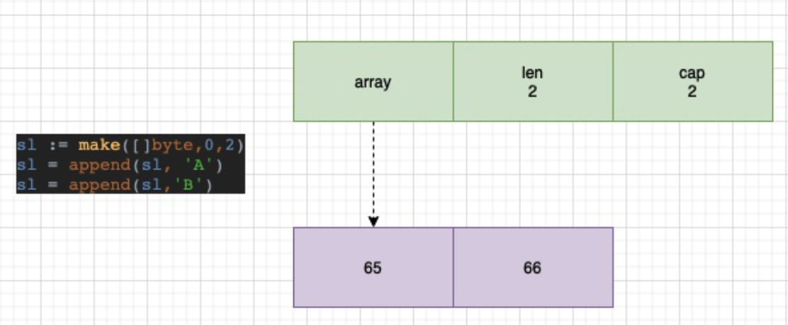

### `string `类型

`string`的官方定义：

```go
// src/builtin/builtin.go
// string is the set of all strings of 8-bit bytes, conventionally but not
// necessarily representing UTF-8-encoded text. A string may be empty, but
// not nil. Values of string type are immutable.
type string string
```

> `string`是一个`8`位字节的集合，通常但不一定代表UTF-8编码的文本。`string`可以为空，但是不能为`nil`。**string的值是不能改变的**。

`string`类型本质也是一个结构体，定义如下：

```go
// src/runtime/string.go
type stringStruct struct {
    str unsafe.Pointer
    len int
}
```

`stringStruct`和`slice`还是很相似的，`str`指针指向的是某个数组的首地址，`len`代表的就是数组长度。

`string`实例化时调用的方法：

```go
// src/runtime/string.go
//go:nosplit
func gostringnocopy(str *byte) string {
	ss := stringStruct{str: unsafe.Pointer(str), len: findnull(str)}
	s := *(*string)(unsafe.Pointer(&ss))
	return s
}
```

从上面方法可以看出，入参是一个`byte`类型的指针，因此`string`类型底层是一个`byte`类型的数组。示意图如下：

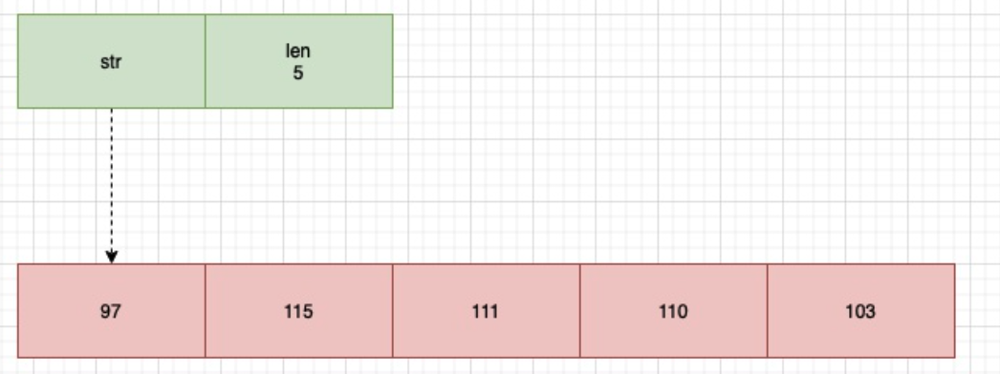


### `string`  和`[]byte`  的区别

`string`类型的底层本质，其实是一个`byte`类型的数组。那`string`类型为什么还要在数组的基础上再进行一次封装呢？

`Go`语言中`string`类型被设计为不可变的，不仅是在`Go`语言，其他语言中`string`类型也是被设计为不可变的。这样的好处就是：在并发场景下，我们可以在不加锁的控制下，多次使用同一字符串，在保证高效共享的情况下而不用担心安全问题。

`string`类型虽然是不能更改的，但是可以被替换，因为`stringStruct`中的`str`指针是可以改变的，只是指针指向的内容是不可以改变的。看个例子：

```go
func main() {
    str := "wxiong"
    fmt.Printf("%p\n", []byte(str)) // 0xc0000b8008
    str = "wwxiong"
    fmt.Printf("%p\n", []byte(str)) // 0xc0000b8020
}
```

上面示例的指针指向的位置发生了变化，也就说每一个更改字符串，就需要重新分配一次内存，之前分配的空间会被`gc`回收。

### `string `和`[]byte` 标准转换

`Go`语言中提供了标准方式对`string`和`[]byte`进行转换：

```go
func main() {
    str := "wwxiong"
    // string转[]byte
    by := []byte(str)
    fmt.Println(by) // [119 119 120 105 111 110 103]
    // []byte转string
    str1 := string(by)
    fmt.Println(str1) // wwxiong
}
```

### `string` 标准转换 `[]byte` 的原理

`string`转`[]byte`的标准转换示例：

```go
func main() {
    str := "wwxiong"
    //  string转[]byte
    by := []byte(str)
    fmt.Println(by) // [119 119 120 105 111 110 103]
}
```

源码：

```go
// runtime/string.go

// The constant is known to the compiler.
// There is no fundamental theory behind this number.
const tmpStringBufSize = 32

type tmpBuf [tmpStringBufSize]byte

func stringtoslicebyte(buf *tmpBuf, s string) []byte {
	var b []byte
  // 通过判断字符串长度来决定是否需要重新分配一块内存，32是阈值，超过32才会进行内存分配。
	if buf != nil && len(s) <= len(buf) {
		*buf = tmpBuf{}
		b = buf[:len(s)]
	} else {
		b = rawbyteslice(len(s))
	}
	copy(b, s)
	return b
}

// rawbyteslice allocates a new byte slice. The byte slice is not zeroed.
func rawbyteslice(size int) (b []byte) {
	cap := roundupsize(uintptr(size))
	p := mallocgc(cap, nil, false)
	if cap != uintptr(size) {
		memclrNoHeapPointers(add(p, uintptr(size)), cap-uintptr(size))
	}

	*(*slice)(unsafe.Pointer(&b)) = slice{p, size, int(cap)}
	return
}

// builtin/builtin.go

// The copy built-in function copies elements from a source slice into a
// destination slice. (As a special case, it also will copy bytes from a
// string to a slice of bytes.) The source and destination may overlap. Copy
// returns the number of elements copied, which will be the minimum of
// len(src) and len(dst).
func copy(dst, src []Type) int
```

`copy(b, s)`调用`copy`方法实现`string`到`[]byte`的拷贝，具体实现：

```go
// src/runtime/slice.go
// 将string的底层数组从头部复制n个到[]byte对应的底层数组中去
func slicestringcopy(toPtr *byte, toLen int, fm string) int {
	if len(fm) == 0 || toLen == 0 {
		return 0
	}

	n := len(fm)
	if toLen < n {
		n = toLen
	}

	if raceenabled {
		callerpc := getcallerpc()
		pc := funcPC(slicestringcopy)
		racewriterangepc(unsafe.Pointer(toPtr), uintptr(n), callerpc, pc)
	}
	if msanenabled {
		msanwrite(unsafe.Pointer(toPtr), uintptr(n))
	}

	memmove(unsafe.Pointer(toPtr), stringStructOf(&fm).str, uintptr(n))
	return n
}
```

### `[]byte `标准转换 `string` 的原理

`[]byte `标准转换 `string`示例：

```go
func main() {
    bt := []byte{119, 119, 120, 105, 111, 110, 103}
    str := string(bt)
    fmt.Println(str) // wwxiong
}
```

源码：`/src/runtime/string.go`

```go
// The constant is known to the compiler.
// There is no fundamental theory behind this number.
const tmpStringBufSize = 32

type tmpBuf [tmpStringBufSize]byte

// slicebytetostring converts a byte slice to a string.
// It is inserted by the compiler into generated code.
// ptr is a pointer to the first element of the slice;
// n is the length of the slice.
// Buf is a fixed-size buffer for the result,
// it is not nil if the result does not escape.
func slicebytetostring(buf *tmpBuf, ptr *byte, n int) (str string) {
	if n == 0 {
		// Turns out to be a relatively common case.
		// Consider that you want to parse out data between parens in "foo()bar",
		// you find the indices and convert the subslice to string.
		return ""
	}
	if raceenabled {
		racereadrangepc(unsafe.Pointer(ptr),
			uintptr(n),
			getcallerpc(),
			funcPC(slicebytetostring))
	}
	if msanenabled {
		msanread(unsafe.Pointer(ptr), uintptr(n))
	}
	if n == 1 {
		p := unsafe.Pointer(&staticuint64s[*ptr])
		if sys.BigEndian {
			p = add(p, 7)
		}
		stringStructOf(&str).str = p
		stringStructOf(&str).len = 1
		return
	}

	var p unsafe.Pointer
	if buf != nil && n <= len(buf) {
		p = unsafe.Pointer(buf)
	} else {
		p = mallocgc(uintptr(n), nil, false)
	}
	stringStructOf(&str).str = p
	stringStructOf(&str).len = n
	memmove(p, unsafe.Pointer(ptr), uintptr(n))
	return
}
```

这段代码通过根据`[]byte`的长度来决定是否重新分配内存，最后通过`memove`可以拷贝数组到字符串。

### `string` 强转换 `[]byte` 实现

标准的转换方法都会发生内存拷贝，所以为了减少内存拷贝和内存申请我们可以使用强转换的方式对两者进行转换。`string` 强转换 `[]byte`示例：

```go
package main

import (
    "fmt"
    "reflect"
    "unsafe"
)

// 问题：字符串转成 byte 数组，会发生内存拷⻉吗? 有没有什么办法可以在字符串转成切片的时候不用发生拷⻉呢?

// 解析1：如果想要在底层转换二者，只需要把 StringHeader 的地址强转成 SliceHeader 就行。 go有个很强的包叫 unsafe 。
// 1. unsafe.Pointer(&a) 方法可以得到变量a的地址。
// 2. (*reflect.StringHeader)(unsafe.Pointer(&a)) 可以把字符串a转成底层结构的形式。
// 3. (*[]byte)(unsafe.Pointer(&ssh)) 可以把 ssh 底层结构体转成 byte 的切片的指针。
// 4. 再通过 * 转为指针指向的实际内容。

// 强制转换带来的安全问题 // b[0] = 10
// unexpected fault address 0x10ce277
// fatal error: fault
// [signal SIGBUS: bus error code=0x2 addr=0x10ce277 pc=0x10a8b21]
// 解析2：string 类型是不能改变的，也就是底层数据是不能更改的。
// 这里使用的是强转换的方式，那么 by 指向了 str 的底层数组，现在对这个数组中的元素进行更改，程序直接发生严重错误了，即使使用 defer+recover 也无法捕获。

// StringHeader 是字符串在 go 的底层结构。
// StringHeader is the runtime representation of a string.
// It cannot be used safely or portably and its representation may
// change in a later release.
// Moreover, the Data field is not sufficient to guarantee the data
// it references will not be garbage collected, so programs must keep
// a separate, correctly typed pointer to the underlying data.
type StringHeader struct {
    Data uintptr
    Len  int
}

// SliceHeader 是切片在 go 的底层结构。
// SliceHeader is the runtime representation of a slice.
// It cannot be used safely or portably and its representation may
// change in a later release.
// Moreover, the Data field is not sufficient to guarantee the data
// it references will not be garbage collected, so programs must keep
// a separate, correctly typed pointer to the underlying data.
type SliceHeader struct {
    Data uintptr
    Len  int
    Cap  int
}

func main() {
    a := "wang xiong"
    ssh := *(*reflect.StringHeader)(unsafe.Pointer(&a))
    b := *(*[]byte)(unsafe.Pointer(&ssh))
    // unexpected fault address 0x10ce277
    // fatal error: fault
    // [signal SIGBUS: bus error code=0x2 addr=0x10ce277 pc=0x10a8b21]
    // b[0] = 10 // 强制转换带来的安全问题
    fmt.Printf("%v", b) // [119 97 110 103 32 120 105 111 110 103]
}
```

###`[]byte`强转换`string` 实现

```go
// slicebytetostringtmp returns a "string" referring to the actual []byte bytes.
//
// Callers need to ensure that the returned string will not be used after
// the calling goroutine modifies the original slice or synchronizes with
// another goroutine.
//
// The function is only called when instrumenting
// and otherwise intrinsified by the compiler.
//
// Some internal compiler optimizations use this function.
// - Used for m[T1{... Tn{..., string(k), ...} ...}] and m[string(k)]
//   where k is []byte, T1 to Tn is a nesting of struct and array literals.
// - Used for "<"+string(b)+">" concatenation where b is []byte.
// - Used for string(b)=="foo" comparison where b is []byte.
func slicebytetostringtmp(ptr *byte, n int) (str string) {
	if raceenabled && n > 0 {
		racereadrangepc(unsafe.Pointer(ptr),
			uintptr(n),
			getcallerpc(),
			funcPC(slicebytetostringtmp))
	}
	if msanenabled && n > 0 {
		msanread(unsafe.Pointer(ptr), uintptr(n))
	}
	stringStructOf(&str).str = unsafe.Pointer(ptr)
	stringStructOf(&str).len = n
	return
}
```


### 标准转换和强转换的取舍

从安全角度出发，更建议使用标准转换，但是标准转换缺点是频繁的内存拷⻉操作听起来对性能不大友好。

强制转换虽然性能更佳，但是会产生安全问题，如下是`string`字符串转`[]byte`导致的安全问题：

```go
package main

import (
    "reflect"
    "unsafe"
)

// 结果：
// unexpected fault address 0x109d9ff
// fatal error: fault
// [signal SIGBUS: bus error code=0x2 addr=0x109d9ff pc=0x107ee5c]

// 解析：string 类型是不能改变的，也就是底层数据是不能更改的。
// 这里使用的是强转换的方式，那么 by 指向了 str 的底层数组，现在对这个数组中的元素进行更改，程序直接发生严重错误了，即使使用 defer+recover 也无法捕获。

func stringToSliceByteTmp(s string) []byte {
    str := (*reflect.StringHeader)(unsafe.Pointer(&s))
    ret := reflect.SliceHeader{Data: str.Data, Len: str.Len, Cap: str.Len}
    return *(*[]byte)(unsafe.Pointer(&ret))
}

func main() {
    str := "hello"
    by := stringToSliceByteTmp(str)
    by[0] = 'H'
}
```

结论：无论是使用标准转换还是强制转换，都是根据实际业务场景进行选择，脱离实际业务场景做选择其实都是不合适的。

## 读写锁 `RWMutex` 和互斥锁 `Mutex` 

下面的代码有什么问题?

```go
package main

import "sync"

type UserAges struct {
    ages map[string]int
    sync.Mutex
    // sync.RWMutex
}

func (ua *UserAges) Add(name string, age int) {
    ua.Lock()
    defer ua.Unlock()
    ua.ages[name] = age
}
func (ua *UserAges) Get(name string) int {
    if age, ok := ua.ages[name]; ok {
        return age
    }
    return -1
}
```

解析：

在执行 `Get`方法时可能被`panic`。 

虽然有使用`sync.Mutex`做写锁，但是`map`是并发读写不安全的。`map`属于引用类型，并发读写时多个协程⻅是通过指针访问同一个地址，即访问共享变量，此时同时读写资源 存在竞争关系。会报错误信息:`“fatal error: concurrent map read and map write”`。 因此，在 `Get` 中也需要加锁，因为这里只是读，建议使用读写锁 `sync.RWMutex` 。


## `make` 初始化的 `channel  `阻塞

02、下面的迭代会有什么问题?

```go
func (set *threadSafeSet) Iter() <-chan interface{} {
    ch := make(chan interface{})
    go func() {
        set.RLock()
        for elem := range set.s {
            ch <- elem
        }
        close(ch)
        set.RUnlock()
    }()
    return ch
}
```

解析：默认情况下 `make` 初始化的 `channel` 是无缓冲的，也就是在迭代写时会阻塞。

定义和声明`channel`格式：

```go
var intChan chan int // intChan 用于存放 int 数据
var mapChan chan map[int]string // mapChan 用于存放 map[int]string 类型
var perChan chan Person
var perChan2 chan *Person
....
```

只读和只写示例：

```go
var chan1 chan int   // 可读可写
var chan2 chan<- int // 声明为只写
chan2 = make(chan int, 3)
var chan3 <-chan int // 声明为只读
```

说明：

* `channel` 是引用类型。`channel` 必须初始化才能写入数据，即 `make` 后才能使用。
* `channel`是有类型的，`intChan` 只能写入整数 `int`...。
* `channle`的数据放满后，就不能再放入了；如果从 `channel` 取出数据后，可以继续放入。
* 在没有使用协程的情况下，如果 `channel` 数据取完了，再取就会报 `dead lock`。
* 管道可以声明为只读或者只写，在默认情况下下，管道是双向（可读可写）。如果只是向管道写入数据而没有读取，就会出现阻塞而`deadlock`。

## `interface` 关键字

03、以下代码能编译过去吗?为什么?

```go
package main

import (
    "fmt"
)

type People interface {
    Speak(string) string
}
type Student struct{}

func (stu *Student) Speak(think string) (talk string) {
    if think == "good" {
        talk = "You are a good boy"
    } else {
        talk = "hi"
    }
    return
}
func main() {
 		// cannot use Student literal (type Student) as type People in assignment:
    // Student does not implement People (Speak method has pointer receiver)
    // var peo People = Student{}
    var peo People = &Student{}
    think := "good"
    fmt.Println(peo.Speak(think))
}
```

结果：

```go
cannot use Student literal (type Student) as type People in assignment:
Student does not implement People (Speak method has pointer receiver)
```


解析：编译失败，值类型 `Student{}` 未实现接口 `People` 的方法，不能定义为 `People` 类 型。

在 `golang` 语言中， `Student` 和 `*Student` 是两种类型，第一个是表示 `Student` 本 身，第二个是指向 `Student `的指针。


**接口本身不能创建实例，但是可以指向一个实现了该接口的自定义类型的变量（实例）。**

```go
package main

import "fmt"

type AInterface interface {
    Say()
}

type Stu struct {
    Name string
}

func (stu Stu) Say() {
    fmt.Println("Stu Say()")
}

func main() {
    var stu Stu // 结构体变量，实现了 Say() 实现了 AInterface
    var a AInterface = stu
    a.Say()
}
```

示例：以下代码打印出来什么内容，为什么？

```go
package main

import (
    "fmt"
)

type People interface {
    Show()
}
type Student struct{}

func (stu *Student) Show() {}
func live() People {
    var stu *Student
    return stu
}
func main() {
    if live() == nil {
        fmt.Println("nil")
    } else {
        fmt.Println("not nil")
    }
}
```

结果：

```go
not nil
```

解析：`*Student` 定义后本身没有初始化值，所以 `*Student` 是 `nil`的，但是 `*Student `实现了 `People `接口，接口不为` nil` 。`interface`类型默认是一个指针（引用类型），如果没有对`interface`初始化就使用，那么会输出`nil`。


##  `fallthrough` 关键字

<span id="fallthrough">问：用过 `fallthrough` 关键字吗？这个关键字的作用是什么？</span>

作用：让某个 `case `分支再次贯穿到下一个 `case `分支。`switch` 穿透-`fallthrough` ，如果在 `case` 语句块后增加 `fallthrough` ，则会继续执行下一个 `case`，也 叫 `switch` 穿透。

其他语言中，`switch-case` 结构中一般都需要在每个 `case` 分支结束处显式的调用 `break` 语句以防止 前一个 `case` 分支被贯穿后调用下一个 `case` 分支的逻辑，`go` 编译器从语法层面上消除了这种重复的工作，让开发者更轻松；但有时候我们的场景就是需要贯穿多个` case`，但是编译器默认是不贯穿的，这个时候` fallthrough `就起作用了，让某个 `case `分支再次贯穿到下一个 `case `分支。

```go
package main

import "fmt"

// ok1
// ok2
// ok3
func main(){
    // switch 的穿透 fallthrought
    var num int = 10
    switch num {
    case 10:
        fmt.Println("ok1")
        fallthrough // 默认只能穿透一层
    case 20:
        fmt.Println("ok2")
        fallthrough
    case 30:
        fmt.Println("ok3")
    default:
        fmt.Println("没有匹配到..")
    }
}
```


## `for_range` 循环

06、`for_range` 循环复用，以下代码有什么问题，请说明原因？

```go
package main

import "fmt"

type student struct {
    Name string
    Age  int
}

func iterateStudent() {
    m := make(map[string]*student)
    s := []student{
        {"gao", 24},
        {"li", 23},
        {"wang", 22},
    }
    for _, stu := range s {
        fmt.Printf("%v", stu)
        fmt.Println()
        m[stu.Name] = &stu
    }
    fmt.Println()
    fmt.Printf("%v", m)
}

func main() {
    iterateStudent()
}
```

结果：

```
{gao 24}
{li 23}
{wang 22}

map[gao:0xc0000a6020 li:0xc0000a6020 wang:0xc0000a6020]
```

解析：

`golang` 中的 `for ... range`语法中， `stu`变量会被复用，每次循环会将集合中的值复制给这个变量，因此，会导致最后` m `中的 `map` 中储存的`age`都是 `s` 最后一个 `student`的`age`值。

## `goroutine`  调度优先级

07、下面的代码会输出什么，并说明原因？

```go
package main

import (
    "fmt"
    "runtime"
    "sync"
)

func main() {
    // GOMAXPROCS sets the maximum number of CPUs that can be executing
    runtime.GOMAXPROCS(1)
    // A WaitGroup waits for a collection of goroutines to finish.
    wg := sync.WaitGroup{}
    // Add adds delta, which may be negative, to the WaitGroup counter.
    wg.Add(20)
    for i := 0; i < 10; i++ {
        go func() {
            fmt.Println("i: ", i)
            wg.Done()
        }()
    }
    for i := 0; i < 10; i++ {
        go func(i int) {
            fmt.Println("i: ", i)
            wg.Done()
        }(i)
    }
    wg.Wait()
}
```

结果：

```
i:  9
i:  10
i:  10
i:  10
i:  10
i:  10
i:  10
i:  10
i:  10
i:  10
i:  10
i:  0
i:  1
i:  2
i:  3
i:  4
i:  5
i:  6
i:  7
i:  8
```

解析:
 这个输出结果决定来自于调度器优先调度哪个G。从`runtime`的源码可以看到，当创建一 个G时，会优先放入到下一个调度的 `runnext` 字段上作为下一次优先调度的G。因此， 最先输出的是最后创建的G，也就是9。

`runtime`的源码（部分）：

```go
func newproc(siz int32, fn *funcval) {
    argp := add(unsafe.Pointer(&fn), sys.PtrSize)
    gp := getg()
    pc := getcallerpc()
    systemstack(func() {
        newg := newproc1(fn, argp, siz, gp, pc)
        _p_ := getg().m.p.ptr() // 新创建的G会调用这个方法来决定如何调度 
        runqput(_p_, newg, true)
        if mainStarted {
            wakep()
        }
    })
}
if next {
    retryNext:
    oldnext := _p_.runnext // 当next是true时总会将新进来的G放入下一次调度字段中
    if !_p_.runnext.cas(oldnext, guintptr(unsafe.Pointer(gp))) {
        goto retryNext
    }
    if oldnext == 0 {
        return
    }
    // Kick the old runnext out to the regular run queue. 
  	gp = oldnext.ptr()
}
```

## `oop` 中的组合

08、下面代码会输出什么?

```go
package main

import "fmt"

type People struct{}

func (p *People) ShowA() {
    fmt.Println("showA")
    p.ShowB()
}
func (p *People) ShowB() {
    fmt.Println("showB")
}

type Teacher struct {
    People
}

func (t *Teacher) ShowB() {
    fmt.Println("teacher showB")
}
func main() {
    t := Teacher{}
    t.ShowA()
}
```

结果：

```go
showA
showB
```

解析：

`golang` 语言中没有继承概念，只有组合，也没有虚方法，更没有重载。因此， `*Teacher` 的 `ShowB` 不会覆写被组合的 `People` 的方法。


## `select case` 用法

09、下面代码会触发异常吗?请详细说明。

```go
package main

import (
    "fmt"
    "runtime"
)

func main() {
    runtime.GOMAXPROCS(1)
    intChan := make(chan int, 1)
    stringChan := make(chan string, 1)
    intChan <- 1
    stringChan <- "hello"
    select {
    case intValue := <-intChan:
        fmt.Println(intValue)
    case stringValue := <-stringChan:
        fmt.Println(stringValue)
    }
    fmt.Println(123)
}
```

结果：

```go
1
123
或者
hello
123
```

解析：

随机执行，不会发生异常。如果两个`case`都满足条件，是伪随机选择一个执行的，而不是之前想着的从上到下依次判断哪个`case`能执行。当某个`case`得到执行后，就会退出`select`。


如下代码会发生异常：

```go
package main

import (
    "fmt"
    "runtime"
)

func main() {
    runtime.GOMAXPROCS(1)
    intChan := make(chan int, 1)
    stringChan := make(chan string, 1)
    intChan <- 1
    stringChan <- "hello"
    for {
        select {
        case intValue := <-intChan:
            fmt.Println(intValue)
        case stringValue := <-stringChan:
            fmt.Println(stringValue)
        }
        fmt.Println("123")
    }
}
```

结果：

```go
hello
123
1
123
fatal error: all goroutines are asleep - deadlock!
```

解析：所有的协程（`goroutines`）都处于休眠（阻塞）状态。当所有协程都处于阻塞状态的时候，那所有的协程都等不来解锁的那一天了，出现死锁，所以`golang`调度直接把这个给`kill`掉了。主线程在阻塞，但是其他协程由于各种原因也阻塞了。

## Go相关命令

Usage:

	go <command> [arguments]

The commands are:

	bug         start a bug report
	build       compile packages and dependencies
	clean       remove object files and cached files
	doc         show documentation for package or symbol
	env         print Go environment information
	fix         update packages to use new APIs
	fmt         gofmt (reformat) package sources
	generate    generate Go files by processing source
	get         add dependencies to current module and install them
	install     compile and install packages and dependencies
	list        list packages or modules
	mod         module maintenance
	run         compile and run Go program
	test        test packages
	tool        run specified go tool
	version     print Go version
	vet         report likely mistakes in packages


# 


