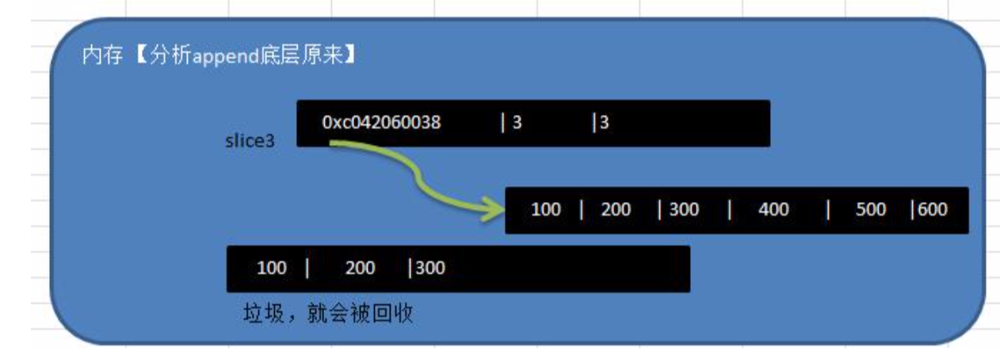

# 问题列表

01、读写锁 `RWMutex` 和互斥锁 `Mutex` 。下面的代码有什么问题?

02、Go是否可以声明一个类？

03、Go是否支持泛型？

04、Go的相关命令？

05、`defer`关键字的使用，写出下面代码的输出内容。

06、`for_range` 循环复用，以下代码有什么问题，请说明原因？

07、下面的代码会输出什么，并说明原因？

08、

09、

10、


# 问题解答

## 读写锁 `RWMutex` 和互斥锁 `Mutex` 

01、下面的代码有什么问题?

```go
package main

import "sync"

type UserAges struct {
    ages map[string]int
    sync.Mutex
    // sync.RWMutex
}

func (ua *UserAges) Add(name string, age int) {
    ua.Lock()
    defer ua.Unlock()
    ua.ages[name] = age
}
func (ua *UserAges) Get(name string) int {
    if age, ok := ua.ages[name]; ok {
        return age
    }
    return -1
}
```

解析：

在执行 `Get`方法时可能被`panic`。 

虽然有使用`sync.Mutex`做写锁，但是`map`是并发读写不安全的。`map`属于引用类型，并发读写时多个协程⻅是通过指针访问同一个地址，即访问共享变量，此时同时读写资源 存在竞争关系。会报错误信息:`“fatal error: concurrent map read and map write”`。 因此，在 `Get` 中也需要加锁，因为这里只是读，建议使用读写锁 `sync.RWMutex` 。


## `make` 初始化的 `channel  `阻塞

02、下面的迭代会有什么问题?

```go
func (set *threadSafeSet) Iter() <-chan interface{} {
    ch := make(chan interface{})
    go func() {
        set.RLock()
        for elem := range set.s {
            ch <- elem
        }
        close(ch)
        set.RUnlock()
    }()
    return ch
}
```

解析：默认情况下 `make` 初始化的 `channel` 是无缓冲的，也就是在迭代写时会阻塞。

定义和声明`channel`格式：

```go
var intChan chan int // intChan 用于存放 int 数据
var mapChan chan map[int]string // mapChan 用于存放 map[int]string 类型
var perChan chan Person
var perChan2 chan *Person
....
```

只读和只写示例：

```go
var chan1 chan int   // 可读可写
var chan2 chan<- int // 声明为只写
chan2 = make(chan int, 3)
var chan3 <-chan int // 声明为只读
```

说明：

* `channel` 是引用类型。`channel` 必须初始化才能写入数据，即 `make` 后才能使用。
* `channel`是有类型的，`intChan` 只能写入整数 `int`...。
* `channle`的数据放满后，就不能再放入了；如果从 `channel` 取出数据后，可以继续放入。
* 在没有使用协程的情况下，如果 `channel` 数据取完了，再取就会报 `dead lock`。
* 管道可以声明为只读或者只写，在默认情况下下，管道是双向（可读可写）。如果只是向管道写入数据而没有读取，就会出现阻塞而`deadlock`。

## `interface` 关键字

03、以下代码能编译过去吗?为什么?

```go
package main

import (
    "fmt"
)

type People interface {
    Speak(string) string
}
type Student struct{}

func (stu *Student) Speak(think string) (talk string) {
    if think == "good" {
        talk = "You are a good boy"
    } else {
        talk = "hi"
    }
    return
}
func main() {
 		// cannot use Student literal (type Student) as type People in assignment:
    // Student does not implement People (Speak method has pointer receiver)
    // var peo People = Student{}
    var peo People = &Student{}
    think := "good"
    fmt.Println(peo.Speak(think))
}
```

结果：

```go
cannot use Student literal (type Student) as type People in assignment:
Student does not implement People (Speak method has pointer receiver)
```


解析：编译失败，值类型 `Student{}` 未实现接口 `People` 的方法，不能定义为 `People` 类 型。

在 `golang` 语言中， `Student` 和 `*Student` 是两种类型，第一个是表示 `Student` 本 身，第二个是指向 `Student `的指针。


**接口本身不能创建实例，但是可以指向一个实现了该接口的自定义类型的变量（实例）。**

```go
package main

import "fmt"

type AInterface interface {
    Say()
}

type Stu struct {
    Name string
}

func (stu Stu) Say() {
    fmt.Println("Stu Say()")
}

func main() {
    var stu Stu // 结构体变量，实现了 Say() 实现了 AInterface
    var a AInterface = stu
    a.Say()
}
```

示例：以下代码打印出来什么内容，为什么？

```go
package main

import (
    "fmt"
)

type People interface {
    Show()
}
type Student struct{}

func (stu *Student) Show() {}
func live() People {
    var stu *Student
    return stu
}
func main() {
    if live() == nil {
        fmt.Println("nil")
    } else {
        fmt.Println("not nil")
    }
}
```

结果：

```go
not nil
```

解析：`*Student` 定义后本身没有初始化值，所以 `*Student` 是 `nil`的，但是 `*Student `实现了 `People `接口，接口不为` nil` 。`interface`类型默认是一个指针（引用类型），如果没有对`interface`初始化就使用，那么会输出`nil`。

##  

##  `defer `关键字

5、`defer`关键字的使用，写出下面代码的输出内容。

```go
package main

import (
    "fmt"
)

func main() {
    deferCall()
}
func deferCall() {
    defer func() { fmt.Println("打印前") }()
    defer func() { fmt.Println("打印中") }()
    defer func() { fmt.Println("打印后") }()
    panic("触发异常")
}
```

结果：

```
打印后
打印中
打印前
panic: 触发异常
```

解析：

`defer` 关键字的实现跟`go`关键字很类似，不同的是它调用的是 `runtime.deferproc` 而不 是 `runtime.newproc `。

 在 `defer` 出现的地方，插入了指令 `call runtime.deferproc` ，然后在函数返回之前的地 方，插入指令 `call runtime.deferreturn` 。

`goroutine`的控制结构中，有一张表记录 `defer` ，调用 `runtime.deferproc` 时会将需要 `defer`的表达式记录在表中，而在调用 `runtime.deferreturn` 的时候，则会依次从`defer`表 中出栈（先进后出）并执行。

 因此，题目最后输出顺序应该是 `defer` 定义顺序的倒序。 `panic` 错误并不能终止 `defer` 的执行。

拓展：

在函数中，开发者经常需要创建资源(比如：数据库连接、文件句柄、锁等) ，为了在函数执行完毕后，及时的释放资源，`Go` 的设计者提供 `defer `(延时机制)。

当 `go` 执行到一个 `defer` 时，不会立即执行 `defer` 后的语句，而是将 `defer` 后的语句压入到一个栈中，然后继续执行函数下一个语句。当函数执行完毕后，在从 `defer` 栈中，依次从栈顶（先入后出）取出语句执行。

在 `defer` 将语句放入到栈时，也会将相关的值拷贝同时入栈。**值拷贝示例**

```go
package main

import (
    "fmt"
)

func sum(n1 int, n2 int) int {

    // 当执行到defer时，暂时不执行，会将defer后面的语句压入到独立的栈(defer栈)
    // 当函数执行完毕后，再从defer栈，按照先入后出的方式出栈，执行
    defer fmt.Println("ok1 n1=", n1) // defer 3. ok1 n1 = 10
    defer fmt.Println("ok2 n2=", n2) // defer 2. ok2 n2= 20
    //增加一句话
    n1++                         // n1 = 11
    n2++                         // n2 = 21
    res := n1 + n2               // res = 32
    fmt.Println("ok3 res=", res) // 1. ok3 res= 32
    return res
}

func main() {
    res := sum(10, 20)
    fmt.Println("res=", res) // 4. res= 32
} 
```


案例二：`defer`关键字的使用，写出下面代码的输出内容。

```go
package main

import "fmt"

func calc(index string, a, b int) int {
    ret := a + b
    fmt.Println(index, a, b, ret)
    return ret
}
func main() {
    a := 1
    b := 2
    defer calc("1", a, calc("10", a, b))
    a = 0
    defer calc("2", a, calc("20", a, b))
    b = 1
}

```

结果：

```go
10 1 2 3
20 0 2 2
2 0 2 2
1 1 3 4
```


解析：`defer` 在定义的时候会计算好调用函数的参数，所以会优先输出 10 、 20 两个参 数。然后根据定义的顺序倒序执行。


## `for_range` 循环

06、`for_range` 循环复用，以下代码有什么问题，请说明原因？

```go
package main

import "fmt"

type student struct {
    Name string
    Age  int
}

func iterateStudent() {
    m := make(map[string]*student)
    s := []student{
        {"gao", 24},
        {"li", 23},
        {"wang", 22},
    }
    for _, stu := range s {
        fmt.Printf("%v", stu)
        fmt.Println()
        m[stu.Name] = &stu
    }
    fmt.Println()
    fmt.Printf("%v", m)
}

func main() {
    iterateStudent()
}
```

结果：

```
{gao 24}
{li 23}
{wang 22}

map[gao:0xc0000a6020 li:0xc0000a6020 wang:0xc0000a6020]
```

解析：

`golang` 中的 `for ... range`语法中， `stu`变量会被复用，每次循环会将集合中的值复制给这个变量，因此，会导致最后` m `中的 `map` 中储存的`age`都是 `s` 最后一个 `student`的`age`值。

## `goroutine`  调度优先级

07、下面的代码会输出什么，并说明原因？

```go
package main

import (
    "fmt"
    "runtime"
    "sync"
)

func main() {
    // GOMAXPROCS sets the maximum number of CPUs that can be executing
    runtime.GOMAXPROCS(1)
    // A WaitGroup waits for a collection of goroutines to finish.
    wg := sync.WaitGroup{}
    // Add adds delta, which may be negative, to the WaitGroup counter.
    wg.Add(20)
    for i := 0; i < 10; i++ {
        go func() {
            fmt.Println("i: ", i)
            wg.Done()
        }()
    }
    for i := 0; i < 10; i++ {
        go func(i int) {
            fmt.Println("i: ", i)
            wg.Done()
        }(i)
    }
    wg.Wait()
}
```

结果：

```
i:  9
i:  10
i:  10
i:  10
i:  10
i:  10
i:  10
i:  10
i:  10
i:  10
i:  10
i:  0
i:  1
i:  2
i:  3
i:  4
i:  5
i:  6
i:  7
i:  8
```

解析:
 这个输出结果决定来自于调度器优先调度哪个G。从`runtime`的源码可以看到，当创建一 个G时，会优先放入到下一个调度的 `runnext` 字段上作为下一次优先调度的G。因此， 最先输出的是最后创建的G，也就是9。

`runtime`的源码（部分）：

```go
func newproc(siz int32, fn *funcval) {
    argp := add(unsafe.Pointer(&fn), sys.PtrSize)
    gp := getg()
    pc := getcallerpc()
    systemstack(func() {
        newg := newproc1(fn, argp, siz, gp, pc)
        _p_ := getg().m.p.ptr() // 新创建的G会调用这个方法来决定如何调度 
        runqput(_p_, newg, true)
        if mainStarted {
            wakep()
        }
    })
}
if next {
    retryNext:
    oldnext := _p_.runnext // 当next是true时总会将新进来的G放入下一次调度字段中
    if !_p_.runnext.cas(oldnext, guintptr(unsafe.Pointer(gp))) {
        goto retryNext
    }
    if oldnext == 0 {
        return
    }
    // Kick the old runnext out to the regular run queue. 
  	gp = oldnext.ptr()
}
```

## `oop` 中的组合

08、下面代码会输出什么?

```go
package main

import "fmt"

type People struct{}

func (p *People) ShowA() {
    fmt.Println("showA")
    p.ShowB()
}
func (p *People) ShowB() {
    fmt.Println("showB")
}

type Teacher struct {
    People
}

func (t *Teacher) ShowB() {
    fmt.Println("teacher showB")
}
func main() {
    t := Teacher{}
    t.ShowA()
}
```

结果：

```go
showA
showB
```

解析：

`golang` 语言中没有继承概念，只有组合，也没有虚方法，更没有重载。因此， `*Teacher` 的 `ShowB` 不会覆写被组合的 `People` 的方法。


## `select case` 用法

09、下面代码会触发异常吗?请详细说明。

```go
package main

import (
    "fmt"
    "runtime"
)

func main() {
    runtime.GOMAXPROCS(1)
    intChan := make(chan int, 1)
    stringChan := make(chan string, 1)
    intChan <- 1
    stringChan <- "hello"
    select {
    case intValue := <-intChan:
        fmt.Println(intValue)
    case stringValue := <-stringChan:
        fmt.Println(stringValue)
    }
    fmt.Println(123)
}
```

结果：

```go
1
123
或者
hello
123
```

解析：

随机执行，不会发生异常。如果两个`case`都满足条件，是伪随机选择一个执行的，而不是之前想着的从上到下依次判断哪个`case`能执行。当某个`case`得到执行后，就会退出`select`。


如下代码会发生异常：

```go
package main

import (
    "fmt"
    "runtime"
)

func main() {
    runtime.GOMAXPROCS(1)
    intChan := make(chan int, 1)
    stringChan := make(chan string, 1)
    intChan <- 1
    stringChan <- "hello"
    for {
        select {
        case intValue := <-intChan:
            fmt.Println(intValue)
        case stringValue := <-stringChan:
            fmt.Println(stringValue)
        }
        fmt.Println("123")
    }
}
```

结果：

```go
hello
123
1
123
fatal error: all goroutines are asleep - deadlock!
```

解析：所有的协程（`goroutines`）都处于休眠（阻塞）状态。当所有协程都处于阻塞状态的时候，那所有的协程都等不来解锁的那一天了，出现死锁，所以`golang`调度直接把这个给`kill`掉了。主线程在阻塞，但是其他协程由于各种原因也阻塞了。

## 切片 `append` 操作

10、请写出以下输入内容。

```go
package main

import "fmt"

func main() {
    s := make([]int, 5)
    s = append(s, 1, 2, 3)
    fmt.Println(s)
}
```

结果：

```
[0 0 0 0 0 1 2 3]
```

解析：

`make` 在初始化切片时指定了⻓度，所以追加数据时会从` len(s) `位置开始填充数据。


案例二：用 `append` 内置函数，对切片进行动态追加的原理。

```go
package main

import "fmt"

func main() {
    // 用 append 内置函数，可以对切片进行动态追加
    var slice3 []int = []int{100, 200, 300}
    // 通过 append 直接给 slice3 追加具体的元素
    slice3 = append(slice3, 400, 500, 600)
    fmt.Println("slice3", slice3) // slice3 [100 200 300 400 500 600]

    //通过 append 将切片 slice3 追加给 slice3
    slice3 = append(slice3, slice3...) // slice3 [100 200 300 400 500 600 100 200 300 400 500 600]
    fmt.Println("slice3", slice3)
}

```




 切片 `append` 操作的本质就是对数组扩容，`go` 底层会创建一下新的数组 `newArr`(按照扩容后大小) 将 `slice` 原来包含的元素拷贝到新的数组 `newArr`，原来的`slice` 重新引用到 `newArr`。


## Go相关命令

Usage:

	go <command> [arguments]

The commands are:

	bug         start a bug report
	build       compile packages and dependencies
	clean       remove object files and cached files
	doc         show documentation for package or symbol
	env         print Go environment information
	fix         update packages to use new APIs
	fmt         gofmt (reformat) package sources
	generate    generate Go files by processing source
	get         add dependencies to current module and install them
	install     compile and install packages and dependencies
	list        list packages or modules
	mod         module maintenance
	run         compile and run Go program
	test        test packages
	tool        run specified go tool
	version     print Go version
	vet         report likely mistakes in packages


# 


