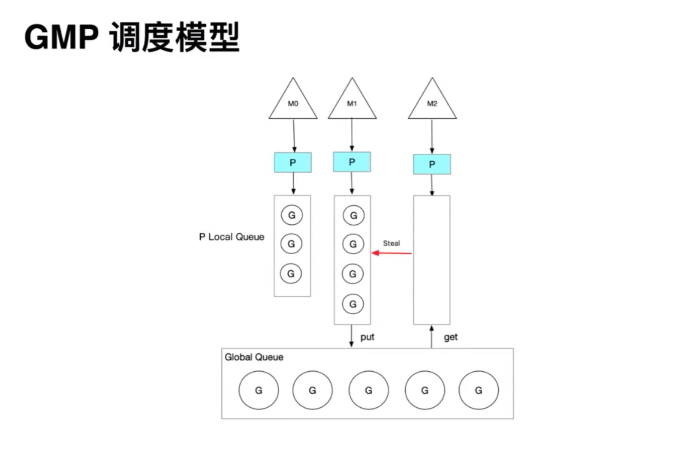
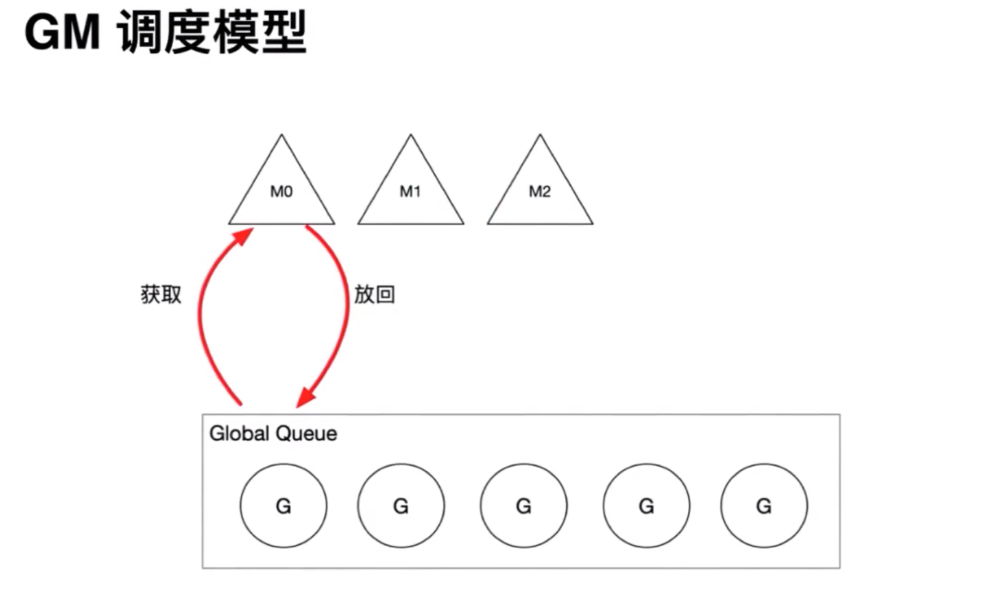

# 问题列表

* [了解`golang`的**内存逃逸**吗？什么情况下会发生**内存逃逸**？如何避免**内存逃逸**？](#escape)
* 了解`string`和`[]byte`转换原理吗？会发生内存拷⻉吗? 如何进行高效转换？
* 了解`goroutine`调度器？它的调度时机、调度策略和切换机制是什么？
* 读写锁 `RWMutex` 和互斥锁 `Mutex` 。下面的代码有什么问题?
* [`slice` 和`array`的区别是什么？](#slice_array)
* [是否了解`golang`的`CSP`并发模型的思想？](#csp)
* [进程、线程、协程各自的优缺点？](#coroutine)
* [谈谈你对`goroutine`的理解](#goroutine01)

* Go是否可以声明一个类？
* Go是否支持泛型？
* Go的相关命令？
* `defer`关键字的使用，写出下面代码的输出内容。
* `for_range` 循环复用，以下代码有什么问题，请说明原因？
* 下面的代码会输出什么，并说明原因？


# 问题解答

## <span id="csp">CSP 模型思想</span>

<span id="csp">问：是否了解`golang`的`CSP`并发模型的思想?</span>

`CSP` 模型是上个世纪七十年代提出的，不同于传统的多线程通过共享内存来通信，`CSP` 讲究的是**以通信的方式来共享内存**。用于描述两个独立的并发实体通过共享的通讯 `channel `(管道)进行通信的并发模型。`CSP `中 `channel `是第一类对象，它不关注发送消息的实体，而关注与发送消息时使用的 `channel`。

`Channel` 的经典思想：**不要通过共享内存来通信，而是通过通信来实现内存共享**。

> Do not communicate by sharing memory; instead,share memory by communicating.

`CSP`与`Actor`之间的区别：

* `CSP` 解耦发送方和接收方，注重消息传递方式。
* `Actor Model`之间直接通讯，注重处理单元。


`go` 中 `channel` 是被单独创建并且可以在进程之间传递，它的通信模式类似于 `boss-worker` 模式的，一个实体通过将消息发送到 `channel` 中，然后又监听这个 `channel `的实体处理，两个实体之间是匿名的，这个就实现实体中间的解耦，其中 `channel `是同步的一个消息被发送到 `channel` 中，最终是一定要被另外的实体消费掉的，在实现原理上其实类似一个阻塞的消息队列。

`CSP(Communicating Sequential Process)` 描述这样一种并发模型：多个`Process` 使用一个 `Channel` 进行通信,  这个 `Channel `连结的 `Process` 通常是匿名的，消息传递通常是同步的（有别于 `Actor Model`）。

`CSP` 最早是由 [Tony Hoare](https://www.cs.ox.ac.uk/people/tony.hoare/) 在 1977 年提出一个理论模型，也是一本书的名字，有兴趣可以查阅电子版本：http://www.usingcsp.com/cspbook.pdf。

 `Golang` 只用到了 `CSP` 的很小一部分，即理论中的 `Process/Channel`（ `goroutine/channel`）：这两个并发之间没有从属关系， `Process` 可以订阅任意 `Channel`，`Channel `也并不关心是哪个` Process `在利用它进行通信；`Process` 围绕 `Channel `进行读写，形成一套有序阻塞和可预测的并发模型。


## slice 和 array 的区别

<span id="slice_array">问：`slice` 和`array`的区别是什么？</span>

* 数组的零值是元素类型的零值，切片的零值是 `nil`，`nil` 也是唯一可以和切片类型作比较的值；
* 数组的长度固定，不能动态变化，而切片是一个可以动态变化的数组。数组是多个相同类型数据的组合，一个数组一旦声明/定义了，其长度是固定的， 不能动态变化，否则会报越界；
* 数组默认是值传递，而切片是数组的一个引用，因此切片是引用类型，在进行传递时，遵守引用传递的机制。

#### 切片和数组的零值

```go
package main

import (
    "fmt"
)

func main() {
    var arr = [2]int{}
    // invalid operation: arr == nil (mismatched types [2]int and nil)
    // if arr == nil {
    //     fmt.Println("arr nil")
    // }
    fmt.Println("arr=", arr) // arr = [0 0]
    var slice []int
    if slice == nil {
        fmt.Println("slice nil") // slice= []
    }
    fmt.Println("slice=", slice) // slice= []
}
```

#### `array` 细节

数组定义的基本语法:：

```go
var 数组名 [数组大小]数据类型 
var a [3]int
```

数组代码演示示例：

```go
package main
import (
	"fmt"
)

func main() {

	var intArr [3]int // int占8个字节
	// 当我们定义完数组后，其实数组的各个元素有默认值 0
	fmt.Println(intArr) // [0 0 0]
	intArr[0] = 10
	intArr[1] = 20
	intArr[2] = 30
	fmt.Println(intArr) // [10 20 30]
	// intArr的地址=0xc000016200 intArr[0] 地址0xc000016200 intArr[1] 地址0xc000016208 intArr[2] 地址0xc000016210
	fmt.Printf("intArr的地址=%p intArr[0] 地址%p intArr[1] 地址%p intArr[2] 地址%p\n", 
		&intArr, &intArr[0], &intArr[1], &intArr[2]) 
```

数组的底层结构示意图：


上图总结：

* 数组的地址可以通过数组名来获取 `&intArr`。
* 数组的第一个元素的地址，就是数组的首地址。
* 数组的各个元素的地址间隔是依据数组的类型决定，`int`占8个字节，比如 `int64 -> 8 int32->4...`。


`Go`的数组属值类型，在默认情况下是值传递，因此会进行值拷贝。数组间不会相互影响：


如想在其它函数中，去修改原来的数组，可以使用引用传递(指针方式)：


长度是数组类型的一部分，在传递函数参数时 需要考虑数组的长度：


#### `slice` 细节

切片定义的基本语法:

```go
var 切片名 []类型 
var a [] int
```

切片示例代码演示：

```go
package main
import (
	"fmt"
)

func main() {

	// 演示切片的基本使用
	var intArr [5]int = [...]int{1, 22, 33, 66, 99}
	// 声明/定义一个切片
	// slice := intArr[1:3]
	// 1. slice 就是切片名。
	// 2. intArr[1:3] 表示 slice 引用到 intArr 这个数组。
	// 3. 引用intArr数组的起始下标为 1 , 最后的下标为3(但是不包含3)。
	// 4. 切片是数组的一个引用，因此切片是引用类型，在进行传递时，遵守引用传递的机制。
	slice := intArr[1:3] 
	fmt.Println("intArr=", intArr) // [1 22 33 66 99]
	fmt.Println("slice 的元素是 =", slice) //  22, 33
	fmt.Println("slice 的元素个数 =", len(slice)) // 2
	fmt.Println("slice 的容量 =", cap(slice)) // 切片的容量是可以动态变化  

	fmt.Printf("intArr[1]的地址=%p\n", &intArr[1]) // 0xc042060038
	// 0xc042060038 slice[0==22
	fmt.Printf("slice[0]的地址=%p slice[0==%v\n", &slice[0], slice[0])
	slice[1] = 34
	fmt.Println()
	fmt.Println("intArr=", intArr) // intArr= [1 22 34 66 99]
	fmt.Println("slice 的元素是 =", slice) //  slice 的元素是 = [22 34]
}
```

切片的底层结构示意图：


上图总结：

* `slice` 是数组的一个引用，因此切片是引用类型，在进行传递时，遵守引用传递的机制。
* `slice` 从底层来说，其实就是一个数据结构(`struct` 结构体)。

```go
type slice struct {
	array unsafe.Pointer
	len   int
	cap   int
}
```

##### 基础使用

① 方式一：定义一个切片，然后让切片去引用一个已经创建好的数组。

```go
var intArr [5]int = [...]int{1, 22, 33, 66, 99}
slice := intArr[1:3]
```

② 方式二：通过 `make `来创建切片。基本语法：

```
var 切片名 []type = make([]type, len, [cap])
// 参数说明: 
// type: 数据类型 
// len : 大小 
// cap : 指定切片容量，可选，如果分配了 cap，则要求 cap>=len.
```

案例演示图：


③ 方式三：定义一个切片，直接就指定具体数组，使用原理类似 make 的方式。

```go
var slice = []int {1, 2, 3, 4}
var strSlice = []string{"w","x","i","o","n","g"}
```

方式一和方式二的区别：方式一直接引用数组，这个数组事先是已经存在的；方式②是通过`make`来创建切片，而`make`也会在底层去创建一个数组。

##### 注意事项

① 切片初始化时 `var slice = arr[startIndex:endIndex]`，从 `arr` 数组下标为 `startIndex`，取到 下标为 `endIndex` 的元素(不含 `arr[endIndex]`)。

② 切片初始化时，仍然不能越界。范围在` [0-len(arr)] `之间，但是可以动态增长。

```go
var slice = arr[0:end] 等价于 var slice = arr[:end]
var slice = arr[start:len(arr)] 等价于 var slice = arr[start:]
var slice = arr[0:len(arr)] 等价于 var slice = arr[:]
```

③ `cap`是一个内置函数，用于统计切片的容量，即最大可以存放多少个元素。

④ 切片定义完后，还不能使用，因为本身是一个空的，需要让其引用到一个数组，或者 `mak`e 一个空间供切片来使用。

⑤ 切片可以继续切片。

```go
package main

import (
    "fmt"
)

func main() {

    // 使用常规的for循环遍历切片
    var arr [5]int = [...]int{10, 20, 30, 40, 50}
    // slice := arr[1:4] // 20, 30, 40
    slice := arr[1:4]
    for i := 0; i < len(slice); i++ {
        // slice[0]=20 slice[1]=30 slice[2]=40
        fmt.Printf("slice[%v]=%v ", i, slice[i])
    }

    fmt.Println()
    // 使用for--range 方式遍历切片
    for i, v := range slice {
        fmt.Printf("i=%v v=%v \n", i, v)
    }

    slice2 := slice[1:2] //  slice [ 20, 30, 40]    [30]
    slice2[0] = 100      // 因为arr , slice 和slice2 指向的数据空间是同一个，因此slice2[0]=100，其它的都变化

    fmt.Println("slice2=", slice2) // slice2= [100]
    fmt.Println("slice=", slice)   // slice= [20 100 40]
    fmt.Println("arr=", arr)       // arr = [10 20 100 40 50]
}  
```

⑥ 用 `append` 内置函数，可以对切片进行动态追加。

```go
package main

import (
    "fmt"
)

func main() {
    // 用 append 内置函数，可以对切片进行动态追加
    var slice3 []int = []int{100, 200, 300}
    // 通过append直接给slice3追加具体的元素
    slice3 = append(slice3, 400, 500, 600)
    fmt.Println("slice3", slice3) // 100, 200, 300,400, 500, 600

    // 通过 append 将切片slice3追加给slice3
    slice3 = append(slice3, slice3...) // 100, 200, 300,400, 500, 600 100, 200, 300,400, 500, 600
    fmt.Println("slice3", slice3)
}
```


 `append `操作的本质就是对数组扩容：`go` 底层会创建一个新的数组 `newArr`(按照扩容后大小) 将 `slice` 原来包含的元素拷贝到新的数组 `newArr`，` slice` 重新引用到 `newArr`。

⑦ 切片的拷贝操作。下面代码中，`slice4` 和 `slice5` 的数据空间是独立，相互不影响，也就是说 `slice4[0]= 999`，`slice5[0]` 仍然是 1。

```go
package main

import (
    "fmt"
)

func main() {
    // 切片的拷贝操作
    // 切片使用copy内置函数完成拷贝
    fmt.Println()
    var slice4 []int = []int{1, 2, 3, 4, 5}
    var slice5 = make([]int, 10)
    // func copy(dst, src []Type) int
    copy(slice5, slice4)
    fmt.Println("slice4=", slice4) // 1, 2, 3, 4, 5
    fmt.Println("slice5=", slice5) // 1, 2, 3, 4, 5, 0 , 0 ,0,0,0
}
```

⑧ 切片是引用类型，所以在传递时，遵守引用传递机制。


## Channel 

### 基本概念

`channel` 是 `goroutine` 之间通信（读写）的通道。因为它的存在，显得 `Golang`（或者说`CSP`）与传统的共享内存型的并发模型截然不同，用 [Effective Go](http://golang.org/doc/effective_go.html) 里的话来说就是：

> *Do not communicate by sharing memory; instead, share memory by communicating.*

在 `Golang` 的并发模型中，我们并不关心是哪个 `goroutine`（匿名性）在用 `channel`，只关心 `channel` 的性质：

- 是只读还是只写？
- 传递的数据类型？
- 是否有缓冲区?

### 无缓冲的 `channel`

① 不可以在同一个 `goroutine` 中既读又写，否则将会死锁。

示例：

```go
package main

import "fmt"

// 结果：fatal error: all goroutines are asleep - deadlock!

// 解析：不可以在同一个 goroutine 中既读又写，否则将会死锁。
func main() {
    ch := make(chan int)

    ch <- 2
    x := <-ch
    fmt.Println(x)
}
```

② 两个`goroutine`中使用无缓冲的`channel`，则读写互为阻塞，即双方代码的执行都会阻塞在` <-ch` 和 `ch <-` 处，直到双方读写完成在 `ch` 中的传递，各自继续向下执行，此处借用`CSP` 图例说明：


示例代码：

```go
// 结果：
// after write
// after read: 2

// 解析：两个 goroutine 中使用无缓冲的channel，则读写互为阻塞。
// 即双方代码的执行都会阻塞在 <-ch 和 ch <- 处，直到双方读写完成在 ch 中的传递，各自继续向下执行。
func main1() {
    ch := make(chan int)

    go func() {
        ch <- 2
        fmt.Println("after write")
    }()

    x := <-ch
    fmt.Println("after read:", x)
}
```

### 有缓冲的 `channel`

在 make 时传递第二参 capacity，即为有缓冲的 channel：

```go
ch := make(chan int, 1)
```

这样的 `channel` 无论是否在同一 `goroutine` 中，均可读写而不致死锁，看看下面的代码输出什么内容：

```go
package main

import (
    "fmt"
)

func main() {
    ch := make(chan int, 1)
    for i := 0; i < 10; i++ {
        select {
        case x := <-ch:
            fmt.Println(x) // 0 2 4 6 8
        case ch <- i:
        }
    }
}
```

有无缓冲 `channel`的演示代码如下：

```go
// 无缓冲
ch1 := make(chan int)
// 缓冲区为 3
ch2 := make(chan int, 3)
```

* 无缓冲的 `channel（unbuffered channel）`，其缓冲区大小则默认为 0。在功能上其接受者会阻塞等待并阻塞应用程序，直至收到通信和接收到数据。
* 有缓冲的 `channel（buffered channel）`，其缓存区大小是根据所设置的值来调整。在功能上，若缓冲区未满则不会阻塞，会源源不断的进行传输。当缓冲区满了后，发送者就会阻塞并等待。而当缓冲区为空时，接受者就会阻塞并等待，直至有新的数据。


### `close channel` 读数据

问：从已关闭的`channel`读取数据会怎么样？

① 有缓冲的`channel`：

```go 

```

② 无缓冲的`channel`:


### 三种表现方式

`channel` 的关键字为 `chan`，数据流向的表现方式为 `<-`，代码解释方向是从左到右，据此就能明白通道的数据流转方向了。`channel `共有两种模式，分别是双向和单向；三种表现方式，分别是：

* 声明双向通道`chan T`（可读可写）， 示例：`var ch chan int`
* 声明发送通道`chan <- T`（只写），示例：`var ch chan<- int`
* 声明接收通道`<- chan T`（只读），示例：`var ch <-chan int` 

### `hchan` 源码分析

`channel`本质上是一个有锁的环形队列，外加发送方队列（`sendq`）、接收方队列（`recvq`），加上互斥锁 `mutex` 等结构。


`hchan`结构体源码：`/src/runtime/chan.go` go版本：`1.15.11`

* 通过`buf `来保存`G`之间传输的数据。
* 通过两个队列`recvq`和`sendq`来保存发送和接收的 G。
* 通过`mutex`来保护数据安全。

```go
type hchan struct {
  // 队列中元素的总数
	qcount   uint           // total data in the queue
  // 循环队列的长度
	dataqsiz uint           // size of the circular queue
  // 指向长度为 dataqsiz 的底层数组，仅有当 channel 为缓冲型的才有意义
	buf      unsafe.Pointer // points to an array of dataqsiz elements 
  // 能够接受和发送的元素大小
	elemsize uint16 // chan中元素的大小
	closed   uint32 // 是否已close 1 表示已关闭 0 表示未关闭
	elemtype *_type // element type
  sendx    uint   // send index (ch <- xxx)
  recvx    uint   // receive index  (ch <- xxx)
	recvq    waitq  // list of recv waiters 
  // 发送者的 sudog 等待队列
	sendq    waitq  // list of send waiters 

	// lock protects all fields in hchan, as well as several
	// fields in sudogs blocked on this channel.
	//
	// Do not change another G's status while holding this lock
	// (in particular, do not ready a G), as this can deadlock
	// with stack shrinking.
	lock mutex // map不是线程安全的，但是channel是线程安全的，因为这里有互斥锁
}

type waitq struct {
	first *sudog
	last  *sudog
}

type sudog struct {
	g *g // 指向当前的 goroutine

	next *sudog // 指向下一个 g
	prev *sudog // 指向上一个 g
	elem unsafe.Pointer // data element (may point to stack) 数据元素，可能会指向堆栈
  ....
	c        *hchan // channel
}
```

### 实现源码分析

`channel` 的四大块操作分别是：创建`chan`、发送数据、接收数据、关闭`chan`。接下来从源码角度进行分析。

#### 创建`chan`

创建 `channel` 的演示代码：

```go
ch := make(chan int , 3) // 初始化环形队列 buf，初始化发送和接收的索引
// 通用创建方法
func makechan(t *chantype, size int) *hchan
// 类型为 int64 的进行特殊处理
func makechan64(t *chantype, size int64) *hchan
```

创建 `channel `的逻辑主要分为三大块：

- 当前 `channel` 不存在缓冲区，也就是元素大小为 0 的情况下，就会调用 `mallocgc` 方法分配一段连续的内存空间。
- 当前 `channel` 存储的类型存在指针引用，就会连同 `hchan` 和底层数组同时分配一段连续的内存空间。
- 通用情况，默认分配相匹配的连续内存空间。

需要注意到一块特殊点，那就是 `channel` 的创建都是调用的 `mallocgc` 方法，也就是 `channel` 都是创建在堆上的。因此 `channel` 是会被 `GC` 回收的，自然也不总是需要 `close` 方法来进行显示关闭了。

`makechan` 源码路径为：`src/runtime/chan.go`

```go
func makechan(t *chantype, size int) *hchan {
	elem := t.elem

	// compiler checks this but be safe.
	if elem.size >= 1<<16 {
		throw("makechan: invalid channel element type")
	}
	if hchanSize%maxAlign != 0 || elem.align > maxAlign {
		throw("makechan: bad alignment")
	}

	mem, overflow := math.MulUintptr(elem.size, uintptr(size))
	if overflow || mem > maxAlloc-hchanSize || size < 0 {
		panic(plainError("makechan: size out of range"))
	}

	var c *hchan
	switch {
	case mem == 0:
		// Queue or element size is zero.
		c = (*hchan)(mallocgc(hchanSize, nil, true))
		// Race detector uses this location for synchronization.
		c.buf = c.raceaddr()
	case elem.ptrdata == 0:
		// Elements do not contain pointers.
		// Allocate hchan and buf in one call.
		c = (*hchan)(mallocgc(hchanSize+mem, nil, true))
		c.buf = add(unsafe.Pointer(c), hchanSize)
	default:
		// Elements contain pointers.
		c = new(hchan)
		c.buf = mallocgc(mem, elem, true)
	}

	c.elemsize = uint16(elem.size)
	c.elemtype = elem
	c.dataqsiz = uint(size)
	lockInit(&c.lock, lockRankHchan)

	if debugChan {
		print("makechan: chan=", c, "; elemsize=", elem.size, "; dataqsiz=", size, "\n")
	}
	return c
}
```

`makechan` 方法的逻辑比较简单，就是创建 `hchan` 并分配合适的 `buf` 大小的堆上内存空间。


#### 发送数据

`channel` 发送数据的演示代码：

```go
go func() {
    ch <- "wangxiong"
}()
```

其在编译器翻译后对应 `runtime/chan.go/chansend1` 方法：

```go
// entry point for c <- x from compiled code
// go:nosplit
func chansend1(c *hchan, elem unsafe.Pointer) {
	chansend(c, elem, true, getcallerpc())
}
```

其作为编译后的入口方法，实则指向真正的实现逻辑，也就是 `chansend` 方法。 `chansend` 方法主要完成以下几个事情。

*  `chan` 发送前的前置判断和处理。
* 在进入发送数据的处理前，`channel `会进行上锁。
* 在正式开始发送前，加锁之后，会对 `channel `进行一次状态判断（是否关闭），未关闭直接发送。
* 非直接发送，判断 channel 缓冲区中是否还有空间，如果有进行缓冲发送，否则进入阻塞发送。

```go
// src/runtime/chan.go
func chansend(c *hchan, ep unsafe.Pointer, block bool, callerpc uintptr) bool {
  // ① chan 发送前的前置判断和处理。
	if c == nil {
		if !block {
			return false
		}
    // 若为 nil，在逻辑上来讲就是向 nil channel 发送数据。
    // 就会调用 gopark 方法使得当前 Goroutine 休眠，进而出现死锁崩溃，表象就是出现 panic 事件来快速失败。
		gopark(nil, nil, waitReasonChanSendNilChan, traceEvGoStop, 2)
		throw("unreachable")
	}
  ......
  // 对非阻塞的 channel 进行一个上限判断，看看是否快速失败。
  // 若非阻塞且未关闭，同时底层数据 dataqsiz 大小为 0（缓冲区无元素），则会返回失败。
  // 若是 qcount 与 dataqsiz 大小相同（缓冲区已满）时，则会返回失败。
	if !block && c.closed == 0 && full(c) {
		return false
	}
  ......
  // ② 在进入发送数据的处理前，channel 会进行上锁，保障并发安全
	lock(&c.lock)

	if c.closed != 0 {
		unlock(&c.lock)
		panic(plainError("send on closed channel"))
	}

  // ③ 有正在阻塞等待的接收方，则直接发送。
	if sg := c.recvq.dequeue(); sg != nil {
		// Found a waiting receiver. We pass the value we want to send
		// directly to the receiver, bypassing the channel buffer (if any).
		send(c, sg, ep, func() { unlock(&c.lock) }, 3)
		return true
	}

  // ④ 对缓冲区进行判定（qcount 和 dataqsiz 字段），以此识别缓冲区的剩余空间。
	if c.qcount < c.dataqsiz {
		// Space is available in the channel buffer. Enqueue the element to send.
    // 调用 chanbuf 方法，以此获得底层缓冲数据中位于 sendx 索引的元素指针值
		qp := chanbuf(c, c.sendx)
		if raceenabled {
			raceacquire(qp)
			racerelease(qp)
		}
    // 调用 typedmemmove 方法，将所需发送的数据拷贝到缓冲区中
		typedmemmove(c.elemtype, qp, ep)
    // 数据拷贝后，对 sendx 索引自行自增 1。
		c.sendx++
    // 若 sendx 与 dataqsiz 大小一致，则归 0（环形队列）。
		if c.sendx == c.dataqsiz {
			c.sendx = 0
		}
		c.qcount++ // 自增完成后，队列总数同时自增 1
		unlock(&c.lock) // 解锁互斥锁
		return true // 返回结果
	}
 // 未走进缓冲区处理的逻辑，判断当前是否阻塞 channel，若为非阻塞，将会解锁并直接返回失败。
	if !block {
		unlock(&c.lock)
		return false
	}

  // ⑤ 进入阻塞等待发送
  // 调用 getg 方法获取当前 goroutine 的指针，用于后续发送数据。
	gp := getg()
  // 调用 acquireSudog 方法获取 sudog 结构体，并设置当前 sudog 具体的待发送数据信息和状态。
	mysg := acquireSudog()
	......
  // 调用 c.sendq.enqueue 方法将刚刚所获取的 sudog 加入待发送的等待队列。
	c.sendq.enqueue(mysg)
  ......
  // 调用 gopark 方法挂起当前 goroutine（会记录执行位置），状态为 waitReasonChanSend，阻塞等待 channel。
	gopark(chanparkcommit, unsafe.Pointer(&c.lock), waitReasonChanSend, traceEvGoBlockSend, 2)
  // 调用 KeepAlive 方法保证待发送的数据值是活跃状态，也就是分配在堆上，避免被 GC 回收。
	KeepAlive(ep)

	// someone woke us up.
  // 从这里开始唤醒，并恢复阻塞的发送操作
	if mysg != gp.waiting {
		throw("G waiting list is corrupted")
	}
	gp.waiting = nil
	gp.activeStackChans = false
	......
	mysg.c = nil
	releaseSudog(mysg)
	return true
}
```

#### 接收数据

`channel` 接收数据的演示代码：

```go
msg := <-ch

msg, ok := <-ch
```

两种方法在编译器翻译后分别对应 `runtime.chanrecv1` 和 `runtime.chanrecv2` 两个入口方法，其再在内部再进一步调用 `runtime.chanrecv` 方法：

```go
// src/runtime/chan.go
// entry points for <- c from compiled code
//go:nosplit
func chanrecv1(c *hchan, elem unsafe.Pointer) {
	chanrecv(c, elem, true)
}

//go:nosplit
func chanrecv2(c *hchan, elem unsafe.Pointer) (received bool) {
	_, received = chanrecv(c, elem, true)
	return
}
```

 最终调用的是`chanrecv`方法：

```go
func chanrecv(c *hchan, ep unsafe.Pointer, block bool) (selected, received bool) {
	......
  // ① 若 channel 是非阻塞模式，则直接返回。
  // ② 若 channel 是 nil channel，且为阻塞接收则调用 gopark 方法挂起当前 goroutine。
	if c == nil {
		if !block {
			return
		}
		gopark(nil, nil, waitReasonChanReceiveNilChan, traceEvGoStop, 2)
		throw("unreachable")
	}

	// Fast path: check for failed non-blocking operation without acquiring the lock.
	if !block && empty(c) {
		// After observing that the channel is not ready for receiving, we observe whether the
		// channel is closed.
		//
		// Reordering of these checks could lead to incorrect behavior when racing with a close.
		// For example, if the channel was open and not empty, was closed, and then drained,
		// reordered reads could incorrectly indicate "open and empty". To prevent reordering,
		// we use atomic loads for both checks, and rely on emptying and closing to happen in
		// separate critical sections under the same lock.  This assumption fails when closing
		// an unbuffered channel with a blocked send, but that is an error condition anyway.
		if atomic.Load(&c.closed) == 0 {
			// Because a channel cannot be reopened, the later observation of the channel
			// being not closed implies that it was also not closed at the moment of the
			// first observation. We behave as if we observed the channel at that moment
			// and report that the receive cannot proceed.
			return
		}
		// The channel is irreversibly closed. Re-check whether the channel has any pending data
		// to receive, which could have arrived between the empty and closed checks above.
		// Sequential consistency is also required here, when racing with such a send.
		if empty(c) {
			// The channel is irreversibly closed and empty.
			if raceenabled {
				raceacquire(c.raceaddr())
			}
			if ep != nil {
				typedmemclr(c.elemtype, ep)
			}
			return true, false
		}
	}

	var t0 int64
	if blockprofilerate > 0 {
		t0 = cputicks()
	}

	lock(&c.lock)

	if c.closed != 0 && c.qcount == 0 {
		if raceenabled {
			raceacquire(c.raceaddr())
		}
		unlock(&c.lock)
		if ep != nil {
			typedmemclr(c.elemtype, ep)
		}
		return true, false
	}

  // channel 上有正在阻塞等待的发送方时，则直接进行接收
	if sg := c.sendq.dequeue(); sg != nil {
		recv(c, sg, ep, func() { unlock(&c.lock) }, 3)
		return true, true
	}

  // 当发现 channel 的缓冲区中有元素时，将会调用 chanbuf 方法，根据 recvx 的索引位置取出数据，找到要接收的元素进行处理。
	if c.qcount > 0 {
		// Receive directly from queue
		qp := chanbuf(c, c.recvx)
		if raceenabled {
			raceacquire(qp)
			racerelease(qp)
		}
    // 若所接收到的数据和所传入的变量均不为空，则会调用 typedmemmove 方法将缓冲区中的数据拷贝到所传入的变量中。
		if ep != nil {
			typedmemmove(c.elemtype, ep, qp)
		}
		typedmemclr(c.elemtype, qp)
		c.recvx++
		if c.recvx == c.dataqsiz {
			c.recvx = 0
		}
		c.qcount--
		unlock(&c.lock)
		return true, true
	}

	if !block {
		unlock(&c.lock)
		return false, false
	}

	// no sender available: block on this channel.
	gp := getg()
	mysg := acquireSudog()
	mysg.releasetime = 0
	if t0 != 0 {
		mysg.releasetime = -1
	}
	// No stack splits between assigning elem and enqueuing mysg
	// on gp.waiting where copystack can find it.
	mysg.elem = ep
	mysg.waitlink = nil
	gp.waiting = mysg
	mysg.g = gp
	mysg.isSelect = false
	mysg.c = c
	gp.param = nil
	c.recvq.enqueue(mysg)
	// Signal to anyone trying to shrink our stack that we're about
	// to park on a channel. The window between when this G's status
	// changes and when we set gp.activeStackChans is not safe for
	// stack shrinking.
	atomic.Store8(&gp.parkingOnChan, 1)
	gopark(chanparkcommit, unsafe.Pointer(&c.lock), waitReasonChanReceive, traceEvGoBlockRecv, 2)

	// someone woke us up
	if mysg != gp.waiting {
		throw("G waiting list is corrupted")
	}
	gp.waiting = nil
	gp.activeStackChans = false
	if mysg.releasetime > 0 {
		blockevent(mysg.releasetime-t0, 2)
	}
	closed := gp.param == nil
	gp.param = nil
	mysg.c = nil
	releaseSudog(mysg)
	return true, !closed
}
```

#### 关闭 `chan`

关闭 `channel` 主要是涉及到 `close` 关键字：

```go
close(ch)
```

其对应的编译器翻译方法为 `closechan` 方法：

```go
func closechan(c *hchan)
```

关闭`chan`源码解析：

```go
func closechan(c *hchan) {
  // 基本检查和关闭标志设置，保证 channel 不为 nil 和未关闭，保证边界。
	if c == nil {
		panic(plainError("close of nil channel"))
	}

	lock(&c.lock)
	if c.closed != 0 {
		unlock(&c.lock)
		panic(plainError("close of closed channel"))
	}
 
	if raceenabled {
		callerpc := getcallerpc()
		racewritepc(c.raceaddr(), callerpc, funcPC(closechan))
		racerelease(c.raceaddr())
	}

	c.closed = 1

	var glist gList

  // 将接受者的 sudog 等待队列（recvq）加入到待清除队列 glist 中。
	// release all readers
	for {
		sg := c.recvq.dequeue()
		if sg == nil {
			break
		}
		if sg.elem != nil {
			typedmemclr(c.elemtype, sg.elem)
			sg.elem = nil
		}
		if sg.releasetime != 0 {
			sg.releasetime = cputicks()
		}
		gp := sg.g
		gp.param = nil
		if raceenabled {
			raceacquireg(gp, c.raceaddr())
		}
		glist.push(gp)
	}

  // 将发送方也加入到到待清除队列 glist 中。
	// release all writers (they will panic)
	for {
		sg := c.sendq.dequeue()
		if sg == nil {
			break
		}
		sg.elem = nil
		if sg.releasetime != 0 {
			sg.releasetime = cputicks()
		}
		gp := sg.g
		gp.param = nil
		if raceenabled {
			raceacquireg(gp, c.raceaddr())
		}
		glist.push(gp)
	}
	unlock(&c.lock)

	// Ready all Gs now that we've dropped the channel lock.
	for !glist.empty() {
		gp := glist.pop()
		gp.schedlink = 0
		goready(gp, 3)
	}
}
```

### goroutine 和 channel 实现定时任务


### 控制协程的数量（协程池）


### 控制任务状态


## Go 并发安全的支持


## 常见协程泄露问题

* Cgo
* http body没有关闭，链接泄露。
* 每个请求新建 Transport
* Goroutine 死循环
* Channel 阻塞，好习惯，及时关闭生产者的channel。

## 进程、线程和协程

<span id="coroutine">问：进程、线程、协程各自的优缺点？</span>

> 进程是资源分配的最小单位，线程是资源调度的最小单位。

* 进程有自己的独立空间，多进程程序更健壮，多线程程序只要有一个线程死掉，整个进程也死掉了，而一个进程死掉并不会对另外一个进程造成影响。
* 创建和维护进程的开销非常昂贵，线程是共享进程中的数据的，使用相同的地址空间，因此`CPU`切换一个线程的花费远比进程要小很多。
* **线程是被内核所调度**，**协程的调度完全由用户控制**，用户态到内核态转换，开销比较多。协程的开销远小于线程的开销，线程的开销又远小于进程的开销。协程是内存占用最小，且创建开销最小。

#### 什么是进程？

进程（`Process`）是具有一定独立功能的程序、它是系统进行资源分配和调度的一个独立单位，重点在系统调度和单独的单位，也就是说进程是可以独立运行的一段程序。

#### 什么是线程？

线程（`Thread`）进程的一个实体，是`CPU`调度和分派的基本单位，它是比进程更小的能独立运行的基本单位，线程自己基本上不拥有系统资源，在运行时，只是暂用一些计数器、寄存器和栈。

> 注：进程是资源分配的最小单位，线程是资源调度的最小单位。

多进程的出现是为了解决 CPU 利用率的问题，而线程的出现是为了减少上下文切换时的开销。

#### 什么是协程？

协程 `Coroutines` 是一种比线程更加轻量级的微线程。类比一个进程可以拥有多个线程，一个线程也可以拥有多个协程，因此协程又称微线程和纤程。

协程是用户视角的一种抽象，操作系统并没有这个概念，其主要思想是在用户态实现调度算法，用少量线程完成大量任务的调度。

多任务实现的三种模式：

* 多进程模式：启动多个进程，每个进程虽然只有一个线程，但多个进程可以一块执行多个任务。
* 多线程模式：启动一个进程，在一个进程内启动多个线程，这样多个线程也可以一块执行多个任务。
* 多进程+多线程模式：启动多个进程，每个进程再启动多个线程，这样同时执行的任务就更多了，当然这种模型更复杂，实际很少采用。

从单进程到多进程提高了 CPU 利用率；从进程到线程，降低了上下文切换的开销；从线程到协程，进一步降低了上下文切换的开销，使得高并发的服务可以使用简单的代码写出。

#### 进程与线程的区别

> 一个程序至少有一个进程，一个进程至少有一个线程。
>
> 一个进程可以创建销毁多个线程，同一个进程中的多个线程可以并发执行。

- 进程是资源（`CPU`、内存等）分配的最小单位，线程是程序执行的最小单位（资源调度的最小单位）。
- 进程有自己的独立地址空间，每启动一个进程，系统就会为它分配地址空间，建立数据表来维护代码段、堆栈段和数据段，这种操作非常昂贵。线程是共享进程中的数据的，使用相同的地址空间，因此`CPU`切换一个线程的花费远比进程要小很多，同时创建一个线程的开销也比进程要小很多。
- 线程之间的通信更方便，同一进程下的线程共享全局变量、静态变量等数据，而进程之间的通信需要以进程间通信的方式 `IPC`（`Inter-Process Communication`）进行。不过如何处理好同步与互斥是编写多线程程序的难点
- 多进程程序更健壮，多线程程序只要有一个线程死掉，整个进程也死掉了，而一个进程死掉并不会对另外一个进程造成影响，因为进程有自己独立的地址空间。

#### 进程 VS 线程

类比：进程=火车，线程=车厢

- 一个进程可以包含多个线程（一辆火车包含多节车厢）
- 线程依赖于进程，它是进程中一个完整的执行路径 （车厢依赖火车，单纯的车厢无法运行）
- 进程间的通信通过`IPC`(`Inter-Process Communication`）进行,比如管道(`pipe`)、信号量(`semophore`)、消息队列(`messagequeue`) 、 套接字(`socket`)等 （一辆火车上的乘客换到另外一辆火车，需要在站点进行换乘）
- 线程间的通信通过共享内存（`Shared Memory`）、消息队列等方式进行 （同一辆火车，A车厢换到B车厢很容易）
- 创建一个进程的开销比创建一个线程开销要消耗更多的计算机资源 （采用多列火车相比多个车厢更耗资源）
- 进程间不会相互影响，但是一个线程挂掉将导致整个进程挂掉（火车之间相互不影响，一个车厢断裂会影响火车运行）
- 一个线程使用共享内存时，其他线程必须等它结束，才能使用这一块内存 。多个线程同时对同一公共资源（比如全局变量）进行读写需要使用互斥锁（车厢中使用洗手间，需要上锁）
- 一个进程使用的内存地址可以限定使用量--信号量（火车上的餐厅最多同时容纳一定乘客数量，需要等有人出来才能进去）

#### 协程 VS 线程

|          | 协程                                                         | 线程                                                         |
| -------- | ------------------------------------------------------------ | ------------------------------------------------------------ |
| 切换成本 | 协程切换只需要保存三个寄存器，耗时约200纳秒。                | 线程切换需要保存几十个寄存器，耗时约1000纳秒。               |
| 调度方式 | 非抢占式，由 go runtime 主动交出控制权。                     | 在时间片用完后，由CPU中断任务强行将其调度走，此时需要保存很多信息。 |
| 创建销毁 | goroutine 因为是由 go runtime 进行管理的，创建和销毁都非常小，属于用户级的。 | 因为要和操作系统打交道，是属于内核级的，创建和销毁开销大，通常解决办法是通过线程池。 |

**线程是被内核所调度**，线程被调度切换到另一个线程上下文的时候，需要保存一个用户线程的状态到内存，恢复另一个线程状态到寄存器，然后更新调度器的数据结构，这几步操作设计用户态到内核态转换，开销比较多。

**协程的调度完全由用户控制**，协程拥有自己的寄存器上下文和栈，协程调度切换时，将寄存器上下文和栈保存到其他地方，在切回来的时候，恢复先前保存的寄存器上下文和栈，直接操作用户空间栈，完全没有内核切换的开销。

## GMP 调度模型

### 专有名词解释

内核线程（`Kernel-Level Thread ，KLT`） ：操作系统的主线程，属于物理线程。

轻量级进程（`Light Weight Process，LWP`）：是指我们通常意义上所讲的线程，由于每个轻量级进程都由一个内核线程支持，因此只有先支持内核线程，才能有轻量级进程。

### GMP 基本概念

Go 线程模型属于多对多线程模型，主要包含三个概念：内核线程(M)、协程的上下文环境（P）、协程(G)。

* G (`Goroutine`)。本质上属于轻量级的线程，是基于协程建立的用户态线程。它拥有自己的栈、指令指针和维护其他调度相关的信息。

* M (`Machine`)，操作系统的主线程（物理线程）。它直接关联一个操作系统内核线程，用于执行 G。
* P (`Processor`)，协程的上下文环境。P 是处理用户级代码逻辑的处理器，P 里面一般会存当前`goroutine`运行的上下文环境（函数指针，堆栈地址及地址边界），P 会对自己管理的`goroutine`队列做一些调度。P 的数量是由环境变量中的`GOMAXPROCS`决定，默认就是`CPU`核数，它代表了真正的并发能力，即可有多少个 `goroutine` 同时运行。



>  主线程是一个物理线程，直接作用在 cpu 上的，是重量级的，非常耗费 cpu 资源。
>
> 而协程是从主线程开启的，是轻量级的线程，是逻辑态，对资源消耗相对小。


### GMP VS GM

GM的调度模型：



* 每个 P 都有自己的本地队列，减少锁竞争。
* 将阻塞的 G 转移给其他空闲的 M 执行，提高资源的利用效率。
* 实现 `Work-Stealing` 算法，减少空转时间。
* 总体的设计思路就是将 P 引入`runtime`，并在 P 上实现可窃取调度。


### GMP 模型的限制

* G：除内存外无限制，每个 G 创建需要 2-4KB **连续**内存块。
* M：最多10000个，否则`panic`，`sched.maxmcount`=10000。
* P：程序启动由`GOMAXPROCS`决定，默认数量即可。


## <span id="goroutine01">`goroutine `的理解</span>

`goroutine`是 Go 语言实现的轻量级的**用户态线程**，主要用来解决**操作系统线程**太重的问题，所谓的太重，主要表现在以下两个方面：

- 创建和切换太重：操作系统线程的创建和切换都需要进入内核，而进入内核所消耗的性能代价比较高，开销较大;
- 内存使用太重：一方面，为了尽量避免极端情况下操作系统线程栈的溢出，内核在创建操作系统线程时默认会为其分配一个较大的栈内存(虚拟地址空间，内核并不会一开始就分配这么多的物理内存)，然而在绝大多数情况下，系统线程远远用不了这么多内存，这导致了浪费；另一方面，栈内存空间一旦创建和初始化完成之后 其大小就不能再有变化，这决定了在某些特殊场景下系统线程栈还是有溢出的⻛险。

而相对的，**用户态线程**的`goroutine`则轻量得多：

* `goroutine`是用户态线程，其创建和切换都在用户代码中完成而无需进入操作系统内核，所以其开销要远远小于系统线程的创建和切换;
* `goroutine`启动时默认栈大小只有2k，这在多数情况下已经够用了，即使不够用，`goroutine`的栈也会自动扩大，同时，如果栈太大了过于浪费它还能自动收缩，这样既没有栈溢出的⻛险，也不会造成栈内存空间的大量浪费。 

正是因为`Go`语言中实现了如此轻量级的线程（逻辑态的），才使得我们在`Go`程序中，可以轻易的创建成千上万甚至上百万的`goroutine`出来并发的执行任务而不用太担心性能和内存等问题。其他程序如C/JAVA的多线程，往往是内核态的，比较重量级，几千个线程可能就会耗光CPU。

以下是 `Rob Pike` 在 [Google I/O 2012](https://www.youtube.com/watch?v=f6kdp27TYZs) 上对`goroutine`给出的描述：

> What is a goroutine? It’s an independently executing function, launched by a **go** statement.
> It has its own call stack, which grows and shrinks as required.
> It’s very cheap. It’s practical to have thousands, even hundreds of thousands of goroutines.
> It’s not a thread.
> There might be only one thread in a program with thousands of goroutines.
> Instead, goroutines are multiplexed dynamically onto threads as needed to keep all the goroutines running.
> But if you think of it as a very cheap thread, you won’t be far off.
>
> **― Rob Pike**

概括下来其实就一句话：

> goroutine 可以视为开销很小的线程（既不是物理线程也不是协程，但它拥有自己的调用栈，并且这个栈的大小是可伸缩的  ~~不是协程，它有自己的栈~~），很好用，需要并发的地方就用 go 起一个 func，goroutine走起 🙂

在 `Golang` 中，任何代码都是运行在 `goroutine`里，即便没有显式的 `go func()`，默认的 `main` 函数也是一个 `goroutine`。但 `goroutine` 不等于操作系统的线程，它与系统线程的对应关系，牵涉到` Golang` 运行时的调度器。

## `goroutine` 的调度

了解`goroutine`调度器？它的调度时机、调度策略和切换机制是什么？


### 关于 `goroutine` 调度器

> 什么是 M:N 两级线程模型？什么是`goroutine`调度器？

`goroutine`是建立在操作系统线程基础之上，它与操作系统线程之间实现了一个多对多(M:N)的两级线程模型。


 这里的 M:N 是指M个`goroutine`运行在N个操作系统线程之上，内核负责对这N个操作系统线程进行调度，而这N个系统线程又负责对这M个`goroutine`进行调度和运行。

所谓的`goroutine`调度，是指程序代码按照一定的算法在适当的时候挑选出合适的`goroutine`并放到`CPU`上去运行的过，这些负责对`goroutine`进行调度的程序代码我们称之为`goroutine`调度器。

`goroutine`调度器需要解决三大核心问题：

* 调度时机：什么时候会发生调度？

* 调度策略：使用什么策略来挑选下一个进入运行的`goroutine`？

* 切换机制：如何把挑选出来的`goroutine`放到`CPU`上运行？

为了帮助我们从宏观上了解`goroutine`的两级调度模型，简化后`goroutine`调度器的工作流程伪代码：

```go
// 程序启动时的初始化代码
......
for i := 0; i < N; i++ { // 创建N个操作系统线程(工作线程)执行 schedule 函数
	create_os_thread(schedule) // 创建一个操作系统线程执行 schedule 函数 
}
// schedule 函数实现调度逻辑 
func schedule() {
	for { // 调度循环
		// 根据某种算法从M个 goroutine 中找出一个需要运行的 goroutine
		g := find_a_runnable_goroutine_from_M_goroutines()
		run_g(g) // CPU运行该 goroutine，直到需要调度其它 goroutine 才返回 
		save_status_of_g(g) // 保存 goroutine 的状态，主要是寄存器的值
	} 
}
```

程序运行起来之后创建了N个由内核调度的操作系统线程 （工作线程）去执行`shedule`函数。

`schedule `函数在一个调度循环中反复从M个`goroutine`中挑选出一个需要运行的`goroutine`并跳转到该

`goroutine`去运行，直到需要调度其它`goroutine`时才返回到`schedule`函数中。通过 `save_status_of_g`保存刚刚正在运行的 `goroutine` 的状态，然后再次去寻找下一个 `goroutine`。

###`goroutine` 的调度时机


### `goroutine` 的调度策略


`schedule`函数分三步分别从各运行队列中寻找可运行的`goroutine`：

* ① 从本地运行队列中寻找`goroutine`。
* ② 从全局运行队列中寻找`goroutine`。
* ③ 从其它运行线程的队列中偷取`goroutine`。

**`schedule`函数源码分析（部分）**`runtime/proc.go`

```go
// One round of scheduler: find a runnable goroutine and execute it.
// Never returns.
func schedule() {
	_g_ := getg() // _g_ = m.g0
	......	
	var gp *g
	......
 
	if gp == nil {
		// Check the global runnable queue once in a while to ensure fairness.
		// Otherwise two goroutines can completely occupy the local runqueue
		// by constantly respawning each other.
    // 为保证调度的公平性，每个工作线程每经过61次调度就优先尝试从全局运行队列中找出一个 goroutine 来运行,
    // 这样才能保证位于全局运行队列中的 goroutine 得到调度的机会。
		if _g_.m.p.ptr().schedtick%61 == 0 && sched.runqsize > 0 {
      // 全局运行队列是所有工作线程都可以访问的，所以在访问它之前需要加锁。
			lock(&sched.lock)
      // ① 从全局运行队列中寻找 goroutine。
			gp = globrunqget(_g_.m.p.ptr(), 1)
			unlock(&sched.lock)
		}
	}
  
	if gp == nil {
    // ② 从工作线程本地运行队列中寻找 goroutine。
		gp, inheritTime = runqget(_g_.m.p.ptr())
		// We can see gp != nil here even if the M is spinning,
		// if checkTimers added a local goroutine via goready.
	}
  
	if gp == nil {
    // ③ 从其它工作线程的运行队列中偷取 goroutine。
		gp, inheritTime = findrunnable() // blocks until work is available
	}
  .....
  // 当前运行的是 runtime 的代码，函数调用栈使用的是 g0 的栈空间
  // 调用 execte 切换到 gp 的代码和栈空间去运行
	execute(gp, inheritTime)
}
```

#### ① 从本地运行的队列寻找

`runqget`函数源码分析，`runtime/proc.go`。

```go
type guintptr uintptr

type p struct {
	// Queue of runnable goroutines. Accessed without lock.
	runqhead uint32
	runqtail uint32
	runq     [256]guintptr
	// runnext, if non-nil, is a runnable G that was ready'd by
	// the current G and should be run next instead of what's in
	// runq if there's time remaining in the running G's time
	// slice. It will inherit the time left in the current time
	// slice. If a set of goroutines is locked in a
	// communicate-and-wait pattern, this schedules that set as a
	// unit and eliminates the (potentially large) scheduling
	// latency that otherwise arises from adding the ready'd
	// goroutines to the end of the run queue.
	runnext guintptr
}

// Get g from local runnable queue.
// If inheritTime is true, gp should inherit the remaining time in the
// current time slice. Otherwise, it should start a new time slice.
// Executed only by the owner P.
func runqget(_p_ *p) (gp *g, inheritTime bool) {
	// If there's a runnext, it's the next G to run.
  // 从 runnext 成员中获取 goroutine
	for {
    // 查看 runnext 成员是否为空，不为空则返回该 goroutine。
		next := _p_.runnext
		if next == 0 {
			break
		}
		if _p_.runnext.cas(next, 0) {
			return next.ptr(), true
		}
	}

  // 从循环队列中获取 goroutine
	for {
    // ① 原子读取，不管代码运行在哪种平台，保证在读取过程中不会有其它线程对该变量进行写入；
    // ② 位于 atomic.LoadAcq 之后的代码，对内存的读取和写入必须在 atomic.LoadAcq 读取完成后才能执行，
    // 编译器和 CPU 都不能打乱这个顺序。
		h := atomic.LoadAcq(&_p_.runqhead) // load-acquire, synchronize with other consumers
		t := _p_.runqtail
		if t == h {
			return nil, false
		}
		gp := _p_.runq[h%uint32(len(_p_.runq))].ptr()
    // ① 原子的执行比较并交换的操作；
    // ② 位于 atomic.CasRel 之前的代码，对内存的读取和写入必须在 atomic.CasRel 对内存的写入之前完成，
    // 编译器和 CPU 都不能打乱这个顺序。
		if atomic.CasRel(&_p_.runqhead, h, h+1) { // cas-release, commits consume
			return gp, false
		}
	}
}
```

#### ② 从全局运行队列寻找

`globrunqget`函数源码分析，`runtime/proc.go`。

```go
var (
  gomaxprocs int32
	sched      schedt
)

type schedt struct {
	// Global runnable queue.
	runq     gQueue
	runqsize int32
}

// Try get a batch of G's from the global runnable queue.
// Sched must be locked.
func globrunqget(_p_ *p, max int32) *g {
  // 全局运行队列为空。
	if sched.runqsize == 0 {
		return nil
	}

  // 计算全局运行队列中 goroutine 的数量。
  // 注意：应该从全局运行队列中拿走多少个 goroutine 时根据 p 的数量（gomaxprocs）做了负载均衡。
	n := sched.runqsize/gomaxprocs + 1
  // 计算n的方法可能导致n大于全局运行队列中的 goroutine 数量。
	if n > sched.runqsize {
		n = sched.runqsize
	}
  // 最多取函数参数 max 个 goroutine。
	if max > 0 && n > max {
		n = max
	}
  // 最多只能取本地队列容量的一半
	if n > int32(len(_p_.runq))/2 {
		n = int32(len(_p_.runq)) / 2
	}

  // 剩余全局队列个数计算
	sched.runqsize -= n

  // 先直接通过函数返回 一个 gp（pop 从全局运行队列的队列头取）
	gp := sched.runq.pop()
	n--
	for ; n > 0; n-- {
    // pop 从全局运行队列的队列头取
		gp1 := sched.runq.pop()
     // 其它的 goroutines 通过 runqput 放入本地运行队列
		runqput(_p_, gp1, false)
	}
	return gp
}
```

#### ③ 从其他线程运行的队列中偷取

`findrunnable`函数源码分析，`runtime/proc.go`。

```go
// Finds a runnable goroutine to execute.
// Tries to steal from other P's, get g from local or global queue, poll network.
func findrunnable() (gp *g, inheritTime bool) {
	_g_ := getg()
  ......
  // ① 先从本地运行的队列中获取 goroutine
  // local runq
	if gp, inheritTime := runqget(_p_); gp != nil {
		return gp, inheritTime
	}

  // ② 再从全局运行的队列中获取 goroutine
	// global runq
	if sched.runqsize != 0 {
		lock(&sched.lock)
		gp := globrunqget(_p_, 0)
		unlock(&sched.lock)
		if gp != nil {
			return gp, false
		}
	}
  ......
  for i := 0; i < 4; i++ {
		for enum := stealOrder.start(fastrand()); !enum.done(); enum.next() {
			......
      // ③ 从其他线程运行的队列中偷取 goroutine
			if gp := runqsteal(_p_, p2, stealRunNextG); gp != nil {
				return gp, false
			}
      ......
}
```

### `goroutine` 的切换机制


## 内存逃逸

<span id="escape">了解`golang`的**内存逃逸**吗？什么情况下会发生内存逃逸？如何避免内存逃逸？</span>

### 什么是内存逃逸？

* 什么是内存逃逸？如果变量从栈逃逸到堆，会怎样？

> 本该分配到栈上的变量，跑到了堆上，这就导致了内存逃逸。
>
> 栈是高地址到低地址，栈上的变量，函数结束后变量会跟着回收掉，不会有额外性能的开销。
>
> 变量从栈逃逸到堆上，如果要回收掉，需要进行 gc，那么 gc 一定会带来额外的性能开销。 编程语言不断优化 gc 算法，主要目的都是为了减少 gc 带来的额外性能开销，变量一旦逃逸会导致性能开销变大。

### 逃逸的几种场景

什么情况下会发生内存逃逸？以下为引起变量逃逸到堆上的典型场景：

- **场景一：方法内返回局部变量指针**。 局部变量原本应该在栈中分配，在栈中回收。但是由于返回时被外部引用，因此其生命周期大于栈，则溢出。
- **场景二：向 channel 发送指针数据。** 在编译时没有办法知道哪个 `goroutine` 会在 `channel` 上接收数据，所以编译器没法知道变量什么时候才会被释放。
- **场景三：在闭包中引用包外的值**。因为变量的生命周期可能会超过函数周期，因此只能放入堆中。
- **场景四：在 slice 或 map 中存储指针。** 一个典型的例子就是 `[]*string` 。这会导致切片的内容逃逸。尽管其后面的数组可能是在栈上分配的，但其引用的值一定是在堆上。
- **场景五：切片（扩容后）长度太大**。 `slice` 的背后数组被重新分配了，因为 `append` 时可能会超出其容量( `cap` )。 `slice` 初始化的地方在编译时是可以知道的，它最开始会在栈上分配。如果切片背后的存储要基于运行时的数据进行扩充，就会在堆上分配。
- **场景六：在 `interface` 类型上调用方法。** 在 `interface` 类型上调用方法都是动态调度的 —— 方法的真正实现只能在运行时知道。想像一个 `io.Reader` 类型的变量 r , 调用 `r.Read(b)` 会使得 r 的值和切片b 的背后存储都逃逸掉，所以会在堆上分配。

通过以下具体案例加深理解，接下来尝试下怎么通过 `go build -gcflags '-m -l'` 查看逃逸的情况。

#### 场景一：方法内返回局部变量指针

```go
package main

import "fmt"

type A struct {
    s string
}

// 发生内存逃逸的场景一： 方法内返回局部变量指针。
// 局部变量原本应该在栈中分配，在栈中回收。但是由于返回时被外部引用，因此其生命周期大于栈，则溢出。

// 结果： go build -gcflags '-m -l' ./main.go
// # command-line-arguments
// ./main.go:10:10: leaking param: s
// ./main.go:11:13: new(A) escapes to heap
// ./main.go:17:14: a.s + " world" does not escape
// ./main.go:18:12: b + "!" escapes to heap
// ./main.go:19:16: ... argument does not escape
// ./main.go:19:16: c escapes to heap

func foo(s string) *A {
    // new(A) escapes to heap
    a := new(A)
    a.s = s
    return a // 返回局部变量a
}
func main() {
    // new(A) escapes to heap
    a := foo("hello")
    // a.s + " world" does not escape
    // b 变量没有逃逸，因为它只在方法内存在，会在方法结束时被回收。
    b := a.s + " world"
    // b + "!" escapes to heap
    c := b + "!"
    // c escapes to heap
    // c 变量逃逸，通过fmt.Println(a ...interface{})打印的变量，都会发生逃逸
    fmt.Println(c) // hello world!
}
```

#### 场景二：向 `channel` 发送指针数据

```go
package main

// 逃逸发生场景二：向 channel 发送指针数据。
// 因为在编译时，不知道 channel 中的数据会被哪个 goroutine 接收，因此编译器没法知道变量什么时候才会被释放，因此只能放入堆中。

// 结果：go build -gcflags '-m -l' ./main.go
// # command-line-arguments
// ./main.go:12:5: moved to heap: y
func main() {
    ch := make(chan int, 1)
    x := 5
    ch <- x // x 不发生逃逸，因为只是复制的值
    ch1 := make(chan *int, 1)
    y := 5
    py := &y
    ch1 <- py // y 逃逸，因为 y 地址传入了 chan 中，编译时无法确定什么时候会被接收，所以也无法在函数返回后回收y
}
```

#### 场景三：在闭包中引用包外的值

```go
package main

// 场景三：局部变量在函数调用结束后还被其他地方（闭包中引用包外的值或者函数返回局部变量指针）使用。
// 因为变量的生命周期可能会超过函数周期，因此只能放入堆中。

// 结果：# command-line-arguments
// ./main.go:7:5: moved to heap: x
// ./main.go:8:12: func literal escapes to heap
func Foo() func() {
    x := 5 // x 发生逃逸，因为在 Foo 调用完成后，被闭包函数用到，还不能回收，只能放到堆上存放
    return func() {
        x += 1
    }
}
func main() {
    inner := Foo()
    inner()
}
```

#### 场景四：在 slice 或 map 中存储指针

```go
package main

// 逃逸发生场景四：在 slice 或 map 中存储指针。
// 比如 []*int，其后面的数组可能是在栈上分配的，但其引用的值还是在堆上。

// 结果： go build -gcflags '-m -l' ./main.go
// # command-line-arguments
// ./main.go:6:9: moved to heap: x

func main() {
    var x int
    x = 10
    var ls []*int
    ls = append(ls, &x) // x发生逃逸，ls存储的是指针，所以ls底层的数组虽然在栈存储，但x本身却是逃逸到堆上
}

```

####  场景五：切片（扩容后）长度太大

```go
package main

// 逃逸场景五：切片扩容后长度太大
// 解析：实际上当栈空间不足以存放当前对象时或无法判断当前切片长度时会将对象分配到堆中。
// 结果： go build -gcflags '-m -l' ./main.go
// # command-line-arguments
// ./main.go:8:14: make([]int, 10000, 10000) escapes to heap

func main() {
    Slice() // 这种情况会发生逃逸吗？
}

func Slice() {
    s := make([]int, 10000, 10000)

    for index, _ := range s {
        s[index] = index
    }
}
```

#### 场景六：在 `interface` 类型上调用方法

```go
package main

// 逃逸场景六：在 interface 类型上调用方法。
// 在 interface 类型上调用方法时会把 interface 变量使用堆分配， 因为方法的真正实现只能在运行时知道。

// 结果： go build -gcflags '-m -l' ./main.go
// # command-line-arguments
// ./main.go:15:7: foo1 literal escapes to heap
// <autogenerated>:1: leaking param: .this
// <autogenerated>:1: .this does not escape

type foo interface {
    fooFunc()
}
type foo1 struct{}

func (f1 foo1) fooFunc() {}
func main() {
    var f foo
    f = foo1{}
    f.fooFunc() // 调用方法时，f发生逃逸，因为方法是动态分配的
}
```

### 如何避免内存逃逸

* 对于小型的数据，使用传值而不是传指针（减少外部引用，如指针），避免内存逃逸。
* 避免使用长度不固定的`slice`切片，在编译期无法确定切片长度，只能将切片使用堆分配。由于切片一般都是使用在函数传递的场景下，而且切片在 `append` 的时候可能会涉及到重新分配内存，如果切片在编译期间的大小不能够确认或者大小超出栈的限制，多数情况下都会分配到堆上
* `interface`调用方法会发生内存逃逸，在热点代码片段，谨慎使用。`go` 中的接口类型的方法调用是动态调度，因此不能够在编译阶段确定，所有类型结构转换成接口的过程会涉及到内存逃逸的情况发生。如果对于性能要求比较高且访问频次比较高的函数调用，应该尽量避免使用接口类型。


##  `string` 和 `[]byte` 的转换原理

了解`string`和`[]byte`转换原理吗？会发生内存拷⻉吗? 如何进行高效转换？

`string`底层是一个`byte`数组。两者之间的标准转换示例:

```go
func main() {
    str := "wwxiong"
    // string 转 []byte
    by := []byte(str)
    fmt.Println(by) // [119 119 120 105 111 110 103]
    // []byte 转 string
    str1 := string(by)
    fmt.Println(str1) // wwxiong
}
```

### **`byte `和`[]byte `类型**

`byte`的官方定义：

```go
// src/builtin/builtin.go
// byte is an alias for uint8 and is equivalent to uint8 in all ways. It is
// used, by convention, to distinguish byte values from 8-bit unsigned
// integer values.
type byte = uint8
```

> `byte`就是`uint8`的别名，它是用来区分**字节值**和**8位无符号整数值**。

注：`bit`是计算机中的最小存储单位。`byte`是计算机中基本存储单元。` 1byte = 8 bit`

如果我们保存的字符在 ASCII 表的，比如`[0-1, a-z,A-Z..]`直接可以保存到 `byte`。

如果我们保存的字符对应码值大于 255，这时我们可以考虑使用 `int` 类型保存。

`[]byte`其实是一个`byte`类型的切片，切片本质也是一个结构体，定义如下：

```go
// src/runtime/slice.go
type slice struct {
	array unsafe.Pointer
	len   int
	cap   int
}
```

`array`代表底层数组的指针，`len`代表切片长度，`cap`代表容量。看一个简单示例：

```go
func main()  {
 sl := make([]byte,0,2)
 sl = append(sl, 'A')
 sl = append(sl,'B')
 fmt.Println(sl)
}
```

该示例的示意图：


### `string `类型

`string`的官方定义：

```go
// src/builtin/builtin.go
// string is the set of all strings of 8-bit bytes, conventionally but not
// necessarily representing UTF-8-encoded text. A string may be empty, but
// not nil. Values of string type are immutable.
type string string
```

> `string`是一个`8`位字节的集合，通常但不一定代表UTF-8编码的文本。`string`可以为空，但是不能为`nil`。**string的值是不能改变的**。

`string`类型本质也是一个结构体，定义如下：

```go
// src/runtime/string.go
type stringStruct struct {
    str unsafe.Pointer
    len int
}
```

`stringStruct`和`slice`还是很相似的，`str`指针指向的是某个数组的首地址，`len`代表的就是数组长度。

`string`实例化时调用的方法：

```go
// src/runtime/string.go
//go:nosplit
func gostringnocopy(str *byte) string {
	ss := stringStruct{str: unsafe.Pointer(str), len: findnull(str)}
	s := *(*string)(unsafe.Pointer(&ss))
	return s
}
```

从上面方法可以看出，入参是一个`byte`类型的指针，因此`string`类型底层是一个`byte`类型的数组。示意图如下：


### `string`  和`[]byte`  的区别

`string`类型的底层本质，其实是一个`byte`类型的数组。那`string`类型为什么还要在数组的基础上再进行一次封装呢？

`Go`语言中`string`类型被设计为不可变的，不仅是在`Go`语言，其他语言中`string`类型也是被设计为不可变的。这样的好处就是：在并发场景下，我们可以在不加锁的控制下，多次使用同一字符串，在保证高效共享的情况下而不用担心安全问题。

`string`类型虽然是不能更改的，但是可以被替换，因为`stringStruct`中的`str`指针是可以改变的，只是指针指向的内容是不可以改变的。看个例子：

```go
func main() {
    str := "wxiong"
    fmt.Printf("%p\n", []byte(str)) // 0xc0000b8008
    str = "wwxiong"
    fmt.Printf("%p\n", []byte(str)) // 0xc0000b8020
}
```

上面示例的指针指向的位置发生了变化，也就说每一个更改字符串，就需要重新分配一次内存，之前分配的空间会被`gc`回收。

### `string `和`[]byte` 标准转换

`Go`语言中提供了标准方式对`string`和`[]byte`进行转换：

```go
func main() {
    str := "wwxiong"
    // string转[]byte
    by := []byte(str)
    fmt.Println(by) // [119 119 120 105 111 110 103]
    // []byte转string
    str1 := string(by)
    fmt.Println(str1) // wwxiong
}
```

### `string` 标准转换 `[]byte` 的原理

`string`转`[]byte`的标准转换示例：

```go
func main() {
    str := "wwxiong"
    //  string转[]byte
    by := []byte(str)
    fmt.Println(by) // [119 119 120 105 111 110 103]
}
```

源码：

```go
// runtime/string.go

// The constant is known to the compiler.
// There is no fundamental theory behind this number.
const tmpStringBufSize = 32

type tmpBuf [tmpStringBufSize]byte

func stringtoslicebyte(buf *tmpBuf, s string) []byte {
	var b []byte
  // 通过判断字符串长度来决定是否需要重新分配一块内存，32是阈值，超过32才会进行内存分配。
	if buf != nil && len(s) <= len(buf) {
		*buf = tmpBuf{}
		b = buf[:len(s)]
	} else {
		b = rawbyteslice(len(s))
	}
	copy(b, s)
	return b
}

// rawbyteslice allocates a new byte slice. The byte slice is not zeroed.
func rawbyteslice(size int) (b []byte) {
	cap := roundupsize(uintptr(size))
	p := mallocgc(cap, nil, false)
	if cap != uintptr(size) {
		memclrNoHeapPointers(add(p, uintptr(size)), cap-uintptr(size))
	}

	*(*slice)(unsafe.Pointer(&b)) = slice{p, size, int(cap)}
	return
}

// builtin/builtin.go

// The copy built-in function copies elements from a source slice into a
// destination slice. (As a special case, it also will copy bytes from a
// string to a slice of bytes.) The source and destination may overlap. Copy
// returns the number of elements copied, which will be the minimum of
// len(src) and len(dst).
func copy(dst, src []Type) int
```

`copy(b, s)`调用`copy`方法实现`string`到`[]byte`的拷贝，具体实现：

```go
// src/runtime/slice.go
// 将string的底层数组从头部复制n个到[]byte对应的底层数组中去
func slicestringcopy(toPtr *byte, toLen int, fm string) int {
	if len(fm) == 0 || toLen == 0 {
		return 0
	}

	n := len(fm)
	if toLen < n {
		n = toLen
	}

	if raceenabled {
		callerpc := getcallerpc()
		pc := funcPC(slicestringcopy)
		racewriterangepc(unsafe.Pointer(toPtr), uintptr(n), callerpc, pc)
	}
	if msanenabled {
		msanwrite(unsafe.Pointer(toPtr), uintptr(n))
	}

	memmove(unsafe.Pointer(toPtr), stringStructOf(&fm).str, uintptr(n))
	return n
}
```

### `[]byte `标准转换 `string` 的原理

`[]byte `标准转换 `string`示例：

```go
func main() {
    bt := []byte{119, 119, 120, 105, 111, 110, 103}
    str := string(bt)
    fmt.Println(str) // wwxiong
}
```

源码：`/src/runtime/string.go`

```go
// The constant is known to the compiler.
// There is no fundamental theory behind this number.
const tmpStringBufSize = 32

type tmpBuf [tmpStringBufSize]byte

// slicebytetostring converts a byte slice to a string.
// It is inserted by the compiler into generated code.
// ptr is a pointer to the first element of the slice;
// n is the length of the slice.
// Buf is a fixed-size buffer for the result,
// it is not nil if the result does not escape.
func slicebytetostring(buf *tmpBuf, ptr *byte, n int) (str string) {
	if n == 0 {
		// Turns out to be a relatively common case.
		// Consider that you want to parse out data between parens in "foo()bar",
		// you find the indices and convert the subslice to string.
		return ""
	}
	if raceenabled {
		racereadrangepc(unsafe.Pointer(ptr),
			uintptr(n),
			getcallerpc(),
			funcPC(slicebytetostring))
	}
	if msanenabled {
		msanread(unsafe.Pointer(ptr), uintptr(n))
	}
	if n == 1 {
		p := unsafe.Pointer(&staticuint64s[*ptr])
		if sys.BigEndian {
			p = add(p, 7)
		}
		stringStructOf(&str).str = p
		stringStructOf(&str).len = 1
		return
	}

	var p unsafe.Pointer
	if buf != nil && n <= len(buf) {
		p = unsafe.Pointer(buf)
	} else {
		p = mallocgc(uintptr(n), nil, false)
	}
	stringStructOf(&str).str = p
	stringStructOf(&str).len = n
	memmove(p, unsafe.Pointer(ptr), uintptr(n))
	return
}
```

这段代码通过根据`[]byte`的长度来决定是否重新分配内存，最后通过`memove`可以拷贝数组到字符串。

### `string` 强转换 `[]byte` 实现

标准的转换方法都会发生内存拷贝，所以为了减少内存拷贝和内存申请我们可以使用强转换的方式对两者进行转换。`string` 强转换 `[]byte`示例：

```go
package main

import (
    "fmt"
    "reflect"
    "unsafe"
)

// 问题：字符串转成 byte 数组，会发生内存拷⻉吗? 有没有什么办法可以在字符串转成切片的时候不用发生拷⻉呢?

// 解析1：如果想要在底层转换二者，只需要把 StringHeader 的地址强转成 SliceHeader 就行。 go有个很强的包叫 unsafe 。
// 1. unsafe.Pointer(&a) 方法可以得到变量a的地址。
// 2. (*reflect.StringHeader)(unsafe.Pointer(&a)) 可以把字符串a转成底层结构的形式。
// 3. (*[]byte)(unsafe.Pointer(&ssh)) 可以把 ssh 底层结构体转成 byte 的切片的指针。
// 4. 再通过 * 转为指针指向的实际内容。

// 强制转换带来的安全问题 // b[0] = 10
// unexpected fault address 0x10ce277
// fatal error: fault
// [signal SIGBUS: bus error code=0x2 addr=0x10ce277 pc=0x10a8b21]
// 解析2：string 类型是不能改变的，也就是底层数据是不能更改的。
// 这里使用的是强转换的方式，那么 by 指向了 str 的底层数组，现在对这个数组中的元素进行更改，程序直接发生严重错误了，即使使用 defer+recover 也无法捕获。

// StringHeader 是字符串在 go 的底层结构。
// StringHeader is the runtime representation of a string.
// It cannot be used safely or portably and its representation may
// change in a later release.
// Moreover, the Data field is not sufficient to guarantee the data
// it references will not be garbage collected, so programs must keep
// a separate, correctly typed pointer to the underlying data.
type StringHeader struct {
    Data uintptr
    Len  int
}

// SliceHeader 是切片在 go 的底层结构。
// SliceHeader is the runtime representation of a slice.
// It cannot be used safely or portably and its representation may
// change in a later release.
// Moreover, the Data field is not sufficient to guarantee the data
// it references will not be garbage collected, so programs must keep
// a separate, correctly typed pointer to the underlying data.
type SliceHeader struct {
    Data uintptr
    Len  int
    Cap  int
}

func main() {
    a := "wang xiong"
    ssh := *(*reflect.StringHeader)(unsafe.Pointer(&a))
    b := *(*[]byte)(unsafe.Pointer(&ssh))
    // unexpected fault address 0x10ce277
    // fatal error: fault
    // [signal SIGBUS: bus error code=0x2 addr=0x10ce277 pc=0x10a8b21]
    // b[0] = 10 // 强制转换带来的安全问题
    fmt.Printf("%v", b) // [119 97 110 103 32 120 105 111 110 103]
}
```

###`[]byte`强转换`string` 实现

```go
// slicebytetostringtmp returns a "string" referring to the actual []byte bytes.
//
// Callers need to ensure that the returned string will not be used after
// the calling goroutine modifies the original slice or synchronizes with
// another goroutine.
//
// The function is only called when instrumenting
// and otherwise intrinsified by the compiler.
//
// Some internal compiler optimizations use this function.
// - Used for m[T1{... Tn{..., string(k), ...} ...}] and m[string(k)]
//   where k is []byte, T1 to Tn is a nesting of struct and array literals.
// - Used for "<"+string(b)+">" concatenation where b is []byte.
// - Used for string(b)=="foo" comparison where b is []byte.
func slicebytetostringtmp(ptr *byte, n int) (str string) {
	if raceenabled && n > 0 {
		racereadrangepc(unsafe.Pointer(ptr),
			uintptr(n),
			getcallerpc(),
			funcPC(slicebytetostringtmp))
	}
	if msanenabled && n > 0 {
		msanread(unsafe.Pointer(ptr), uintptr(n))
	}
	stringStructOf(&str).str = unsafe.Pointer(ptr)
	stringStructOf(&str).len = n
	return
}
```


### 标准转换和强转换的取舍

从安全角度出发，更建议使用标准转换，但是标准转换缺点是频繁的内存拷⻉操作听起来对性能不大友好。

强制转换虽然性能更佳，但是会产生安全问题，如下是`string`字符串转`[]byte`导致的安全问题：

```go
package main

import (
    "reflect"
    "unsafe"
)

// 结果：
// unexpected fault address 0x109d9ff
// fatal error: fault
// [signal SIGBUS: bus error code=0x2 addr=0x109d9ff pc=0x107ee5c]

// 解析：string 类型是不能改变的，也就是底层数据是不能更改的。
// 这里使用的是强转换的方式，那么 by 指向了 str 的底层数组，现在对这个数组中的元素进行更改，程序直接发生严重错误了，即使使用 defer+recover 也无法捕获。

func stringToSliceByteTmp(s string) []byte {
    str := (*reflect.StringHeader)(unsafe.Pointer(&s))
    ret := reflect.SliceHeader{Data: str.Data, Len: str.Len, Cap: str.Len}
    return *(*[]byte)(unsafe.Pointer(&ret))
}

func main() {
    str := "hello"
    by := stringToSliceByteTmp(str)
    by[0] = 'H'
}
```


结论：无论是使用标准转换还是强制转换，都是根据实际业务场景进行选择，脱离实际业务场景做选择其实都是不合适的。


## 读写锁 `RWMutex` 和互斥锁 `Mutex` 

下面的代码有什么问题?

```go
package main

import "sync"

type UserAges struct {
    ages map[string]int
    sync.Mutex
    // sync.RWMutex
}

func (ua *UserAges) Add(name string, age int) {
    ua.Lock()
    defer ua.Unlock()
    ua.ages[name] = age
}
func (ua *UserAges) Get(name string) int {
    if age, ok := ua.ages[name]; ok {
        return age
    }
    return -1
}
```

解析：

在执行 `Get`方法时可能被`panic`。 

虽然有使用`sync.Mutex`做写锁，但是`map`是并发读写不安全的。`map`属于引用类型，并发读写时多个协程⻅是通过指针访问同一个地址，即访问共享变量，此时同时读写资源 存在竞争关系。会报错误信息:`“fatal error: concurrent map read and map write”`。 因此，在 `Get` 中也需要加锁，因为这里只是读，建议使用读写锁 `sync.RWMutex` 。


## `make` 初始化的 `channel  `阻塞

02、下面的迭代会有什么问题?

```go
func (set *threadSafeSet) Iter() <-chan interface{} {
    ch := make(chan interface{})
    go func() {
        set.RLock()
        for elem := range set.s {
            ch <- elem
        }
        close(ch)
        set.RUnlock()
    }()
    return ch
}
```

解析：默认情况下 `make` 初始化的 `channel` 是无缓冲的，也就是在迭代写时会阻塞。

定义和声明`channel`格式：

```go
var intChan chan int // intChan 用于存放 int 数据
var mapChan chan map[int]string // mapChan 用于存放 map[int]string 类型
var perChan chan Person
var perChan2 chan *Person
....
```

只读和只写示例：

```go
var chan1 chan int   // 可读可写
var chan2 chan<- int // 声明为只写
chan2 = make(chan int, 3)
var chan3 <-chan int // 声明为只读
```

说明：

* `channel` 是引用类型。`channel` 必须初始化才能写入数据，即 `make` 后才能使用。
* `channel`是有类型的，`intChan` 只能写入整数 `int`...。
* `channle`的数据放满后，就不能再放入了；如果从 `channel` 取出数据后，可以继续放入。
* 在没有使用协程的情况下，如果 `channel` 数据取完了，再取就会报 `dead lock`。
* 管道可以声明为只读或者只写，在默认情况下下，管道是双向（可读可写）。如果只是向管道写入数据而没有读取，就会出现阻塞而`deadlock`。

## `interface` 关键字

03、以下代码能编译过去吗?为什么?

```go
package main

import (
    "fmt"
)

type People interface {
    Speak(string) string
}
type Student struct{}

func (stu *Student) Speak(think string) (talk string) {
    if think == "good" {
        talk = "You are a good boy"
    } else {
        talk = "hi"
    }
    return
}
func main() {
 		// cannot use Student literal (type Student) as type People in assignment:
    // Student does not implement People (Speak method has pointer receiver)
    // var peo People = Student{}
    var peo People = &Student{}
    think := "good"
    fmt.Println(peo.Speak(think))
}
```

结果：

```go
cannot use Student literal (type Student) as type People in assignment:
Student does not implement People (Speak method has pointer receiver)
```


解析：编译失败，值类型 `Student{}` 未实现接口 `People` 的方法，不能定义为 `People` 类 型。

在 `golang` 语言中， `Student` 和 `*Student` 是两种类型，第一个是表示 `Student` 本 身，第二个是指向 `Student `的指针。


**接口本身不能创建实例，但是可以指向一个实现了该接口的自定义类型的变量（实例）。**

```go
package main

import "fmt"

type AInterface interface {
    Say()
}

type Stu struct {
    Name string
}

func (stu Stu) Say() {
    fmt.Println("Stu Say()")
}

func main() {
    var stu Stu // 结构体变量，实现了 Say() 实现了 AInterface
    var a AInterface = stu
    a.Say()
}
```

示例：以下代码打印出来什么内容，为什么？

```go
package main

import (
    "fmt"
)

type People interface {
    Show()
}
type Student struct{}

func (stu *Student) Show() {}
func live() People {
    var stu *Student
    return stu
}
func main() {
    if live() == nil {
        fmt.Println("nil")
    } else {
        fmt.Println("not nil")
    }
}
```

结果：

```go
not nil
```

解析：`*Student` 定义后本身没有初始化值，所以 `*Student` 是 `nil`的，但是 `*Student `实现了 `People `接口，接口不为` nil` 。`interface`类型默认是一个指针（引用类型），如果没有对`interface`初始化就使用，那么会输出`nil`。

##  

##  `defer `关键字

* 什么是`defer`?

>`defer` 是 `Go` 语言的一种用于注册延迟调用的机制，使得函数或语句可以在当前函数执行完毕后执行。

* 为什么需要`defer`?

> `Go`语言提供的语法糖，减少资源泄露的发生。

* 如何使用`defer`?

> 在创建资源语句的附近，使用`defer`语句释放资源。

`defer`关键字的使用，写出下面代码的输出内容。

```go
package main

import (
    "fmt"
)

func main() {
    deferCall()
}
func deferCall() {
    defer func() { fmt.Println("打印前") }()
    defer func() { fmt.Println("打印中") }()
    defer func() { fmt.Println("打印后") }()
    panic("触发异常")
}
```

结果：

```
打印后
打印中
打印前
panic: 触发异常
```

解析：

`defer` 关键字的实现跟`go`关键字很类似，不同的是它调用的是 `runtime.deferproc` 而不 是 `runtime.newproc `。

 在 `defer` 出现的地方，插入了指令 `call runtime.deferproc` ，然后在函数返回之前的地 方，插入指令 `call runtime.deferreturn` 。

`goroutine`的控制结构中，有一张表记录 `defer` ，调用 `runtime.deferproc` 时会将需要 `defer`的表达式记录在表中，而在调用 `runtime.deferreturn` 的时候，则会依次从`defer`表 中出栈（先进后出）并执行。

 因此，题目最后输出顺序应该是 `defer` 定义顺序的倒序。 `panic` 错误并不能终止 `defer` 的执行。

拓展：

在函数中，开发者经常需要创建资源(比如：数据库连接、文件句柄、锁等) ，为了在函数执行完毕后，及时的释放资源，`Go` 的设计者提供 `defer `(延时机制)。

当 `go` 执行到一个 `defer` 时，不会立即执行 `defer` 后的语句，而是将 `defer` 后的语句压入到一个栈中，然后继续执行函数下一个语句。当函数执行完毕后，在从 `defer` 栈中，依次从栈顶（先入后出）取出语句执行。

在 `defer` 将语句放入到栈时，也会将相关的值拷贝同时入栈。**值拷贝示例**

```go
package main

import (
    "fmt"
)

func sum(n1 int, n2 int) int {

    // 当执行到defer时，暂时不执行，会将defer后面的语句压入到独立的栈(defer栈)
    // 当函数执行完毕后，再从defer栈，按照先入后出的方式出栈，执行
    defer fmt.Println("ok1 n1=", n1) // defer 3. ok1 n1 = 10
    defer fmt.Println("ok2 n2=", n2) // defer 2. ok2 n2= 20
    //增加一句话
    n1++                         // n1 = 11
    n2++                         // n2 = 21
    res := n1 + n2               // res = 32
    fmt.Println("ok3 res=", res) // 1. ok3 res= 32
    return res
}

func main() {
    res := sum(10, 20)
    fmt.Println("res=", res) // 4. res= 32
} 
```


案例二：`defer`关键字的使用，写出下面代码的输出内容。

```go
package main

import "fmt"

func calc(index string, a, b int) int {
    ret := a + b
    fmt.Println(index, a, b, ret)
    return ret
}
func main() {
    a := 1
    b := 2
    defer calc("1", a, calc("10", a, b))
    a = 0
    defer calc("2", a, calc("20", a, b))
    b = 1
}

```

结果：

```go
10 1 2 3
20 0 2 2
2 0 2 2
1 1 3 4
```


解析：`defer` 在定义的时候会计算好调用函数的参数，所以会优先输出 10 、 20 两个参 数。然后根据定义的顺序倒序执行。


## `for_range` 循环

06、`for_range` 循环复用，以下代码有什么问题，请说明原因？

```go
package main

import "fmt"

type student struct {
    Name string
    Age  int
}

func iterateStudent() {
    m := make(map[string]*student)
    s := []student{
        {"gao", 24},
        {"li", 23},
        {"wang", 22},
    }
    for _, stu := range s {
        fmt.Printf("%v", stu)
        fmt.Println()
        m[stu.Name] = &stu
    }
    fmt.Println()
    fmt.Printf("%v", m)
}

func main() {
    iterateStudent()
}
```

结果：

```
{gao 24}
{li 23}
{wang 22}

map[gao:0xc0000a6020 li:0xc0000a6020 wang:0xc0000a6020]
```

解析：

`golang` 中的 `for ... range`语法中， `stu`变量会被复用，每次循环会将集合中的值复制给这个变量，因此，会导致最后` m `中的 `map` 中储存的`age`都是 `s` 最后一个 `student`的`age`值。

## `goroutine`  调度优先级

07、下面的代码会输出什么，并说明原因？

```go
package main

import (
    "fmt"
    "runtime"
    "sync"
)

func main() {
    // GOMAXPROCS sets the maximum number of CPUs that can be executing
    runtime.GOMAXPROCS(1)
    // A WaitGroup waits for a collection of goroutines to finish.
    wg := sync.WaitGroup{}
    // Add adds delta, which may be negative, to the WaitGroup counter.
    wg.Add(20)
    for i := 0; i < 10; i++ {
        go func() {
            fmt.Println("i: ", i)
            wg.Done()
        }()
    }
    for i := 0; i < 10; i++ {
        go func(i int) {
            fmt.Println("i: ", i)
            wg.Done()
        }(i)
    }
    wg.Wait()
}
```

结果：

```
i:  9
i:  10
i:  10
i:  10
i:  10
i:  10
i:  10
i:  10
i:  10
i:  10
i:  10
i:  0
i:  1
i:  2
i:  3
i:  4
i:  5
i:  6
i:  7
i:  8
```

解析:
 这个输出结果决定来自于调度器优先调度哪个G。从`runtime`的源码可以看到，当创建一 个G时，会优先放入到下一个调度的 `runnext` 字段上作为下一次优先调度的G。因此， 最先输出的是最后创建的G，也就是9。

`runtime`的源码（部分）：

```go
func newproc(siz int32, fn *funcval) {
    argp := add(unsafe.Pointer(&fn), sys.PtrSize)
    gp := getg()
    pc := getcallerpc()
    systemstack(func() {
        newg := newproc1(fn, argp, siz, gp, pc)
        _p_ := getg().m.p.ptr() // 新创建的G会调用这个方法来决定如何调度 
        runqput(_p_, newg, true)
        if mainStarted {
            wakep()
        }
    })
}
if next {
    retryNext:
    oldnext := _p_.runnext // 当next是true时总会将新进来的G放入下一次调度字段中
    if !_p_.runnext.cas(oldnext, guintptr(unsafe.Pointer(gp))) {
        goto retryNext
    }
    if oldnext == 0 {
        return
    }
    // Kick the old runnext out to the regular run queue. 
  	gp = oldnext.ptr()
}
```

## `oop` 中的组合

08、下面代码会输出什么?

```go
package main

import "fmt"

type People struct{}

func (p *People) ShowA() {
    fmt.Println("showA")
    p.ShowB()
}
func (p *People) ShowB() {
    fmt.Println("showB")
}

type Teacher struct {
    People
}

func (t *Teacher) ShowB() {
    fmt.Println("teacher showB")
}
func main() {
    t := Teacher{}
    t.ShowA()
}
```

结果：

```go
showA
showB
```

解析：

`golang` 语言中没有继承概念，只有组合，也没有虚方法，更没有重载。因此， `*Teacher` 的 `ShowB` 不会覆写被组合的 `People` 的方法。


## `select case` 用法

09、下面代码会触发异常吗?请详细说明。

```go
package main

import (
    "fmt"
    "runtime"
)

func main() {
    runtime.GOMAXPROCS(1)
    intChan := make(chan int, 1)
    stringChan := make(chan string, 1)
    intChan <- 1
    stringChan <- "hello"
    select {
    case intValue := <-intChan:
        fmt.Println(intValue)
    case stringValue := <-stringChan:
        fmt.Println(stringValue)
    }
    fmt.Println(123)
}
```

结果：

```go
1
123
或者
hello
123
```

解析：

随机执行，不会发生异常。如果两个`case`都满足条件，是伪随机选择一个执行的，而不是之前想着的从上到下依次判断哪个`case`能执行。当某个`case`得到执行后，就会退出`select`。


如下代码会发生异常：

```go
package main

import (
    "fmt"
    "runtime"
)

func main() {
    runtime.GOMAXPROCS(1)
    intChan := make(chan int, 1)
    stringChan := make(chan string, 1)
    intChan <- 1
    stringChan <- "hello"
    for {
        select {
        case intValue := <-intChan:
            fmt.Println(intValue)
        case stringValue := <-stringChan:
            fmt.Println(stringValue)
        }
        fmt.Println("123")
    }
}
```

结果：

```go
hello
123
1
123
fatal error: all goroutines are asleep - deadlock!
```

解析：所有的协程（`goroutines`）都处于休眠（阻塞）状态。当所有协程都处于阻塞状态的时候，那所有的协程都等不来解锁的那一天了，出现死锁，所以`golang`调度直接把这个给`kill`掉了。主线程在阻塞，但是其他协程由于各种原因也阻塞了。

## 切片 `append` 操作

10、请写出以下输入内容。

```go
package main

import "fmt"

func main() {
    s := make([]int, 5)
    s = append(s, 1, 2, 3)
    fmt.Println(s)
}
```

结果：

```
[0 0 0 0 0 1 2 3]
```

解析：

`make` 在初始化切片时指定了⻓度，所以追加数据时会从` len(s) `位置开始填充数据。


案例二：用 `append` 内置函数，对切片进行动态追加的原理。

```go
package main

import "fmt"

func main() {
    // 用 append 内置函数，可以对切片进行动态追加
    var slice3 []int = []int{100, 200, 300}
    // 通过 append 直接给 slice3 追加具体的元素
    slice3 = append(slice3, 400, 500, 600)
    fmt.Println("slice3", slice3) // slice3 [100 200 300 400 500 600]

    //通过 append 将切片 slice3 追加给 slice3
    slice3 = append(slice3, slice3...) // slice3 [100 200 300 400 500 600 100 200 300 400 500 600]
    fmt.Println("slice3", slice3)
}

```


 切片 `append` 操作的本质就是对数组扩容，`go` 底层会创建一下新的数组 `newArr`(按照扩容后大小) 将 `slice` 原来包含的元素拷贝到新的数组 `newArr`，原来的`slice` 重新引用到 `newArr`。


## Go相关命令

Usage:

	go <command> [arguments]

The commands are:

	bug         start a bug report
	build       compile packages and dependencies
	clean       remove object files and cached files
	doc         show documentation for package or symbol
	env         print Go environment information
	fix         update packages to use new APIs
	fmt         gofmt (reformat) package sources
	generate    generate Go files by processing source
	get         add dependencies to current module and install them
	install     compile and install packages and dependencies
	list        list packages or modules
	mod         module maintenance
	run         compile and run Go program
	test        test packages
	tool        run specified go tool
	version     print Go version
	vet         report likely mistakes in packages


# 


