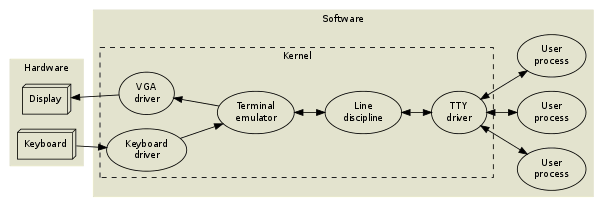

# Linux 

## Unix 终端系统（TTY）是如何工作的?
[ Unix 终端系统（TTY）是如何工作的?](https://waynerv.com/posts/how-tty-system-works/)


## iterm rz 上传
问题：
```
/usr/local/bin/iterm2-send-zmodem.sh: line 21: /usr/local/bin/sz: No such file or directory
```
处理：
```
brew list lrzsz
vim /usr/local/bin/iterm2-send-zmodem.sh
```
修改对应的 `/usr/local/bin/sz` 为 `brew list lrzsz` 中查看的位置。


## Ubuntu Docker Timezone 设置
一般来讲如下方法就够了：
```
RUN echo "Asia/Shanghai" > /etc/timezone
RUN dpkg-reconfigure -f noninteractive tzdata
```
但是因为 `Ubuntu` 的 `bug`,  要添加一行 `RUn rm -f /etc/localtime`, 因此:
```
RUN echo "Asia/Shanghai" > /etc/timezone
RUN rm -f /etc/localtime
RUN dpkg-reconfigure -f noninteractive tzdata
```
如果提示 `tzdata` 未安装，则执行如下命令安装：
```
apt-get install -y tzdata
```

## CPU
关于x86、x86_64/x64、amd64和arm64/aarch64。

* x86（32位系统）g
* x84_64（简称x64，属于64位系统，向下兼容x86）
* amd64=x86_64=x64!=IA64

## 系统版本信息
### 查看Linux内核版本

1、 `cat /proc/version`
```
[root@localhost ~]# cat /proc/version
Linux version 3.10.0-1160.76.1.el7.x86_64 (xxxx@kbuilder.bsys.centos.org) (gcc version 4.8.5 20150623 (Red Hat 4.8.5-44) (GCC) ) #1 SMP Wed Aug 10 16:21:17 UTC 2022
```
2、 `uname -a`
```
[root@localhost ~]# uname -a
Linux xxxx 3.10.0-1160.76.1.el7.x86_64 #1 SMP Wed Aug 10 16:21:17 UTC 2022 x86_64 x86_64 x86_64 GNU/Linux
```

### 查看Linux系统版本

1、 `lsb_release -a`，即可列出所有版本信息：
```
[root@localhost ~]# lsb_release -a
LSB Version:	:core-4.1-amd64:core-4.1-noarch:cxx-4.1-amd64:cxx-4.1-noarch:desktop-4.1-amd64:desktop-4.1-noarch:languages-4.1-amd64:languages-4.1-noarch:printing-4.1-amd64:printing-4.1-noarch
Distributor ID:	CentOS
Description:	CentOS Linux release 7.9.2009 (Core)
Release:	7.9.2009
Codename:	Core
```
注：`bash: lsb_release: command not found...`
解决：
```
[root@localhost ~]# yum install -y redhat-lsb
```

这个命令适用于所有的Linux发行版，包括Redhat、SuSE、Debian…等发行版。

2、 cat /etc/redhat-release，这种方法只适合Redhat系的Linux：
```
[root@localhost ~]# cat /etc/redhat-release
CentOS Linux release 7.9.2009 (Core)
```
3、 cat /etc/issue，此命令也适用于所有的Linux发行版。
在 CentOS 下执行显示为：
```
[root@localhost ~]# cat /etc/issue
\S
Kernel \r on an \m
```

在 Ubuntu 下显示为：
```
root@zhaokai-d-l1:/# cat /etc/issue
Ubuntu 20.04.4 LTS \n \l
```


## 2>&1 | tee

① 标准输出+标准错误

输出标准输出和标准错误，同时保存到文件`logfile`。

```shell
<command> 2>&1 | tee <logfile>
```

管道作用：把一个进程的标准输出作为另一个进程的标准输入。

`2>&1`作用：是把标准错误重定向到标准输出的副本一起输出。上面的命令，把标准输出和标准错误都输出作为`tee`命令的标准输入。

`tee`的作用：把标准输入的内容拷贝到文件，并输出。

② 忽略标准输出

若想忽略标准输出，只输出标准错误并保存到文件`logfile`。

```shell
<command> 2>&1 >/dev/null | tee logfile
```

`2>&1`： 将标准错误重定向到标准输出，注意，此时标准输出还没有被重定向。

`/dev/null` 等同于`1>/dev/null`。 `/dev/null`文件是一个空设备，类似于`windows`内的回收站，使用`>/dev/null`（等同于`1>/dev/null`）将标准输出重定向到`/dev/null`，即不显示标准输出的内容。所以这时的标准输出就仅变为重定向过来的标准错误了。

##  nohup |  &

```
nohup <command> > xxx.log &
```

`&`：后台运行程序，结果会输出到终端，使用`Ctrl + C`发送`SIGINT`信号，程序免疫，关闭`session`发送`SIGHUP`信号，程序关闭。

`nohup`：结果默认会输出到`nohup.out`，使用`Ctrl + C`发送`SIGINT`信号，程序关闭，关闭`session`发送`SIGHUP`信号，程序免疫。

注：使用`nohup`和`&`配合来启动程序`nohup ./test &`，同时免疫`SIGINT`和`SIGHUP`信号。

## 光标快捷键

| 命令     | 说明             | 作用                       |
| -------- | ---------------- | -------------------------- |
| ctrl + r | reverse-i-search | 反向搜索执行过的命令       |
| ctrl + a | head             | 光标跳到行首               |
| ctrl + e | end              | 光标跳到行尾               |
| ctrl + b | backward         | 光标后退一个字符           |
| ctrl + f | forward          | 光标前进一个字符           |
| ctrl+d   | delete           | 删除光标后一个字符         |
| ctrl+h   | head             | 删除光标前一个字符         |
| ctrl+k   |                  | 清除光标后至行尾的所有内容 |
| ctrl+u   |                  | 清除光标前至行首的所有内容 |
| ctrl + c | clear            | 杀死当前进程，另起一行     |
| ctrl + l | line             | 清屏                       |
| ctrl + w | words            | 移除光标前的一个单词       |
| ctrl + t |                  | 交换光标位置前的两个字符   |

## 复用命令

| 命令        | 作用                         |
| ----------- | ---------------------------- |
| !!          | 复用上一条命令               |
| !df         | 复用上一条以 “df” 开头的命令 |
| history     | 查看历史命令                 |
| history [n] | 列出最近的n条历史命令        |
| ![n]        | 复用命令历史中的 [n] 号命令  |

## 查看文件

| 命令                    | 作用                         |
| ----------------------- | ---------------------------- |
| tail -f /var/log/syslog | 实时显示日志文件中增加的内容 |
| tail -5 test.php        | 查看最后五行日志信息         |
| tail -n +10 test.php    | 从第10行开始显示文件         |

## 查询文件

| 命令                                  | 作用                                             |
| ------------------------------------- | ------------------------------------------------ |
| find / -name "php.ini"                | 查找php.ini文件的位置                            |
| find /home -iname "*.txt"             | 在/home目录下忽略大小写，查找以.txt结尾的文件名  |
| find . -type f -size +10M             | 搜索大于10M的文件                                |
| find . -type f -size -1k              | 搜索小于1k的文件                                 |
| find . -type f -size 10M              | 搜索等于10M的文件                                |
| find . -name "*.txt" -o -name "*.pdf" | 当前目录及子目录下查找所有以.txt和.pdf结尾的文件 |

## ps

作用：显示当前系统中进程的快照。也就是说，该命令能捕获系统在某一事件的进程状态。
英文：`processes snapshot`,report a snapshot of the current processes.

选项：

| 选项 | 说明                   | 作用                         |
| ---- | ---------------------- | ---------------------------- |
| a    | all                    | 显示所有进程                 |
| -a   | -all                   | 显示同一终端下的所有进程     |
| -A   | Identical to -e.       | 显示所有进程                 |
| -e   | Identical to -A.       | Select all processes.        |
| f    | Do full-format listing | 显示程序之间的关系           |
| u    | userlist               | 指定用户的所有进程           |
| -au  |                        | 显示本用户的详细信息         |
| -aux |                        | 显示所有包含其他使用者的行程 |

实例1：使用`cpu`和内存升序排序来过滤进程，并通过管道显示前10个结果。

```linux
[root@wx /]# ps -aux --sort -pcpu,-pmem | head -n 10
USER PID %CPU %MEM VSZ RSS TTY STAT START TIME COMMAND
root 10620 0.2 1.1 132656 11968 ? Ssl 9月12 89:52 /usr/local/aegis/aegis_client/aegis_10_51/AliYunDun
root 25 0.1 0.0 0 0 ? S 7月24 147:03 [kswapd0]
```


实例2：使用`PS`实时监控进程状态（动态显示，每秒刷新一次）

```linux
[root@wx /]# watch -n 1 'ps -aux --sort -pcpu,-pmem | head -n 10'
```


实例3：查找特定进程的信息

```linux
[root@wx /]# ps -ef | grep nginx
[root@wx /]# ps -aux|grep nginx
```

## netstat

作用：用来打印`Linux`中网络系统的状态信息，获取整个`Linux`系统的网络情况。

英文：`network statistics`, Print network connections, routing tables, interface statistics, masquerade connections, and multicast memberships.

选项：

| 选项 | 说明       | 作用                                       |
| ---- | ---------- | ------------------------------------------ |
| -a   | --all      | 显示所有连线中的Socket。                   |
| -t   | --tcp      | 显示TCP传输协议的连线状况。                |
| -u   | --udp      | 显示UDP传输协议的连线状况。                |
| -n   | --numeric  | 直接使用ip地址，而不通过域名服务器。       |
| -p   | --programs | 显示正在使用Socket的程序识别码和程序名称。 |
| -l   | -listening | 显示监控中的服务器的Socket。               |
| -e   | --extend   | 显示网络其他相关信息。                     |

实例1：禁用反向域名解析,只列出 TCP 或 UDP 协议的连接。

```linux
[root@wx /]# netstat -antu
Proto Recv-Q Send-Q Local Address Foreign Address State
tcp 0 0 0.0.0.0:80 0.0.0.0:* LISTEN
udp 0 0 0.0.0.0:68 0.0.0.0:*
```

实例2：只列出监听中的`nginx`连接，要求获取进程名(-p)、进程号(-p)以及用户 ID(-e)。

```linux
[root@wx /]# netstat -lnept | grep nginx
tcp 0 0 0.0.0.0:80 0.0.0.0:* LISTEN 0 30270 13332/nginx: master
```

实例3：查看端口占用情况（redis-6379，mysql-3306）

```linux
[root@wx /]# netstat -tunpl | grep 3306
tcp6 0 0 :::3306 :::* LISTEN 22311/mysqld
```

# Vim 

## 跳转

* 跳到到首行：两次`g`。
* 跳到最后一行：按`G`，即`shift+g`。
* 跳转到当前行的第一个字符：在当前行按`0`。
* 跳转到当前行的最后一个字符：在当前行按`$`。
* 跳转到文件第`n`行：`ngg/nG `。例如：25gg或者25G 跳转到第25行。

## 删除
* 删除一行。按Esc键进入正常模式，将光标放在要删除的行上，键入dd并按Enter键以删除该行。
* 删除多行。按Esc键进入正常模式，将光标放在要删除的第一行上，键入5dd并按Enter键以删除接下来的五行。
* 删除行范围。删除一系列行，语法：`:[start],[end]d`。按Esc键进入正常模式，输入:3,5d，然后按Enter键以删除行。
* 指定范围删除。.（点）- 当前行，$ - 最后一行，% - 所有行。
* 在的普通模式下键入`ggdG`即可删除其中全部内容。 说明： 
```
gg：光标跳转到该文件的行首。
dG：删除光标行及其以下行的全部内容。
```
示例：
```
:.,$d - 从当前行到文件末尾。
:.,1d - 从当前行到文件开头。
:10,$d - 从第十行到文件末尾。
:1,$d - 从第一行到文件末尾（包含第一行）。
```
* 删除所有行。要删除所有行，可以使用代表所有行的%符号。按Esc键进入正常模式，键入:%d，然后按Enter键以删除所有行。
* 删除包含模式的行。基于特定模式删除多行的语法如下：`:g//d`，全局命令（g）告诉删除命令（d）删除所有包含的行，
  要匹配与模式不匹配的行，请在模式之前添加感叹号（!）`:g!//d`。 
示例：
```
:g/foo/d - 删除所有包含字符串“foo”的行，它还会删除“foo”嵌入较大字词（例如“football”）的行。
:g!/foo/d - 删除所有不包含字符串“foo”的行。
:g/^#/d - 从Bash脚本中删除所有注释，模式^#表示每行以#开头。
:g/^$/d - 删除所有空白行，模式^$匹配所有空行。
:g/^\s*$/d - 删除所有空白行，与前面的命令不同，这还将删除具有零个或多个空格字符（\s*）的空白行。
:g/\/\//d - 删除所有存在 // 的行。
```


全选（高亮显示）：按esc后，然后ggvG或者ggVG
全部复制：按esc后，然后ggyG
全部删除：按esc后，然后ggdG

## 复制 (Yanking)
复制示例：
```
yy - 复制当前行，包括换行符
3yy - 复制从光标所在的当前行开始的三行文本
y$ - 复制从光标位置到行尾的文本
y^ - 复制从光标位置到行首的文本
yw - 复制到下一个词的开头
yiw - 复制当前词
y% - 复制匹配符号范围内容。默认支持的符号对是(),{},[].这个在复制括号内内容时，很有用处。
```
## 剪切 (Deleting)
在正常模式下，d按键是用来剪切文本的。把光标移动到想要的位置，参考下面的命令按d按键。示例命令：
```
dd - 剪切当前行，包括换行符
3dd - 剪切从光标位置所在行开始的 3 行文本
d$ - 剪切从光标位置到行尾的内容
这些命令同时适用于删除的场景。例如，dw可以删除到下一个词的开头。而d^可以删除光标位置到行首的内容。
```
## 粘贴 (Putting)
想要粘贴被剪切的内容，先将光标移动到想要的位置，然后按p键可以将内容粘贴到当前光标后面，或者按P按键可以粘贴到当前光标前面。


## 显示

设置 vim 显示行号：

* 临时**显示行号** ：如果只是临时**显示vim**的**行号**，只须按ESC键退出编辑内容模式，输入`：set number`后按回车键，就可以**显示行号**了。 **行号显示**只是暂时的，退出**vim**后再次打开**vim**就不**显示行号**了。
* 如果想让vim永久显示行号，则需要修改vim配置文件vimrc。如果没有此文件可以创建一个。在启动vim时，当前用户根目录下的vimrc文件会被自动读取，因此一般在当前用户的根目录下创建vimrc文件，即使用下面的命令：
```
vim ~/.vimrc
set number
```
* 取消行号：`":set nonu"`。


配置全局变量`gopath`

```go
vim ~/zshrc

export GOPATH=/Users/wangxiong3/sdk/go1.14
export GOBIN=$GOPATH/bin
export PATH=$PATH:$GOBIN

source ~/.zshrc
```


