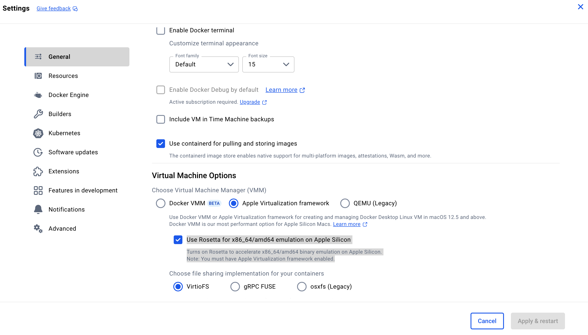

# 相关命令

```
# 定期执行 ls -alh 命令
watch -n 1 ls -alh

# 查看Docker系统的磁盘空间使用情况.
docker system df -v

# 在指定目录及其子目录中查找大小大于1GB的文件，并使用du -h命令以人类可读的格式显示这些文件的磁盘使用情况。
sudo find /opt/xxx -type f -size +1G -exec du -h {} +

# 将容器保存为镜像
docker commit -m "xxx 1.1.0" -a "author" container-id xxx:1.1.0

# 导出镜像（未压缩）
docker save -o xxx_1.1.0.tar xxx:1.1.0

# 保存镜像的同时进行压缩
docker save xxxx:1.3.1 | gzip > xxx_1.3.1.tar.gz

# 导入镜像
docker load --input xxx_1.1.0.tar

# 运行容器
docker run --name xxx_xxx_1.1.0 --privileged=true -itd --restart=always -v /opt/xxxx/xxx:/opt/xxx/xxx/xxx xxx:1.1.0 /usr/sbin/init
```


# qemu: uncaught target signal 11 (Segmentation fault) - core dumped




这个选项的作用:

这是 Docker 针对 Apple Silicon（M1/M2/M3 芯片）用户提供的选项，用来通过 Rosetta 2 加速 x86_64 / amd64 架构镜像的运行。

默认情况下，Apple Silicon 是 arm64 架构的，但很多 Docker 镜像（尤其是旧的、社区构建的）还是基于 x86_64 架构的。如果你运行这些镜像，会用到 QEMU 进行模拟，非常慢，甚至容易崩溃（如你遇到的 qemu: segmentation fault）。

开启这个选项后，Docker 会使用 macOS 的 Rosetta 2 框架来模拟 amd64，性能更高，兼容性更强，也更稳定。


开启这个选项后的好处:

| 项目  | 效果                                |
| --- | --------------------------------- |
| 兼容性 | 更好地运行老旧的 amd64 镜像                 |
| 性能  | 比 QEMU 快得多（接近原生）                  |
| 稳定性 | 避免 `qemu: segmentation fault` 等问题 |
| 自动  | Docker Desktop 会自动识别并启用 Rosetta   |


# Apple M 系列（M1/M2/M3 芯片） 的 macOS 上遇到 Docker 无法启动

Docker Desktop 卡在 "Starting..." 或打不开界面:
重置 Docker 设置（不丢数据）：
在终端执行：

```
rm -rf ~/Library/Group\ Containers/group.com.docker
```

✅ 原因解析：Docker 的缓存与配置损坏
~/Library/Group Containers/group.com.docker 是 macOS 上 Docker Desktop 用来存储一些共享配置和缓存数据的地方，包括：

* Docker Desktop 的偏好设置（比如启动选项、资源分配）

* 登录状态、Kubernetes 设置等

* Docker 后台进程的内部缓存（可能包括旧版本兼容层）

在使用过程中，尤其是以下情况可能会让这些文件损坏或冲突：

🔸 常见导致配置损坏的原因：

* 系统升级	macOS 升级后旧缓存不兼容
* 强制退出 Docker	手动 kill 或系统崩溃
* 安装过多个版本	比如 Intel 版 + ARM 版混装
*  Docker 更新失败	更新时未正确迁移旧数据
*  第三方软件干扰	比如清理软件误删配置文件部分内容


# docker 容器磁盘空间占用过大

使用 docker 命令`docker system df -v`查看，其中一项为:

```
5643xxx115  mongo:4.x  "docker-entrypoint.s…"  1  814GB  6 months ago  Up 3 hours xxx_mongo 
```

原因：进入容器中，查看文件系统的使用情况。发现 `/var/tmp/mongod.log`文件过大。

[Configuration File Options](https://www.mongodb.com/docs/manual/reference/configuration-options/)

设置日志级别：

```
在 MongoDB 的配置文件中，systemLog.verbosity 设置用于定义日志的详细程度，其级别从 0 到 5 不等。
下面是每个级别代表的含义：

0: 这是 MongoDB 的默认日志详细程度级别。在此级别，日志将包括信息性（Informational）消息。这些消息提供了正常操作期间的基本信息，但不包括调试信息。
1: 这个级别增加了一些调试（Debug）消息。这些消息有助于了解系统的内部工作情况，尤其是在诊断问题时。调试级别为 1 的消息通常包含一般的调试信息。
2: 在这个级别，日志中将包括更详细的调试信息。适用于更深入的问题调查。在日志中，这些消息会被标记为 D2。
3: 这一级别提供了比级别 2 更详细的调试信息。通常用于更专业的问题解决，可能包括系统的深层次工作细节。
4: 在这个级别，日志将记录极其详细的调试信息。这对于常规操作来说通常是过度的，但在调试极其复杂的问题时非常有用。
5: 这是最高的日志详细程度级别，提供最详尽的调试信息。仅在需要非常详细的系统内部运行信息时使用。

每个级别都在前一个级别的基础上增加了更多的细节。随着级别的升高，日志文件的大小和日志活动的频率也会相应增加，这可能对系统性能产生影响。
因此，在生产环境中，建议仅在需要时临时增加日志详细程度级别，并在问题解决后将其恢复到默认或较低的级别。
```

关闭日志：将 `systemLog.destination` 设置为 file 并将 `systemLog.path` 指向 `/dev/null`：

```
# where to write logging data.
systemLog:
  destination: file
  logAppend: true
  #path: /var/tmp/mongod.log
  path: /dev/null
```

# 镜像导出保存

```
# 导出镜像（未压缩）
docker save -o xxx_1.1.0.tar xxx:1.1.0

# 保存镜像的同时进行压缩
docker save xxxx:1.3.1 | gzip > xxx_1.3.1.tar.gz
```

当您使用 Docker 来保存和导出容器镜像时，有两种常见的方法：

使用管道结合 gzip 命令和直接使用 `docker save` 命令。这两种方法的主要区别在于它们如何输出和压缩镜像文件。

```
docker save xxxx:1.3.1 | gzip > xxx_1.3.1.tar.gz：
```

这条命令首先使用 `docker save` 命令导出 `xxxx:1.3.1` 镜像。
然后，通过管道 (|) 将镜像数据传递给 gzip 命令，用于压缩数据。
压缩后的数据被重定向 (>) 到一个以 .tar.gz 结尾的文件（在这个例子中是 `xxx_1.3.1.tar.gz`），这是一个标准的压缩格式。
这种方法的优点是可以直接生成压缩过的镜像文件，节省存储空间。

```
docker save -o xxx_1.1.0.tar xxx:1.1.0：
```

这条命令同样使用 `docker save` 命令来导出镜像，但它直接使用 -o 选项指定输出文件。
这里，`xxx:1.1.0` 镜像被保存到一个名为 `xxx_1.1.0.tar` 的文件中。
注意这个文件不是压缩格式，它是一个普通的 tar 归档文件。
如果需要压缩，您需要在这之后使用额外的步骤（例如再运行一个 gzip 命令）。

总结来说，第一种方法在保存镜像的同时进行压缩，而第二种方法则先保存未压缩的 tar 归档文件，之后可以根据需要进行压缩。
选择哪种方法取决于您是否需要直接生成压缩文件，以及是否对存储空间有特定的要求。

# 插拔设备后，在 Ubuntu22.04 的 Docker 中使用 adb devices 识别不到。

现象：使用Ubuntu22.04系统，在容器中使用adb 映射，宿主机执行 `adb devices` 时候 adb 不可用（已卸载），
宿主机与容器之间也映射了关系`/dev/bus/usb:/dev/bus/usb`，但是进入容器中后发现使用 `adb devices` 没有找到相应的设备信息。
手动 `adb kill-server` 和 `adb start-server` 也无法找到，重新插拔手机使用 `adb devices`也没有找到设备。
重新重启容器后使用`adb devices`正常找到设备。

问题：`adb server`在容器内外的通信和设备重新连接的管理。

最终解决办法：

* 重建容器。`docker-compose up -d --force-recreate xxx_tool_xxx`。

排查原因：

检查`docker-compose`的映射关系：

```
xxx_xxx:
    image: xxxx
    container_name: xxx
    restart: unless-stopped
    working_dir: /root/
    tty: true
    privileged: true
    command: /sbin/init
    ports:
      - "xxxx:xxxx"
    networks:
      xxx_net:
        ipv4_address: xxx.xx.xx.xx
    volumes:
      - /dev/bus/usb:/dev/bus/usb
      - /var/run/docker.sock:/var/run/docker.sock
      - /usr/bin/docker:/usr/bin/docker
      - /etc/docker:/etc/docker
```

① 检查adb server状态： 在容器内执行 adb devices 之前，确保adb server正在运行。可以使用以下命令检查：

```
adb kill-server
adb start-server
```

这将杀死现有的adb server并重新启动一个。确保在容器内执行这些命令。

② 检查udev规则： 确保在宿主机上设置了正确的udev规则，以便在设备连接时正确配置权限。在宿主机上，
可以检查 `/etc/udev/rules.d/` 目录中的相关规则。确保设备有适当的规则，类似于：

```
SUBSYSTEM=="usb", ATTR{idVendor}=="your_vendor_id", ATTR{idProduct}=="your_product_id", MODE="0666"
```

你需要替换 `your_vendor_id` 和 `your_product_id` 为设备的实际值。然后重新加载`udev`规则：

```
sudo udevadm control --reload-rules
sudo service udev restart
```

检查USB设备映射： 确保正确地将USB设备从宿主机映射到容器。你提到已经映射了 `/dev/bus/usb:/dev/bus/usb`，确保这个映射是正确的。

③ 查看 `adb log`： 在容器中运行 `adb logcat` 来查看adb日志，这可能提供一些关于为什么adb无法找到设备的信息。

④ 尝试使用其他工具： 如果adb仍然无法找到设备，尝试使用其他工具如 fastboot 或 lsusb 来确认设备是否正确连接到容器。

⑤ 确认网络连接： 确保容器内外的网络连接正常，有时adb server可能会通过网络连接。

# 配置Elasticsearch容器的Java虚拟机

现象：后台系统请求响应比较慢。
environment字段中包含了ES_JAVA_OPTS环境变量，并将其值设置为-Xms3g -Xmx3g，
这将使Elasticsearch容器的Java虚拟机使用3GB的初始堆大小和3GB的最大堆大小。

Java虚拟机（JVM）的初始堆大小（-Xms参数）是指JVM启动时分配的初始堆内存大小，而不是硬盘空间。 这是用于存储Java应用程序运行时数据的内存区域。

具体来说，-Xms参数控制了Java应用程序启动时分配给堆的内存空间。
堆是用于存储Java对象实例的内存区域，包括对象的实例变量和数组元素。
初始堆大小指定了JVM在启动时分配给堆的内存量，但堆的大小会根据应用程序的需求进行动态调整，直到达到最大堆大小（-Xmx参数）为止。

如果你将-Xms参数设置为3GB，那么JVM启动时将分配3GB的内存作为初始堆空间。这并不是硬盘上的空间，而是RAM（内存）上的分配。
-Xmx参数则控制了堆的最大大小，即JVM在任何时候都不会分配超过这个大小的堆内存。
所以，-Xms参数和-Xmx参数都用于控制JVM在运行时所使用的内存，而不是硬盘上的存储空间。硬盘上的存储空间通常不由JVM的堆大小参数来控制，而是由操作系统和文件系统来管理。

示例：在Docker容器中运行Elasticsearch，并为其提供持久化存储、网络连接和管理界面。
同时，es-head容器用于监控和管理Elasticsearch，依赖于xxxx_es容器。

```
  xxxx_es:
    image:  elasticsearch:7.17.x
    container_name: xxxx_es
    restart: always
    networks:
      xxxx_net:
        ipv4_address: 17x.16.1.x
    volumes:
      - xxxx/db/es/data:/usr/share/elasticsearch/data:rw
      - xxxx/db/es/conf/elasticsearch.yml:/usr/share/elasticsearch/config/elasticsearch.yml
      - xxxx/db/es/conf/jvm.options:/usr/share/elasticsearch/config/jvm.options
      - xxxx/db/es/data/logs:/user/share/elasticsearch/logs:rw
    ports:
      - 9x00:9x00
      - 9x00:9x00
    environment:
      - discovery.type=single-node
      - TZ=Asia/Shanghai
      - "ES_JAVA_OPTS=-Xms3g -Xmx3g"
  es-head:
      image: mobz/elasticsearch-head:5
      container_name: es-head
      restart: always
      networks:
        xxxx_net:
          ipv4_address: 17x.16.1.x
      ports:
        - "9x00:9x00"
      depends_on:
        - xxxx_es
```

# 使用 docker-compose 启动 kafka 报错

报错信息：

```
ERROR Fatal error during KafkaServer startup. Prepare to shutdown (kafka.server.KafkaServer)
kafka.common.InconsistentClusterIdException: The Cluster ID ZfQZirUQRua6RnLVYiz_rA doesn't match stored clusterId Some(iFvDhNp5TP2jnCpEai461Q) in meta.properties. The broker is trying to join the wrong cluster. Configured zookeeper.connect may be wrong.
	at kafka.server.KafkaServer.startup(KafkaServer.scala:223)
	at kafka.server.KafkaServerStartable.startup(KafkaServerStartable.scala:44)
	at kafka.Kafka$.main(Kafka.scala:82)
	at kafka.Kafka.main(Kafka.scala)
```

报错原因：

Kafka Broker 尝试加入了一个错误的集群，原因是其集群ID（Cluster ID）与之前存储在meta.properties文件中的集群ID不匹配。这通常发生在以下情况下：

* Kafka配置文件更改：如果你更改了Kafka Broker的配置文件，尤其是broker.id或zookeeper.connect等配置项，可能导致集群ID不匹配。
* ZooKeeper连接配置错误：zookeeper.connect配置项指定了Kafka Broker连接ZooKeeper的信息。确保这个配置正确，并且Kafka
  Broker可以连接到正确的ZooKeeper集群。

解决办法：

* 检查Kafka配置文件：检查Kafka
  Broker的配置文件，特别是broker.id和zookeeper.connect的值是否正确。确保broker.id是唯一的，并且zookeeper.connect指向正确的ZooKeeper集群。
* 删除错误的Cluster ID：在Kafka数据目录中，有一个meta.properties文件，其中存储了Cluster
  ID。如果你确定配置正确，你可以尝试删除这个文件，然后重新启动Kafka Broker。Kafka将会重新生成正确的Cluster ID。
* 清除ZooKeeper数据：如果上述步骤没有解决问题，可能需要清除ZooKeeper中的一些数据。在做任何数据清除之前，务必备份数据以防万一。你可以尝试删除ZooKeeper数据目录中与Kafka相关的节点，然后重新启动Kafka
  Broker。

具体步骤：

```
rm -rf /opt/xxxx/data/db/kafka/data/meta.properties
docker-compose restart xxx_kafka
```

# 初始化mysql数据备份迁移到另一台mysql

docker 启动 mysql 容器时报错：

```
[System] [MY-013169] [Server] /usr/sbin/mysqld (mysqld 8.0.30) initializing of server in progress as process 81
[ERROR] [MY-010457] [Server] --initialize specified but the data directory has files in it. Aborting.
[ERROR] [MY-013236] [Server] The designated data directory /var/lib/mysql/ is unusable. You can remove all files that the server added to it.
[ERROR] [MY-010119] [Server] Aborting
```

原因：

```
xxx/data/db/mysql下应该是所需要的mysql初始化数据。包括表结构、数据库、日志数据等。
```

解决：

```
保证xxx/data/db/mysql下的初始化数据正常。之前遇到xxx/data/db/mysql/里面还有一层data数据，将data数据移出来即可。
```

# docker 导入和导出相关数据

## 导入数据

```
docker exec -i xxx_mysql sh -c 'mysql -uxxxx -pxxxxx -D database_name' </opt/xxxx/mysqldump_xxxxx.sql
docker exec -i xxx_mongo sh -c 'mongorestore -u xxx -p xxxx --authenticationDatabase admin -d xxxx --drop --archive' </opt/xxxx/mongodump_xxxx.archive
```

* `sh -c`：调用 `shell (sh)` 并允许在其中执行一个命令 `(-c)`。
* `--drop`：在还原之前删除目标数据库的现有数据。
* `--archive`：指定还原的数据来源为归档文件。
* `</opt/xxxx/mongodump_xxxx.archive`：这部分是输入重定向。它将 `mongodump_xxxx.archive`
  文件的内容作为输入传递给容器内部的 `mongorestore` 命令.

## 导出数据

```
docker exec -i xxx_mysql sh -c 'mysqldump -uxxx -pxxxx --skip-add-locks --single-transaction -q xxxx' >/opt/mysqldump_$(date '+%Y%m%d').sql
docker exec -i xxx_mongo sh -c 'mongodump -u admin -p xxxx --authenticationDatabase admin -d xxxx --archive' >/opt/mongodump_$(date '+%Y%m%d').archive
```

* `--skip-add-locks`：在导出期间跳过添加锁定语句。
* `--single-transaction`：使用单个事务导出数据，确保一致性。
* -q：使用"快速"模式导出数据，以减少导出时的负载。

# Docker 中与 MTU 相关的信息

## 什么是 MTU ?

MTU 指的是“最大传输单元”（Maximum Transmission Unit），是计算机网络中的一个术语，它是指在一个网络中，能够通过一次发送的数据包的最大大小。

网络中的每个设备和协议都有其自己的MTU限制。当数据包的大小超过某个设备或协议的MTU限制时，
该数据包将被分割成更小的数据包进行传输，这会增加网络的负载和延迟。

MTU 的大小通常以字节为单位进行计算。在以太网中，MTU 的默认值为1500字节，而在其他网络协议中可能会有不同的值。
管理员可以在网络设备中配置 MTU 大小，以满足特定的网络需求和性能要求。

## 如何理解 Docker 中的 MTU。

在 Docker 中，MTU 是指容器网络中的最大传输单元。与主机上的网络接口类似，Docker 容器也有其自己的网络接口和 MTU 值。
Docker 网络使用 bridge 驱动程序来提供容器网络连接。在此模式下，Docker 会创建一个虚拟网络桥接设备，该设备用于将多个容器连接到同一网络中。

在 Docker 中，容器的默认 MTU 大小为1500字节，与大多数以太网设备的默认 MTU 大小相同。
管理员可以使用 --mtu 选项在创建容器时指定容器的 MTU 值。通过调整 MTU 大小，管理员可以在容器网络中优化性能和避免网络分段。

例如，在高负载网络环境中，降低 MTU 大小可以减少分段和延迟，从而提高网络性能。
另外，一些特定的网络协议和设备可能需要特定的 MTU 值才能正常工作，管理员也可以根据需要调整 MTU 大小来支持这些协议和设备。

## Docker 中 python pip 网络的问题有哪些？

在 Docker 中使用 Python 和 pip 安装第三方包时可能会遇到网络问题，包括但不限于以下几种：

* 防火墙和代理问题：如果 Docker 主机上设置了防火墙或代理，可能会阻止 Docker 容器与外部网络进行通信，导致 pip 安装失败。

* DNS 问题：Docker 容器默认使用主机上的 DNS 服务器，如果主机上的 DNS 服务器出现问题，容器中的 pip 也无法正常解析域名。

* MTU 问题：在某些情况下，MTU 大小可能会影响 Docker 容器中 pip 的网络连接。如果默认的 MTU 值不适用于特定的网络环境，可能会导致网络连接失败。

* pip 源问题：默认的 pip 源可能会被屏蔽或限速，如果需要更快速、稳定的安装，可以选择其他的 pip 源，例如使用阿里云源、清华源等。

* 版本兼容性问题：有些 Python 包的不同版本可能存在不同的依赖关系和兼容性问题，可能会导致 pip 在 Docker 容器中无法正常安装或运行。

为了避免这些问题，可以尝试以下几种解决方法：

* 在 Dockerfile 中配置合适的防火墙和代理规则，确保容器可以与外部网络正常通信。

* 在 Docker 容器中设置 DNS 服务器或使用其他 DNS 解析方案，确保 pip 可以正常解析域名。

* 在 Docker 容器中调整 MTU 大小，以确保网络连接的稳定性和可靠性。

* 在 pip 安装时指定更快速、稳定的 pip 源，以提高安装速度和可靠性。

* 了解 Python 包的版本兼容性和依赖关系，尽可能使用与其他环境相同的版本，以确保在 Docker 容器中可以正常安装和运行。

## 在 Docker 容器中如何调整 MTU 大小？

在 Docker 容器中，可以通过以下几种方式来调整 MTU 大小：

① 在创建容器时使用 `--mtu` 选项指定 MTU 大小：

```
docker run --mtu=1400 myimage
```

此命令将在创建名为 mycontainer 的容器时将其 MTU 大小设置为 1400 字节。
② 在 Docker Compose 中使用 networks 关键字指定 MTU 大小：

```yaml
networks:
  mynetwork:
    driver: 06.bridge
    driver_opts:
      com.docker.network.driver.mtu: "1400"
```

这个配置将在 `Docker Compose` 中使用 `mynetwork` 网络时将其 MTU 大小设置为 1400 字节。
③ 在 Docker 主机中设置默认的 MTU 大小，从而使所有容器使用相同的 MTU 大小。
可以通过编辑 `/etc/docker/daemon.json` 文件并添加以下内容来实现：

```
{
  "mtu": 1400
}
```

这个配置将使 Docker 主机上的所有容器的 MTU 大小设置为 1400 字节。

需要注意的是，MTU 大小应该与所连接的网络和设备相匹配，以避免网络分段和连接问题。
在调整 MTU 大小时，应该进行测试和调试，以确保网络连接的稳定性和可靠性。

## ip link show 和 ip addr 的区别？

`ip link show` 适合查看网络接口的基本信息，而 `ip addr` 则提供了更详细的网络配置信息。
`ip link show` 命令会列出所有的网络接口，并显示它们的状态、MAC 地址、MTU 等基本信息。
此命令的输出格式更加简洁，适合快速浏览和查找网络接口。例如，以下是 `ip link show` 的示例输出：

```
1: lo: <LOOPBACK,UP,LOWER_UP> mtu 65536 qdisc noqueue state UNKNOWN mode DEFAULT group default qlen 1000
    link/loopback 00:00:00:00:00:00 brd 00:00:00:00:00:00

2: enp0s3: <BROADCAST,MULTICAST,UP,LOWER_UP> mtu 1500 qdisc fq_codel state UP mode DEFAULT group default qlen 1000
    link/ether 08:00:27:52:3c:fa brd ff:ff:ff:ff:ff:ff
```

相比之下，ip addr 命令提供了更详细的网络信息，包括每个网络接口的 IP 地址、广播地址、子网掩码等。此命令的输出格式更加详细，适合进行网络故障排除和调试。例如，以下是
ip addr 的示例输出：

```
1: lo: <LOOPBACK,UP,LOWER_UP> mtu 65536 qdisc noqueue state UNKNOWN group default qlen 1000
    link/loopback 00:00:00:00:00:00 brd 00:00:00:00:00:00
    inet 127.0.0.1/8 scope host lo
       valid_lft forever preferred_lft forever
    inet6 ::1/128 scope host
       valid_lft forever preferred_lft forever

2: enp0s3: <BROADCAST,MULTICAST,UP,LOWER_UP> mtu 1500 qdisc fq_codel state UP group default qlen 1000
    link/ether 08:00:27:52:3c:fa brd ff:ff:ff:ff:ff:ff
    inet 192.168.0.2/24 brd 192.168.0.255 scope global dynamic enp0s3
       valid_lft 86396sec preferred_lft 86396sec
    inet6 fe80::a00:27ff:fe52:3cfa/64 scope link
       valid_lft forever preferred_lft forever
```

# 容器中 mysql 执行sql数据

```
docker cp  ./xxx.sql  xxx_mysql:/home
mysql -uroot -p
use xxx
source xxx

```

# 查看容器映射目录

```
[root@v merged]# docker inspect xxxx_mysql | grep Merge
                "MergedDir": "/opt/xxxx/data/docker/overlay2/ba607d1a14f0ea9e6ae1734a87543e494fb0f431520e2b889f75965166a5c5f6/merged",
[root@ merged]# cd /opt/xxxx/data/docker/overlay2/ba607d1a14f0ea9e6ae1734a87543e494fb0f431520e2b889f75965166a5c5f6/merged
[root@v merged]# ll etc/mysql
total 12K
drwxr-xr-x 1 root root   94 Dec 21  2021 ./
drwxr-xr-x 1 root root 4.0K Sep 22 10:52 ../
drwxr-xr-x 1 root root   62 Dec 21  2021 conf.d/
lrwxrwxrwx 1 root root   24 Dec 21  2021 my.cnf -> /etc/alternatives/my.cnf
-rw-r--r-- 1 root root  839 Jul 10  2016 my.cnf.fallback
-rw-r--r-- 1 root root 1.5K Jan  5  2021 mysql.cnf
drwxr-xr-x 1 root root   24 Dec 21  2021 mysql.conf.d/
[root@web-1 merged]# vim  etc/mysql/mysql.conf.d/mysqld.cnf
max_allowed_packet=16777216
innodb_log_file_size=256M
```

# 命令

```
//  将指定镜像保存成 tar 归档文件，将镜像 runoob/ubuntu:v3 生成 my_ubuntu_v3.tar 文档
docker save -o my_ubuntu_v3.tar runoob/ubuntu:v3

// 导入镜像
docker load < xxx.tar.gz
```

## docker cp

`docker cp` :用于容器与主机之间的数据拷贝。
从容器中拷贝至主机：

```
格式：docker cp [OPTIONS] CONTAINER:SRC_PATH DEST_PATH|-
示例：docker cp xxx_server:/root/xx/xxx /root/xxx/
```

从主机拷贝至容器：

```
格式：docker cp [OPTIONS] SRC_PATH|- CONTAINER:DEST_PATH
示例：docker cp  ./xxx.so  xxx_analyze:/xxxServer/src/plugins/
```

# 安装

## rpm安装

[在 CentOS 上安装 Docker 引擎](https://docs.docker.com/engine/install/centos/)

[centos rpm包](https://download.docker.com/linux/centos/8/x86_64/stable/Packages/)