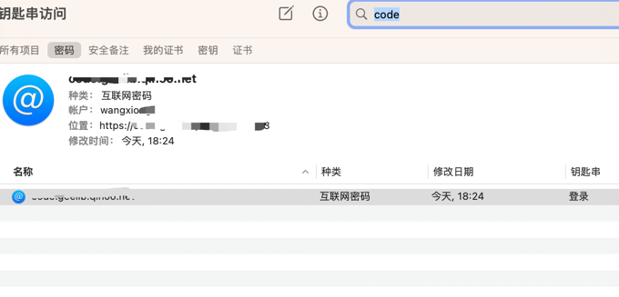
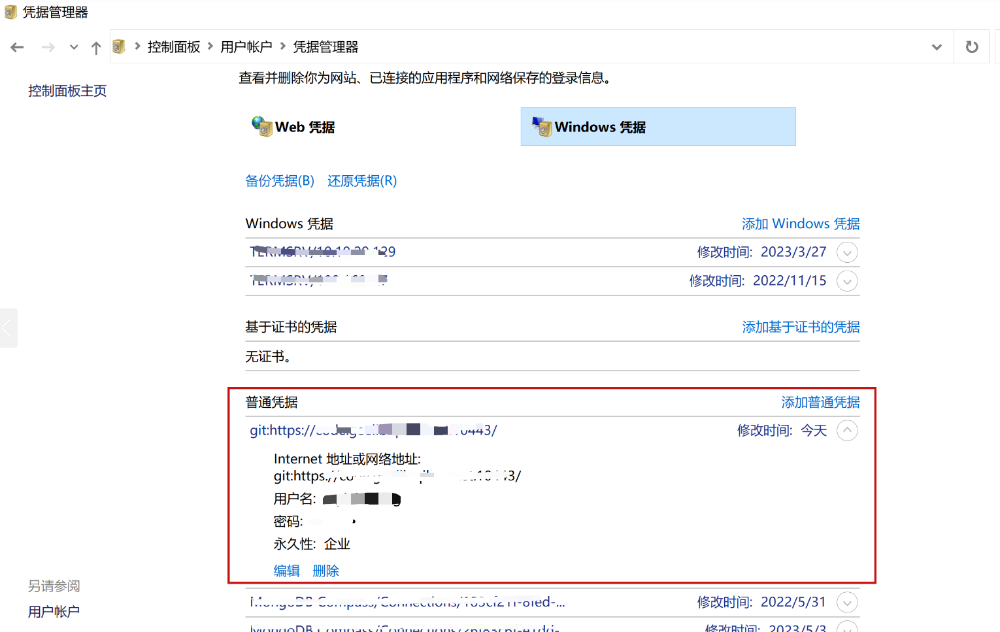

# 将 `master` 分支的内容提取到另外一份代码中


你可以通过以下步骤将 `master` 分支的内容提取到另外一份代码中：

1. **克隆源仓库：**
   如果你还没有源仓库的副本，可以先克隆它：

   ```bash
   git clone <源仓库的URL>
   ```
2. **切换到源仓库的 `master` 分支：**
   确保你在源仓库的 `master` 分支上：

   ```bash
   cd <源仓库目录>
   git checkout master
   ```
3. **导出 `master` 分支内容：**
   如果你只需要 `master` 分支的内容而不需要完整的 Git 历史，可以通过 `git archive` 命令将它导出为一个压缩文件：

   ```bash
   git archive --format=tar --output=master.tar master
   ```

   这样会将 `master` 分支的内容打包为 `master.tar` 文件。
4. **将内容导入到目标仓库：**
   接下来，进入目标仓库，解压导出的文件并将它们添加到目标仓库：

   ```bash
   cd <目标仓库目录>
   tar -xf <源仓库目录>/master.tar
   git add .
   git commit -m "导入 master 分支内容"
   git push origin <目标分支>
   ```
5. **或者，直接合并 `master` 分支：**
   如果目标仓库是 Git 仓库，你也可以直接将 `master` 分支的内容合并到目标分支：

   * 在目标仓库中，添加源仓库为一个远程仓库：
     ```bash
     git remote add source <源仓库URL>
     git fetch source
     ```
   * 然后切换到目标分支并合并 `master` 分支：
     ```bash
     git checkout <目标分支>
     git merge source/master
     ```
   * 最后，推送更新到目标仓库：
     ```bash
     git push origin <目标分支>
     ```

这样，你就可以将 `master` 分支的代码迁移到另一个仓库中。如果你需要更多帮助，可以随时告诉我！

# 连接远程仓库需要输入密码

当在Mac电脑上使用 git pull命令时，如果看到提示输入git@w.src.xxx.xxx.net的密码，
这通常意味着git正在尝试通过SSH方式连接到远程仓库，但没有找到或使用正确的SSH密钥。

要解决这个问题，可以按照以下步骤操作：

1、检查SSH密钥：确保Mac上有一个SSH密钥对。
可以在终端中运行ls -al ~/.ssh来检查是否存在如id_rsa（私钥）和id_rsa.pub（公钥）这样的文件。
2、生成SSH密钥：如果你没有SSH密钥，可以通过运行ssh-keygen命令来生成一个新的密钥对。
3、添加SSH密钥到ssh-agent：运行以下命令来启动ssh-agent，然后将私钥添加到它：

```
eval "$(ssh-agent -s)"
ssh-add ~/.ssh/id_rsa
```

这里假设你的私钥文件是`~/.ssh/id_rsa`。
4、添加公钥到Git服务器：将`~/.ssh/id_rsa.pub`（或你的公钥文件）的内容添加到Git服务器（在这个例子中是`w.src.xxx`）上你的用户账户中。
通常，这可以在Git服务器的用户设置或SSH密钥部分中完成。
5、检查SSH配置：确保你的`~/.ssh/config`文件（如果存在）配置正确。如果你的远程仓库地址使用了别名，它应该正确地映射到服务器地址和你的用户名。
6、测试SSH连接：通过运行`ssh -T git@w.src.xxxx`来测试SSH连接。如果连接成功，你应该不再需要输入密码。

确保在整个过程中，你使用的是与你的Git账户相关联的邮箱地址生成SSH密钥。
完成以上步骤后，git pull应该可以无密码直接通过SSH密钥进行身份验证。

# 

错误问题：使用 Git 进行 HTTPS 身份验证时，但终端无法弹出用于输入用户名和密码的提示。

```
fatal: could not read Username for 'https://code.xxx:10443': terminal prompts disabled
```

解决办法：使用凭证助手。
macOS 解决办法：
配置 Git 使用 macOS 的钥匙串访问凭证助手来存储和检索您的凭证。
当执行需要身份验证的 Git 操作时，不再需要手动输入用户名和密码。
① 登录 https://xxx/xxx.git 的服务，注册 克隆的账户和 HTTPS 密码。

② 运行以下命令启用凭证助手：

```
git config --global credential.helper osxkeychain
```

③ 重新克隆一份，使用首次输入用户名和密码来记录凭证。

```
git clone https://xxx/xxx.git
```



window的解决办法：
① 登录 https://xxx/xxx.git 的服务，注册 克隆的账户和 HTTPS 密码。

② 运行以下命令启用凭证助手：

```
git config --global credential.helper wincred
```

③ 控制面板-用户账户-凭据管理器中添加 windows 凭据。


# .gitignore 配置

在项目中配置 `.gitignore`:

```
/.idea/
/test/*
/view/
*.exe
/tmp/
log/log.go
./log/*.log
/.DS_Store
/main
/conf/app.ini
test
/file/
```

# git 配置

使用 `vim /Users/xxxx/.gitconfig`配置如下信息：

```
[user]
name = xxxx
email = xxx@gmail.com
[http]
# 指定是否验证 SSL 证书，默认为 true 。在 SSL 证书无法验证通过时，可以将其设置为 false，以允许连接继续。
sslVerify = false
# 指定 HTTP 代理的地址和端口。可以使用 SOCKS 协议的代理。
# proxy = socks://127.0.0.1:1081
[https]
# proxy = socks://127.0.0.1:1081
[alias]
s = status -s
v = remote -v
r = remote show origin
b = branch
p = pull
ck = checkout
rd = reset HEAD --hard

d = diff --stat
dd = diff --stat --staged
ds = diff --staged

l = log --stat --graph --abbrev-commit
lp = log --stat --graph --abbrev-commit -p
ll = log --all --graph --pretty=format:'%Cred%h%Creset -%C(auto)%d%Creset %s %Cgreen(%cr) %C(bold blue)<%an>%Creset' --abbrev-commit --date=relative

[pull]
rebase = false
[push]
default = simple
[core]
# 指定使用的文本编辑器，默认为vim。
editor = vim
# 指定是否在Git中跟踪文件模式的更改，默认为off。
fileMode = off
# 指定如何处理换行符，默认为input，即保持原样。
autocrlf = input
# 指定一个全局的.gitignore文件，Git会自动忽略这个文件中列出的文件和文件夹。
excludesfile = ~/.gitignore_global
# 指定是否对文件名进行引号包裹，默认为false。
quotepath = false
[color]
ui = auto
[merge]
log = true
[rebase]
autosquash = true
[credential]
helper = store
```

# 生成多个SSH Key

1、本地生成`SSH-Key`：

```shell
# 生成一个gitee用的SSH-Key
ssh-keygen -t rsa -C 'xxxx@xx.com' -f ~/.ssh/gitee_id_rsa
# 生成一个github用的SSH-Key
ssh-keygen -t rsa -C 'xxxx@xx.com' -f ~/.ssh/github_id_rsa
# 生成一个用gitlab的SSH-Key
ssh-keygen -t rsa -C 'xxxx@xx.com' -f ~/.ssh/gitlab_id_rsa
```

2、在 `~/.ssh` 目录下新建一个`config`文件，添加如下内容：

```
# gitee
Host gitee.com
HostName gitee.com
PreferredAuthentications publickey
IdentityFile ~/.ssh/gitee_id_rsa

# github
Host github.com
HostName github.com
PreferredAuthentications publickey
IdentityFile ~/.ssh/github_id_rsa

# gitlab
Host xxxx.com
HostName xxxx.com
PreferredAuthentications publickey
IdentityFile ~/.ssh/gitlab_id_rsa
```

> 其中Host和HostName填写git服务器的域名，IdentityFile指定私钥的路径。

3、将 `.pub` 文件中内容复制到相应的平台`SSH`设置中。

```
# Mac
$ pbcopy < ~/.ssh/id_rsa.pub

# Windows
$ clip < ~/.ssh/id_rsa.pub
# Copies the contents of the id_rsa.pub file to your clipboard

# Linux
$ sudo apt-get install xclip
# Downloads and installs xclip. If you don't have `apt-get`, you might need to use another installer (like `yum`)

$ xclip -sel clip < ~/.ssh/id_rsa.pub
# Copies the contents of the id_rsa.pub file to your clipboard
```

4、连接测试。

```shell
➜ ssh -T git@github.com
The authenticity of host 'github.com (20.205.243.166)' can't be established.
ED25519 key fingerprint is SHA256:+xxx/zLDA0zPMSvHdkr4UvCOqU.
This key is not known by any other names
Are you sure you want to continue connecting (yes/no/[fingerprint])? yes
Warning: Permanently added 'github.com' (ED25519) to the list of known hosts.
Hi LensXiong! You've successfully authenticated, but GitHub does not provide shell access.
```

5、为项目单独配置用户名和邮箱。

* 进入项目所在的目录，和` .git` 目录平行，在 `gitbash`中执行如下命令：

```
git config user.name "wangxiong"
git config user.email "xxxx@xx.com"
```

* 使用 `git config --list` 命令进行查看，可以看到全局和本项目的配置
* 在 `.git` 目录下也有一个 `config` 文件，设置好后，可以进去看下，看有没有修改好。

# git 常用命令

## 修正提交

* git commit --amend // 将暂存区中的文件提交（先可以将需要提交的文件进行add）

## 本地文件撤销操作

* git checkout -- `<file>` // 撤销本地文件的所有修改
* git reset HEAD `<file> `// 取消暂存的文件

## git stash

git stash 命令：临时暂存和恢复

* git stash list // 列出暂存的列表
* git stash save "备注信息"  // 执行暂存并添加备注
* git stash pop // 恢复暂存的工作目录，并将缓存堆栈中的对应stash删除，将对应修改应用到当前的工作目录下，默认为第一个stash,即stash@{0}，如果要应用并删除其他stash，命令：git stash pop stash@{$num} ，比如应用并删除第二个：git stash pop stash@{1}
* git stash show // 显示做了哪些改动，默认show第一个存储，如果要显示其他存贮，后面加stash@{$num}，比如第二个 git stash show stash@{1}
* git stash show -p  // 显示第一个存储的改动，如果想显示其他存存储，命令：git stash show  stash@{$num}  -p ，比如第二个：git stash show  stash@{1}  -p
* git stash apply  // 应用某个存储，但不会把存储从存储列表中删除，默认使用第一个存储,即stash@{0}，如果要使用其他个，git stash apply stash@{$num} ， 比如第二个：git stash apply stash@{1}
* git stash drop stash@{$num} // 丢弃stash@{$num}存储，并从列表中删除这个存储
* git stash clear // 删除所有缓存的stash

## 查看远程分支

* git branch -r | grep x // 查看远程分支并进行正则匹配
* git remote // 不带参数，列出已经存在的远程分支
* git remote -v // 列出详细信息，在每一个名字后面列出其远程url，此时， -v 选项，显示对应的克隆地址
* git remote show origin // 查看远程库的一些信息，及与本地分支的信息

## git 拉取远程分支并切换到该分支

* git checkout -b 本地分支名 origin/远程分支名
* git checkout --track origin/远程分支名 （这种写法是上面的简化版，效果完全一样）
* git checkout -t origin/远程分支名（这种写法是上面两种的简化版）

## git 查看所有远程分支以及同步

* git branch   // 查看本地仓库的分支
* git branch -a  // 查看本地和远程仓库的所有分支
* git branch -r  // 查看远程仓库的分支
* git fetch // 将本地分支与远程保持同步

## 删除分支

* git branch -D 本地分支名 // 删除本地分支
* git push origin --delete 远程分支名 // 删除远程分支

## git alias

```
[alias]
    s = status -s
    v = remote -v
    r = remote show origin
    b = branch
    p = pull
    ck = checkout
    rd = reset HEAD --hard

    d = diff --stat
    dd = diff --stat --staged
    ds = diff --staged

    l = log --stat --graph --abbrev-commit
    lp = log --stat --graph --abbrev-commit -p
    ll = log --all --graph --pretty=format:'%Cred%h%Creset -%C(auto)%d%Creset %s %Cgreen(%cr) %C(bold blue)<%an>%Creset' --abbrev-commit --date=relative
[pull]
    rebase = false
[push]
    default = simple
[core]
    editor = vim
    fileMode = off
    autocrlf = input
    excludesfile = ~/.gitignore_global
    quotepath = false
[color]
    ui = auto
[merge]
    log = true
[rebase]
    autosquash = true
```
