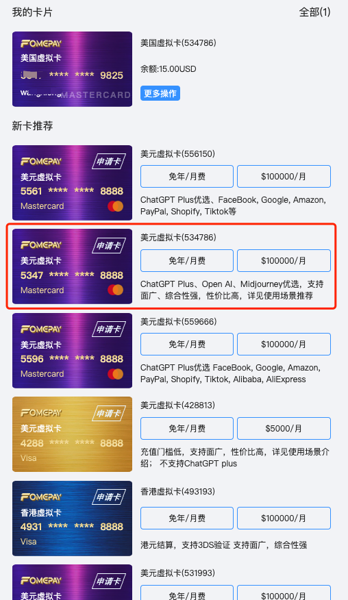
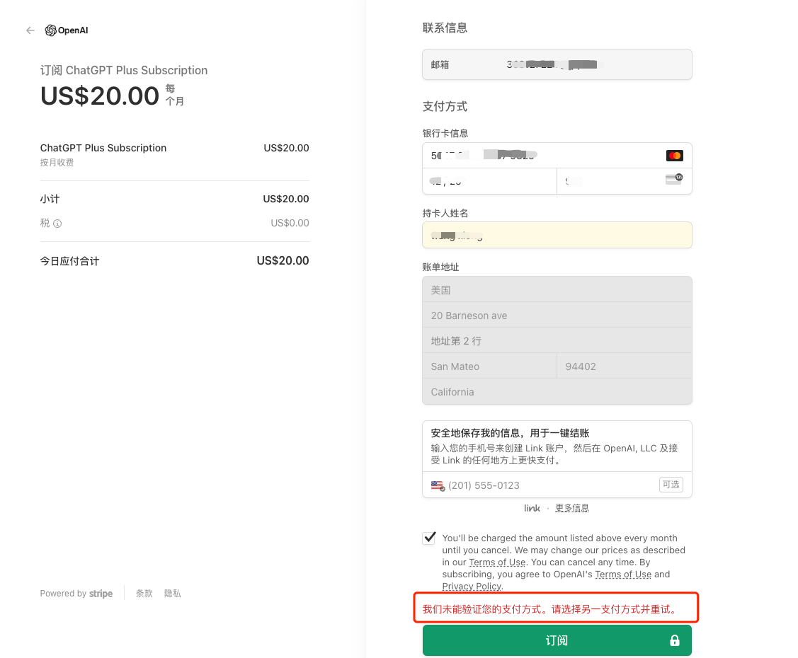


# ChatGPT4.0 订阅

## 订阅清单

1、[梯子-DuangCloud](https://portal.dc-site5.com/#/register?code=9dHaUWlM)

2、[美区信用卡-信用卡申请注册 fomepay](https://gpt.fomepay.com/)

### 申请美区信用卡

[信用卡申请注册 fomepay](https://gpt.fomepay.com/)

新卡选择：升级plus请选择5347/4866卡BIN。（例如选择534786）

支付提示：使用支付宝充值个别用户提示“请使用本人支付宝”或者点击确认跳转白屏。

解决方案：登录fomepay系统的设备和支付宝登录设备连接同一网络，且确保IP一致，即可正常支付。





注册踩坑：我们未能验证您的支付方式。请选择另一支付方式并重试。

原因：注册的加利福利亚信用卡，IP地址也为加利福利亚。

解决：咨询客户后，换成新加坡、德国、日本节点后成功。


# ChatGPT 注册

[国外接码平台 sms-activate.org 官网](https://sms-activate.org/getNumber)

[VPN-ClashX](https://github.com/yichengchen/clashX)

[VPN-ClashX 下载](https://github.com/yichengchen/clashX/releases)

[DuangCloud](https://portal.dc-site3.com/#/login)

登录`ChatGPT`报不可用 `country`:

```
OpenAI's services are not available in your country. (error=unsupported_country)
```

核心要点：

① 出站模式（全局）：全局连接

② 勾选设置为系统代理。

③ GLOBAL 海外专线。

④ 配置导入相关`DuangCloud`配置。

⑤ 浏览器系统设置代理：切换为系统代理（海外）。直接连接（国内）。

⑥ 设置为系统代理来回切换几次，还是不行就重启`ClashX`。