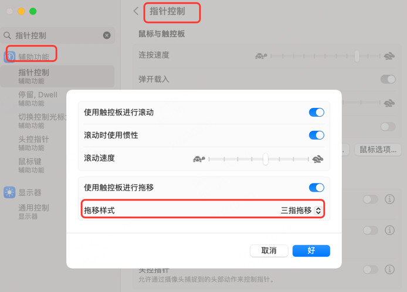

# ChatGPT

[国外接码平台 sms-activate.org 官网]https://sms-activate.org/getNumber
[VPN-ClashX](https://github.com/yichengchen/clashX)
[VPN-ClashX 下载](https://github.com/yichengchen/clashX/releases)
[DuangCloud](https://portal.dc-site3.com/#/login)
登录`ChatGPT`报不可用 `country`:
```
OpenAI's services are not available in your country. (error=unsupported_country)
```
核心要点：
① 出站模式（全局）：全局连接
② 勾选设置为系统代理。
③ GLOBAL 海外专线。
④ 配置导入相关`DuangCloud`配置。
⑤ 浏览器系统设置代理：切换为系统代理（海外）。直接连接（国内）。
⑥ 设置为系统代理来回切换几次，还是不行就重启`ClashX`。


# MAC 技巧
## 三指拖移
新版 `macOS Catalina/Big Sur`系统里面三指拖移已经被苹果从触控板中移除并把这个功能放入了辅助功能里面。
这个位置还不太好找，`mac`老手在这里也会频频翻车，这个功能开启也非常简单。

新版 mac ：系统设置 -> 辅助功能 -> 指针控制 -> 触控板选项 -> 拖移样式 -> 三指拖移



# iterm2-zmodem
解决：在 mac 下，实现与服务器进行便捷的文件上传和下载操作。

[iterm2-zmodem 文档](https://github.com/aikuyun/iterm2-zmodem)
主要过程：
```
x. rz, sz
https://github.com/aikuyun/iterm2-zmodem

> sz 下载功能
服务端send

> rz 上传功能
服务端receive

服务器:
yum -y install lrzsz

客户端:
brew install lrzsz
```
主要命令：
```
git clone git@github.com:aikuyun/iterm2-zmodem.git

cd iterm2-zmodem && chmod +x iterm2-*  && sudo mkdir -p /usr/local/bin && \n
sudo cp iterm2-* /usr/local/bin && sudo ln -s /opt/homebrew/bin/rz /usr/local/bin && \n
sudo ln -s /opt/homebrew/bin/sz /usr/local/bin
```

设置 `Iterm2`的`Tirgger`特性，`profiles->default->editProfiles->Advanced`中的`Tirgger`：
添加两条`trigger`，分别设置 `Regular expression，Action，Parameters，Instant`如下：

① 第一条
```
Regular expression: rz waiting to receive.\*\*B0100
Action: Run Silent Coprocess
Parameters: /usr/local/bin/iterm2-send-zmodem.sh
Instant: checked
```
② 第二条
```
Regular expression: \*\*B00000000000000
Action: Run Silent Coprocess
Parameters: /usr/local/bin/iterm2-recv-zmodem.sh
Instant: checked
```


# Github Add SSH keys

问题：Git 当前项目设置 用户名、邮箱。
```
➜  git config --list
➜  git config user.name "xxxx"
➜  git config user.email "xxx@gmail.com"
```


问题：`Github`上添加了`ssh key`，但是在`push`代码的时候还会要求我们输入用户名密码?

其中一种可能的原因是，在克隆代码的时候，使用了`https`协议，而不是`git`协议。

`https`协议要求你每次都需要输入用户名以及密码，自由`git`协议才可以使用`ssh-key`文件。

```
➜ git remote -v
origin  https://github.com/LensXiong/TechDoc.git (fetch)
origin  https://github.com/LensXiong/TechDoc.git (push)
➜ git remote set-url origin git@github.com:LensXiong/TechDoc.git
➜ git remote -v                                                 
origin  git@github.com:LensXiong/TechDoc.git (fetch)
origin  git@github.com:LensXiong/TechDoc.git (push)
```

# macOS Zsh 使用 oh-my-zsh 打造高效便捷的 shell 环境

[macOS Zsh 使用 oh-my-zsh 打造高效便捷的 shell 环境](https://sysin.org/blog/macos-zsh/)

## zsh-autosuggestions

作用是根据历史输入命令的记录即时的提示（建议补全），然后按 → 键即可补全。

```
git clone --depth=1 https://github.com/zsh-users/zsh-autosuggestions.git ${ZSH_CUSTOM:-${ZSH:-~/.oh-my-zsh}/custom}/plugins/zsh-autosuggestions
```
编辑 `~/.zshrc`，找到 `plugins=(git)` 这一行，修改为：
```
plugins=(
    git
    # other plugins...
    zsh-autosuggestions
)
```

# docker-compose network_mode=“host”

问题：`docker-compose` 中 `network_mode=“host”` 外网访问不了。

原因：`docker` 默认的 `network`是`bridge`，这个默认会把映射的端口加到宿主机防火墙。而`host`模式是不会主动加入防火墙的，所以需要添加端口。

解决：
```
# 开放指定端口
firewall-cmd --zone=public --add-port=9203/tcp --permanent
# 重启防火墙
firewall-cmd --reload
```