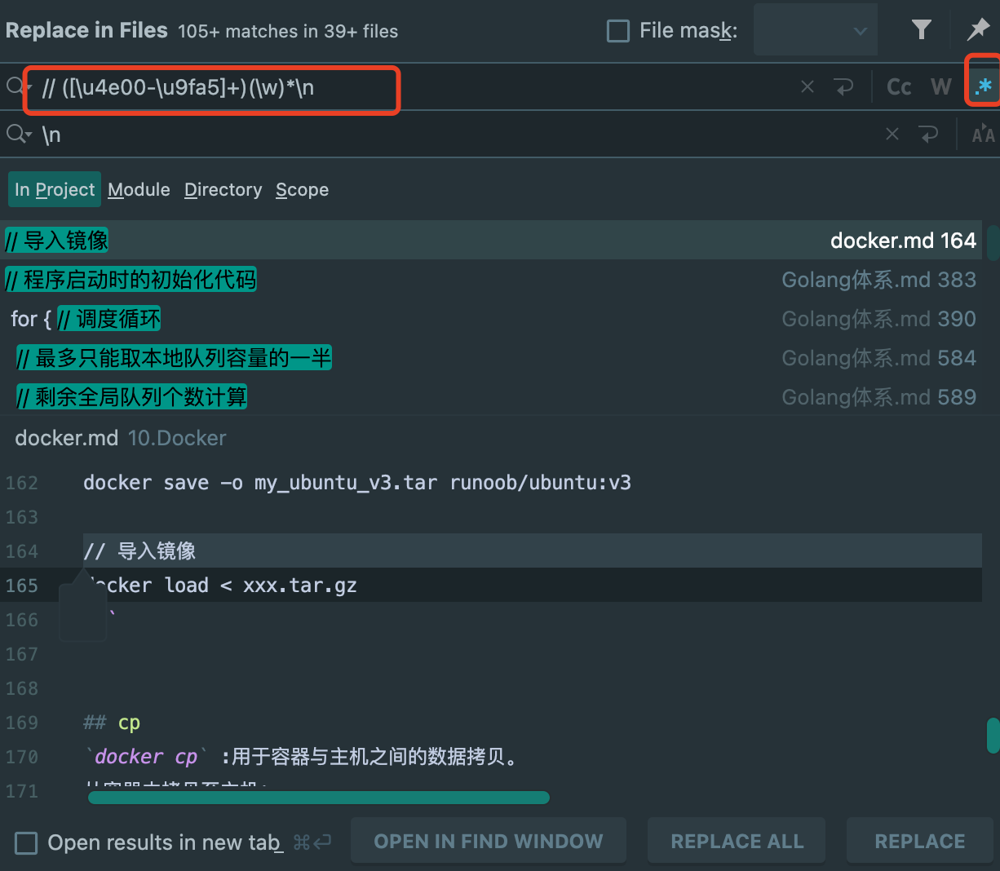
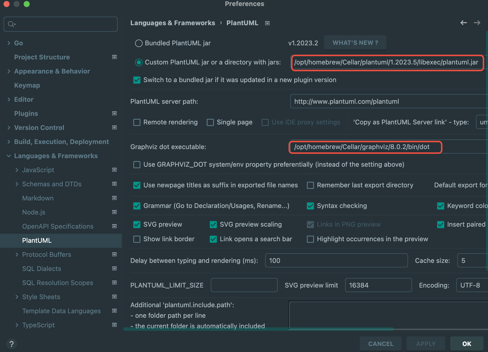
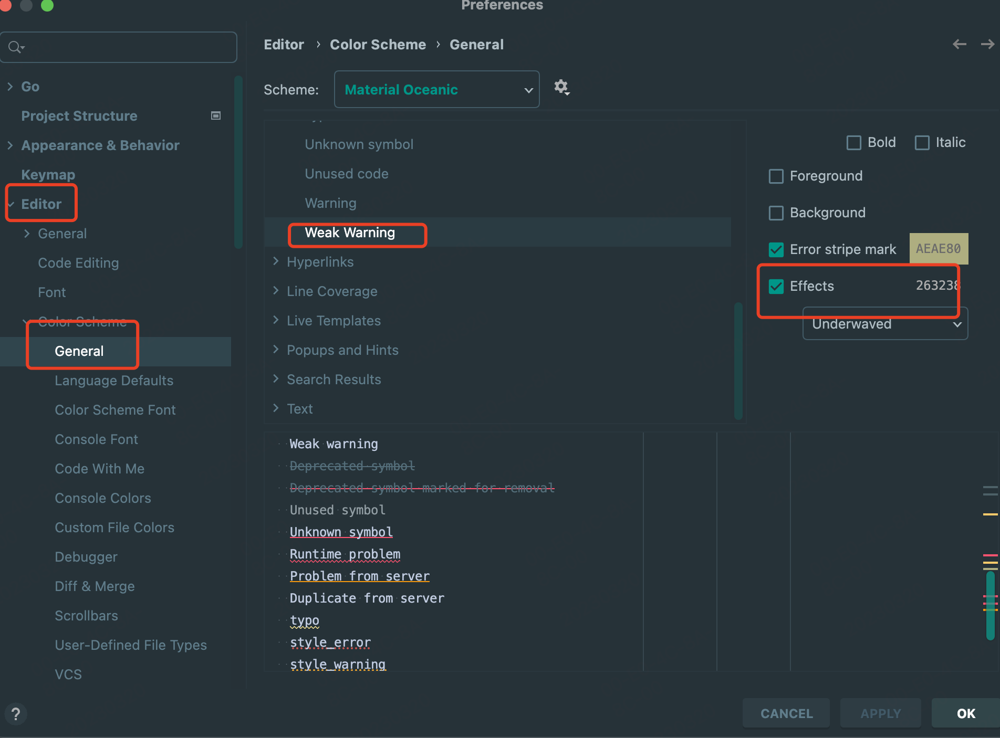
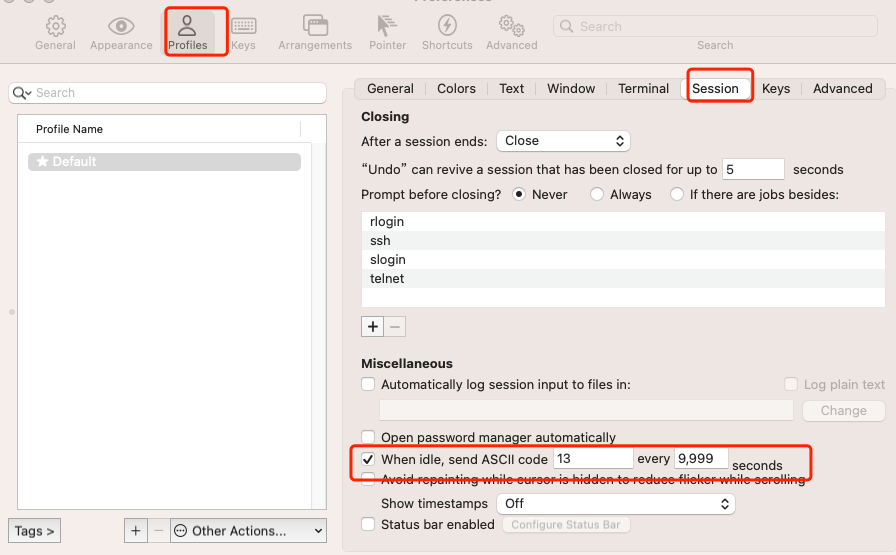
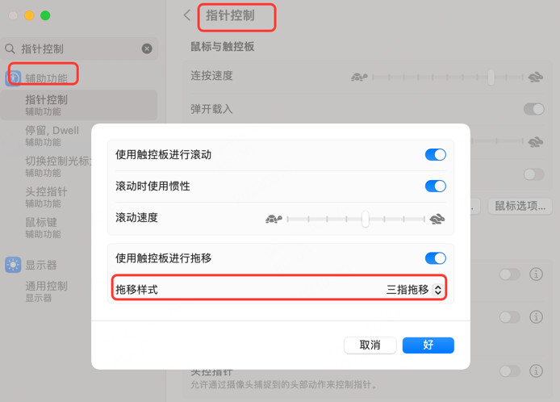
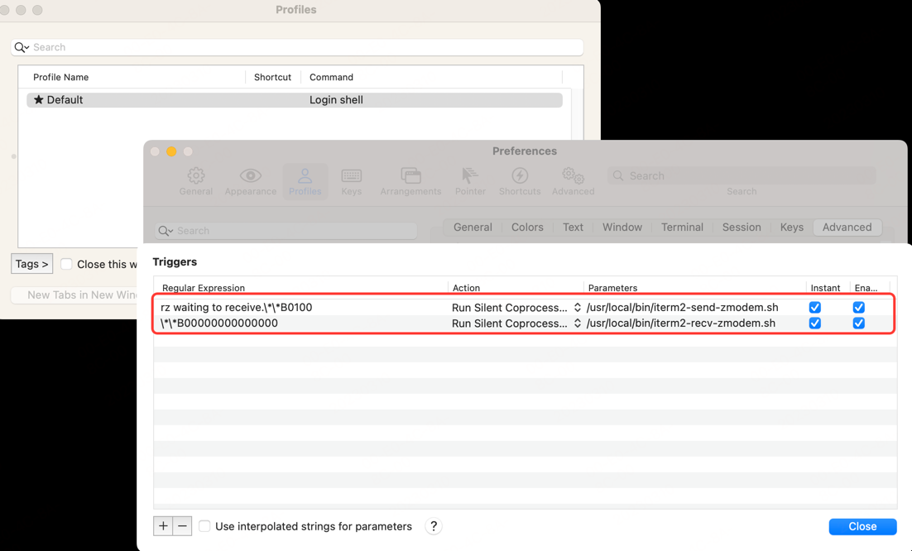

# MySQL错误-this is incompatible with sql_mode=only_full_group_by完美解决方案

[MySQL错误-this is incompatible with sql_mode=only_full_group_by完美解决方案](https://blog.csdn.net/u012660464/article/details/113977173)

```
Error 1055: Expression #1 of ORDER BY clause is not in GROUP BY clause and contains nonaggregated column 'xx_xxx.xxxx.create_time'
which is not functionally dependent on columns in GROUP BY clause; 
this is incompatible with sql_mode=only_full_group_by
```

临时解决方案：

```
SET @@global.sql_mode ='STRICT_TRANS_TABLES,NO_ZERO_IN_DATE,NO_ZERO_DATE,ERROR_FOR_DIVISION_BY_ZERO,NO_ENGINE_SUBSTITUTION';
```

永久解决方案：

```

```

# 什么是TDP设计，如何看CPU性能，i7-13700H 与 i7-13700T 有什么区别？

## TDP

TDP（Thermal Design Power，热设计功耗）： TDP是一个用来描述处理器在最大负载下产生的热量和所需的散热能力的指标。
TDP通常以瓦特（W）为单位表示，这是处理器在工作时所消耗的能量。
处理器的实际功耗可以在不同的负载情况下有所变化，但TDP是设计冷却解决方案和散热器的参考值。

TDP（热设计功耗）： 根据型号中的字母 "T" 和 "H"，通常 "T" 型号表示低功耗版本，而 "H" 型号表示高性能版本。
因此，"i7-13700T" 可能具有较低的TDP，适用于需要节能的场景，而 "i7-13700H" 可能具有较高的TDP，适用于要求更高性能的任务。

1、时钟频率： "H" 型号通常会在时钟频率上提供更高的性能，但这并不是唯一的区别。高性能型号可能在时钟频率上略有不同。

2、核心/线程数： 这两个型号可能在核心数和线程数方面有所不同，其中一个可能具有更多的核心和线程，从而提供更好的多任务处理能力。

3、集成显卡： 如果这两个型号都有集成显卡，它们的性能和规格可能有所不同。"H" 型号可能会更加关注性能，因此其集成显卡性能可能会更高。

4、适用场景： 由于 "T" 型号注重低功耗，适用于节能环境，而 "H" 型号注重高性能，适用于需要更大计算能力的任务，因此适用场景可能有所不同。

5、扩展性： 高性能型号可能具有更高的扩展性，支持更多的外设和功能，适用于需要更多I/O 需求的应用。

## i7-13700H 与 i7-13700T

i7-13700H 与 i7-13700T 区别： 这两个型号可能代表Intel Core i7的不同变体，可能具有以下差异：

性能： 通常情况下，H型号（如i7-13700H）可能会具有更高的时钟频率、更多的核心和线程，以实现更高的计算性能。
T型号（如i7-13700T）则可能以降低的时钟频率和功耗为代价，追求更好的节能性能。

功耗和散热： H型号可能具有较高的TDP，需要更强大的散热解决方案来处理产生的热量。
T型号通常具有更低的TDP，适合于对电池寿命和散热要求较高的移动设备。

适用场景： H型号适合于需要高性能的任务，如游戏、视频编辑和其他计算密集型工作。
T型号适用于更注重电池寿命、轻负载任务和节能需求的场景。

## CPU性能

CPU性能衡量： 评估CPU性能需要考虑多个因素，包括核心数、线程数、时钟频率、架构、缓存等。
性能的衡量因素因任务而异，例如多任务处理、单线程应用、游戏等都会受不同的因素影响。

核心数量和线程数： 虽然核心数量并不是唯一的衡量标准，但对于多线程任务，更多的核心和线程通常可以提供更好的性能。
考虑到你的应用是否能够充分利用多核心。

1、主频和睿频： 主频是CPU的基本工作频率，而睿频是在负载较轻时可以自动提升的频率。较高的主频和睿频可以提升单线程性能。

2、缓存大小和层次： 缓存大小和层次结构会影响数据访问速度。更大的缓存可以提高访问效率，尤其是对于频繁访问的数据。

3、架构： 不同的CPU架构会影响性能和能效。一些新的架构可能具有更好的指令集、内存管理和运算效率。

4、单线程性能和多线程性能： 考虑你的使用情景，如果应用更多地依赖于单一线程性能，那么高的单线程性能可能更重要。

5、功耗和散热： 高性能的CPU通常会消耗更多的功耗，因此在选择时要考虑电脑的散热能力和功耗限制。

6、厂商和代代产品： 不同厂商（如Intel、AMD）的CPU性能和架构有所不同。同一厂商不同代代产品之间也会有差异。

7、基准测试和评测： 参考基准测试和独立评测可以提供有关CPU性能的客观数据。一些常见的基准测试包括Cinebench、Geekbench、PassMark等。

8、应用需求： 最重要的是，选择CPU要考虑你的实际应用需求。如果你主要进行游戏、图形设计、视频编辑等任务，那么你可能需要不同类型的性能。

9、未来可升级性： 考虑CPU是否适合未来的需求，是否可以轻松升级。

# terminal prompts disabled

问题：
运行 go mod tidy 时候报错：
致命错误：could not read Username for 'https://github.com': terminal prompts disabled.

解决：

配置全局用户名和邮箱地址：
打开终端，运行以下命令来配置全局的用户名和邮箱地址，这样 Git 就可以在没有终端提示的情况下使用它们：

```
git init
git config --global user.name "YourUsername"
git config --global user.email "youremail@example.com"
```

为当前项目设置特定的用户名和邮箱地址，可以在项目目录下使用以下命令来配置：

```
git init
git config user.name "YourUsername"
git config user.email "youremail@example.com"
```

# 添加认证

* 复制公钥到认证文件中
  普通用户：

```
vim /home/xxxx/.ssh/authorized_keys 
```

root用户：

```
vim /root/.ssh/authorized_keys
```

* 设置文件访问权限

sshd为了安全，对属主的目录和文件权限有所要求。如果权限不对，则ssh的免密码登陆不生效。

```
chmod 700 /home/xxx/ 
chmod 700 /home/xxxx/.ssh 
chmod 600 /home/xxxx/.ssh/authorized_keys
```

* 配置sshd

确认远程服务器的sshd配置中允许免密登录、 查看远程服务器的`/etc/ssh/sshd_config` 文件，使用命令：
`sudo vim /etc/ssh/sshd_config`

```
// 去掉以下2行的 “#” 注释：
PubkeyAuthentication yes 
AuthorizedKeysFile .ssh/authorized_keys 
// 如果是CentOS7.4以下的系统，还需要放开RSAAuthentication的设置
RSAAuthentication yes 
// 如果想要使用root账户认证登录，还需要放开PermitRootLogin的设置
PermitRootLogin yes
```

* 必要时重启sshd服务

```
sudo systemctl restart sshd
```

# goland编辑器中正则替换

在goland编辑器中使用正则替换注释内容。

注释的正则：`// ([\u4e00-\u9fa5]+)(\w)*\n`


# 在 Ubuntu 上配置本地使用域名

* 打开终端：在Ubuntu上打开终端应用程序。

* 编辑hosts文件：输入以下命令以使用文本编辑器打开hosts文件：

```
sudo vim /etc/hosts
```

这将使用sudo权限打开hosts文件，输入管理员密码以进行授权。

* 添加域名映射：在打开的hosts文件中，可以看到已有的条目，每个条目都包含一个IP地址和相关的主机名。在文件的最后，可以添加自定义的域名映射。每行的格式为：

```
<IP地址>   <域名>
```

例如，如果想将域名example.com映射到本地IP地址127.0.0.1，则可以添加以下行：

```
127.0.0.1   example.com
```

可以根据需要添加多个域名映射，每行一个。

* 保存并关闭文件：在编辑完hosts文件后，关闭编辑器。

* 刷新DNS缓存：为了使修改生效，需要刷新DNS缓存。在终端中，输入以下命令刷新DNS缓存：

```
sudo systemctl restart systemd-resolved
```

这将重新启动系统的DNS解析服务。

现在，可以在Ubuntu本地系统中使用您配置的域名，它们将被解析为指定的IP地址。
例如，在浏览器中输入http://example.com将访问到本地的IP地址。

请注意，修改hosts文件只会在本地系统中生效，对于其他计算机或设备，需要在其各自的hosts文件中进行相应的配置。
此外，如果使用的是本地开发服务器（如Apache或Nginx），还需要相应地配置虚拟主机和服务器设置以匹配您的域名。

# Linux Md5sum 和Macos Md5

md5sum是一个常用的命令行工具，用于计算文件的MD5哈希值。
MD5（Message Digest Algorithm 5）是一种广泛使用的哈希函数，用于对数据进行唯一标识和校验。
md5sum命令通过对文件内容应用MD5算法，生成一个128位的哈希值，用于验证文件的完整性或进行数据比较。

```
md5sum ./xxx.tar.gz
ec612504a09830ea7a0f26e44cf86991 ./xxx.tar.gz
```

在macOS中，可以使用md5命令来计算文件的MD5哈希值，它在功能上与md5sum命令类似。

```
md5 ./xxx.tar.gz
ec612504a09830ea7a0f26e44cf86991 ./xxx.tar.gz
```

与md5sum命令类似，通过比较两个文件的MD5哈希值，可以验证这两个文件是否相同。
如果两个文件的哈希值相同，则可以高度确信它们的内容相同。
如果哈希值不同，则可以确定文件在传输或存储过程中发生了改变或损坏。

# tar 在 OS和 Linux 上的不兼容

出现问题：`Linux / OS X tar incompatibility – tarballs created on OS X give errors when untarred in Linux`
解决办法：

```
xxx@xxx: brew install gnu-tar
xxx@xxx: which gtar
xxx@xxx: mv /opt/homebrew/bin/gtar /opt/homebrew/bin/tar
xxx@xxx: tar --exclude xxxx/.git -zcvf xxxx.tar.gz xxxx
```

```
xxx@xxx: tar --version
tar (GNU tar) 1.34
Copyright (C) 2021 Free Software Foundation, Inc.
License GPLv3+: GNU GPL version 3 or later <https://gnu.org/licenses/gpl.html>.
This is free software: you are free to change and redistribute it.
There is NO WARRANTY, to the extent permitted by law.
```

问题原因：
在 Linux 和 macOS 操作系统之间，有时会出现 tar 文件不兼容的情况。
当在 macOS 上创建的 tarball（tar文件）尝试在 Linux 上解压缩时，可能会出现错误。
这是由于默认情况下，macOS 上的 tar 命令与 Linux 上的 tar 命令在一些参数和标志的处理上存在差异。

主要的差异点包括：

* tar命令选项：
  macOS上的tar命令使用-z选项来指示对gzip压缩的tarball进行解压缩，而Linux上的tar命令使用-z选项来指示对gzip压缩的tarball进行创建。因此，当您在macOS上使用-z选项创建tarball后，尝试在Linux上使用相同选项进行解压缩时，会出现错误。

* 文件名编码：macOS使用HFS+文件系统，默认使用的是Unicode NFD（Normalization Form
  D）编码，而Linux使用的是UTF-8编码。这可能导致在Linux上解压缩时，文件名的字符编码不一致，从而出现错误或乱码。

为了解决这些兼容性问题，可以采取以下几种方法：

* 在macOS上创建tarball时，避免使用特定于Linux的tar选项。例如，不要使用-z选项来创建gzip压缩的tarball。

* 在Linux上解压缩tarball时，指定正确的选项和标志以匹配tarball的创建方式。例如，使用-xzf选项来解压缩gzip压缩的tarball。

* 在创建和解压缩tarball时，使用跨平台的tar工具，例如GNU tar（通常称为gtar）或BSD tar（通常称为bsdtar）。这些工具在不同操作系统之间提供更一致的行为。

* 在macOS上创建tarball时，确保文件名使用的是UTF-8编码。这可以通过在终端中设置LANG环境变量来实现，例如：

```
export LANG=en_US.UTF-8
```

# goland 安装 plantuml 过程

* brew install graphviz
* brew install plantuml
* GoLand 中配置 PlantUML settings 路径
* GoLand 中配置 Graphviz settings 路径

在 `GoLand` 中配置 `Graphviz` 路径：

```
a. 打开 GoLand 并转到 File > Settings > Languages & Frameworks > Diagrams > PlantUML。
b. 在 "PlantUML settings" 部分，找到 "Path to plantuml.jar" 字段，然后输入 plantuml.jar 的路径。
c. 在 "Graphviz settings" 部分，找到 "Path to Graphviz dot executable" 字段，然后输入 dot 可执行文件的路径。
d. 单击 "Apply" 或 "OK" 以保存更改并关闭设置窗口。
```



# frpc

# MAC 下移动硬盘无法写入

当移动硬盘插入可以识别，无法写入的时候，是因为移动硬盘使用了NTFS格式而 Mac 系统原生是不支持这种格式的。
只需要把硬盘格式化为 exfat 就可以在 Mac 和 Windows 下用了。
点击启动台（LAUNCH PAD）-其他-磁盘工具，点击之后，选择你要的盘进行抹掉（慎重），成 exfat。

【Mac 挂载硬盘命令：让mac写入硬盘更轻松】https://juejin.cn/post/7148295961021054983

# 去除 goland 代码中的波浪线(黄色警告线)

搜索关键词：Weak Warning


# mac 系统终端 sudo 免输入密码技能

[mac系统终端sudo免输入密码技能get](https://www.cnblogs.com/princesong/p/10293885.html)
`/etc/sudoers` 这个文件的权限是`r/r/n`，配置之前需要加写权限。

```
sudo chmod u-w /etc/sudoers
```

添加 `NOPASSWD`：

```
sudo vi /etc/sudoers
// 将 #%admin ALL=(ALL) ALL
// 替换为 %admin ALL=(ALL) NOPASSWD: ALL
```

修改完后配置为原来的读权限：

```
sudo chmod u-w /etc/sudoers
```

# Homebrew 镜像助手

[Homebrew 镜像助手](https://brew.idayer.com/guide/change-source/)
针对首次安装换源:

```
export HOMEBREW_BREW_GIT_REMOTE="https://mirrors.ustc.edu.cn/brew.git"
export HOMEBREW_CORE_GIT_REMOTE="https://mirrors.ustc.edu.cn/homebrew-core.git"
export HOMEBREW_API_DOMAIN="https://mirrors.ustc.edu.cn/homebrew-bottles/api"
export HOMEBREW_BOTTLE_DOMAIN="https://mirrors.ustc.edu.cn/homebrew-bottles/bottles"
```

```
/bin/bash -c "$(curl -fsSL https://gitee.com/ineo6/homebrew-install/raw/master/install.sh)"
```

# SSH 客户端无法识别主机密钥类型

问题：运行 `ssh -p 2xxx xxxx@jumper.xxxx.net` 时出现 `Unable to negotiate with 10.xxx.xxx.xx port 22xx: no matching host
key type found. Their offer: ssh-rsa`。

原因：该错误表示 `SSH` 客户端无法识别主机密钥类型，是由于 `SSH` 服务器配置了旧的加密算法或不受支持的密钥类型导致的。

解决：
① `SSH` 目录的权限
用户目录下的 `~/Users/xxxx/.ssh`目录以及下面的文件需要特别小心的管理其权限，

整个 `~/.ssh` 目录需要设置 700 `(drwx------)` 权限
`public key` 需要设置 `644(-rw-r--r--)`
客户端的私钥需要设置 600 `(-rw-------)`
需要保证该目录不会被其他 `group` 的用户读取和修改。
使用 `vim ~/Users/xxxx/.ssh` 输入以下内容：

```
 # man ssh_config
 # http://einverne.github.io/post/2017/05/ssh-keep-alive.html
 # http://einverne.github.io/post/2020/07/sync-ssh-config.html
 Host *
     User git
     PubkeyAcceptedAlgorithms +ssh-rsa
     HostkeyAlgorithms +ssh-rsa
     ForwardAgent yes
     ServerAliveInterval 30
     ServerAliveCountMax 10
     TCPKeepAlive no
     ControlMaster auto
     ControlPath ~/.ssh/conn-%r@%h:%p
     ControlPersist 120h
     Compression yes
```

如上是关于 SSH 客户端的配置文件，用于定制 SSH 连接的行为和选项。以下是对每个配置参数的解释：

```
Host *: 这是一个通配符，表示适用于所有的主机。
User git: 这个参数指定连接到远程主机时使用的用户名。
PubkeyAcceptedAlgorithms +ssh-rsa 和 HostkeyAlgorithms +ssh-rsa: 这两个参数指定使用 ssh-rsa 算法进行密钥认证和主机密钥验证。
ForwardAgent yes: 这个参数启用SSH代理转发功能，可以在连接到远程主机后让 SSH 客户端继续代理您的认证信息。
ServerAliveInterval 30: 这个参数指定发送保活消息的时间间隔，以确保连接保持活动状态。
ServerAliveCountMax 10: 这个参数指定发送保活消息后，如果没有收到任何响应，则尝试重新连接的次数。
TCPKeepAlive no: 这个参数指定是否启用 TCP keepalive 功能。
在SSH连接中，由于 SSH 协议本身已经包含了保活功能，因此建议禁用 TCP keepalive 功能，以避免不必要的流量和 CPU 开销。
ControlMaster auto: 这个参数指定是否使用 SSH 主控模式，可以让 SSH 客户端复用现有的连接，从而加速 SSH 连接的建立和执行。
ControlPath ~/.ssh/conn-%r@%h:%p: 这个参数指定主控模式下，用于保存控制连接的 Unix socket文件路径。
ControlPersist 120h: 这个参数指定主控模式下，控制连接的持续时间。在指定时间内，如果没有任何活动，则保持连接打开状态。
Compression yes: 这个参数指定是否启用数据压缩功能。在网络带宽受限的情况下，启用数据压缩功能可以提高 SSH 连接的效率。
```

配置 `iterm session`:



# 去掉 vim 每行结尾的 ^M

有时候用 `vim` 打开文件，每行结尾都有一个灰色的`^M`。
这个原因是该文件在 `windows` 或 `mac` 系统上被创建：

`windows` 的换行符是`\n\r`；
`mac` 的换行符是 `\r`；
`unix` 下的文本换行只需要`\n`。
在`vim`下，这个多余的`\r`就被显示为`^M`，虽然显示为两个字符，但其实是一个字符。

大多数情况下，打开这种文件，`vim`的状态栏会显示文件格式：`utf-8[dos]`或者`utf-8[mac]`，此时只需要下面命令可转为`unix`
格式，即可删除或转换所有的`^M`:

```
:set ff=unix
```

如果`vim`显示文件格式已经是`utf-8[unix]`，这时候上述命令就不管用了，说明 `vim` 识别类型错误，可以先把它纠正（即用`dos`
或`mac`格式打开当前文件），再变更类型：

```
:e ++ff=dos
# or
# :e ++ff=mac
:set ff=unix
```

还有一种方法是字符串替换：

```
:%s/\r//g
```

注意这里是用`\r`而不是`^M`，这也是很多人不会删除`^M`的原因。

# ChatGPT

[国外接码平台 sms-activate.org 官网]https://sms-activate.org/getNumber

[VPN-ClashX](https://github.com/yichengchen/clashX)

[VPN-ClashX 下载](https://github.com/yichengchen/clashX/releases)

[DuangCloud](https://portal.dc-site3.com/#/login)

登录`ChatGPT`报不可用 `country`:

```
OpenAI's services are not available in your country. (error=unsupported_country)
```

核心要点：

① 出站模式（全局）：全局连接

② 勾选设置为系统代理。

③ GLOBAL 海外专线。

④ 配置导入相关`DuangCloud`配置。

⑤ 浏览器系统设置代理：切换为系统代理（海外）。直接连接（国内）。

⑥ 设置为系统代理来回切换几次，还是不行就重启`ClashX`。

# MAC 技巧

## 三指拖移

新版 `macOS Catalina/Big Sur`系统里面三指拖移已经被苹果从触控板中移除并把这个功能放入了辅助功能里面。
这个位置还不太好找，`mac`老手在这里也会频频翻车，这个功能开启也非常简单。

新版 mac ：系统设置 -> 辅助功能 -> 指针控制 -> 触控板选项 -> 拖移样式 -> 三指拖移



# iterm2-zmodem

解决：在 mac 下，实现与服务器进行便捷的文件上传和下载操作。

[iterm2-zmodem 文档](https://github.com/aikuyun/iterm2-zmodem)
主要过程：

```
x. rz, sz
https://github.com/aikuyun/iterm2-zmodem

> sz 下载功能
服务端send

> rz 上传功能
服务端receive

服务器:
yum -y install lrzsz

客户端:
brew install lrzsz
```

主要命令：

```
git clone git@github.com:aikuyun/iterm2-zmodem.git

cd iterm2-zmodem && chmod +x iterm2-*  && sudo mkdir -p /usr/local/bin && \n
sudo cp iterm2-* /usr/local/bin && sudo ln -s /opt/homebrew/bin/rz /usr/local/bin && \n
sudo ln -s /opt/homebrew/bin/sz /usr/local/bin
```

设置 `Iterm2`的`Tirgger`特性，`profiles->default->editProfiles->Advanced`中的`Tirgger`：
添加两条`trigger`，分别设置 `Regular expression，Action，Parameters，Instant`如下：

① 第一条

```
Regular expression: rz waiting to receive.\*\*B0100
Action: Run Silent Coprocess
Parameters: /usr/local/bin/iterm2-send-zmodem.sh
Instant: checked
```

② 第二条

```
Regular expression: \*\*B00000000000000
Action: Run Silent Coprocess
Parameters: /usr/local/bin/iterm2-recv-zmodem.sh
Instant: checked
```



# Github Add SSH keys

问题：Git 当前项目设置 用户名、邮箱。

```
➜  git config --list
➜  git config user.name "xxxx"
➜  git config user.email "xxx@gmail.com"
```

问题：`Github`上添加了`ssh key`，但是在`push`代码的时候还会要求我们输入用户名密码?

其中一种可能的原因是，在克隆代码的时候，使用了`https`协议，而不是`git`协议。

`https`协议要求你每次都需要输入用户名以及密码，自由`git`协议才可以使用`ssh-key`文件。

```
➜ git remote -v
origin  https://github.com/LensXiong/TechDoc.git (fetch)
origin  https://github.com/LensXiong/TechDoc.git (push)
➜ git remote set-url origin git@github.com:LensXiong/TechDoc.git
➜ git remote -v                                                 
origin  git@github.com:LensXiong/TechDoc.git (fetch)
origin  git@github.com:LensXiong/TechDoc.git (push)
```

# macOS Zsh 使用 oh-my-zsh 打造高效便捷的 shell 环境

[macOS Zsh 使用 oh-my-zsh 打造高效便捷的 shell 环境](https://sysin.org/blog/macos-zsh/)

## zsh-autosuggestions

作用是根据历史输入命令的记录即时的提示（建议补全），然后按 → 键即可补全。

```
git clone --depth=1 https://github.com/zsh-users/zsh-autosuggestions.git ${ZSH_CUSTOM:-${ZSH:-~/.oh-my-zsh}/custom}/plugins/zsh-autosuggestions
```

编辑 `~/.zshrc`，找到 `plugins=(git)` 这一行，修改为：

```
plugins=(
    git
    # other plugins...
    zsh-autosuggestions
)
```

# docker-compose network_mode=“host”

问题：`docker-compose` 中 `network_mode=“host”` 外网访问不了。

原因：`docker` 默认的 `network`是`bridge`，这个默认会把映射的端口加到宿主机防火墙。而`host`模式是不会主动加入防火墙的，所以需要添加端口。

解决：

```
# 开放指定端口
firewall-cmd --zone=public --add-port=9203/tcp --permanent
# 重启防火墙
firewall-cmd --reload
```