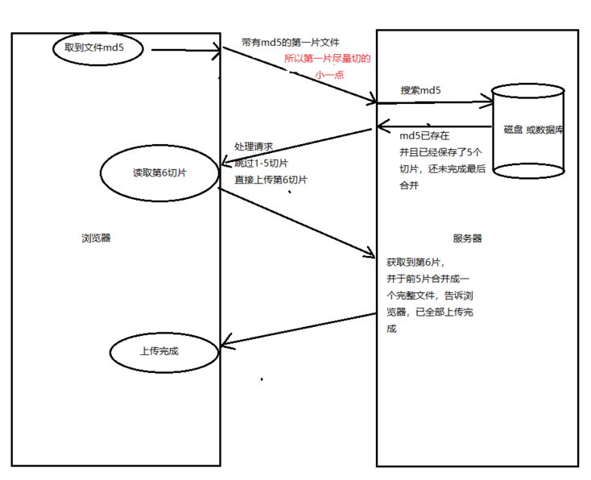

#  背景
目标：实现大文件分片上传和断点续传和下载功能。

三个重点：一是支持10GB以上的内容上传；二是支持断点续传；三是提升传输效率。

超大文件上传，一种常见的解决方案是使用分片上传（chunked upload）。这意味着将大文件分割成较小的块，逐个上传，最后在服务器端组合这些块，以恢复原始文件。

断点续传：拿到文件，保存文件唯一性标识，切割文件，分段上传，每次上传一段，根据唯一性标识判断文件上传进度，直到文件的全部片段上传完毕。

断点续传的思路：客户端（浏览器）向服务器端上传某个文件，并不断记录上传的进度，如果一旦掉线或发生其它异常，客户端可以向服务器查询某个文件已经上传的状态，从上次上传的文件位置接着上传。

## 什么是秒传
通俗的说，你把要上传的东西上传，服务器会先做MD5校验，如果服务器上有一样的东西，它就直接给你个新地址。

其实你下载的都是服务器上的同一个文件，想要不秒传，其实只要让MD5改变，就是对文件本身做一下修改（改名字不行）。

例如一个文本文件，你多加几个字，MD5就变了，就不会秒传了.

# 考虑到更多场景
* 切片上传失败怎么办
* 上传过程中刷新页面怎么办
* 如何进行并行上传
* 切片什么时候按数量切，什么时候按大小切
* 如何结合 Web Work 处理大文件上传
* 如何实现秒传