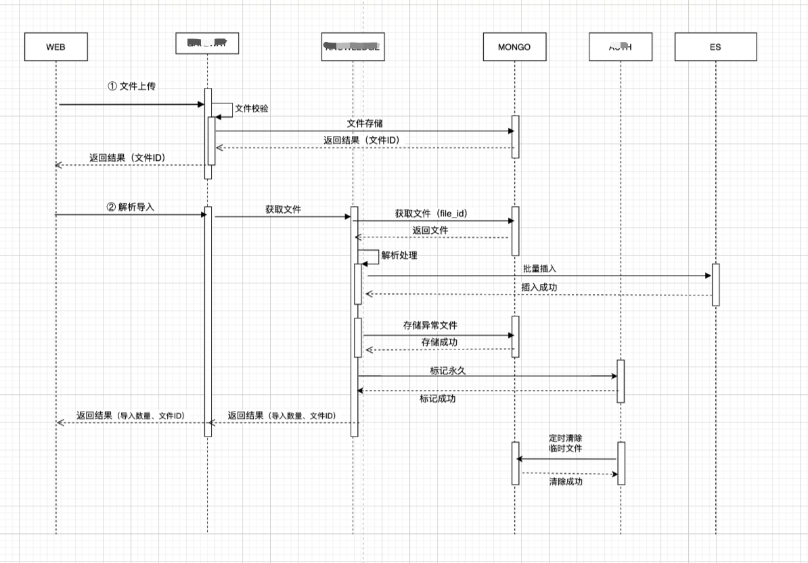

#  XML 大文件上传解析

背景：1个G以上的XML文件数据进行导入并解析，要求提高解析速度的同时显示进度百分比。
思路：

## 并发协程池
```
package routine_pool

import (
	"fmt"
	"sync"
	"sync/atomic"
)

/*
实现了一个简单的并发协程池，可以用于执行并发任务。
通过创建指定数量的工作协程，并通过通道传递任务函数，实现了任务的并发执行。
同时使用sync.WaitGroup等待组来控制协程的同步和等待，确保所有任务完成后关闭协程池。
 */

// 定义结构体RoutinePool，表示并发协程池。
type RoutinePool struct {
	// sync.WaitGroup类型，用于等待所有协程完成任务。
	wg sync.WaitGroup
	// int类型，表示协程池中的工作协程数量。
	workNum int
	// chan func()类型，是一个函数类型的通道，用于接收待执行的任务函数。
	jobChannel chan func()
	// int32类型，表示执行任务时发生异常的协程数量。
	diedWorkNum int32
}

func NewRoutinePoll(workers int) *RoutinePool {
	// 创建一个RoutinePool结构体实例p，并初始化相关字段。
	p := &RoutinePool{
		wg:          sync.WaitGroup{},
		workNum:     workers,
		diedWorkNum: 0,
		jobChannel:  make(chan func()),
	}
    // 通过p.wg.Add(p.workNum)将等待组的计数器设置为工作协程数量，表示需要等待这些协程完成任务。
	p.wg.Add(p.workNum)
	//根据指定的并发量去读取管道并执行
	for i := 0; i < p.workNum; i++ {
		go func() {
			// 每个工作协程都使用defer关键字来捕获异常，防止waitGroup阻塞。当协程发生异常时，会调用recover()函数恢复异常并进行处理
			defer func() {
				if err := recover(); err != nil {
					p.wg.Done()
					atomic.AddInt32(&p.diedWorkNum, 1)
					println(fmt.Sprintf("die work:%v, err:%v", p.diedWorkNum, err))
				}
			}()
			// 在循环中，每个协程从p.jobChannel通道中接收任务函数，并执行该函数。
			for fn := range p.jobChannel {
				fn()
			}
			// 每个协程完成任务后，调用p.wg.Done()表示完成一个任务，最终计数器会递减。
			p.wg.Done()
		}()
	}

	return p
}

// Add方法用于向协程池中添加任务。
// 它接受一个函数fn作为参数，并将该函数发送到p.jobChannel通道中，即将任务函数放入任务队列。
func (p *RoutinePool) Add(fn func()) {
	p.jobChannel <- fn
}

// Close方法用于关闭协程池。它会先关闭p.jobChannel通道，表示没有新的任务会被添加进来。
// 然后调用p.wg.Wait()等待所有工作协程完成任务，即等待等待组中的计数器归零。
func (p *RoutinePool) Close() {
	close(p.jobChannel)
	p.wg.Wait()
}
```

## 大文件上传解析(参考代码)
```
func (this *Logic) LargeFileUploadWithParse(ctx context.Context, fileId string) error {
   go func(ctx context.Context) {
      defer func() {
         // 捕获异常
         if err := recover(); err != nil {
            println(fmt.Sprintf("err:%v", err))
         }
      }()
      fileQm := service.FindLargeFileByFileIDNew(fileId)
      filePath := fileQm.String("file_path")
      defer os.Remove(filePath)
      total := GetTotalVul(filePath)
      // 创建一个缓冲容量为1的通道(chanHandel)。通道用于在协程之间传递数据，通道中的元素类型是qmap.QM。
      chanHandel := make(chan qmap.QM, 1)
      // 创建一个并发协程池(poll)。该协程池的大小为50，即最多同时执行50个协程。
      poll := routine_pool.NewRoutinePoll(50)
      // 声明一个切片(errData)用于存储错误数据。
      var errData []qmap.QM
      // 声明一个同步等待组(handWg)。等待组用于协程同步，可以防止主协程在子协程完成之前退出。
      var handWg sync.WaitGroup
      // 在等待组(handWg)中添加一个计数器，表示有一个协程需要等待。
      handWg.Add(1)
      //  创建一个qmap.QM类型的变量(redisData)，用于存储处理进度和状态的信息。
      redisData := make(qmap.QM)
      // 声明两个整型变量(handle和success)，用于统计处理的数量和成功处理的数量。
      var handle, success int
      // 创建一个匿名的goroutine，其中的逻辑会在后台异步执行。
      // 匿名goroutine使用通道(chanHandel)和总数量(total)作为参数。
      go func(c chan qmap.QM, total int) {
         defer func() {
            // 在匿名goroutine内部使用defer和recover来捕获可能发生的异常并处理。
            // 如果发生异常，会通过recover捕获错误，并调用handWg.Done()表示等待组中的计数器减少1。
            if err := recover(); err != nil {
               handWg.Done()
            }
         }()
         //  使用range循环从通道(chanHandel)中读取数据，直到通道关闭。每次循环读取一个元素(qm)。
         for qm := range chanHandel {
            handle += 1
            if qm.Int("code") == 1 {
               success += 1
            } else {
               errData = append(errData, qm)
            }
            // 检查已处理的数量(handle)是否是100的倍数。
            // 如果是，表示已处理了100个数据，更新redisData中的信息，并将信息写入到redis缓存中。
            if handle%100 == 0 {
               redisData["success"] = success
               redisData["handled"] = handle
               redisData["total"] = total
               redisData["file_id"] = ""
               redisData["status"] = 0
               parseSchedule := redisData.ToString()
               service.CacheSetString(fileId, parseSchedule)
            }
         }
         // 调用等待组(handWg)的Done()方法，表示一个协程已完成。
         handWg.Done()
      }(chanHandel, total)

      xmlFile, _ := os.Open(filePath)
      // 使用defer语句在函数执行完毕后关闭文件。确保在代码块结束时关闭文件，以避免资源泄漏。
      defer xmlFile.Close()
      // 创建一个XML解码器(decoder)，它从一个io.Reader对象(xmlFile)读取XML数据。解码器用于逐个读取XML文档中的令牌(token)。
      decoder := xml.NewDecoder(xmlFile)
      var inElement string
      // 循环连续读取XML文档中的令牌
      for {
         // 使用解码器(decoder)的Token()方法来读取下一个令牌(token)。返回的令牌类型是xml.Token。
         t, _ := decoder.Token()
         // 检查读取到的令牌是否为空。如果为空，说明已经读取完了整个XML文档，跳出循环。
         if t == nil {
            break
         }
         // 使用switch语句根据读取到的令牌类型进行不同的处理。在这里，令牌类型是xml.StartElement，表示一个XML元素的开始标签。
         switch se := t.(type) {
         case xml.StartElement:
            // 将当前开始标签的名称赋值给inElement变量，以便后续的处理。
            inElement = se.Name.Local
            // 检查开始标签的名称是否为"entry"。如果是，说明我们需要处理这个元素。
            if inElement == "entry" {
               // 创建一个Page类型的变量p，用于存储解码后的XML数据。
               var p Note
               // 使用解码器的DecodeElement()方法将后续的XML数据解码到变量p中。
               // 该方法会将XML数据填充到p的字段中，根据XML的结构进行匹配。
               decoder.DecodeElement(&p, &se)
               // 创建一个匿名函数job，它返回一个函数。
               // 该函数会将p作为参数传递给BulkUpsert函数，并在函数内部处理可能发生的异常。
               job := func(p Note) func() {
                  return func() {
                     defer func() {
                        // 在函数内部处理可能发生的异常。
                        if err := recover(); err != nil {
                           chanQm := qmap.QM{"code": 0, "err_info": fmt.Sprintf("err:%v", err), "xxx_id": p.xxx_id}
                           chanHandel <- chanQm
                        }
                     }()
                     this.BulkUpsert(ctx, p, chanHandel)
                  }
               }
               // 将job(p)函数添加到并发协程池poll中，以便后续异步处理。
               poll.Add(job(p))
            }
         default:
         }
      }
      poll.Close()
      close(chanHandel)
      handWg.Wait()
   }(ctx)
   return nil
}
```

