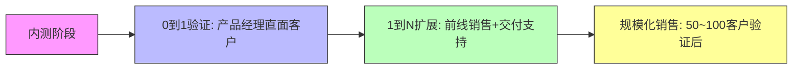
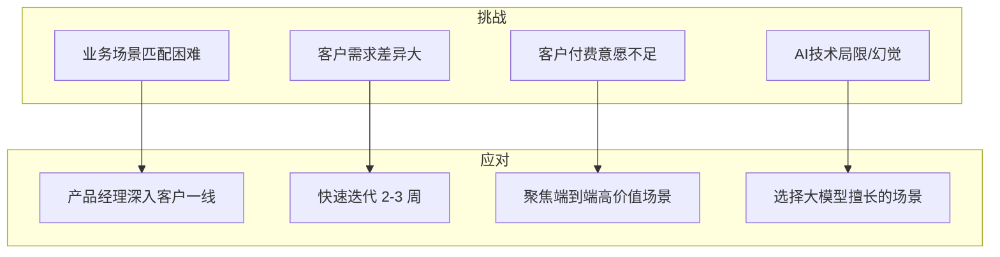
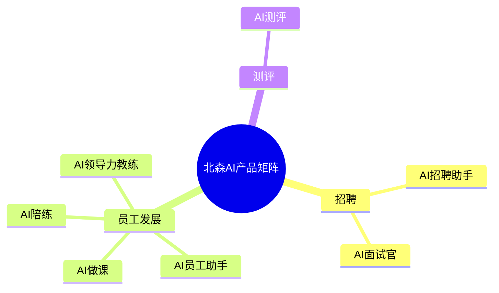
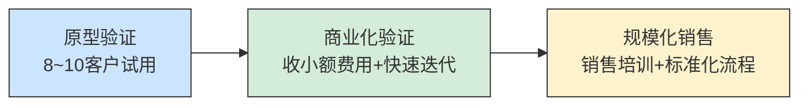


# AI 落地启示：ToB 产品交付的核心不是技术，而是业务穿透










```mermaid
%% 4. 成功关键要素（金字塔）
graph TD
    A[行业 Know-how<br>(专家经验, 提示词工程, 场景深度)] --> B[以客户为中心<br>(业务场景, 快速迭代)]
    B --> C[大模型通用能力<br>(NLP, 理解能力)]

    style A fill:#ffcccc,stroke:#333,stroke-width:1px
    style B fill:#ccffcc,stroke:#333,stroke-width:1px
    style C fill:#ccccff,stroke:#333,stroke-width:1px
```


