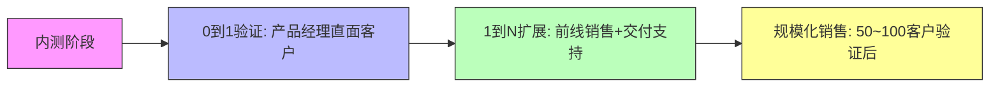
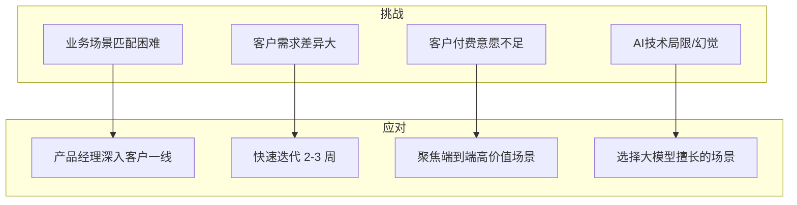
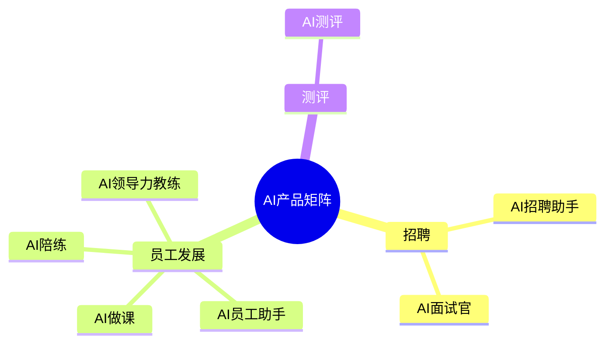
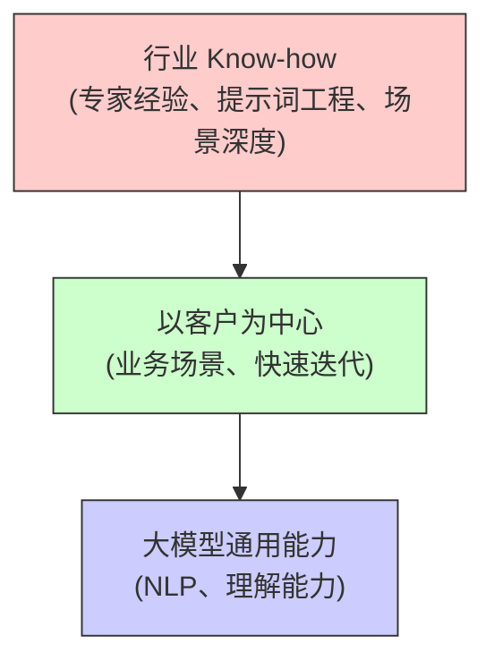
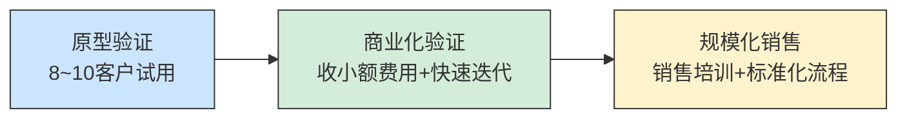


# AI 落地启示：ToB 产品交付的核心不是技术，而是业务穿透
真正的门槛：

> 第一，理解客户的业务场景是很难的，每个客户都有很多需求，只有客户够多，才能知道哪些是共性需求。所以，第一大挑战，是以客户为中心理解客户业务； 
> 第二，无论什么产品，都要融入行业 Know-how ，对行业 Know-how 的理解是产品成功的另一个关键。在这个过程中，代码技术和大模型反而显得不太关键。


```
做 AI 产品的落地启示：
1. 场景验证：内测成功 ≠ 市场成功。产品经理必须亲自到一线完成首批交付，用真实业务数据验证价值，2–3 周一个迭代闭环。
2. 产品形态：优先做成“可独立售卖”的端到端 Agent，而不是给现有系统加 AI 功能；否则难定价、难衡量 ROI。
3. 业务穿透 > 技术：50% 以上的工作量是沉淀行业 know-how（流程、规则、话术、评分标准等），把专家经验转成可复用的提示词或知识库。
4. 数据飞轮：上线前就要设计“用户反馈 → 数据回流 → 模型微调/提示词优化”的机制，让产品随客户使用越用越准。
5. 0→1→N 的三阶段节奏：  
   • 0→1：产品经理=销售=交付，确保场景真正可用。  
   • 1→N：小范围复制（数十家客户），验证价格、交付成本、客户成功指标。  
   • 规模化：再交由专职销售和客户成功团队扩张。
6. 交付团队升级：传统实施顾问搞不定 AI；需要“领域专家 + AI 能力”的复合角色，能把业务语言翻译成提示词、评测标准。
7. 客户自定义趋势：最终客户会要求自行配置知识文档、流程、评分权重。产品设计必须预留低代码/零代码的自定义层，同时控制实施复杂度。
8. 时间与耐心：一个可规模化的 AI Agent，从 demo 到真正可卖，平均需要 12 个月；提前把 Roadmap、预算、团队心理预期对齐。
9. 技术幻觉提醒：忘掉炫技，回到 KPI。衡量指标只能是“帮客户省多少人力、提多少转化率、降多少成本”，而不是模型指标。
10. 销售节奏：产品未成熟前不要大规模推向销售团队；否则过度承诺、交付失败、口碑翻车。
```

AI 产品上线第一仗，从内测到客户交付的那些坑：

* 第一，AI 产品在从 0 到 1 阶段，最大的挑战是难以有效匹配客户业务场景，因此 AI 产品经理应当在一线围绕客户业务场景做产品，并根据客户需求快速迭代；

* 第二，AI 产品成功的关键是以客户为中心理解客户业务，以及将行业 Know-how 融入产品；

* 第三，AI Agent 最终会走向客户的自定义，未来客户化工作将可能较重；

* 第四，在 AI 产品的打磨中，耐心非常重要，要确保产品成熟后再进行规模化销售。












