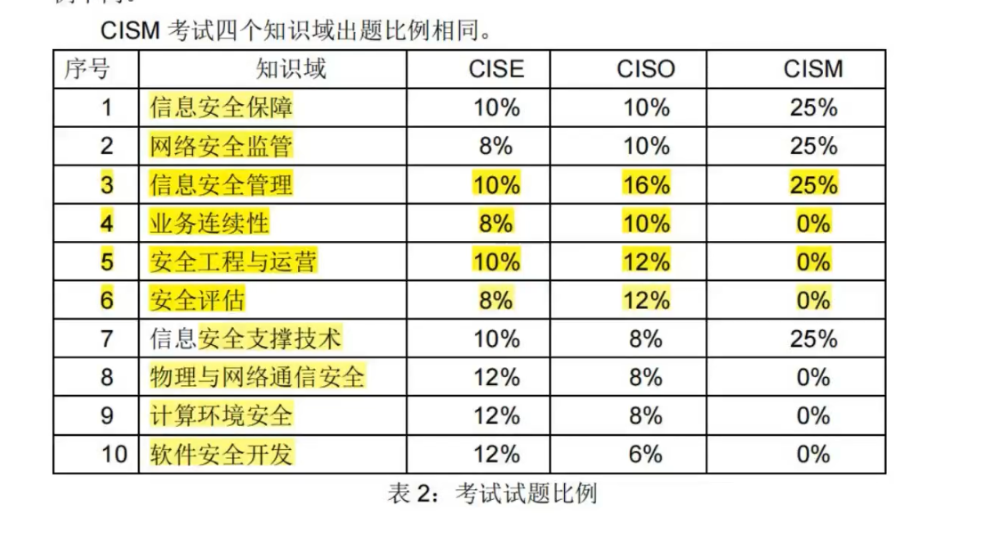


# 理解域

* 7层网络协议的记忆快速口诀是：物-数-网-传-会-表-应。 这代表了OSI（开放系统互联）模型的七个层级，分别是物理层、数据链路层、网络层、传输层、会话层、表示层和应用层。
* 用户对鉴别信息的操作通常是通过本地安全授权机构（Local Security Authority, LSA）来实现，而不是通过一个以Administrator权限运行的服务“Security Accounts Manager”来完成。 Security Accounts Manager（SAM）是负责管理本地用户和组的数据库，但具体的鉴别操作通常由 LSA 处理。
* 计算机系统安全保护等级划分思想在1994-1999年间提出，等级保护工作试点在2002-2006年进行，等级保护相关政策文件在2004-2009年颁布，等级保护相关标准在2008-2014年发布，网络安全法明确实行网络安全等级保护制度于2016年。
* 正确的发展顺序应该是：
  ① 计算机系统安全保护等级划分思想提出（1994-1999）
  ② 等级保护工作试点（2002-2006）
  ③ 等级保护相关政策文件颁布（2004-2009）
  ④ 等级保护相关标准发布（2008-2014）
  ⑤ 网络安全法将等级保护制度作为基本国策（2016）
* 为了降低网络的带宽消耗，限制广播流在固定区域内，可以采用虚拟局域网（VLAN）技术。VLAN允许将网络划分为多个逻辑上独立的广播域，从而减少广播流量的传播范围。
  通过配置交换机将相关的端口划分到同一个VLAN，可以限制ARP请求只在特定的VLAN内传播，而不会影响整个网络。这样可以提高网络性能并减少不必要的广播流量。
* 数据在进行传输前，需要由协议栈自上而下对数据进行封装。TCP/IP协议中，数据封装的顺序是，应用层、传输层、互联网络层、网络接口层（数据链路层）。
* 分组密码算法通常不被称为序列密码算法（流密码算法）。分组密码是一种加密算法，它将明文分成固定大小的数据块，然后对每个数据块进行加密。相对应的，流密码是一种按位或按字节对数据流进行加密的密码算法。
* 应急响应是指组织为了应对突发／重大信息安全事件的发生所做的准备，以及在事件发生后所采取的措施。错误描述：应急响应是组织在处置应对突发/重大信息安全事件时的工作，其主要包括两部分工作：安全事件发生时正确指挥、事件发生后全面总结。
* 密码系统的安全性主要由密钥决定。虽然加密和解密算法的设计也很重要，但密钥的选择、管理和保护对密码系统的整体安全性至关重要。一个强大的加密算法和解密算法，如果使用弱密钥或者密钥管理不善，仍然可能导致密码系统的破解。密钥的安全性直接关系到密码系统的抗攻击能力。
* 定性风险分析需要凭借分析者的经验和直觉或者业界的标准和惯例，因此具有随意性。这句话描述是不准确的。虽然定性风险分析确实可以依赖分析者的经验和直觉，也可以参考业界的标准和惯例，但并不意味着它具有随意性。定性风险分析是一种系统性的方法，通过对风险的描述、分类、评估，以及识别可能的风险因素，使组织能够理解潜在的威胁和机会。虽然定性分析不涉及具体的数值，但仍然是一个有组织的过程，而非随意的。
* 国际标准是由国际标准化组织通过并公布的标准，同样是强制性标准，当国家标准和国际标准的条款发生冲突，应以国家标准条款为准。
* 主体是动作的实施者，比如人、进程或设备等均是主体，但这些对象既可以作为主体，也可以作为客体。主体和客体的角色取决于访问控制的上下文和具体操作。主体可以是访问的发起者，同时也可以是某个操作的对象。为主体和客体的角色是相对的，取决于具体的操作。

# 技术域

## VLAN划分

VLAN的全称是 `Virtual Local Area Network` ，中文翻译为"虚拟局域网"。

为了降低网络的带宽消耗，限制广播流在固定区域内，可以采用虚拟局域网（VLAN）技术。
VLAN允许将网络划分为多个逻辑上独立的广播域，从而减少广播流量的传播范围。
通过配置交换机将相关的端口划分到同一个VLAN，可以限制ARP请求只在特定的VLAN内传播，而不会影响整个网络。
这样可以提高网络性能并减少不必要的广播流量。

虚拟局域网（VLAN）技术是一种网络设计和管理的方法，它允许将一个物理网络划分为多个逻辑上独立的广播域，这些广播域可以跨越多个物理设备，如交换机。
VLAN技术主要用于提高网络的灵活性、可管理性和性能。

VLAN基本概念：

* 广播域：在以太网中，广播是一种用于发送信息到网络中所有设备的机制。广播域是指在一个网络中，广播消息可以被传播到的范围。VLAN允许将广播域划分为多个逻辑上独立的部分。
* 逻辑划分：VLAN允许管理员根据网络上的功能、部门、项目等因素，将设备划分到不同的逻辑组，即VLAN。

VLAN的工作原理：

* 基于端口或标签：VLAN可以基于交换机的端口（端口型VLAN）或802.1Q标签（标签型VLAN）进行配置。端口型VLAN是最简单的形式，其中每个端口分配到一个VLAN。标签型VLAN允许多个VLAN通过同一物理端口传输，并通过在帧头添加标签来标识VLAN成员身份。
* 帧的标记：当交换机接收到帧时，它会检查帧头中的VLAN标记，并将帧传递到相应的VLAN。这有助于实现逻辑隔离。

VLAN的优势：

* 隔离和安全性：不同VLAN之间的通信需要路由器，这提供了逻辑上的隔离。这有助于提高网络的安全性，防止未经授权的访问。
* 灵活性：管理员可以根据网络需求轻松地重新配置VLAN，而无需更改物理布局。
* 性能：VLAN可以减少广播域的大小，从而减少广播流量和碰撞域的影响，提高网络性能。

VLAN的应用场景：

* 组织结构： VLAN可按照组织的结构，将不同的部门、项目或功能划分为不同的VLAN。
* 安全： 将敏感数据或关键系统放置在一个独立的VLAN中，以提高安全性。
* 多租户环境： 在云服务提供商或数据中心中，VLAN用于实现多租户隔离。

VLAN的配置：

* 交换机配置：管理员需要在交换机上配置VLAN，指定哪些端口属于哪个VLAN，以及是否启用标签。
* 路由器配置：跨越VLAN的通信需要路由器。路由器需要配置VLAN接口和路由表项。

# 知识域

## 一、信息安全保障

### 网络安全保障基础

### 网络安全保障模型

### 网络安全保障流程

### 网络安全保障领域

## 二、网络安全监管

## 三、信息安全管理

### 信息安全管理基础

### 信息安全风险管理

### 信息安全管理体系

### 信息安全管理措施

### 信息安全管理测量

## 四、业务连续性管理

### 安全事件应急响应
信息安全事件：

* 由于自然或人为以及软、硬件本身缺陷或故障的原因，对信息系统造成危害，或者在信息系统内发生对社会造成负面影响的事件。
* 对信息安全事件进行有效管理和响应，是组织机构安全战略的一部分。

分类(7类)：
分类依据:GB/Z 20986-2007

事件类型:
* 1-有害程序事件
* 2-网络攻击事件
* 3-信息破坏事件
* 4-信息内容安全事件
* 5-设备设施故障
* 6-灾害性事件
* 7-其他信息安全事件

信息安全事件分类：

* 有害程序事件: 木马、病毒、流氓软件；
* 网络攻击事件: DoS攻击、探测、扫描、劫持等；
* 信息破坏事件: 网页篡改为随机乱码等；
* 信息内容安全事件: 反动言论、谣言等；
* 设备设施故障: 电力中断；
* 灾害性事件: 地震、火山、海啸、台风等；
* 其他信息安全事件: 诈骗、盗版、社会工程学攻击。

### 业务连续性管理

### 灾难备份与恢复

## 五、安全工程与运营

## 六、安全评估

## 七、信息安全支撑技术

## 八、物理与网络通信安全

## 九、计算环境安全

## 十、软件开发安全

