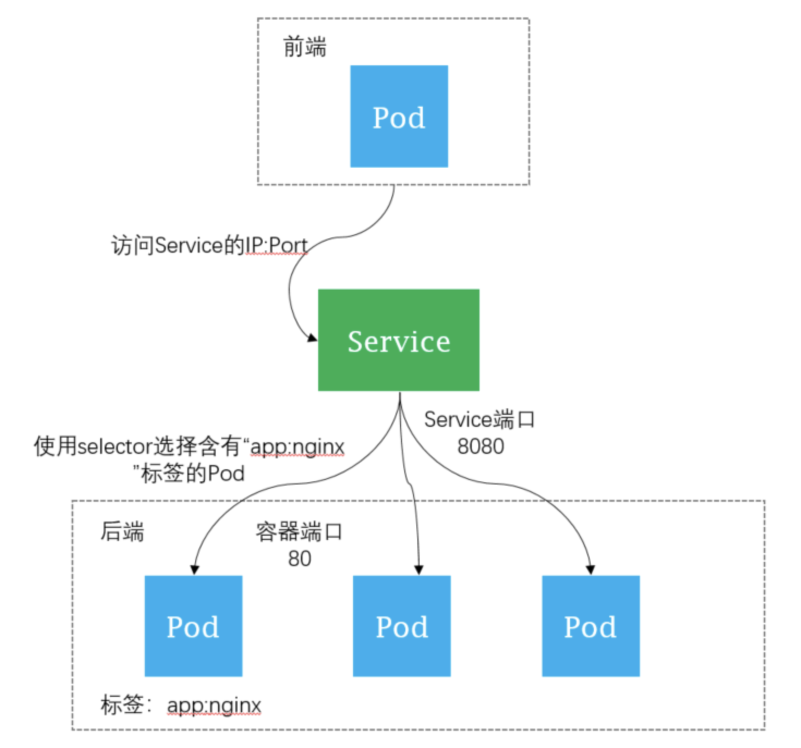

## Service

什么是 Service?

Service 是 Kubernetes 集群内部流量4层负载均衡，为一组容器（Pod）提供固定的访问入口，并对这一组容器做负载均衡。 Service 在 Kubernetes 中是一个 REST 对象，和 Pod 类似。Service 定义了逻辑上的一组 Pod，其所对应的 Pod 通常通过 Selector 来确定。

直接访问Pod的问题：

工作负载创建完成后，如何访问负载呢？访问负载实际上就是访问 Pod，但是直接访问 Pod 会有如下几个问题：

* Pod 会随时被 Deployment 这样的控制器删除重建，那访问 Pod 的结果就会变得不可预知。
* Pod 的 IP 地址是在 Pod 启动后才被分配，在启动前并不知道 Pod 的 IP 地址。
* 应用往往都是由多个运行相同镜像的一组 Pod 组成，一个个 Pod 的访问也变得不现实。

举个例子，假设有这样一个应用程序，使用Deployment创建了前端和后端，前端会调用后端做一些计算处理，如图所示。后端运行了3个Pod，这些Pod是相互独立且可被替换的，当Pod出现状况被重建时，新建的Pod的IP地址是新IP，前端的Pod无法直接感知。

负载间访问如下图所示：

Service是如何工作的

Kubernetes 中的 Service 对象就是用来解决上述Pod访问问题的。Service有一个固定IP地址，Service将访问他的流量转发给Pod，具体转发给哪些Pod通过Label来选择，而且Service可以给这些Pod做负载均衡。

那么对于上面的例子，在前端和后端中间添加一个Service，前端通过Service来访问Pod，这样前端Pod就无需感知后端Pod的变化，如下图所示。

## Ingress

[Ingress](https://kubernetes.io/docs/concepts/services-networking/ingress/)

什么是Ingress?

Ingress 是 Kubernetes 集群外部流量7层负载均衡，是集群内 Service 对外暴露7层的访问接入点，通过域名或者访问路径来路由到不同 Service 上，从而达到7层的负载均衡。

什么是 Nginx Ingress Controller ？

为了使得 Nginx Ingress 资源正常工作，K8S 集群中必须要有个 Nginx Ingress Controller 来解析 Nginx Ingress 的转发规则。Nginx Ingress Controller 收到请求，匹配 Nginx Ingress 转发规则转发到后端 Service所对应的 Pod，由 Pod 处理请求。

Kubernetes中Service、Nginx Ingress与Nginx Ingress Controller有着以下关系：

* Service 是后端真实服务的抽象，一个 Service 可以代表多个相同的后端服务。
* Nginx Ingress 是反向代理规则，用来规定 HTTP/HTTPS 请求应该被转发到哪个 Service 所对应的 Pod 上。例如根据请求中不同的 Host 和 URL 路径，让请求落到不同 Service 所对应的 Pod 上。
* Nginx Ingress Controller 是一个反向代理程序，负责解析 Nginx Ingress 的反向代理规则。如果 Nginx Ingress 有增删改的变动，Nginx Ingress Controller 会及时更新自己相应的转发规则，当 Nginx Ingress Controller 收到请求后就会根据这些规则将请求转发到对应 Service 的 Pod 上。

Nginx Ingress Controller 通过 API Server 获取 Ingress 资源的变化，动态地生成 Load Balancer（例如Nginx）所需的配置文件（例如 nginx.conf），然后重新加载 Load Balancer（例如执行nginx -s load重新加载Nginx）来生成新的路由转发规则。

Ingress 场景示例

在常见的前后端分离的架构方式中，前后端的访问地址分别使用不同的访问路径。对应这种场景，可以采用 Ingress，根据7层的访问路径负载到不同的应用实例上。

