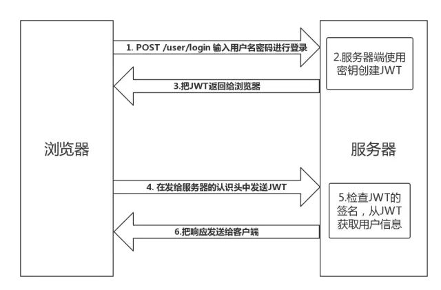
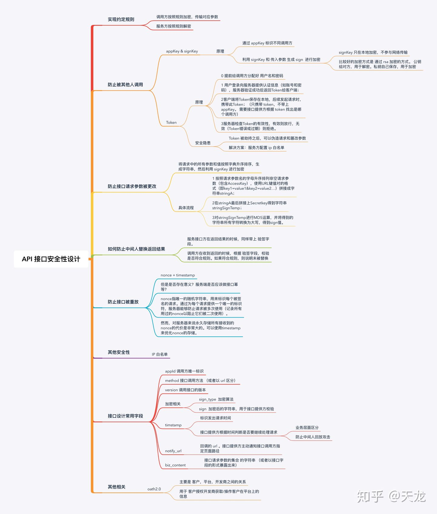
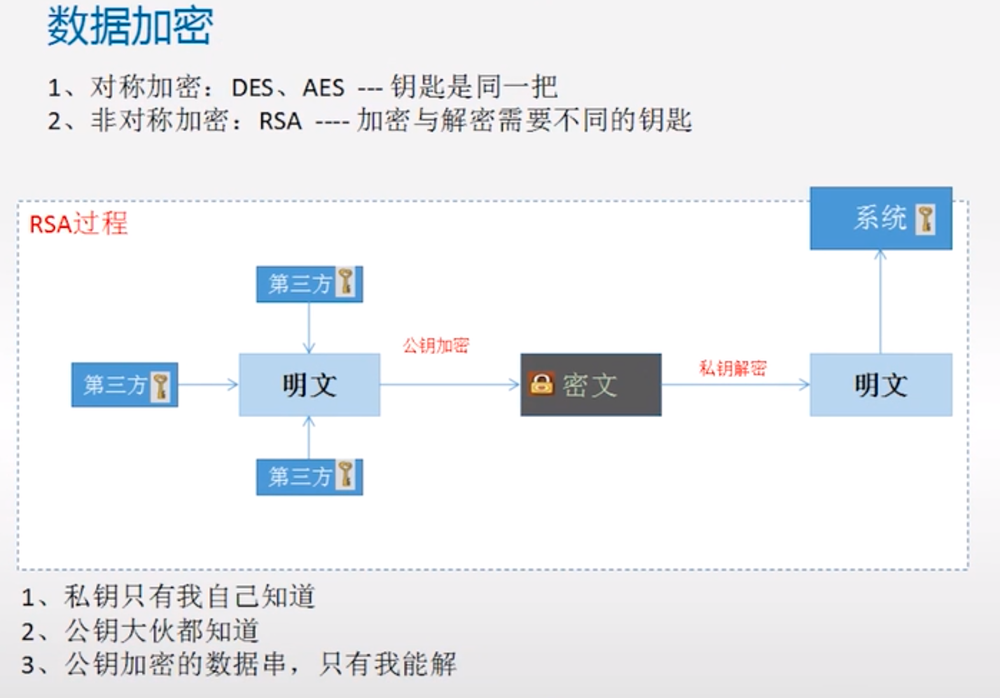

# 07 列表

1、介绍下JWT的工作原理？使用的时候有什么需要注意的？

[JSON Web Token 入门教程](http://www.ruanyifeng.com/blog/2018/07/json_web_token-tutorial.html)

> 简述：JSON Web Token（缩写 JWT） 是一种跨域认证的解决方案。它是一个很长的字符串，中间用点（.）分隔成三个部分（Header（头部）.Payload（负载）.Signature（签名））。主要解决了跨域服务架构的扩展性，不同站点之间的用户自动登录问题。JWT由服务端通过各种加密算法生成，返回给客户端，客户端收到服务器返回的 JWT，储存在 Cookie 里面或者 localStorage中，最后再请求服务器时放在 HTTP 请求的头信息`Authorization`字段里面`Authorization: Bearer <token>`，服务端每次获取 jwt 进行签名检查并获取用户信息返回给客户端。
>
> 使用的时候注意敏感信息不要写入 JWT 的 Payload 中，为了减少盗用不要设置过长时间过期，正确使用JWT数据，可减少对数据库的查询操作。

**工作原理：**

* ① 客户端浏览器通过输入用户名密码进行登录请求。
* ② 服务端接收到信息后进行查询验证，成功后使用秘钥创建JWT。
* ③ 服务端将JWT返回给浏览器。客户端将 JWT 保存到本地（通常使用 localstorage，也可以使用 cookie）。
* ④ 当用户希望访问一个受保护的路由或者资源的时候，需要请求头的 Authorization 字段中使用Bearer 模式添加 JWT。使用如下形式：`Authorization: Bearer <token>`。
* ⑤ 服务端获取到 JWT 后进行签名检查，从 JWT 中获取用户信息进行处理。
* ⑥ 处理完成后将响应发送给客户端。



**JWT 的结构：**


```php
Header(头部).Payload（负载）.Signature（签名）
```

**Header 的产生:**

Header 部分是一个 JSON 对象，描述 JWT 的元数据，通常是下面的样子。

```
{
  "alg": "HS256",
  "typ": "JWT"
}
```


上面代码中，alg 属性表示签名的算法（algorithm），默认是 HMAC SHA256（写成 HS256）；typ属性表示这个令牌（token）的类型（type），JWT 令牌统一写为JWT。

最后，将上面的 JSON 对象使用 Base64URL 算法（详见后文）转成字符串。

**Payload（负载）的产生**：

Payload 部分也是一个 JSON 对象，用来存放实际需要传递的数据。JWT 规定了7个官方字段，供选用。

```
iss (issuer)：签发人
exp (expiration time)：过期时间
sub (subject)：主题
aud (audience)：受众
nbf (Not Before)：生效时间
iat (Issued At)：签发时间
jti (JWT ID)：编号
```

除了官方字段，你还可以在这个部分定义私有字段，下面就是一个例子。

```
{
  "sub": "1234567890",
  "name": "John Doe",
  "admin": true
}
```

注意，JWT 默认是不加密的，任何人都可以读到，所以不要把秘密信息放在这个部分。这个 JSON 对象也要使用 Base64URL 算法转成字符串。

**Signature(签名)产生**:
Signature 部分是对前两部分的签名，防止数据篡改。

首先，需要指定一个密钥（secret）。这个密钥只有服务器才知道，不能泄露给用户。然后，使用 Header 里面指定的签名算法（默认是 HMAC SHA256），按照下面的公式产生签名。

```php
HMACSHA256(
  base64UrlEncode(header) + "." +
  base64UrlEncode(payload),
  secret)
```

算出签名以后，把 Header、Payload、Signature 三个部分拼成一个字符串，每个部分之间用"点"（.）分隔，就可以返回给用户。

**JWT 的几个特点**：

（1）JWT 默认是不加密，但也是可以加密的。生成原始 Token 以后，可以用密钥再加密一次。

（2）JWT 不加密的情况下，不能将秘密数据写入 JWT。

（3）JWT 不仅可以用于认证，也可以用于交换信息。有效使用 JWT，可以降低服务器查询数据库的次数。

（4）JWT 的最大缺点是，由于服务器不保存 session 状态，因此无法在使用过程中废止某个 token，或者更改 token 的权限。也就是说，一旦 JWT 签发了，在到期之前就会始终有效，除非服务器部署额外的逻辑。

（5）JWT 本身包含了认证信息，一旦泄露，任何人都可以获得该令牌的所有权限。为了减少盗用，JWT 的有效期应该设置得比较短。对于一些比较重要的权限，使用时应该再次对用户进行认证。

（6）为了减少盗用，JWT 不应该使用 HTTP 协议明码传输，要使用 HTTPS 协议传输。


2、Api 安全接口设计方面的考虑（Https传输加密、使用令牌、使用非对称加密）？什么是对称加密，什么是非对称加密？如何防止数据不会被篡改？

> API接口的安全性主要是为了保证数据不会被篡改和重复调用，实现方案主要围绕Token、时间戳和Sign三个机制展开设计。

* **Token授权机制**：用户使用用户名密码登录后服务器给客户端返回一个Token（必须要保证唯一，可以结合UUID和本地设备标示），并将Token-UserId以键值对的形式存放在缓存服务器中（我们是使用Redis），并要设置失效时间。服务端接收到请求后进行Token验证，如果Token不存在，说明请求无效。Token是客户端访问服务端的凭证。
* **时间戳超时机制** 用户每次请求都带上当前时间的时间戳timestamp，服务端接收到timestamp后跟当前时间进行比对，如果时间差大于一定时间（比如30秒），则认为该请求失效。时间戳超时机制是防御重复调用和爬取数据的有效手段。 当然这里需要注意的地方是保证客户端和服务端的“当前时间”是一致的，我们采取的对齐方式是客户端第一次连接服务端时请求一个接口获取服务端的当前时间A1，再和客户端的当前时间B1做一个差异化计算（A1-B1=AB），得出差异值AB，客户端再后面的请求中都是传B1+AB给到服务端。
* **API签名机制** 将“请求的API参数”+“时间戳”+“盐”进行MD5算法加密，加密后的数据就是本次请求的签名signature，服务端接收到请求后以同样的算法得到签名，并跟当前的签名进行比对，如果不一样，说明参数被更改过，直接返回错误标识。签名机制保证了数据不会被篡改。



对称加密：DES、AES ---加密和解密都是同一把密钥。在加解密过程中，使用的都是同一个密钥。

非对称加密：RSA --- 加密与解密需要不同的钥匙，一对密钥：私钥和公钥。


对称加密的优点：加密速度快，适用于服务端与服务端之间的通信。

对称加密的缺点：客户端源码破解后得到密钥，不安全。


非对称加密的优点：最安全的加密方式。应用场景：第三方支付对接、核心金融机构。

非对称加密的缺点：效率低。




3、静态变量 static 和 gloabl 全局变量。

① 以下代码的打印结果是多少？

```php
<?php
$count = 5;

function get_count() {
    static $count;
    return $count++;
}

echo $count."\n";
++$count;
echo get_count()."\n";
echo get_count()."\n";
```

输出结果如下：

```
5

1
```

> 递增／递减运算符不影响布尔值。递减 **`null`** 值也没有效果，但是递增 **`null`** 的结果是 `1`。

② 以下程序的输出结果是多少？

```php
<?php
function &myFunc() {
    static $b = 10;
    return $b;
}

echo myFunc()."\n";
$a = &myFunc();
$a = 100;

echo myFunc()."\n";
```

输出结果如下：

```php
10
100
```

③ 以下程序的输出结果是多少？

```php
<?php
$var1 = 5;
$var2 = 10;

function foo(&$my_var) {
    Global $var1;
    $var1 +=2;
    $var2 = 4;
    $my_var += 3;
    return $var2;
}

$my_var = 5;
echo foo($my_var)."\n";
echo $var1."\n";
echo $var2."\n";

$bar = 'foo';
$my_var = 10;
echo $bar($my_var);
```

输出结果如下：

```php
4
7
10
4
```


4、PHP执行的时候有如下过程，`Scanning`->`Complication`->`Execution`->`Parsing`,其含义分别为：

A、将`PHP`代码转换为语言片段（`Tokens`）、将`Tokens`转换成简单而有意义的表达式、将表达式编译成`Opcodes`、顺序执行`Opcodes`。

B、将`PHP`代码转换为语言片段（`Tokens`）、将`Tokens`转换成简单而有意义的表达式、顺序执行`Opcodes`、将表达式编译成`Opcodes`。

C、将`PHP`代码转换为语言片段（`Tokens`）、将表达式编译成`Opcodes`、顺序执行`Opcodes`、将`Tokens`转换成简单而有意义的表达式。

D、将`PHP`代码转换为语言片段（`Tokens`）、将表达式编译成`Opcodes`、将`Tokens`转换成简单而有意义的表达式、顺序执行`Opcodes`。


答案C。


5、写一条SQL要求去除一个学生的最高分和最低分，然后算出平均分。

```sql
SELECT (SUM(SCORE)-MAX(SCORE)-MIN(SCORE))/(COUNT(*)-2) AS avgScore FROM t 
HAVING COUNT(*)>2;
```


6、设计模式了解吗？

单例模式（三私一公）：

```php
// 1、增加构造方法，并将其私有化。以防止使用`new`运算符直接调用构造方法。
private function __construct() {}
// 2、私有的静态属性保存实例化好的对象
private static $instance;
// 3、增加一个公共的静态方法，用于在类外静态调用该方法，进入到类内，去执行实例化调用构造方法。
public static function getInstance() {
//先判断对象是否被保存
if(!isset(self::$instance)){
//还没有保存，实例化并返回
self::$instance = new self;
}
return self::$instance;
}
// 4、防止对象被克隆而生成新对象
private function __clone() {}
```


7、XSS 攻击的原理和防范的方法？


8、CSRF 攻击的原理和防范的方式？


9、SQL 注入攻击的原理和防范的方法？


10、文件上传的漏洞及注意事项？