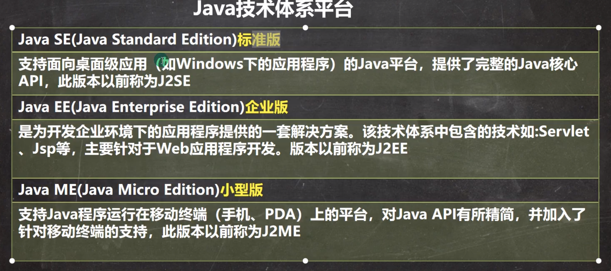
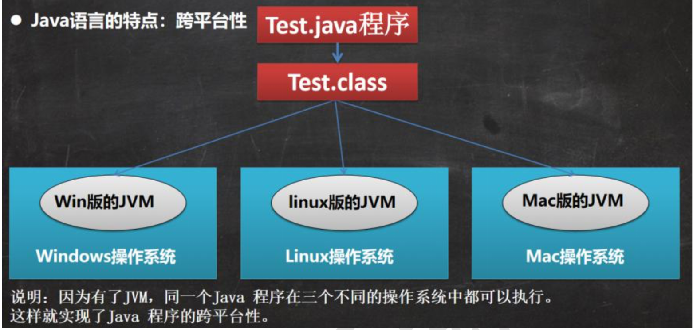
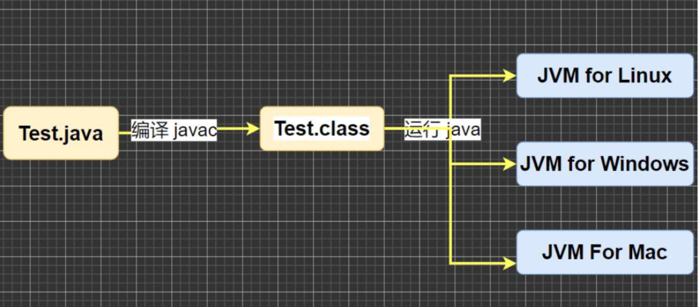
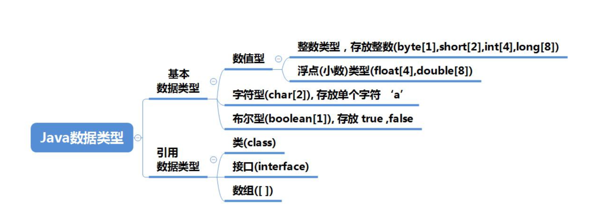
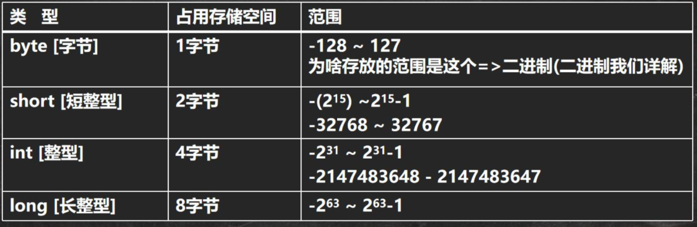
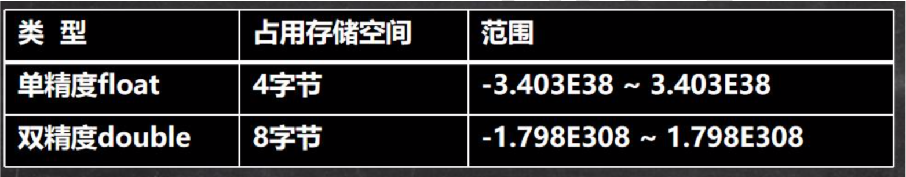
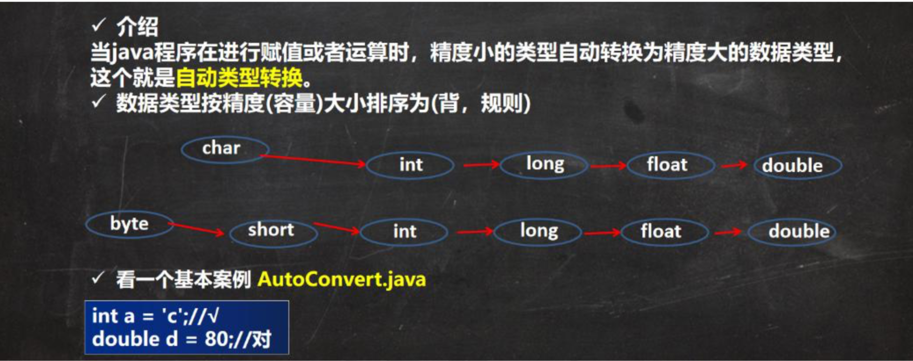
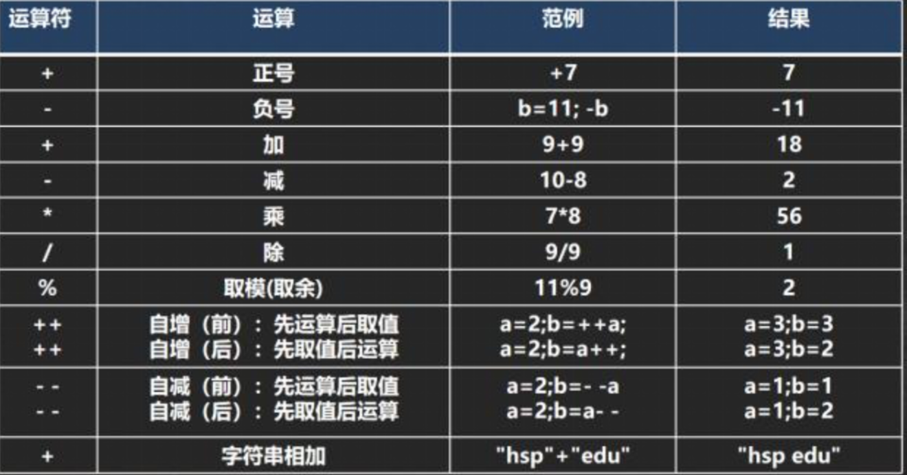
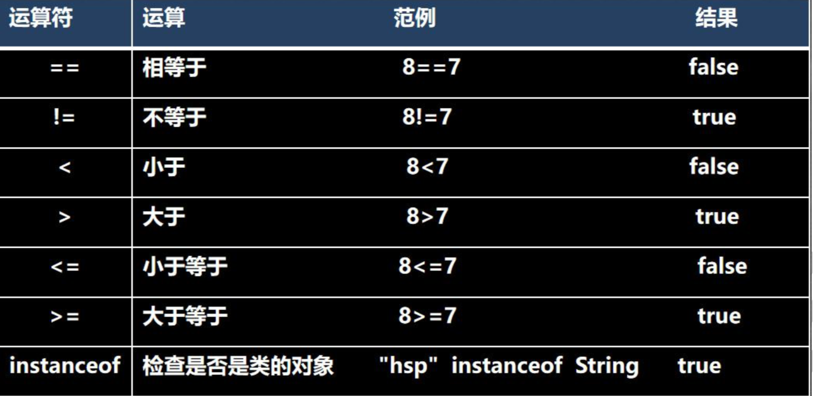
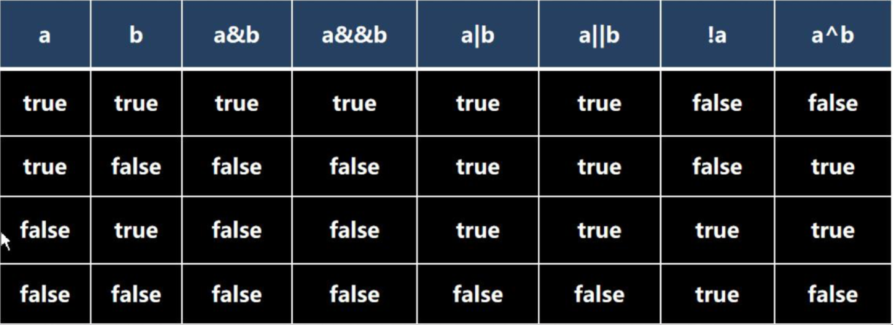

Hspcat javahsp


我亦无他，惟手熟尔。


本套Java课程的内容分为三个阶段，涵盖了Java基础的方方面面。

第一阶段:建立编程思想(包括:基本语法、数组、排序和查找、面向对象编程、零钱通、房屋出租系统、迷宫、八皇后、汉诺塔 )。 

第二阶段:提升编程能力(包括: 枚举和注解、Exception、常用类、集合、泛型、线程、IO流、坦克大战) 。

第三阶段: 增强分析需求，代码实现能力(包括: 网络编程、反射、Mysql、JDBC和连接池、正则表达式、Java8 Java11 新特性、马踏棋盘、满汉楼、多用户通信系统)


#  技术体系

Java后端技术体系：

第一部分：Java基础

第二部分：Java高级（Java多线程、高并发、数据结构和算法、23种设计模式、JVM）

第三部分：JavaWEB

第四部分：主流的框架和项目管理（Linux、Nginx、SSM（Spring、SpringMVC、MyBatis）、数据库）

第五部分：分布式、微服务、并行架构

第六部分：DevOps（开发运维一体化）自动化部分项目管理、解决CI/CD

第七部分：大数据技术

第八部分：项目

第九部分：大厂的高频面试题

第十部分：底层源码/内核研究

编程基础的扩展（科班）


JAVA的应用邻域：

* 企业级应用。复杂的大型企业软件系统、各种类型的网站，应用领域包括金融、电信、交通、电子商务等。

* Android平台应用。Android应用程序。

* 移动领域应用。消费和嵌入式领域，各种小型设备上的应用，包括机顶盒、车载大屏影音娱乐设备、汽车通信设备、扫码的POS机等。

  

JAVA体系四个平台：

* Java Platform, Standard Edition (Java SE)，标准版。

* Java Platform, Enterprise Edition (Java EE)，企业版。是为开发企业环境下的应用程序提供的

* Java Platform, Micro Edition (Java ME)，小型版。

* JavaFX

  




# 问题解决

# 每日问答

## 什么是解释型语言，什么是编译性语言？

解释性语言，编译后的代码不能直接被机器执行，需要解释器来执行，也就是说，在程序运行前需要将源程序预编译成中间语言，然后再由解释器执行中间语言。

编译性语言，编译后的代码直接就是二进制的，可以直接被机器执行的。

解释型语言：JavaScript、PHP、Java 。

编译型语言：C、C++

注：PHP是解释型语言，将PHP代码解释为opcode之后再交由Zend引擎执行，解释PHP语言的解释器是Zend引擎。

编译型语言最大的优势就是其执行速度快，编译型程序比解释型程序消耗的内存更少。  

## JVM、JRE和JDK的关系

`JVM`(`Java Virtual Machine`)，`Java`虚拟机。

`JRE`(`Java Runtime Environment`)，`Java`运行环境，包含了`JVM`和`Java`的核心类库(`Java API`) 。

`JDK`(`Java Development Kit)`称为`Java`开发工具包，包含了`JRE`和开发工具。

三者关系：

```
JVM` + 核心类库（`Java API`） = `JRE
JRE` + `java`开发工具（`javac.exe`/`jar.exe`) = `JDK
```

`JVM`不能单独搞定`class`的执行，解释`class`的时候`JVM`需要调用解释所需要的类库`lib`。在`JDK`下面的的`JRE`目录里面有两个文件夹`bin`和`lib`,在这里可以认为`bin`里的就是`JVM`，`lib`中则是`JVM`工作所需要的类库，而`JVM`和 `lib`和起来就称为`JRE`。

## Java语言跨平台原理

所谓跨平台性，是指`Java`语言编写的程序，一次编译后，可以在多个系统平台上运行（注意不是能在所有的系统平台上运行，关键在于该系统平台上是否安装相应的虚拟机）。

​			 	

`Java`程序并非是直接运行的，它通过`Java`虚拟机在系统平台上运行的。`Java`程序的运行分为两步，先编译再解释执行，`Java`编译器将`Java`源程序编译成与平台无关的字节码文件(`.class`文件)，然后由`Java`虚拟机(`JVM`)对字节码文件解释执行。因此在不同的操作系统下，只需安装不同的`Java`虚拟机即可实现`Java`程序的跨平台。

`Java`运行过程：

① `Java`程序的运行分为两步：先编译再解释执行，实际上为一次编译，到处运行。

② 编译器的作用：通过编译器将`Java`源程序编译成`Java`字节码文件（`.class`）(字节码文件采用结构中立的中间文件格式)。

③ 虚拟机的作用：通过不同的虚拟机将`.class`字节码文件解释为对应机器语言并执行。



> `Java`可以跨所有的平台吗？

只有提供并安装了相应的虚拟机，就可以跨平台。

> 虚拟机和解释器的关系？

解释器是虚拟机的一个重要组成部分。`Java`是先编译成字节码再执行。`Java`虚拟机就是字节码运行的环境，通过`Java`虚拟机可以实现平台无关性，而`Java`解释器是将字节码解释为操作系统可以理解的原语执行。 可以说，`Java`解释器是虚拟机的一个实现部分。

## 字符编码的区别

* ASCII 编码，一个字节表示一个字符，一共128个字符，实际可以表示到256个字符，只是用到了128个。
* Unicode 编码，一个英文字母和一个汉字都占用2个字节，对存储空间来说比较浪费。2的16次方是65536，所以最多编码65536个字符。编码0-127的字符与ASCII编码一致，兼容ASCII 编码。
* UTF-8 编码是Unicode 编码的改进，通过变长的编码方式，使用1-6个字节表示一个符号，根据不同的符号而变化字节长度。字母占1个字节，汉字占3个字节。
* GBK 编码，用来表示汉字，字母使用1个字节，汉字使用2个字节。
* GB2312 编码可以用来表示汉字，但是表示的范围比GBK更小（GB2312 < GBK）。

## MAC环境变量

查找JDK安装路径: 

```
$ ls -l /usr/bin/java
```

回到桌面,点击前往 -> 前往文件夹：

```
Command + Shift + G
vim ~/.zshrc
```

查看Java版本：

```shell
$ java -version
java version "1.8.0_231"
Java(TM) SE Runtime Environment (build 1.8.0_231-b11)
Java HotSpot(TM) 64-Bit Server VM (build 25.231-b11, mixed mode)
```


# Java基础 

## Java的数据类型

Java是一个强类型语言，Java中的数据必须明确数据类型。在Java中的数据类型包括基本数据类型和引用数据类型两种。 







### 基本数据类型

六种数字类型（四个整数型，两个浮点型），一种字符类型，还有一种布尔型。

| 数据类型   | 别名     | 关键字  | 占用内存(byte)(bit) | 取值范围                                                     | 备注                                                         |
| ---------- | -------- | ------- | ------------------- | ------------------------------------------------------------ | ------------------------------------------------------------ |
| `整数型`   | 字节型   | byte    | 1个字节，8位        | 最小值是 -128（-2^7）- 最大值是 127（2^7-1)                  | 默认值为0，byte 类型用在大型数组中节约空间，主要代替整数，因为 byte 变量占用的空间只有 int 类型的四分之一。 |
| 整数型     | 短整型   | short   | 2个字节，16位       | 最小值是 -32768（-2^15）- 最大值是 32767（2^15 - 1）         | 默认值为0，一个short变量是int型变量所占空间的二分之一。      |
| 整数型     | 整型     | int     | 4个字节，32位       | 最小值是 -2,147,483,648（-2^31 - 最大值是 2,147,483,647（2^31 - 1） | 默认值为0，一般地整型变量默认为 int 类型。                   |
| 整数型     | 长整型   | long    | 8个字节，64位       | 最小值是-2^63 - 最大值是 2^63 -1                             | 默认值是0L，这种类型主要使用在需要比较大整数的系统上。       |
| `浮点型`   | 单精度   | float   | 4个字节，32位       |                                                              | 默认值是 0.0f，浮点数不能用来表示精确的值，如货币；float 在储存大型浮点数组的时候可节省内存空间。 |
| 浮点型     | 双精度   | double  | 8个字节，64位       |                                                              | 默认值是 0.0d，double类型同样不能表示精确的值，如货币；浮点数的默认类型为double类型。 |
| `字符型`   | 字符串型 | char    | 2个字节，16位       | 最小值是 `\u0000`（即为0）- 最大值是 `\uffff`（即为65,535）  | char 数据类型可以储存任何字符。                              |
| `布尔类型` | 布尔型   | boolean | 1个字节，8位        | true 和 false                                                | boolean类型不能与其他基本数据类型相互转换                    |

注意：

* 在`java`中整数默认是`int`类型，浮点数默认是`double`类型。

* 定义`float`类型的变量时，需要在小数的后面加F(大小写均可，建议大写)。因为浮点数的默认类型是`double`， `double`的取值范围是大于`float`的，类型不兼容。
* 定义`long`类型的变量时，需要在整数的后面加L(大小写均可，建议大写)。因为整数默认是`int`类型，整数太大可能超出`int`范围。
* 通常情况下，应该使用 double 型，因为它比 float 型更精确。
* 小心陷阱：不要对小数直接进行相等判断，尤其是运算后的结果是小数。应该是以两个数的差值的绝对值，在某个精度范围类判断。
* String 不是一个基本数据类型，属于引用数据类型中的类（`class`）。

示例：

```java
float num1 = 1.1; // 错误
float num2 = 1.1F; // 正确
double num5 = .123; // 正确，等价 0.123
System.out.println(5.12e2);// 512.0
System.out.println(5.12E-2);// 0.0512 
double num9 = 2.1234567851;
float num10 = 2.1234567851F; 
System.out.println(num9); // 2.1234567851
System.out.println(num10); // 2.1234567,精度损失
double num11 = 2.7;
double num12 = 8.1 / 3;
System.out.println(num11);// 2.7
System.out.println(num12);// 2.6999999999999997 接近 2.7 的一个小数，而不是 2.7
// 不要对小数直接进行相等判断，尤其是运算后的结果是小数。应该是以两个数的差值的绝对值，在某个精度范围类判断。
if(Math.abs(num11 - num12) < 0.000001 ) {
System.out.println("差值非常小，到我的规定精度，认为相等...");
}
```

### 引用数据类型

> 类(`class`)、接口类型(`interface`)、数组类型（`array`）、枚举类型、注解类型。

常见的类`class`引用：`Object`、`String`、`Date`、`Void`（不可实例化的占位符类）。
常见的接口`interface`引用：`List<E>`、`Map<K,V>`。
数组`array`：存储在一个连续的内存块中的相同数据类型（引用数据类型）的元素集合，`Java`中数组必先初始化后才能使用，初始化就是给数组元素分配内存，并为每个元素赋初始值。

数组的定义：
第一种方式：类型[] 数组名; 如` int[] nums`; 
第二种方式：类型数组名[]; 如` int nums[]`。

基本数据类型和引用数据类型的区别：

> 引用类型在堆里，基本类型在栈里。

基本数据类型在被创建时，在栈上给其划分一块内存，将数值直接存储在栈上。
引用数据类型在被创建时，首先要在栈上给其引用（句柄）分配一块内存，而对象的具体信息都存储在堆内存上，然后由栈上面的引用指向堆中对象的地址。

Java中的数据类型分为基本数据类型和引用数据类型。
基本数据类型：

> 包括4类8种，分别是4个整数型，2个浮点型，1个字符类型，1个布尔类型：

* 4个整数型：字节型（Byte,1个字节）,短整型（short，2个字节）,整型（int，4个字节，默认类型）,长整型（Long，8个字节）
* 2个浮点型：单精度（float，4个字节）,双精度（double，8个字节，默认类型）
* 1个字符型：字符型（char，2个字节）
* 1个布尔型：布尔型（boolean，1个字节）

引用数据类型：

> 包括类(class)、接口类型(interface)、数组类型（array）、枚举类型、注解类型。

* 常见的类 class 引用：Object、String（字符串类型）、Date、Void（不可实例化的占位符类）
* 常见的接口 interface 引用：List<E>、Map<K,V>
* 常见的数组类型：类型数组名[]; 如int nums[]
* 常见的枚举类型：public enum Color { RED, GREEN, BLANK, YELLOW }，枚举是类，属于引用类型。
* 常见的注解类型：如下所示

```java
@Target({ElementType.TYPE, ElementType.METHOD})
@Retention(RetentionPolicy.RUNTIME)
@Documented
public @interface Page {
    /**
     * 用于绑定的请求参数名字
     */
    String value() default "";
}
```

区别：

* 引用类型一般都是通过new关键字百创建对象，然后把这个对象赋予给相应的变量，基本类型就是直接赋值就行。
* 引用类型创建在堆内存里，基本类型的创建在栈内存里。

## 基本数据类型转换

### 自动类型转换



使用细节：

① 有多种类型的数据混合运算时，系统首先自动将所有数据转换成容量最大的那种数据类型，然后再进行计算。

```java
int n1 = 10; // 正确
float d1 = n1 + 1.1; // 错误 n1 + 1.1 => 结果类型是 double，从double转换成float会有精度损失
double d1 = n1 + 1.1; // 正确 n1 + 1.1 => 结果类型是 double
float d1 = n1 + 1.1F; // 正确 n1 + 1.1 => 结果类型是 float
```

② 当我们把精度（容量）大的数据类型赋值给精度（容量）小 的数据类型时，就会报错，反之就会进行自动类型转换。

```java
int n2 = 1.1;// 错误 double -> int 
int num = 'a';//正确  char -> int
double d1 = 80; //正确 int -> double
System.out.println(num);//97
System.out.println(d1);//80.0
```

③ （byte, short）和 char之间不会相互自动转换，当把具体数赋给 byte 时，先判断该数是否在 byte 范围内，如果是就可以，如果不再范围就会报错；如果不是具体数值赋值，而是变量赋值则需要先直接判断类型。

```java
byte b1 = 10; // 正确 , -128-127
byte b3 = 128; // 错误，超出 byte 范围，报错：不兼容的类型，从 int 转换到 byte 可能会有损失
int n2 = 1; // n2 是int 
byte b2 = n2; // 错误，这种情况属于变量赋值，需要先直接判断数据类型
char c1 = b1; // 错误， 原因 byte 不能自动转成 char
```

④ byte，short，char  他们三者之间可以计算，无论是单独纯运算还是混合运算，在计算时首先转换为int类型。

```java
byte b2 = 1;
byte b3 = 2;
short s1 = 1;
short s2 = b2 + s1; //错误, b2 + s1 => int 报错：不兼容的类型，从 int 转换到 short 可能会有损失
int s2 = b2 + s1; //正确, b2 + s1 => int
byte b4 = b2 + b3; //错误: b2 + b3 => int 报错：不兼容的类型，从 int 转换到 short 可能会有损失

short s = 12;
s = s - 9; // 错误，int->short 

char c1 = '男';
char c2 = '女';
System.out.println(c1 + c2); //
```

⑤ boolean 不参与转换。

```java
boolean pass = true;
int num100 = pass;//错误 boolean 不参与类型的自动转换 报错：boolean 无法转换为 int,boolean 不参与类型的自动转换
```

⑥ 自动提升原则： 表达式结果的类型自动提升为操作数中最大的类型。

```java
byte b4 = 1;
short s3 = 100;
int num200 = 1;
double num400 = 1.1;
float num300 = 1.1F;
float num500 = b4 + s3 + num200 + num400; //错误 double -> float 报错：不兼容的类型，从 double 转换到 float 可能会有损失
double num600 = b4 + s3 + num200 + num300; //正确 float -> double

char c = 'a';
int i = 16;
float d =.314F;
double result = c + i + d; // 正确，float->double
```

### 强制类型转换

自动类型转换的逆过程，将容量大的数据类型转换为容量小的数据类型。使用时要加上强制转换符 ( )，但可能造成精度降低或溢出，需格外注意。

```java
int n1 = (int)1.9;
System.out.println("n1=" + n1);//n1=1, 造成精度损失
int n2 = 2000;
byte b1 = (byte)n2;
System.out.println("b1=" + b1);//b1=-48 造成数据溢出
```

使用细节：

① 当进行的数据从大到小时，就需要使用到强制转换。

```java
byte b = 10;
b = b + 11; // 错误 int->short
b = (byte)(b+11); // 正确，使用强转
```

② 强转符号只针对于最近的操作数有效，往往会使用小括号提升优先级。

```java
int x = (int)10*3.5+6*1.5; //编译错误： double -> int 错误：不兼容的类型，从 double 转换到 int 可能会有损失
int x = (int)(10*3.5+6*1.5); //正确 (int)44.0 -> 44
System.out.println(x); // 44
```

③ char 类型可以保存 int 的常量值，但不能保存int的变量值，需要强转。

```java
char c1 = 100; //正确
int m = 100;  //正确
char c2 = m;  //错误
char c3 = (char)m; //正确
System.out.println(c3); //100对应的字符, d字符
```

④ byte 和 short，char 类型在进行运算时，当做 int 类型处理。

```java
byte b = 16;
short s =14;
short t = s+b; // 错误 int-> short
```

### 基本类型和String类型的转换

① 基本类型转String类型，将基本类型的值+""即可。

```java
int n1 = 100;
float f1 = 1.1F;
double d1 = 4.5;
boolean b1 = true;
String s1 = n1 + "";
String s2 = f1 + "";
String s3 = d1 + "";
String s4 = b1 + "";
System.out.println(s1 + " " + s2 + " " + s3 + " " + s4);
```

② String类型转基本数据类型，通过基本类型的包装类调用parseXX方法即可。

```java
String s5 = "123";
int num1 = Integer.parseInt(s5);
double num2 = Double.parseDouble(s5);
float num3 = Float.parseFloat(s5);
long num4 = Long.parseLong(s5);
byte num5 = Byte.parseByte(s5);
boolean b = Boolean.parseBoolean("true");
short num6 = Short.parseShort(s5);

System.out.println("==========");
System.out.println(num1); // 123
System.out.println(num2); // 123.0
System.out.println(num3); // 123.0
System.out.println(num4); // 123
System.out.println(num5); // 123
System.out.println(num6); // 123
System.out.println(b); // true
```

③ 将字符串转成字符的含义是取出字符串的第一个字符。

```java
String s5 = "123";
System.out.println(s5.charAt(0)); // 1,字符1，不是整型1
```

> 在将String类型转成基本数据类型时，要确保String 类型能够转成有效的数据，比如我们可以把"123"，转成一 个整数，但是不能把 "hello" 转成一个整数。如果格式不正确，就会抛出异常，程序就会终止。

## Java中 +号的使用

* 当左右两边都是数值型时，则做加法运算。
* 当左右两边有一方为字符串，则做拼接运算。
* 运算顺序，是从左到右。

```java
public static void main(String[] args) {
		System.out.println(100 + 98); //198
		System.out.println("100" + 98);//10098

		System.out.println(100 + 3 + "hello");//103hello
		System.out.println("hello" + 100 +3); //hello1003
  
    String book1 = "wang";
		String book2 = "xiong";
		System.out.println(book1 + book2); // wangxiong

		char c1 = '男';
		char c2 = '女';
		System.out.println(c1 + c2); //52906 char类型计算时首先转换为int类型。男的字符码值+女的字符码值

		double price1 = 123.56;
		double price2 = 100.11;
		System.out.println(price1 + price2); // 223.67000000000002 小数近似相加
	}
```

## 运算符

### 算术运算符



使用细节：

① 当++作为表达式使用时，++i 先自增后赋值，i++先赋值后自增。

```java
int j = 8;
int k = ++j; // 等价 j=j+1;k=j;
int k = j++; // 等价 k =j;j=j+1; 
System.out.println("k=" + k + "j=" + j);// k=9 j=10
```

使用示例：

```java
System.out.println(10 / 4); // 2，java中整型变量默认为 int 类型。
System.out.println(10.0 / 4); // 2.5 浮点数的默认类型为double类型。
double d = 10 / 4; // java中10 / 4 = 2, 2=>2.0 
System.out.println(d);// 2.0
// 取模的本质 a % b = a - a / b * b 
// 10 % 3 = 10 -10 / 3 * 3 =10 -9 = 1
System.out.println(10 % 3); // 1
// -10 % 3 => -10 - (-10) / 3 * 3 = -10 + 9 = -1
System.out.println(-10 % 3); // -1
// 10 % -3 = 10 - 10 / (-3) * (-3) = 10 - 9 = 1
System.out.println(10 % -3); // 1
// -10 % -3 =  (-10) - (-10) / (-3) * (-3) = -10 + 9 = -1
System.out.println(-10 % -3);// -1
```

经典案例1：

```java
int i = 1; // i->1
i = i++;  // 规则使用临时变量: (1) temp=i;(2) i=i+1;(3)i=temp;
System.out.println(i); // 1

int i=1;
i=++i; //规则使用临时变量: (1) i=i+1;(2) temp=i; (3)i=temp;
System.out.println(i);  // 
```

### 关系运算符



使用细节：

* 关系运算符的结果都是boolean型，也就是要么是true，要么是false。
*  关系运算符组成的表达式，称为关系表达式，，例如 a > b。
* 比较运算符"=="不能误写成"="。

### 逻辑运算符

用于连接多个条件(多个关系表达式)，最终的结果也是一个 boolean 值。

* 短路与 &&，短路或||，取反 !。

* 逻辑与 &，逻辑或 |，^ 逻辑异或。



逻辑运算的规则：

* `a&b` : & 叫逻辑与：当 a 和 b 同时为 true ,则结果为 true, 否则为 false。与短路与的区别：不管第一个条件是否为 false，第二个条件都要判断，效率低。

* `a&&b` : && 叫短路与：当 a 和 b 同时为 true ,则结果为 true,否则为 false。与逻辑与的区别：如果第一个条件为 false，则第二个条件不会判断，最终结果为 false，效率高。

* `a|b` : | 叫逻辑或：当 a 和 b ，有一个为 true ,则结果为 true,否则为 false。与短路或的区别：不管第一个条件是否为 true，第二个条件都要判断，效率低。

* `a||b` : || 叫短路或：当 a 和 b ，有一个为 true ,则结果为 true,否则为 false。与逻辑或的区别：如果第一个条件为 true，则第二个条件不会判断，最终结果为 true，效率高。

* !a : 叫取反，或者非运算。当 a 为 true, 则结果为 false, 当 a 为 false 是，结果为 true。

* a^b: 叫逻辑异或，当 a 和 b 不同时，则结果为 true, 否则为 false。

逻辑与和短路与的使用案例：

```java
int a = 4;
int b = 9;
if(a < 1 && ++b < 50) {
	System.out.println("ok"); // 不输出
}
// 对于&&短路与而言，如果第一个条件为false ,后面的条件不再判断。
System.out.println("a=" + a + " b=" + b);// 4 9

if(a < 1 & ++b < 50) {
	System.out.println("ok"); // 不输出
}
// 对于&逻辑与而言，如果第一个条件为false ,后面的条件仍然会判断。
System.out.println("a=" + a + " b=" + b);// 4 10
```

逻辑或和短路或的使用案例：

```java
int a = 4;
int b = 9;
if( a > 1 || ++b > 4) {
	System.out.println("短路或：||"); // 会输出
}
// | 逻辑或：不管第一个条件是否为true，第二个条件都要判断，效率低
System.out.println("a=" + a + " b=" + b); //4 9
if( a > 1 | ++b > 4) {
	System.out.println("逻辑或：|"); // 会输出
}
//||短路或：如果第一个条件为true，则第二个条件不会判断，最终结果为true，效率高
System.out.println("a=" + a + " b=" + b); //4 10
```

逻辑与和逻辑或的使用案例（经典）：

```java
int x = 5;
int y = 5;
if (x++ == 6 & ++y == 6) {
	x=11;
}
System.out.println("x="+x+",y="+y); // x=6 y=6

int x = 5;
int y = 5;
if (x++ == 5 | ++y == 5) {
	x=11;
}
System.out.println("x="+x+",y="+y); // x=11 y=6
```

短路与和短路或的使用案例（经典）：

```java
int x = 5;
int y = 5;
if (x++ == 6 && ++y == 6) {
	x=11;
}
System.out.println("x="+x+",y="+y); // x=6 y=5

int x = 5;
int y = 5;
if (x++ == 5 || ++y == 5) {
	x=11;
}
System.out.println("x="+x+",y="+y); // x=11 y=5
```

逻辑运算的经典题目（必看）：

```java
boolean x = true;
boolean y = false;
short z = 46;
if((z++ == 46) && (y = true)) z++; 
if((x = false) || (++z == 49)) z++;
System.out.println("z="+z); // z= 5
```


### 赋值运算符

### 三元运算符

### 位运算符

### 优先级

### 二进制


# MyBatis 返回数据为NULL时会过滤字段问题

> mybatis callSettersOnNulls 配置，解决数据库null字段的显示

解决方案：

```java
mybatis:
  mapper-locations:
    - classpath:dao/*.xml
    - classpath*:com/**/mapper/*.xml
  configuration:
    call-setters-on-nulls: true
```


# 存储过程插入和更新数据

```sql

CREATE TABLE `oms_order_procedure` (
  `member_id` bigint(20) NOT NULL,
  `member_username` varchar(64) DEFAULT NULL COMMENT '用户帐号',
  `product_id` bigint(20) NOT NULL,
  `total_amount` decimal(10,2) DEFAULT '0.00' COMMENT '订单总金额',
  `order_sn` varchar(64) DEFAULT NULL COMMENT '订单编号',
  `create_time` datetime DEFAULT NULL COMMENT '提交时间',
  `name` varchar(500) NOT NULL
) ENGINE=InnoDB  DEFAULT CHARSET=utf8 COMMENT='产品订单表存储过程中间表';

INSERT INTO oms_order_procedure (member_id,product_id) VALUES
(1,1),
(3,3),
(4,4),
(5,5),
(6,6);

-- 定义 $$ 分隔符 
DELIMITER  $$
-- 定义更新数据表存储过程
CREATE PROCEDURE update_product_order()

BEGIN -- 定义存储过程变量
DECLARE memberIds BIGINT(20);
DECLARE memberUserName VARCHAR(64);
DECLARE totalAmount DECIMAL(10 , 2);
DECLARE prices DECIMAL(10 , 2);
DECLARE productName VARCHAR(500);
DECLARE stopCur INT DEFAULT 0;

-- 定义游标(更新指定部分数据)
DECLARE cur CURSOR FOR( SELECT m.username , m.id , p.price,p.name  FROM ums_member m 
   INNER JOIN oms_order_procedure o ON o.member_id = m.id 
   INNER JOIN pms_product p ON o.product_id = p.id);
-- 定义游标结束,当遍历完成时，将stopCur设置为null 
DECLARE CONTINUE HANDLER FOR NOT FOUND SET stopCur = NULL;
-- 开游标 
OPEN cur;
-- 游标向下走一步，将查询出来的两个值赋给定义的变量
FETCH cur INTO memberUserName , memberIds , prices,productName;
-- 循环体
WHILE(stopCur IS NOT NULL) DO -- 更新对应关系表数据
UPDATE oms_order_procedure 
SET order_sn = unix_timestamp(now())+memberIds,create_time = now(),
member_username = memberUserName , total_amount = prices, name = productName 
WHERE member_id = memberIds;
-- 游标向下走一步
FETCH cur INTO memberUserName , memberIds , prices,productName;
END WHILE;
-- 关闭游标
CLOSE cur;
END $$
-- 改回原来分隔符;
DELIMITER ;  
```


# Mybaits批量插入

```java
<insert id="insertList">
        INSERT INTO buried_point (version_name,version_channel,`time`,phone,page_name,data_name,data_params,note,created_at) VALUES
        <foreach collection="list" separator="," item="item" index="index">
            (#{item.versionName},
            #{item.versionChannel},
            #{item.time},
            #{item.phone},
            #{item.pageName},
            #{item.dataName},
            #{item.dataParams},
            #{item.note},
            #{item.createdAt,jdbcType=TIMESTAMP})
        </foreach>
    </insert>
```


# Map转实体类

```java
// 将 Map 转换为 实体类
User user = JSON.parseObject(JSON.toJSONString(user01), User.class);
System.out.println(user);
// 将 实体类 转换为 Map
Map map = JSON.parseObject(JSON.toJSONString(user), Map.class);
System.out.println(map);
```


# @Data和@Builder一起使用的坑


记一次java.sql.SQLDataException错误解决：

错误：经排查，实体对应的类型与数据库字段类型一致。

```java
nested exception is org.springframework.dao.DataIntegrityViolationException: Error attempting to get column 'channel' from result set.  Cause: java.sql.SQLDataException: Cannot determine value type from string 'App'
; Cannot determine value type from string 'App'; nested exception is java.sql.SQLDataException: Cannot determine value type from string 'App'] with root cause
com.mysql.cj.exceptions.DataConversionException: Cannot determine value type from string 'App'
```


原因：lombok@Data和@Builder一起用无法添加无参构造方法。

```java
/**
 * Put on any method or constructor to make lombok pretend it doesn't exist,
 * i.e., to generate a method which would otherwise be skipped due to possible conflicts.
 */
@Target({ElementType.METHOD, ElementType.CONSTRUCTOR})
@Retention(RetentionPolicy.SOURCE)
public @interface Tolerate {
}
```


解决：

[记lombok@Data和@Builder一起用无法添加无参构造方法的坑](https://blog.csdn.net/w605283073/article/details/89221853)

[Lombok使用@Tolerate实现冲突兼容](http://www.iiwab.com/post/39)

```java
@Tolerate
UmsMemberResult(){}
```


mybatis实体为什么要提供一个无参的构造函数:


> 提问：Mybatis查询结果映射到实体类的时候，实体类为什么必须有一个空的构造函数？


答：Mybatis框架会调用这个默认构造方法来构造实例对象，即实体类需要通过Mybatis进行动态反射生成。

反射的Class.forName("className").newInstance();需要对应的类提供一个无参构造函数。


待解决问题：

```java
SecurityContextHolder.getContext().getAuthentication() == null
UserDetails userDetails = this.userDetailsService.loadUserByUsername(username)  
```

# 封装通用返回对象

`api`返回码和返回信息接口：

```java
public interface IErrorCode {
    long getCode();

    String getMessage();
}
```

`api`返回码和返回信息接口的实现：

```java
public enum ResultCode implements IErrorCode {
    // 操作成功
    SUCCESS(200, "success"),
    // 操作失败
    FAILED(500, "failed"),
    // 参数检验失败
    VALIDATE_FAILED(404, "parameter check failed"),
    // 暂未登录或token已经过期
    UNAUTHORIZED(401, "not logged in yet or token expired"),
    // 没有相关权限
    FORBIDDEN(403, "no relevant authority");
    private long code;
    private String message;

    private ResultCode(long code, String message) {
        this.code = code;
        this.message = message;
    }

    public long getCode() {
        return code;
    }

    public String getMessage() {
        return message;
    }
}
```


通用返回对象封装：

```java
public class CommonResult<T> {
    /**
     * 状态码
     */
    private long code;
    /**
     * 提示信息
     */
    private String message
    /**
     * 数据封装
     */
    private T data;

    protected CommonResult() {
    }

    protected CommonResult(long code, String message, T data) {
        this.code = code;
        this.message = message;
        this.data = data;
    }

    /**
     * 成功返回结果
     *
     * @param data 获取的数据
     */
    public static <T> CommonResult<T> success(T data) {
        return new CommonResult<T>(ResultCode.SUCCESS.getCode(), ResultCode.SUCCESS.getMessage(), data);
    }

    /**
     * 成功返回结果
     *
     * @param data 获取的数据
     * @param  message 提示信息
     */
    public static <T> CommonResult<T> success(T data, String message) {
        return new CommonResult<T>(ResultCode.SUCCESS.getCode(), message, data);
    }

    /**
     * 失败返回结果
     * @param errorCode 错误码
     */
    public static <T> CommonResult<T> failed(IErrorCode errorCode) {
        return new CommonResult<T>(errorCode.getCode(), errorCode.getMessage(), null);
    }

    /**
     * 失败返回结果
     * @param errorCode 错误码
     * @param message 错误信息
     */
    public static <T> CommonResult<T> failed(IErrorCode errorCode,String message) {
        return new CommonResult<T>(errorCode.getCode(), message, null);
    }

    /**
     * 失败返回结果
     * @param message 提示信息
     */
    public static <T> CommonResult<T> failed(String message) {
        return new CommonResult<T>(ResultCode.FAILED.getCode(), message, null);
    }

    /**
     * 失败返回结果
     */
    public static <T> CommonResult<T> failed() {
        return failed(ResultCode.FAILED);
    }

    /**
     * 参数验证失败返回结果
     */
    public static <T> CommonResult<T> validateFailed() {
        return failed(ResultCode.VALIDATE_FAILED);
    }

    /**
     * 参数验证失败返回结果
     * @param message 提示信息
     */
    public static <T> CommonResult<T> validateFailed(String message) {
        return new CommonResult<T>(ResultCode.VALIDATE_FAILED.getCode(), message, null);
    }

    /**
     * 未登录返回结果
     */
    public static <T> CommonResult<T> unauthorized(T data) {
        return new CommonResult<T>(ResultCode.UNAUTHORIZED.getCode(), ResultCode.UNAUTHORIZED.getMessage(), data);
    }

    /**
     * 未授权返回结果
     */
    public static <T> CommonResult<T> forbidden(T data) {
        return new CommonResult<T>(ResultCode.FORBIDDEN.getCode(), ResultCode.FORBIDDEN.getMessage(), data);
    }

    public long getCode() {
        return code;
    }

    public void setCode(long code) {
        this.code = code;
    }

    public String getMessage() {
        return message;
    }

    public void setMessage(String message) {
        this.message = message;
    }

    public T getData() {
        return data;
    }

    public void setData(T data) {
        this.data = data;
    }
}
```


分页数据封装：

```java
public class CommonPage<T> {
    /**
     * 当前页码
     */
    private Integer pageNum;
    /**
     * 每页数量
     */
    private Integer pageSize;
    /**
     * 总页数
     */
    private Integer totalPage;
    /**
     * 总条数
     */
    private Long total;
    /**
     * 分页数据
     */
    private List<T> list;

    /**
     * 将PageHelper分页后的list转为分页信息
     */
    public static <T> CommonPage<T> restPage(List<T> list) {
        CommonPage<T> result = new CommonPage<T>();
        PageInfo<T> pageInfo = new PageInfo<>(list);
        result.setTotalPage(pageInfo.getPages());
        result.setPageNum(pageInfo.getPageNum());
        result.setPageSize(pageInfo.getPageSize());
        result.setTotal(pageInfo.getTotal());
        result.setList(pageInfo.getList());
        return result;
    }

    /**
     * 将SpringData分页后的list转为分页信息
     */
    public static <T> CommonPage<T> restPage(Page<T> pageInfo) {
        CommonPage<T> result = new CommonPage<T>();
        result.setTotalPage(pageInfo.getTotalPages());
        result.setPageNum(pageInfo.getNumber());
        result.setPageSize(pageInfo.getSize());
        result.setTotal(pageInfo.getTotalElements());
        result.setList(pageInfo.getContent());
        return result;
    }

    public Integer getPageNum() {
        return pageNum;
    }

    public void setPageNum(Integer pageNum) {
        this.pageNum = pageNum;
    }

    public Integer getPageSize() {
        return pageSize;
    }

    public void setPageSize(Integer pageSize) {
        this.pageSize = pageSize;
    }

    public Integer getTotalPage() {
        return totalPage;
    }

    public void setTotalPage(Integer totalPage) {
        this.totalPage = totalPage;
    }

    public List<T> getList() {
        return list;
    }

    public void setList(List<T> list) {
        this.list = list;
    }

    public Long getTotal() {
        return total;
    }

    public void setTotal(Long total) {
        this.total = total;
    }
}
```


使用示例：

```java
@ApiOperation("弹窗列表")
@RequestMapping(value = "/list", method = RequestMethod.GET)
@ResponseBody
public CommonResult<CommonPage<SmsHomePop>> list(SmsHomePopSearchParam params,
       @RequestParam(value = "pageSize", defaultValue = "15") Integer pageSize,
       @RequestParam(value = "pageNum", defaultValue = "1") Integer pageNum) 
{
       List<SmsHomePop> data = smsHomePopService.search(params, pageNum, pageSize);
       return CommonResult.success(CommonPage.restPage(data));
}
```


# 基础知识


## 实体继承、复制属性、SQL查询

```java
List<SmsHomeAdvertise> advertiseList = advertiseService.list(name, type, endTime, pageSize, pageNum);
List<AdvertiseChannelVo> advertiseChannelList = new ArrayList();
List<Integer> ids = new ArrayList<>();
// 获取渠道ID
for (SmsHomeAdvertise advertise : advertiseList) {
  Integer channelId = (Integer) advertise.getChannel();
  if (channelId != null && channelId != 0) {
    ids.add(channelId);
  }
}
// 查询渠道信息
SmsChannelExample example = new SmsChannelExample();
example.createCriteria().andIdIn(ids);
List<SmsChannel> channelInfo = smsChannelMapper.selectByExample(example);
// 组合渠道信息
for (SmsHomeAdvertise advertise : advertiseList) {
  AdvertiseChannelVo advertiseChannel = new AdvertiseChannelVo();
  BeanUtils.copyProperties(advertise, advertiseChannel);
  for (SmsChannel info : channelInfo) {
    if (info.getId().equals(advertise.getChannel())) {
      advertiseChannel.setChannelName(info.getName());
      advertiseChannel.setChannelNote(info.getNote());
    }
  }
  advertiseChannelList.add(advertiseChannel);
}
```


## Java String

### getBytes()

	byte[] getBytes()

 使用平台的默认字符集将此 String 编码为 byte 序列，并将结果存储到一个新的 byte 数组中。

	byte[] getBytes(String charsetName)

使用指定的字符集将此 String 编码为 byte 序列，并将结果存储到一个新的 byte 数组中。

```java
String lock = "redis_lock" + 12345789;
lock.getBytes();

long expireAt = System.currentTimeMillis() + 8000 + 1;
String.valueOf(expireAt).getBytes();
```

 

### String.valueOf()

将基本数据类型转换成`String`类型：

* `String.valueOf(boolean b) `: 将 `boolean` 变量 b 转换成字符串 
* `String.valueOf(char c)` : 将 char 变量 c 转换成字符串 
* `String.valueOf(char[] data)` : 将 char 数组 data 转换成字符串 
* `String.valueOf(char[] data, int offset, int count)` : 将 `char` 数组 `data` 中 由 `data[offset]` 开始取 count 个元素 转换成字符串 
* `String.valueOf(double d)` : 将 double 变量 d 转换成字符串 
* `String.valueOf(float f)` : 将 float 变量 f 转换成字符串 
* `String.valueOf(int i) `: 将 int 变量 i 转换成字符串 
* `String.valueOf(long l) `: 将 long 变量 l 转换成字符串 
* `String.valueOf(Object obj)` : 将 obj 对象转换成 字符串, 等于 `obj.toString() `


字符串转基本数据类型：

* `byte` :`Byte.parseByte(String s)` : 将 s 转换成 `byte` 

* `double` : `Double.parseDouble(String s)` : 将 s 转换成 `double` 

* `float` : `Double.parseFloat(String s)` : 将 s 转换成 `float` 

* `int` : `Integer.parseInt(String s)` : 将 s 转换成 `int` 

* `long` : `Long.parseLong(String s)`：将 s 转换成 `long`

字符串格式化：

```java
public final static String FORMAT_KEY = "sms:templates:%s:%s:%s";
String captchaKey = String.format(FORMAT_KEY, template, mobile, "captcha");
```

判断对象是否为空：

```java
Objects.isNull(skuStock) 
```

判断`list`、`map`是否为空：

```java
list == null || list.isEmpty()
map == null || map.isEmpty()   
// list.size()和 list.isEmpty()在数据量小的时候没有什么区别,但是在数据量多的时候,isEmpty()的效率高。  
list == null || list.size() == 0  
```

使用`CollectionUtils`判断集合是否为空：

```java
import org.springframework.util.CollectionUtils;

if (!CollectionUtils.isEmpty(oneGoodsPlans)) {}
```

使用`Hutool`开源工具包简化代码和方法：

```java
import cn.hutool.core.collection.CollUtil;

if(CollUtil.isNotEmpty(roleList)){}
```

判断`map`是否为空：

```java
map != null && !map.isEmpty()
```

条件查询：

```java
private List<SmsHomeAdvertise> getHomeAdvertiseList() {
        SmsHomeAdvertiseExample example = new SmsHomeAdvertiseExample();
        SmsHomeAdvertiseExample.Criteria criteria = example.createCriteria();
        criteria.andTypeEqualTo(1).andStatusEqualTo(1);
        Date nTime = new Date();
        criteria.andStartTimeLessThanOrEqualTo(nTime);
        criteria.andEndTimeGreaterThanOrEqualTo(nTime);
			  if (!StringUtils.isEmpty(keyword)) {
            criteria.andTitleLike("%" + keyword + "%");
        }
        example.setOrderByClause("sort desc");
        return advertiseMapper.selectByExample(example);
    }
```

`Long.parseLong(String s)`方法：将字符串`s`解析成十进制参数表示的`long`。

```java
Long.parseLong(oneGoodsPlans.get(0).getGoodsId().toString());
```

判断库存：

```java
//判断购物车中商品是否都有库存
Integer realSkuStock = skuStock.getStock() - skuStock.getLockStock();
if (realSkuStock == null || realSkuStock <= 0 || realSkuStock < quantity) {
    Asserts.fail("库存不足，无法下单");
}
```


属性拷贝：

```java
BeanUtils.copyProperties(product, pmsProductExtra);
```


#  序列化和反序列化

>  序列化是将对象状态转换为可保持或传输的格式的过程。与序列化相对的是反序列化，它将流转换为对象。这两个过程结合起来，可以轻松地存储和传输数据。

* **把对象转换为字节序列的过程称为对象的序列化**。

* **把字节序列恢复为对象的过程称为对象的反序列化**。

  

`fastjson`组件是阿里巴巴开发的反序列化与序列化组件，具体细节可以参考[github文档](https://github.com/alibaba/fastjson/wiki/Quick-Start-CN)。

```java
JSONObject obj= JSON.parseObject(JSON.toJSONString(contentResult)); // 处理时间
```

```java
// 序列化
String text = JSON.toJSONString(obj); 
// 反序列化
VO vo = JSON.parse(); //解析为JSONObject类型或者JSONArray类型
VO vo = JSON.parseObject("{...}"); //JSON文本解析成JSONObject类型
VO vo = JSON.parseObject("{...}", VO.class); //JSON文本解析成VO.class类
```

# 注解相关

### @ResponseBody

`@responseBody`注解的作用是将`controller`的方法返回的对象通过适当的转换器转换为指定的格式之后，写入到`response`对象的`body`区，通常用来返回`JSON`数据或者是`XML`数据。

### @RestController

相当于`@Controller`+`@ResponseBody`两个注解的结合，返回`json`数据不需要在方法前面加`@ResponseBody`注解了，但使用`@RestController`这个注解，就不能返回`jsp,html`页面，视图解析器无法解析`jsp,html`页面。

### @Autowired

> @Autowired(required = false) (Spring提供)

作用： `@Autowired`用来给类中成员变量赋值。

细节：该注解用在成员变量或成员变量的`GET/SET`方法上。注入原则是默认根据类型自动注入。该注释的修饰范围只能作用在类上。

示例：

```java
public class SecurityConfig extends WebSecurityConfigurerAdapter {
    @Autowired(required = false)
    // 根据 dynamicSecurityService 名称自动注入成员变量，如果找不到会报错
    private DynamicSecurityService dynamicSecurityService;
}
```

### @Resource

> @Resource() (JavaEE提供)

作用： 和`@Autowired`一样，`@Resource`也是用来给类中成员变量赋值。

细节：该注解用在成员变量或成员变量的`GET/SET`方法上。注入原则是默认根据名称自动注入名称，找不到根据类型自动注入。该注释的修饰范围只能作用在类上。

示例：

```java
public class SmsInterceptor extends HandlerInterceptorAdapter {
    @Resource
    // 根据 redisService 名称自动注入成员变量，如果找不到该名称则按照类型 RedisService 注入
    private RedisService redisService;
}
```

### @PathVariable

> `@PathVariable("xxx")`是`Spring3.0`的一个新功能：接收请求路径中占位符的值。
>
> 通过 `@PathVariable` 可以将`URL`中占位符参数`{xxx}`绑定到处理器类的方法形参中`@PathVariable(“xxx“) `

```java
@GetMapping("/detail/{id}")
@ResponseBody
public CommonResult detail(@PathVariable("id") Integer id) {
        Map<String, Object> res = oneGoodsSettingService.goodsDetail(id);
        JSONObject obj= JSON.parseObject(JSON.toJSONString(res)); // 处理时间
        return CommonResult.success(obj);
}
```

### @RequestParam

```java
@Target({ElementType.PARAMETER})
@Retention(RetentionPolicy.RUNTIME)
@Documented
public @interface RequestParam {
    @AliasFor("name")
    String value() default "";

    @AliasFor("value")
    String name() default "";

    boolean required() default true;

    String defaultValue() default "\n\t\t\n\t\t\n\ue000\ue001\ue002\n\t\t\t\t\n";
}
```


使用示例：

```java
public CommonResult list(OmsOrderQueryParam queryParam,
                         @RequestParam(value = "pageSize", defaultValue = "5") Integer pageSize,
                         @RequestParam(value = "pageNum", defaultValue = "1") Integer pageNum) {
```


`@RequestParam`用来处理 `Content-Type` 为 `application/x-www-form-urlencoded` 编码的内容，`Content-Type`默认为该属性，也可以接收`application/json`。

### @RequestBody


>  @RequestParam和@RequestBody的区别：


注解`@RequestBody`接收的参数是来自`RequestBody`中，即请求体。一般用于处理非 `Content-Type: application/x-www-form-urlencoded`编码格式的数据，比如：`application/json`、`application/xml`等类型的数据。


`@RequestParam`和`@RequestBody`的区别：

* `content-type`角度：`form-data`、`x-www-form-urlencoded`：不可以用`@RequestBody`；可以用`@RequestParam`。`application/json`：`json`字符串部分可以用`@RequestBody`；`url`中的?后面参数可以用`@RequestParam`。

  


# maven

```java
mvn clean package -Dmaven.test.skip=true -P test
mvn clean package -DskipTests
```

> -DskipTests，不执行测试用例，但编译测试用例类生成相应的class文件至target/test-classes下。
>
> -Dmaven.test.skip=true，不执行测试用例，也不编译测试用例类。


`POM`文件：

`packaging`项目的打包类型：`pom`、`jar`、`war`。所有的父级项目的`packaging`都为`pom`，`packaging`默认类型`jar`类型，如果不做配置，`maven`会将该项目打成`jar`包。作为父级项目，还有一个重要的属性，那就是`modules`，通过`modules`标签将项目的所有子项目引用进来，在`build`父级项目时，会根据子模块的相互依赖关系整理一个`build`顺序，然后依次`build`。


```java
  <groupId>com.wangxiong.mall</groupId>
  <artifactId>mall</artifactId>
  <version>1.0-SNAPSHOT</version>
  <packaging>pom</packaging>

  <modules>
  <module>mall-common</module>
  <module>mall-mbg</module>
  <module>mall-security</module>
  <module>mall-demo</module>
  <module>mall-admin</module>
  <module>mall-search</module>
  <module>mall-portal</module>
  </modules>
```


# DAO和DTO

`DAO`: `data access object`数据访问对象，主要用来封装对数据库的访问，夹在业务逻辑与数据库资源中间。

`DTO`：`Data Transfer Object` 数据传输对象，主要用于远程调用等大量传输对象的地方。

`BO`：`Business Object` 业务对象层，

`PO`：`Persistant Object`持久对象，

`POJO`：`Plain Old Java Objects` 简单的`Java`对象，实际就是普通`JavaBeans`,使用`POJO`名称是为了避免和`EJB`混淆起来, 而且简称比较直接。

如何获取远程`IP`：

```java
ServletRequestAttributes attributes = (ServletRequestAttributes) RequestContextHolder.getRequestAttributes();
HttpServletRequest request = attributes.getRequest();
loginLog.setIp(request.getRemoteAddr());
```

如何获取远程`HttpServletRequest`:

```java
HttpServletRequest request = ((ServletRequestAttributes) RequestContextHolder.getRequestAttributes()).getRequest();
```


# AOP 编程

摘要：在实际的开发过程中，我们需要将接口的请求参数、返回数据甚至接口的消耗时间都以日志的形式打印出来以便排查问题，有些比较重要的接口甚至还需要将这些信息写入到数据库。像类似这种场景的代码相对来讲比较相似，为了提高代码的复用率，完全可以以 `AOP` 的方式将类似的代码封装起来。

## 日志处理

相关注解：

* `@Aspect`：将当前类标识为一个切面类，`Spring`会将该类作为一个切面管理。
* `@Component`：将该类作为一个 `Spring` 组件。
* `@Order(1)`：主要用来控制配置类的加载顺序，`bean`加载的优先级，值越小，越先被加载。
* `@Pointcut`：定义切点表达式，`Pointcut`是植入`Advice`的触发条件。每个`Pointcut`的定义包括2部分，一是表达式，二是方法签名。方法签名必须是 `public`及`void`型。可以将`Pointcut`中的方法看作是一个被`Advice`引用的助记符，因为表达式不直观，因此我们可以通过方法签名的方式为此表达式命名。因此`Pointcut`中的方法只需要方法签名，而不需要在方法体内编写实际代码。
* `@Before`：通知方法会在目标方法调用之前执行。

- `@After`：通知方法会在目标方法返回或抛出异常后执行。
- `@AfterReturning`：通知方法会在目标方法返回后执行。
- `@AfterThrowing`：通知方法会在目标方法抛出异常后执行。
- `@Around`：环绕增强，在切入点前后切入内容，并自己控制何时执行切入点自身的内容。


切点表达式：指定了通知被应用的范围，格式如下：

```java
execution(方法修饰符 返回类型 方法所属的包.类名.方法名称(方法参数)
```

```java
@Pointcut("@annotation(com.xxx.annotation.Page)")
@Pointcut("execution(public * com.xxx.controller.*.*(..)) ||
           execution(public * com.xxx.*.controller.*.*(..))")
```

日志切面使用步骤：

* 步骤一：添加 `AOP` 相关依赖。

* 步骤二：`Controller` 层的日志封装类`WebLog`。

* 步骤三：统一日志处理切面类`WebLogAspect`。

添加 `AOP` 相关依赖：

```java
<dependency>
  <groupId>org.springframework.boot</groupId>
  <artifactId>spring-boot-starter-aop</artifactId>
</dependency>
```

控制层的日志封装类：

```java
package com.xxx.common.domain;

import lombok.Data;
import lombok.EqualsAndHashCode;

/**
 * Controller 层的日志封装类
 */
@Data
@EqualsAndHashCode(callSuper = false)
public class WebLog {
    /**
     * 操作描述
     */
    private String description;

    /**
     * 操作用户
     */
    private String username;

    /**
     * 操作时间
     */
    private Long startTime;

    /**
     * 消耗时间
     */
    private Integer spendTime;

    /**
     * 根路径
     */
    private String basePath;

    /**
     * URI
     */
    private String uri;

    /**
     * URL
     */
    private String url;

    /**
     * 请求类型
     */
    private String method;

    /**
     * IP地址
     */
    private String ip;

    /**
     * 请求参数
     */
    private Object parameter;

    /**
     * 返回结果
     */
    private Object result;

}

```

统一日志处理切面：

```java

/**
 * 统一日志处理切面
 */
@Aspect
@Component
@Order(1)
public class WebLogAspect {
    private static final Logger LOGGER = LoggerFactory.getLogger(WebLogAspect.class);

    @Pointcut("execution(public * com.wangxiong.mall.controller.*.*(..))||execution(public * com.wangxiong.mall.*.controller.*.*(..))")
    public void webLog() {
    }

    @Before("webLog()")
    public void doBefore(JoinPoint joinPoint) throws Throwable {
        String traceLogId = String.valueOf(UUID.randomUUID());
        MDC.put("TRACE_LOG_ID", traceLogId);
    }

    @AfterReturning(value = "webLog()", returning = "ret")
    public void doAfterReturning(Object ret) throws Throwable {
        // 处理完请求  清除
        MDC.clear();
    }

    @Around("webLog()")
    public Object doAround(ProceedingJoinPoint joinPoint) throws Throwable {
        long startTime = System.currentTimeMillis();
        // 获取当前请求对象
        ServletRequestAttributes attributes = (ServletRequestAttributes) RequestContextHolder.getRequestAttributes();
        HttpServletRequest request = attributes.getRequest();
        // 记录请求信息
        WebLog webLog = new WebLog();
        // 让目标方法执行
        Object result = joinPoint.proceed();
        // 获取封装署名信息的对象,在该对象中可以获取到目标方法名,所属类的 Class 等信息
        Signature signature = joinPoint.getSignature();
        MethodSignature methodSignature = (MethodSignature) signature;
        Method method = methodSignature.getMethod();

        // 设置注解描述, method 注释是否在 ApiOperation 上,如果在则返回 true ;不在则返回 false
        if (method.isAnnotationPresent(ApiOperation.class)) {
            ApiOperation log = method.getAnnotation(ApiOperation.class);
            webLog.setDescription(log.value());
        }
        long endTime = System.currentTimeMillis();
        String urlStr = request.getRequestURL().toString();
        webLog.setBasePath(StrUtil.removeSuffix(urlStr, URLUtil.url(urlStr).getPath()));
        // 获取当前缓存的用户
        webLog.setIp(request.getRemoteUser());
        webLog.setMethod(request.getMethod());
        // 获取传入目标方法的参数对象
        webLog.setParameter(getParameter(method, joinPoint.getArgs()));
        webLog.setResult(result);
        webLog.setSpendTime((int) (endTime - startTime));
        webLog.setStartTime(startTime);
        // URI：统一资源标识符 (Uniform Resource Identifier)
        webLog.setUri(request.getRequestURI());
        // URL: 统一资源定位符 (Uniform Resource Locator)
        webLog.setUrl(request.getRequestURL().toString());
        Map<String, Object> logMap = new HashMap<>();
        logMap.put("url", webLog.getUrl());
        logMap.put("method", webLog.getMethod());
        logMap.put("parameter", webLog.getParameter());
        logMap.put("spendTime", webLog.getSpendTime());
        logMap.put("description", webLog.getDescription());
        LOGGER.info(Markers.appendEntries(logMap), JSONUtil.parse(webLog).toString());
        return result;
    }


    /**
     * 根据方法和传入的参数获取请求参数
     */
    private Object getParameter(Method method, Object[] args) {
        List<Object> argList = new ArrayList<>();
        Parameter[] parameters = method.getParameters();
        for (int i = 0; i < parameters.length; i++) {
            // 将RequestBody注解修饰的参数作为请求参数
            RequestBody requestBody = parameters[i].getAnnotation(RequestBody.class);
            if (requestBody != null) {
                argList.add(args[i]);
            }
            // 将RequestParam注解修饰的参数作为请求参数
            RequestParam requestParam = parameters[i].getAnnotation(RequestParam.class);
            if (requestParam != null) {
                Map<String, Object> map = new HashMap<>();
                String key = parameters[i].getName();
                if (!StringUtils.isEmpty(requestParam.value())) {
                    key = requestParam.value();
                }
                map.put(key, args[i]);
                argList.add(map);
            }
        }
        if (argList.size() == 0) {
            return null;
        } else if (argList.size() == 1) {
            return argList.get(0);
        } else {
            return argList;
        }
    }
}
```

## 分页处理

摘要：本篇文章主要讲解的何使用`Spring boot AOP` +自定义注解+`PageHelper`来实现无侵入式的分页。传统的分页方式需要我们手动在每个接口中使用重复性的分页代码，这显然是不够明智的选择。相关`AOP`的内容可参考之前的文章，本文仅介绍使用自定义注解与`Spring boot AOP`完成分页处理的具体步骤。


## 常用分页问题

使用`PageHelper`分页工具的一般步骤如下：

* 编写一个查询`sql`，一般定义到`mapper`中；
* 编写一个分页查询方法，设置PageHelper的当前页和页大小；
* 执行查询语句；
* 查询完成后把`PageInfo`的数据填充到自定义的`PageBean`中。

示例代码如下：

```java
public PageBean<ReportTemplate> selectPage(PageBean<User> page) {
        // 通过PageHelper设置当前页和页大小
        PageHelper.startPage(page.getPageNo(), page.getPageSize());
        PageHelper.orderBy(page.getSortedField());
        List<User> users= userMapper.selectList(page.getKeyWords());
        PageInfo<User> pageInfo = new PageInfo<>(users);
        page.setCount(pageInfo.getTotal());
        page.setList(pageInfo.getList());
        return page;
}
```

分析以上步骤我们可以发现，除了第一步我们需要手动编写`SQL`查询语句，其他都是重复步骤。如果能将其封装成一个注解来使用，就会非常简单和优雅，因此需要结合`Spring boot AOP`来实现。

实现步骤总结如下：

* 引入相关依赖`pagehelper-spring-boot-starter`和`spring-boot-starter-aop`。
* 定义`@Page`注解；
* 定义`PageVo`分页参数；
* 定义`PageAspect`分页切面。

引入相关依赖`pagehelper-spring-boot-starter`和`spring-boot-starter-aop`：

```java
<!--MyBatis分页插件starter-->
<dependency>
  <groupId>com.github.pagehelper</groupId>
  <artifactId>pagehelper-spring-boot-starter</artifactId>
  <version>${pagehelper-starter.version}</version>
</dependency>
<dependency>
  <groupId>org.springframework.boot</groupId>
  <artifactId>spring-boot-starter-aop</artifactId>
</dependency>  
```

定义`@Page`注解：

```java
@Target({ElementType.TYPE, ElementType.METHOD})
@Retention(RetentionPolicy.RUNTIME)
@Documented
public @interface Page {
    /**
     * 用于绑定的请求参数名字
     */
    String value() default "";
}
```

定义`PageVo`分页参数：

```java
/**
 * 分页参数
 **/

public class PageVo implements Serializable{
    private static final long serialVersionUID = -1305720016123712695L;
        // 当前页
        private String pageNum;
        // 每页显示条数
        private String pageSize;
        // 查询参数
        private Map<String, Object> parameters = new HashMap<>(10);
        // 排序参数
        private Map<String, Object> sort = new HashMap<>(10);
  
        public String getPageNum() {
            return pageNum;
        }
        public void setPageNum(String pageNum) {
            this.pageNum = pageNum;
        }
        public String getPageSize() {
            return pageSize;
        }
        public void setPageSize(String pageSize) {
            this.pageSize = pageSize;
        }
        public Map<String, Object> getParameters() {
            return parameters;
        }
        public void setParameters(Map<String, Object> parameters) {
            this.parameters = parameters;
        }
        public Map<String, Object> getSort() {
            return sort;
        }
        public void setSort(Map<String, Object> sort) {
            this.sort = sort;
        }
}
```

定义`PageAspect`分页切面：

```java
/**
 * 分页处理切面
 **/
@Aspect
@Component
@Order(1)
public class PageAspect {

    private Logger logger = LoggerFactory.getLogger(this.getClass());

    @Pointcut("@annotation(com.xxx.annotation.Page)")
    public void page() {
    }

    @Around("page()")
    public Object processPage(ProceedingJoinPoint jp) throws java.lang.Throwable {
        // 获取目标方法原始的调用参数
        Object[] args = jp.getArgs();
        PageVo pageVo = new PageVo();
        if (args != null && args.length > 0 && args[0] instanceof PageVo) {
            // 修改目标方法的第一个参数
            pageVo = (PageVo) args[0];
            logger.info("当前页为：{},每页{}条数据", pageVo.getPageNum(), pageVo.getPageSize());
            logger.info("查询条件为：{}", pageVo.getParameters());
        }
        logger.info("执行查询===");
        // 以改变后的参数去执行目标方法，并保存目标方法执行后的返回值
        Object result = null;
        try {
            PageHelper.clearPage();
            if (pageVo != null && pageVo.getPageNum() != null) {
                PageHelper.startPage(Integer.parseInt(pageVo.getPageNum()), Integer.parseInt(pageVo.getPageSize())).setReasonable(false);
            }
            result = jp.proceed(args);
            logger.info("查询结束===");
            // 如果result的类型是list,并且参数类型为pageVo，将result初始化到分页中
            if (result != null && result instanceof List && args[0] instanceof PageVo) {
                ArrayList resultList = (ArrayList) result;
                logger.info("返回查询结果size={}", resultList.size());
                PageInfo<Object> pageInfo = new PageInfo<Object>(resultList);
                logger.info("pageInfo={},pageDataSize={}", pageInfo.getList(), pageInfo.getPageSize());
                // 将pageInfo中多余的参数去除掉
                ReturnInfo info = new ReturnInfo();
                info.setStatus(ReturnState.SUCCESS);
                info.setMessage("");
                Map<String, Object> page = Maps.newHashMap();
                page.put("totalCount", pageInfo.getTotal());
                page.put("pageSize", pageInfo.getPageSize());
                page.put("currentPage", pageInfo.getPageNum());
                page.put("totalPage", pageInfo.getPages());
                info.setReturnData(pageInfo.getList());
                info.setPageInfo(page);
                return info;
            }
            return result;
        } finally {
            logger.info("清除PageInfo的分页查询");
            PageHelper.clearPage();
        }
    }
}
```

使用示例：

```java
public Object listTransferMarket(PageVo pageVo) {
        logger.info("listTransferMarket para:{}", JSON.toJSONString(pageVo));
        return this.newProductTransferRecordManager.getTransferMarketListManager(pageVo);
    }

@Page
public Object getTransferMarketListManager(PageVo pageVo) {
  List<Map<String, Object>> list = this.newProductTransferRecordMapper.getTransferMarketList(pageVo);
  return list;
}

List<Map<String,Object>> getTransferMarketList(@Param("pageVo") PageVo pageVo);
```


# ELK

> `ELK`即`Elasticsearch`、`Logstash`、`Kibana`，组合起来可以搭建线上日志系统，可以使用`ELK`来收集`SpringBoot`应用产生的日志。

## ELK中各个服务的作用

* `Elasticsearch`：用于存储收集到的日志信息。
* `Logstash`：用于收集日志，`SpringBoot`应用整合了`Logstash`以后会把日志发送给`Logstash`，`Logstash`再把日志转发给`Elasticsearch`。
* `Kibana`：通过Web端的可视化界面来查看日志。


# LogBack

摘要：本篇文章主要是对`LogBack`的基础介绍，首先介绍了如何在`SpringBoot`应用集成`Logstash`，接着对一些常用的节点进行详细的描述，最后对`Logback`的五个日志级别和`log4j`8个级别的`log`进行介绍。其中最关键的是对`Logback`的相关节点的理解和使用。

## 应用集成

如果需要在`SpringBoot`应用集成`Logstash`，则需要在`pom.xml`中添加`logstash-logback-encoder`依赖：

```java
<properties>
  <logstash-logback.version>5.3</logstash-logback.version>
</properties>   
<!--集成logstash-->
<dependency>
    <groupId>net.logstash.logback</groupId>
    <artifactId>logstash-logback-encoder</artifactId>
    <version>${logstash-logback.version}</version>
</dependency>
```

添加配置文件`logback-spring.xml`让`logback`的日志输出到`logstash`：

```java
<?xml version="1.0" encoding="UTF-8"?>
<!DOCTYPE configuration>
<configuration>
    <!--输出到logstash的appender-->
    <appender name="LOGSTASH" class="net.logstash.logback.appender.LogstashTcpSocketAppender">
        <!--可以访问的logstash日志收集端口-->
        <destination>192.168.xx.xxx:4560</destination>
        <encoder charset="UTF-8" class="net.logstash.logback.encoder.LogstashEncoder"/>
    </appender>
    <root level="INFO">
        <appender-ref ref="CONSOLE"/>
        <appender-ref ref="FILE"/>
        <appender-ref ref="LOGSTASH"/>
    </root>
</configuration>
```

## 常用节点

常用节点：

* 根节点`<configuration>`。
* 子节点`<property>`，用来设置相关变量，通过`key-value`的方式配置，然后在后面的配置文件中通过 `${key}`来访问。
* 子节点`<appender>`，日志输出组件，主要负责日志的输出以及格式化日志。常用的属性有`name`和`class`。
* 子节点`<logger>`，`root`节点和`logger`节点其实都是表示`Logger`组件。
* 子节点`<root>`，`root`是最顶层的`logger`。
* 子节点`<contextName>`，设置日志上下文名称，后面输出格式中可以通过定义 `%contextName` 来打印日志上下文名称。
* 子节点`<timestamp>`，获取时间戳字符串。

### configuration

使用示例：

```java
<configuration scan="true" scanPeriod="60 seconds" debug="false"> 
　　  <!--其他配置省略--> 
</configuration>　
```

* `scan`：当此属性设置为`true`时，配置文件如果发生改变，将会被重新加载，默认值为`true`。
* `scanPeriod`: 设置监测配置文件是否有修改的时间间隔，如果没有给出时间单位，默认单位是毫秒。当`scan`为`true`时，此属性生效。默认的时间间隔为1分钟。
* `debug`: 当此属性设置为`true`时，将打印出`logback`内部日志信息，实时查看`logback`运行状态。默认值为`false`。

### contextName

`contextName`用来设置上下文名称，每个`logger`都关联到`logger`上下文，默认上下文名称为`default`。但可以使用`<contextName>`设置成其他名字，用于区分不同应用程序的记录，一旦设置，不能修改。

示例：

```java
<configuration scan="true" scanPeriod="60 seconds" debug="false"> 
     <contextName>appName</contextName> 
　　  <!--其他配置省略-->
</configuration>    
```

### property

`property`节点用来定义变量值，它有两个属性`name`和`value`，通过`<property>`定义的值会被插入到`logger`上下文中，可以使`${}`来使用变量。　

示例：

```java
<configuration scan="true" scanPeriod="60 seconds" debug="false"> 
     <property name="log.path" value="./logs/admin.log"/>
     <property name="AppName" value="myAppValue" /> 
　　　<contextName>${AppName}</contextName> 
　　　<!--其他配置省略--> 
</configuration>
```

### logger

子节点`<logger>`：用来设置某一个包或具体的某一个类的日志打印级别、以及指定`<appender>`。
`<logger>`仅有一个`name`属性，一个可选的`level`和一个可选的`addtivity`属性。

示例：

```java
<!-- project default level -->
<logger name="com.xxxx.xxx" level="INFO"/>
<logger name="org.apache.ibatis" level="INFO"/>
<logger name="java.sql" level="INFO"/>
<logger name="org.springframework" level="INFO"/>
<logger name="com.xxxx.xxx.mapper" level="ERROR"/>
<!--log4jdbc -->
<logger name="jdbc.sqltiming" level="INFO"/>
```

* `name`: 用来指定受此`loger`约束的某一个包或者具体的某一个类。
* `level` ：用来设置打印级别，与大小写无关：`TRACE`, `DEBUG`, `INFO`, `WARN`,` ERROR`,` ALL`和`OFF`，还有一个特殊值`INHERITED`或者同义词`NULL`，代表强制执行上级的级别。 如果未设置此属性，那么当前`loger`将会继承上级的级别。
* `addtivity`: 是否向上级`logger`传递打印信息。默认是`true`。可以包含零个或多个`<appender-ref>`元素，标识这个`appender`将会添加到这个`logger`。

### root

子节点`<root>`：它也是`<logger>`元素，但是它是根`loger`，是所有`<loger>`的上级。只有一个`level`属性，因为`name`已经被命名为`root`，且已经是最上级了。

同`<logger>`一样，可以包含零个或多个`<appender-ref>`元素，标识这个`appender`将会添加到这个`logger`。

示例：

```java
<root level="INFO">
    <appender-ref ref="console"/>
    <appender-ref ref="rollingFile"/>
</root>
```

### timestamp

两个属性:

* `key`： 标识此`<timestamp> `的名字；
* `datePattern`：设置将当前时间（解析配置文件的时间）转换为字符串的模式，遵循`java.txt.SimpleDateFormat`的格式。

示例：将解析配置文件的时间作为上下文名称

```java
<configuration scan="true" scanPeriod="60 seconds" debug="false">  
      <timestamp key="bySecond" datePattern="yyyyMMdd'T'HHmmss"/>   
      <contextName>${bySecond}</contextName>  
      <!-- 其他配置省略-->  
</configuration>
```

### appender

> `appender`意思是输出目的地，负责写日志的组件，它有两个必要属性`name`和`class`。`name`指定`appender`名称，`class`指定`appender`的全限定名。

示例：

```java
<appender name="console" class="ch.qos.logback.core.ConsoleAppender">
<appender name="rollingFile" class="ch.qos.logback.core.rolling.RollingFileAppender"> 
```

####  ConsoleAppender 

> `ConsoleAppender` 把日志输出到控制台，有以下子节点：

* `<encoder>`：对日志进行格式化。
* `<target>`：字符串`System.out(默认)`或者`System.err`。

示例：

```java
<appender name="console" class="ch.qos.logback.core.ConsoleAppender">
        <encoder>
  					<!-- 1格式化输出：%d表示日期，%thread表示线程名，%-5level：级别从左显示5个字符宽度%msg：日志消息，%n是换行符-->
            <pattern>%date{yyyy-MM-dd HH:mm:ss.SSS} [%thread] [%X{TRACE_LOG_ID}] %-5level %logger{36} --%mdc{client} - %msg%n
            </pattern>
        </encoder>
</appender>
```

`<pattern>`示例说明：

```java
xxxx-xx-xx 16:49:09.390 [http-nio-8081-exec-1] [c4f0f235-bb60-436c-b723-23c369981800] INFO  c.xxxx.xxx.common.log.WebLogAspect -- - {""method":"GET"".....}
```

#### FileAppender

> `FileAppender`把日志添加到文件，有以下节点：

* `<file>`：被写入的文件名，可以是相对目录，也可以是绝对目录，如果上级目录不存在会自动创建，没有默认值。
* `<append>`：如果是`true`，日志被追加到文件结尾，如果是 `false`，清空现存文件，默认是`true`。
* `<encoder>`：对记录事件进行格式化。
* `<prudent>`：如果是` true`，即使其他的`FileAppender`也在向此文件做写入操作，日志会被安全的写入文件，效率低，默认是` false`。

示例：将`DEBUG`级别及以上的日志都输出到`./logs/admin.log`。

```java
<configuration>
    <property name="log.path" value="./logs/admin.log"/>
    <appender name="rollingFile" class="ch.qos.logback.core.rolling.RollingFileAppender">
        <file>${log.path}</file>
        <append>true</append>
        <prudent>false</prudent>
        <rollingPolicy class="ch.qos.logback.core.rolling.TimeBasedRollingPolicy">
            <fileNamePattern>
                ${log.path}.%d{yyyy-MM-dd}.log
            </fileNamePattern>
        </rollingPolicy>
        <encoder>
            <pattern>%date{yyyy-MM-dd HH:mm:ss.SSS} [%thread] [%X{TRACE_LOG_ID}] %-5level %logger{36} --%mdc{client} -
                %msg%n
            </pattern>
        </encoder>
    </appender>
    <root level="DEBUG">　
        <appender-ref ref="FILE"/>
    </root>
</configuration>
```

#### RollingFileAppender

>  `RollingFileAppender`滚动记录文件，先将日志记录到指定文件，当符合某个条件时，将日志记录到其他文件。有以下子节点：

* `<file>`：被写入的文件名，可以是相对目录，也可以是绝对目录，如果上级目录不存在会自动创建，没有默认值。
*  `<append>`：如果是 `true`，日志被追加到文件结尾，如果是 `false`，清空现存文件，默认是`true`。
* `<rollingPolicy>`：当发生滚动时，决定`RollingFileAppender`的行为，涉及文件移动和重命名。属性`class`定义具体的滚动策略。`TimeBasedRollingPolicy`为最常用的滚动策略，它根据时间来制定滚动策略，既负责滚动也负责触发滚动。`SizeBasedTriggeringPolicy`根据文件大小触发当前文件滚动。`FixedWindowRollingPolicy`根据固定窗口算法重命名文件的滚动策略。
* `<encoder>`：对记录事件进行格式化。

示例：

```java
<?xml version="1.0" encoding="UTF-8"?>
<configuration>
    <appender name="rollingFile" class="ch.qos.logback.core.rolling.RollingFileAppender">
        <file>/export/home/tomcat/domains/search.xxxx.com/server/logs/search-api.log
        </file>
        <rollingPolicy class="ch.qos.logback.core.rolling.TimeBasedRollingPolicy">
            <fileNamePattern>
                /export/home/tomcat/domains/search.xxxx.com/server/logs/search-api.log.%d{yyyy-MM-dd}.log
            </fileNamePattern>
        </rollingPolicy>
        <encoder>
            <pattern>%date{yyyy-MM-dd HH:mm:ss.SSS} [%thread] %-5level %logger{36} - %msg%n</pattern>
        </encoder>
    </appender>
    <root level="INFO">
        <appender-ref ref="console"/>
        <appender-ref ref="rollingFile"/>
    </root>
</configuration>
```

## 日志级别

####  logback

`Logback`分为五个日志级别，级别顺序由低到高分为：

> 优先级由高到低依次为：ERROR > WARN  > INFO  > DEBUG  >  TRACE 

- `TRACE` 级别最小，打印信息最为详细，一般不使用。
- `DEBUG`，需要在调试过程中输出的信息，但发布后是不需要的。
- `INFO`，需要持续输出的信息（无论调试还是发布状态）。
- `WARN`，警告级别的信息（不严重）。
- `ERROR`， 错误信息（较严重）。

####  log4j

`log4j`定义了8个级别的`log`（除去`OFF`和`ALL `分为6个级别）：

>  优先级从高到低依次为:OFF > FATAL > ERROR > WARN > INFO > DEBUG > TRACE > ALL

* `ALL `  ，最低等级，用于打开所有日志记录。
* `TRACE` ， 很低的日志级别， 一般不会使用。
* `DEBUG`  ，指出细粒度信息事件对调试应用程序是非常有帮助的，主要用于开发过程中打印一些运行信息。
* `INFO`   ，消息在粗粒度级别上突出强调应用程序的运行过程打印一些重要的信息，这个可以用于生产环境中输出程序运行的一些重要信息，但是不能滥用，避免打印过多的日志
* `WARN`   ，表明会出现潜在错误的情形，有些信息不是错误信息，但是也要给程序员的一些提示。
* `ERROR` ，指出虽然发生错误事件，但仍然不影响系统的继续运行，打印错误和异常信息，如果不想输出太多的日志，可以使用这个级别。
* `FATAL`  ，指出每个严重的错误事件将会导致应用程序的退出，这个级别比较高，重大错误，这种级别可以直接停止程序了。
* `OFF`  ， 最高等级的，用于关闭所有日志记录。

如果将`log` `level`设置在某一个级别上，那么比此级别优先级高的`log`都能打印出来。例如：

> 如果设置优先级为`WARN`, 那么`OFF`、 `FATAL`、 `ERROR`、 `WARN` 4个级别的`log`能正常输出而`INFO`、`DEBUG` 、`TRACE`、 `ALL`级别的`log`则会被忽略。


# 数据类型

## List

`List<String>`：

```java
List<String> list = new ArrayList<String>(); // [hello，javaee，world，java]
```

`List<Student> list`：

```java
List<Student> list = new ArrayList<Student>(); // [com.wangxiong.Student@e580929, com.wangxiong.Student@1cd072a9, com.wangxiong.Student@7c75222b]
```

`List<Object>`：

```java
[
    {
        "deliveryCompany": "",
        "deliverySn": "null",
        "orderId": 12121
    },
    {
        "deliveryCompany": "1122",
        "deliverySn": "",
        "orderId": 121211
    }
]
```

`List<Map<String,Object>>`：

```java
[
    {
        "id": 1,
        "params": {
            "method": "POST",
            "url": "xxx"
        },
        "name": "wangxiong"
    }
]
```


`Map`：

```java

```

`Object`：

```java

```

`Object[]`：

```java

```

` Map<String, Object> map = new HashMap<>()`：

```java

```

使用示例：

```java
 public CommonResult delivery(@RequestBody List<OmsOrderDeliveryParam> deliveryParamList) {
        for(OmsOrderDeliveryParam dpl:deliveryParamList) {
            String  deliverySn = dpl.getDeliverySn();
            String  deliveryCompany = dpl.getDeliveryCompany();
            if(deliverySn == null || deliverySn.isEmpty() ) {
               return  CommonResult.failed(dpl.getOrderId()+" deliverySn required!");
            }
            if(deliveryCompany == null || deliveryCompany.isEmpty() ) {
                return  CommonResult.failed(dpl.getOrderId()+" deliveryCompany required!");
            }
        }
 }
```


 filter = new ArrayList<>();`

```java

```


# String 和 StringBuilder 

`String` 类代表字符串，`Java`程序中的所有字符串文字（例如`"abc"`）都被实现为此类的实例。也就是说，`Java` 程序中所有的双引号字符串，都是 `String` 类的对象。在 `Java` 中字符串属于对象，`Java` 提供了 `String` 类来创建和操作字符串。`String` 类在 `java.lang` 包下，所以使用的时候不需要导包。

## String 类

### 创建字符串

`String` 类的特点：

* `String` 类是不可改变的，所以一旦创建了 `String` 对象，那它的值就无法改变，如果需要改变请选择使用[StringBuffer & StringBuilder 类](https://www.runoob.com/java/java-stringbuffer.html)。

* 虽然 `String` 的值是不可变的，但是它们可以被共享。

* 字符串效果上相当于字符数组( `char[]` )，但是底层原理是字节数组( `byte[]` )。

  

创建字符串对象的两种方式：

* 直接赋值创建，以""方式给出的字符串，只要字符序列相同（顺序和大小写），无论在程序代码中出现几次，`JVM` 都只会建立一 个 `String` 对象，并在字符串池中维护。
* 通过构造方法创建，通过 `new` 创建的字符串对象，每一次 `new` 都会申请一个内存空间，虽然内容相同，但是地址值不同。

直接赋值创建：

```java
host:
  mall:
   admin: http://localhost:8080
@Value("${host.mall.admin}")
private String HOST_MALL_ADMIN;
String url = HOST_MALL_ADMIN + "/brand/create";
```

构造方法创建：

```java
char[] nameArr = { 'w', 'a', 'n', 'g', 'x', 'i', 'o', 'n', 'g'};
String nameString = new String(nameArr);  


String lock = "LOCK_PREFIX" + "wangxiong";
byte[] value = lock.getBytes(); 
long expireTime = Long.parseLong(new String(value));
```

常用的构造方法：

| 方法名                    | 说明                                      |
| ------------------------- | ----------------------------------------- |
| public String()           | 创建一个空白字符串对象，不含有任何内容    |
| public String(char[] chs) | 根据字符数组的内容，来创建字符串对象      |
| public String(byte[] bys) | 根据字节数组的内容，来创建字符串对象      |
| String s = "abc";         | 直接赋值的方式创建字符串对象，内容就是abc |

示例代码：

```java
public class StringDemo01 {
		public static void main(String[] args) {
		  // public String():创建一个空白字符串对象，不含有任何内容
      String s1 = new String();
	    System.out.println("s1:" + s1); // s1:
      
      // public String(char[] chs):根据字符数组的内容，来创建字符串对象 
      char[] chs = {'a', 'b', 'c'};
      String s2 = new String(chs);
      System.out.println("s2:" + s2); // s2:abc
      
      //public String(byte[] bys):根据字节数组的内容，来创建字符串对象 
      byte[] bys = {97, 98, 99};
      String s3 = new String(bys);
      System.out.println("s3:" + s3); // s3:abc
      
      //String s = “abc”; 直接赋值的方式创建字符串对象，内容就是abc 
      String s4 = "abc";
      System.out.println("s4:" + s4); // s4:abc
		} 
}
```

### 字符串比较


* 使用`==`号，当比较基本数据类型时比较的是具体的值，当比较引用数据类型时，比较的是对象地址值。
* 使用`equals`方法，比较两个字符串内容是否相同、区分大小写。


示例代码：

```java
public class StringDemo02 {
    public static void main(String[] args) {
        // 构造方法的方式得到对象
        char[] chs = {'a', 'b', 'c'};
        String s1 = new String(chs);
        String s2 = new String(chs);

        // 直接赋值的方式得到对象
        String s3 = "abc";
        String s4 = "abc";

        // 比较字符串对象地址是否相同
        System.out.println(s1 == s2); // false
        System.out.println(s1 == s3); // false
        System.out.println(s3 == s4); // true
        System.out.println("--------");

        // 比较字符串内容是否相同
        System.out.println(s1.equals(s2)); // true
        System.out.println(s1.equals(s3)); // true
        System.out.println(s3.equals(s4)); // true
    }
}
```

> 字符串的内容比较， 用equals() 方法实现。

### 格式化字符串

`String` 类的静态方法 `format()` 能用来创建可复用的格式化字符串。

如下所示：

```java
String captchaKey = String.format("sms:templates:%s:%s:%s", template, mobile, "captcha");

String fs = String.format(
  								 "浮点型变量的值为 " +
                   "%f, 整型变量的值为 " +
                   " %d, 字符串变量的值为 " +
                   " %s", floatVar, intVar, stringVar);
```

### String 常用方法

| 方法名                                 | 说明                                                         |
| -------------------------------------- | ------------------------------------------------------------ |
| public boolean equals(Object anObject) | 比较字符串的内容，严格区分大小写(用户名和密码)               |
| public char charAt(int index)          | 返回指定索引处的 char 值                                     |
| public int length()                    | 返回此字符串的长度                                           |
| byte[\] getBytes()                     | 使用平台的默认字符集将此 String 编码为 byte 序列，并将结果存储到一个新的 byte 数组中。 |

示例代码：键盘录入一个字符串，统计该字符串中大写字母字符，小写字母字符，数字字符出现的次数(不考虑其他字符)。

```java
public class StringTest03 {
    public static void main(String[] args) {
        // 键盘录入一个字符串，用 Scanner 实现
        Scanner sc = new Scanner(System.in);

        System.out.println("请输入一个字符串：");
        String line = sc.nextLine();

        // 要统计三种类型的字符个数，需定义三个统计变量，初始值都为0
        int bigCount = 0;
        int smallCount = 0;
        int numberCount = 0;

        // 遍历字符串，得到每一个字符
        for(int i=0; i<line.length(); i++) {
            char ch = line.charAt(i);

            // 判断该字符属于哪种类型，然后对应类型的统计变量+1
            if(ch>='A' && ch<='Z') {
                bigCount++;
            } else if(ch>='a' && ch<='z') {
                smallCount++;
            } else if(ch>='0' && ch<='9') {
                numberCount++;
            }
        }

        // 输出三种类型的字符个数
        System.out.println("大写字母：" + bigCount + "个");
        System.out.println("小写字母：" + smallCount + "个");
        System.out.println("数字：" + numberCount + "个");

    }
}
```

示例：定义一个方法，实现字符串反转。

```java
public static String reverse(String s) {
        String ss = "";
        for(int i=s.length()-1; i>=0; i--) {
            ss += s.charAt(i);
        }
        return ss;
    }
```

## StringBuilder 类

当对字符串进行修改的时候，需要使用 `StringBuffer` 和 `StringBuilder` 类。和 `String` 类不同的是，`StringBuffer` 和 `StringBuilder` 类的对象能够被多次的修改，并且不产生新的未使用对象。


`StringBuilder` 类在 `Java 5` 中被提出，它和 `StringBuffer` 之间的最大不同在于 `StringBuilder` 的方法不是线程安全的（不能同步访问）。由于 `StringBuilder` 相较于 `StringBuffer` 有速度优势，所以多数情况下建议使用 `StringBuilder` 类。然而在应用程序要求线程安全的情况下，则必须使用 `StringBuffer` 类。


### 常用方法

| 方法名                           | 说明                                                |
| -------------------------------- | --------------------------------------------------- |
| public StringBuilder()           | 创建一个空白可变字符串对象，不含有任何内容          |
| public StringBuilder(String str) | 根据字符串的内容，来创建可变字符串对象              |
| public int length()              | 返回长度，实际存储值                                |
| public String toString()         | 通过toString()就可以实现StringBuilde转换为String |


示例代码：

```java
public class StringBuilderDemo01 {
    public static void main(String[] args) {
        // public StringBuilder()：创建一个空白可变字符串对象，不含有任何内容
        StringBuilder sb = new StringBuilder();
        System.out.println("sb:" + sb); // sb:
        System.out.println("sb.length():" + sb.length()); // sb.length():0

        // public StringBuilder(String str)：根据字符串的内容，来创建可变字符串对象
        StringBuilder sb2 = new StringBuilder("hello");
        System.out.println("sb2:" + sb2); // sb2:hello
        System.out.println("sb2.length():" + sb2.length()); // sb2.length():5
    }
}
```

### 添加和反转

| 方法名                                | 说明                     |
| ------------------------------------- | ------------------------ |
| public StringBuilder append(任意类型) | 添加数据，并返回对象本身 |
| public StringBuilder reverse()        | 返回相反的字符序列       |

示例代码：

```java
public class StringBuilderDemo01 {
    public static void main(String[] args) {
        // 创建对象
        StringBuilder sb = new StringBuilder();
        sb.append("hello").append("world").append("java").append(100); 
        System.out.println("sb:" + sb); // sb:helloworldjava100
        // 返回相反的字符序列
        sb.reverse();
        System.out.println("sb:" + sb); // sb:001avajdlrowolleh
    }
}
```

### 互相转换

* `StringBuilder`转换为`String`：通过 `toString() `就可以实现把 `StringBuilder` 转换为 `String` 。

* `String`转换为`StringBuilder`：通过构造方法就可以实现把 `String` 转换为 `StringBuilder`。

  

`StringBuilder` 转换为 `String` 示例：

```java
StringBuilder sb = new StringBuilder();
sb.append("hello");
// String s = sb; //这个是错误的做法
String s = sb.toString();
```

`String`转换为`StringBuilder` 示例：

```java
String s = "hello";
// StringBuilder sb = s; //这个是错误的做法
StringBuilder sb = new StringBuilder(s);
```

用`StringBuilder`实现字符串的反转，并把结果转成`String`返回：

```java
// String --- StringBuilder --- reverse() --- String
StringBuilder(String s).reverse().toString();
```


# Lambda 表达式

## 为什么引入 Lambda 表达式

> 为什么 Java 要引进 Lambda 表达式？

`Lambda` 表达式为 `Java` 添加了缺失的函数式编程特点，它是推动 `Java 8` 发布的最重要新特性，使我们能将函数当做一等公民看待。`Lambda` 表达式，也可称为闭包，它允许把函数作为一个方法的参数（函数作为参数传递进方法中），使用 `Lambda` 表达式可以使代码变的更加简洁紧凑。


代码示例：启动一个线程，在控制台输出一句话，多线程程序启动了。

* 方法一：实现类的方式。定义一个类`MyRunnable`实现`Runnable`接口，重写`run()`方法，创建`MyRunnable`类的对象，创建`Thread`类的对象，把`MyRunnable`的对象作为构造参数传递，启动线程。

* 方法二：匿名内部类的方式。

* 方法三：`Lambda`表达式的方式。


方法一（实现类）：

```java
public class MyRunnable implements Runnable {

    @Override
    public void run() {
        System.out.println("多线程程序启动了");
    }
}

public class LambdaDemo {
    public static void main(String[] args) {
        // 实现类的方式实现需求
        MyRunnable my = new MyRunnable();
        Thread t = new Thread(my);
        t.start();
    }
}
```

方法二（匿名内部类）：

```java
public class LambdaDemo {
    public static void main(String[] args) {
        // 匿名内部类的方式改进
        new Thread(new Runnable() {
            @Override
            public void run() {
                System.out.println("多线程程序启动了");
            }
        }).start();
    }
}
```

方法三（`Lambda`表达式）：

```java
public class LambdaDemo {
    public static void main(String[] args) {
        // Lambda表达式的方式改进
        new Thread(() -> {
            System.out.println("多线程程序启动了");
        }).start();
    }
}
```

 `Lambda` 与闭包是有不同之处的，但是它又无限地接近闭包。在支持一类函数的语言中，`Lambda `表达式的类型将是函数。而在 `Java` 中，`Lambda` 表达式是对象，他们必须依附于一类特别的对象类型——函数式接口(`functional interface`)。

> 注：函数式接口是只包含一个抽象方法声明的接口。`java.lang.Runnable` 就是一种函数式接口，在 `Runnable` 接口中只声明了一个方法 `void run()`。

```java
@FunctionalInterface
public interface Runnable {
    /**
     * When an object implementing interface <code>Runnable</code> is used
     * to create a thread, starting the thread causes the object's
     * <code>run</code> method to be called in that separately executing
     * thread.
     * <p>
     * The general contract of the method <code>run</code> is that it may
     * take any action whatsoever.
     *
     * @see     java.lang.Thread#run()
     */
    public abstract void run();
}
```

`Lambda`表达式实质上是函数式思想的提现，函数式思想尽量忽略面向对象的复杂语法：强调做什么，而不是以什么形式去做。

## Lambda 语法

`Java` 中的 `Lambda` 表达式通常使用 `(argument) ->{body}` 语法书写。

组成`Lambda`表达式的三要素: 形式参数，箭头，代码块：

```java
(形式参数) -> {代码块}
```

* `（形式参数）`：如果有多个参数，参数之间用逗号隔开；如果没有参数，留空即可。

* `->`：由英文中画线和大于符号组成，固定写法，代表指向动作。 

* `{代码块}`：是我们具体要做的事情，也就是以前我们写的方法体内容。

例如：

```java
(arg1, arg2...) -> { body }

(type1 arg1, type2 arg2...) -> { body }
```

以下是一些` Lambda` 表达式的例子：

```java
(int a, int b) -> {  return a + b; }

() -> System.out.println("Hello World");

(String s) -> { System.out.println(s); }

() -> 42

() -> { return 3.1415926 };
```

` Lambda` 表达式结构说明：

- 一个` Lambda` 表达式可以有零个或多个参数。
- 参数的类型既可以明确声明，也可以根据上下文来推断。例如：`(int a)`与`(a)`效果相同。
- 所有参数需包含在圆括号内，参数之间用逗号相隔。例如：`(a, b)` 或 `(int a, int b)` 或 `(String a, int b, float c)`。
- 空圆括号代表参数集为空。例如：`() -> 42`。
- 当只有一个参数，且其类型可推导时，圆括号`（）`可省略。例如：`a -> return a*a`。
- `Lambda` 表达式的主体可包含零条或多条语句。
- 如果代码块的语句只有一条，可以省略花括号和分号及`return`关键字。
- 如果 `Lambda` 表达式的主体包含一条以上语句，则表达式必须包含在花括号`{}`中（形成代码块）。匿名函数的返回类型与代码块的返回类型一致，若没有返回则为空。

## Lambda 注意事项

* 使用`Lambda`必须要有接口，并且要求接口中有且仅有一个抽象方法。

* 必须有上下文环境，才能推导出`Lambda`对应的接口。

推导出`Lambda`对应的接口的两种方式：

方式一：根据局部变量的赋值得`Lambda`对应的接口。

```java
@FunctionalInterface
public interface Runnable {
    public abstract void run();
}
Runnable r = () -> System.out.println("Lambda表达式");
```

方式二：根据调用方法的参数得知`Lambda`对应的接口。

```java
public Thread(Runnable target) {
      init(null, target, "Thread-" + nextThreadNum(), 0);
}
new Thread(() -> System.out.println("Lambda表达式")).start();
```

## 相关示例

有参有返回值抽象方法的` Lambda` 表达式具体步骤：

* 定义一个接口(`Addable`)，里面定义一个`add`的抽象方法。
* 定义一个测试类(`AddableDemo`)，在测试类中提供`useAddable`方法 和` main`方法。

```java
public interface Addable {
    int add(int x, int y);
}

public class AddableDemo {
    public static void main(String[] args) {
        useAddable((int x, int y) -> {
            return x + y;
        });

    }

    private static void useAddable(Addable a) {
        int sum = a.add(10, 20);
        System.out.println(sum);
    }
}
```

实际生产中使用`redisTemplate.execute`方法执行连接回调：

```java
@Nullable
public <T> T execute(RedisCallback<T> action) {
     return this.execute(action, this.isExposeConnection());
}

public interface RedisCallback<T> {
    @Nullable
    T doInRedis(RedisConnection var1) throws DataAccessException;
}
public boolean addLock(String key) {
		return (Boolean) redisTemplate.execute((RedisCallback) connection -> {...});
}
```

集合中的数值乘以2倍：

```java
public class TestJava8 {
    public static void main(String[] args) {
        // Extra, streams apply to any data type.
        List<Integer> num = Arrays.asList(1,2,3,4,5);
        List<Integer> collect1 = num.stream().map(n -> n * 2).collect(Collectors.toList());
        System.out.println(collect1); //[2, 4, 6, 8, 10]
    }
}
```

> stream().map() 的使用；如：迭代一个集合直接返回另一个筛选后的集合。

* **steam()**：把一个源数据，可以是集合，数组，`I/O channel`， 产生器`generator `等，转化成流。
* **map()**：用于映射每个元素到对应的结果。
* **Collectors()：**类实现了很多归约操作，例如将流转换成集合和聚合元素。`Collectors` 可用于返回列表或字符串。

## Lambda表达式和匿名内部类的区别

* 所需类型不同： 匿名内部类可以是接口，也可以是抽象类，还可以是具体类；而`Lambda`表达式只能是接口。
* 使用限制不同：接口中多于一个抽象方法，只能使用匿名内部类，而不能使用`Lambda`表达式。
* 实现原理不同：匿名内部类编译之后，产生一个单独的`.class`字节码文件；`Lambda`表达式编译之后，没有一个单独的`.class`字节码文件，对应的字节码会在运行的时候动态生成。


# 方法引用

## 应用场景

> 问：如果我们在 Lambda 中所指定的操作方案，已经有地方存在相同方案，那是否还有必要再写重复逻辑呢?

该问题的答案肯定是没有必要，我们可以通过方法引用来使用已经存在的方案。

示例：一个简单的函数式接口以应用 `Lambda` 表达式。

在 `Printable` 接口当中唯一的抽象方法 `print` 接收一个字符串参数，目的就是为了打印显示它。

```java
@FunctionalInterface
 public interface Printable {
     void print(String str);
}
```

那么通过`Lambda`来使用它的代码很简单：拿到 `String`（类型可推导，所以可省略）数据后，在控制台中输出它。

```java
public class Demo01PrintSimple {
　　private static void printString(Printable data) {
　　　　data.print("Hello, World!");
　　}
　　public static void main(String[] args) {
　　　　printString(s ‐> System.out.println(s));
　　}
}
```
尽管上面这段代码已经很简洁，但是现成的实现方案中，已经有对字符串进行控制台打印输出的操作方案`System.out`对象中的 `println(String)` 方法。既然`Lambda`希望做的事情就是调用 `println(String)` 方法，那能否省去`Lambda`的语法格式，只要引用过去就好。 答案是肯定的，这个时候就需要使用方法引用了。
```java
public class DemoPrintRef {
        private static void printString(Printable data) {
            data.print("Hello, World!");
        }
        public static void main(String[] args) {
            printString(System.out::println);
        }
}
```

某有些情况下，我们用`Lambda`表达式仅仅是调用一些已经存在的方法，除了调用动作外，没有其他任何多余的动作，在这种情况下，我们倾向于通过方法名来调用它，通过方法引用使得调用那些已经拥有方法名的方法的代码更简洁、更容易理解。方法引用可以理解为`Lambda`表达式的另外一种表现形式。

## 方法引用分类

:: 该符号为引用运算符，而它所在的表达式被称为方法引用。如果使用`Lambda`，那么根据"可推导就是可省略"的原则，无需指定参数类型，也无需指定的重载形式， 它们都将被自动推导，同样的如果使用方法引用，也可以根据上下文进行推导。

下面是对方法引用的相关分类：

| 类型               | 语法               | 对应的Lambda表达式                   |
| ------------------ | ------------------ | ------------------------------------ |
| 类的静态方法引用   | 类名::staticMethod | (args) -> 类名.staticMethod(args)    |
| 类的实例方法引用   | inst::instMethod   | (args) -> inst.instMethod(args)      |
| 对象的实例方法引用 | 类名::instMethod   | (inst,args) -> 类名.instMethod(args) |
| 构建方法引用       | 类名::new          | (args) -> new 类名(args)             |

##  类的静态方法引用

类的静态方法引用，其实就是引用类的静态方法。

使用格式：类名 :: 静态方法。

使用示例1：

定义一个接口`Converter`，里面定义一个抽象方法`convert`。

```java
public interface Converter {
    int convert(String s);
}
```

定义一个测试类`ConverterDemo`并在主方中调用`useConverter`方法：

```java
public class ConverterDemo {
    public static void main(String[] args) {
        // lambda 表达式方法
        useConverter(s -> Integer.parseInt(s)); // 999 
      
        // 引用类方法（Lambda表达式被类方法替代的时候，它的形式参数全部传递给静态方法作为参数）
        useConverter(Integer::parseInt); // 999
    }

    private static void useConverter(Converter c) {
        int number = c.convert("999");
        System.out.println(number);
    }
}
```

```java
 public static int parseInt(String s) throws NumberFormatException {
        return parseInt(s,10);
    }
```

使用示例2：

```java
public class Test {
    public static void main(String[] args) {
        List<Integer> list = Arrays.asList(82,22,34,50,9);
        list.sort(Integer::compare); // [9, 22, 34, 50, 82]
        System.out.println(list);
    }
}
```

`Lambda`表达式被类的静态方法替代的时候，它的形式参数全部传递给静态方法作为参数。

## 类的实例方法引用

类的实例方法引用，其实就是引用类中的成员方法。

使用格式：类名 :: 成员方法。

使用示例：

定义一个接口`MyString`，里面定义一个抽象方法`mySubString`：

```java
public interface MyString {
    String mySubString(String s, int x, int y);
}
```


定义一个测试类`MyStringDemo`，在测试类中提供两个方法，并在主方法中调用`useMyString`方法。

```java
public class MyStringDemo {
    public static void main(String[] args) {

        useMyString((s, x, y) -> s.substring(x, y)); // llo

        // 引用类的实例方法
        useMyString(String::substring); // llo
    }

    private static void useMyString(MyString my) {
        String s = my.mySubString("HelloWorld", 2, 5);
        System.out.println(s);
    }
}
```


```java
 public String substring(int beginIndex, int endIndex) {
        if (beginIndex < 0) {
            throw new StringIndexOutOfBoundsException(beginIndex);
        }
        if (endIndex > value.length) {
            throw new StringIndexOutOfBoundsException(endIndex);
        }
        int subLen = endIndex - beginIndex;
        if (subLen < 0) {
            throw new StringIndexOutOfBoundsException(subLen);
        }
        return ((beginIndex == 0) && (endIndex == value.length)) ? this
                : new String(value, beginIndex, subLen);
    }

```

`Lambda`表达式被类的实例方法替代的时候，第一个参数作为调用者，后面的参数全部传递给该方法作为参数。

## 对象的实例方法引用

对象的实例方法引用，其实就是引用类中的成员方法。

使用格式：对象::成员方法

使用示例：

定义一个接口`Printer`，里面定义一个抽象方法`printUpperCase`：

```java
public interface Printer {
    void printUpperCase(String s);
}
```

定义一个类`PrintString`，里面定义一个方法`printUpper`：

```java
public class PrintString {
    public void printUpper(String s) {
        String result = s.toUpperCase();
        System.out.println(result);
    }
}
```


定义一个测试类`PrinterDemo`，在测试类中提供两个方法，一个方法是`usePrinter`，一个方法是主方法，在主方法中调用`usePrinter`方法：

```java
public class PrinterDemo {
    public static void main(String[] args) {
        usePrinter(s -> System.out.println(s.toUpperCase())); // HELLOWORLD

        // 引用对象的实例方法
        usePrinter(new PrintString()::printUpper);  // HELLOWORLD
    }

    private static void usePrinter(Printer p) {
        p.printUpperCase("HelloWorld");
    }
}
```

`Lambda`表达式被对象的实例方法替代的时候，它的形式参数全部传递给该方法作为参数。

## 构造方法引用

格式：类名 :: new

使用示例：

定义一个类`Student`，里面有两个成员变量`name,age`并提供无参构造方法和带参构造方法，以及成员变量对应的`get`和`set`方法：

```java
public class Student {
    private String name;
    private int age;

    public Student() {
    }

    public Student(String name, int age) {
        this.name = name;
        this.age = age;
    }

    public String getName() {
        return name;
    }

    public void setName(String name) {
        this.name = name;
    }

    public int getAge() {
        return age;
    }

    public void setAge(int age) {
        this.age = age;
    }
}
```


定义一个接口`StudentBuilder`，里面定义一个抽象方法`Student build`：

```java
public interface StudentBuilder {
    Student build(String name, int age);
}
```

定义一个测试类`StudentDemo`，在测试类中提供两个方法，一个方法是`useStudentBuilder`，一个方法是主方法，在主方法中调用`useStudentBuilder`方法：

```java
public class StudentDemo {
    public static void main(String[] args) {
        useStudentBuilder((name, age) -> new Student(name, age)); // wangxiong,18

        // 引用构造器
        useStudentBuilder(Student::new); // wangxiong,18
    }

    private static void useStudentBuilder(StudentBuilder sb) {
        Student s = sb.build("wangxiong", 18);
        System.out.println(s.getName() + "," + s.getAge());
    }
}
```

`Lambda`表达式被构造方法替代的时候，它的形式参数全部传递给构造器作为参数。


# 函数式接口


## 函数式接口作为方法的参数


## 函数式接口作为方法的返回值

定义一个类(`ComparatorDemo`)，并在类中提供两个方法：

一个方法是`Comparator getComparator() `，方法返回值`Comparator`是一个函数式接口。一个方法是主方法，在主方法中调用`getComparator`方法。

```java
public class ComparatorDemo {
    public static void main(String[] args) {
        // 定义集合，存储字符串元素
        ArrayList<String> array = new ArrayList<String>();

        array.add("cccc");
        array.add("aa");
        array.add("b");
        array.add("ddd");

        System.out.println("排序前：" + array); // 排序前：[cccc, aa, b, ddd]

        Collections.sort(array);
        System.out.println("自然排序后：" + array); // 自然排序后：[aa, b, cccc, ddd]

        Collections.sort(array, getComparator());
        System.out.println("比较器排序后：" + array); // 比较器排序后：[b, aa, ddd, cccc]

    }

    private static Comparator<String> getComparator() {
        /** 匿名内部类的方式实现
         return new Comparator<String>() {
                 @Override public int compare(String s1, String s2) {
                return s1.length()-s2.length();
        }
        };
         **/

        /** lambda 方式1
         return (String s1,String s2) -> {
                return s1.length()-s2.length();
         };
         **/

        // lambda 方式2
        return (s1, s2) -> s1.length() - s2.length();
    }
}
```


## 常用的函数式接口

### Supplier 接口

`Supplier` 接口也被称为生产型接口，如果我们指定了接口的泛型是什么类型，那么接口中的`get`方法就会生产什么类型的数据供我们使用。

常用方法：

| 方法名  | 说明                                               |
| ------- | -------------------------------------------------- |
| T get() | 按照某种实现逻辑(由`Lambda`表达式实现)返回一个数据 |

代码示例：

```java
@FunctionalInterface
public interface Supplier<T> {

    /**
     * Gets a result.
     *
     * @return a result
     */
    T get();
}
```

```java
public class SupplierDemo {
    public static void main(String[] args) {
        String s = getString(() -> "wangxiong"); // wangxiong
        System.out.println(s);

        Integer i = getInteger(() -> 18); // 18
        System.out.println(i);
    }

    // 定义一个方法，返回一个整数数据
    private static Integer getInteger(Supplier<Integer> sup) {
        return sup.get();
    }

    // 定义一个方法，返回一个字符串数据
    private static String getString(Supplier<String> sup) {
        return sup.get();
    }

```

使用函数式接口 `Supplier`  获取最大值：

```java
public class SupplierTest {
    public static void main(String[] args) {
        // 定义一个int数组
        int[] arr = {19, 50, 28, 37, 46};

        int maxValue = getMax(() -> {
            int max = arr[0];

            for (int i = 1; i < arr.length; i++) {
                if (arr[i] > max) {
                    max = arr[i];
                }
            }
            return max;
        });

        System.out.println(maxValue); // 50

    }

    // 返回一个int数组中的最大值
    private static int getMax(Supplier<Integer> sup) {
        return sup.get();
    }
}
```

### Consumer 接口

`Consumer` 接口也被称为消费型接口，它消费的数据的数据类型由泛型指定。

`Consumer` 接口常用方法：

| 方法名                                   | 说明                                                       |
| ---------------------------------------- | ---------------------------------------------------------- |
| void accept(T t)                         | 对给定的参数执行此操作                                     |
| default Consumer andThen(Consumer after) | 返回一个组合的Consumer，依次执行此操作，然后执行 after操作 |

`Consumer` 接口：

```java
@FunctionalInterface
public interface Consumer<T> {

    /**
     * Performs this operation on the given argument.
     *
     * @param t the input argument
     */
    void accept(T t);

    /**
     * Returns a composed {@code Consumer} that performs, in sequence, this
     * operation followed by the {@code after} operation. If performing either
     * operation throws an exception, it is relayed to the caller of the
     * composed operation.  If performing this operation throws an exception,
     * the {@code after} operation will not be performed.
     *
     * @param after the operation to perform after this operation
     * @return a composed {@code Consumer} that performs in sequence this
     * operation followed by the {@code after} operation
     * @throws NullPointerException if {@code after} is null
     */
    default Consumer<T> andThen(Consumer<? super T> after) {
        Objects.requireNonNull(after);
        return (T t) -> { accept(t); after.accept(t); };
    }
}

```


用不同的方式消费同一个字符串数据两次：

```java
public class ConsumerDemo {
    public static void main(String[] args) {
        // lambda 表达式
        operatorString("wangxiong", s -> System.out.println(s)); // wangxiong
        // 方法引用
        operatorString("wangxiong", System.out::println); // wangxiong

        operatorString("wangxiong", s -> System.out.println(new StringBuilder(s).reverse().toString())); // gnoixgnaw

        // 用不同的方式消费同一个字符串数据两次
        operatorString("wangxiong", s -> System.out.println(s), // wangxiong
                s -> System.out.println(new StringBuilder(s).reverse().toString())); // gnoixgnaw
    }

    // 定义一个方法，用不同的方式消费同一个字符串数据两次
    private static void operatorString(String name, Consumer<String> con1, Consumer<String> con2) {
        con1.andThen(con2).accept(name);
    }

    // 定义一个方法，消费一个字符串数据
    private static void operatorString(String name, Consumer<String> con) {
        con.accept(name);
    }
}
```


使用`consumer`函数式接口按照格式打印信息：

```java
public class ConsumerTest {
    public static void main(String[] args) {
        String[] strArray = {"wangxiong1,18", "wangxiong2,19", "wangxiong3,20"};

        printInfo(strArray,
                str -> System.out.print("姓名：" + str.split(",")[0]),
                str -> System.out.println(",年龄：" + Integer.parseInt(str.split(",")[1])));
        /**
         * 姓名：wangxiong1,年龄：18
         * 姓名：wangxiong2,年龄：19
         * 姓名：wangxiong3,年龄：20
         */
    }

    private static void printInfo(String[] strArray, Consumer<String> con1, Consumer<String> con2) {
        for (String str : strArray) {
            con1.andThen(con2).accept(str);
        }
    }
}
```

### Predicate 接口

`Predicate`接口通常用于判断参数是否满足指定的条件。

接口代码：

```java
@FunctionalInterface
public interface Predicate<T> {

    boolean test(T t);

    default Predicate<T> and(Predicate<? super T> other) {
        Objects.requireNonNull(other);
        return (t) -> test(t) && other.test(t);
    }

    default Predicate<T> negate() {
        return (t) -> !test(t);
    }

    default Predicate<T> or(Predicate<? super T> other) {
        Objects.requireNonNull(other);
        return (t) -> test(t) || other.test(t);
    }

    static <T> Predicate<T> isEqual(Object targetRef) {
        return (null == targetRef)
                ? Objects::isNull
                : object -> targetRef.equals(object);
    }
}

```


常用方法：

| 方法类型                  | 方法描述                                                     |
| :------------------------ | :----------------------------------------------------------- |
| `default Predicate<T>`    | `and(Predicate<? super T> other)`返回一个组合的谓词，表示该谓词与另一个谓词的短路逻辑AND。 |
| `static <T> Predicate<T>` | `isEqual(Object targetRef)`返回根据 `Objects.equals(Object, Object)`测试两个参数是否相等的 [谓词](itss://chm/java/util/Objects.html#equals-java.lang.Object-java.lang.Object-) 。 |
| `default Predicate<T>`    | `negate()`返回表示此谓词的逻辑否定的谓词。                   |
| `default Predicate<T>`    | `or(Predicate<? super T> other)`返回一个组合的谓词，表示该谓词与另一个谓词的短路逻辑或。 |
| `boolean`                 | `test(T t)`在给定的参数上评估这个谓词。                      |

`negate` 和 `test` 方法示例：

```java
public class PredicateDemo01 {
    public static void main(String[] args) {
        System.out.println(checkString("hello", s -> s.length() > 8)); // true
        System.out.println(checkString("helloworld",s -> s.length() > 8)); // false
    }

    // 判断给定的字符串是否满足要求
    private static boolean checkString(String s, Predicate<String> pre) {
        return pre.negate().test(s);
    }
}
```


`and`和`or`方法示例：同一个字符串给出两个不同的判断条件，最后把这两个判断的结果做逻辑与运算的结果作为最终的结果。

```java
public class PredicateDemo02 {
    public static void main(String[] args) {
        boolean b3 = checkString("hello", s -> s.length() > 8, s -> s.length() < 15); // true
        System.out.println(b3);

        boolean b4 = checkString("helloworld", s -> s.length() > 8, s -> s.length() < 15); // true
        System.out.println(b4);
    }

    private static boolean checkString(String s, Predicate<String> pre1, Predicate<String> pre2) {
        // return pre1.and(pre2).test(s);
        return pre1.or(pre2).test(s);
    }
}
```


代码示例：通过`Predicate`接口的拼装将符合要求的字符串筛选到集合`ArrayList`中。

```java
public class PredicateTest {
    public static void main(String[] args) {
        String[] strArray = {"WX,30", "SYS,34", "WXQ,20", "DJW,31", "MCM,33"};

        ArrayList<String> array = myFilter(strArray, 
                s -> s.split(",")[0].length() > 2,
                s -> Integer.parseInt(s.split(",")[1]) > 33);

        for (String str : array) {
            System.out.println(str); // SYS,34
        }
    }

    private static ArrayList<String> myFilter(String[] strArray, Predicate<String> pre1, Predicate<String> pre2) {
        // 定义一个集合
        ArrayList<String> array = new ArrayList<String>();

        // 遍历数组
        for (String str : strArray) {
            if (pre1.and(pre2).test(str)) {
                array.add(str);
            }
        }

        return array;
    }
}
```

### Function 接口

`Function<T,R>`接口通常用于对参数进行处理，转换（处理逻辑由`Lambda`表达式实现），然后返回一个新的值。

方法摘要：

| 修饰类型                    | 方法描述                                                     |
| :-------------------------- | :----------------------------------------------------------- |
| `default <V> Function<T,V>` | `andThen(Function<? super R,? extends V> after)`返回一个组合函数，首先将该函数应用于其输入，然后将 `after`函数应用于结果。 |
| `R`                         | `apply(T t)`将此函数应用于给定的参数。                       |
| `default <V> Function<V,R>` | `compose(Function<? super V,? extends T> before)`返回一个组合函数，首先将 `before`函数应用于其输入，然后将此函数应用于结果。 |
| `static <T> Function<T,T>`  | `identity()`返回一个总是返回其输入参数的函数。               |

```java
@FunctionalInterface
public interface Function<T, R> {

    R apply(T t);

    default <V> Function<V, R> compose(Function<? super V, ? extends T> before) {
        Objects.requireNonNull(before);
        return (V v) -> apply(before.apply(v));
    }

    default <V> Function<T, V> andThen(Function<? super R, ? extends V> after) {
        Objects.requireNonNull(after);
        return (T t) -> after.apply(apply(t));
    }

    static <T> Function<T, T> identity() {
        return t -> t;
    }
}
```

代码示例：

```java
public class FunctionDemo {
    public static void main(String[] args) {
        convert("100", s -> Integer.parseInt(s)); // 100
        convert("100", Integer::parseInt); // 100

        convert(100, i -> String.valueOf(i + 566)); // 666
        convert("100", s -> Integer.parseInt(s), i -> String.valueOf(i + 566)); // 666
    }

    // 定义一个方法，把一个字符串转换int类型，在控制台输出
    private static void convert(String s, Function<String, Integer> fun) {
        int i = fun.apply(s);
        System.out.println(i);
    }

    // 定义一个方法，把一个int类型的数据加上一个整数之后，转为字符串在控制台输出
    private static void convert(int i, Function<Integer, String> fun) {
        String s = fun.apply(i);
        System.out.println(s);
    }

    // 定义一个方法，把一个字符串转换int类型，把int类型的数据加上一个整数之后，转为字符串在控制台输出
    private static void convert(String s, Function<String, Integer> fun1, Function<Integer, String> fun2) {
        String ss = fun1.andThen(fun2).apply(s);
        System.out.println(ss);
    }
}
```

通过`Function`接口来实现函数拼接：

```java
public class FunctionTest {
    public static void main(String[] args) {
        String s = "wangxiong,18";
        convert(s, ss -> ss.split(",")[1], Integer::parseInt, i -> i + 70); // 88
    }

    private static void convert(String s, Function<String, String> fun1, Function<String, Integer> fun2, Function<Integer, Integer> fun3) {
        int i = fun1.andThen(fun2).andThen(fun3).apply(s);
        System.out.println(i);
    }
}
```