# 教育行业的OMO模式

## 什么是教育OMO？

> OMO 即 Online-Merge-Offline**，教育行业的OMO模式是指以提升教学效果与体验为核心，通过互联网、人工智能和大数据等新技术打通各环节的数据，并深度融合线上与线下的学习场景，实现标准化的流程与个性化的服务。**

* 核心目的：OMO模式本质上是一种方式，向市场、学生和家长提供更优质的产品和服务才是最终目的。平台机构应该以终为始，搭建自身的OMO模式。
* 关键手段：通过新技术打通课前、课中和课后全场景的学情数据，使得老师能够做到个性化辅导，家长能够知道孩子的学习情况。
* 学习场景：线上与线下不再是平行的学习场景，而是根据学生的需求，将线上与线下的产品与服务深度融合，重置学习的时间与空间。
* 最终结果：OMO 模式能实现标准化的流程，包括业务流程、管理流程、教学流程等，最大限度地提高机构的运营效率，并使得学生在标准化的流程下获得千人千面的个性化学习体验，提高学习效果。

* 核心逻辑：实现从教研、师训、管理、获客到交付，教育行业全流程的变革，**重塑业务流程和提升教学效果**（**时间原则、空间原则**）。

## OMO同步联动模式

线下教育的痛点：

* 需求端，对家长与学生来说，教育资源不均衡、时间成本过高。
* 供给端，对线下教育机构来说，招生困难，获客成本高；区域性强，受到时间空间的限制；异地扩张难度大、规模化发展难、运营成本高；线下学员流失率高，续费率低；师资稀缺，服务成本高，变现难。

线下教育的优点：

线上教育的痛点：

注：

* 线上教育只能作为工具。不太建议为3-6岁儿童大量应用线上课程和软件。

* 幼儿阶段非常重要的绘本阅读。在线上学绘本阅读，学生手里没有绘本。隔着屏幕，画面不是很清晰，色彩也不是很悦目效果会大打折扣。绘本可以让儿童的图像脑和语言逻辑脑同时作用，这才是绘本最重要的地方。在孩子识字的过程当中，要让绘本的色彩和结构来刺激到他，又培养了孩子的审美，又刺激了孩子的右脑，又培养了孩子的想象力和创造力，同时又输入了一些语言知识。

* 线上学绘本阅读，学生手里有绘本。学生手里有绘本为什么还要花钱在线上学？我们学校完全可以去提供。绘本阅读是最简单、最好做的一件事情。 我们统一选一批绘本，顺便可以连绘本都卖了，统一给家长去录音频，做成一个免费服务。

* 3~6周岁是性格养成期以及人格养成期也是孩子社交的培养期。这些在线上机构都完成不了的。

* 在幼儿阶段学习最好是互动性的、团队性的，因为幼儿需要不断的观察他人，他需要不断的观察其他人的与他的思维方式不同，他才可能有开放性的、包容性的价值观，这样小孩不会觉得只有自己的想法是对的，形成唯我独尊。而这些线上教育能完全做不到。 线上好多学习伙伴都是虚拟的，都是AI的。家长希望孩子从小他的同学都是AI吗？不觉得可怜吗？我们线下机构为孩子创造了昆虫派对、魔法嘉年华、全球文化派对。我们把英语融入到这些项目里面，有真实的伙伴陪着，我们孩子不应该享受这些吗。

* 幼儿阶段的4点在小学阶段同样适用。我们在小学阶段的孩子必须要有学高为师、身正为范的、一身正气的人去引导。因为我们做的不仅仅是语言的教育，我们做的是价值的教育，我们做的是生命的教育，我们做的是全人教育，我们做的是生命教育，做的是影响一生的核心能力。

* 孩子思维方式的养成期，逻辑思维能力、批判性思维能力、系统性思维能力、独立性思维能力等等这些在小学阶段就开始养成了。线上是很难完成的。

  

# 米雯娟：如何从0到1找到自己的商业模式

## 归纳概括

### 一、打造满足用户刚需的产品
① 找准用户痛点；
② 构建商业模式；
③ 建立高效团队；
④ 产品快速启动和迭代。

### 二、让客户产生裂变效应

① 摒弃流量思维，树立用户思维；
② 重视用户每一步的体验，不断给用户惊喜；
③ 给用户价值感和归属感。

### 三、用全球化的思维让产品更具有生命力
① 把全球看成一个无边界的市场；
② 融入全球教育产业链，共同创造价值；
③ 用全球化的视野，发现更多产品想象力。

### 四、对未来的思考
① 个性化的未来教育；
② 重塑标准化教育模式、革新现有的一切教学、考试和求职体系；
③ 解决现有教育的大部分痛点；
④ 重新定义教育产业链的各个环节；
⑤ 知行合一、天空才是极限。

# 直播课程

班级类型：大班课、小班课

## 大班课

### 什么是大班课

大班课：由一个或多个老师轮流主讲，成千上万学生听讲，学生大部分时间以收听收看为主，通过聊天、问答等文字互动形式的直播。

### 大班课场景

机构直播正价课、名师免费公开课、低价引流促销课、

### 大班课上课流程

课前准备：创建课程、排课、上传课件、开课通知

课堂教学：直播、互动、屏幕分享、云端录制

课后统计：课后回放、数据统计

### 大班课类型

常规直播：老师单向宣讲课程，借助直播间内工具，配合PPT内容 做讲解，学生有问题可以在聊天区打字互动，老师或者助教看 到问题再针对性的回复。

伪直播：在教学过程中，很多课程内容是重复的，华图和爱华等机构，为了避免浪费师资，会链接回放做伪直播
教学，学生看来是真实直播课场景，用作公开课、引流课、重复课等，帮助机构实现线上转化和节省成本的目的

分组课堂：主打名师教学，用分组课堂的形式，给不同标签的学生分为一个组，每个组互相独立不可见，其实所有学生在一个大班听老师讲课，但学生感受到的却是vip小班的效果，可以提高课程客单价，帮助机构实现营收增长。

线上双师：用线上双师场景、渠道商作为班主任在小班带领学生完成设备调试，课前预习，入门考试等内容，方便学员在正式听课前，可以对当节课程的概况有一个初步的认识;到正式上课时间点击进入大班听名师授课，还可模拟线下分组讨论分组pk的形式激发学生的积极性，课程结束以后回到小班，渠道商可以辅导学生课后作业和进行课后转化，这种使用方法，不单单使得名师资源得到了最大 化利用，也能提高消费转化率，增加机构收入。

参考文章

# 保险

## 买保险的五先五后原则

* **先大人，后孩子**。家庭购买保险，一定要做到先大人，后小孩。首先要保障家庭经济支柱（家里挣钱最多的人）的意外、重大疾病和寿险已经获得了充分的保障，以防灾难发生后，父母一方由于罹患癌症没办法继续工作，孩子可以通过保险理赔得到的至少几十万的理赔款而生存下去，并且继续接受良好的教育。
* **先规划，后产品**。我们能接触到的保险销售人员，通常只是服务一家保险公司。他的全部任务就是推销这个公司的产品，经常推销自己最了解而且佣金最高的产品。很多代理人不会顾及大家月收入是5千还是5万，推荐的方案不会结合家庭的实际情况。保险是一个综合配置的过程，需要根据个人的基本情况，来进行综合的考虑，所以要做到先规划后产品。
* **先保额，后保费。**买保险最重要的是杠杆越高越好，通俗来讲就是花最少的钱，能获得的理赔越高越好。虽然罹患重疾的概率较低，但是不幸发生的话，需要花费的金钱会特别多。除了要考虑治疗疾病的费用，还要考虑治疗过程中因为无法工作，而导致的收入损失。如果人走了，还要考虑是否能留一笔可观的理赔款，用于家庭后续正常的生活所需。
* **先保障，后理财**。对于我们来讲，购买保险的主要目的是获得高额的保障，而不是为了通过购买保险进行理财。如果购买了理财型的保险，那么这款保险最重要的功能就是年化百分之几的理财收益，与此同时这款保险的保额也一定不会很高。常见的一些理财型的万能险，保障额度只是和所交保费差不多。也就是说，当风险来临时，理财型的保险不会赔付更高的理赔金，既然如此，那我们购买保险的意义在哪里呢？
* **先人身，后财产。**只要我们人能够健康顺利的生活，其他都是身外之物。所以在我们没有足够预算的情况下，一定先为自己购买了合适的充足的保险，而为车子、房子等购买保险要合理进行。在过去几年国内发生的洪水、泥石流自然灾害中，报案理赔的绝大多数是为车子理赔，虽然很多人遇难去世了，但因为没有购买保险，所以无法获得理赔。这也是我们国内的现状之一，我们过分爱惜自己的豪车，却一点不爱新自己的身体。

## 保险职业等级

保险行业根据职业的风险程度划分了6类，详情如下：

* 1类：企业事业单位内勤人员、管理人员、医生、护士等；

* 2类：企业事业单位外勤人员、教师、记者、学生等；

* 3类：汽车制造、电子机电制造一般制造工人、保安、一般体育运动员；

* 4类：特种养殖、中小型货车司机、钢铁化工厂及现场工程师；

* 5类：危险系数较高的职业，例如刑警、采矿工、油井工人等；

* 6类：危险系数很高的职业，例如地质勘探员、室外高空隧道底下工程建设人员、消防员、爆破工、高空作业人员、水手等；

* 拒保类：地下采矿、潜水、武打特技、战地记者、高风险极限运动等

## 银保监会规定的25种重大疾病

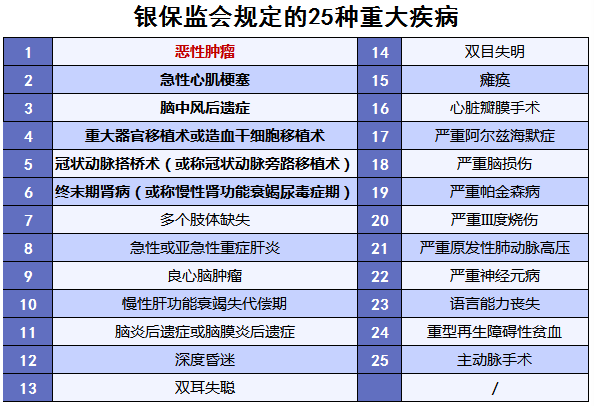

理赔是需要根据不同的状态：确诊即理赔，采取特定治疗方式，达到某种状态后理赔。

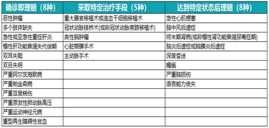

## 重疾理赔十大出险数据

XX保险的重疾理赔十大出险数据：

- 第一位：恶性肿瘤（癌症）为65.0%；
- 第二位：心肌梗塞（急性心肌梗死）为14.4%；
- 第三位：脑中风或脑中风后遗症为5.4%；
- 第四位：冠状动脉绕道手术（3.6%）；
- 第五位：慢性肾衰竭（2.7%）；
- 第六位：良性脑肿瘤（1.4%）；
- 第七位：心脏瓣膜置换术（0.8%）；
- 第八位：重要器官移植或造血干细胞移植术（0.8%）；
- 第九位：肝病末期（0.6%）；
- 第十位：系统性红斑狼疮（0.6%）。

根据《中国人身保险业重大疾病经验发生率表》的更专业权威数据现显示：

**恶性肿瘤占重疾险理赔率的60%以上，前6种重疾占重疾险理赔率的90%左右，前25种占重疾险理赔率的95%-98%。**

也就是说，就算一款重疾险的重大疾病只有25种，也完全能够覆盖大病风险了。

## 重疾保险

### 泰康人寿-乐惠健康2020

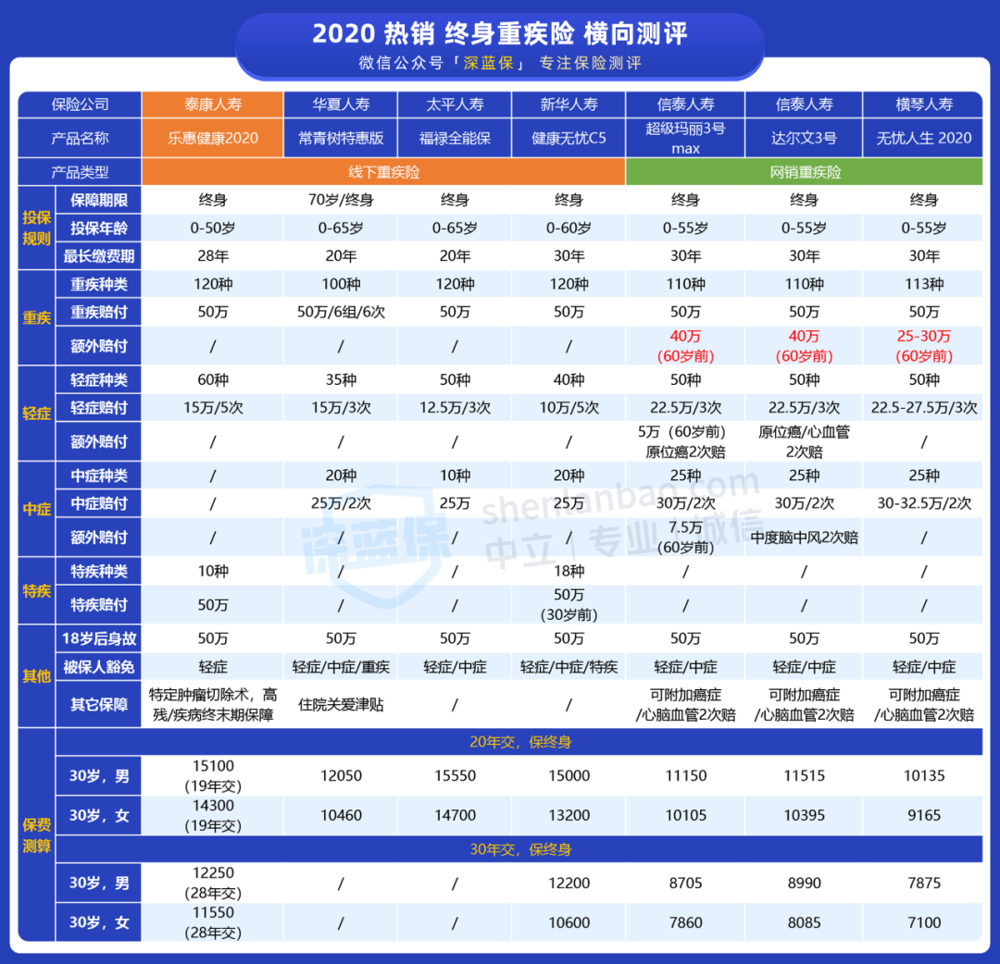

### 信泰人寿-达尔文3号

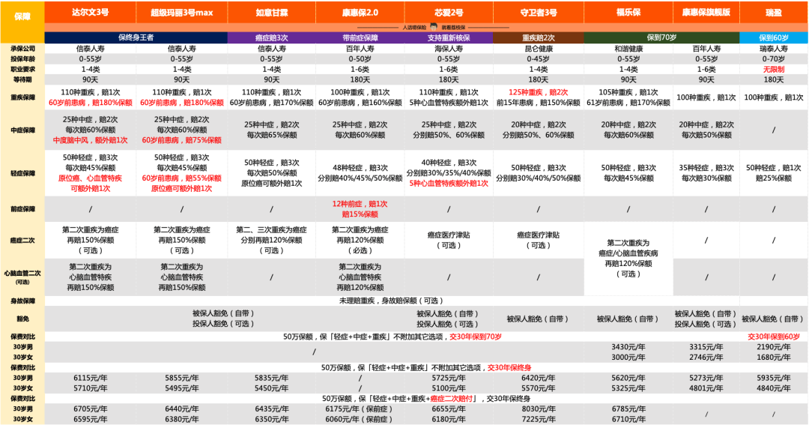

### 达尔文三号保费和现金价值

达尔文三号-不含身故：
【6480/每年，30年共交费194400元】达尔文三号-不含身故，50万保额，30年，含恶性肿瘤扩展金、不含特定心血管疾病扩展金。
【7375/每年，30年共交费221250元】达尔文三号-不含身故，50万保额，30年，含恶性肿瘤扩展金、含特定心血管疾病扩展金。
是否含特定心血管疾病扩展金，年差额：7375-6480 = 895元，30年差额：221250-194400 = 26850 元
不含特定心血管疾病扩展金的现金价值：
39岁 38020
49岁 103310
59岁 160215
69岁 187465
79岁 189495 
89岁 166995
含特定心血管疾病扩展金的现金价值：
39岁 43510元
49岁 11815元
59岁 186815元
69岁 219340元
79岁 222400元（222400-189495= 32905）
89岁 196455元

达尔文三号-含身故：
【9290.00每年，30年共交费278700元】达尔文三号-含身故，50万保额，30年，含恶性肿瘤扩展金、不含特定心血管疾病扩展金。
【10250.00每年，30年共交费307500元】达尔文三号-含身故，50万保额，30年，含恶性肿瘤扩展金、含特定心血管疾病扩展金。
是否含特定心血管疾病扩展金，年差额：10250-9290 = 960元，30年差额：307500-278700 = 28800 元
达尔文三号-含身故，50万保额，不含特定心血管疾病扩展金的现金价值：
39岁 50875
49岁 143260
59岁 243805
69岁 319140 
79岁 390590
89岁 446609
达尔文三号-含身故，50万保额，含特定心血管疾病扩展金的现金价值：
39岁 56695
49岁 159785
59岁 272505
69岁 354010
79岁 427225
89岁 479995

乐惠健康50万：
【11800元每年，28年（免两年）共交费330400】乐惠健康50万-含特疾，含身故，50万保额，30年。
与达尔文三号不含特定心血管疾病扩展金差额：
年差额，11800-9290 = 2510 元
总差额：330400 - 278700 = 51700元
与达尔文三号含特定心血管疾病扩展金差额：
年差额，11800-10250 = 1550 元
总差额：330400 - 307500 = 22900元
乐惠健康50万现金价值：
39岁 48350 
49岁 151500
59岁 269500
69岁 350550
79岁 419950
89岁 474050

附达尔文三号55万的保额：
达尔文三号-不含身故，55万保额，30年，含恶性肿瘤扩展金、不含特定心血管疾病扩展金。
现金价值：
39岁 41822
49岁 113641
59岁 176236
69岁 206211.5
79岁 208444.5
89岁 183661.5

乐惠健康2020的保障内容与达尔文三号的区别：

乐惠健康2020：[乐惠健康 2020](https://www.shenlanbao.com/pingce/768876953334845440) 是一款保终身的重疾险，自带 **特定疾病双倍赔付、特定肿瘤切除术** 保障。

1、投保规则

保障期限，终身。

投保年龄：0-50岁。

等待期：180天。

最长缴费期：28年。

2、保什么

重疾：重疾种类，120种；重疾赔付，50万。

轻症：轻症种类，60种；轻症赔付，15万/5次。

特疾：特疾种类，10种，特疾赔付，50万。

其他：身故、高残、疾病终末期，50万。

特定肿瘤切除术：2.5-10万。

被保人豁免：轻症。

投保人豁免：可附加。

乐惠健康2020优势：

优势1：特定疾病额外赔付

优势2：特定肿瘤切除术保险金

乐惠健康2020产品陷阱：

陷阱1：等待期过长。现在市场上的重疾产品普遍都是90天等待期，乐惠健康2020需要180天，虽然90天与180天在正常情况下，影响不大，但是同样发生理赔的情况下，就是赔或者不赔的问题了。举个栗子：假如被保险人在合同生效日后的120天确诊了恶性肿瘤，那么90天等待期的能赔，180天等待期的不能赔，所以站在被保险人的立场来看，等待期是越短越好的。

陷阱2：缺失高发轻症，没有中症责任，60种轻症居然还会有缺失几种比较高发的轻症。乐惠健康2020没有中症责任，中症责任的好处在于把部分轻症病种放到中症赔付，赔付比例提高，大多是中症赔付比例是50%基本保额，有的甚至高达75%基本保额，这对于消费者是个利好的责任。在轻症方面，乐康健康2020虽然有高达60种轻症，但是也缺失了几个比较高发的轻症，比如微创冠状动脉搭桥术、肝硬化失代偿早期、中度脑炎、中度昏迷、听力严重受损。有人会说有冠状动脉介入手术，但是随着现在医疗技术的提高，针对冠心病，为了更好的治疗效果以及更少的创伤，大多会选择微创冠状动脉搭桥术。简单理解就是有冠心病，要么达到不典型心肌梗塞的理赔标准，要么就做冠状动脉介入手术，要么病情更严重达到严重冠心病理赔标准或者做开胸的冠状动脉搭桥术，才能申请理赔。

陷阱3：特定肿瘤切除术有一定的理赔门槛。虽然新增的特定肿瘤切除术额外保障是个不错的福利，但是获得理赔也有一定的限制，必须要满足三个条件：其一，必须是办理住院之后实施了良性肿瘤切除手术；其二，必须是14种器官中的良性肿瘤；其三，必须明确诊断属于《ICD-10疾病和有关健康问题的国际统计分类》中D10-D48范畴良性肿瘤。举个例子，如果是在门诊做的良性肿瘤切除手术，没有办理住院，不好意思，没得赔。如果确诊的良性肿瘤不在D10-D48范畴，不好意思，也没得赔。不保复发，同一个器官的良性肿瘤仅赔付一次为限，举个例子，假如首次发生的是肝脏良性肿瘤切除手术，第二次肝脏良性肿瘤复发需要再次实施切除手术，这样是不能获得第二次赔付，如果第二次是因为食道良性肿瘤实施了切除手术，就可以获得第二次赔付。

陷阱4.部分疾病定义严格

I型糖尿病：多发于儿童青少年，但可发生于任何年龄，需终身依赖胰岛素治疗。宽松的理赔条件是只要是胰岛素分泌不足导致慢性糖、脂肪、蛋白质代谢异常，并且依赖胰岛素注射180天就能获得赔付。乐惠健康2020在此基础上，要出现三种并发症中的其中一种才能获得赔付。并发症是指“并发增殖性视网膜病变”、“并发心脏病变，已经植入心脏起搏器”与“至少一个脚趾发生坏疽并已经实施手术切除”，明显是要更严格的。严重类风湿性关节炎：宽松的理赔条件是只要达到Ⅲ级且持续180天即可赔付，而乐惠健康2020需要达到Ⅳ级，相对来说严格很多。

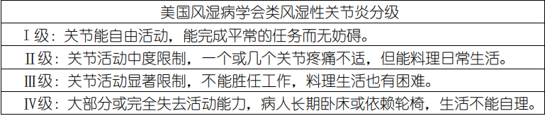

特定疾病额外赔付：

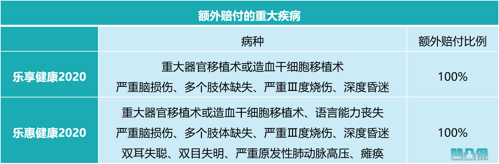

特定肿瘤切除术保险金：

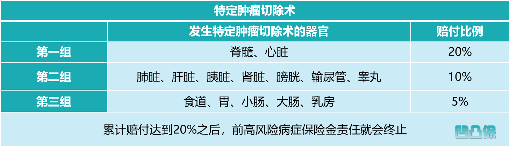

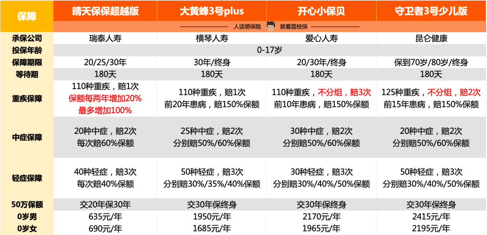

[为什么不同保险公司，保险价格相差巨大？](https://mp.weixin.qq.com/s/GSbAreKt8jJX8S32T6EyUA)

[想了解保险理赔？这是我咨询律师、保险专家后的攻略指南](https://mp.weixin.qq.com/s?__biz=MzI4NDExNzg3Mg==&mid=2649594528&idx=1&sn=451c9ee2c6cb76bc543cc8ced9bfa68e&chksm=f39964bfc4eeeda909df76ef5ed52db6c7ba14e693eb480d7ffdec4073ccd7aef391e493d4cc&scene=21#wechat_redirect)

[不同年龄阶段，如何做合适的保险规划？](https://mp.weixin.qq.com/s?__biz=MzI4NDExNzg3Mg==&mid=2649593942&idx=1&sn=9dbfacb33cb98a410906ec3dda1b2a0b&chksm=f3996649c4eeef5fbed3a3d2ca12de5d4bf369d223914d6b2280b4b466156ea487adb68ef1c5&scene=21#wechat_redirect)

[【凹凸评测】泰康人寿|乐惠健康2020：2个亮点，但不足有几个 ](https://www.sohu.com/a/417687555_120714908)

## 保险二十问

1、[为什么不同保险公司，保险价格相差巨大？](https://mp.weixin.qq.com/s/GSbAreKt8jJX8S32T6EyUA)
影响保险定价的主要因素：
① 运营成本不同。不同公司的运营成本是不同的，这些成本包括员工工资、场地租金、客服电话、保单打印配送等等，基本就是一个保险公司要正常运营的全部费用。运营费用在不同的公司差异很大，比如一个在全国很多分支机构的公司，每年要为这些分支机构（类比银行网点）承担着不少的费用支出。而我们知道现在有的互联网保险公司，根本就不开设分支机构，所以大家可以感受一下成本上的压力。
② 预定利率不同。预定利率是保险公司在定价时，根据对投资收益的预测而为保单假设的每年收益率，通俗地说就是保险公司提供给消费者的回报率。更高的预定利率，意味着保险公司承担了更大的成本和投资风险，而大家得到了实惠。更低的预定利率，意味着保险公司的投资风险减轻了，但我们就需要支付更大的成本。
③ 预留利润不同。我们知道不同的公司在销售的时候策略是不同的，有的喜欢高举高打，而有的喜欢薄利多销。无论哪种方式都是合理的，这也体现了不同保险公司的竞争策略。那些追求薄利多销的企业，由于产品销量大，也同样取得了不错的利润。

除此之外还有一种情况就是，这些年非常多的新的保险公司成立，这些公司没有过去的历史包袱和负债，是可以适当的减少预留利润的，这也在一定程度上会反映在保险定价当中的。

2、[为啥很多性价比高的保险，为什么都是一些小公司的？](https://mp.weixin.qq.com/s/GSbAreKt8jJX8S32T6EyUA)
保险公司 VS 产品性价比，好保险公司不等于好产品。不同人对公司的认知不同，在我的认知里面保险公司都是大公司，不仅对公司股东资金实力有着严格的要求，而且偿付能力等核心指标都在国家的强力监管之下。

目前市场竞争非常激烈，保险公司为了获得市场，自然有的公司愿意在同等保障责任下价格更低，或者同等价格下保障责任更多更全。不代表小的保险公司性价比都高，而大的保险公司性价比不高。

谨慎由于过分相信某个品牌，而盲目的信任这个公司旗下的全部产品。就算同一公司的产品，产品种类也参差不齐，如果自己并不掌握挑选技巧的话，盲目选择入坑的几率非常大。

3、[买了一份性价比高的保险，会不会保障存在什么问题?](https://mp.weixin.qq.com/s/GSbAreKt8jJX8S32T6EyUA)

市场上有太多太多卖的贵保障却很差的保险产品。选择一份保险产品，我们要明明白白的知道这份产品的保障范围是什么，市场上类似的产品有哪些，都有哪些差异。而不要盲目的把高价格与高保障划等号。

我们买的保险，本质就是和保险公司签订的一份合同，关于保障内容、理赔约定，从签订的那一刻起，就以法律合同的方式确定下来了。理赔和公司大小、规模、知名度是没有关系的，是否能够理赔取决于合同条款本身。

不会因为你有亲戚在保险公司工作，理赔的时候就会照顾你，自然也不会刻意刁难某一个人。保险公司是一个庞大的分工明细的机构，规章制度极为成熟，理赔的标准完全是根据产品条款、相关医学法律指引、公司操作指南进行。只关心你是否能够达到理赔的标准，而从来不关心你是谁！

保险理赔原则就是：不惜赔不错赔不烂赔。一个保险公司每个理赔案件都有严格的流程，要经过完整的督导、检查流程。全省参与理赔的人员有几百人，其中有拒赔权限的，屈指可数。

买保险适合自己最重要，要明明白白买保险。当自己对产品间的差异已经了解的比较清楚了，就算自己多花了钱也要知道花在了哪里。只有自己想明白了，认识清楚了，才可能牢牢的掌握购买主动权，否则一定会被各种观点所影响，在嘈杂的声音中迷失自我。

4、[在小的保险公司买保险，靠谱吗？如果公司倒闭了我买的保险可怎么办呢？](https://mp.weixin.qq.com/s?__biz=MzI4NDExNzg3Mg==&mid=2649593524&idx=1&sn=fd4b607f8434446da6afdf6e7d0ebf0b&scene=21#wechat_redirect)

保险在国内是非常大的行业，除了我们经常听到的老五家（国寿、平安、新华、太保、泰康）保险公司外，过去的20年还有很多特别优秀的保险公司涌现出来。比如大家常听说过华夏人寿、阳光保险、众安保险、生命人寿、安邦人寿等。

每个公司都有自己的发展战略和规划，有的公司重点是网络销售比如众安保险，有的公司擅长通过电话销售比如招商信诺，并不是所有公司都会投放大量的广告，也并不是所有的保险公司都有很多代理人团队，这就造成了很多时候，有的保险公司我们没有听过，这是比较正常的情况。

保险公司会破产吗？答案是保险公司是可以破产的。先看看法律如何规定的：

> 《保险法》第九十二条：经营有人寿保险业务的保险公司被依法撤销或者被依法宣告破产的，其持有的人寿保险合同及责任准备金，必须转让给其他经营有人寿保险业务的保险公司；不能同其他保险公司达成转让协议的，由国务院保险监督管理机构指定经营有人寿保险业务的保险公司接受转让。

改革开放以来，我国的保险公司从2家发展到现在150家，经历了多次的全球金融危机，这期间没有发生过一起破产案例。

就算是保险公司破产后，我们所购买的人寿保险也是有法律保障的，可以照常理赔。2008年美国金融危机发生后，倒闭了100多家银行，包括雷曼兄弟这样全球有名的投行都倒闭而未得到国家的支持，但美国政府斥巨资扶持美国最大的保险公司AIG集团度过难关，说明政府对保险公司的安全性有高度关注。

根据我国法律的规定，如果保险公司破产倒闭，我们所购买的保险有两个去处。首先要转让给其他愿意接受进行兼并重组的公司。如果没有保险公司愿意接手，政府会妥善安排好，国家会指定某家保险公司接手，一般就是国资的非常有实力的保险公司强制性接手。

简单来说，大家不用担心自己的保险因为保险公司破产受到影响，按照我们国家的通行做法，所有涉及国计民生的群体性事件，国家都会进行妥善安置，而且这些是有法律上明文保障的。

如果真的发生了保单转移到其他公司，大家也要留意自己的权益，及时的和新公司保持沟通，以免我们购买的保单成为无人过问的孤儿保单。

5、科学买保险的五大原则？

* **先大人，后小孩**。
* **先规划、后产品**
* **先保额，后保费**
* **先保障，后理财**
* **先人身，后财产**

6、重疾险和百万医疗险的区别是什么?

保障范围：重疾险的保障范围比医疗险要窄，顾名思义，重疾险就保障在约定范围内的几种病，像癌症，脑溢血等几十种重大疾病，但是医疗险那保障范围比重疾险广阔多了，不管是大病小病，去了医院就可以保赔付时间点。

赔付方式：重疾险是提前给付，确诊即赔，只要确诊且满足理赔条件，而且这个钱你可以随意支配，而医疗险是事后报销，最后报销时是需要拿着相关发票去保险公司报销的，不会多赔付钱。百万医疗险是报销型产品，重疾险是给付型产品，百万医疗险是报销在医院治疗的费用，一般会有5千-1万的免赔额，对医院的资质也有一定的要求，优点是不论是什么疾病，只要是住院即可报销重疾险是确诊了某种疾病，就可以找保险公司理赔，保费会一次性给予所以百万医疗险和重大疾病保险是具备相互补充相互依存的条件，那么在经济条件允许的情况下，建议还是两者搭配起来会更有保障。

赔付金额：重疾险是一种给付原则，买几份就赔你几份，比如说买了三份重疾险，保额分别是20万30万50万，如果你不幸得了癌症，那么可以理赔到的金额是100万；医疗险是一种补偿原则，不能重复报销，你实际花了多少钱就会报销多少钱，就算买了几十份也没有用，它们会平均分摊到你到底花的总额度，如果社保的保险已经报销了，那商业医疗保险就不报了。

7、买重疾险要不要附加身故？

> 根据《保险法》第 47 条，投保人有权退保，保险公司应退还保单的现金价值。

所以，虽然消费型重疾险的条款没写身故保障，但投保人是随时可以拿回现金价值的，这也算是一种 “身故保险金”。身故赔保费随着每年缴费上涨，到了 30 年后就稳定在 19.11 万。

而身故赔现价是前期先增加，**在 74 岁到 82 岁之间达到最大值 19.35 万，而且稍微超过了身故赔保费**，之后便逐渐减少为 0，呈抛物线形状。我们知道，目前中国人的平均寿命是 80 岁左右。如果此时百年归老，把赔现价的康惠保 2020 退保，可以拿回来 19 万多，不但比我们交的 15 万保费多，而且也比身故赔保费多。因此，我们不能简单地认为，赔现价的消费型重疾险，身故了保费就会打水漂；我们更不能以为，每年多交 1000 多元的赔保费，肯定比赔现价更好。

结论：赔现价最合适，一来，**花同样的钱，我可以把保额买得更高**。二来，就算几十年后有可能赔得少一点，但那时候 **钱早就贬值了**，所以也就无所谓了。

身故赔保额是目前线下重疾险的主流，这种产品最大的特点是：无论如何，我们都能拿到一笔钱，买 50 万就赔 50 万。虽然人不一定会得重疾，但人终有一死，所以是一定会赔的。

**1、重疾和身故，只能二赔一**

虽然同时保重疾和身故，但两者是共用保额的，只要赔了其中一个，另一个就失效了。

举个例子：

小 A 检查出癌症晚期，治疗没多久便去世了，这种情况只能理赔重疾 50 万，而身故就不赔了。所以这种产品看似保得更多，但实际上并没有赔得更多。

**二、重疾险要不要含身故？**

含身故责任重疾险与身故保障只能赔付其中的一项，如果患重大疾病理赔后，就不再享有身故保障，后续身故也不能获得赔付。

从保障需求的角度讲，重疾保障与身故保障是我们同时需要的，并不是两者其一就可以了，因为它们保障的作用是不同的；

重疾险是保障自己患重疾后的医疗费用，以及患病期间不能工作补充家庭收入损失的；而寿险是为了防止自己在壮年身故，为家庭提供经济来源保障的。

也就是说，患重疾后，我们仍然需要身故保障，特别是在比较年轻的时候患重疾，高额身故保障更为需要，那买含身故保障的重疾险，重疾与身故保障只赔付其中的一项，保障是有缺陷的。

再者我们在上文说过含身故保障的重疾险保费偏贵，小土个人认为考虑到保费可承受能力来说，我会选择不含身故责任的重疾险，因为价格美丽太多了。花两份钱买一份保障，含身故保障的重疾险≠纯重疾险+寿险。小土更倾向于重疾险+定期寿险。

**一、重疾险含身故和不含身故对比**

1、意义不同

（1）不含身故责任重疾险是什么？

不含身故责任的重疾险是指：在保障期间内，只在重疾、重疾导致的身故这两种情况下赔付保额，其他身故退还保费或者现金价值。

简单来说，就是只保轻症、中症、重症，不保身故，一般将此类重疾险成为纯重疾险。

（2）含身故责任重疾险是什么？

含身故责任的重疾险，无论是罹患合同约定的疾病还是其他原因导致的身故，都能得到赔付。

含身故责任的重疾险，保障终身的、带有身故责任的重疾险，人终有一死，必然会身故，因此是肯定能够获得保额的赔付。

含身故保障终身重疾险最吸引人的，并不是保障更齐全，而是它一定能获得保额赔付，要么是患重疾赔付保额，要么是身故赔付保额，总之就是买的保额是一定能拿到的，就类似返本。

很多人买保险最怕买了没有用到，最后钱白交了，感觉自己亏了，因此这也是线下含身故保障终身重疾险畅销的原因。

但是含身故保障的重疾险≠纯重疾险+寿险。

一般重疾险的身故责任理赔要求是合同期内没有发生轻症、中症、重症理赔，才能理赔身故责任。

这里的身故和重疾，只能二选一。赔了重疾，就不能赔身故，身故的保额就作废。没得重疾，那就可以赔身故。

2、保费不同

含身故责任就意味着多了一层保障，想白占保险公司的便宜门都没有。..。.含身故保障的重疾险保费更贵，例如复兴联合康乐e生：同样保到70周岁，含身故保费是4654元，不含身故只要3845元。

很明显，含身故责任的重疾险因为多加了一份含身故保障，保费增加了很多。

就保费而言：含身故责任重疾险＞不含身故责任的终身重疾＞含身故责任的定期重疾＞不含身故责任的定期重疾。

3、现金价值不同

现金价值就是你退保时能够退回的金额，也是对不带身故责任的重疾险，身故时可以获得的赔偿金额。

定期重疾险含身故和不含身故现金价值也有差异，对于定期重疾险来说，它的现金价值随着缴费年限的上升逐年增加，在到期日前几年的时候到达最高点，然后加速减少，直至到期日现金价值为0。

这种趋势对于含身故和不含身故责任的重疾险都是相同的。

终身型重疾险含身故和不含身故责任的现金价值差异是，对于保障终身的重疾险来说，含有身故责任，现金价值会一直增长，直至达到保额，就像做储蓄一样；

不含有身故责任的终身型重疾险最终归。

# ETF：交易型开放式指数基金

巴菲特：通过定期投资指数基金，一个什么都不懂的业余投资者往往能够战胜大部分专业投资者；

彼得林奇：只有少数基金经理能够长期持续战胜市场指数；

罗杰斯：我非常看好被动投资。ETF 提供了更加便宜，更加方便的交易方式。关键一点是早一点找到好的投资人。

## ETF 基金概念

交易型开放式指数基金，通常又被称为[交易所交易基金](https://baike.baidu.com/item/交易所交易基金/8841419)（Exchange Traded Fund，简称ETF），是一种在[交易](https://baike.baidu.com/item/交易/32757)所上市交易的、基金份额可变的一种开放式基金。

交易型开放式指数基金属于开放式基金的一种特殊类型，它结合了[封闭式基金](https://baike.baidu.com/item/封闭式基金/260502)和[开放式基金](https://baike.baidu.com/item/开放式基金/260408)的运作特点，投资者既可以向基金管理公司申购或赎回基金份额，同时，又可以像封闭式基金一样在二级市场上按市场价格买卖 ETF 份额，不过，[申购](https://baike.baidu.com/item/申购/2056752)赎回必须以一篮子股票换取基金份额或者以基金份额换回一篮子股票。

ETF 是被动操作的指数基金，投资的证券皆是所要跟踪标的指数的成分证券，各证券在基金资产中的权重与跟踪标的成分证券的权重保持一致，无论是完全复制指数还是抽样复制，基金管理人都在进行**被动投资，很少进行主动管理。**

* 封闭式基金：封闭式基金(Closed-end Funds)，是指基金规模在发行前就已固定，发行结束后，基金对外封闭，资本规模在规定的期限内固定不变，不会减少也不会增加基金份额。封闭式基金在封闭期间不能赎回，但挂牌上市的基金可以通过二级市场（证券交易所）进行转让交易，份额保持不变。
* 开放式基金：开放式基金（Open-end Funds），是一种基金规模不固定，可以随时根据投资者需求发行新份额、也可随时被投资者赎回的基金。开放式基金不在交易所交易，一般是由商业银行、证券营业部等第三方机构代销。我们常见的股票基金、债券基金、混合基金、QDII 基金都属于开放式基金。

## ETF 基金分类

按照**投资标的**来分类，目前市场上 ETF 可以分为5大类：股票型、债券型、[货币](http://data.eastmoney.com/cjsj/hbgyl.html)型、商品型和跨境型 ETF。

**股票型 ETF** 在 ETF 市场中占据着主导地位，根据跟踪的指数可以大致细分为**宽基ETF**、**行业ETF**、**主题ETF**和**策略指数ETF**（如成长型、价值型）等。

宽基 ETF，如[沪深300](http://quote.eastmoney.com/zs000300.html)、中证500、[上证50](http://quote.eastmoney.com/zs000016.html)等，其成分股覆盖各行各业，反映的是市场整体情况。

行业 ETF 主要有金融、消费、生物医药、军工、能源、半导体、通信设备等行业指数组成，基本上市场上各大行业都有相应的指数基金，比如半导体 ETF 就是行业中的新秀。

主题 ETF 主要跟踪一系列创新主题指数， 贴合市场和政策热点，按照主题挑选相关的成分股来构建标的指数，则可以更好地满足投资者多元化的需求。例如近期发行的粤港澳大湾区 ETF 和 5G 通信主题 ETF。

策略 ETF 是市场上被称为“聪明指数”的Smart Beta基金，在传统指数的基础上，通过因子优化选股或因子优化分配权重的方式来编制指数，希望借助因子风险暴露来获得更好的收益。

**债券型 ETF **是指以债券指数为跟踪标的的 ETF。通过投资债券 ETF，便可以实现对一篮子债券的投资，从而让个人投资者可以更便捷、机构投资者可以更高效地投资固定收益市场。另外相比传统[债券基金](http://fund.eastmoney.com/ZQ_jzzzl.html)，债券 ETF 组合分散度高，有效降低了个券影响。

**货币型 ETF **指既可以在交易所场内申购赎回，也可以在交易所二级市场买入卖出的货币市场[基金](http://data.eastmoney.com/zlsj/)。货币ETF最大的特点是可以进行T+0回转交易，即买入的份额当天就能卖出，而且日内买卖次数不限，帮助投资者随时把握股市机会，实现[货币基金](http://fund.eastmoney.com/HBJJ_dwsy.html)和股票投资的无缝对接。

**商品型 ETF** 的跟踪标的是各类商品指数，商品种类包括黄金、石油、[有色金属](http://stock.eastmoney.com/hangye/hy478.html)、[农产品](http://quote.eastmoney.com/sz000061.html)等。商品 ETF 还可以具体分为商品现货 ETF 和商品期货 ETF，分别跟踪商品现货价格和商品期货价格的走势。

**跨境型 ETF** 是[QDII](http://fund.eastmoney.com/QDII_jzzzl.html)基金的一种特殊形式，以海外市场指数为跟踪标的且在国内交易所上市，可以帮助境内投资者轻松实现全球化资产配置。与普通 QDII 基金相比，跨境 ETF 还有费率更低、交易更便捷、组合透明度更高等优点。

按照**投资策略**来分类，ETF 基金可以分为**被动型 ETF**、**Smart beta ETF**和**增强型 ETF**。

**被动型 ETF **采用的是指数化投资策略，追求跟踪误差的最小化。目前国内ETF产品大多数是被动指数型。

**Smart beta ETF **策略不再追求对指数的紧密跟踪，而是在指数编制过程中对一个或多个风格因子主动暴露，例如红利因子、低波因子。通过优化选股方式和权重安排方式，以期跑赢传统市值加权指数，获得超额收益。

**主动型 ETF**则是在被动跟踪指数的基础上，加入了主动投资操作，在投资策略上更加灵活。根据上交所报告显示，多只增强型ETF已正式受理，涵盖沪深300增强ETF、中证500增强ETF、上证50增强ETF。

## ETF 基金交易

ETF 在交易方式上结合了封闭式基金和开放式基金的交易特点，既可以在场内交易所买卖交易，也可以在场外进行申购、赎回。

场内买入卖出：和普通的[封闭式基金](https://baike.baidu.com/item/封闭式基金)一样，ETF也可以在[证券交易所](https://baike.baidu.com/item/证券交易所/254828)直接和其他投资者进行交易，交易流程和股票的交易是类似的，交易的价格由买卖双方共同决定，这个价格往往与基金当时的净值有一定差距。

场外申购赎回：和普通的开放式共同基金一样，可以按照当天的基金净值向基金管理者申购，但是 ETF 的最小申购份额通常比较大，普通投资者很难通过这一方式进行申购。

买进（申购）基金份额有两种方式，一是现金，二是用一揽子股票。但在卖出或赎回时，投资者得到的是一揽子股票而非现金。

## ETF 基金优点

* 分散投资降低投资风险、不会选个股也能买。被动式投资组合通常较一般的主动式投资组合包含较多的标的数量，标的数量的增加可减少单一标的波动对整体投资组合的影响，同时借由不同标的对市场风险的不同影响，得以降低投资组合的波动。ETF 基金的唯一要求就是选择看好的行业或宽基，在好的价格买入即可。
* 指数涨跌，操作公开透明。ETF 基金是被动型基金，原则性非常强，追踪的目标就是股票指数，这些指数的成分股和占比非常透明，每日公布PCF（申购赎回清单），买了哪些股票，仓位比例多少，投资者自己是最清楚的，这在一定程度上减少对基金经理的依赖，因此专业投资者大都青睐 ETF。
* 可以进行套利操作。通过 ETF 做跨一二级市场的套利是合规且合法的，ETF套利的逻辑是当一级市场的净值价格（以IOPV为参考）和二级市场的交易价格（竞价价格）之间出现偏离，这样就存在跨一二级市场的套利空间，从而促成套利行为。
* 手续费低。基金的费用主要包括申购费、赎回费、托管费、管理费。但是ETF基金在场内交易，因此不需要申购和赎回费用，而是跟买股票一样只需要少量的交易佣金，少量的托管费和管理费（场外基金是场内基金的5-10倍），场内 ETF基金虽然也在股票账户交易，比起股票又少了个印花税。
* 品种覆盖全，配置更全面。ETF 投资的品种已经覆盖到了全世界的品种，我们可以通过 ETF 投资A股、港股、美股、欧股、黄金等等，通过 ETF 的投资，我们基本上可以将资产配置到全球的资本市场，ETF 真的是小资金撬动大市场的神奇工具。
* 流动性好。ETF 基金在二级市场上交易跟股票基本无差，可以每15秒刷新一次报价，一些品种甚至可以实现T+0回转交易，比起每日公布一次净值的开放式基金，资金利用效率更高。

ETF 的最大的好处是它能够像股票那样被随时买卖，同时可以帮助投资者以比较低廉的价格达到多元分散的指数投资目的。

## ETF 基金套利

通过 ETF 做跨一二级市场的套利是合规且合法的，也就是说ETF套利是合规合法的，目的是砸平ETF所代表的一揽子股票在当前ETF基金的一级市场和二级市场之间的价差，让指数及其价格回归理性。

ETF套利的逻辑是当一级市场的净值价格（以IOPV为参考）和二级市场的交易价格（竞价价格）之间出现偏离，这样就存在跨一二级市场的“套利空间”，从而促成“套利行为”，分为**折价套利**和**溢价套利**两种：

**折价套利**，当ETF二级市场交易价格低于ETF净值，即在二级市场发生了折价交易时，投资者可以通过在二级市场用现金按照交易价格低价买进ETF，然后在一级市场按净值赎回ETF(用ETF基金换一揽子股票)，得到的一篮子股票再通过股票的二级市场上卖掉转换为现金，从而实现“现金到现金”的套利交易；

**溢价套利**，当ETF二级市场交易价格高于ETF净值，即在二级市场发生了溢价交易时，投资者可以在二级市场买进ETF相对应一揽子股票，然后再用这一揽子股票到一级市场向基金公司申购ETF(用一揽子股票换ETF基金)，得到的ETF基金再去ETF的二级市场上以交易价格（高价）卖掉得到现金，从而实现“现金到现金”的套利交易。

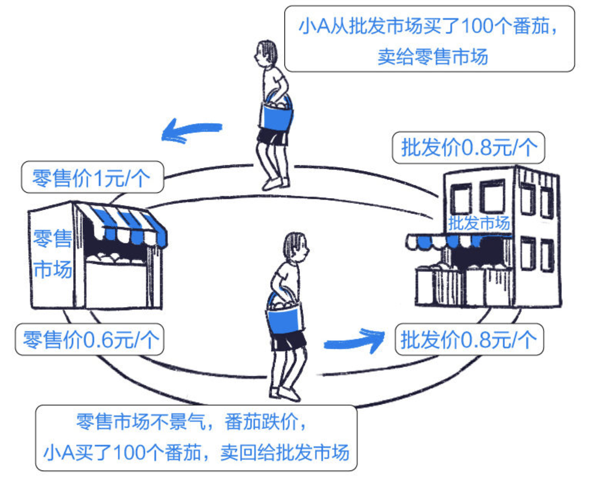

套利交易是完全合法合规的，它遵循着一条二级市场单向操作 -> 一级市场申赎 ->二级市场逆向操作，这样简单的规律。而且合规的套利操作有一个简单的原则，就是所见即所得，也就是说要瞬时交易，这是监管部门辨别是否是合规套利的关键。

# 资产配置：全天候配置策略

无论是雨天还是晴天，我们都期望投资者的资产可以保持稳健增值。

## 全天候策略概念

全天候配置策略（All Weather Strategy）起源于桥水基金的创始人瑞·达里奥，目的是为自己的家庭资产创建一个能适应各类经济环境的投资组合，以确保后代不用完全依赖于受托人的资产管理能力，意思就是说把家族财富长久地传承下去，保证能对抗通胀以及全球市场波动的风险，以实现在今后的100年中，放心地把钱投入进去而不用担心。

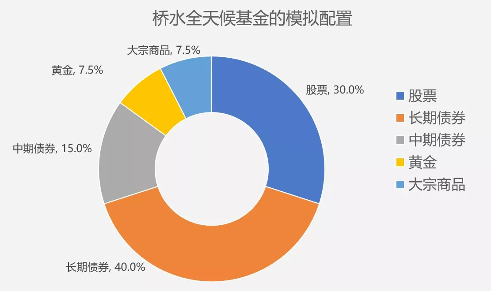

原版的全天候策略是由达里奥的桥水基金1500多名专业的研究人员共同打磨和研究出来的，作为非专业的投资者我们是没必要完全复制的，也无法复制。

## 全天候策略组成

全天候策略归根结底在解决两个问题，一是配置什么资产，二是每种资产应该配置多少比例。

关于配置什么资产，应当从理解宏观环境和各类资产的微观属性出发。首先，宏观环境主要受经济增长和通货膨胀影响。其次，每种资产都具有各自的状态偏好，即在不同市场状态下有不同的表现，比如经济增速超预期时，股票和大宗商品等会表现得相对较好。

不同的经济周期配置不同的大类资产（股票类、债券类、现金类、黄金大宗商品类），可以获得截然不同的收益表现。在经济景气的时候，买股票型基金用于进攻，在经济低迷衰退的时候，买债券型基金用于防守。

关于配置多少比例的资产，与其说全天候策略是在配置资产，不如说它是在配置风险。全天候强调不需要对未来做出预测，因为我们大多数人都无法准确地预测宏观环境，更无法知道哪种资产会在接下来表现得相对出色。

针对这个事实，全天候给予4种经济状态相等的风险权重，即每种状态下的资产或者资产组合对于基金的风险贡献都是25%。在此基础上，再计算出每种资产应该配置的比例。

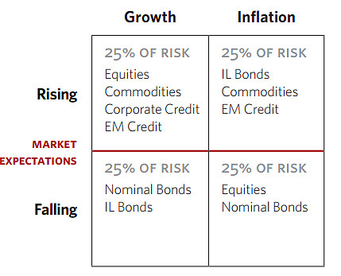

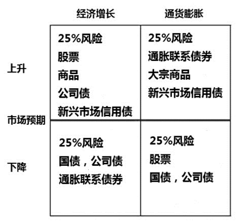

无论处于什么经济周期，全天候策略都可以很好地控制风险敞口，投资者都有望实现资产的稳健增值，获得相对稳健的回报，并且无需任何主动管理。比如：如果从经济增长上行转变为通胀上行，那么第二象限中资产（比如股票、商品）的损失就可以由第一象限中资产（债券）的盈利弥补。

## 简化版的全天候策略

根据达里奥自己在公开资料上发表的资产组合情况来看，简化版全天候策略一样可以产生不错的收益，实现对抗不同经济环境的效果。

全天候策略的简化版主要包括以下几大类资产：

> 美国大盘股：18%；
>
> 美国小盘股：3%；
>
> 其他发达国家股票：6%；
>
> 新兴市场国家股票：3%；
>
> 十年期美国债券：15%；
>
> 三十年期美国债券：40%；
>
> 大宗商品：7.5%；
>
> 黄金：7.5%。

总体来看，简化版的全天候策略的特点主要包括以下几点：

* 这个策略的组合把30%的股票进行了深度细化，分别分配给了美国大盘股、美国小盘股、其他发达国家股票以及新兴市场股票（发展中国家股票）这四部分。

* 全天候策略相比于永久组合策略，增加了大宗商品这个资产类别，在高通胀的环境下，可以较好地控制回撤。

* 从资产大类来看，全天候策略组合包括30%的股票、55%的政策债券、7.5%的黄金以及7.5%的大宗商品。

# 资产配置：美林时钟理论

## 美林时钟概念

美林时钟（The Investment Clock）起源于2004年，由美林证券提出，基于对美国1973年到2004年的30年历史数据的研究，将资产轮动及行业策略与经济周期联系起来，是资产配资领域的经典理论。

这个理论根据经济增速和通胀的高低，把经济周期分为四个阶段，并且指导我们，在不同的经济阶段要怎么配置资产。美林投资时钟将经济周期分为衰退、复苏、过热、滞胀四个阶段，并依次推荐债券、股票、大宗商品或现金的资产配置。

美林时钟的两个重要指标：GDP（**国内生产总值**）与CPI（**居民消费价格指数**）。

**GDP**全称是Gross Domestic Product，表示**国内生产总值**，是**衡量**国家经济状况的最佳指标之一。

**CPI** 全称是**Consumer Price Index**，表示**居民消费价格指数**，是反映居民家庭所购买的消费品和服务项目**价格水平**变动情况的**宏观经济指标**。

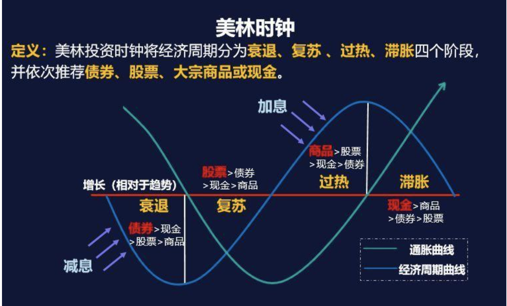

## 四种经济周期

经济增长（GDP增速）和通胀速度（CPI增速）始终处于动态变化中，增速有高有低。将增速按照高低划分，就出现了4种可能，这就是美林时钟所描述的经济周期的4种状态。

经济周期的4个阶段：

* 复苏阶段（**股票为王，债券次之**）：经济上行，通胀下行，这个阶段  **高GDP+低CPI**。

* 过热阶段（**商品为王，股票次之**）：经济上行，通胀上行，这个阶段是  **高GDP+高CPI**。

* 滞胀阶段（**现金为王，商品次之**）：经济下行，通胀上行，这个阶段是 **低GDP+高CPI**。

* 衰退阶段（**债券为王，现金次之**）：经济下行，通胀下行，这个阶段是 **低GDP+低CPI**。

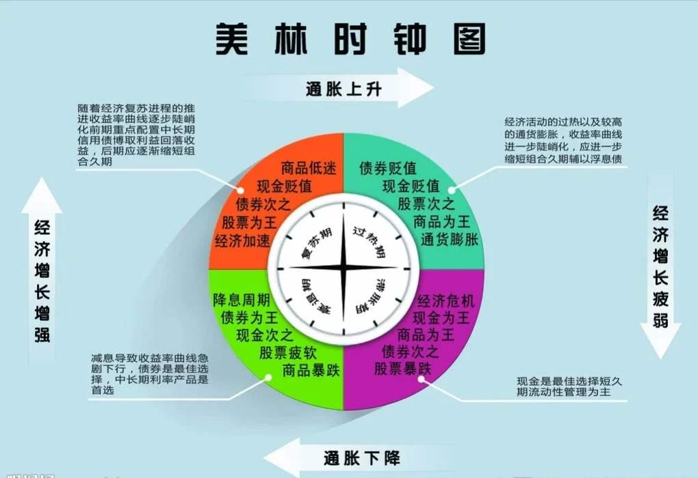

经济周期的循环是按照复苏阶段→过热阶段→滞胀阶段→衰退阶段的顺序进行轮换的，在时间和周期的波动下，股票、大宗商品、现金和债券之间，资金来回滚动，就像一个钟表运行的方向一样，为顺时针方向。

## 对应的资产配置

#### 复苏阶段

在复苏阶段，经济刚从低谷中走出，经济在恢复当中，进行投资是比较安全的，尤其是在经济危机很彻底的情况下，会更加强劲地复苏。此时股票价格很低，但随着复苏的进行，市场信心恢复，股票价格会节节高升，这时投资股票，有很大的上涨空间，所以此时持有股票是明智之举。

债券也很不错，因为此时的货币政策也是比较宽松的，再加上此时发生债务违约的风险较小，投资债券的收益尚可，安全性也高。但现金收益低，商品因为低CPI的关系，也不会有多大涨幅，所以这时股票为王，债券次之。

#### 过热阶段

这时CPI慢慢起来了，物价会上涨，[大宗商品](https://xueqiu.com/S/SZ399979?from=status_stock_match)就有利可图。而股票还会保持上涨，但由于风险的累积，这时股票的投资价值就不如复苏阶段了。由于CPI升高，央行可能会采取紧缩的货币政策，这时债券价格会下降，所以投资债务没有优势，现金的收益也很低。这个阶段，商品为王，股票次之。

在过热阶段，债券是不应配置的大类资产，因为高通胀会导致央行采取加息这类手段，这对债券而言是一种利空。另一方面，物价水平的持续上涨会刺激大宗商品（如原油、钢铁、农产品等）的价格，也可适当考虑配置此类资产。

#### 滞胀阶段

这个时期，经济开始下行，股票的表现就要变差了，所以股票不再是好的选择，而这时通货膨胀还在继续，所以商品的投资价值依然在，但是风险在增加。这时一般来说，央妈还是需要通过紧缩的货币政策来降低CPI，债券价格依然会下降。当然，如果央妈打算拯救GDP而非CPI，可能会采用宽松的货币政策，这时高信用等级的债券反倒是最好的投资品。在滞胀阶段，整个市场的风险都很大，所以持有现金比较安全，所以现金为王，商品次之。但要是央妈采取的是宽松的货币政策，高信用等级债券会是一个很好的选择。

滞胀阶段我们做资产配置的首要目标，应该是“本金安全”，策略是“现金为王”。对于普通投资者而言，把大部分资金配置成安全性高、流动性好的货币基金，应该是最为稳妥的选择。

#### 衰退阶段

这个时期物价增长和经济增长都在放缓，股票和商品的表现都不怎么样。央妈为了拯救经济，肯定要出台刺激政策，货币政策会进一步宽松，债券的价格上涨。此时债券为王，现金次之。但此时的股票价格会出现低点，随着经济复苏的临近，股票的吸引力会越来越大，这是抄底的机会。

从战略角度来看，衰退阶段是非常好的布局证券市场的机会，当大家都不看好股市的时候，更大的机会也在慢慢酝酿。

## 美林时钟的应用边界

理论的应用边界：美林时钟只是根据历史数据给人们一个大致的资产配置方向，市场瞬息万变，还需要理论联系实际。美林时钟理论是存在应用边界的，**不能直接套用于任何地区、任何时间**。

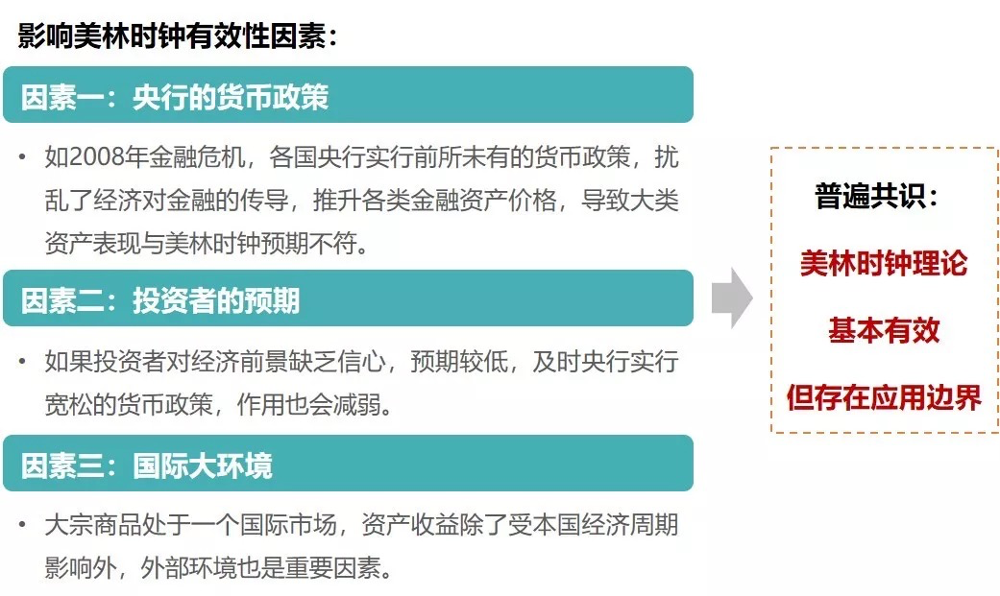

# 基金

## 必读文章

[中概互联集体大跌，别怕-力哥](https://baijiahao.baidu.com/s?id=1687472527380305812&wfr=spider&for=pc)

## 关注基金

中概互联：

中概50或中概互联（**中概互联龙头指数**）：中证海外中国互联网50指数（H30533）。

中国互联：中证海外中国互联网指数（H11136）。

指数型-偏股：

招商中证白酒指数：（161725）。

景顺长城新兴成长混合：（260108）。

光大新增长混合：（360006）。

## 基金术语

### 折价率

> 基金的折价率=（单位份额净值-单位市价）/ 单位份额净值。

根据此公式折价率大于0时为折价，折价率小于0时为溢价。

## 基金概念

### A股、B股、H股、N股和S股概念

A股：正式名称是人民币普通股票。

> 由中国境内的公司发行，供境内机构、组织或个人（不含台、港、澳投资者）以人民币认购和交易的普通股股票，A股不是实物股票，以无纸化电子记账。

B股：正式名称是人民币特种股票。

> 它是以人民币标明面值，以外币认购和买卖，在境内(上海、深圳)证券交易所上市交易的外资股，B股公司的注册地和上市地都在境内(深、沪证券交易所)，只不过投资者在境外或在中国香港、澳门及台湾。

H股：H股也称国企股。

> 指注册地在内地、上市地在香港的外资股。（因香港英文——HongKong首字母，而称得名H股。）

N股：是指在中国大陆注册、在纽约(New York)上市的外资股。

S股：是指尚未进行股权分置改革或者已进入改革程序但尚未实施股权分置改革方案的股票，（因新加坡英文——Singapore首字母，而称得名S股。）

### 上证50指数、沪深300指数、中证500指数和深圳100指数

上证50指数[（中证指数有限公司编制）](http://www.csindex.com.cn/zh-CN)：上证50指数是根据[科学](https://baike.baidu.com/item/科学/10406)客观的方法，挑选上海[证券市场](https://baike.baidu.com/item/证券市场/2986895)规模大、流动性好的最具代表性的50 只股票组成[样本股](https://baike.baidu.com/item/样本股/9474844)，以便综合反映上海证券市场最具市场影响力的一批[龙头企业](https://baike.baidu.com/item/龙头企业/2268324)的整体状况。

沪深300指数[（中证指数有限公司编制）](http://www.csindex.com.cn/zh-CN)：沪深300指数由上海和深圳证券市场中市值大、流动性好的300只股票组成，综合反映中国A股市场上市股票价格的整体表现。

深圳100指数（[深圳证券交易所编制](http://www.szse.cn/)）：深证100指数也是从 **深圳证券交易所** 中2231多只上市公司股票中，按照规模大小和流动性排名选出的前100只规模比较大的股票组成的成分股做成的指数。

中证500指数：中证500指数由全部A股中剔除沪深300指数成份股及总市值排名前300名的股票后，总市值排名靠前的500只股票组成，综合反映中国A股市场中一批中小市值公司的股票价格表现。

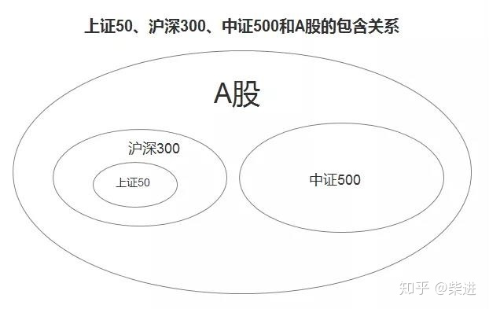

### 中概互联与中国互联

> 中概股，全称是中国概念股，泛指所有在海外上市的中国企业。

> 中概互联，泛指所有在海外上市的中国互联网企业，比如腾讯、阿里、百度、京东、网易、美团等。

两个跟踪中概互联的指数：

中概50或中概互联（**中概互联龙头指数**）：中证海外中国互联网50指数（H30533）。

中国互联：中证海外中国互联网指数（H11136）。

两个指数的相同点：编制机制基本相同，选股范围都是海外上市的互联网公司，都是按照自由流通市值加权。

两个指数的不同点：中概50只聚焦最头部的50家互联网公司，而中国互联包含所有海外上市的互联网公司，理论上成分股没有上限，可以是60只、70只，甚至更多。刚开始时的时候两个指数单个股票的权重上限都是10%，2019年5月，中概50为了区别这两个指数，将单个公司的权重上限调到30%。

### 恒生[互联网](https://link.zhihu.com/?target=https%3A//xueqiu.com/S/SZ160636%3Ffrom%3Dstatus_stock_match) ETF

### ETF基金和LOF基金

烟跃

北京德沃哲教育线上平台：

1、第一期计划投资150万元人民币是如何规划的，为何是150万元人民币？第一期150万元人民币将会用在哪些方面？

2、2021年营收目标：北京德沃哲2021财年需要完成1500万元人民币流水，净利润15% ，即225万元人民币。

不清楚的地方1：1500万人民币流水具体需要靠哪些业务来实现？和马德里德沃哲的业务不同点和关联点是什么？

不清楚的地方2：净利润15%是依据什么来计算的？

3、分红兑现按照净利润贡献比来计算。

不清楚的地方1：净利润贡献比的具体方案是什么？

不清楚的地方2：技术股如何计入KPI？

4、退出机制的具体方案？当贡献率低于10%，如何退出？

5、进入、退出、分红机制：

进入机制：技术合伙人以技术入股估值入股，其他合伙人按照出资比例注资入股，按照约定期限完成各自出资比例。

退出机制：一年内若合伙人对公司贡献率低于10% ，责强制执行退出机制。需给出退出机制具体方案的内容。

分红机制：

6、股权及营收比例的内容：

股权比例（现金股权比例、非现金股权比例、预留期权比例）：

营收比例:

7、定岗、定KPI、定股权的具体内容：

定岗：

定KPI：

定股权:

8、技术入股相关问题：

入股的方式：与资金方共同联合研制、开发新产品。

入股的标的：明确入股的标的，究竟入股的是一项产品的使用权还是所有权，技术方入股后资金方是可以把产品卖了还是仅仅只能使用呢？

各位同事，大家好，根据德沃哲此前的运营情况以及我们对公司下一年度的运营规划，做出以下部署，请各位知悉，如有异议，随时提出商讨。

1、自2021年1月1日起正式开始投资建设德沃哲教育线上平台，第一期计划投资150万元人民币，CTO王雄以技术入股，其他合伙人按股权比例投资，1月31日前兑现50%，3月31日前兑现全部。
2、根据2020年12月对2021年营收目标，北京德沃哲2021财年需要完成1500万元人民币流水，净利润15% ，即225万元人民币。分红兑现按照公司净利润贡献比计算，技术股在公司中的关键要素也将计入KPI。1年内若合伙人对公司贡献率低于10% ，责强制执行退出机制。
3、北京德沃哲将从2021年1月1日正式公司化运营，对注资方式有实际困难或不认同分红模式的股东，可在本次重组时退出。
最后，感谢所有股东、同事在2020年为北京德沃哲贡献的一切。

股权的比例及分配问题：

**1、现金股权比例（40%），根据出资确定。**

**2、非现金股权比例（50%）,根据过去经验、资源、创业承担职责等确定。**

**3、预留期权比例(10%)，为后期激励使用。**

当技术人员有意与出资方合伙创业的时候，**最关心的问题当然是双方之间的出资比例了。**

这里需要明确的概念是：材料工程师技术出资也是出资，只不过属于“无形资产”，但是它是有价值的。出资比例一旦明确，就是股权比例的明确。而**股权比例意味着材料人作为公司股东所应享有的权利大小，包括：表决权、分红权、查询权等等。**

**1、明确技术入股的方式和标的**

技术入股的方式一般有两种，**一种是和资金方共同联合研制、开发新产品；另一种是以技术方现成的技术成果折合成股份出资。**此外，入股的标的需明确，究竟入股的是一项产品的使用权还是所有权，技术方入股后资金方是可以把产品卖了呢？还是仅仅只能使用呢……以防止双方因入股标的问题产生争议。

**2、约定好保密协议**

技术入股的价值在于其独有的创造性，往往具有高度的知识产权，而基于一项技术往往开发困难复制容易，材料人**必须留一个心眼，与资金方约定好保密协议**。否则辛辛苦苦开发出来的产品，很有可能成为他人的嫁衣。

**3、约定因技术价值调整而产生的利益变化**

技术价值作为无形资产，其估值的浮动性还是很大的，一项不被看好的技术很有可能摇身一变成为公司的摇钱树，也有可能时下当红的技术过了几天就成为了昨日黄花。不管咱们的技术是越来越值钱还是越来越贬值，**合作的初衷就是谁也不坑谁，要盈利一起盈利，要亏一起亏。**

**4、违约责任需重视**

不管在什么类型的合同中，违约条款都是非常重要的组成部分，其价值就在于增加双方的违约成本，促使双方牢牢遵守约定。

除去以上几点，就是**合同的常规性审核了，**例如该如何保证资金方出资到位，不会中途撤资，是否有不良资产……你可以把合同每一例条款看成一种材料，必须明确且整体相互对应，恰似一套系统产品研发，如果不够细致严谨，日后出现BUG的几率非常之大，倒也不是不可以打打补丁，不过代价几何，谁也不能保证

进入机制：

退出机制：

股权机制：

分红机制：

股权结构：

营收比例:

定岗：

定KPI：

定股权:

技术合伙人的能力范围：我为什么跟你合伙？

技术系统的

比如对内部施压，研发项目不停的变动需求，调整内容。或者儿戏般的随意设定Deadline。这样的情况下，又该如何呢? 也许有人说，可以脱离了换下家。但是作为股东和作为员工是不同的。股东，退股的时候没有人接手，是退不掉的。不仅如此，还需要承担公司债务，遇到不良的合作人，绝对可以坑死你。技术合伙人到底是公司的股东还是奴隶，是值得深思的问题？

《创业维艰》的作者，本·霍洛维茨，硅谷顶级投资人，在书中有一段话，大致意思就是，“别人都是公司的雇员，可以随时离去，而我却和公司结了婚”。投资人可以有三妻四妾，但是作为技术合伙人，你唯一能够用来投资的资金就是自己本身。于是你不仅仅是和公司结了婚，而且还得到了一个什么都可以干涉的极为强势的掌握家里财政大权的丈母娘。也许这样说还太过温和，更加残酷的现实是，你把自己卖给了公司，给自己找了一个主人。如果主人能吃肉，你可以喝汤。但是主人都吃不饱的，那么你只能饿死了。

如果形成了技术成果，比如专利、非专利技术成果，可以作为非货币出资最重要的在于价值的确定，科学、合理、真实、公平地确定技术的价值，有利于技术成为企业的真实资本和合理股份。

在实践中，技术成果出资入股的作价方式主要有三种：评估作价、协商作价以及两种作价方式的结合。

技术评估作价是指专业的评估机构对出资人的技术成果的价值进行确定的作价方式，即将技术价值进行量化的过程。

协商作价方式是出资人不经评估，自行商定入股技术的作价金额的一种方法，这种作价方式是出资各方在诚信的基础上，通过协商来确定出资技术的价值。 

由于技术的无形特性，不同于货币或实物出资，在出资标的、出资义务及其履行问题上很容易发生争议。

**技术入股股权设计三部曲**

**第一步：入股估值**

**第二步：签订合同**

**第三步：工商登记变更**

