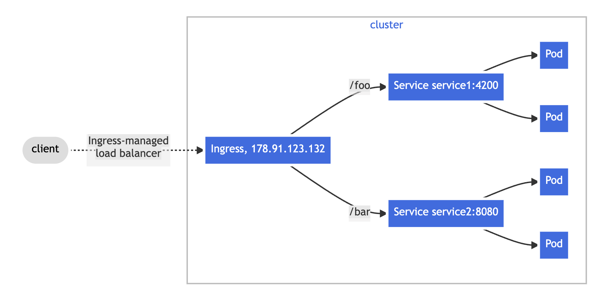
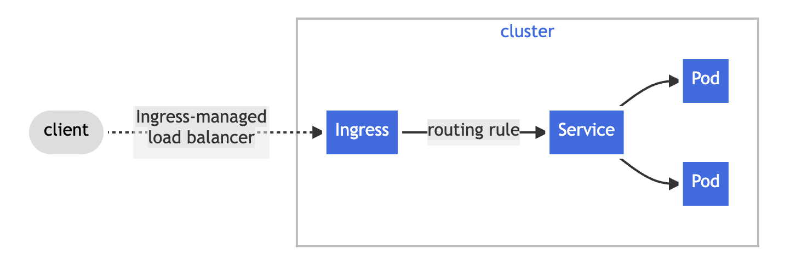
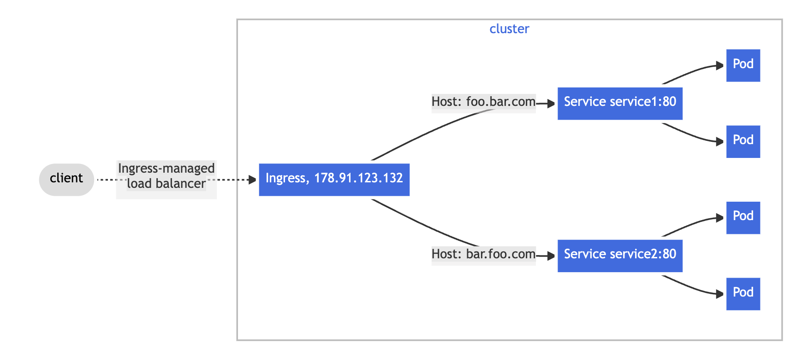
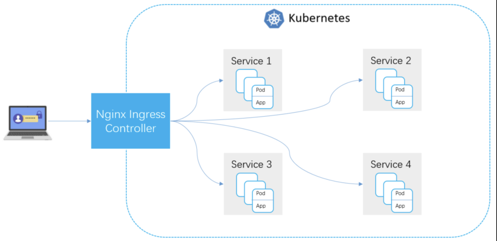
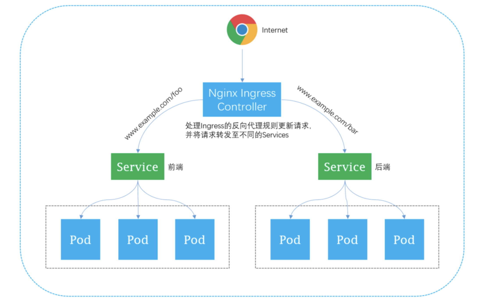

Ingress

[Ingress](https://kubernetes.io/docs/concepts/services-networking/ingress/)

什么是Ingress?

Ingress 是 Kubernetes 集群外部流量7层负载均衡，是集群内 Service 对外暴露7层的访问接入点，通过域名或者访问路径来路由到不同 Service 上，从而达到7层的负载均衡。

什么是 Nginx Ingress Controller ？

为了使得 Nginx Ingress 资源正常工作，K8S 集群中必须要有个 Nginx Ingress Controller 来解析 Nginx Ingress 的转发规则。Nginx Ingress Controller 收到请求，匹配 Nginx Ingress 转发规则转发到后端 Service所对应的 Pod，由 Pod 处理请求。

Kubernetes中Service、Nginx Ingress与Nginx Ingress Controller有着以下关系：

* Service 是后端真实服务的抽象，一个 Service 可以代表多个相同的后端服务。
* Nginx Ingress 是反向代理规则，用来规定 HTTP/HTTPS 请求应该被转发到哪个 Service 所对应的 Pod 上。例如根据请求中不同的 Host 和 URL 路径，让请求落到不同 Service 所对应的 Pod 上。
* Nginx Ingress Controller 是一个反向代理程序，负责解析 Nginx Ingress 的反向代理规则。如果 Nginx Ingress 有增删改的变动，Nginx Ingress Controller 会及时更新自己相应的转发规则，当 Nginx Ingress Controller 收到请求后就会根据这些规则将请求转发到对应 Service 的 Pod 上。

Nginx Ingress Controller 通过 API Server 获取 Ingress 资源的变化，动态地生成 Load Balancer（例如Nginx）所需的配置文件（例如 nginx.conf），然后重新加载 Load Balancer（例如执行nginx -s load重新加载Nginx）来生成新的路由转发规则。

Ingress 场景示例

在常见的前后端分离的架构方式中，前后端的访问地址分别使用不同的访问路径。对应这种场景，可以采用 Ingress，根据7层的访问路径负载到不同的应用实例上。

